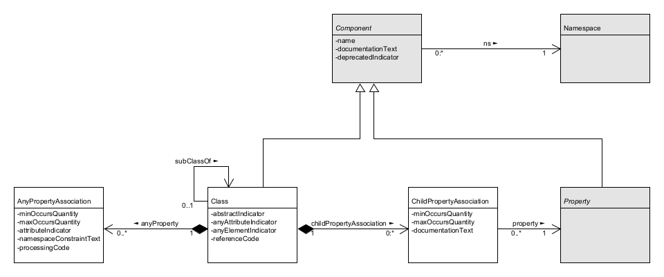
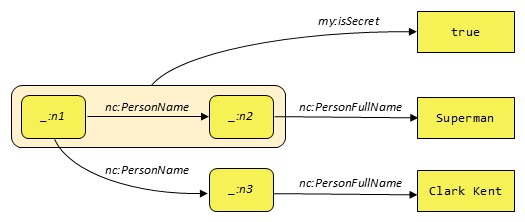

<link rel="stylesheet" href="https://docs.oasis-open.org/templates/css/markdown-styles-v1.7.3a.css" />

<div class="row">
  <div class="column">
    
  </div>
  <div class="column">
    
  </div>
</div>

<!--
If you want to check the line length in code blocks, uncomment this code block,
set the width of your markdown preview window so that the following line does not wrap,
and the terminal "X" is visible without the horizontal scrollbar:
```
.........1.........2.........3.........4.........5.........6.........7.........8.........9.........0.........1.........2.......X
This is the width of a code block when the OASIS-formatted HTML is printed to PDF by Microsoft Edge with 0.4 inch margins
```
-->

-------

# NIEM Naming and Design Rules (NDR) Version 6.0

## Project Specification Draft 01

&nbsp;

#### This stage:
https://docs.oasis-open.org/niemopen/ndr/v6.0/psd01/ndr-v6.0-psd01.md (Authoritative) \
https://docs.oasis-open.org/niemopen/ndr/v6.0/psd01/ndr-v6.0-psd01.html \
https://docs.oasis-open.org/niemopen/ndr/v6.0/psd01/ndr-v6.0-psd01.pdf

#### Previous stage:
N/A

#### Latest stage:
https://docs.oasis-open.org/niemopen/ndr/v6.0/ndr-v6.0.md (Authoritative) \
https://docs.oasis-open.org/niemopen/ndr/v6.0/ndr-v6.0.html \
https://docs.oasis-open.org/niemopen/ndr/v6.0/ndr-v6.0.pdf

#### Open Project:
[OASIS NIEMOpen OP](http://www.niemopen.org/)

#### Project Chair:
Katherine Escobar (katherine.b.escobar.civ@mail.mil), [Joint Staff J6](https://www.jcs.mil/Directorates/J6-C4-Cyber/)

#### NTAC Technical Steering Committee Chairs:
Brad Bolliger (brad.bolliger@ey.com), [EY](ey.com) \
James Cabral (jim@cabral.org), Individual \
Scott Renner (sar@mitre.org), [MITRE](https://mitre.org/)

#### Editors:
James Cabral (jim@cabral.org), Individual \
Tom Carlson (Thomas.Carlson@gtri.gatech.edu), [Georgia Tech Research Institute](https://gtri.gatech.edu/) \
Scott Renner (sar@mitre.org), [MITRE](https://mitre.org/)

#### Related work:
This specification replaces or supersedes:
* _National Information Exchange Model Naming and Design Rules_. Version 5.0 December 18, 2020. NIEM Technical Architecture Committee (NTAC). https://reference.niem.gov/niem/specification/naming-and-design-rules/5.0/niem-ndr-5.0.html.

This specification is related to:
* _NIEM Model Version 6.0_. Edited by Christina Medlin. Latest stage: https://docs.oasis-open.org/niemopen/niem-model/v6.0/niem-model-v6.0.html.
* Conformance Targets Attribute Specification (CTAS) Version 3.0. Edited by Tom Carlson. 22 February 2023. OASIS Project Specification 01. https://docs.oasis-open.org/niemopen/ctas/v3.0/ps01/ctas-v3.0-ps01.html. Latest stage: https://docs.oasis-open.org/niemopen/ctas/v3.0/ctas-v3.0.html.

#### Abstract:
TODO

#### Status:
This document was last revised or approved by the Project Governing Board of the OASIS NIEMOpen OP on the above date. The level of approval is also listed above. Check the "Latest stage" location noted above for possible later revisions of this document. Any other numbered Versions and other technical work produced by the Open Project (OP) are listed at http://www.niemopen.org/.

Comments on this work can be provided by opening issues in the project repository or by sending email to the project’s public comment list: niemopen@lists.oasis-open-projects.org. List information is available at https://lists.oasis-open-projects.org/g/niemopen.

Note that any machine-readable content ([Computer Language Definitions](https://www.oasis-open.org/policies-guidelines/tc-process-2017-05-26/#wpComponentsCompLang)) declared Normative for this Work Product is provided in separate plain text files. In the event of a discrepancy between any such plain text file and display content in the Work Product's prose narrative document(s), the content in the separate plain text file prevails.

#### Key words:
The key words "MUST", "MUST NOT", "REQUIRED", "SHALL", "SHALL NOT", "SHOULD", "SHOULD NOT", "RECOMMENDED", "NOT RECOMMENDED", "MAY", and "OPTIONAL" in this document are to be interpreted as described in BCP 14 [[RFC 2119](#rfc2119)] and [[RFC 8174](#rfc8174)] when, and only when, they appear in all capitals, as shown here.

#### Citation format:
When referencing this specification the following citation format should be used:

**[NIEM-NDR-v6.0]**

_NIEM Naming and Design Rules (NDR) Version 6.0_. Edited by Scott Renner. 1 January 2025.  OASIS Project Specification Draft 01. https://docs.oasis-open.org/niemopen/ndr/v6.0/psd01/ndr-v6.0-psd01.html. Latest stage: https://docs.oasis-open.org/niemopen/ndr/v6.0/ndr-v6.0.html.

-------

## Notices
Copyright &copy; OASIS Open 2025. All Rights Reserved.

Distributed under the terms of the OASIS [IPR Policy](https://www.oasis-open.org/policies-guidelines/ipr/).

For complete copyright information please see the Notices section in the Appendix.

-------

# Table of Contents
[[TOC will be inserted here]]

-------

# 1 Introduction

NIEM, formerly known as the "National Information Exchange Model," is a framework for exchanging information among public and private sector organizations. The framework includes a [reference data model](https://docs.oasis-open.org/niemopen/niem-model/v6.0/niem-model-v6.0.html) for objects, properties, and relationships; and a set of technical specifications for using and extending the data model in information exchanges. The NIEM framework supports developer-level specifications of data that form a contract between developers. The data being specified is called a *message* in NIEM. While a message is usually something passed between applications, NIEM works equally well to specify an information resource published on the web, an input or output for a web service or remote procedure, and so forth, basically, any package of data that crosses a system or organization boundary.

NIEM promotes scalability and reusability of messages between information systems, allowing organizations to share data and information more efficiently. It was launched in 2005 in response to the U.S. Homeland Security Presidential Directives to improve information sharing between agencies following 9/11. Until 2023, NIEM was updated and maintained in a collaboration between the U.S. federal government, state and local government agencies, private sector, and non-profit and international organizations, with new versions released around once per year. NIEM defines a set of common objects, the *NIEM Core*, and 17 sets of objects that are specific to certain government or industry verticals, the *NIEM Domains*.

In 2023, NIEM became the NIEMOpen OASIS Open Project. NIEMOpen welcomes participation by anyone irrespective of affiliation with OASIS. Substantive contributions to NIEMOpen and feedback are invited from all parties, following the OASIS rules and the usual conventions for participation in GitHub public repository projects.

NIEMOpen is the term generally used when referring to the organization such as Project Governing Board (PGB), NIEMOpen Technical Architecture Committee (NTAC), NIEMOpen Business Architecture Committee (NBAC), organization activities or processes. NIEM is the term used when directly referring to the model i.e. NIEM Domain, NIEM Model version.

This document specifies principles and enforceable rules for NIEM data components and schemas. Schemas and components that obey the rules set forth here are conformant to specific conformance targets. Conformance targets may include more than the level of conformance defined by this NDR, and may include specific patterns of use, additional quality criteria, and requirements to reuse NIEM release schemas.

## 1.1 Glossary

### 1.1.1 Definitions of terms

| Term                 |  Definition  |
| :----                |  :---  |
| <a name="def-absolute-uri"></a>absolute uri | A Uniform Resource Identifier (URI) with scheme, hierarchical part, and optional query, but without a fragment; a URI matching the grammar syntax `<absoluteURI>` as defined by <a href="#rfc-3986"><b>[RFC 3986]</b></a>. |
| <a name="def-adapter-class"></a>adapter class | A class that contains only properties from a single [<span class="termRef">external namespace</span>](#def-external-namespace). [*see [§4.4](#44-class)*] |
| <a name="def-adapter-type"></a>adapter type | An XSD type definition that encapsulates [<span class="termRef">external components</span>](#def-external-component) for use within NIEM. *(see [§9.4](#94-rules-for-adapters-and-external-components))* |
| <a name="def-appinfo-namespace"></a>appinfo namespace | A namespace defined by a schema document that provides additional semantics for components in the XSD representation of a model. *(see [§9.7](#97-rules-for-machine-readable-annotations))* |
| <a name="def-association-class"></a>association class | A class that represents a specific relationship between objects. *(see [§4.4](#44-class))* |
| <a name="def-attribute-property"></a>attribute property | A data property represented in XSD as an attribute declaration. *(see [§4.8](#48-dataproperty))* |
| <a name="def-augmentation"></a>augmentation | The means by which a designer of one namespace adds properties to a class defined in a different namespace. *(see [§3.7](#37-model-extensions), [§4.15](#415-augmentation-class)*) |
| <a name="def-augmentation-element"></a>augmentation element | An element in an XML message that is a container for one or more [<span class="termRef">augmentation properties</span>](#def-augmentation-property). *(see [§4.15.2](#4152-augmenting-a-class-with-an-element-property-in-xsd))* |
| <a name="def-augmentation-point-element"></a>augmentation point element | An abstract element declaration that provides a place for [<span class="termRef">augmentation properties</span>](#def-augmentation-property) within the XSD representation of an augmented class. *(see [§4.15.2](#4152-augmenting-a-class-with-an-element-property-in-xsd))* |
| <a name="def-augmentation-property"></a>augmentation property | A property added by one namespace to an augmented class in another namespace. *(see [§4.15](#415-augmentation-class))* |
| <a name="def-augmentation-type"></a>augmentation type | An XSD type definition for an [<span class="termRef">augmentation element</span>](#def-augmentation-element). *(see [§4.15.2](#4152-augmenting-a-class-with-an-element-property-in-xsd))* |
| <a name="def-cardinality"></a>cardinality | The number of times a property may/must appear in an object. |
| <a name="def-class"></a>class | A definition of an entity in a model; that is, a real-world object, concept, or thing. *(see [§3.4](#34-the-niem-metamodel), [§4.4](#44-class))* |
| <a name="def-code-list-datatype"></a>code list datatype | A datatype in which each valid value is also a string in a [<span class="termRef">code list</span>](#def-code-list). *(see [§4.12](#412-restriction))* |
| <a name="def-code-list"></a>code list | A set of string values, each having a known meaning beyond its value, each representing a distinct conceptual entity. *(see [§4.12](#412-restriction))* |
| <a name="def-conforming-namespace"></a>conforming namespace | A namespace that satisfies all of the applicable rules in this document; a [<span class="termRef">reference namespace</span>](#def-reference-namespace), [<span class="termRef">extension namespace</span>](#def-extension-namespace), or [<span class="termRef">subset namespace</span>](#def-subset-namespace). *(see [§6.1](#61-conformance-targets))* |
| <a name="def-conforming-schema-document"></a>conforming schema document | A [<span class="termRef">schema document</span>](#def-schema-document) that satisfies all of the applicable rules in this document. *(see [§6.1](#61-conformance-targets))* |
| <a name="def-conforming-schema-document-set"></a>conforming schema document set | A [<span class="termRef">schema document set</span>](#def-schema-document-set) that satisfies all of the applicable rules in this document. *(see [§6.1](#61-conformance-targets))* |
| <a name="def-data-definition"></a>data definition | A text definition of a component, describing what the component means. |
| <a name="def-data-property"></a>data property | Defines a relationship between an object and a literal value. |
| <a name="def-datatype"></a>datatype | Defines the allowed values of a corresponding literal value in a message. |
| <a name="def-documented-component"></a>documented component | A CMF object or XSD schema component that has an associated data definition. |
| <a name="def-element-property"></a>element property | An object property, or a data property that is not an [<span class="termRef">attribute property</span>](#def-attribute-property); represented in XSD by an element declaration. *(see [§4.8](#48-dataproperty))* |
| <a name="def-extension-namespace"></a>extension namespace | A [<span class="termRef">namespace</span>](#def-namespace) defining components that are intended for reuse, but within a more narrow scope than those defined in a [<span class="termRef">reference namespace</span>](#def-reference-namespace). *(see [§3.6](#36-namespaces))* |
| <a name="def-extension-schema-document"></a>extension schema document | A [<span class="termRef">schema document</span>](#def-schema-document) that is the XSD representation of an [<span class="termRef">extension namespace</span>](#def-extension-namespace). |
| <a name="def-external-attribute"></a>external attribute | An attribute declaration in [<span class="termRef">external schema document</span>](#def-external-schema-document). |
| <a name="def-external-component"></a>external component | A component defined by an [<span class="termRef">external schema document</span>](#def-external-schema-document). *(see [§9.4](#94-rules-for-adapters-and-external-components))* |
| <a name="def-external-namespace"></a>external namespace | Any namespace defined by a [<span class="termRef">schema document</span>](#def-schema-document) that is not a [<span class="termRef">conforming namespace</span>](#def-conforming-namespace), the [<span class="termRef">structures namespace</span>](#def-structures-namespace), or the XML namespace `http://www.w3.org/XML/1998/namespace`. *(see [§3.6](#36-namespaces))* |
| <a name="def-external-schema-document"></a>external schema document | A schema document that defines an [<span class="termRef">external namespace</span>](#def-external-namespace). *(see [§3.6](#36-namespaces))* |
| <a name="def-literal-class"></a>literal class | A class that contains no object properties, one or more [<span class="termRef">attribute properties</span>](#def-attribute-property), and exactly one [<span class="termRef">element property</span>](#def-element-property). *(see [§4.4](#44-class))* |
| <a name="def-literal-property"></a>literal property | The [<span class="termRef">element property</span>](#def-element-property) in a [<span class="termRef">literal class</span>](#def-literal-class). |
| <a name="def-local-term"></a>local term | A word, phrase, acronym, or other string of characters that is used in the name of a namespace component, but that is not defined in OED, or that has a non-OED definition in this namespace, or has a word sense that is in some way unclear. *(see [§4.16](#416-localterm))* |
| <a name="def-message"></a>message | A package of data shared at runtime; a sequence of bits that convey information to be exchanged or shared; an instance of a [<span class="termRef">message type</span>](#def-message-type). *(see [§3.1.1](#311-messages))* |
| <a name="def-message-designer"></a>message designer | A person who creates a [<span class="termRef">message type</span>](#def-message-type) and [<span class="termRef">message format</span>](#def-message-format) from an information requirement, so that an instance [<span class="termRef">message</span>](#def-message) at runtime will contain all the facts that need to be conveyed. |
| <a name="def-message-developer"></a>message developer | A person who writes software to implement a [<span class="termRef">message specification</span>](#def-message-specification), producing or processing [<span class="termRef">messages</span>](#def-message) that conform to the message format. |
| <a name="def-message-format"></a>message format | A specification of the valid syntax of [<span class="termRef">messages</span>](#def-message) that conform to a [<span class="termRef">message type</span>](#def-message-type). *(see [§3.1.2](#312-message-format))* |
| <a name="def-message-model"></a>message model | A data model intended to precisely define the mandatory and optional content of [<span class="termRef">messages</span>](#def-message) and the meaning of that content. *(see [§3.1.3](#313-message-type))* |
| <a name="def-message-object"></a>message object | The initial object in a message. |
| <a name="def-message-specification"></a>message specification | A collection of related [<span class="termRef">message formats</span>](#def-message-format) and [<span class="termRef">message types</span>](#def-message-type). *(see [§3.1.4](#314-message-specification))* |
| <a name="def-message-type"></a>message type | A specification of the information content of [<span class="termRef">messages</span>](#def-message). *(see [§3.1.3](#313-message-type))* |
| <a name="def-model-file"></a>model file | The CMF representation of a NIEM model; a [<span class="termRef">message</span>](#def-message) that conforms to the CMF [<span class="termRef">message type</span>](#def-message-type). *(see [§3.5](#35-niem-model-representations-xsd-and-cmf), [§6.1](#61-conformance-targets))* |
| <a name="def-namespace"></a>namespace | A collection of uniquely-named components, managed by an authoritative source. *(see [§3.6](#36-namespaces))* |
| <a name="def-ncname"></a>ncname | A non-colonized name, matching the grammar syntax `<NCName>` as defined by <a href="#xml-namespaces"><b>[XML Namespaces]</b></a>. |
| <a name="def-object-class"></a>object class | Represents a class of objects defined by a NIEM model. *(see [§4.4](#44-class))* |
| <a name="def-proxy-type"></a>proxy type | An XSD complex type definition with simple content that extends one of the simple types in the XML Schema namespace with `structures:SimpleObjectAttributeGroup`. *(see [§9.5](#95-rules-for-proxy-types))* |
| <a name="def-relationship-property"></a>relationship property | A property that provides information about the relationship between its parent and grandparent objects. *(see [§4.6](#46-property), [§5.5](#55-relationship-properties))* |
| <a name="def-reference-attribute-property"></a>reference attribute property | An [<span class="termRef">attribute property</span>](#def-attribute-property) that contains a reference to an object in a message. *(see [§4.8](#48-dataproperty))* |
| <a name="def-reference-namespace"></a>reference namespace | A namespace containing components that are intended for the widest possible reuse. *(see [§3.6](#36-namespaces))* |
| <a name="def-reference-schema-document"></a>reference schema document | The XSD representation of a [<span class="termRef">reference namespace</span>](#def-reference-namespace). *(see [§9.8](#98-rules-for-reference-schema-documents))* |
| <a name="def-reuse-model"></a>reuse model | A data model entirely comprised of [<span class="termRef">reference namespaces</span>](#def-reference-namespace) and [<span class="termRef">extension namespaces</span>](#def-extension-namespace); a model intended to make the agreed definitions of a community available for reuse. |
| <a name="def-schema"></a>schema | An artifact that can be used to assess the validity of a message; in XML Schema for XML messages, JSON Schema for JSON messages. *(see [§3.1.2](#312-message-format))* |
| <a name="def-schema-document-set"></a>schema document set | A collection of [<span class="termRef">schema documents</span>](#def-schema-document) that together are capable of validating an XML document. *(see [§10.2](#102-rules-for-schema-document-sets))* |
| <a name="def-serialization"></a>serialization | *(Verb)* A process of converting a data structure into a sequence of bits that can be stored or transferred.<br>*(Noun)* A standard for the output of serialization; for example, XML and JSON. |
| <a name="def-structures-namespace"></a>structures namespace | A namespace that provides base types and attributes for the XSD representation of NIEM models. *(see [§3.6](#36-namespaces))* |
| <a name="def-subset-namespace"></a>subset namespace | A subset of the components in a reference or extension namespace. *(see [§3.6](#36-namespaces))* |
| <a name="def-subset-rule"></a>subset rule | Any data that is valid for a [<span class="termRef">subset namespace</span>](#def-subset-namespace) must also be valid for its [<span class="termRef">reference namespace</span>](#def-reference-namespace) or [<span class="termRef">extension namespace</span>](#def-extension-namespace), and must have the same meaning. *(see [§8.4](#84-rules-for-subset-namespaces))* |
| <a name="def-subset-schema-document"></a>subset schema document | A [<span class="termRef">schema document</span>](#def-schema-document) for a [<span class="termRef">subset namespace</span>](#def-subset-namespace). *(see [§9.10](#910-rules-for-subset-schema-documents))* |

**Terms imported from *Extensible Markup Language (XML) 1.0 (Fourth Edition)* <a href="#xml"><b>[XML]</b></a>:**

| Term                 |  Definition  |
| :----                |  :---        |
| <a name="def-document-element"></a>document element | An element, no part of which appears in the content of another element; preferred synonym for *root element*. |
| <a name="def-xml-document"></a>xml document | A data object is an XML document if it is well-formed, as defined in this specification. ([Section 2, Documents](https://www.w3.org/TR/2008/REC-xml-20081126/#dt-xml-doc)) |

**Terms imported from *XML Information Set (Second Edition)* <a href="#xml-infoset"><b>[XML Infoset]</b></a>:**

| Term                 |  Definition  |
| :----                |  :---        |
| <a name="def-attribute"></a>attribute | An *attribute information item*, as defined by [Section 2.3: *Attribute Information Items*](http://www.w3.org/TR/2004/REC-xml-infoset-20040204/#infoitem.element). |
| <a name="def-element"></a>element | An *element information item*, as defined by [Section 2.2, *Element Information Items*](http://www.w3.org/TR/2004/REC-xml-infoset-20040204/#infoitem.element). |

**Terms imported from <a href="#xml-schema-structures"><b>[XML Schema Structures]</b></a>:**

| Term                 |  Definition  |
| :----                |  :---        |
| <a name="def-attribute-declaration"></a>attribute declaration | As defined by [*Section 2.2.2.3, Attribute Declaration*](http://www.w3.org/TR/2004/REC-xmlschema-1-20041028/#Attribute_Declaration). |
| <a name="def-base-type-definition"></a>base type definition | A type definition used as the basis for an extension or restriction. *(see [Section 2.2.1.1, Type Definition Hierarchy](http://www.w3.org/TR/2004/REC-xmlschema-1-20041028/#key-baseTypeDefinition)*) |
| <a name="def-complex-type-definition"></a>complex type definition | As defined by [*Section 2.2.1.3, Complex Type Definition*](http://www.w3.org/TR/2004/REC-xmlschema-1-20041028/#Complex_Type_Definition)*. |
| <a name="def-element-declaration"></a>element declaration | As defined by [*Section 2.2.2.1, Element Declaration*](http://www.w3.org/TR/2004/REC-xmlschema-1-20041028/#Element_Declaration). |
| <a name="def-schema-component"></a>schema component | The generic term for the building blocks that comprise the abstract data model of the schema. *(see [Section 2.2, XML Schema Abstract Data Model](http://www.w3.org/TR/2004/REC-xmlschema-1-20041028/#key-component))* |
| <a name="def-schema-document"></a>schema document | As defined by [*Section 3.1.2, XML Representations of Components*](http://www.w3.org/TR/2004/REC-xmlschema-1-20041028/#key-schemaDoc), which states, "A document in this form (i.e. a <schema> element information item) is a schema document." |
| <a name="def-simple-type-definition"></a>simple type definition | As defined by [*Section 2.2.1.2, Simple Type Definition*](http://www.w3.org/TR/2004/REC-xmlschema-1-20041028/#Simple_Type_Definition). |
| <a name="def-valid"></a>valid | As defined by [*Section 2.1, Overview of XML Schema*](http://www.w3.org/TR/2004/REC-xmlschema-1-20041028/#key-vn), which states, "The word valid and its derivatives are used to refer to clause 1 above, the determination of local schema-validity." |
| <a name="def-xml-schema"></a>xml schema | A set of schema components. *(see [Section 2.2, XML Schema Abstract Data Model](http://www.w3.org/TR/2004/REC-xmlschema-1-20041028/#key-component))* |
| <a name="def-xml-schema-definition-language-(xsd)"></a>xml schema definition language (xsd) | As defined by [*Abstract*](http://www.w3.org/TR/2004/REC-xmlschema-1-20041028/#abstract), which states, "XML Schema: Structures specifies the XML Schema definition language, which offers facilities for describing the structure and constraining the contents of XML 1.0 documents, including those which exploit the XML Namespace facility." |

**Terms imported from NIEM Conformance Targets Attribute Specification <a href="#ctas-v3.0"><b>[CTAS-v3.0]</b></a>:**

| Term                 |  Definition  |
| :----                |  :---        |
| <a name="def-conformance-target"></a>conformance target | A class of artifact, such as an interface, protocol, document, platform, process or service, that is the subject of conformance clauses and normative statements. *(see [§6.1](#61-conformance-targets))* |
| <a name="def-conformance-target-identifier"></a>conformance target identifier | An internationalized resource identifier (IRI) that uniquely identifies a [<span class="termRef">conformance target</span>](#def-conformance-target). |
| <a name="def-effective-conformance-targets-attribute"></a>effective conformance targets attribute | The first occurrence of the attribute `{https://docs.oasis-open.org/niemopen/ns/specification/conformanceTargets/6.0/}conformanceTargets`, in document order. |
| <a name="def-effective-conformance-target-identifier"></a>effective conformance target identifier | An internationalized resource identifier reference that occurs in the document's [<span class="termRef">effective conformance targets attribute</span>](#def-effective-conformance-targets-attribute). |

### 1.1.2 Acronyms and abbreviations

| Term | Literal |
| :---- | :--- |
|APPINFO|Application Information|
|CCC|Complex type with Complex Content|
|CMF|Common Model Format|
|CSC|Complex type with Simple Content|
|CSV|Comma Separated Values|
|CTAS|Conformance Targets Attribute Specification|
|ID|Identifier|
|IEP|Information Exchange Package|
|IEPD|Information Exchange Package Documentation|
|ISO|International Organization for Standardization|
|JSON|JavaScript Object Notation|
|JSON-LD|JavaScript Object Notation Linked Data|
|NBAC|NIEMOpen Business Architecture Committee|
|NS|Namespace|
|NTAC|NIEMOpen Technical Architecture Committee|
|OED|Oxford English Dictionary|
|OP|Open Project|
|OWL|Web Ontology Language|
|PGB|Project Governing Board|
|QName|Qualified Name|
|RDF|Resource Description Framework|
|RDFS|Resource Description Framework Schema|
|RFC|Request For Comments|
|UML|Unified Modeling Language|
|URI|Uniform Resource Identifier|
|URL|Uniform Resource Locator|
|URN|Uniform Resource Name|
|XML|Extensible Markup Language|
|XSD|XML Schema Definition|

-------

# 2. How To Read This Document

This document provides normative specifications for NIEM-conforming data models. It also describes the goals and principles behind those specifications. It includes examples and explanations to help users of NIEM understand the goals, principles, and specifications. 

This document is not intended as a user guide. Training materials for message designers and developers will be available at www.niemopen.org.

The relevant sections of this document will depend on the role of the user. [Figure 2-1](#fig2-1) illustrates the relationships between these roles and NIEM activities.

<figure>
  
  <figcaption><a name="fig2-1">Figure 2-1: User roles and activities</a></figcaption>
</figure>

The user roles in the above figure are:

* *Business analysts* and *subject matter experts*, who provide the requirements for information transfer. These requirements might describe an information resource available to all comers. They could describe an information exchange as part of a business process. They need not be tied to known producers and consumers.

* *Message designers*, who express those requirements as a [<span class="termRef">message type</span>](#def-message-type), which specifies the syntax and semantics of the data that will convey the required information at runtime.

* *Message developers*, who write software to construct messages that contain the required information and follows the defined syntax, and who write software to parse and process such messages.

The remaining sections of this document most relevant to each of these roles are shown in the following table:

|Section | Manager | Business Analyst | Message Designer | Message Developer |
| :---- | :---: | :----: | :---: | :---: |
| 3. Overview of NIEM technical architecture | x | x | x | x |
| 4. Data models in NIEM | | | x | |
| 5. Data modeling patterns | | | x | |
| 6. Conformance | | x | x | x |
| 7. Rules for model components | | x | x | |
| 8. Rules for namespaces | | x | x |  |
| 9. Rules for schema documents | | | x | |
| 10. Rules for models | |  | x |  |
| 11. Rules for message types and message formats | |  | x | x |
| 12. Rules for XML messages | | | x | x |
| 13. Rules for JSON messages | |  | x | x |
| 14. RDF interpretation of NIEM models and messages | | | x |
<figcaption><a name="tab2-2">Table 2-2: Relevant document sections by user role</a></figcaption>

## 2.1 Document references

This document relies on references to many outside documents. Such references are noted by bold, bracketed inline terms. For example, a reference to RFC 3986 is shown as <a href="#rfc-3986"><b>[RFC 3986]</b></a>. All reference documents are recorded in [Appendix A, References, below](#appendix-a-references).

## 2.2 Clark notation and qualified names

This document uses both Clark notation and QName notation to represent qualified names.

QName notation is defined by <a href="#xml-namespaces"><b>[XML Namespaces]</b></a> Section 4, Qualified Names. A QName for the XML Schema string datatype is xs:string. Namespace prefixes used within this specification are listed in Section 2.3, Use of namespaces and namespace prefixes, below.

This document sometimes uses Clark notation to represent qualified names in normative text. Clark notation is described by <a href="#clarkns"><b>[ClarkNS]</b></a>, and provides the information in a QName without the need to first define a namespace prefix, and then to reference that namespace prefix. A Clark notation representation for the qualified name for the XML Schema string datatype is `{http://www.w3.org/2001/XMLSchema}string`.

Each Clark notation value usually consists of a namespace URI surrounded by curly braces, concatenated with a local name. The exception to this is when Clark notation is used to represent the qualified name for an attribute with no namespace, which is ambiguous when represented using QName notation. For example, the element targetNamespace, which has no [namespace name] property, is represented in Clark notation as `{}targetNamespace`.

## 2.3 Use of namespaces and namespace prefixes

The following namespace prefixes are used consistently within this specification. These prefixes are not normative; this document issues no requirement that these prefixes be used in any conformant artifact. Although there is no requirement for a schema or XML document to use a particular namespace prefix, the meaning of the following namespace prefixes have fixed meaning in this document.

* `xs`: The namespace for the XML Schema definition language as defined by <a href="#xml-schema-structures"><b>[XML Schema Structures]</b></a> and <a href="#xml-schema-datatypes"><b>[XML Schema Datatypes]</b></a>, http://www.w3.org/2001/XMLSchema.
* `xsi`: The XML Schema instance namespace, defined by <a href="#xml-schema-structures"><b>[XML Schema Structures]</b></a> Section 2.6, Schema-Related Markup in Documents Being Validated, for use in XML documents, http://www.w3.org/2001/XMLSchema-instance.
* `ct`: The namespace defined by <a href="#ctas"><b>[CTAS]</b></a> for the conformanceTargets attribute, https://docs.oasis-open.org/niemopen/ns/specification/conformanceTargets/6.0/.
* `appinfo`: The namespace for the [<span class="termRef">appinfo namespace</span>](#def-appinfo-namespace), https://docs.oasis-open.org/niemopen/ns/model/appinfo/6.0/.
* `structures`: The namespace for the structures namespace, https://docs.oasis-open.org/niemopen/ns/model/structures/6.0/.
* `cmf`: The namespace for the CMF model representation, https://docs.oasis-open.org/niemopen/ns/specification/cmf/1.0/.

-------

# 3. Overview of the NIEM Technical Architecture

This overview describes NIEM's design goals and principles, and introduces key features of the architecture. The major design goals are:

* *Shared understanding of data.* NIEM helps developers working on different systems to understand the data their systems share with each other.

* *Reuse of community-agreed data definitions.* NIEM reduces the cost of data interoperability by promoting shared data definitions — without requiring a single data model of everything for everyone.

* *Open standards with free-and-open-source developer tools.* NIEM does not depend on proprietary standards or the use of expensive developer tools.

The key architecture features mentioned in this section:

* *The NIEM metamodel* — an abstract, technology-neutral data model for NIEM data models

* *Two equivalent model representations* — One is a profile of XML Schema (XSD) that has been used in every version of NIEM. The other is itself a NIEM-based data specification, suitable for XML and many other data technologies.

* *Model namespaces* — for model configuration management by multiple authors working independently.

## 3.1 Machine-to-machine data specifications

NIEM is a framework for developer-level specifications of data. A NIEM-based data specification — which is built *using* NIEM and in *conformance* to NIEM, but is not itself a *part* of NIEM — describes data to the developers of producing and consuming systems. This data may be shared via:

* a message passed between applications
* an information resource published on the web
* an API for a system or service

NIEM is potentially useful for any data sharing mechanism that transfers data across a system or organization boundary. (Within a system, NIEM may be useful when data passes between system components belonging to different developer teams.)

The primary purpose of a NIEM-based data specification is to establish a common understanding among developers, so that they can write software that correctly handles the shared data, hence "machine-to-machine". (NIEM-conforming data may also be directly presented to human consumers, and NIEM can help these consumers understand what they see, but that is not the primary purpose of NIEM.)

Data sharing in NIEM is implemented in terms of messages, message formats, and message types. These are illustrated in [figure 3-1](#fig3-1).

* [<span class="termRef">message</span>](#def-message) — a package of data shared at runtime; an instance of a [<span class="termRef">message format</span>](#def-message-format) and of a [<span class="termRef">message type</span>](#def-message-type)
* [<span class="termRef">message format</span>](#def-message-format) — a definition of a syntax for the messages of a [<span class="termRef">message type</span>](#def-message-type)
* [<span class="termRef">message type</span>](#def-message-type) — a definition of the information content in equivalent [<span class="termRef">message formats</span>](#def-message-format)

<figure>
  
  <figcaption><a name="fig3-1">Figure 3-1: Message types, message formats, and messages</a></figcaption>
</figure>

A message designer turns information requirements into a [<span class="termRef">message type</span>](#def-message-type), then turns a [<span class="termRef">message type</span>](#def-message-type) into one or more [<span class="termRef">message formats</span>](#def-message-format). Message developers then use the [<span class="termRef">message type</span>](#def-message-type) and [<span class="termRef">message format</span>](#def-message-format) to understand how to implement software that produces or consumes conforming messages.

### 3.1.1 Messages

In NIEM terms, the package of data shared at runtime is a [<span class="termRef">message</span>](#def-message). This data is arranged according to a supported serialization. The result is a sequence of bits that represents the information content of the message. [Example 3-2](#ex3-2) shows two messages representing the same information, one serialized in XML, the other in JSON. Each message in this example is a request for a quantity of some item. (In all examples, closing tags and brackets may be omitted, long lines may be truncated, and some portions omitted and/or replaced with ellipses (...).)

```
<msg:Request                                                  | {
 xmlns:nc="https://docs.oasis-open.org/niemopen/ns/model/niem |   "@context": {
 xmlns:msg="http://example.com/ReqRes/1.0/">                  |     "nc": "https://docs.oasis-open.org/niemopen/ns/model/niem-
  <msg:RequestID>RQ001</msg:RequestID>                        |     "msg": "http://example.com/ReqRes/1.0/"
  <msg:RequestedItem>                                         |   },
    <nc:ItemName>Wrench</nc:ItemName>                         |   "msg:Request": {
    <nc:ItemQuantity>10</nc:ItemQuantity>                     |     "msg:RequestID" : "RQ001",
  </msg:RequestedItem>                                        |     "msg:RequestedItem": {
</msg:Request>                                                |       "nc:ItemName": Wrench",
                                                              |       "nc:ItemQuantity": 10
                                                              |      }
                                                              |   }
                                                              | }
```
<figcaption><a name="ex3-2">Example 3-2: Example of messages in XML and JSON syntax</a></figcaption>

The data structure of a NIEM message appears to be a tree with a root node. It is actually a directed graph with an initial node called the [<span class="termRef">message object</span>](#def-message-object).  For example, the [<span class="termRef">message object</span>](#def-message-object) in [example 3-2](#ex3-2) is the `msg:Request` element in the XML message. In the JSON message it is the value for the `msg:Request` key.

Every NIEM serialization has a mechanism for references; that is, a way for one object in the serialized graph to point to an object elsewhere in the graph. This mechanism supports cycles and avoids duplication in the graph data structure. (See [section 5.2](#52-identifiers-and-references-in-niem-messages).)

Every [<span class="termRef">message</span>](#def-message) is an instance of a [<span class="termRef">message format</span>](#def-message-format). A conforming message must satisfy the rules in [section 12](#12-rules-for-xml-messages) and [section 13](#13-rules-for-json-messages).  In particular, it must be valid according to the [<span class="termRef">schema</span>](#def-schema) of its [<span class="termRef">message format</span>](#def-message-format).

> A NIEM message was originally known as an *information exchange package (IEP)*, a term that found its way into the U.S. Federal Enterprise Architecture (2005).  A message specification was originally known as an *information exchange package documentation (IEPD).*  These terms are in widespread use within the NIEM community today, and will not go away soon (if ever).

### 3.1.2 Message format

A [<span class="termRef">message format</span>](#def-message-format) specifies the syntax of valid messages. This provides message developers with an exact description of the messages to be generated or processed by their software.

A [<span class="termRef">message format</span>](#def-message-format) includes a [<span class="termRef">schema</span>](#def-schema) that can be used to assess the validity of a [<span class="termRef">message</span>](#def-message). This [<span class="termRef">schema</span>](#def-schema) is expressed in XML Schema (XSD) for XML message formats, and JSON Schema for JSON message formats. [Example 3-3](#ex3-3) shows a portion of the schemas for the two example messages in [example 3-2](#ex3-2).

```
<xs:complexType name="RequestType">                    | {
  <xs:sequence>                                        |   "msg:RequestType": {
    <xs:element ref="msg:RequestID"/>                  |     "type": "object",
    <xs:element ref="msg:RequestedItem"/>              |     "properties": {
  </xs:sequence>                                       |       "msg:RequestID": {"$ref": "#/properties/msg:RequestID"},
</xs:complexType>                                      |       "msg:RequestedItem": {"$ref": "#/properties/msg:RequestedItem"}
<xs:element name="Request" type="msg:RequestType"/>    |     },
                                                       |     "required": [
                                                       |       "msg:RequestID",
                                                       |       "msg:RequestedItem"
                                                       |     ]
                                                       |   },
                                                       |   "msg:Request": {
                                                       |     "$ref": "#/definitions/msg:RequestType"
                                                       |   }
                                                       | }
```
<figcaption><a name="ex3-3">Example 3-3: Example message format schemas</a></figcaption>

Producing and consuming systems may use the message format schema to validate the syntax of messages at runtime, but are not obligated to do so. Message developers may also use the schema during development for software testing. The schemas may also be used by developers for data binding; for example, Java Architecture for XML Binding (JAXB).

A [<span class="termRef">message format</span>](#def-message-format) belongs to exactly one [<span class="termRef">message type</span>](#def-message-type). A conforming [<span class="termRef">message format</span>](#def-message-format) must satisfy the rules in [section 11](#11-rules-for-message-types-and-message-formats); in particular, it must be constructed so that every [<span class="termRef">message</span>](#def-message) that is valid according to the format also satisfies the information content constraints of its [<span class="termRef">message type</span>](#def-message-type).

### 3.1.3 Message type

One important feature of NIEM is that every [<span class="termRef">message</span>](#def-message) has an equivalent [<span class="termRef">message</span>](#def-message) in every other supported serialization. These equivalent messages have a different [<span class="termRef">message format</span>](#def-message-format), but have the same [<span class="termRef">message type</span>](#def-message-type). For example, the XML message and the JSON message in [example 3-2](#ex3-2) above are equivalent. They represent the same information content, and can be converted one to the other without loss of information.

A [<span class="termRef">message type</span>](#def-message-type) specifies the information content of its messages without prescribing their syntax. A [<span class="termRef">message type</span>](#def-message-type) includes a [<span class="termRef">message model</span>](#def-message-model), which is the means through which the message designer precisely defines the mandatory and optional content of conforming messages and the meaning of that content. This model is expressed in either of NIEM's two model representations, which are described in [section 3.4](#34-the-niem-metamodel) and [section 3.5](#35-niem-model-representations-xsd-and-cmf), and fully defined in [section 4](#4-data-models-in-niem). [Example 3-4](#ex3-4) shows a portion of the message model for the two message formats in [example 3-3](#ex3-3).

```
<xs:complexType name="ItemType" appinfo:referenceCode="NONE"> | <Class structures:id="nc.ItemType">
  <xs:annotation>                                             |   <Name>ItemType</Name>
    <xs:documentation>A data type for an article or thing.    |   <Namespace structures:ref="nc" xsi:nil="true"/>
  </xs:annotation>                                            |   <DocumentationText>A data type for an article or th
  <xs:complexContent>                                         |   <ReferenceCode>NONE</ReferenceCode>
    <xs:extension base="structures:ObjectType">               |   <ChildPropertyAssociation>
      <xs:sequence>                                           |     <DataProperty structures:ref="nc.ItemName" xsi:nil="true"/>
        <xs:element ref="nc:ItemName"/>                       |     <MinOccursQuantity>1</MinOccursQuantity>
        <xs:element ref="nc:ItemQuantity"/>                   |     <MaxOccursQuantity>1</MaxOccursQuantity>
      </xs:sequence>                                          |   </ChildPropertyAssociation>
    </xs:extension>                                           |   <ChildPropertyAssociation>
  </xs:complexContent>                                        |     <DataProperty structures:ref="nc.ItemQuantity"
</xs:complexType>                                             |     <MinOccursQuantity>1</MinOccursQuantity>
<xs:element name="ItemName" type="nc:TextType">               |     <MaxOccursQuantity>1</MaxOccursQuantity>
  <xs:annotation>                                             |   </ChildPropertyAssociation>
    <xs:documentation>A name of an item.</xs:documentation>   | </Class>
  </xs:annotation>                                            | <DataProperty structures:id="nc.ItemName">
</xs:element>                                                 |   <Name>ItemName</Name>
<xs:element name="RequestedItem" type="nc:ItemType">          |   <Namespace structures:ref="nc" xsi:nil="true"/>
  <xs:annotation>                                             |   <DocumentationText>A name of an item.
    <xs:documentation>A specification of an item request.</xs |   <Datatype structures:ref="nc.TextType" xsi:nil="true"/>
  </xs:annotation>                                            | </DataProperty>
</xs:element>                                                 | <ObjectProperty structures:id="msg.RequestedItem">
                                                              |   <Name>RequestedItem</Name>
                                                              |   <Namespace structures:ref="msg" xsi:nil="true"/>
                                                              |   <DocumentationText>A specification of an item
                                                              |   <Class structures:ref="nc.ItemType" xsi:nil="true"/>
                                                              |   <ReferenceCode>NONE</ReferenceCode>
                                                              | </ObjectProperty>
```
<figcaption><a name="ex3-4">Example 3-4: Example message model in XSD and CMF</a></figcaption>

In addition to the [<span class="termRef">message model</span>](#def-message-model), a [<span class="termRef">message type</span>](#def-message-type) also declares the initial property of conforming messages. In a conforming message, the [<span class="termRef">message object</span>](#def-message-object) is always the value of the initial property.  For example, the [<span class="termRef">message type</span>](#def-message-type) for the [<span class="termRef">message</span>](#def-message) in [example 3-2](#ex3-2) declares that the initial property is `msg:Request`.

A [<span class="termRef">message type</span>](#def-message-type) provides all of the information needed to generate the schema for each [<span class="termRef">message format</span>](#def-message-format) it specifies. NIEMOpen provides free and open-source [software tools](https://github.com/niemopen/ntac-admin/blob/main/tools/README.md) to generate these schemas from the message model. (Message designers may also compose these schemas by hand, if desired.)

A conforming [<span class="termRef">message type</span>](#def-message-type) must satisfy all of the rules in [section 11](#11-rules-for-message-types-and-message-formats).

### 3.1.4 Message specification

A [<span class="termRef">message specification</span>](#def-message-specification) is a collection of related [<span class="termRef">message types</span>](#def-message-type). For instance, a Request message type might be paired with a Response message type as part of a request/response protocol. Those two message types could be collected into a [<span class="termRef">message specification</span>](#def-message-specification) for the protocol, as illustrated below in [example 3-5](#ex3-5).

<figure>
  
  <figcaption><a name="ex3-5">Example 3-5: Message specifications, types, and formats</a></figcaption>
</figure>

**Summary:**

* A [<span class="termRef">message specification</span>](#def-message-specification) defines one or more [<span class="termRef">message types</span>](#def-message-type); a [<span class="termRef">message type</span>](#def-message-type) belongs to one [<span class="termRef">message specification</span>](#def-message-specification)
* A [<span class="termRef">message type</span>](#def-message-type) defines one or more [<span class="termRef">message formats</span>](#def-message-format); a [<span class="termRef">message format</span>](#def-message-format) belongs to one [<span class="termRef">message type</span>](#def-message-type)
* A [<span class="termRef">message format</span>](#def-message-format) defines the syntax of valid [<span class="termRef">messages</span>](#def-message)
* A [<span class="termRef">message type</span>](#def-message-type) defines the semantics of valid messages, plus their mandatory and optional content
* A [<span class="termRef">message</span>](#def-message) is an instance of a [<span class="termRef">message format</span>](#def-message-format) and of that format's [<span class="termRef">message type</span>](#def-message-type)

## 3.2 Reuse of community-agreed data models

NIEM is also a framework allowing communities to create [<span class="termRef">reuse models</span>](#def-reuse-model) for concepts that are useful in multiple data specifications. These community models are typically not *complete* for any particular specification. Instead, they reflect the community's judgement on which definitions are *worth the trouble of agreement*. The NIEM core model contains definitions found useful by the NIEM community as a whole. NIEM domain models reuse the core, extending it with definitions found useful by the domain community. The core model plus the domain models comprise the "NIEM model". [Figure 3-6](#fig3-6) below illustrates the relationships between domain communities and community models.

<figure>
  
  <figcaption><a name="fig3-6">Figure 3-6: NIEM communities and data models</a></figcaption>
</figure>

Message designers reuse definitions from the NIEM model, selecting a (usually small) subset of definitions that express a part of their information requirement. Message designers then create model extensions, adding components that do not yet exist in the NIEM model. These local extensions could be useful to others in the community beyond the scope of the original message, and may be submitted for potential adoption into the NIEM model (see https://github.com/niemopen/niem-model/issues).

NIEM's policy of easy model extension supports easy reuse of community data models. Because a community model does not need to be complete for the union of all needs, each community may focus its effort on its common needs, where the effort of agreement has the highest value. Data definitions that are not common, that are needed only for a particular message appear only as extensions in that message type, and need be learned only by the message developers who implement it. Model extensions are further described in [section 3.7](#37-model-extensions).

Data model reuse is especially useful in a large enterprise. Its value grows with the number of developer teams, and with the degree of commonality in the shared data. NIEM was originally designed for data sharing among federal, state, and local governments — where commonality and number of developer teams is large indeed.

## 3.3 Reuse of open standards

NIEM is built on a foundation of open standards, primarily:

* XML and XSD — message serialization and validation; also a modeling formalism
* JSON and JSON-LD — message serialization and linked data
* JSON Schema — message validation
* RDF, RDFS, and OWL — formal semantics
* ISO 11179 — conventions for data element names and documentation

One of NIEM's principles is to reuse well-known information technology standards when these are supported by free and open-source software. NIEM avoids reuse of standards that effectively depend on proprietary software. When the NIEMOpen project defines a standard of its own, it also provides free and open-source software to support it.

## 3.4 The NIEM metamodel

A data model in NIEM is either a [<span class="termRef">message model</span>](#def-message-model), defining the information content of a [<span class="termRef">message type</span>](#def-message-type), or a [<span class="termRef">reuse model</span>](#def-reuse-model), making the agreed definitions of a community available for reuse. The information required for those purposes can itself be modeled. The model of that information is the *NIEM metamodel* -- an abstract model for NIEM data models. The metamodel is expressed in UML, and is described in detail in [section 4](#4-data-models-in-niem). At a high level, the major components of the metamodel are properties, classes, datatypes, namespaces, and models. [Figure 3-7](#fig3-7) provides an illustration.

<figure>
  <a name="fig3-2"/></a>
  
  <figcaption><a name="fig3-7">Figure 3-7: High-level view of the NIEM metamodel</a></figcaption>
</figure>

- A *property* is a concept, idea, or thing.  It defines a field that may appear in a [<span class="termRef">message</span>](#def-message) and can contain subfields (for objects / object properties) or a value (for literals / data properties). For example, in [example 3-4](#ex3-4), `req:RequestedItem` and `nc:ItemName` are names of properties. `req:RequestedItem` is an object property for the requested item; `nc:ItemName` is a data property for the name of the item. The meaning of these properties is captured in the documentation text.

- A *class* defines the properties that may appear in the content of a corresponding *object* in a [<span class="termRef">message</span>](#def-message). A class has one or more *properties*. An *object property* in a class defines a subject-property-value relationship between two objects.  A *data property* defines a relationship between an object and a literal value. In [example 3-4](#ex3-4), `nc:ItemType` is the name of a class.

- A *datatype* defines the allowed values of a corresponding *literal value* in a [<span class="termRef">message</span>](#def-message). In [example 3-4](#ex3-4), `nc:TextType` is the name of a datatype.

- Classes and datatypes are the two kinds of *type* in the metamodel. For historical reasons, the name of every class and datatype in the NIEM model ends in "Type". This is why the high-level view of the metamodel includes the abstract Type UML class.

- Classes, datatypes, and properties are the three kinds of metamodel *component*. (All of the common properties of classes and datatypes are defined in the Component class, which is why the abstract Type class is not needed in the detailed metamodel diagram in [section 4](#4-data-models-in-niem).)

- A *namespace* is a collection of uniquely-named components defined by an authority. (See [section 3.6](#36-namespaces))

- A *model* is a collection of components (organized into namespaces) and their relationships.

[Figure 3-8](#fig3-8) below illustrates the relationships among metamodel components, NIEM model components, and the corresponding [<span class="termRef">message</span>](#def-message) objects and values.

<figure class="image">
  <a name="fig3-3"/></a>
  
  <figcaption><a name="fig3-8">Figure 3-8: Message, message model, and metamodel relationships</a></figcaption>
</figure>

A NIEM [<span class="termRef">message</span>](#def-message) contains properties which are based on objects or literal values. These are specified by the class, property, and datatype objects in a NIEM [<span class="termRef">message model</span>](#def-message-model), which defines the content of a conforming [<span class="termRef">message</span>](#def-message) and also defines the meaning of that content. For example, in [figure 3-8](#fig3-8), the *item object* is defined by the `nc:ItemType` Class object; the *literal value* (`Wrench`) is defined by the `xs:string` Datatype object, and the property relationship between the two is defined by the `nc:ItemName` DataProperty object.

## 3.5 NIEM model representations: XSD and CMF

The abstract metamodel has two concrete representations:  NIEM XSD and NIEM CMF. These are equivalent representations and may be converted from one to the other without loss. (NIEMOpen provides free and open-source software tools that perform the conversion; see [software tools](https://github.com/niemopen/ntac-admin/blob/main/tools/README.md).)

Every version of NIEM uses a profile of XML Schema (XSD) as a NIEM model representation. In XSD, a NIEM model is represented as a schema assembled from a collection of schema documents. Every aspect of the metamodel is represented in some way by a schema component.

XSD as a model representation directly supports conformance testing of NIEM XML messages through schema validation. However, JSON developers (and developers working with other formats) cannot use XSD to validate their messages. Nor do they want to read XSD specifications of message content. For this reason, NIEM 6 introduces the Common Model Format (CMF), which is a NIEM model representation intended to support all developers.

CMF is the result of applying the NIEM framework to the information requirements in the metamodel. That result is a NIEM-based [<span class="termRef">message type</span>](#def-message-type), which is part of a [<span class="termRef">message specification</span>](#def-message-specification), which is published in <a href="#cmf"><b>[CMF]</b></a>. In CMF, a model is represented as an instance of that [<span class="termRef">message type</span>](#def-message-type); that is, a CMF [<span class="termRef">message</span>](#def-message), also known as a [<span class="termRef">model file</span>](#def-model-file).

CMF is a technology-neutral model representation, because:

* A CMF model can be transformed into XSD for validation of XML messages, and into JSON Schema for validation of JSON messages.

* A CMF model can itself be represented in XML or JSON, according to developer preference. That is, like any other NIEM message, the CMF representation of a model can be serialized in either XML or JSON. For example, [example 3-9](#ex3-9) shows a portion of the message model from [example 3-4](#ex3-4) in both XML and JSON syntax.

```
<Class structures:id="nc.ItemType">                              | {
  <Name>ItemType</Name>                                          |   "cmf:Class": {
  <Namespace structures:ref="nc" xsi:nil="true"/>                |     "cmf:Name": "ItemType",
  <DocumentationText>A data type for an article or thing.</Docum |     "cmf:Namespace": { "@id": "#nc" },
  <ReferenceCode>NONE</ReferenceCode>                            |     "cmf:DocumentationText": "A data type for an article
  <ChildPropertyAssociation>                                     |     "cmf:ReferenceCode": "NONE",
    <DataProperty structures:ref="nc.ItemName" xsi:nil="true"/>  |     "cmf:PropertyAssociation": {
    <MinOccursQuantity>1</MinOccursQuantity>                     |       "cmf:DataProperty": { "@id": "#nc.ItemName" },
    <MaxOccursQuantity>1</MaxOccursQuantity>                     |       "cmf:MinOccursQuantity": 1,
  </ChildPropertyAssociation>                                    |       "cmf:MaxOccursQuantity": 1
  <ChildPropertyAssociation>                                     |     },
    <DataProperty structures:ref="nc.ItemQuantity" xsi:nil="true |     "cmf:PropertyAssociation": {
    <MinOccursQuantity>1</MinOccursQuantity>                     |       "cmf:DataProperty": { "@id": "#nc.ItemQuantity" },
    <MaxOccursQuantity>1</MaxOccursQuantity>                     |       "cmf:MinOccursQuantity": 1,
  </ChildPropertyAssociation>                                    |       "cmf:MaxOccursQuantity": 1
</Class>                                                         |     }
                                                                 |   }
                                                                 | }
```
<figcaption><a name="ex3-9">Example 3-9: CMF model in XML and JSON syntax</a></figcaption>

[Section 4](#4-data-models-in-niem) defines the mappings between the metamodel, NIEM XSD, and CMF.

> While NIEM uses JSON Schema to validate JSON messages, there is no JSON Schema representation of the metamodel, because JSON Schema does not have all of the necessary features to represent NIEM models.

## 3.6 Namespaces

The components of a NIEM model are partitioned into *namespaces.* This prevents name clashes among communities or domains that have different business perspectives, even when they choose identical data names to represent different data concepts.

Each namespace has an author, a person or organization that is the authoritative source for the namespace definitions. A namespace is the collection of model components for concepts of interest to the namespace author. Namespace cohesion is important: a namespace should be designed so that its components are consistent, may be used together, and may be updated at the same time.

Each namespace must be uniquely identified by a URI. The namespace author must also be the URI's owner, as defined by <a href="#webarch"><b>[webarch]</b></a>. Both URNs and URLs are allowed. It is helpful, but not required, for the namespace URI to be accessible, returning the definition of the namespace content in a supported model format.

NIEM defines two categories of authoritative namespace: [<span class="termRef">reference namespace</span>](#def-reference-namespace) and [<span class="termRef">extension namespace</span>](#def-extension-namespace).

* *Reference namespace:* The NIEM model is a [<span class="termRef">reuse model</span>](#def-reuse-model) comprised entirely of [<span class="termRef">reference namespaces</span>](#def-reference-namespace). The components in these namespaces are intended for the widest possible reuse. They provide names and definitions for concepts, and relations among them. These namespaces are characterized by "optionality and over-inclusiveness". That is, they define more concepts than needed for any particular data exchange specification, without cardinality constraints, so it is easy to select the concepts that are needed and omit the rest. They also omit unnecessary range or length constraints on property datatypes.

  A [<span class="termRef">reference namespace</span>](#def-reference-namespace) is intended to capture the meaning of its components. It is not intended for a complete definition of any particular [<span class="termRef">message type</span>](#def-message-type). Message designers are expected to subset, profile, and extend the components in [<span class="termRef">reference namespaces</span>](#def-reference-namespace) as needed to match their information exchange requirements.

* *Extension namespace:* The components in an [<span class="termRef">extension namespace</span>](#def-extension-namespace) are intended for reuse within a more narrow scope than those defined in a [<span class="termRef">reference namespace</span>](#def-reference-namespace). These components express the additional vocabulary required for an information exchange, above and beyond the vocabulary available from the NIEM model.  The intended scope is often a particular [<span class="termRef">message specification</span>](#def-message-specification). Sometimes a community or organization will define an [<span class="termRef">extension namespace</span>](#def-extension-namespace) for components to be reused in several related message specifications. In this case, the namespace components may also omit cardinality and datatype constraints, and may be incomplete for any particular [<span class="termRef">message type</span>](#def-message-type).

  Message designers are encouraged to subset, profile, and extend the components in [<span class="termRef">extension namespaces</span>](#def-extension-namespace) created by another author when these satisfy their modeling needs, rather than create new components.

Namespaces are the units of model configuration management. Once published, the components in a [<span class="termRef">reference namespace</span>](#def-reference-namespace) or [<span class="termRef">extension namespace</span>](#def-extension-namespace) may not be removed or changed in meaning. A change of that nature may only be made in a new namespace with a different URI.

As a result of this rule, once a specific version of a namespace is published, it can no longer be modified.  Updates must go into a new version of the namespace.  All published versions of a namespace continue to be valid in support of older exchanges.

In addition, note that a message specification contains its own copy of the schemas that they depend upon.  Therefore new versions of a model or a namespace do not affect existing exchanges.  Exchange partners may decide to upgrade to a new version of NIEM if they decide it suits their needs, but only if they choose to do so, and only on their own timeline.  The NIEM release schedule does not force adopters to keep in sync.

Message designers almost never require *all* the components in the NIEM model, and so NIEM defines a third namespace category:

* *Subset namespace:* Technically, this is a "namespace subset", which contains only some of the components of a [<span class="termRef">reference namespace</span>](#def-reference-namespace) or [<span class="termRef">extension namespace</span>](#def-extension-namespace). It provides components for reuse, while enabling message designers and developers to:

  * Omit optional components in a [<span class="termRef">reference namespace</span>](#def-reference-namespace) or [<span class="termRef">extension namespace</span>](#def-extension-namespace) that they do not need.

  * Provide cardinality and datatype constraints that precisely define the content of one or more message types.

  All message content that is valid for a subset namespace must also be valid for the [<span class="termRef">reference namespace</span>](#def-reference-namespace) or [<span class="termRef">extension namespace</span>](#def-extension-namespace) with the same URI.  Widening the value space of a component is not allowed. Adding components is not allowed. Changing the documentation of a component is not allowed.

NIEM has a fourth namespace category, for namespaces containing components from standards or specifications that are based on XML but not based on NIEM.

* *External namespace:* Any namespace defined by a [<span class="termRef">schema document</span>](#def-schema-document) that is not:

  * a [<span class="termRef">reference namespace</span>](#def-reference-namespace)
  * an [<span class="termRef">extension namespace</span>](#def-extension-namespace)
  * a [<span class="termRef">subset namespace</span>](#def-subset-namespace)
  * the [<span class="termRef">structures namespace</span>](#def-structures-namespace), `https://docs.oasis-open.org/niemopen/ns/model/structures/6.0/`
  * the XML namespace, `http://www.w3.org/XML/1998/namespace`.

  XML attributes defined in an external namespace may be part of a NIEM model. XML elements defined in an external namespace are not part of a NIEM model, but may be used as properties of an [<span class="termRef">adapter type</span>](#def-adapter-type) *(see [§9.4](#94-rules-for-adapters-and-external-components)*).

Three special namespaces do not fit into any of the four categories:

* The [<span class="termRef">structures namespace</span>](#def-structures-namespace) is not part of any NIEM model. It provides base types and attributes that are used in the XSD representation of NIEM models.

* The XML namespace is not considered to be an external namespace. It defines the `xml:lang` attribute, which may be a component in a NIEM model.

* The XSD namespace (`http://www.w3.org/2001/XMLSchema`) defines the primitive datatypes (`xs:string`, etc.) This namespace appears explicitly in CMF model representations, and is implicitly part of every XSD representation.

## 3.7 Model extensions

Reuse of a community data model typically supplies some but not all of the necessary data definitions. Model extension allows a model designer to supply the missing definitions. NIEM has two forms of model extension: subclassing and augmentation.

In a *subclass*, a namespace designer creates a new class in his own namespace to represent a special kind of thing. The new class shares all of the properties of its parent class, and adds properties belonging only to the new class. For example, in the NIEM model, `nc:Vehicle` is a subclass of `nc:Conveyance`. Like any Conveyance, a Vehicle may have the `nc:ConveyanceEngineQuantity` property, but only Vehicles have the `nc:VehicleSeatingQuantity` property; other Conveyances do not.

In an *augmentation*, a namespace designer creates additional properties for a class that is defined in a different namespace. Here the designer is not creating a new class for a new kind of thing. Instead, he is providing properties which could have been defined by the original class designer, but in fact were not. For example, the designers of the NIEM Justice domain have augmented `nc:PersonType` with the `j:PersonSightedIndicator` property, because for the members of the Justice domain it is useful to record whether a person is able to see, even though to the NIEM community as a whole, adding this property to NIEM Core is not worth the trouble.

In general, augmentations are preferred over subclassing. At present the NIEM metamodel does not support multiple inheritance. If several domains were to create a subclass of `nc:PersonType`, there would be no way for a message designer to combine in his message model the properties of a person from NIEM Justice, NIEM Immigration, etc. That combination is easily done with augmentations.

-------

# 4. Data models in NIEM

The NIEM metamodel is an abstract model that specifies the content of a NIEM data model. It is described by the UML diagram in [figure 4-1](#fig4-1) below.

<figure>
  <a name="fig4-1"/></a>
  
  <figcaption><a name="fig4-1">Figure 4-1:The NIEM metamodel</a></figcaption>
</figure>

This section specifies:

* the meaning of the classes, attributes, and relationships in the metamodel
* the meaning of the classes, datatypes, and properties in CMF, which implements the metamodel
* the XSD constructs that correspond to CMF classes, datatypes, and properties, and which also implement the metamodel

In addition to the UML diagram, this section contains several tables that document the classes, attributes, and relationships in the metamodel. These tables have the following columns:

| Column     | Definition |
| ---------- | ---------- |
| Name       | the name of the class, attribute, or relationship |
| Definition | the definition of the object or property |
| Card       | the number of times this property may/must appear in an object |
| Ord        | true when the order of the instances of a repeatable property in an object is significant |
| Range      | the class or datatype of a property |
<figcaption><a name="tab4-2">Table 4-2: Definition of columns in metamodel property tables</a></figcaption>

Classes, attributes, and relationships have the same names in the metamodel and in CMF. (Attributes and relationship names have lower camel case in the diagram and tables, following the UML convention. The tables and the CMF specification use the same names in upper camel case, following the NIEM convention.)

The definitions in these tables follow NIEM rules for documentation (which are described in [section 7.2](#72-rules-for-component-documentation)). As a result, the definition of each metamodel class begins with "A data type for..." instead of "A class for...".  (For historical reasons, the name of every class and datatype in the NIEM model ends in "Type", and this is reflected in the conventions for documentation; see [section 3.4](#34-the-niem-metamodel).)

Names from CMF and the metamodel do not appear in the XSD representation of a model. Instead, NIEM defines special  interpretations of XML Schema components, making the elements and attributes in an XSD [<span class="termRef">schema document</span>](#def-schema-document) equivalent to CMF model components. The mapping between CMF components and XSD schema components is provided by a table in each section below, with these columns:

| Column     | Definition |
| ---------- | ---------- |
| CMF        | CMF component name |
| XSD        | XSD equivalent |
<figcaption><a name="tab4-3">Table 4-3: Definition of columns in CMF-XSD mapping tables</a></figcaption>

## 4.1 Model

A Model object represents a NIEM model.

<figure>
  <a name="fig4-2"/></a>
  
  <figcaption><a name="fig4-4">Figure 4-4: Model class diagram</a></figcaption>
</figure>

| Name                  | Definition | Card | Ord | Range |
| --------------------- | ---------- | :--: | :-: | ----- |
| Model                 | A data type for a NIEM data model. |
| Component             | A data concept for a component of a NIEM data model. | 0..* | - | ComponentType |
| Namespace             | A namespace of a data model component | 0..* | - | NamespaceType |
<figcaption><a name="tab4-5">Table 4-5: Properties of the Model object class</a></figcaption>

In XSD, an instance of the Model class is represented by a [<span class="termRef">schema document set</span>](#def-schema-document-set).

## 4.2 Namespace

A Namespace object represents a namespace in a model. For example, the namespace with the URI `https://docs.oasis-open.org/niemopen/ns/model/niem-core/6.0/` is a namespace in the NIEM 6.0 model.

<figure class="image">
  <a name="fig4-3"/></a>
  
  <figcaption><a name="fig4-6">Figure 4-6: Namespace class diagram</a></figcaption>
</figure>

| Name                  | Definition | Card | Ord | Range |
| --------------------- | ---------- | :--: | :-: | ----- |
| Namespace             | A data type for a namespace. ||||
| NamespaceURI          | A URI for a namespace. | 1 | - | xs:anyURI |
| NamespacePrefixText   | A namespace prefix name for a namespace. | 1 | - | xs:NCName |
| DocumentationText     | A human-readable text documentation of a namespace. | 1..* | Y | TextType |
| NamespaceLanguageName | A name of a default language of the terms and documentation text in a namespace. | 1 | - | xs:language |
| NamespaceVersionText  | A version of a namespace; for example, used to distinguish a namespace subset, bug fix, documentation change, etc. | 1 | - | xs:token |
| NamespaceCategoryCode | A kind of namespace in a NIEM model (external, core, domain, etc.). | 1 | - | NamespaceCategoryCodeType |
| ConformanceTargetURI  | A [<span class="termRef">conformance target identifier</span>](#def-conformance-target-identifier). | 0..* | - | xs:anyURI |
| NIEMVersionText       | A NIEM version number of the builtin schema components used in a namespace; e.g. "5" or "6". | 0..1 | - | xs:token |
| DocumentFilePathText  | A relative file path from the top schema directory to a schema document for this namespace. | 0..1 | - | xs:string |
| ImportDocumentationText | Human-readable documentation from the first `xs:import` element importing this namespace. | 0..1 | - | xs:string |
| AugmentationRecord    | An augmentation of a class with a property by a namespace. | 0..* | - | AugmentationType|
| LocalTerm             | A data type for the meaning of a term that may appear within the name of a model component. | 0..* | - | LocalTermType |
<figcaption><a name="tab4-7">Table 4-7: Properties of the Namespace object class</a></figcaption>

In XSD, an instance of the Namespace class is represented by the `<xs:schema>` element in a schema document. [Example 4-8](#ex4-8) shows the representation of a Namespace object in CMF and in the corresponding XSD.

```
<Namespace>
  <NamespaceURI>https://docs.oasis-open.org/niemopen/ns/model/niem-core/6.0/</NamespaceURI>
  <NamespacePrefixText>nc</NamespacePrefixText>
  <DocumentationText>NIEM Core.</DocumentationText>
  <ConformanceTargetURI>
    https://docs.oasis-open.org/niemopen/ns/specification/NDR/6.0/#ReferenceSchemaDocument
  </ConformanceTargetURI>
  <NamespaceVersionText>ps02</NamespaceVersionText>
  <NamespaceLanguageName>en-US</NamespaceLanguageName>
</Namespace>
---------------
<xs:schema
  targetNamespace="https://docs.oasis-open.org/niemopen/ns/model/niem-core/6.0/"
  xmlns:ct="https://docs.oasis-open.org/niemopen/ns/specification/conformanceTargets/6.0/"
  xmlns:nc="https://docs.oasis-open.org/niemopen/ns/model/niem-core/6.0/"
  xmlns:xs="http://www.w3.org/2001/XMLSchema"
  ct:conformanceTargets="https://docs.oasis-open.org/niemopen/ns/specification/NDR/6.0/#ReferenceSchemaDocument"
  version="ps02"
  xml:lang="en-US">
  <xs:annotation>
    <xs:documentation>NIEM Core.</xs:documentation>
  </xs:annotation>
</xs:schema>
```
<figcaption><a name="ex4-8">Example 4-8: Namespace object in CMF and XSD</a></figcaption>

The following table shows the mapping between Namespace object representations in CMF and XSD.

| CMF                 | XSD |
| ------------------- | --- |
| NamespaceURI        | `xs:schema/@targetNamespace` |
| NamespacePrefixText | The prefix in the first namespace declaration of the target namespace |
| DocumentationText   | `xs:schema/xs:annotation/xs:documentation` |
| ConformanceTargetURI | Each of the URIs in the list attribute `xs:schema/@ct:conformanceTargets` |
| NamespaceVersionText | `xs:schema/@version` |
| NamespaceLanguageName | `xs:schema/@xml:lang` |
<figcaption><a name="tab4-9">Table 4-9: Namespace object properties in CMF and XSD</a></figcaption>

## 4.3 Component

A Component is either a Class object, a Property object, or a Datatype object in a NIEM model. This abstract class defines the common properties of those three concrete subclasses.

<figure class="image">
  <a name="fig4-4"/></a>
  
  <figcaption><a name="fig4-10">Figure 4-10: Component class diagram</a></figcaption>
</figure>

| Name                  | Definition | Card | Ord | Range |
| --------------------- | ---------- | :--: | :-: | ----- |
| Component             | A data type for common properties of a data model component in NIEM. |
| Name                  | The name of a data model component. | 1 | - | xs:NCName |
| DocumentationText     | A human-readable text definition of a data model component. | 0..* | Y | TextType |
| DeprecatedIndicator   | True for a deprecated schema component; that is, a component that is provided, but the use of which is not recommended. | 0..1 | - | xs:boolean |
| Namespace             | The namespace of a data model component. | 1 | - | NamespaceType |
<figcaption><a name="tab4-11">Table 4-11: Properties of the Component abstract class</a></figcaption>

In XSD, the common properties of a Component object are represented by a complex type definition or an element or attribute declaration. [Example 4-12](#ex4-12) shows the representation of those common properties in CMF and XSD.

```
<DataProperty>
  <Name>ActivityCompletedIndicator</Name>
  <Namespace structures:ref="nc"/>
  <DocumentationText>True if an activity has ended; false otherwise.</DocumentationText>
  <DeprecatedIndicator>false</DeprecatedIndicator>
---------------
<xs:element name="ActivityCompletedIndicator" type="niem-xs:boolean" appinfo:deprecated="false">
  <xs:annotation>
    <xs:documentation>True if an activity has ended; false otherwise.</xs:documentation>
  </xs:annotation>
</xs:element>
```
<figcaption><a name="ex4-12">Example 4-12: Component object (abstract) in CMF and XSD</a></figcaption>

The following table shows the mapping between Component object properties in CMF and XSD.

| CMF                 | XSD |
| ------------------- | --- |
| Name                | `@name` of element or attribute declaration |
| NamespaceURI        | `@targetNamespace` of schema document |
| DocumentationText   | `xs:annotation/xs:documentation` of element or attribute declaration |
| DeprecatedIndicator | '@appinfo:deprecated` of element or attribute declaration |
<figcaption><a name="tab4-13">Table 4-13: Component object properties in CMF and XSD</a></figcaption>

## 4.4 Class

A Class object represents a class of message objects defined by a NIEM model.  For example, `nc:ItemType` is a Class object in the NIEM Core model.

<figure class="image">
  <a name="fig4-6"/></a>
  
  <figcaption><a name="fig4-14">Figure 4-14: Class and ChildPropertyAssociation class diagram</a></figcaption>
</figure>

| Name                  | Definition | Card | Ord | Range |
| --------------------- | ---------- | :--: | :-: | ----- |
| Class                 | A data type for a class. |
| AbstractIndicator     | True if a class is a base for extension, and must be specialized to be used directly; false if a class may be used directly. | 0..1 | - | xs:boolean |
| AnyAttributeIndicator | True when instances of a class may have arbitrary [<span class="termRef">attribute properties</span>](#def-attribute-property) in addition to those specified by ChildPropertyAssociation. | 0..1 | - | xs:boolean |
| AnyElementIndicator   | True when instances of a class may have arbitrary [<span class="termRef">element properties</span>](#def-element-property) in addition to those specified by ChildPropertyAssociation. | 0..1 | - | xs:boolean |
| ReferenceCode         | A code describing how a property may be referenced (or must appear inline). | 0..1 | - | ReferenceCodeType |
| SubClassOf            | A base class of a subclass. | 0..1 | - | ClassType |
| ChildPropertyAssociation   | An association between a class and a child property of that class. | 0..* | Y | ChildPropertyAssociationType |
<figcaption><a name="tab4-15">Table 4-15: Properties of the Class object class</a></figcaption>

The range of the `ReferenceCode` property is a [<span class="termRef">code list</span>](#def-code-list) with the following codes and meanings:

| Code | Definition |
| ---- | ---------- |
| REF  | A code for a property that may be referenced by an IDREF (in XML) or NCName (in JSON). |
| URI  | A code for a property that may be referenced by a URI. |
| ANY  | A code for a property that may be reference by IDREF/NCName or URI. |
| NONE | A code for a property that my not be referenced and must appear inline. |
<figcaption><a name="tab4-16">Table 4-16: ReferenceCode code list</a></figcaption>

Class objects may be categorized into four groups, as follows:

* An [<span class="termRef">object class</span>](#def-object-class) contains one or more properties from a [<span class="termRef">conforming namespace</span>](#def-conforming-namespace). An [<span class="termRef">object class</span>](#def-object-class) has a name ending in "Type". Most class objects fall into this category.

* An [<span class="termRef">adapter class</span>](#def-adapter-class) contains only properties from a single [<span class="termRef">external namespace</span>](#def-external-namespace).  It acts as a conformance wrapper around data components defined in standards that are not NIEM conforming.  An [<span class="termRef">adapter class</span>](#def-adapter-class) has a name ending in "AdapterType". (See [section 9.4](#94-rules-for-adapters-and-external-components).)

* An [<span class="termRef">association class</span>](#def-association-class) represents a specific relationship between objects.   Associations are used when a simple NIEM property is insufficient to model the relationship clearly, or to model properties of the relationship itself.  An [<span class="termRef">association class</span>](#def-association-class) has a name ending in "AssociationType".

* A [<span class="termRef">literal class</span>](#def-literal-class) contains no object properties, at least one [<span class="termRef">attribute property</span>](#def-attribute-property), and exactly one [<span class="termRef">element property</span>](#def-element-property).  A [<span class="termRef">literal class</span>](#def-literal-class) has a name ending in "Type".

The instances of most classes (including adapter and association classes) are represented in XML as an element with complex content; that is, with child elements, and sometimes with attributes. For example, [example 4-17](#ex4-17) shows an XML element with complex content, and also the equivalent in a JSON message.

```
<ex:ItemWeightMeasure>                                      | {
  <ex:MassUnitCode>KGM</unece:MassUnitCode>                 |   "ex:ItemWeightMeasure": {
  <ex:MeasureDecimalValue>22.5</ex:MeasureDecimalValue>     |     "ex:MassUnitCode": "KGM",
</ex:ItemWeightMeasure>                                     |     "ex:MeasureDecimalValue": 22.5
                                                            |   }
                                                            | }
```
<figcaption><a name="ex4-17">Example 4-17: Instance of a class in XML and JSON</a></figcaption>

These classes are represented in XSD as a complex type with complex content ("CCC type"); that is, a type with child elements.  [Example 4-18](#ex4-18) below shows a ordinary Class object defining the class of the `ItemWeightMeasure` property in the example above, represented first in CMF, and then in XSD as a complex type with child elements.

```
<Class structures:id="ex.WeightMeasureType">
  <Name>WeightMeasureType</Name>
  <Namespace structures:ref="ex" xsi:nil="true"/>
  <ChildPropertyAssociation>
    <DataProperty structures:ref="ex.MassUnitCode" xsi:nil="true"/>
    <MinOccursQuantity>1</MinOccursQuantity>
    <MaxOccursQuantity>1</MaxOccursQuantity>
  </PropertyAssociation}>
  <ChildPropertyAssociation>
    <DataProperty structures:ref="ex.MeasureDecimalValue" xsi:nil="true"/>
    <MinOccursQuantity>1</MinOccursQuantity>
    <MaxOccursQuantity>1</MaxOccursQuantity>
  </PropertyAssociation>
</Class>
---------------
<xs:complexType name="WeightMeasureType">
  <xs:complexContent>
    <xs:extension base="structures:ObjectType">
      <xs:sequence>
        <xs:element ref="ex:MassUnitCode"/>
        <xs:element ref="ex:MeasureDecimalValue"/>
      </xs:sequence>
    </xs:extension>
  </xs:complexContent>
</xs:complexType>
```
<figcaption><a name="ex4-18">Example 4-18: A Class object in CMF and XSD (CCC type)</a></figcaption>

The following table shows the mapping between Class object representations in CMF and XSD.

| CMF                 | XSD |
| ------------------- | --- |
| AbstractIndicator   | `xs:complexType/@abstract` |
| AnyAttributeIndicator | `xs:anyAttribute` |
| AnyElementIndicator | `xs:any` |
| ReferenceCode       | `xs:complexType/@appinfo:referenceCode` |
| SubClassOf          | `xs:complexType/xs:complexContent/xs:extension/@base` |
| ChildPropertyAssociation | `xs:complexType/xs:complexContent/xs:extension/xs:sequence/xs:element` or `xs:complexType/xs:complexContent/xs:extension/xs:attribute` |
<figcaption><a name="tab4-19">Table 4-19: Class object object properties in CMF and XSD</a></figcaption>

Instances of a [<span class="termRef">literal class</span>](#def-literal-class) are represented as an element with simple content and attributes in XML. [Example 4-20](#ex4-20) below shows an XML and JSON instance of a literal class.

```
<ex:ItemWeightMeasure ex:massUnitCode="KGM">     | {
  22.5                                           |   "ex:ItemWeightMeasure": {
</ex:ItemWeightMeasure>                          |     "ex:massUnitCode": "KGM",
                                                 |     "ex:WeightMeasureLiteral": 22.5
                                                 |   }
                                                 | }
```
<figcaption><a name="ex4-20">Example 4-20: Instance of a literal class in XML and JSON</a></figcaption>

A literal class is represented in XSD as a complex type with simple content ("CSC type") and attributes.  This is illustrated in [example 4-21](#ex4-21) below, which shows a [<span class="termRef">literal class</span>](#def-literal-class) defining the class of the `ItemWeightMeasure` property in [example 4-20](#ex4-20) above.

```
  <Class structures:id="ex.WeightMeasureType">
    <Name>WeightMeasureType</Name>
    <Namespace structures:ref="ex" xsi:nil="true"/>
    <ChildPropertyAssociation>
      <DataProperty structures:ref="ex.massUnitCode" xsi:nil="true"/>
      <MinOccursQuantity>1</MinOccursQuantity>
      <MaxOccursQuantity>1</MaxOccursQuantity>
    </ChildPropertyAssociation>
    <ChildPropertyAssociation>
      <DataProperty structures:ref="ex.WeightMeasureLiteral" xsi:nil="true"/>
      <MinOccursQuantity>1</MinOccursQuantity>
      <MaxOccursQuantity>1</MaxOccursQuantity>
    </ChildPropertyAssociation>
  </Class>
---------------
<xs:complexType name="WeightMeasureType">
  <xs:simpleContent>
    <xs:extension base="xs:decimal">
      <xs:attribute ref="ex:massUnitCode" use="required"/>
      <xs:attributeGroup ref="structures:SimpleObjectAttributeGroup"/>
    </xs:extension>
  </xs:simpleContent>
</xs:complexType>
```
<figcaption><a name="ex4-21">Example 4-21: A literal class object in CMF and XSD (CSC type)</a></figcaption>

A [<span class="termRef">literal class</span>](#def-literal-class) always has one DataProperty that is not an [<span class="termRef">attribute property</span>](#def-attribute-property). This property is named after the class, with "Type" replaced by "Literal"  It does not appear in the XSD representation of the literal class, or as a separate element in the XML message.

A [<span class="termRef">literal class</span>](#def-literal-class) always has at least one [<span class="termRef">attribute property</span>](#def-attribute-property).  In XSD, a complex type with simple content and no attributes represents a [Datatype](#49-datatype), not a Class.

## 4.5 ChildPropertyAssociation

An instance of the ChildPropertyAssociation class represents an association between a class and a child property of that class. For example, `nc:PersonMiddleName` property and `nc:personNameCommentText` are two child properties of the 'nc:PersonType` class.

| Name                  | Definition | Card | Ord | Range |
| --------------------- | ---------- | :--: | :-: | ----- |
| ChildPropertyAssociation | A data type for an occurrence of a property as content of a class. |
| MinOccursQuantity     | The minimum number of times a property may occur within an object of a class. | 1 | - | xs:integer |
| MaxOccursQuantity     | The maximum number of times a property may occur within an object of a class. | 1 | - | MaxOccursType |
| DocumentationText     | A human-readable documentation of the association between a class and a child property content of that class. | 0..* | Y | TextType |
| OrderedPropertyIndicator | True if the order of a repeated property within an object is significant. | 0..1 | - | xs:boolean |
| Property              | The property that occurs in the class. | 1 | - | PropertyType |
<figcaption><a name="tab4-22">Table 4-22: Properties of the ChildPropertyAssociation object class</a></figcaption>

A ChildPropertyAssociation object is represented in XSD as an element or attribute reference within a complex type definition. [Example 4-23](#ex4-23) shows the representation of two PropertyAssociation objects, first in CMF, and then in XSD.

```
<ChildPropertyAssociation>
  <ObjectProperty structures:ref="nc.PersonMiddleName" xsi:nil="true"/>
  <MinOccursQuantity>0</MinOccursQuantity>
  <MaxOccursQuantity>unbounded</MaxOccursQuantity>
  <DocumentationText>
    Documentation here is unusual; it refers to the association between the object and this property.
  </DocumentationText>
  <OrderedPropertyIndicator>true</OrderedPropertyIndicator>
</ChildPropertyAssociation>
<ChildPropertyAssociation>
  <DataProperty structures:ref="nc:personNameCommentText" xsi:nil="true"/>
  <MinOccursQuantity>0</MinOccursQuantity>
  <MaxOccursQuantity>1</MaxOccursQuantity>
</ChildPropertyAssociation>
---------------
<xs:sequence>
  <xs:element ref="nc:PersonMiddleName"
    minOccurs="0" maxOccurs="unbounded" appinfo:orderedPropertyIndicator="true">
    <xs:annotation>
      <xs:documentation>
        Documentation here is unusual; it refers to the relationship between the object and this property.
      </xs:documentation>
    </xs:annotation>
  </xs:element>
</xs:sequence>
<xs:attribute ref="nc:personNameCommentText" use="optional"/>
```
<figcaption><a name="ex4-23">Example 4-23: PropertyAssociation object in CMF and XSD</a></figcaption>

The following table shows the mapping between PropertyAssociation representations in CMF and XSD.

| CMF | XSD |
| --- | --- |
| Property | The property object for `xs:element/@ref` or `xs:attribute/@ref`. |
| MinOccursQuantity | `xs:element/@minOccurs` or `xs:attribute/@use` |
| MaxOccursQuantity | `xs:element/@maxOccurs` |
| DocumentationText | `xs:element/xs:annotation/xs:documentation` or `xs:attribute/xs:annotation/xs:documentation`|
| OrderedPropertyIndicator | `xs:element/@appinfo:orderedPropertyIndicator` |
| AugmentingNamespace | `xs:element/@appinfo:augmentingNamespace` or `xs:attribute/@appinfo:augmentingNamespace`|
<figcaption><a name="tab4-24">Table 4-24: ChildPropertyAssociation object properties in CMF and XSD</a></figcaption>

## 4.6 Property

A Property object is either an ObjectProperty or a DataProperty in a NIEM model. This abstract class defines the common properties of those two concrete subclasses.

<figure class="image">
  
  <figcaption><a name="fig4-25">Figure 4-25: Property class diagram</a></figcaption>
</figure>

| Name                  | Definition | Card | Ord | Range |
| --------------------- | ---------- | :--: | :-: | ----- |
| Property              | A data type for a property. |
| AbstractIndicator     | True if a property must be specialized; false if a property may be used directly. | 0..1 | - | xs:boolean |
| RelationshipIndicator | True for a [<span class="termRef">relationship property</span>](#def-relationship-property), a property that applies to the relationship between its parent and grandparent objects. | 0..1 | - | xs:boolean |
| SubPropertyOf         | A property of which a property is a subproperty. | 0..1 | - | PropertyType |
<figcaption><a name="tab4-26">Table 4-26: Properties of the Property abstract class</a></figcaption>

Apart from the [<span class="termRef">message object</span>](#def-message-object), every object in a message is a child property of another object, and typically provides information about that object. A [<span class="termRef">relationship property</span>](#def-relationship-property) instead provides information about the relationship between its parent and grandparent objects. [Section 5.5](#55-relationship-properties) provides an example.

The examples of a Property object in CMF and XSD, and the table showing the mapping between the CMF and XSD representations, are shown below in the definitions of the concrete subclasses, [ObjectProperty](#47-objectproperty) and [DataProperty](#48-dataproperty).

## 4.7 ObjectProperty

An instance of the ObjectProperty class represents a property in a NIEM model with a range that is a class. For example, the `nc:PersonMiddleName` object in the NIEM core model is an object property with a range of the `nc:PersonNameTextType` class.

| Name                  | Definition | Card | Ord | Range |
| --------------------- | ---------- | :--: | :-: | ----- |
| ObjectProperty        | A data type for an object property. |
| ReferenceCode         | A  code describing how a property may be referenced (or must appear inline). | 0..1 | - | ReferenceCodeType |
| Class                 | The class of this object property. | 1 | - | ClassType |
<figcaption><a name="tab4-27">Table 4-27: Properties of the ObjectProperty object class</a></figcaption>

An ObjectProperty object is represented in XSD as an element declaration with a type that is a Class object. [Example 4-28](#ex4-28) shows an ObjectProperty object, represented first in CMF, and then in XSD.

```
<ObjectProperty structures:id="ex.ExampleObjectProperty">
  <Name>ExampleObjectProperty</Name>
  <Namespace structures:ref="ex" xsi:nil="true"/>
  <DocumentationText>Documentation text for ExampleObjectProperty.</DocumentationText>
  <DeprecatedIndicator>false</DeprecatedIndicator>
  <AbstractIndicator>true</AbstractIndicator>
  <ReferenceCode>URI</ReferenceCode>
  <Class structures:ref="ex.ExType" xsi:nil="true"/>
</ObjectProperty>
---------------
<xs:element name="ExampleObjectProperty" type="ex:ExType" abstract="true" appinfo:referenceCode="URI">
  <xs:annotation>
    <xs:documentation>Documentation text for ExampleObjectProperty.</xs:documentation>
  </xs:annotation>
</xs:element>
```
<figcaption><a name="ex4-28">Example 4-28: ObjectProperty object in CMF and XSD</a></figcaption>

The following table shows the mapping between ObjectProperty object representations in CMF and XSD.

| CMF | XSD |
| --- | --- |
| Namespace | The namespace object for the containing schema document. |
| Name | `xs:complexType/@name` |
| DocumentationText | `xs:complexType/xs:annotation/xs:documentation` |
| DeprecatedIndicator | `xs:complexType/@appinfo:deprecated` |
| AbstractIndicator | `xs:complexType/@abstract` |
| SubPropertyOf | The property object for `xs:element/@substitutionGroup` |
| RelationshipPropertyIndicator | `xs:element/@appinfo:relationshipPropertyIndicator`
| Class | The class object for `xs:element/@type` |
| ReferenceCode | `xs:complexType/@appinfo:referenceCode` |
<figcaption><a name="tab4-29">Table 4-29: ObjectProperty object properties in CMF and XSD</a></figcaption>

## 4.8 DataProperty

An instance of the DataProperty class represents a property in a NIEM model with a range that is a datatype. For example, the `nc:personNameCommentText` property in the NIEM core model is a data property with a range of the `xs:string` datatype.


| Name                  | Definition | Card | Ord | Range |
| --------------------- | ---------- | :--: | :-: | ----- |
| DataProperty          | A data type for a data property. |
| AttributeIndicator    | True for a property that is represented as attributes in XML. | 0..1 | - | xs:boolean |
| RefAttributeIndicator | True for a property that is an [<span class="termRef">reference attribute property</span>](#def-reference-attribute-property). | 0..1 | - | xs:boolean |
|  Datatype             | The datatype of this data property. | 1 | - | DatatypeType |
<figcaption><a name="tab4-30">Table 4-30: Properties of the DataProperty object class</a></figcaption>

An [<span class="termRef">attribute property</span>](#def-attribute-property) is a data property in which `AttributeIndicator` is true.  These are represented in XSD as an attribute declaration.

A [<span class="termRef">reference attribute property</span>](#def-reference-attribute-property) is an [<span class="termRef">attribute property</span>](#def-attribute-property) that contains one or more identifiers for message objects of a known class.  It is interpreted as an [object reference] to each object thus identified. Object references and identifIers are described in [section 5.3](#53-identifiers-and-references-in-niem-messages), and reference attribute properties in [section 5.3.6](#536-reference-attribute-properties).

A DataProperty object is represented in XSD as an attribute declaration, or as an element declaration with a type that is a Datatype object. [Example 4-31](#ex4-31) shows the representations of two DataProperty objects, first in CMF, and then in the corresponding XSD.

```
<DataProperty structures:id="ex.ExampleDataProperty">
  <Name>ExampleDataProperty</Name>
  <Namespace structures:ref="ex" xsi:nil="true"/>
  <DocumentationText>Documentation text for ExampleDataProperty.</DocumentationText>
  <DeprecatedIndicator>true</DeprecatedIndicator>
  <AbstractIndicator>true</AbstractIndicator>
  <SubPropertyOf structures:ref="ex.PropertyAbstract" xsi:nil="true"/>
  <Datatype structures:ref="ex.ExType" xsi:nil="true"/>
</DataProperty>
<DataProperty structures:id="ex.exampleAttributeProperty">
  <Name>exampleAttributeProperty</Name>
  <Namespace structures:ref="ex" xsi:nil="true"/>
  <DocumentationText>Documentation text for AttributeProperty.</DocumentationText>
  <DeprecatedIndicator>true</DeprecatedIndicator>
  <Datatype structures:ref="xs.string" xsi:nil="true"/>
  <AttributeIndicator>true</AttributeIndicator>
  <RefAttributeIndicator>true</RefAttributeIndicator>
</DataProperty>
---------------
<xs:element name="ExampleDataProperty" type="ex:ExType" substitutionGroup="ex:PropertyAbstract" appinfo:deprecated="true">
  <xs:annotation>
    <xs:documentation>Documentation text for ExampleDataProperty.</xs:documentation>
  </xs:annotation>
</xs:element>
<xs:attribute name="exampleAttributeProperty" type="xs:string" appinfo:referenceAttributeIndicator="true">
  <xs:annotation>
    <xs:documentation>Documentation text for ExampleDataProperty.</xs:documentation>
  </xs:annotation>
</xs:attribute>
```
<figcaption><a name="ex4-31">Example 4-31: DataProperty object in CMF and XSD</a></figcaption>

The following table shows the mapping between DataProperty representations in CMF and XSD.

| CMF | XSD |
| --- | --- |
| Namespace | The namespace object for the containing schema document. |
| Name | `xs:complexType/@name` |
| DocumentationText | `xs:complexType/xs:annotation/xs:documentation` |
| DeprecatedIndicator | `xs:complexType/@appinfo:deprecated` |
| AbstractIndicator | `xs:complexType/@abstract` |
| SubPropertyOf | The property object for `xs:element/@substitutionGroup` |
| RelationshipPropertyIndicator | `xs:element/@appinfo:relationshipPropertyIndicator`
| Datatype | The datatype object for `xs:element/@type` |
| AttributeIndicator | True for an attribute declaration. |
| RefAttributeIndicator | `xs:attribute/@appinfo:referenceAttributeIndicator` |
<figcaption><a name="tab4-32">Table 4-32: DataProperty object properties in CMF and XSD</a></figcaption>

## 4.9 Datatype

<figure class="image">
  <a name="fig4-13"/></a>
  
  <figcaption><a name="fig4-33">Figure 4-33: Datatype classes</a></figcaption>
</figure>

An instance of the Datatype class defines the allowed values of a data property in a [<span class="termRef">message</span>](#def-message). Objects for primitive data types, corresponding to the XSD data types, have only the *name*, *namespace*, and *documentation* properties inherited from the Component class. For example, [example 4-34](#ex4-34) shows the CMF representation of the `xs:string` primitive data type. All other datatypes are represented by either a Restriction, List, or Union object.

```
<Datatype>
  <Name>string</Name>
  <Namespace structures:ref="xs" xsi:nil="true"/>
</Datatype>
```
<figcaption><a name="ex4-34">Example 4-34: Plain CMF datatype object for `xs:string`</a></figcaption>

## 4.10 List

An instance of the List class represents a NIEM model datatype with values that are a whitespace-separated list of literal values.

| Name                  | Definition | Card | Ord | Range |
| --------------------- | ---------- | :--: | :-: | ----- |
| List                  | A data type for a NIEM model datatype that is a whitespace-separated list of literal values.||||
| OrderedPropertyIndicator | True if the order of a repeated property within an object is significant. | 0..1 | - | xs:boolean |
| ListItemDatatype      | The datatype of the literal values in a list. | 1 | - | DatatypeType |
<figcaption><a name="tab4-35">Table 4-35: Properties of the List object class </a></figcaption>

A List object is represented in XSD as a complex type definition that extends a simple type definition that has an `xs:list` element.  [Example 4-36](#ex4-36) shows the CMF and XSD representation of a List object.

```
<List structures:id="ex.ExListType">
  <Name>ExListType</Name>
  <Namespace structures:ref="ex" xsi:nil="true"/>
  <DocumentationText>A data type for a list of integers.</DocumentationText>
  <ListItemDatatype structures:ref="xs.integer" xsi:nil="true"/>
  <OrderedPropertyIndicator>true</OrderedPropertyIndicator>
</List>
---------------
<xs:simpleType name="ExListSimpleType">
  <xs:list itemType="xs:integer"/>
</xs:simpleType>
<xs:complexType name="ExListType" appinfo:orderedPropertyIndicator="true">
  <xs:annotation>
    <xs:documentation>A data type for a list of integers.</xs:documentation>
  </xs:annotation>
  <xs:simpleContent>
    <xs:extension base="ex:ExListSimpleType">
      <xs:attributeGroup ref="structures:SimpleObjectAttributeGroup"/>
    </xs:extension>
  </xs:simpleContent>
</xs:complexType>
```
<figcaption><a name="ex4-36">Example 4-36: List object in CMF and XSD</a></figcaption>

The following table shows the mapping between List object representations in CMF and XSD.

| CMF | XSD |
| --- | --- |
| Namespace | The namespace object for the containing schema document. |
| Name | `xs:complexType/@name` |
| DocumentationText | `xs:complexType/xs:annotation/xs:documentation` |
| DeprecatedIndicator | `xs:complexType/@appinfo:deprecated` |
| ListItemDatatype | `xs:simpleType/xs:list/@itemType` |
| OrderedPropertyIndicator | `xs:complexType/@appinfo:orderedPropertyIndicator` |
<figcaption><a name="tab4-37">Table 4-37: List object properties in CMF and XSD</a></figcaption>


## 4.11 Union

An instance of the Union class represents a NIEM model datatype that is the union of one or more datatypes.

| Name                  | Definition | Card | Ord | Range |
| --------------------- | ---------- | :--: | :-: | ----- |
| Union                 | A data type for a NIEM model datatype that is a union of datatypes.
| UnionMemberDatatype   | A NIEM model datatype that is a member of a union datatype. | 1..* | - | DatatypeType |
<figcaption><a name="tab4-38">Table 4-38: Properties of the Union object class</a></figcaption>

A Union object is represented in XSD as a complex type definition that extends a simple type definition that has an `xs:union` element. [Example 4-39](#ex4-39) shows the XSD and CMF representations of a Union object.

```
<Union structures:id="ex.UnionType">
  <Name>UnionType</Name>
  <Namespace structures:ref="test" xsi:nil="true"/>
  <DocumentationText>A data type for a union of integer and float datatypes.</DocumentationText>
  <UnionMemberDatatype structures:ref="xs.integer" xsi:nil="true"/>
  <UnionMemberDatatype structures:ref="xs.float" xsi:nil="true"/>
</Union>
---------------
<xs:simpleType name="UnionSimpleType">
  <xs:union memberTypes="xs:integer xs:float"/>
</xs:simpleType>
<xs:complexType name="UnionType">
  <xs:annotation>
    <xs:documentation>A data type for a union of integer and float datatypes.</xs:documentation>
  </xs:annotation>  <xs:simpleContent>
    <xs:extension base="ex:UnionSimpleType">
      <xs:attributeGroup ref="structures:SimpleObjectAttributeGroup"/>
    </xs:extension>
  </xs:simpleContent>
</xs:complexType>
```
<figcaption><a name="ex4-39">Example 4-39: Union object in CMF and XSD</a></figcaption>

The following table shows the mapping between UnionDatatype object representations in CMF and XSD.

| CMF | XSD |
| --- | --- |
| Namespace | The namespace object for the containing schema document. |
| Name | `xs:complexType/@name` |
| DocumentationText | `xs:complexType/xs:annotation/xs:documentation` |
| DeprecatedIndicator | `xs:complexType/@appinfo:deprecated` |
| UnionMemberDatatype | `xs:simpleType/xs:union/@memberTypes` |
<figcaption><a name="tab4-40">Table 4-40: Union object properties in CMF and XSD</a></figcaption>


## 4.12 Restriction

An instance of the Restriction class represents a NIEM model datatype as a base datatype plus zero or more constraining facets.

| Name                  | Definition | Card | Ord | Range |
| --------------------- | ---------- | :--: | :-: | ----- |
| Restriction           | A data type for a restriction of a data type. |
| RestrictionBase       | The NIEM model datatype that is restricted by this datatype. | 1 | - | DatatypeType |
| Facet                 | A constraint on an aspect of a data type. | 0..* | - | FacetType |
| CodeListBinding       | A property for connecting literal values defined by a data type to a a column of a [<span class="termRef">code list</span>](#def-code-list). | 0..1 | - | CodeListBindingType |
<figcaption><a name="tab4-41">Table 4-41: Properties of the Restriction object class</a></figcaption>

A Restriction object is represented in XSD as a complex type with simple content that contains an `xs:restriction` element. [Example 4-42](#ex4-42) shows the CMF and XSD representations of a Restriction object.

```
<Restriction structures:id="test.RestrictionType">
  <Name>RestrictionType</Name>
  <Namespace structures:ref="test" xsi:nil="true"/>
  <DocumentationText>Exercise code list binding</DocumentationText>
  <RestrictionBase structures:ref="xs.token" xsi:nil="true"/>
  <Facet>
    <FacetCategoryCode>enumeration</FacetCategoryCode>
    <FacetValue>GB</StringValue>
  </Facet>
  <Facet>
    <FacetCategoryCode>enumeration</FacetCategoryCode>
    <FacetValue>US</StringValue>
  </Facet>
  <CodeListBinding>
    <CodeListURI>http://api.nsgreg.nga.mil/geo-political/GENC/2/3-11</CodeListURI>
    <CodeListColumnName>foo</CodeListColumnName>
    <CodeListConstrainingIndicator>true</CodeListConstrainingIndicator>
  </CodeListBinding>
</Restriction>
---------------
<xs:complexType name="RestrictionType">
  <xs:annotation>
    <xs:appinfo>
      <clsa:SimpleCodeListBinding codeListURI="http://api.nsgreg.nga.mil/geo-political/GENC/2/3-11"
        columnName="foo" constrainingIndicator="true"/>
    </xs:appinfo>
  </xs:annotation>
  <xs:simpleContent>
    <xs:restriction base="niem-xs:token">
      <xs:enumeration value="GB"/>
      <xs:enumeration value="US"/>
    </xs:restriction>
  </xs:simpleContent>
</xs:complexType>
```
<figcaption><a name="ex4-42">Example 4-42: Restriction object in CMF and XSD</a></figcaption>

The following table shows the mapping between Restriction object representations in CMF and XSD.

| CMF | XSD |
| --- | --- |
| Namespace | The namespace object for the containing schema document. |
| Name | `xs:complexType/@name` |
| DocumentationText | `xs:complexType/xs:annotation/xs:documentation` |
| DeprecatedIndicator | `xs:complexType/@appinfo:deprecated` |
| RestrictionBase | The datatype object for `xs:complexType/xs:simpleContent/xs:restriction/@base` |
| Facet | `xs:complexType/xs:simpleContent/xs:restriction/`*facet-element* |
| CodeListBinding | `xs:complexType/xs:annotation/xs:appinfo/clsa:SimpleCodeListBinding` |
<figcaption><a name="tab4-43">Table 4-43: Restriction object properties in CMF and XSD</a></figcaption>

A [<span class="termRef">code list</span>](#def-code-list) is a set of string values, each having a known meaning beyond its value, each representing a distinct conceptual entity.  These code values may be meaningful text or may be a string of alphanumeric identifiers that represent abbreviations for literals.

A [<span class="termRef">code list datatype</span>](#def-code-list-datatype) is a Restriction in which each value that is valid for the datatype corresponds to a code value in a [<span class="termRef">code list</span>](#def-code-list).

Many [<span class="termRef">code list datatypes</span>](#def-code-list-datatype) have an XSD representation composed of `xs:enumeration` values. Code list datatypes may also be constructed using the *NIEM Code Lists Specification* <a href="#code-lists"><b>[Code Lists]</b></a>, which supports [<span class="termRef">code lists</span>](#def-code-list) defined using a variety of methods, including CSV spreadsheets; these are represented by a [CodeListBinding](#414-codelistbinding) object, described below.

## 4.13 Facet

An instance of the Facet class specifies a constraint on the base datatype of a Restriction object.

| Name                  | Definition | Card | Ord | Range |
| --------------------- | ---------- | :--: | :-: | ----- |
| Facet                 | A data type for a constraint on an aspect of a data type. |
| FacetCategoryCode     | A kind of constraint on a restriction datatype. | 1 | - | FacetCategoryCodeType |
| FacetValue            | A value of a constraint on a restriction datatype. | 1 | - | xs:string |
| DocumentationText     | A human-readable documentation of a constraint on a restriction datatype. | 0..* | Y | TextType |
<figcaption><a name="tab4-44">Table 4-44: Properties of the Facet object class</a></figcaption>

The range of the `FacetCategoryCode` property is a [<span class="termRef">code list</span>](#def-code-list). The twelve codes correspond to the twelve constraining facets in <a href="#xml-schema-structures"><b>[XML Schema Structures]</b></a>; that is, the code `length` corresponds to the `xs:length` constraining facet in XSD, and constrains the valid values of the base datatype in the same way as the XSD facet.

A Facet object is represented in XSD as a constraining facet on a simple type. [Example 4-45](#ex4-45) shows the representation of two Facet objects, first in CMF, then in XSD:

```
<Facet>
  <FacetCategoryCode>minInclusive</FacetCategoryCode>
  <FacetValue>0</FacetValue>
</Facet>
<Facet>
  <FacetCategoryCode>maxExclusive</FacetCategoryCode>
  <FacetValue>360</FacetValue>
</Facet>
---------------
<xs:restriction base="niem-xs:decimal">
  <xs:minInclusive value="0"/>
  <xs:maxExclusive value="360"/>
</xs:restriction>
```
<figcaption><a name="ex4-45">Example 4-45: Facet object in CMF and XSD</a></figcaption>

The following table shows the mapping between Facet representations in CMF and XSD:

| CMF | XSD |
| --- | --- |
| FacetCategoryCode | *the local name of the facet element; e.g.*`minInclusive` |
| FacetValue | `@value` |
| DocumentationText | `xs:annotation/xs:documentation` |
<figcaption><a name="tab4-46">Table 4-46: Facet object properties in CMF and XSD</a></figcaption>

## 4.14 CodeListBinding

An instance of the CodeListBinding class establishes a relationship between a Restriction object and a [<span class="termRef">code list</span>](#def-code-list) specification. The detailed meaning of the object properties is provided in <a href="#code-lists"><b>[Code Lists]</b></a>.

| Name                  | Definition | Card | Ord | Range |
| --------------------- | ---------- | :--: | :-: | ----- |
| CodeListBinding | A data type for connecting simple content defined by an XML Schema component to a a column of a code list. |
| CodeListURI | A universal identifier for a code list. |  1 | - | xs:anyURI |
| CodeListColumnName | A local name for a code list column within a code list. | 0..1 | - | xs:string |
| CodeListConstrainingIndicator | True when a code list binding constrains the validity of a code list value, false otherwise. | 0..1 | - | xs:boolean |
<figcaption><a name="tab4-47">Table 4-47: Properties of the CodeListBinding object class</a></figcaption>

A CodeListBinding object is represented in XSD as a `clsa:SimpleCodeListBinding` element in an `xs:appinfo` element. [Example 4-48](#ex4-48) shows the representation of a CodeListBinding object, first in CMF, then in XSD.

```
<CodeListBinding>
  <CodeListURI>http://api.nsgreg.nga.mil/geo-political/GENC/2/3-11</CodeListURI>
  <CodeListConstrainingIndicator>false</CodeListConstrainingIndicator>
</CodeListBinding>
---------------
<xs:simpleType name="CountryAlpha2CodeSimpleType">
  <xs:annotation>
    <xs:documentation>A data type for country codes.</xs:documentation>
    <xs:appinfo>
      <clsa:SimpleCodeListBinding codeListURI="http://api.nsgreg.nga.mil/geo-political/GENC/2/3-11"constrainingIndicator="false"/>
    </xs:appinfo>
```
<figcaption><a name="ex4-48">Example 4-48: CodeListBinding object in CMF and XSD</a></figcaption>

The following table shows the mapping between CodeListBinding representations in CMF and XSD.

| CMF | XSD |
| --- | --- |
| CodeListURI | `clsa:SimpleCodeListBinding/@codeListURI` |
| CodeListColumnName | `clsa:SimpleCodeListBinding/@columnName` |
| CodeListConstrainingIndicator | `clsa:SimpleCodeListBinding/@constrainingIndicator` |
<figcaption><a name="tab4-49">Table 4-49: CodeListBinding object properties in CMF and XSD</a></figcaption>

## 4.15 Augmentation class

<figure class="image">
  <a name="fig4-18"/></a>
  
  <figcaption><a name="fig4-50">Figure 4-50: Augmentation class diagram</a></figcaption>
</figure>

Augmentation is the NIEM mechanism allowing the author of one namespace (the *augmenting namespace*) to add a property to a class in another namespace (the *augmented namespace*) — without making any change to the augmented namespace. For example, the model designers for the NIEM Justice domain have augmented the `nc:PersonType` class with the `j:PersonSightedIndicator` property. Then:

* `https://docs.oasis-open.org/niemopen/ns/model/domains/justice/6.0/` is the augmenting namespace
* `https://docs.oasis-open.org/niemopen/ns/model/niem-core/6.0/` is the augmented namespace
* `j:PersonSightedIndicator` is an *[<span class="termRef">augmentation property</span>](#def-augmentation-property)*
* `nc:PersonType` is an *augmented class*

The XSD representation of an augmentation is complex and is explained below. In CMF, an augmentation is represented as an AugmentationRecord object belonging to the augmenting namespace. In this way, each namespace object contains a complete list of all the augmentations it makes.

| Name                  | Definition | Card | Ord | Range |
| --------------------- | ---------- | :--: | :-: | ----- |
| AugmentationRecord | A data type for a class that is augmented with a property by a namespace. |
| MinOccursQuantity | The minimum number of times a property may occur within an object of a class. | 1 | - | xs:integer |
| MaxOccursQuantity | The maximum number of times a property may occur within an object of a class. | 1 | - | MaxOccursType |
| AugmentationIndex | The ordinal position of an [<span class="termRef">augmentation property</span>](#def-augmentation-property) that is part of an [<span class="termRef">augmentation type</span>](#def-augmentation-type). | 0..1 | - | xs:integer |
| GlobalClassCode | A code for a kind of class (object, association, or literal), such that every class in a model of that kind is augmented with a property | 0..1 | - | GlobalClassCodeType |
| Class | An augmented class. | 0..1 | - | ClassType |
| Property | An augmentation property . | 1 | - | PropertyType |
<figcaption><a name="tab4-51">Table 4-51: Properties of the Augmentation object class</a></figcaption>

For example, augmentation of `nc:PersonType` with `j:PersonAdultIndicator` and `j:PersonSightedIndicator` by the justice namespace results in the following CMF for the augmenting namespace.

```
<Namespace>
  <NamespaceURI>https://docs.oasis-open.org/niemopen/ns/model/domains/justice/6.0/</NamespaceURI>
  <NamespacePrefix>j</NamespacePrefix>
  <AugmentationRecord>
    <Class structures:ref="nc.PersonType" xsi:nil="true"/>
    <Property structures:ref="j.PersonAdultIndicator" xsi:nil="true"/>
    <MinOccursQuantity>0</MinOccursQuantity>
    <MaxOccursQuantity>unbounded</MaxOccursQuantity>
    <AugmentationIndex>0</AugmentationIndex>
  </AugmentationRecord>
  <AugmentationRecord>
    <Class structures:ref="nc.PersonType" xsi:nil="true"/>
    <Property structures:ref="j.PersonSightedIndicator" xsi:nil="true"/>
    <MinOccursQuantity>0</MinOccursQuantity>
    <MaxOccursQuantity>unbounded</MaxOccursQuantity>
    <AugmentationIndex>1</AugmentationIndex>
  </AugmentationRecord>
</Namespace>
```
<figcaption><a name="ex4-52">Example 4-52: Augmentation object in CMF</a></figcaption>

A *global augmentation* adds a property to every class of a specified kind in the model. In CMF, a global augmentation is represented by an AugmentationRecord object with a GlobalClassCode property and no Class property. For example, a global augmentation adding `my:PrivacyCode` to every every [<span class="termRef">object class</span>](#def-object-class) results in the following CMF for the augmenting namespace.

```
<Namespace>
  <NamespaceURI>http://example.com/MyNamespace/</NamespaceURI>
  <NamespacePrefix>my</NamespacePrefix>
  <AugmentationRecord>
    <Property structures:ref="my.PrivacyCode"/>
    <MinOccursQuantity>1</MinOccursQuantity>
    <MaxOccursQuantity>1</MaxOccursQuantity>
    <AugmentationIndex>0</AugmentationIndex>
    <GlobalClassCode>OBJECT</GlobalClassCode>
  </AugmentationRecord>
</Namespace>
```
<figcaption><a name="ex4-53">Example 4-53: Global augmentation in CMF</a></figcaption>

A global AugmentationRecord object has no Class property (because it applies to every class). The range of the `GlobalClassCode` property is a code list with the following codes and meanings:

| Code         | Definition |
| ------------ | ---------- |
| OBJECT       | A code for an [<span class="termRef">augmentation property</span>](#def-augmentation-property) that applies to all [<span class="termRef">object classes</span>](#def-object-class). |
| ASSOCIATION  | A code for an [<span class="termRef">augmentation property</span>](#def-augmentation-property) that applies to all [<span class="termRef">association classes</span>](#def-association-class) in the model. |
| LITERAL      | A code for an [<span class="termRef">augmentation property</span>](#def-augmentation-property) that applies to all [<span class="termRef">datatypes</span>](#def-datatype) and [<span class="termRef">literal classes</span>](#def-literal-class) in the model. *(see [§4.15.5](#4155-global-augmentations-in-xsd))* |
<figcaption><a name="tab4-54">Table 4-54: GlobalClassCode code list</a></figcaption>

### 4.15.1 Augmentations in NIEM XSD

The XSD representation of an augmentation is complex, and varies based on two factors:

1. Whether the [<span class="termRef">augmentation property</span>](#def-augmentation-property) is an [<span class="termRef">attribute property</span>](#def-attribute-property) or an [<span class="termRef">element property</span>](#def-element-property)

2. Whether the model is a [<span class="termRef">message model</span>](#def-message-model) In a message model, attribute augmentations appear in the schema documents for both the augmenting namespace and the augmented namespace. (See [section 4.15.4: *Attribute augmentations in message models*](#4154-augmenting-a-class-with-an-attribute-property-in-xsd))

### 4.15.2 Augmenting a class with an element property in XSD

In XSD, a class with element properties is represented by a complex type definition with complex content (a "CCC type").  For example, `nc:PersonType` is represented as the following CCC type definition (some properties are omitted for simplicity):

```
<xs:complexType name="PersonType">
  <xs:annotation>
    <xs:documentation>A data type for a human being.</xs:documentation>
  </xs:annotation>
  <xs:complexContent>
    <xs:extension base="structures:ObjectType">
      <xs:sequence>
        <xs:element ref="nc:PersonBirthDate" minOccurs="0" maxOccurs="unbounded"/>
        <xs:element ref="nc:PersonName" minOccurs="0" maxOccurs="unbounded"/>
        <xs:element ref="nc:PersonAugmentationPoint" minOccurs="0" maxOccurs="unbounded"/>
      </xs:sequence>
    </xs:extension>
  </xs:complexContent>
</xs:complexType>
```
<figcaption><a name="ex4-55">Example 4-55: Example complex type definition with complex content (CCC type)</a></figcaption>

Every CCC type contains an [<span class="termRef">augmentation point element</span>](#def-augmentation-point-element). This is an abstract element declaration in the same namespace, having the same name as the type which contains it, with the final "Type" replaced with "AugmentationPoint".  Because it is abstract, an [<span class="termRef">augmentation point element</span>](#def-augmentation-point-element) cannot appear in a message; it is only a placeholder for element substitution. For example, `nc:PersonAugmentationPoint` is the [<span class="termRef">augmentation point element</span>](#def-augmentation-point-element) for `nc:PersonType`.

```
<xs:element name="PersonAugmentationPoint" abstract="true">
  <xs:annotation>
    <xs:documentation>An augmentation point for PersonType</xs:documentation>
  </xs:annotation>
</xs:element>
```
<figcaption><a name="ex4-56">Example 4-56: Example augmentation point element declaration</a></figcaption>

In the XSD representation of a model, a namespace augments a CCC type with an [<span class="termRef">element property</span>](#def-element-property) by defining an [<span class="termRef">augmentation type</span>](#def-augmentation-type) and an [<span class="termRef">augmentation element</span>](#def-augmentation-element). Together these define a container element for the desired [<span class="termRef">augmentation properties</span>](#def-augmentation-property) that is substitutable for the [<span class="termRef">augmentation point element</span>](#def-augmentation-point-element). For example, [example 4-56](#ex4-56) shows the XSD for the NIEM Justice namespace augmenting `nc:PersonType` with two properties, and [example 4-57](#ex4-57) shows an XML message with that augmentation. (The CMF corresponding to the XSD is shown in [example 4-52](#ex4-52).)

```
<xs:complexType name="PersonAugmentationType">
  <xs:complexContent>
    <xs:extension base="structures:AugmentationType">
      <xs:sequence>
        <xs:element ref="j:PersonAdultIndicator" minOccurs="0"/>
        <xs:element ref="j:PersonSightedIndicator" minOccurs="0"/>
      </xs:sequence>
    </xs:extension>
  </xs:complexContent>
</xs:complexType>
<xs:element name="PersonAugmentation" type="j:ExampleAugmentationType" substitutionGroup="nc:PersonAugmentationPoint"/>
```
<figcaption><a name="ex4-57">Example 4-57: Augmenting a class with an augmentation type and element in XSD</a></figcaption>

```
<nc:Person>
  <nc:PersonBirthDate>
    <nc:Date>2021-09-11</nc:Date>
  </nc:PersonBirthDate>
  <nc:PersonName>
    <nc:PersonFullName>John Doe</nc:PersonFullName>
  </nc:PersonName>
  <j:PersonAugmentation>
    <j:PersonAdultIndicator>true</j:PersonAdultIndicator>
    <j:PersonSightedIndicator>true</j:PersonSightedIndicator>
  </j:PersonAugmentation>
</nc:Person>
```
<figcaption><a name="ex4-58">Example 4-58: Example message with an augmentation element</a></figcaption>

All of the augmentations in the XSD representation of the NIEM model use the above approach. There is an alternative approach, in which a namespace augments a CCC type without defining an [<span class="termRef">augmentation type</span>](#def-augmentation-type). This is done by making an [<span class="termRef">element property</span>](#def-element-property) substitutable for the [<span class="termRef">augmentation point element</span>](#def-augmentation-point-element). For example, the namespace `http://example.com/Characters` could augment `nc:PersonType` with a `PersonFictionalCharacterIndicator` property via the XSD in [example 4-59](#ex4-59).

```
<xs:element name="PersonFictionalCharacterIndicator" type="niem-xs:boolean"
    substitutionGroup="nc:PersonAugmentationPoint">
  <xs:annotation>
    <xs:documentation>True if a person is a character in a work of fiction.</xs:documentation>
  </xs:annotation>
</xs:element>
```
<figcaption><a name="ex4-59">Example 4-59: Augmenting a class with an element property in XSD</a></figcaption>

```
<nc:Person>
  <nc:PersonBirthDate>
    <nc:Date>2021-09-11</nc:Date>
  </nc:PersonBirthDate>
  <nc:PersonName>
    <nc:PersonFullName>John Doe</nc:PersonFullName>
  </nc:PersonName>
  <chars:PersonFictionalCharacterIndicator>true</nc:PersonFictionalCharacterIndicator>
</nc:Person>
```
<figcaption><a name="ex4-60">Example 4-60: Example message showing augmentation with an element property</a></figcaption>

The CMF corresponding to the XSD in [example 4-59](#ex4-59) is shown below. Since there is no [<span class="termRef">augmentation type</span>](#def-augmentation-type) in the XSD, the AugmentationRecord object does not have an AugmentationIndex property to show the position of the [<span class="termRef">augmentation property</span>](#def-augmentation-property) within that type.

```
<Namespace>
  <NamespaceURI>http://example.com/Characters/1.0</NamespaceURI>
  <NamespacePrefix>chars/NamespacePrefix>
  <DocumentationText>Example namespace for NDR6.</DocumentationText>
  <AugmentationRecord>
    <Class structures:ref="nc.PersonType" xsi:nil="true"/>
    <DataProperty structures:ref="chars.PersonFictionalCharacterIndicator" xsi:nil="true"/>
    <MinOccursQuantity>0</MinOccursQuantity>
    <MaxOccursQuantity>1</MaxOccursQuantity>
  </AugmentationRecord>
</Namespace>
```
<figcaption><a name="ex4-61">Example 4-61: CMF for an element property augmentation</a></figcaption>

### 4.15.3 Augmenting a literal class or datatype with an element property in XSD

In the XSD representation of a model, a complex type definition with simple content ("CSC type") can represent either a literal class or a datatype. It is not possible to directly augment either kind of CSC type with an [<span class="termRef">element property</span>](#def-element-property), because element properties are only possible within a CCC type. The desired effect is instead accomplished by augmenting the literal class or datatype with a [<span class="termRef">reference attribute property</span>](#def-reference-attribute-property). These are described in [section 5.3.6](#536-reference-attribute-properties). Note that augmenting a datatype with an attribute necessarily converts it into a literal class; see [section 5.1](#51-datatypes-and-literal-classes).)

### 4.15.4 Augmenting a class with an attribute property in XSD

In the XSD representation of a model, a namespace augments a class with an [<span class="termRef">attribute property</span>](#def-attribute-property) by writing application information into the namespace schema document. For example, [example 4-62](#ex4-62) shows the XSD for the *Characters* namespace augmenting `nc:PersonType` with the [<span class="termRef">attribute property</span>](#def-attribute-property) `chars:genre`, and [example 4-63](#ex4-63) shows an XML message with that augmentation.

```
<xs:schema
  targetNamespace="http://example.com/Characters/1.0/"
  xmlns:myChars="http://example.com/Characters/1.0/"
  xmlns:nc="https://docs.oasis-open.org/niemopen/ns/model/niem-core/6.0/"
  xmlns:xs="http://www.w3.org/2001/XMLSchema"
  ct:conformanceTargets="https://docs.oasis-open.org/niemopen/ns/specification/NDR/6.0/#ExtensionSchemaDocument"
  version="1.0"
  xml:lang="en-US">
  <xs:annotation>
    <xs:documentation>Example Characters namespace for NDR6.</xs:documentation>
    <xs:appinfo>
      <appinfo:Augmentation class="nc:PersonType" property="myChars:genre"/>
    </xs:appinfo>
  </xs:annotation>
  <xs:attribute name="genre" type="xs:token">
    <xs:annotation>
      <xs:documentation>A name of a genre of fiction applicable to a fictional character.</xs:documentation>
    </xs:annotation>
  </xs:attribute>
</xs:schema>
```
<figcaption><a name="ex4-62">Example 4-62: Augmenting a class with an attribute property in XSD</a></figcaption>

```
<nc:Person myChars:genre="mystery">
  <nc:PersonBirthDate>
    <nc:Date>1890-10-15</nc:Date>
  </nc:PersonBirthDate>
  <nc:PersonName>
    <nc:PersonFullName>Peter Death Bredon Wimsey</nc:PersonFullName>
  </nc:PersonName>
  <chars:PersonFictionalCharacterIndicator>true</nc:PersonFictionalCharacterIndicator>
</nc:Person>
```
<figcaption><a name="ex4-63">Example 4-63: Example message showing an attribute property augmentation</a></figcaption>

### 4.15.5 Global augmentations in XSD

Global augmentation with an [<span class="termRef">element property</span>](#def-element-property) is represented in XSD by creating an *[<span class="termRef">augmentation element</span>](#def-augmentation-element)* substitutable for `structures:ObjectAugmentationPoint` or `structures:AssociationAugmentationPoint`.  For example, [example 4-64](#ex4-64) shows the XSD for the *Privacy* namespace augmenting all [<span class="termRef">object classes</span>](#def-object-class) with the `priv:Restriction` [<span class="termRef">element property</span>](#def-element-property); [example 4-65](#ex4-65) shows part of an XML message with that augmentation.

```
<xs:complexType name="ObjectAugmentationType">
  <xs:annotation>
    <xs:documentation>A data type for additional information about an object.</xs:documentation>
  </xs:annotation>
  <xs:complexContent>
    <xs:extension base="structures:AugmentationType">
      <xs:sequence>
        <xs:element ref="priv:Restriction"/>
      </xs:sequence>
    </xs:extension>
  </xs:complexContent>
</xs:complexType>
<xs:element name="ObjectAugmentation" type="priv:ObjectAugmentationType substitutionGroup="structures:ObjectAugmentationPoint">
  <xs:annotation>
    <xs:documentation>Additional information about an object.</xs:documentation>
  </xs:annotation>
</xs:element>
```
<figcaption><a name="ex4-64">Example 4-64: Global augmentation with an element property in XSD</a></figcaption>

```
<nc:Person>
  <priv:ObjectAugmentation>
    <priv:Restriction>PII</priv:Restriction>
  </priv:ObjectAugmentation>
  <nc:PersonName>
    <nc:PersonFullName>John Doe</nc:PersonFullName>
  </nc:PersonName>
</nc:Person>
```
<figcaption><a name="ex4-65">Example 4-65: Global augmentation with an element property in XSD</a></figcaption>

Global augmentation with an [<span class="termRef">attribute property</span>](#def-attribute-property) is represented in XSD by writing application information into the augmenting namespace schema document. Instead of specifying the augmented class, this appinfo provides a code from `GlobalAugmentationCodeType`.  For example, [example 4-66](#ex4-66) shows the XSD for the *Privacy* namespace augmenting all [<span class="termRef">object classes</span>](#def-object-class) with the `priv:classification` [<span class="termRef">attribute property</span>](#def-attribute-property).

```
<xs:schema
  targetNamespace="http://example.com/Privacy/1.0/"
  xmlns:priv="http://example.com/Privacy/1.0/"
  xmlns:nc="https://docs.oasis-open.org/niemopen/ns/model/niem-core/6.0/"
  xmlns:xs="http://www.w3.org/2001/XMLSchema"
  ct:conformanceTargets="https://docs.oasis-open.org/niemopen/ns/specification/NDR/6.0/#ExtensionSchemaDocument"
  version="1.0"
  xml:lang="en-US">
  <xs:annotation>
    <xs:documentation>Example Privacy namespace for NDR6.</xs:documentation>
    <xs:appinfo>
      <appinfo:Augmentation property="priv:classification" globalClassCode="OBJECT"/>
    </xs:appinfo>
  </xs:annotation>
</xs:schema>
```
<figcaption><a name="ex4-66">Example 4-66: Global augmentation with an attribute property in XSD</a></figcaption>

### 4.15.6 Attribute augmentations in message models

The XSD representation of a message model must successfully validate all conforming messages. This means the augmented type definition has to include the augmenting [<span class="termRef">attribute property</span>](#def-attribute-property). For example, the highlighted line in [example 4-67](#ex4-67) shows how the type definition of `nc:PersonType` would include the [<span class="termRef">augmentation property</span>](#def-augmentation-property) `chars:genre`.

<pre><code>&lt;xs:complexType name=&quot;PersonType&quot;&gt;&lt;/code&gt;
  &lt;xs:annotation&gt;
    &lt;xs:documentation&gt;A data type for a human being.&lt;/xs:documentation&gt;
  &lt;/xs:annotation&gt;
  &lt;xs:complexContent&gt;
    &lt;xs:extension base=&quot;structures:ObjectType&quot;&gt;
      &lt;xs:sequence&gt;
        &lt;xs:element ref=&quot;nc:PersonBirthDate&quot; minOccurs=&quot;0&quot; maxOccurs=&quot;unbounded&quot;/&gt;
        &lt;xs:element ref=&quot;nc:PersonName&quot; minOccurs=&quot;0&quot; maxOccurs=&quot;unbounded&quot;/&gt;
        &lt;xs:element ref=&quot;nc:PersonAugmentationPoint&quot; minOccurs=&quot;0&quot; maxOccurs=&quot;unbounded&quot;/&gt;
      &lt;/xs:sequence&gt;
      <span class="highlight">&lt;xs:attribute ref=&quot;myChars:genre&quot; appinfo:augmentingNamespace=&quot;chars&quot;/&gt;</span>
    &lt;/xs:extension&gt;
  &lt;/xs:complexContent&gt;
&lt;/xs:complexType&gt;
</code></pre>
<figcaption><a name="ex4-67">Example 4-67: Example complex type definition with complex content (CCC type)</a></figcaption>

The `appinfo:augmentingNamespace` attribute is required; it declares that this attribute reference is an augmentation. The value of the attribute may be either the namespace prefix or URI.

## 4.16 LocalTerm

A [<span class="termRef">local term</span>](#def-local-term) is a word, phrase, acronym, or other string of characters that is used in the name of a namespace component, but that is not defined in <a href="#oed"><b>[OED]</b></a>, or that has a non-OED definition in this namespace, or has a word sense that is in some way unclear. An instance of the LocalTerm class captures the namespace author's definition of such a local term. For example, the Justice domain namespace in the NIEM model has a LocalTerm object defining the name "CLP" with documentation "Commercial Learners Permit".

| Name                  | Definition | Card | Ord | Range |
| --------------------- | ---------- | :--: | :-: | ----- |
| LocalTerm             | A data type for the meaning of a term that may appear within the name of a model component. |
| TermName              | The name of the local term. | 1 | - | xs:token |
| DocumentationText     | A human-readable text definition of a data model component or term, or the documentation of a namespace. | 0..1 | - | TextType |
| TermLiteralText       | A meaning of a local term provided as a full, plain-text form. | 0..1 | - | xs:string |
| SourceURI             | A URI that is an identifier or locator for an originating or authoritative document defining a local term. | 0..* | - | xs:anyURI |
| SourceCitationText    | A plain text citation of, reference to, or bibliographic entry for an originating or authoritative document defining a local term. | 0..* | - | xs:string |
<figcaption><a name="tab4-68">Table 4-68: Properties of the LocalTerm object class</a></figcaption>

A LocalTerm object is represented in XSD by a `appinfo:LocalTerm` element within `xs:appinfo` element in the `xs:schema` element. [Example 4-69](#ex4-69) shows the representation of a LocalTerm object in CMF and XSD.

```
<LocalTerm>
  <TermName>2D</TermName>
  <TermLiteralText>Two-dimensional</TermLiteralText>
</LocalTerm>
<LocalTerm>
  <TermName>3D</TermName>
  <DocumentationText>Three-dimensional</DocumentationText>
</LocalTerm>
<LocalTerm>
  <TermName>Test</TermName>
  <DocumentationText>only for test purposes</DocumentationText>
  <SourceURI>http://example.com/1 http://example.com/2</SourceURI>
  <SourceCitationText>citation #1</SourceCitationText>
  <SourceCitationText>citation #2</SourceCitationText>
</LocalTerm>
---------------
<xs:appinfo>
  <appinfo:LocalTerm term="2D" literal="Two-dimensional"/>
  <appinfo:LocalTerm term="3D" definition="Three-dimensional"/>
  <appinfo:LocalTerm term="Test" definition="only for test purposes" sourceURIs="http://example.com/1 http://example.com/2">
    <appinfo:SourceText>citation #1</appinfo:SourceText>
    <appinfo:SourceText>citation #2</appinfo:SourceText>
  </appinfo:LocalTerm>
</xs:appinfo>
```
<figcaption><a name="ex4-69">Example 4-69: Example LocalTerm objects in CMF and XSD</a></figcaption>

The following table shows the mapping between LocalTerm object representations in CMF and XSD.

| CMF | XSD |
| --- | --- |
| TermName | `appinfo:LocalTerm/@term` |
| DocumentationText | `appinfo:LocalTerm/@definition` |
| TermLiteralText | `appinfo:LocalTerm/@literal` |
| SourceURI | Each URI in the `appinfo:LocalTerm/@sourceURIs` list |
| SourceCitationText | `appinfo:LocalTerm/appinfo:SourceText` |
<figcaption><a name="tab4-70">Table 4-70: LocalTerm object properties in CMF and XSD</a></figcaption>

## 4.17 TextType

An instance of the TextType class combines a string property with a language property.

| Name                  | Definition | Card | Ord | Range |
| --------------------- | ---------- | :--: | :-: | ----- |
| TextType              | A data type for a character string with a language code.||||
| TextLiteral           | A literal value that is a character string. | 1 | - | xs:string |
| lang                  | A name of the language of a character string. | 0..1 | - | xs:language |
<figcaption><a name="tab4-71">Table 4-71: Properties of the TextType object class</a></figcaption>


-------

# 5. Data modeling patterns

This section is informative.  It explains common patterns in NIEM models and messages.

## 5.1 Datatypes and literal classes

A model component can be a datatype in one message model and a class in another. This occurs when a message designer creates a subset of a reused literal class, or augments a reused datatype.

Removing attribute properties from a reused literal class can turn it into a datatype. For example, `nc:NumericType` is a literal class in the NIEM model, but in a subset can become a datatype in a message model.  In the NIEM model, `nc:NumericType` has one [<span class="termRef">element property</span>](#def-element-property) and one [<span class="termRef">attribute property</span>](#def-attribute-property). [Example 5-1](#ex5-1) shows the class representation in CMF and XSD; [example 5-2](#ex5-2) shows an object of the class in an XML and JSON message.

```
<Class structures:id="nc.NumericType">                       | <xs:complexType name="NumericType">
  <Name>NumericType</Name>                                   |   <xs:simpleContent>
  <Namespace structures:ref="nc"                             |     <xs:extension base="niem-xs:decimal">
  <ChildPropertyAssociation>                                 |       <xs:attribute ref="nc:toleranceNumeric" use="optional"/>
    <DataProperty structures:ref="nc.NumericLiteral"/>       |     </xs:extension>
    <MinOccursQuantity>1</MinOccursQuantity>                 |   </xs:simpleContent>
    <MaxOccursQuantity>1</MaxOccursQuantity>                 | </xs:complexType>
  </ChildPropertyAssociation>                                |
  <ChildPropertyAssociation>                                 |
    <DataProperty structures:ref="nc.toleranceNumeric"/>     |
    <MinOccursQuantity>0</MinOccursQuantity>                 |
    <MaxOccursQuantity>1</MaxOccursQuantity>                 |
  </ChildPropertyAssociation>                                |
</Class>                                                     |
```
<figcaption><a name="ex5-1">Example 5-1: A literal class in CMF and XSD</a></figcaption>

```
<my:Message>                                                        | "my:Message": {
  <my:MaximumNumber nc:toleranceNumeric="2">7<my:MaximumNumber>     |   "my:MaximumNumber": {
</my:Message>                                                       |     "nc:NumericLiteral": "7",
                                                                    |     "nc:toleranceNumeric": "2"
                                                                    |   }
                                                                    | }
```
<figcaption><a name="ex5-2">Example 5-2: Objects of a literal class in an XML and JSON message</a></figcaption>

If a message designer decides to reuse `nc:NumericType`, and to remove `nc:toleranceNumeric` from the class in his model subset, then `nc:NumericType` becomes a datatype in the subset.  [Example 5-3](#ex5-3) shows the CMF and XSD representations of that subset; [example 5-4](#ex5-4) shows the resulting data property in an XML and JSON message.

```
<Restriction structures:id="nc.NumericType">         | <xs:complexType name="NumericType">
  <Name>NumericType</Name>                           |   <xs:simpleContent>
  <Namespace structures:ref="nc"                     |     <xs:extension base="niem-xs:decimal"/>
  <RestrictionBase structures:ref="xs:decimal"/>     |   </xs:simpleContent>
</Restriction>                                       | </xs:complexType>
```
<figcaption><a name="ex5-3">Example 5-3: A restriction datatype in a CMF and XSD model subset</a></figcaption>

```
<my:Message>                                         | "my:Message": {
  <my:MaximumNumber>7<my:MaximumNumber>              |   "my:MaximumNumber": "7"
</my:Message>                                        | }
```
<figcaption><a name="ex5-4">Example 5-4: A data property in an XML and JSON message</a></figcaption>

Going the other way, augmenting a reused datatype turns it into a literal class. For example, `nc:PersonUnionCategoryCodeType` is a datatype in the NIEM model, and `nc:PersonUnionCategoryCode` is a data property with that datatype. [Example 5-5](#ex5-5) shows the datatype representation in CMF and XSD; [example 5-6](#ex5-6) shows the data property in an XML and JSON message.

```
<Restriction structures:id="nc.PersonUnionCategoryCodeType">      | <xs:complexType name="PersonUnionCategoryCodeType">
  <Name>PersonUnionCategoryCodeType</Name>                        |   <xs:simpleContent>
  <Namespace structures:ref="nc" xsi:nil="true"/>                 |     <xs:restriction base="niem-xs:token">
  <RestrictionBase structures:ref="xs.token" xsi:nil="true"/>     |       <xs:enumeration value="civil union"/>
  <Enumeration>                                                   |       <xs:enumeration value="common law"/>
    <StringValue>civil union</StringValue>                        |       <xs:enumeration value="domestic partnership"/>
  </Enumeration>                                                  |       <xs:enumeration value="married"/>
  <Enumeration>                                                   |       <xs:enumeration value="unknown"/>
    <StringValue>common law</StringValue>                         |     </xs:restriction>
  </Enumeration>                                                  |   </xs:simpleContent>
  <Enumeration>                                                   | </xs:complexType>
    <StringValue>domestic partnership</StringValue>               | 
  </Enumeration>                                                  | 
  <Enumeration>                                                   | 
    <StringValue>married</StringValue>                            | 
  </Enumeration>                                                  | 
  <Enumeration>                                                   | 
    <StringValue>unknown</StringValue>                            | 
  </Enumeration>                                                  | 
</Restriction>                                                    | 
```
<figcaption><a name="ex5-5">Example 5-5: A datatype in CMF and XSD</a></figcaption>

```
<nc:Person>                                                            | "nc:Person": {
  <nc:PersonUnionCategoryCode>married</nc:PersonUnionCategoryCode>     |   "nc:PersonUnionCategoryCode": "married"
</nc:Person>                                                           | }
```
<figcaption><a name="ex5-6">Example 5-6: A data property in an XML and JSON message</a></figcaption>

A message designer might decide to augment `nc:PersonUnionCategoryCodeType` with metadata to indicate this information is sometimes privileged. Doing so turns it into a literal class in his model subset. [Example 5-7](#ex5-7) shows the CMF and XSD representations of that subset; [example 5-8](#ex5-8) shows the resulting object in an XML and JSON message.

```
<Restriction structures:id="nc.PersonUnionCategoryCodeSimple | <xs:simpleType name="PersonUnionCategoryCodeSimpleType">
  <Name>PersonUnionCategoryCodeSimpleType</Name>             |   <xs:restriction base="xs:token">
  <Namespace structures:ref="nc"/>                           |     <xs:enumeration value="civil union"/>
  <RestrictionBase structures:ref="xs.token" xsi:nil="true"/ |     <xs:enumeration value="common law"/>
  <Enumeration>                                              |     <xs:enumeration value="domestic partnership"/>
    <StringValue>civil union</StringValue>                   |     <xs:enumeration value="married"/>
  </Enumeration>                                             |     <xs:enumeration value="unknown"/>
  <Enumeration>                                              |   </xs:restriction>
    <StringValue>common law</StringValue>                    | </xs:simpleType>
  </Enumeration>                                             | <xs:complexType name="PersonUnionCategoryCodeType">
  <Enumeration>                                              |   <xs:simpleContent>
    <StringValue>domestic partnership</StringValue>          |     <xs:extension base="nc:PersonUnionCategoryCodeSimpleType">
  </Enumeration>                                             |       <xs:attribute ref="my:privileged"
  <Enumeration>                                              |           appinfo:augmentingNamespace="my"/>
    <StringValue>married</StringValue>                       |       <xs:attributeGroup ref="structures:SimpleObjectAttributeG
  </Enumeration>                                             |     </xs:extension>
  <Enumeration>                                              |   </xs:simpleContent>
    <StringValue>unknown</StringValue>                       | </xs:complexType>
  </Enumeration>                                             | 
</Restriction>                                               | 
<DataProperty structures:id="nc.PersonCategoryCodeLiteral">  | 
  <Name>PersonUnionCategoryCodeLiteral</Name>                | 
  <Namespace structures:ref="nc"/>                           | 
  <Datatype structures:ref="nc.PersonUnionCategoryCodeSimple | 
</DataProperty>                                              | 
<Class>                                                      | 
  <Name>PersonUnionCategoryCodeType</Name>                   | 
  <Namespace structures:ref="nc"/>                           | 
  <ChildPropertyAssociation>                                 | 
    <DataProperty structures:ref="nc.PersonCategoryCodeLiter | 
    <MinOccursQuantity>1</MinOccursQuantity>                 | 
    <MaxOccursQuantity>1</MaxOccursQuantity>                 | 
  </ChildPropertyAssociation>                                | 
  <ChildPropertyAssociation>                                 | 
    <DataProperty structures:ref="my.privileged"/>           | 
    <MinOccursQuantity>0</MinOccursQuantity>                 | 
    <MaxOccursQuantity>1</MaxOccursQuantity>                 | 
    <AugmentingNamespace>my</AugmentingNamespace>            | 
  </ChildPropertyAssociation>                                | 
</Class>                                                     | 
```
<figcaption><a name="ex5-7">Example 5-7: A literal class in a CMF and XSD model subset</a></figcaption>

```
<nc:Person>                                                         | "nc:Person": {
  <nc:PersonUnionCategoryCode                                       |   "nc:PersonUnionCategoryCode": {
      my:privileged="true">married</nc:PersonUnionCategoryCode>     |     "nc:PersonUnionCategoryCodeLiteral": "married",
</nc:Person>                                                        |     "my:privileged": "true"
                                                                    |   }
                                                                    | }
                                                                    |
```
<figcaption><a name="ex5-8">Example 5-8: An object property with a code list class in an XML and JSON message</a></figcaption>

The representation of a literal class is complex when compared to the datatype. The JSON message is likewise complicated. Best practice is therefore to avoid augmenting a datatype whenever possible.

## 5.2 Meaning of NIEM data

The meaning of NIEM data is partly expressed through the hierarchy of nested objects in a message, and partly through the message model's definition of those objects. For example, the meaning of the two equivalent messages in [example 3-2](#ex3-2) (reproduced below) is described in [table 5-9](#tab5-9).

```
<msg:Request                                                  | {
 xmlns:nc="https://docs.oasis-open.org/niemopen/ns/model/niem |   "@context": {
 xmlns:msg="http://example.com/ReqRes/1.0/">                  |     "nc": "https://docs.oasis-open.org/niemopen/ns/model/niem-
  <msg:RequestID>RQ001</msg:RequestID>                        |     "msg": "http://example.com/ReqRes/1.0/"
  <msg:RequestedItem>                                         |   },
    <nc:ItemName>Wrench</nc:ItemName>                         |   "msg:Request": {
    <nc:ItemQuantity>10</nc:ItemQuantity>                     |     "msg:RequestID" : "RQ001",
  </msg:RequestedItem>                                        |     "msg:RequestedItem": {
</msg:Request>                                                |       "nc:ItemName": Wrench",
                                                              |       "nc:ItemQuantity": 10
                                                              |      }
                                                              |   }
                                                              | }
```

| Message data | Description | Meaning |
| ------------ | ----------- | ------- |
| `<msg:Request>` *or*</br>`"msg:Request":{...}` |The initial property is `msg:Request`. The message model defines the range of this property as the `msg:RequestType` class. | There is an object that is a request for a specified quantity of a named item. |
| `<msg:RequestID>` *or</br>`"msg:RequestID":...` | The next property is `msg:RequestID`. The message model defines the range of this data property as the `xs:token` datatype. | There is a relationship between the object of `msg:RequestType` and the literal value `RQ001`. |
| `<msg:RequestedItem>` *or*</br>`"msg:RequestedItem":{...}` | The next property is `msg:RequestedItem`. The message model defines the range of this object property as the `nc:ItemType` class. | There is a relationship between the object of `msg:RequestType` and the object of `nc:ItemType`. |
| `<nc:ItemName>` *or*</br>`"nc:ItemName":...` | The next property is `nc:ItemName`. The message model defines the range of this data property as the `nc:TextType` datatype. | There is a relationship between the object of `nc:ItemType` and the literal value `Wrench`. |
| `<nc:ItemQuantity>` *or*</br>`nc:ItemQuantity":...` | The next property is `nc:ItemQuantity`. The message model defines the range of this data property as the `nc:QuantityType` datatype. | There is a relationship between the object of `nc:ItemType` and the literal value `10`. |
<figcaption><a name="tab5-9">Table 5-9: Meaning of NIEM data</a></figcaption>

NIEM is designed so that NIEM data is a form of RDF data. For example, the message data above corresponds to the RDF shown in [example 5-10](#ex5-10)

```
@prefix nc: <https://docs.oasis-open.org/niemopen/ns/model/adapters/niem-xs/6.0/> .
@prefix msg: <http://example.com/ReqRes/1.0/> .
_:n1 a msg:RequestType .
_:n1 msg:RequestID "RQ001".
_:n1 msg:RequestedItem _:n2 .
_:n2 a nc:ItemType .
_:n2 nc:ItemName "Wrench" .
_:n2 nc:ItemQuantity "10" .
```
<figcaption><a name="ex5-10">Example 5-10: RDF interpretation of NIEM data (Turtle syntax)</a></figcaption>

That RDF data expresses a graph, illustrated by the diagram in [figure 5-11](#fig5-11).

<figure>
  
  <figcaption><a name="fig5-11">Figure 5-11: Diagram showing meaning of NIEM data</a></figcaption>
</figure>

In a NIEM message, that which is not stated is not implied. If data says a person's name is John, it is not implicitly saying that he does not have other names, or that John is his legal name, or that he is different from a person known as Bob. The only assertion being made is that one of the names by which this person is known is John.

Likewise, nothing may be inferred from data that is not present in a NIEM message. It may be absent due to lack of availability, lack of knowledge, or deliberate withholding of information. These cases should be modeled explicitly, if they are required.

## 5.3 Identifiers and references in NIEM messages

A hierarchy of nested objects (illustrated above) is sufficient to represent simple data that takes the form of a tree. However, this simple representation has limitations, and is not capable of expressing all relationships among objects. Situations that cause problems include:

* Cycles: some object has a relationship that, when followed, eventually circles back to itself. For example, suppose that Bob has a sister relationship to Sue, who has a brother relationship back to Bob. These relationships do not form a tree, and require a data structure that is a graph, rather than a simple hierarchy of objects.

* Reuse: multiple objects have a relationship to a common object. For example, suppose Bob and Sue both have a mother relationship to Sally. Expressed via nested objects, this would result in a duplicate representation of Sally.

NIEM solves these problems through object identifiers and object references. Any object may have an identifier. An object reference can take the place of any object in a message, and is interpreted as if the object with the same identifier actually appeared in that place. The resulting data structure is a graph, not a tree.

For example, in [example 5-12](#ex5-12) below, there is only one Person object in the message; it has the identifier `JD`, and is a child property of `nc:PersonLocationAssociation`. The `nc:Person` property of the `nc:PersonOrganizationAssociation` object is an object reference. The interpretation is that the person located at the Pentagon is also the person associated with the US Army.

```
<nc:PersonLocationAssociation>                             | "nc:PersonLocationAssociation": {
  <nc:Person structures:id="JD">                           |   "nc:Person": {
    <nc:PersonName>                                        |     "@id": "#JD",
      <nc:PersonFullName>4R</nc:PersonFullName>            |     "nc:PersonName": {
    </nc:PersonName>                                       |       "nc:PersonFullName": "John Doe"
  </nc:Person>                                             |     }
  <nc:Location>                                            |   },
    <nc:LocationName>Pentagon</nc:LocationName>            |   "nc:Location": {
  </nc:Location>                                           |     "nc:LocationName": "Pentagon"
</nc:PersonLocationAssociation>                            |   }
<nc:PersonOrganizationAssociation>                         | },
  <nc:Person structures:ref="JD" xsi:nil="true"/>          | "nc:PersonOrganizationAssociation": {
  <nc:Organization>                                        |   "nc:Person": {
    <nc:OrganizationName>US Army</nc:OrganizationName>     |     "@id": "#JD"
  </nc:Organization>                                       |   },
</nc:PersonOrganizationAssociation>                        |   "nc:Organization": {
                                                           |     "nc:OrganizationName": "US Army"
                                                           |   }
                                                           | }
```
<figcaption><a name="ex5-12">Example 5-12: Example of object references in NIEM XML and JSON</a></figcaption>

### 5.3.1 Object references in NIEM XML using structures:id and structures:ref

<a href="#xml"><b>[XML]</b></a> defines ID and IDREF attributes; these act as references in XML data. NIEM XML uses ID and IDREF as one way to reference data across data objects.

* `structures:id` is an ID attribute. Its value is an identifier for the object in which it appears. For example, in [example 5-12](#ex5-12) the value `JD` is an identifier for the `nc:Person` object. According to the rules of XML, an ID value must be unique within the XML document.

  An ID attribute is a *fragment identifier* within the XML document. For example, if the message as a whole has the URI `http://example.com/MSG/`, then the object identifier `JD` is equivalent to `http://example.com/MSG/#JD`.

* `structures:ref` is an IDREF attribute. An object with this attribute is a reference to the object with that identifier. For example, in [example 5-12](#ex5-12), the element `<nc:Person structures:ref="JD" xsi:nil="true"/>` is a reference to the `<nc:Person>` object that has the identifier `JD`.

  The `structures:ref` attribute has type `xs:IDREF`, so according to the rules of XML the message must contain an ID attribute with the same value. This means a `structures:ref` reference can only link to an object within the same message.

  Object references using `structures:ref` must not have content. If the object type has mandatory content, then `xsi:nil="true"` is required.

### 5.3.2 Object references in NIEM XML using structures:uri

NIEM introduced support for linked data through the use of uniform resource identifiers (URIs), expressed in NIEM XML through the attribute `structures:uri`. In linked data, anything modeled or addressed by an information system may be called a *resource*: people, vehicles, reports, documents, relationships, ideas: anything that is talked about and modeled in an information system is a resource. In NIEM, the objects in a message are the resources; an object identifier is a resource identifier.

The `structures:uri` attribute assigns an object identifier to the element in which it appears. All of the elements having the same identifier refer to a single object, and all of those elements provide property values for that one object. For example, in [example 5-13](#ex5-13) below, there is only one Person object in the message. The person located at the Pentagon is also the person associated with the US Army; that person is named "John Doe" and also has red hair.

```
<nc:PersonLocationAssociation>                               | "nc:PersonLocationAssociation": {
  <nc:Person structures:uri="#JD">                           |   "nc:Person": {
    <nc:PersonName>                                          |     "@id": "#JD",
      <nc:PersonFullName>John Doe</nc:PersonFullName>        |     "nc:PersonName": {
    </nc:PersonName>                                         |       "nc:PersonFullName": "John Doe"
  </nc:Person>                                               |     }
  <nc:Location>                                              |   },
    <nc:LocationName>Pentagon</nc:LocationName>              |   "nc:Location": {
  </nc:Location>                                             |     "nc:LocationName": "Pentagon"
</nc:PersonLocationAssociation>                              |   }
<nc:PersonOrganizationAssociation>                           | },
  <nc:Person structures:uri="#JD">                           | "nc:PersonOrganizationAssociation": {
    <nc:PersonHairColorText>Red</nc:PersonHairColorText>     |   "nc:Person": {
  </nc:Person>                                               |     "@id": "#JD",
  <nc:Organization>                                          |     "nc:PersonHairColorText": "Red"
    <nc:OrganizationName>US Army</nc:OrganizationName>       |   },
  </nc:Organization>                                         |   "nc:Organization": {
</nc:PersonOrganizationAssociation>                          |     "nc:OrganizationName": "US Army"
                                                             |   }
                                                             | }
```
<figcaption><a name="ex5-13">Example 5-13: Example of URI object references in NIEM XML and JSON</a></figcaption>

The `structures:uri` attribute has the type `xs:anyURI`. Values can be either a *URI-reference* or a *relative-ref*, as defined by <a href="#rfc-3986"><b>[RFC 3986]</b></a>. A URI-reference can be a URN or URL; for example:

```
  <nc:Person structures:uri="urn:uuid:f81d4fae-7dec-11d0-a765-00a0c91e6bf6"/>
  <nc:Person structures:uri="http://example.com/PersonID/B263-1655-2187"/>
```

If the message as a whole has a URI, then a relative reference is interpreted according to the rules for reference resolution in <a href="#rfc-3986"><b>[RFC 3986]</b></a>. For example, if the message URI is `http://example.com/MSG/`, then the relative reference `JD` resolves to `http://example.com/MSG/#JD`.

A relative resource in `structures:uri` is the same thing as a fragment identifier in `structures:id`, but with a leading `#` character. For example, `structures:uri="#JD"` and `structures:id="JD"` denote the same resource identifier.

### 5.3.3 Comparison of object references in NIEM XML

* `structures:ref` and `structures:id` must appear within the same message.

* `structures:ref` requires and provides type safety, in that the type of an object pointed to by structures:ref must be consistent with the referencing element's type declaration.

* The value of `structures:id` must be unique for IDs within the XML document.

* The value of `structures:ref` must appear within the document as the value of an attribute `structures:id`.

* A `structures:uri` can reference any `structures:id` in the same message, or in another message.

* Any `structures:uri` may reference any other `structures:uri`, in the same message, or in another message.

### 5.3.4 Object references in NIEM JSON using @id

Object references in NIEM JSON use JSON-LD's `@id` keyword. This is equivalent to `structures:uri` in NIEM XML. For example, the following NIEM XML and JSON references mean the same thing and are interpreted in the same way. (There is no JSON equivalent to XML's ID/IDREF attributes.)

```
<nc:Person structures:uri="#JD">
"nc:Person": { "@id": "#JD" }
```

The two JSON objects in [example 5-13](#ex5-13) that are values of a `nc:Person` key have the same `#JD` value for `@id`. That means the two JSON objects contain properties of a single NIEM message object, representing a person named "John Doe" who has red hair.

### 5.3.5 Meaning of inline objects and object references

An important aspect of all of the object reference mechanisms (`structures:ref`, `structures:uri`, and `@id`) is that they all have the same meaning. There is also no difference in meaning between an object that appears inline and an object that appears through a reference.

Any claim that inline objects represent composition, while object references represent aggregation is incorrect. No life cycle dependency is implied by either method. Similarly, any claim that inline objects are intrinsic (i.e., a property inherent to an object), while object references are extrinsic (i.e., a property derived from a relationship to other things), is false. A property represented as an inline object has the exact same meaning as that property represented by a reference.

### 5.3.6 Reference attribute properties

A [<span class="termRef">reference attribute property</span>](#def-reference-attribute-property) contains a list of object identifiers, and is interpreted as an object reference to each of the objects thus identified, each a child property of the object containing the [<span class="termRef">reference attribute property</span>](#def-reference-attribute-property). For example, the two XML messages in [example 5-14](#ex5-14) have the same meaning.

```
<my:Thing nc:metadataRef="m6 m7">                        | <my:Thing>
  <my:ThingName>The Snark</my:ThingName>                 |   <my:ThingName>The Snark</my:ThingName>
  <my:ThingLocation>Dismal Valley</my:ThingLocation>     |   <my:ThingLocation>Dismal Valley</my:ThingLocation>
</my:Thing>                                              |   <nc:Metadata>
<nc:Metadata structures:id="m6">                         |     <nc:ConfidencePercent>75</nc:ConfidencePercent>
  <nc:ConfidencePercent>75</nc:ConfidencePercent>        |   </nc:Metadata>
</nc:Metadata>                                           |   <nc:Metadata>
<nc:Metadata structures:id="m7">                         |     <nc:SourceIDText>Bingo-7</nc:SourceIDText>
  <nc:SourceIDText>Bingo-7</nc:SourceIDText>             |   </nc:Metadata>
</nc:Metadata>                                           | </my:Thing>
```
<figcaption><a name="ex5-14">Example 5-14: Reference attribute property and equivalent message in XML</a></figcaption>

[Example 5-15](#ex5-15) shows the equivalent JSON message.

```
"my:Thing": {
  "my:ThingName": "The Snark",
  "my:ThingLocation": "Dismal Valley",
  "nc:metadataRef": [
    { "@id": "#m6"},
    { "@id": "#m7"}
  ]
},
"nc:Metadata": [
  {
    "nc:ConfidencePercent": "75",
    "@id": "#m6"
  },
  {
    "nc:SourceIDText": "Bingo-7",
    "@id": "#m7"
  }
]
```
<figcaption><a name="ex5-15">Example 5-15: Reference attribute property in JSON message</a></figcaption>

The class of these objects is determined by the name of the reference attribute property. For example, an object reference belonging to `nc:metadataRef` must have the class `nc:MetadataType`, or a derived class. *(see [rule 12-11](#rule12-11).)*

## 5.4 Metadata and augmentation

Metadata is data about data.  The distinction is created by intended use.  To the person editing an image, the creation timestamp is metadata, something he does not need.  To the person writing software to sort photos into creation order, the timestamp is the data for his code.  One man's metadata is another man's data.

The NIEM model contains a number of classes and properties that are suitable for metadata representations, and any model designer is free to invent new components for this purpose, as needed.  A message designer may use these components in his message model, in the same way as any other component.  For example, a message designer might, within the components he creates, use `nc:Metadata` to represent a source of information and the level of confidence in that information. [Figure 5-16](fig5-16) shows an example of a message in which the designer chose to use `nc:Metadata` as a property within his own `my:ThingType` class.

```
<my:Thing>
  <my:ThingName>The Snark</my:ThingName>
  <my:ThingLocation>Dismal Valley</my:ThingLocation>
  <nc:Metadata>
    <nc:ConfidencePercent>75</nc:ConfidencePercent>
    <nc:SourceIDText>Bingo-7</nc:SourceIDText>
```
<figcaption><a name="ex5-16">Example 5-16: Metadata properties used in a designer's own class</a></figcaption>

A message designer might also want to record source and confidence in a class reused from another namespace.  This is done through augmentation, following one of two patterns.  The first is to augment the class with an object property.  [Example 5-17](#ex5-17) shows a message example in which `nc:PersonType` is augmented with `nc:Metadata`.

```
<nc:Person>                                             | "nc:Person": {
  <nc:PersonBirthDate>                                  |   "nc:PersonBirthDate": {
    <nc:Date>2021-09-11</nc:Date>                       |     "nc:Date": "2021-09-11"
  </nc:PersonBirthDate>                                 |   },
  <nc:PersonName>                                       |   "nc:PersonName": {
    <nc:PersonFullName>John Doe</nc:PersonFullName>     |     "nc:PersonFullName": "John Doe"
  </nc:PersonName>                                      |   },
  <my:PersonAugmentation>                               |   "nc:Metadata": {
    <nc:Metadata">                                      |     "nc:SourceIDText": "Tango-7"
      <nc:SourceIDText>Tango-7</nc:SourceIDText>        |   }
    </nc:Metadata>                                      | }
  </my:PersonAugmentation>                              | 
</nc:Person>                                            | 
```
<figcaption><a name="ex5-17">Example 5-17: Metadata object property augmenting a reused class</a></figcaption>

The above augmentation pattern only works for a class with element properties.  To add metadata properties to a [<span class="termRef">literal class</span>](#def-literal-class), the message designer must augment the class with a [<span class="termRef">reference attribute property</span>](#def-reference-attribute-property).  [Example 5-18](#ex5-18) shows a message example in which `nc:PersonNameTextType` is augmented with `nc:metadataRef`.

```
<nc:Person>                                                                 | "nc:Person": {
  <nc:PersonBirthDate>                                                      |   "nc:PersonBirthDate": {
    <nc:Date>2021-09-11</nc:Date>                                           |     "nc:Date": "2021-09-11"
  </nc:PersonBirthDate>                                                     |   },
  <nc:PersonName>                                                           |   "nc:PersonName": {
    <nc:PersonFullName nc:metadataRef="m2">John Doe</nc:PersonFullName>     |     "nc:PersonFullName": "John Doe",
  </nc:PersonName>                                                          |     "nc:metadataRef": "#m2"
</nc:Person>                                                                |   },
<nc:Metadata structures:id="m2">                                            |   "nc:Metadata": {
  <nc:ConfidencePercent>75</nc:ConfidencePercent>                           |     "@id": "#m2",
</nc:Metadata>                                                              |     "nc:ConfidencePercent": "75",
                                                                            |   }
                                                                            | }
```
<figcaption><a name="ex5-18">Example 5-18: Metadata reference attribute augmenting a reused class</a></figcaption>

## 5.5 Relationship properties

The value of a property usually provides information about its parent object. For example, the value of `nc:personNameCommentText` in [example 5-19](#ex5-19) tells us something about the parent object; namely, that this name is a silly name.

```
<nc:Person>                                                          | "nc:Person": {
  <nc:PersonName nc:personNameCommentText="This is a silly name">    |   "nc:PersonName": {
    <nc:PersonFullName>Bozo the Clown</nc:PersonFullName>            |     "nc:personNameCommentText": "This is a silly name",
  </nc:PersonName>                                                   |     "nc:PersonFullName": "Bozo the Clown"
</nc:Person>                                                         |   }
                                                                     | }
```
<figcaption><a name="ex5-19">Example 5-19: Example of an ordinary property</a></figcaption>

Sometimes that is not what is needed. For example, in [example 5-20](#ex5-20), the [<span class="termRef">relationship property</span>](#def-relationship-property) `my:isSecret` is not telling us the name "Superman" is a secret. Everybody knows that name!  Instead, `my:isSecret` is telling us something about the *relationship* between the name "Superman" and the person object with the other name "Clark Kent".  That relationship is the thing to be kept secret.

```
<nc:Person>                                               | "nc:Person": {
  <nc:PersonName my:isSecret="true">                      |   "nc:PersonName": [
    <nc:PersonFullName>Superman</nc:PersonFullName>       |     {
  </nc:PersonName>                                        |       "nc:PersonFullName": "Superman",
  <nc:PersonName>                                         |       "@annotation": { "my:isSecret": "true" }
    <nc:PersonFullName>Clark Kent</nc:PersonFullName>     |     },
  </nc:PersonName>                                        |     {
</nc:Person>                                              |       "nc:PersonFullName": "Clark Kent"
                                                          |     }
                                                          |   }
                                                          | }
```
<figcaption><a name="ex5-20">Example 5-20: Example of a relationship property</a></figcaption>

NIEM uses RDF-star to represent relationship properties.  [Example 5-21](#ex5-21) shows the RDF equivalent for the message in [example 5-20](#ex5-20).  [Figure 5-22](#fig5-22) provides a diagram of that RDF graph.

```
_:n1 nc:PersonName _:n2 .
_:n1 nc:PersonName _:n2 {| "my:isSecret": "true" |} .
_:n2 nc:PersonFullName "Superman" .
_:n3 nc:PersonFullName "Clark Kent" .
```
<figcaption><a name="ex5-21">Example 5-21: RDF-star equivalent for a relationship property</a></figcaption>

<figure>
  
<figcaption><a name="fig5-22">Figure 5-22: RDF-star graph diagram for a relationship property</a></figcaption>
</figure>
```

## 5.6 Roles

> These use `structures:uri` in NIEM 6.  Need explanation and example TODO

## 5.6 Representation pattern

> Stuff from NDR 5 section 10.7 TODO

## 5.7 Container objects

> NDR 5 section 10.6 TODO
-------

# 6. Conformance

This document defines conformance for namespaces, schema documents, models, and messages. These are the conformance targets for NIEM; that is, these are the kinds of artifact for which conformance may be asserted. For each conformance target, this document specifies a set of conformance claims, called rules, which must be fulfilled by a conforming artifact. Rules are normative, and are written with the capitalized <a href="#rfc-2119"><b>[RFC 2119]</b></a> keywords MUST, MUST NOT, etc.

NIEM does not define conformance for applications, systems, databases, or tools. It is therefore impossible for any of these to properly claim "NIEM conformance".  However, they *may* properly claim to generate conforming messages or to employ conforming models.

NIEM defines *conformance* with the rules in this document, but it does not define *compliance*. The distinction is based on assessment authority: Anyone may assess conformance with rules. Compliance is assessed by an authority who can compel change or withhold approval. The authoritative assessment in a compliance evaluation is out of scope for NIEMOpen.

The rules in this document are designed to be used with or without the component definitions in the NIEM model.  These rules define conformance to the *NIEM architecture*.  Conformance to the *NIEM model* is a separate thing, and is not specified by this document.

## 6.1 Conformance targets

The conformance targets specified in this document are listed below. The rules for each conformance target appear in the given sections.

* *Namespace:* A [<span class="termRef">conforming namespace</span>](#def-conforming-namespace) is a namespace that satisfies all of the applicable rules in this document. The rules for this conformance target apply to both the CMF and XSD representations of a namespace. (In CMF, this is a Namespace object in a [<span class="termRef">model file</span>](#def-model-file). In XSD, this is a [<span class="termRef">schema document</span>](#def-schema-document).) The rules for all conforming namespaces are in:

  [*Section 7.1: Rules for component names*](#71-rules-for-component-names)\
  [*Section 7.2: Rules for component documentation*](#72-rules-for-component-documentation)\
  [*Section 8: Rules for namespaces*](#8-rules-for-namespaces)

  * *Reference namespace:* Additional rules for the [<span class="termRef">reference namespace</span>](#def-reference-namespace) conformance target are in [*section 9.8*](#98-rules-for-reference-schema-documents).

  * *Extension namespace:* Additional rules for the [<span class="termRef">extension namespace</span>](#def-extension-namespace) conformance target are in [*section 9.9*](#99-rules-for-extension-schema-documents).

  * *Subset namespace:* Additional rules for the [<span class="termRef">subset namespace</span>](#def-subset-namespace) conformance target are in [*section 9.10*](#910-rules-for-subset-schema-documents).

* *Schema document*: A [<span class="termRef">conforming schema document</span>](#def-conforming-schema-document) is a [<span class="termRef">schema document</span>](#def-schema-document) that satisfies all of the applicable rules in this document. The rules for this conformance target apply only to the XSD representation of a namespace. The rules for all conforming schema documents are found in:

  [*Section 9.1: Rules for the NIEM profile of XSD*](#91-rules-for-the-niem-profile-of-xsd)\
  [*Section 9.2: Rules for type definitions*](#92-rules-for-type-definitions)\
  [*Section 9.3: Rules for attribute and element declarations*](#93-rules-for-attribute-and-element-declarations)\
  [*Section 9.4: Rules for adapters and external components*](#94-rules-for-adapters-and-external-components)\
  [*Section 9.5: Rules for proxy types*](#95-rules-for-proxy-types)\
  [*Section 9.6: Rules for augmentations*](#96-rules-for-augmentations)\
  [*Section 9.7: Rules for machine-readable annotations*](#97-rules-for-machine-readable-annotations)

  * *Reference schema document:* Additional rules for the [<span class="termRef">reference schema document</span>](#def-reference-schema-document) conformance target are in [*section 9.8*](#98-rules-for-reference-schema-documents).

  * *Extension schema document:* Additional rules for the [<span class="termRef">extension schema document</span>](#def-extension-schema-document) conformance target are in [*section 9.9*](#99-rules-for-extension-schema-documents).

  * *Subset schema document:* Additional rules for the [<span class="termRef">subset schema document</span>](#def-subset-schema-document) conformance target are in [*section 9.9*](#910-rules-for-subset-schema-documents).

* *Model*: A conforming model fulfils all of the rules in [section 10](#10-rules-for-models). There are two representations for NIEM models, CMF and XSD.

  * *Model file:* A [<span class="termRef">model file</span>](#def-model-file) is a [<span class="termRef">message</span>](#def-message) that conforms to the CMF [<span class="termRef">message type</span>](#def-message-type). Additional rules for this conformance target are in [section 10.1](#101-rules-for-model-files).

  * *Schema document set*: A [<span class="termRef">conforming schema document set</span>](#def-conforming-schema-document-set) is a [<span class="termRef">schema document set</span>](#def-schema-document-set) that fulfils all applicable rules in [section 10](#10-rules-for-models). Additional rules for this conformance target are in [section 10.2](#102-rules-for-schema-document-sets).

* *Message type and message format*: Rules for these conformance targets are in [section 11](#11-rules-for-message-types-and-message-formats)

* *XML message*: Rules applying to a message in XML format are in [section 12](#12-rules-for-xml-messages)

* *JSON message:* Rules applying to a message in JSON format are in [section 13](#13-rules-for-json-messages)

## 6.2 Conformance target assertions

It is often helpful for an artifact to contain an assertion of the kind of thing it is supposed to be. These assertions can inform both people and tools. The *Conformance Targets Attribute Specification* <a href="#ctas-v3.0"><b>[CTAS-v3.0]</b></a> defines an attribute that, when it appears in an XML document, asserts the document conforms to one or more conformance targets. Specifically, this is the [<span class="termRef">effective conformance targets attribute</span>](#def-effective-conformance-targets-attribute), which is the first occurrence of the attribute `{https://docs.oasis-open.org/niemopen/ns/specification/conformanceTargets/6.0/}conformanceTargets`, in document order.

For XSD, NIEMOpen makes use of <a href="#ctas-v3.0"><b>[CTAS-v3.0]</b></a> to indicate whether a [<span class="termRef">schema document</span>](#def-schema-document) is intended to represent a reference, extension, or subset namespace. For example, a [<span class="termRef">reference schema document</span>](#def-reference-schema-document) contains the conformance target assertion shown in [example 6-1](#ex6-1) below:

```
<xs:schema
  targetNamespace="https://docs.oasis-open.org/niemopen/ns/model/niem-core/6.0/"
  xmlns:ct="https://docs.oasis-open.org/niemopen/ns/specification/conformanceTargets/6.0/"
  xmlns:nc="https://docs.oasis-open.org/niemopen/ns/model/niem-core/6.0/"
  ct:conformanceTargets="https://docs.oasis-open.org/niemopen/ns/specification/NDR/6.0/#ReferenceSchemaDocument"
  version="1"
  xml:lang="en-US">
```
<figcaption><a name="ex6-1">Example 6-1: Conformance target assertion in XSD</a></figcaption>

In CMF, the `ConformanceTargetURI` property indicates whether a Namespace object represents a reference, extension, or subset namespace. For example, the Namespace object equivalent to the namespace in [example 6-1](#ex6-1) is shown below:

```
<Namespace structures:id="nc">
  <NamespaceURI>https://docs.oasis-open.org/niemopen/ns/model/niem-core/6.0/</NamespaceURI>
  <NamespacePrefixText>nc</NamespacePrefixText>
  <DocumentationText>NIEM Core.</DocumentationText>
  <ConformanceTargetURI>
    https://docs.oasis-open.org/niemopen/ns/specification/NDR/6.0/#ReferenceSchemaDocument
  </ConformanceTargetURI>
  <NIEMVersionText>6</NIEMVersionText>
  <NamespaceVersionText>1</NamespaceVersionText>
  <NamespaceLanguageName>en-US</NamespaceLanguageName>
</Namespace>
```
<figcaption><a name="ex6-2">Example 6-2: Conformance target assertion in CMF</a></figcaption>

## 6.3 Conformance testing

Automated testing of most rules is possible. Some rules require human evaluation.

* Many rules for schema documents may be tested by the Schematron rules provided in TODO.

* Messages must be valid when assessed against the schema of their [<span class="termRef">message format</span>](#def-message-format). Many of the rules applicable to all messages are encoded into these schemas when the schemas are generated from the [<span class="termRef">message type</span>](#def-message-type) by NIEMOpen developer tools; see [software tools](https://github.com/niemopen/ntac-admin/blob/main/tools/README.md).

* The rules in this document that require human evaluation are marked with TODO.

-------

# 7. Rules for model components

These rules apply to model components in both the CMF and XSD representations of [<span class="termRef">conforming namespaces</span>](#def-conforming-namespace). In CMF, the representation is a Namespace object in a CMF model file. In XSD, it is a schema document.

* Rules for names of components appear in [section 7.1](#71-rules-for-component-names)
* Rules for documentation of components appear in [section 7.2](#72-rules-for-component-documentation)
* Rules for namespaces appear in [section 8](#8-rules-for-namespaces)

## 7.1 Rules for component names

Data component names must be understood easily both by humans and by machine processes. These rules improve name consistency by restricting characters, terms, and syntax that could otherwise allow too much variety and potential ambiguity. These rules also improve readability of names for humans, facilitate parsing of individual terms that compose names, and support various automated tasks associated with dictionary and controlled vocabulary maintenance.

These rules apply to all namespaces. In a CMF representation, they apply to the Name property of a Component object. In an XSD representation, they apply to the `{}name` attribute of a complex type definition, element declaration, or attribute declaration.

<a name="rule7-1"></a>**Rule 7-1:** A namespace MUST NOT include two components with the same uncased name.

For example, a namespace may not include both the attribute `commentText` and the element `CommentText`. This would cause problems in case-insensitive environments.

### 7.1.1 Rules based on kind of component

<a name="rule7-2"></a>**Rule 7-2:** Class and Datatype components MUST have a name ending in "Type"; Property components MUST NOT.

This rule immediately distinguishes Property components from Class and Datatype components. In an XSD representation, it also avoids naming collisions between type definitions and element/attribute declarations.

<a name="rule7-3"></a>**Rule 7-3:** A component MUST NOT have a name ending in "Augmentation", "AugmentationPoint", or "AugmentationType".

XSD components with these names appear only in the XSD representation of a model. These XSD components are not themselves model components.

#### 7.1.1.1 Rules for names of Class components

<a name="rule7-4"></a>**Rule 7-4:** An [<span class="termRef">adapter class</span>](#def-adapter-class) MUST have a name ending in "AdapterType"; all other components MUST NOT.

<a name="rule7-5"></a>**Rule 7-5:** An [<span class="termRef">association class</span>](#def-association-class) MUST have a name ending in "AssociationType"; all other components MUST NOT.

<a name="rule7-6"></a>**Rule 7-6:** A [<span class="termRef">literal class</span>](#def-literal-class) with a [<span class="termRef">literal property</span>](#def-literal-property) that has a [<span class="termRef">code list datatype</span>](#def-code-list-datatype) MUST have a name ending in "CodeType"; all other Class components MUST NOT.

These rules immediately distinguish special Class components from ordinary. [Rule 7-5](#rule7-5) handles an unusual case in XSD. A code list in XSD is represented as a complex type with simple content. This usually corresponds to a Datatype component; however, when that complex type definition includes attribute properties, then it corresponds to a Class component.

#### 7.1.1.2 Rules for names of Datatype components

<a name="rule7-7"></a>**Rule 7-7:** A component with a name ending in "SimpleType" MUST be a Datatype.

A Datatype with a name ending in "SimpleType" is sometimes needed for a [<span class="termRef">literal property</span>](#def-literal-property), or for a member type in a List or Union component.

<a name="rule7-8"></a>**Rule 7-8:** A Datatype object with a name that ends in "CodeSimpleType" MUST be a [<span class="termRef">code list datatype</span>](#def-code-list-datatype).

<a name="rule7-9"></a>**Rule 7-9:** A [<span class="termRef">code list datatype</span>](#def-code-list-datatype) MUST have a name ending in "CodeType" or "CodeSimpleType"; all other Datatype components MUST NOT.

The component representing a [<span class="termRef">code list</span>](#def-code-list) is usually a Datatype object.  However, when the XSD representation of a code list includes attributes, it is a Class object.

#### 7.1.1.3 Rules for names of Property components

<a name="rule7-10"></a>**Rule 7-10:** A Property object having an AbstractIndicator property with the value `true` SHOULD have a name ending in "Abstract" or "Representation"; all other components SHOULD NOT.

 A property name ending in "Abstract" reminds message designers that it cannot be used directly but must be specialized. A property name ending in "Representation" is an instance of the representation pattern described in [section 5](#5-data-modeling-patterns).

<a name="rule7-11"></a>**Rule 7-11:** A Property with an [<span class="termRef">association class</span>](#def-association-class) MUST have a name ending in "Association"; all other components MUST NOT.

<a name="rule7-12"></a>**Rule 7-12:** A Property with a Class or Datatype that represents a [<span class="termRef">code list</span>](#def-code-list) MUST have a name ending in "Code"; all other components MUST NOT.

<a name="rule7-13"></a>**Rule 7-13:** The [<span class="termRef">literal property</span>](#def-literal-property) of a [<span class="termRef">literal class</span>](#def-literal-class) MUST have a name ending in "Literal"; all other components MUST NOT.

Component names ending in "Literal" only occur in the CMF representation of a [<span class="termRef">literal class</span>](#def-literal-class).

<a name="rule7-14"></a>**Rule 7-14:** A Property that is a [<span class="termRef">reference attribute property</span>](#def-reference-attribute-property) property MUST have a name ending in "Ref"; all other components MUST NOT.

### 7.1.2 Rules for composition of component names

<a name="rule7-15"></a>**Rule 7-15:** Except as otherwise provided in this document, the name of a model component MUST be composed of words from the English language, using the prevalent U.S. spelling, as provided by the Oxford English Dictionary <a href="#oed"><b>[OED]</b></a>.

The English language has many spelling variations for the same word. For example, American English program has a corresponding British spelling programme. This variation has the potential to cause interoperability problems when XML components are exchanged because of the different names used by the same elements. Providing users with a dictionary standard for spelling will mitigate this potential interoperability issue.

NIEM supports internationalization in several ways. NIEM allows (but does not encourage) component names that are not from the English language in [<span class="termRef">extension schema documents</span>](#def-extension-schema-document).

<a name="rule7-16"></a>**Rule 7-16:** The name of a model component MUST be entirely composed of specified  characters.

* Upper-case letters (A-Z)
* Lower-case letters (a-z)
* Digits (0-9)
* Underscore (_)
* Hyphen (-)
* Period (.)

Other characters, such as unicode characters outside the ASCII character set, are explicitly prohibited from the name of an XML Schema component defined by the schema.

<a name="rule7-17"></a>**Rule 7-17:** The name of a model component MUST use the camel case formatting convention.

Camel case is the convention of writing compound words or phrases with no spaces and an initial lowercase or uppercase letter, with each remaining word element beginning with an uppercase letter. *UpperCamelCase* is written with an initial uppercase letter, and *lowerCamelCase* is written with an initial lowercase letter.

<a name="rule7-18"></a>**Rule 7-18:** The name of an [<span class="termRef">attribute property</span>](#def-attribute-property) MUST begin with a lowercase character.

<a name="rule7-19"></a>**Rule 7-19:** The name of a model component that is not an [<span class="termRef">attribute property</span>](#def-attribute-property) MUST begin with an uppercase character.

<a name="rule7-20"></a>**Rule 7-20:** The characters hyphen (-), underscore (_) MUST NOT appear in a component name unless used as a separator between parts of a word, phrase, or value, which would otherwise be incomprehensible without the use of a separator. The character period (.) MUST NOT appear in a component name unless as a decimal within a numeric value, or unless used as a separator between parts of a word, phrase, or value, which would otherwise be incomprehensible without the use of a separator.

Names of standards and specifications, in particular, tend to consist of series of discrete numbers. Such names require some explicit separator to keep the values from running together.

### 7.1.3 General component naming rules from ISO 11179-5

Names are a simple but incomplete means of providing semantics to data components. Data definitions, structure, and context help to fill the gap left by the limitations of naming. The goals for data component names should be syntactic consistency, semantic precision, and simplicity. In many cases, these goals conflict and it is sometimes necessary to compromise or to allow exceptions to ensure clarity and understanding. To the extent possible, NIEM applies <a href="#iso-11179-5"><b>[ISO 11179-5]</b></a> to construct NIEM data component names.

<a name="rule7-21"></a>**Rule 7-21:** A noun used as a term in the name of an XML Schema component MUST be in singular form unless the concept itself is plural.

<a name="rule7-22"></a>**Rule 7-22:** A verb used as a term in the name of an XML Schema component MUST be used in the present tense unless the concept itself is past tense.

<a name="rule7-23"></a>**Rule 7-23:** Articles, conjunctions, and prepositions MUST NOT be used in NIEM component names except where they are required for clarity or by standard convention.

Articles (e.g., a, an, the), conjunctions (e.g., and, or, but), and prepositions (e.g., at, by, for, from, in, of, to) are all disallowed in NIEM component names, unless they are required. For example, PowerOfAttorneyCode requires the preposition. These rules constrain slight variations in word forms and types to improve consistency and reduce potentially ambiguous or confusing component names.

### 7.1.4 Property naming rules from ISO 11179-5

The set of NIEM data components is a collection of data representations for real-world objects and concepts, along with their associated properties and relationships. Thus, names for these components would consist of the terms (words) for object classes or that describe object classes, their characteristic properties, subparts, and relationships.

<a name="rule7-24"></a>**Rule 7-24:** Except as specified elsewhere in this document, the name of a property object MUST be formed by the composition of object class qualifier terms, object class term, property qualifier terms, property term, representation qualifier terms, and representation term, as detailed in Annex A of <a href="#iso-11179-5"><b>[ISO 11179-5]</b></a>.

For example, the NIEM component name `AircraftFuselageColorCode` is composed of the following:

* Object class term = Aircraft
* Qualifier term = Fuselage
* Property term = Color
* Representation term = Code

#### 7.1.4.1 Object-class term

<a name="rule7-25"></a>**Rule 7-25:** The object-class term of a NIEM component MUST consist of a term identifying a category of concepts or entities.

NIEM adopts an object-oriented approach to representation of data. Object classes represent what <a href="#iso-11179-5"><b>[ISO 11179-5]</b></a> refers to as things of interest in a universe of discourse that may be found in a model of that universe. An object class or object term is a word that represents a class of real-world entities or concepts. An object-class term describes the applicable context for a NIEM component.

The object-class term indicates the object category that this data component describes or represents. This term provides valuable context and narrows the scope of the component to an actual class of things or concepts.  An example of a concept term is Activity.  An example of an entity term is Vehicle.

#### 7.1.4.2 Property term

<a name="rule7-26"></a>**Rule 7-26:** A property term MUST describe or represent a characteristic or subpart of an entity or concept.

Objects or concepts are usually described in terms of their characteristic properties, data attributes, or constituent subparts. Most objects can be described by several characteristics. Therefore, a property term in the name of a data component represents a characteristic or subpart of an object class and generally describes the essence of that data component.  It describes the central meaning of the component.

#### 7.1.4.3 Qualifier terms

<a name="rule7-27"></a>**Rule 7-27:** Multiple qualifier terms MAY be used within a component name as necessary to ensure clarity and uniqueness within its namespace and usage context.

<a name="rule7-28"></a>**Rule 7-28:** The number of qualifier terms SHOULD be limited to the absolute minimum required to make the component name unique and understandable.

<a name="rule7-29"></a>**Rule 7-29:** The order of qualifiers MUST NOT be used to differentiate components.

Very large vocabularies may have many similar and closely related properties and concepts. The use of object, property, and representation terms alone is often not sufficient to construct meaningful names that can uniquely distinguish such components. Qualifier terms provide additional context to resolve these subtleties. However, swapping the order of qualifiers rarely (if ever) changes meaning; qualifier ordering is no substitute for meaningful terms.

#### 7.1.4.4 Representation term

The representation terms for a property name serve several purposes in NIEM:

1. It can indicate the style of component. For example, types are clearly labeled with the representation term Type.

2. It helps prevent name conflicts and confusion. For example, elements and types may not be given the same name.

3. It indicates the nature of the value carried by element. Labeling elements and attributes with a notional indicator of the content eases discovery and comprehension.

The valid value set of a data element or value domain is described by the representation term. NIEM uses a standard set of representation terms in the representation portion of a NIEM-conformant component name. Table 6-1, Property representation terms, below, lists the primary representation terms and a definition for the concept associated with the use of that term. The table also lists secondary representation terms that may represent more specific uses of the concept associated with the primary representation term.

| Primary</br>Representation</br>Term |Secondary</br>Representation</br>Term | Definition |
| --- | --- | ---------- |
| Amount | - | A number of monetary units specified in a currency where the unit of currency is explicit or implied. |
| BinaryObject | -| A set of finite-length sequences of binary octets. |
| | Graphic	| A diagram, graph, mathematical curves, or similar representation |
| | Picture	| A visual representation of a person, object, or scene |
| | Sound	| A representation for audio |
| | Video	| A motion picture representation; may include audio encoded within |
|Code	| | 	A character string (i.e., letters, figures, and symbols) that for brevity, language independence, or precision represents a definitive value of an attribute. |
| DateTime | |	A particular point in the progression of time together with relevant supplementary information. |
| | Date	| A continuous or recurring period of time, of a duration greater than or equal to a day. |
| | Time	| A particular point in the progression of time within an unspecified 24-hour day.|
| | Duration	| An amount of time; the length of a time span. |
| ID | |	A character string to identify and distinguish uniquely one instance of an object in an identification scheme from all other objects in the same scheme together with relevant supplementary information. |
| | URI	| A string of characters used to identify (or name) a resource. The main purpose of this identifier is to enable interaction with representations of the resource over a network, typically the World Wide Web, using specific protocols. A URI is either a Uniform Resource Locator (URL) or a Uniform Resource Name (URN). The specific syntax for each is defined by <a href="#rfc-3986"><b>[RFC 3986]</b></a>. |
| Indicator | | A list of two mutually exclusive Boolean values that express the only possible states of a property. |
| Measure	| | 	A numeric value determined by measuring an object along with the specified unit of measure. |
| Numeric	| | 	Numeric information that is assigned or is determined by calculation, counting, or sequencing. It does not require a unit of quantity or unit of measure. |
| | Value	| A result of a calculation. |
| | Rate	| A relative speed of change or progress. |
| | Percent	| A representation of a unitless ratio, expressed as parts of a hundred, with 100 percent representing a ratio of 1 to 1. |
| Quantity	| | 	A counted number of non-monetary units possibly including fractions. |
| Text | -	| A character string (i.e., a finite sequence of characters) generally in the form of words of a language. |
| | Name	| A word or phrase that constitutes the distinctive designation of a person, place, thing, or concept. |
| List | | 		A sequence of values. This representation term is used in tandem with another of the listed representation terms.|
| Abstract	| | 	An element that may represent a concept, rather than a concrete property. This representation term may be used in tandem with another of the listed representation terms. |
| Representation	| | 	An element that acts as a placeholder for alternative representations of the value of a type |
<figcaption><a name="tab7-1">Table 7-1: Property representation terms</a></figcaption>

<a name="rule7-30"></a>**Rule 7-30:** If any word in the representation term is redundant with any word in the property term, one occurrence SHOULD be deleted.

This rule, carried over from 11179, is designed to prevent repeating terms unnecessarily within component names. For example, this rule allows designers to avoid naming an element PersonFirstNameName.

<a name="rule7-31"></a>**Rule 7-31:** The name of a data property SHOULD use an appropriate representation term as found in table 6-1, Property representation terms.

<a name="rule7-32"></a>**Rule 7-32:** The name of an object property that corresponds to a concept listed in table 6-1, Property representation terms, SHOULD use a representation term from that table.

<a name="rule7-33"></a>**Rule 7-33:** The name of an object property that does not correspond to a concept listed in table 6-1, Property representation terms SHOULD NOT use a representation term.

### 7.1.5 Acronyms, abbreviations, and jargon

<a name="rule7-34"></a>**Rule 7-34:** A component name SHOULD use the abbreviations shown in the table below.

| Abbreviation | Full Meaning |
| --- | --- |
| ID | Identifier |
| URI | Uniform Resource Identifier |

<a name="rule7-35"></a>**Rule 7-35:** A [<span class="termRef">local term</span>](#def-local-term) MAY be used in the name of a component within its namespace.

A [<span class="termRef">local term</span>](#def-local-term) is a word, phrase, acronym, or other string of characters that is defined within a namespace by a [LocalTerm object](#416-localterm).

<a name="rule7-36"></a>**Rule 7-36:** In CMF, a LocalTerm object MUST have a DocumentationText property, or a TermLiteralText property, or both. In XSD, a `LocalTerm` element MUST have a `@definition` attribute, or a `@literal` attribute, or both.

## 7.2 Rules for component documentation

NIEM models are composed of data components for the purpose of information exchange. A major part of defining data models is the proper definition of the contents of the model. What does a component mean, and what might it contain? How should it be used?

[<span class="termRef">Reference namespaces</span>](#def-reference-namespace) and [<span class="termRef">extension namespaces</span>](#def-extension-namespace) provide the authoritative definition of the components they contain.  These definitions include:

1. The structural definition of each component, expressed as CMF objects or XSD schema components.  Where possible, meaning is expressed in this way.

2. A text definition of each component, describing what the component means.  The term used in this specification for such a text definition is *data definition*.

A [<span class="termRef">data definition</span>](#def-data-definition) is the DocumentText property of a CMF object, or the content of the first occurrence of the element `xs:documentation` that is an immediate child of an occurrence of an element `xs:annotation` that is an immediate child of an XSD schema component.

A [<span class="termRef">documented component</span>](#def-documented-component) is a CMF object or XSD schema component that has an associated data definition.

### 7.2.1 Rules for documented components

<a name="rule7-37"></a>**Rule 7-37:** In CMF, a Namespace object MUST be a documented component. In XSD, the `xs:schema` element MUST be a documented component.

<a name="rule7-38"></a>**Rule 7-38:** In CMF, a Component object MUST be a documented component.  In XSD, a type definition, element declaration, or attribute declaration MUST be a documented component

<a name="rule7-39"></a>**Rule 7-39:** In CMF, a Facet object with a FacetCategoryCode of `enumeration` MUST be a documented component. In XSD, an `xs:enumeration` facet MUST be a documented component.

<a name="rule7-40"></a>**Rule 7-40:** In CMF, a Facet object with a FacetCategoryCode of `pattern` MUST be a documented component. In XSD, an `xs:pattern` facet MUST be a documented component.

<a name="rule7-41"></a>**Rule 7-41:** In CMF, the language name for the first instance of the DocumentationText property in any Namespace or Component object MUST be `en-US`. In XSD, the first occurrence of `xs:documentation` within `xs:annotation` MUST be within the scope of an occurrence of `xml:lang` with a value of `en-US`. In each case, subsequent instances, if provided, MUST have a different language name.

A model file or schema document always contains data definitions in US English. It may contain equivalent data definitions in other languages.

### 7.2.2 Rules for data definitions

<a name="rule7-42"></a>**Rule 7-42:** Words or synonyms for the words within a data definition MUST NOT be reused as terms in the corresponding component name if those words dilute the semantics and understanding of, or impart ambiguity to, the entity or concept that the component represents.

<a name="rule7-43"></a>**Rule 7-43:** An object class MUST have one and only one associated semantic meaning (i.e., a single word sense) as described in the definition of the component that represents that object class.

<a name="rule7-44"></a>**Rule 7-44:** An object class MUST NOT be redefined within the definitions of the components that represent properties or subparts of that entity or class.

Data definitions should be concise, precise, and unambiguous without embedding additional definitions of data elements that have already been defined once elsewhere (such as object classes). <a href="#iso-11179-4"><b>[ISO 11179-4]</b></a> says that definitions should not be nested inside other definitions. Furthermore, a data dictionary is not a language dictionary. It is acceptable to reuse terms (object class, property term, and qualifier terms) from a component name within its corresponding definition to enhance clarity, as long as the requirements and recommendations of <a href="#iso-11179-4"><b>[ISO 11179-4]</b></a> are not violated. This further enhances brevity and precision.

<a name="rule7-45"></a>**Rule 7-45:** A data definition SHOULD NOT contain explicit representational or data typing information such as number of characters, classes of characters, range of mathematical values, etc., unless the very nature of the component can be described only by such information.

A component definition is intended to describe semantic meaning only, not representation or structure. How a component with simple content is represented is indicated through the representation term, but the primary source of representational information should come from the XML Schema definition of the types themselves. A developer should try to keep a component's data definition decoupled from its representation.

### 7.2.3 Data definition rules from ISO 11179-4

These rules are adopted from <a href="#iso-11179-4"><b>[ISO 11179-4]</b></a>, *Information technology — Metadata
registries: Formulation of data definitions*

<a name="rule7-46"></a>**Rule 7-46:** Each data definition MUST conform to the requirements for data definitions provided by <a href="#iso-11179-4"><b>[ISO 11179-4]</b></a> Section 5.2, *Requirements*; namely, a data definition MUST:

* be stated in the singular
* state what the concept is, not only what it is not
* be stated as a descriptive phrase or sentence(s)
* contain only commonly understood abbreviations
* be expressed without embedding definitions of other data or underlying concepts

<a name="rule7-47"></a>**Rule 7-47:** Each data definition SHOULD conform to the recommendations for data definitions provided by <a href="#iso-11179-4"><b>[ISO 11179-4]</b></a> Section 5.2, *Recommendations*; namely, a data definition SHOULD:

* state the essential meaning of the concept
* be precise and unambiguous
* be concise
* be able to stand alone
* be expressed without embedding rationale, functional usage, or procedural information
* avoid circular reasoning
* use the same terminology and consistent logical structure for related definitions
* be appropriate for the type of metadata item being defined

### 7.2.4 Data definition opening phrases

In order to provide a more consistent voice across NIEM, a model built from requirements from many different sources, component data definitions should begin with a standard opening phrase, as defined below.

#### 7.2.4.1 Opening phrases for properties

These rules apply to Property objects in CMF, and to element and attribute declarations in XSD.

<a name="rule7-48"></a>**Rule 7-48:** The data definition for an abstract property SHOULD begin with the standard opening phrase "A data concept...".

<a name="rule7-49"></a>**Rule 7-49:** The data definition for a property that has an association type and is not abstract SHOULD begin with the standard opening phrase "An (optional adjectives) (relationship|association)...".

<a name="rule7-50"></a>**Rule 7-50:** The data definition for a property with a date representation term SHOULD begin with the standard opening phrase "(A|An) (optional adjectives) (date|month|year)...".

<a name="rule7-51"></a>**Rule 7-51:** The data definition for a property with a quantity representation term SHOULD begin with the standard opening phrase "An (optional adjectives) (count|number)...".

<a name="rule7-52"></a>**Rule 7-52:** The data definition for a property with a picture representation term SHOULD begin with the standard opening phrase "An (optional adjectives) (image|picture|photograph)".

<a name="rule7-53"></a>**Rule 7-53:** The data definition for a property with an indicator representation term SHOULD begin with the standard opening phrase "True if ...; false (otherwise|if)...".

<a name="rule7-54"></a>**Rule 7-54:** The data definition for a property with an identification representation term SHOULD begin with the standard opening phrase "(A|An) (optional adjectives) identification...".

<a name="rule7-55"></a>**Rule 7-55:** The data definition for a property with a name representation term SHOULD begin with the standard opening phrase "(A|An) (optional adjectives) name...".

<a name="rule7-56"></a>**Rule 7-56:** The data definition for a property SHOULD begin with the standard opening phrase "(A|An)".

#### 7.2.4.2 Opening phrases for classes

These rules apply to Class objects in CMF, and to complex type definitions in XSD.

<a name="rule7-57"></a>**Rule 7-57:** The data definition for an [<span class="termRef">association class</span>](#def-association-class) SHOULD begin with the standard opening phrase "A data type for (a relationship|an association)...".

<a name="rule7-58"></a>**Rule 7-58:** The data definition for a class SHOULD begin with the standard opening phrase "A data type..."

## 7.3 Rules for specifications of components

<a name="rule7-59"></a>**Rule 7-59:** A Restriction object MUST NOT contain two Facet objects with a FacetCategoryCode of `enumeration` and the same FacetValue.

# 8. Rules for namespaces

## 8.1 Rules for properties of namespaces

<a name="rule8-1"></a>**Rule 8-1:** The namespace MUST have an identifier, which MUST match the grammar syntax `<absolute-URI>` as defined by <a href="#rfc-3986"><b>[RFC 3986]</b></a>. In CMF, the namespace identifier is the value of the NamespaceURI property in a Namespace object. In XSD, the namespace identifier is the value of `@targetNamespace` in the `<xs:schema>` element.

<a name="rule8-2"></a>**Rule 8-2:** The namespace identifier must be a URI that is owned by the namespace author, as defined in <a href="#webarch"><b>[webarch]</b></a> [§2.2.2.1 *URI ownership*](https://www.w3.org/TR/webarch/#uri-ownership).

For example, namespace authors must not choose a namespace URI beginning with `https://docs.oasis-open.org/niemopen/ns/model/`, because ownership of that URI has been delegated to the authors of the NIEM model.

<a name="rule8-3"></a>**Rule 8-3:** The namespace SHOULD have an identifier ending in the slash ('/') character.

<a name="rule8-4"></a>**Rule 8-4:** The namespace SHOULD have an identifier ending in the pattern <code>/<span class="normal"><i>version</i></span>/</code>, where *version* is a version identifier.

Examples:

```
https://docs.oasis-open.org/niemopen/ns/model/niem-core/6.0/
http://example.com/myNS/1.0.1/
http://example.com/yourNS/1.1.1-alpha.7/
```

<a name="rule8-5"></a>**Rule 8-5:** The version identifier in a namespace identifier SHOULD conform to the <a href="#semver"><b>[SemVer]</b></a> specification.

In semantic versioning, version numbers and the way they change convey meaning about the underlying code and what has been modified from one version to the next.

<a name="rule8-6"></a>**Rule 8-6:** The namespace MUST have a defined prefix, which MUST match the grammar syntax `<NCName>` as defined by <a href="#xml-namespaces"><b>[XML Namespaces]</b></a>.

In CMF, the prefix is the value of the NamespacePrefix property in a Namespace object. In XSD, the prefix is defined by a namespace binding for the target namespace URI.

<a name="rule8-7"></a>**Rule 8-7:** The namespace MUST have a version, which MUST NOT be empty. In CMF, the version is the value of the NamespaceVersionText property in a Namespace object. In XSD, the version is the value of `@version` in the `<xs:schema>` element.

<a name="rule8-8"></a>**Rule 8-8:** The namespace MUST have a default language, which MUST be a well-formed language tag as defined by <a href="#rfc-4646"><b>[RFC 4646]</b></a>. In CMF, the default language is the value of the NamespaceLanguageName property in a Namespace object. In XSD, the default language is the value of `@xml:lang` in the `<xs:schema>` element.

## 8.2 Rules for reference namespaces

<a name="rule8-9"></a>**Rule 8-9:** A [<span class="termRef">reference namespace</span>](#def-reference-namespace) MUST assert the conformance target identifier `https://docs.oasis-open.org/niemopen/ns/specification/NDR/6.0/#ReferenceSchemaDocument`; all other namespaces MUST NOT. In CMF, this is a value of the ConformanceTargetURI property in the Namespace object. In XSD, this is an [<span class="termRef">effective conformance target identifier</span>](#def-effective-conformance-target-identifier) of the schema document (*see [§6.2](#62-conformance-target-assertions))*.

The conformance target identifier ends in "ReferenceSchemaDocument" instead of "ReferenceNamespace" for historical reasons.

<a name="rule8-10"></a>**Rule 8-10:** In CMF, a Class object with a Namespace that is a [<span class="termRef">reference namespace</span>](#def-reference-namespace) MUST NOT have the AnyAttributeIndicator property or the AnyElementIndicator property with a value of "true". In XSD, the [<span class="termRef">schema document</span>](#def-schema-document) for the [<span class="termRef">reference namespace</span>](#def-reference-namespace) MUST NOT contain the element `xs:any` or `xs:anyAttribute`.

Wildcards are permitted in [<span class="termRef">extension namespaces</span>](#def-extension-namespace), but not in [<span class="termRef">reference namespaces</span>](#def-reference-namespace) or in subsets of [<span class="termRef">reference namespaces</span>](#def-reference-namespace).

<a name="rule8-11"></a>**Rule 8-11:** In CMF, a Class object or an ObjectProperty object in a [<span class="termRef">reference namespace</span>](#def-reference-namespace) MUST NOT contain a ReferenceCode property of `ID`, `URI`, or `NONE`. In XSD, a type definition or an element declaration in a [<span class="termRef">reference namespace</span>](#def-reference-namespace) MUST NOT have an `@appinfo:referenceCode` property of `ID`, `URI`, or `NONE`.

To promote reuse, object properties defined in [<span class="termRef">reference namespaces</span>](#def-reference-namespace) and [<span class="termRef">extension namespaces</span>](#def-extension-namespace) are always referenceable. In a subset of these namespaces, message designers may specify that some properties must be referenced via IDREF, or by URI, or must appear inline.

<a name="rule8-12"></a>**Rule 8-12:** A component that is used in a [<span class="termRef">reference namespace</span>](#def-reference-namespace) MUST be defined in a [<span class="termRef">reference namespace</span>](#def-reference-namespace).

## 8.3 Rules for extension namespaces

<a name="rule8-13"></a>**Rule 8-13:** An [<span class="termRef">extension namespace</span>](#def-extension-namespace) MUST assert the conformance target identifier `https://docs.oasis-open.org/niemopen/ns/specification/NDR/6.0/#ExtensionSchemaDocument`; all other namespaces MUST NOT. In CMF, this is a value of the ConformanceTargetURI property in the Namespace object. In XSD, this is an [<span class="termRef">effective conformance target identifier</span>](#def-effective-conformance-target-identifier) of the schema document *(see [§6.2](#62-conformance-target-assertions))*.

<a name="rule8-14"></a>**Rule 8-14:** In CMF, a Class object or an ObjectProperty object in an [<span class="termRef">extension namespace</span>](#def-extension-namespace) MUST NOT have a ReferenceCode property of `ID`, `URI`, or `NONE`. In XSD, a type definition or an element declaration in an [<span class="termRef">extension namespace</span>](#def-extension-namespace) MUST NOT have an `@appinfo:referenceCode` property of `ID`, `URI`, or `NONE`.

## 8.4 Rules for subset namespaces

<a name="rule8-15"></a>**Rule 8-15:** A [<span class="termRef">subset namespace</span>](#def-subset-namespace) must assert the conformance target identifier `https://docs.oasis-open.org/niemopen/ns/specification/NDR/6.0/#SubsetSchemaDocument`. In CMF, this is a value of the ConformanceTargetURI property in the Namespace object. In XSD, this is an [<span class="termRef">effective conformance target identifier</span>](#def-effective-conformance-target-identifier) of the schema document *(see [§6.2](#62-conformance-target-assertions))*.

<a name="rule8-16"></a>**Rule 8-16:** A  representation of a [<span class="termRef">reference namespace</span>](#def-reference-namespace) or [<span class="termRef">extension namespace</span>](#def-extension-namespace) with the same identifier as the [<span class="termRef">subset namespace</span>](#def-subset-namespace) MUST exist.

It is helpful when a [<span class="termRef">message specification</span>](#def-message-specification) includes the representation of the [<span class="termRef">reference namespace</span>](#def-reference-namespace) or [<span class="termRef">extension namespace</span>](#def-extension-namespace), as this facilitates automated validation of certain rules; however, this is not required, so long as the canonical representation exists somewhere.

<a name="rule8-17"></a>**Rule 8-17:** A subset namespace MUST NOT extend the valid range of a component in the corresponding [<span class="termRef">reference namespace</span>](#def-reference-namespace) or [<span class="termRef">extension namespace</span>](#def-extension-namespace).

<a name="rule8-18"></a>**Rule 8-18:** With the exception of an [<span class="termRef">augmentation property</span>](#def-augmentation-property), a [<span class="termRef">subset namespace</span>](#def-subset-namespace) MUST NOT contain a component not found in the corresponding [<span class="termRef">reference namespace</span>](#def-reference-namespace) or [<span class="termRef">extension namespace</span>](#def-extension-namespace).

<a name="rule8-19"></a>**Rule 8-19:** The data definition of a component in a [<span class="termRef">subset namespace</span>](#def-subset-namespace) MUST NOT be different than the data definition of the component in its [<span class="termRef">reference namespace</span>](#def-reference-namespace) or [<span class="termRef">extension namespace</span>](#def-extension-namespace).

The previous three rules together make up the [<span class="termRef">subset rule</span>](#def-subset-rule): Any data that is valid for a [<span class="termRef">subset namespace</span>](#def-subset-namespace) must also be valid for its [<span class="termRef">reference namespace</span>](#def-reference-namespace) or [<span class="termRef">extension namespace</span>](#def-extension-namespace), and must have the same meaning.

-------

# 9. Rules for schema documents

This section contains rules that apply only to the XSD representation of NIEM models; that is, to [<span class="termRef">reference schema documents</span>](#def-reference-schema-document), [<span class="termRef">extension schema documents</span>](#def-extension-schema-document), and [<span class="termRef">subset schema documents</span>](#def-subset-schema-document).

<a name="rule9-1"></a>**Rule 9-1:** The schema document MUST be a conformant document as defined by <a href="#ctas-v3.0"><b>[CTAS-v3.0]</b></a>.

<a name="rule9-2"></a>**Rule 9-2:** The [<span class="termRef">document element</span>](#def-document-element) of the XML document, and only the [<span class="termRef">document element</span>](#def-document-element), MUST own an attribute `{https://docs.oasis-open.org/niemopen/ns/specification/conformanceTargets/6.0/}conformanceTargets`.

## 9.1 Rules for the NIEM profile of XSD

The W3C XML Schema Language provides many features that allow a developer to represent a data model many different ways. A number of XML Schema constructs are not used within NIEM-conformant schemas. Many of these constructs provide capability that is not currently needed within NIEM. Some of these constructs create problems for interoperability, with tool support, or with clarity or precision of data model definition. The rules in this section establish a profile of XML Schema for NIEM-conformant schemas by forbidding use of the problematic constructs.

Note that [<span class="termRef">external schema documents</span>](#def-external-schema-document) do not need to obey the rules set forth in this section. So long as schema components from external schema documents are adapted for use with NIEM according to the modeling rules in [section 9.4: Rules for adapters and external components](#94-rules-for-adapters-and-external-components), they may be used as they appear in the external standard, even if the schema components themselves violate the rules for NIEM-conformant schemas.

<a name="rule9-3"></a>**Rule 9-3:** The XSD representation of a namespace MUST be a [<span class="termRef">schema document</span>](#def-schema-document), as defined by <a href="#xml-schema-structures"><b>[XML Schema Structures]</b></a>.

<a name="rule9-4"></a>**Rule 9-4:** The [<span class="termRef">document element</span>](#def-document-element) of the XSD representation of a namespace MUST be `xs:schema`.

<a name="rule9-5"></a>**Rule 9-5:** A schema document MUST NOT contain any of the following elements:

* `xs:notation`
* `xs:all`
* `xs:unique`
* `xs:key`
* `xs:keyref`
* `xs:group`
* `xs:attributeGroup`
* `xs:redefine`
* `xs:include`

<a name="rule9-6"></a>**Rule 9-6:** A schema component MUST NOT have an attribute `{}base` with a value of any of these types:
- `xs:ID`
- `xs:IDREF`
- `xs:IDREFS`
- `xs:anyType`
- `xs:anySimpleType`
- `xs:NOTATION`
- `xs:ENTITY`
- `xs:ENTITIES`
- any type in the XML namespace `http://www.w3.org/XML/1998/namespace`

<a name="rule9-7"></a>**Rule 9-7:** A schema component MUST NOT have an attribute `{}itemType` with any of the following values:

* `xs:ID`
* `xs:IDREF`
* `xs:anySimpleType`
* `xs:ENTITY`

<a name="rule9-8"></a>**Rule 9-8:** A schema component MUST NOT have an attribute `{}memberTypes` with any of the following values:

* `xs:ID`
* `xs:IDREF`
* `xs:IDREFS`
* `xs:anySimpleType`
* `xs:ENTITY`
* `xs:ENTITIES`

<a name="rule9-9"></a>**Rule 9-9:** A schema component MUST NOT have an attribute `{}type` with any of the following types:

* `xs:ID`
* `xs:IDREF`
* `xs:IDREFS`
* `xs:anySimpleType`
* `xs:ENTITY`
* `xs:ENTITIES`

<a name="rule9-10"></a>**Rule 9-10:** A complex type definition MUST NOT have mixed content.

Mixed content allows the mixing of data tags with text. Languages such as XHTML use this syntax for markup of text. NIEM-conformant schemas define XML that is for data exchange, not text markup. Mixed content creates complexity in processing, defining, and constraining content. Well-defined markup languages exist outside NIEM and may be used with NIEM data, and so [<span class="termRef">*external schema documents*</span>](#def-external-schema-document) may include mixed content and may be used with NIEM.

<a name="rule9-11"></a>**Rule 9-11:** A complex type definition MUST have a `xs:complexContent` or a `xs:simpleContent` child element

XML Schema provides shorthand to defining complex content of a complex type, which is to define the complex type with immediate children that specify elements, or other groups, and attributes. In the desire to normalize schema representation of types and to be explicit, NIEM forbids the use of that shorthand.

<a name="rule9-12"></a>**Rule 9-12:** The base type of a complex type with complex content MUST have complex content.

This rule addresses a peculiarity of the XML Schema definition language, which allows a complex type to be constructed using xs:complexContent, and yet is derived from a complex type that uses xs:simpleContent. These rules ensure that each type has the content style indicated by the schema.

<a name="rule9-13"></a>**Rule 9-13:** An untyped element or an element of type `xs:anySimpleType` MUST be abstract.

Untyped element declarations act as wildcards that may carry arbitrary data. By declaring such types abstract, NIEM allows the creation of type independent semantics without allowing arbitrary content to appear in XML instances.

<a name="rule9-14"></a>**Rule 9-14:** An element type MUST NOT be in the XML Schema namespace or the XML namespace.

<a name="rule9-15"></a>**Rule 9-15:** An element type that is not `xs:anySimpleType` MUST NOT be a simple type.

<a name="rule9-16"></a>**Rule 9-16:** An attribute declaration MUST have a type.

<a name="rule9-17"></a>**Rule 9-17:** An element declaration MUST NOT have an attribute `{}default` or `{}fixed`.

<a name="rule9-18"></a>**Rule 9-18:** An element `xs:sequence` MUST have a `minOccurs` and `maxOccurs` of 1.

<a name="rule9-19"></a>**Rule 9-19:** An element `xs:choice` MUST be a child of `xs:sequence`.

<a name="rule9-20"></a>**Rule 9-20:** An element `xs:choice` MUST have a `minOccurs` and `maxOccurs` of 1.

<a name="rule9-21"></a>**Rule 9-21:** An XML comment SHOULD NOT appear in the schema.

Since XML comments are not associated with any specific XML Schema construct, there is no standard way to interpret comments. XML Schema annotations should be preferred for meaningful information about components. NIEM specifically defines how information should be encapsulated in NIEM-conformant schemas via xs:annotation elements. Comments do not correspond to any metamodel object.

<a name="rule9-22"></a>**Rule 9-22:** A child of element `xs:documentation` MUST be text or an XML comment.

<a name="rule9-23"></a>**Rule 9-23:** An element `xs:import` MUST have an attribute `{}namespace`.

An import that does not specify a namespace is enabling references to components without namespaces. NIEM requires that all components have a defined namespace. It is important that the namespace declared by a schema be universally defined and unambiguous.

<a name="rule9-24"></a>**Rule 9-24:** An element `xs:import` MUST specify a schema document, which MUST be a local resource.

The schema document may be specified by a {}schemaLocation attribute in the xs:import element, or by XML Catalog resolution of the {}namespace attribute, or both. Requiring a local resource ensures that the component definitions are known and fixed.

## 9.2 Rules for XSD types

This section provides rules for *type definitions* in the XSD representation of a model. A type definition in XML Schema can create a complex data type - a type for elements with child elements - with `xs:complexType`). It can also create a simple data type, a type for elements with a literal value, with `xs:simpleType`.

<a name="rule9-25"></a>**Rule 9-25:** A type definition that does not define a [<span class="termRef">*proxy type*</span>](#def-proxy-type) MUST have a name ending in "Type"; all other XSD components MUST NOT.

Use of the representation term Type immediately identifies XML types in a NIEM-conformant schema and prevents naming collisions with corresponding XML elements and attributes. The exception for proxy types ensures that simple NIEM-compatible uses of base XML Schema types are familiar to people with XML Schema experience (*cf*[§9.5](#95-rules-for-proxy-types)).

<a name="rule9-26"></a>**Rule 9-26:** A simple type definition MUST have a name ending in "SimpleType"; all other XSD components MUST NOT.

Specific uses of type definitions have similar syntax but very different effects on data definitions. Schemas that clearly identify complex and simple type definitions are easier to understand without tool support. This rule ensures that names of simple types end in "SimpleType".

<a name="rule9-27"></a>**Rule 9-27:** A complex type definition MUST be a Class component, a Datatype component, or a [<span class="termRef">proxy type</span>](#def-proxy-type).

<a name="rule9-28"></a>**Rule 9-28:** An element `xs:sequence` MUST be a child of `xs:extension`.

<a name="rule9-29"></a>**Rule 9-29:** An element `xs:sequence` MUST be a child of `xs:extension` or `xs:restriction`.

Restriction is allowed in an extension schema document, but not in reference schema document.

<a name="rule9-30"></a>**Rule 9-30:** A type definition MUST be top-level.

All XML Schema top-level types (children of the document element) are required by XML Schema to be named. By requiring these components to be top level, they are forced to be named and are globally reusable.

<a name="rule9-31"></a>**Rule 9-31:** A complex type definition MUST be an object type, an association type, an [<span class="termRef">adapter type</span>](#def-adapter-type), or an [<span class="termRef">augmentation type</span>](#def-augmentation-type).

The rules in this document use the name of a type as the key indicator of the type's category. This makes the rules much simpler than doing a deep examination of each type (and its base types) to identify its category. For complex types, the names follow a pattern:

* Name ends with AdapterType → type represents an [<span class="termRef">adapter class</span>](#def-adapter-class). (see [Rule 7-3](#rule7-3))
* Name ends with AssociationType → type represents an [<span class="termRef">association class</span>](#def-association-class). (see [Rule 7-4](#rule7-4))
* Name ends with AugmentationType → type is an [<span class="termRef">augmentation type</span>](#def-augmentation-type).
* Otherwise → type is the XSD representation of an [<span class="termRef">object class</span>](#def-object-class).

<a name="rule9-32"></a>**Rule 9-32:** A type with complex content that does not represent an [<span class="termRef">adapter class</span>](#def-adapter-class), an [<span class="termRef">association class</span>](#def-association-class), or an [<span class="termRef">augmentation type</span>](#def-augmentation-type) MUST be derived from structures:ObjectType or from another object type.

<a name="rule9-33"></a>**Rule 9-33:** A type definition that represents an [<span class="termRef">adapter class</span>](#def-adapter-class) MUST be derived from `structures:AdapterType`.

<a name="rule9-34"></a>**Rule 9-34:** A type definition that represents an [<span class="termRef">association class</span>](#def-association-class) MUST be derived from `structures:AssociationType` or from another [<span class="termRef">association class</span>](#def-association-class).

<a name="rule9-35"></a>**Rule 9-35:** A type definition that is an [<span class="termRef">augmentation type</span>](#def-augmentation-type) MUST be derived from `structures:AugmentationType`.

<a name="rule9-36"></a>**Rule 9-36:** A complex type definition with simple content MUST include `structures:SimpleObjectAttributeGroup`.

<a name="rule9-37"></a>**Rule 9-37:** The base type definition of a type definition MUST have the target namespace or the XML Schema namespace or a namespace that is imported as conformant.

<a name="rule9-38"></a>**Rule 9-38:** An attribute or element reference MUST have the target namespace or a namespace that is imported as conformant.

<a name="rule9-39"></a>**Rule 9-39:** An attribute group reference MUST be `structures:SimpleObjectAttributeGroup`.

The use of attribute groups is restricted in a [<span class="termRef">conforming schema document</span>](#def-conforming-schema-document). The only attribute group defined by NIEM for use in conformant schemas is `structures:SimpleObjectAttributeGroup`. This attribute group provides the attributes necessary for identifiers and references.

<a name="rule9-40"></a>**Rule 9-40:** A complex type definition MUST NOT have an element use of an [<span class="termRef">augmentation element</span>](#def-augmentation-element) declaration, or an element declaration that is in the substitution group of an augmentation point element declaration.

[<span class="termRef">Augmentation elements</span>](#def-augmentation-element) do not correspond to a model component, and must not be used as a property in any class.

<a name="rule9-41"></a>**Rule 9-41:** The item type of a list simple type definition MUST have a target namespace equal to the target namespace of the XML Schema document within which it is defined, or a namespace that is imported as conformant by the [<span class="termRef">schema document</span>](#def-schema-document) within which it is defined.

<a name="rule9-42"></a>**Rule 9-42:** Every member type of a union simple type definition MUST have a target namespace that is equal to either the target namespace of the XML Schema document within which it is defined or a namespace that is imported as conformant by the [<span class="termRef">schema document</span>](#def-schema-document) within which it is defined.

<a name="rule9-43"></a>**Rule 9-43:** A complex type definition MUST not contain the element `xs:any` or `xs:anyAttribute` that has a `namespace` or `processContents` attribute.

Restrictions on attribute and element wildcards, if desired, must be enforced through some mechanism other than XML Schema validation.

## 9.3 Rules for attribute and element declarations

<a name="rule9-44"></a>**Rule 9-44:** The name of an element declaration or attribute declaration MUST NOT end in "Literal".

Literal properties appear only in the CMF representation of a [<span class="termRef">literal class</span>](#def-literal-class).

<a name="rule9-45"></a>**Rule 9-45:** An attribute declaration or element declaration MUST be top-level.

<a name="rule9-46"></a>**Rule 9-46:** An element declaration MUST NOT have a simple type.

<a name="rule9-47"></a>**Rule 9-47:** The type definition of an attribute or element declaration MUST have a target namespace that is the target namespace, or a namespace that is imported as conformant.

<a name="rule9-48"></a>**Rule 9-48:** An element substitution group MUST have either the target namespace or a namespace that is imported as conformant.

<a name="rule9-49"></a>**Rule 9-49:** An attribute declaration or element declaration MUST NOT have a type from the [<span class="termRef">structures namespace</span>](#def-structures-namespace).

## 9.4 Rules for adapters and external components

<a name="rule9-50"></a>**Rule 9-50:** An `xs:import` element importing an [<span class="termRef">external schema document</span>](#def-external-schema-document) MUST own the attribute `appinfo:externalImportIndicator` with a value of `true`.

An [<span class="termRef">external schema document</span>](#def-external-schema-document) is any schema document that is not

* a [<span class="termRef">reference schema document</span>](#def-reference-schema-document), or
* an [<span class="termRef">extension schema document</span>](#def-extension-schema-document), or
* a [<span class="termRef">subset schema document</span>](#def-subset-schema-document), or
* a schema document that has the [<span class="termRef">structures namespace</span>](#def-structures-namespace) as its target namespace, or
* a schema document that has the XML namespace as its target namespace.

There are a variety of commonly used standards that are represented in XML Schema. Such schemas are generally not NIEM-conformant. NIEM-conformant schemas may reference components defined by these external schema documents.

A schema component defined by an external schema document may be called an external component. A NIEM-conformant type may use external components in its definition. There are two ways to integrate [<span class="termRef">external components</span>](#def-external-component) into a NIEM-conformant schema:

* An [<span class="termRef">adapter class</span>](#def-adapter-class) may be constructed from externally-defined elements and attributes. A goal of this method is to represent, as a single unit, a set of data that embodies a single concept from an external standard.

* A type that is not an [<span class="termRef">adapter type</span>](#def-adapter-type), and which is defined by an [<span class="termRef">extension schema document</span>](#def-extension-schema-document) or [<span class="termRef">subset schema document</span>](#def-subset-schema-document), may incorporate an externally-defined attribute.

<a name="rule9-51"></a>**Rule 9-51:** An `xs:import` element importing an [<span class="termRef">external schema document</span>](#def-external-schema-document) MUST be a [<span class="termRef">documented component</span>](#def-documented-component).

A NIEM-conformant schema has well-known documentation points. Therefore, a schema that imports a NIEM-conformant namespace need not provide additional documentation for the imported namespace. However, when an external schema document is imported, appropriate documentation must be provided on the xs:import element. This ensures that documentation for all external schema documents will be both available and accessible in a consistent manner.

<a name="rule9-52"></a>**Rule 9-52:** An [<span class="termRef">adapter type</span>](#def-adapter-type) MUST have a name ending in "AdapterType"; all other type definitions MUST NOT.

An [<span class="termRef">adapter type</span>](#def-adapter-type) is a NIEM-conformant type that adapts [<span class="termRef">external components</span>](#def-external-component) for use within NIEM. An [<span class="termRef">adapter type</span>](#def-adapter-type) creates a new class of object that embodies a single concept composed of [<span class="termRef">external components</span>](#def-external-component). A NIEM-conformant schema defines an [<span class="termRef">adapter type</span>](#def-adapter-type).

An [<span class="termRef">adapter type</span>](#def-adapter-type) should contain the information from an external standard to express a complete concept. This expression should be composed of content entirely from an external schema document. Most likely, the [<span class="termRef">external schema document</span>](#def-external-schema-document) will be based on an external standard with its own legacy support.

In the case of an external expression that is in the form of model groups, attribute groups, or types, additional elements and type components may be created in an external schema document, and the [<span class="termRef">adapter type</span>](#def-adapter-type) may use those components.

In normal (conformant) type definitions, a reference to an attribute or element is a reference to a documented component. Within an [<span class="termRef">adapter type</span>](#def-adapter-type), the references to the attributes and elements being adapted are references to undocumented components. These components must be documented to provide comprehensibility and interoperability. Since documentation made available by nonconformant schemas is undefined and variable, documentation of these components is required at their point of use, within the conformant schema.

<a name="rule9-53"></a>**Rule 9-53:** An [<span class="termRef">adapter type</span>](#def-adapter-type) definition MUST be a complex type definition with complex content that extends structures:ObjectType, and that uses xs:sequence as its top-level compositor.

<a name="rule9-54"></a>**Rule 9-54:** An element reference that appears within an [<span class="termRef">adapter type</span>](#def-adapter-type) MUST have a target namespace that is imported as external.

<a name="rule9-55"></a>**Rule 9-55:** An [<span class="termRef">adapter type</span>](#def-adapter-type) definition MUST NOT be a base type definition.

<a name="rule9-56"></a>**Rule 9-56:** An external attribute use MUST be a documented component with a non-empty data definition.

<a name="rule9-57"></a>**Rule 9-57:** An attribute use schema component MUST NOT have an attribute declaration with an ID type.

NIEM schemas use `structures:id` to enable references between components. Each NIEM-defined complex type in a reference or extension schema document must incorporate a definition for `structures:id`. <a href="#xml"><b>[XML]</b></a> Section 3.3.1, Attribute Types entails that a complex type may have no more than one ID attribute. This means that an external attribute use must not be an ID attribute.

The term "attribute use schema component" is defined by <a href="#xml-schema-structures"><b>[XML Schema Structures]</b></a> Section 3.5.1, The Attribute Use Schema Component. Attribute type ID is defined by<a href="#xml"><b>[XML]</b></a> Section 3.3.1, Attribute Types.

<a name="rule9-58"></a>**Rule 9-58:** An external attribute use MUST be a documented component with a non-empty data definition.

## 9.5 Rules for proxy types

<a name="rule9-59"></a>**Rule 9-59:** The XSD declaration of a [<span class="termRef">proxy type</span>](#def-proxy-type) MUST have the same name as the simple type it extends.

A [<span class="termRef">proxy type</span>](#def-proxy-type) is an XSD complex type definition with simple content that extends one of the simple types in the XML Schema namespace with `structures:SimpleObjectAttributeGroup`; for example:

```
<xs:complexType name="string">
  <xs:simpleContent>
    <xs:extension base="xs:string">
      <xs:attributeGroup ref="structures:SimpleObjectAttributeGroup"/>
    </xs:extension>
  </xs:simpleContent>
</xs:complexType>
```

A [<span class="termRef">proxy type</span>](#def-proxy-type) is not a model component. It is a convenience complex type definition wrapper for a simple type in the XML Schema namespace; for example, `niem-xs:token` is a proxy type wrapper for `xs:token`.  Unlike other complex type definitions, proxy types have the same local name as the builtin simple type. This is done to make conformant schemas more understandable to people that are familiar with the names of the XML Schema namespace simple types.

<a name="rule9-60"></a>**Rule 9-60:** A proxy type MUST have the designated structure. It MUST use `xs:extension`. It MUST NOT use `xs:attribute`. It MUST include exactly one `xs:attributeGroup` reference, which must be to `structures:SimpleObjectAttributeGroup`.

## 9.6 Rules for augmentations

<a name="rule9-61"></a>**Rule 9-61:** The XSD definition of an [<span class="termRef">augmentation type</span>](#def-augmentation-type) MUST have a name ending in "AugmentationType"; all other XSD components MUST NOT.

<a name="rule9-62"></a>**Rule 9-62:** The XSD declaration of an [<span class="termRef">augmentation element</span>](#def-augmentation-element) MUST have a name ending in "Augmentation"; all other XSD components MUST NOT.

<a name="rule9-63"></a>**Rule 9-63:** The XSD declaration of an [<span class="termRef">augmentation point element</span>](#def-augmentation-point-element) MUST have a name ending in "AugmentationPoint"; all other XSD components MUST NOT.

<a name="rule9-64"></a>**Rule 9-64:** The data definition for an [<span class="termRef">augmentation point element</span>](#def-augmentation-point-element) SHOULD begin with standard opening phrase "An augmentation point...".

<a name="rule9-65"></a>**Rule 9-65:** The data definition for an [<span class="termRef">augmentation element</span>](#def-augmentation-element) SHOULD begin with the standard opening phrase "Supplements..." or "Additional information about...".

<a name="rule9-66"></a>**Rule 9-66:** The data definition for an [<span class="termRef">augmentation type</span>](#def-augmentation-type) SHOULD begin with the standard opening phrase "A data type (that supplements|for additional information about)...".

<a name="rule9-67"></a>**Rule 9-67:** A schema document containing an element declaration for an [<span class="termRef">augmentation point element</span>](#def-augmentation-point-element) MUST also contain a type definition for its augmented base type.

For example, a schema document with an element declaration for `FooAugmentationPoint` must also contain a type definition for `FooType`.

<a name="rule9-68"></a>**Rule 9-68:** An [<span class="termRef">augmentation point element</span>](#def-augmentation-point-element) MUST have no type.

<a name="rule9-69"></a>**Rule 9-69:** An [<span class="termRef">augmentation point element</span>](#def-augmentation-point-element) MUST have no substitution group.

<a name="rule9-70"></a>**Rule 9-70:** An [<span class="termRef">augmentation point element</span>](#def-augmentation-point-element) MUST only be referenced by its base type.

For example, the `FooAugmentationPoint` element must not be included in any type other than `FooType`.

<a name="rule9-71"></a>**Rule 9-71:** An [<span class="termRef">augmentation point element</span>](#def-augmentation-point-element) particle MUST have attribute `minOccurs` equal to 0 and attribute `maxOccurs` set to unbounded.

<a name="rule9-72"></a>**Rule 9-72:** An [<span class="termRef">augmentation point element</span>](#def-augmentation-point-element) particle MUST be the last element occurrence in the content model of its augmentable type.

## 9.7 Rules for machine-readable annotations

NIEM defines a single namespace that holds components for use in NIEM-conformant schema application information, represented by the URI `https://docs.oasis-open.org/niemopen/ns/model/appinfo/6.0/`. This namespace is referred to as the [<span class="termRef">appinfo namespace</span>](#def-appinfo-namespace).

<a name="rule9-73"></a>**Rule 9-73:** An attribute in the [<span class="termRef">appinfo namespace</span>](#def-appinfo-namespace) MUST be owned by an element with a namespace name `http://www.w3.org/2001/XMLSchema` .

<a name="rule9-74"></a>**Rule 9-74:** A child of element `xs:appinfo` MUST be an element, a comment, or whitespace text.

<a name="rule9-75"></a>**Rule 9-75:** An element that is a child of `xs:appinfo` MUST have a namespace name.

<a name="rule9-76"></a>**Rule 9-76:** An element that is a descendent of `xs:appinfo` MUST NOT have the XML Schema namespace.

<a name="rule9-77"></a>**Rule 9-77:** A schema component that has an attribute appinfo:deprecated with a value of true MUST be a deprecated component.

<a name="rule9-78"></a>**Rule 9-78:** When the element `appinfo:LocalTerm` appears in a schema document, it MUST be application information on an element `xs:schema`.

## 9.8 Rules for reference schema documents

<a name="rule9-79"></a>**Rule 9-79:** A [<span class="termRef">reference schema document</span>](#def-reference-schema-document) MUST NOT have an attribute `{}final`.

<a name="rule9-80"></a>**Rule 9-80:** A simple type constraining facet in a [<span class="termRef">reference schema document</span>](#def-reference-schema-document) MUST NOT have an attribute `{}fixed`.

<a name="rule9-81"></a>**Rule 9-81:** A [<span class="termRef">reference schema document</span>](#def-reference-schema-document) MUST NOT contain the attribute `{}block` or `{}blockDefault`.

<a name="rule9-82"></a>**Rule 9-82:** A [<span class="termRef">reference schema document</span>](#def-reference-schema-document) MUST NOT contain the attribute `{}final` or `{}finalDefault`.

<a name="rule9-83"></a>**Rule 9-83:** An element declaration in a [<span class="termRef">reference schema document</span>](#def-reference-schema-document) MUST have the `{nillable}` property with a value of true.

Properties in a reference or extension namespace are always referenceable, in order to maximize reuse.  Message designers may make some properties un-referenceable in a namespace subset.

<a name="rule9-84"></a>**Rule 9-84:** A [<span class="termRef">reference schema document</span>](#def-reference-schema-document) MUST NOT contain the element `xs:choice`.

<a name="rule9-85"></a>**Rule 9-85:** An [<span class="termRef">external attribute</span>](#def-external-attribute) use within a [<span class="termRef">reference schema document</span>](#def-reference-schema-document) MUST be in an [<span class="termRef">adapter type</span>](#def-adapter-type).

## 9.9 Rules for extension schema documents

<a name="rule9-86"></a>**Rule 9-86:** An element declaration in an [<span class="termRef">extension schema document</span>](#def-extension-schema-document) MUST have the `{nillable}` property with a value of true.

## 9.10 Rules for subset schema documents

<a name="rule9-87"></a>**Rule 9-87:** Within a [<span class="termRef">message model</span>](#def-message-model), an attribute reference that does not appear in the corresponding [<span class="termRef">reference schema document</span>](#def-reference-schema-document) or [<span class="termRef">extension schema document</span>](#def-extension-schema-document) MUST have the attribute `appinfo:augmentingNamespace` containing the namespace prefix or URI of the augmenting namespace.

Augmented XSD type definitions in a message model must include attribute augmentations so that the schema will validate all conforming messages. *(See [section 4.15.6, Attribute augmentations in message models](#4156-attribute-augmentations-in-message-models))*.

-------

# 10. Rules for models

These rules apply to both the CMF and XSD representations of a model.

<a name="rule10-1"></a>**Rule 10-1:** Every namespace in a model MUST be one of the following:

* a [<span class="termRef">conforming namespace</span>](#def-conforming-namespace); that is, a [<span class="termRef">reference namespace</span>](#def-reference-namespace), [<span class="termRef">extension namespace</span>](#def-extension-namespace), or [<span class="termRef">subset namespace</span>](#def-subset-namespace)
* an [<span class="termRef">external namespace</span>](#def-external-namespace)
* the [<span class="termRef">structures namespace</span>](#def-structures-namespace)
* the XML namespace, `http://www.w3.org/XML/1998/namespace`
* the XSD namespace, `http://www.w3.org/2001/XMLSchema`.

The [<span class="termRef">appinfo namespace</span>](#def-appinfo-namespace) is not part of a NIEM model. It provides schema components for use in the XSD representation of a NIEM model.

<a name="rule10-2"></a>**Rule 10-2:** A model MUST NOT contain two namespaces with the same prefix.

In a NIEM model there is always a one-to-one match between namespace prefix and namespace URI.

## 10.1 Rules for model files

<a name="rule10-3"></a>**Rule 10-3:** A model MUST NOT contain two namespaces with the same identifier.

This is impossible in an XSD representation of a model.

## 10.2 Rules for schema document sets

A [<span class="termRef">schema document set</span>](#def-schema-document-set) is a collection of [<span class="termRef">schema documents</span>](#def-schema-document) that together are capable of validating an XML document.

<a name="rule10-4"></a>**Rule 10-4:** The [<span class="termRef">schema documents</span>](#def-schema-document) in a [<span class="termRef">schema document set</span>](#def-schema-document-set) MUST be exactly those determined by the following procedure:

* Beginning with the empty set
* Add one or more specified initial [<span class="termRef">schema documents</span>](#def-schema-document)
* As each [<span class="termRef">schema document</span>](#def-schema-document) is added, find each `<xs:import>` element contained therein, and add the [<span class="termRef">schema document</span>](#def-schema-document) specified by that element to the set.

Schema assembly is underspecified in <a href="#xml-schema"><b>[XML Schema]</b></a>. But a specification that defines message conformance in terms of schema validation must have some way to establish the schema used to assess validity. Otherwise no one can be certain what conforms. This rule establishes the needed certainty.

Most schema document sets are established by a single extension schema document, with all other needed schema documents brought in by `xs:import` elements. But it is also allowable to include every document as an initial schema document. Or to have a single initial document with no namespace, containing nothing but `xs:import` elements for each document in the set.

<a name="rule10-5"></a>**Rule 10-5:** The members of a [<span class="termRef">schema document set</span>](#def-schema-document-set) MUST NOT contain two `xs:import` elements that have the same `{}namespace` attribute but specify different schema documents.

XML Schema permits conflicting imports, but the result is underspecified, and often causes errors that are very hard to detect and diagnose.

<a name="rule10-6"></a>**Rule 10-6:** The members of a [<span class="termRef">schema document set</span>](#def-schema-document-set) MUST NOT contain two `xs:import` elements with the same namespace but different values for `appinfo:externalImportIndicator`.

<a name="rule10-7"></a>**Rule 10-7:** The members of a [<span class="termRef">schema document set</span>](#def-schema-document-set) MUST NOT contain two `xs:import` elements with non-empty [<span class="termRef">data definitions</span>](#def-data-definition) that are different.

An [<span class="termRef">external schema document</span>](#def-external-schema-document) is usually imported once in a [<span class="termRef">schema document set</span>](#def-schema-document-set), and imports of other [<span class="termRef">schema documents</span>](#def-schema-document) are usually not documented, so this rule is rarely applicable.

<a name="rule10-8"></a>**Rule 10-8:** There MUST be a one-to-one match between namespace prefix and namespace URI among all the members of a [<span class="termRef">schema document set</span>](#def-schema-document-set).

XML Schema permits a schema document set to contain

* schema document A containing `xmlns:foo="http://example.com/MyFoo/"`
* schema document B containing `xmlns:bar="http://example.com/MyFoo/"`
* schema document C containing `xmlns:foo="http://example.com/MyBar/"`

This is not allowed in NIEM XSD. There is always a one-to-one match between namespace prefix and URI in CMF.

<a name="rule10-9"></a>**Rule 10-9:** A [<span class="termRef">schema document set</span>](#def-schema-document-set) MUST be complete; that is, it MUST contain the definition of every schema component referenced by any component defined by the schema set.

A [<span class="termRef">schema document set</span>](#def-schema-document-set) defines an XML Schema that may be used to validate an XML document. This rule ensures that a schema document set under consideration contains definitions for everything that it references; it has everything necessary to do a complete validation of XML documents, without any unresolved references. Note that some tools may allow validation of documents using partial schemas, when components that are not present are not exercised by the XML document under validation. Such a schema does not satisfy this rule.

<a name="rule10-10"></a>**Rule 10-10:** A [<span class="termRef">schema document set</span>](#def-schema-document-set) MUST include the [<span class="termRef">structures namespace</span>](#def-structures-namespace) as it is defined in [Appendix B](#appendix-b--structures-namespace) of this document.

This rule further enforces uniform and consistent use of the NIEM structures namespace, without addition. Users are not allowed to insert types, attributes, etc. that are not specified by this document.

-------

# 11. Rules for message types and message formats

<a name="rule11-1"></a>**Rule 11-1:** A [<span class="termRef">message type</span>](#def-message-type) MUST declare the initial property of conforming [<span class="termRef">messages</span>](#def-message).

This document does not specify any particular syntax for the declaration.

<a name="rule11-2"></a>**Rule 11-2:** The [<span class="termRef">schema</span>](#def-schema) for a [<span class="termRef">message format</span>](#def-message-format) MUST validate exactly those [<span class="termRef">messages</span>](#def-message) that conform to the format's [<span class="termRef">message type</span>](#def-message-type).

This is the only conformance rule for the XML Schema in an XML message format, or the JSON Schema in a JSON message format. NIEMOpen provides free and open-source software to generate conforming schemas from the message type. Developers are also free to construct those schemas by hand.

-------

# 12. Rules for XML messages

<a name="rule12-1"></a>**Rule 12-1:** An XML [<span class="termRef">message</span>](#def-message) MUST be an XML document that contains one instance of the element for the initial property specified by its [<span class="termRef">message type</span>](#def-message-type), and all of the message content MUST be a descendent of that element.

The element for the initial property is often the document element, but this is not necessarily so. An XML message may be embedded within an XML document; for example, as a payload within a SOAP response.

<a name="rule12-2"></a>**Rule 12-2:** An XML [<span class="termRef">message</span>](#def-message) MUST be schema-valid as assessed against the [<span class="termRef">schema document set</span>](#def-schema-document-set) that represents the [<span class="termRef">message model</span>](#def-message-model) of a [<span class="termRef">message type</span>](#def-message-type).

This rule should not be construed to mean that XML validation must be performed on all XML instances as they are served or consumed; only that the XML instances validate if XML validation is performed. The XML Schema component definitions specify XML documents and element information items, and the instances should follow the rules given by the schemas, even when validation is not performed.

<a name="rule12-3"></a>**Rule 12-3:** Every attribute in an XML message MUST be valid by virtue of an `xs:attribute` element in a [<span class="termRef">conforming schema document</span>](#def-conforming-schema-document). An XML [<span class="termRef">message</span>](#def-message) MUST NOT contain an attribute that is schema-valid only by virtue of an `xs:anyAttribute` element in the [<span class="termRef">structures namespace</span>](#def-structures-namespace).

The [<span class="termRef">schema document</span>](#def-schema-document) for the [<span class="termRef">structures namespace</span>](#def-structures-namespace) contains `xs:anyAttribute` elements for the purpose of attribute augmentation. This permits a message designer to augment his subset of a [<span class="termRef">reference schema document</span>](#def-reference-schema-document) or [<span class="termRef">extension schema document</span>](#def-extension-schema-document) with one or more [<span class="termRef">attribute properties</span>](#def-attribute-property), while still following the [<span class="termRef">subset rule</span>](#def-subset-rule). This does *not* permit any element in a conforming message to contain any attribute defined in the *message model*.

<a name="rule12-4"></a>**Rule 12-4:** An element in an XML message MUST NOT have the attribute `structures:id` if its element declaration or type definition has the attribute `appinfo:referenceCode` with a value of `NONE`.

<a name="rule12-5"></a>**Rule 12-5:** An element in an XML message MUST NOT have the attribute `structures:ref` if its element declaration or type definition has the attribute `appinfo:referenceCode` with a value of `NONE` or `URI`.

<a name="rule12-6"></a>**Rule 12-6:** An element in an XML message MUST NOT have the attribute `structures:uri` if its element declaration or type definition has the attribute `appinfo:referenceCode` with a value of `NONE` or `REF`.

<a name="rule12-7"></a>**Rule 12-7:** An element in an XML message MUST NOT have more than one attribute that is `structures:id`, `structures:ref`, or `structures:uri`.

Model designers may use `appinfo:referenceCode` in the XSD representation of a model to constrain the permissible kinds of reference to objects of a specified class or property. For example:

```
<xs:complexType name="nc:PersonType" appinfo:referenceCode="NONE">
```

declares that objects of that class may not be the target of an object reference, and must instead appear inline. Conforming messages must follow those constraints.

<a name="rule12-8"></a>**Rule 12-8:** The value of an attribute `structures:ref` MUST match the value of an attribute `structures:id` of some element in the XML message.

Although many attributes with ID and IDREF semantics are defined by many vocabularies, for consistency, within a NIEM XML document any attribute `structures:ref` must refer to an attribute `structures:id`, and not any other attribute.

<a name="rule12-9"></a>**Rule 12-9:** Every element that has an attribute `structures:ref` MUST have a referencing element validation root that is equal to the referenced element validation root.

The term "validation root" is defined by <a href="#xml-schema-structures"><b>[XML Schema Structures]</b></a> *Section 5.2, Assessing Schema-Validity*. It is established as a part of validity assessment of an XML document.

NIEM supports type-safe references; that is, references using `structures:ref` and `structures:id` must preserve the type constraints that would apply if nested elements were used instead of a reference. For example, an element of type `nc:PersonType` must always refer to another element of type `nc:PersonType`, or a type derived from `nc:PersonType`, when using `structures:ref` to establish the relationship.

<a name="rule12-10"></a>**Rule 12-10:** An element that is the target of a `structures:ref` object reference MUST have a type that is validly derived from the type of the referencing element.

The term *validly derived* is as established by <a href="#xml-schema-structures"><b>[XML Schema Structures]</b></a>, subsection *Schema Component Constraint: Type Derivation OK (Complex)* within Section 3.4.6, *Constraints on Complex Type Definition Schema Components*.

This rule requires that the type of the element pointed to by a structures:ref attribute must be of (or derived from) the type of the reference element.

<a name="rule12-11"></a>**Rule 12-11:** An element that is the target of a [<span class="termRef">reference attribute property</span>](#def-reference-attribute-property) MUST have a type with a name that is the QName of the property, with the local part capitalized, and the trailing "Ref" replaced with "Type", or a derived type.

For example, an element that is the target of `nc:metadataRef` must have the type `nc:MetadataType`, or a derived type.

<a name="rule12-12"></a>**Rule 12-12:** The value of an attribute with or derived from `xs:anyURI` MUST satisfy the grammar syntax `<URI-reference>` as defined by <a href="#rfc-3986"><b>[RFC 3986]</b></a>.

XML Schema validation does not always check the validity of URI values.  Examples of valid and invalid URI attributes:

<pre><code>structures:uri="http://example.com/Person/223/" <span class="codeComment"><-- valid</span>
structures:uri="#boogala"                       <span class="codeComment"><-- valid</span>
structures:uri="boogala"                        <span class="codeComment"><-- invalid</span>
</code></pre>

<a name="rule12-13"></a>**Rule 12-13:** An element MUST NOT contain two instances of the same [<span class="termRef">augmentation element</span>](#def-augmentation-element).

For example, a message must not contain

```
<nc:Person>
  <j:PersonAugmentation>...
  <j:PersonAugmentation>...
</nc:Person>
```

even though this is schema-valid. Instead, all augmentation properties should be consolidated into a single `j:PersonAugmentation` element.

<a name="rule12-14"></a>**Rule 12-14:** An element with `xsi:nil="true"` MUST have the attribute `structures:ref` or `structures:uri`.

The attribute `xsi:nil` can only be used to create an object reference. It cannot be used to omit mandatory content.

# 13. Rules for JSON messages

<a name="rule13-1"></a>**Rule 13-1:** A JSON message MUST be valid according to the grammar syntax `<object>` as defined by <a href="#rfc-8259"><b>[RFC 8259]</b></a>.

According to the JSON specification, a valid JSON text can be an object, array, number, string, or literal name. Only the first of these is allowed as a NIEM JSON message.

<a name="rule13-2"></a>**Rule 13-2:** A JSON message MUST conform to the JSON-LD specification in <a href="#json-ld"><b>[JSON-LD]</b></a>.

<a name="rule13-3"></a>**Rule 13-3:** A JSON message MUST be valid when assessed against the schema of its [<span class="termRef">message format</span>](#def-message-format).

The schema for a JSON [<span class="termRef">message format</span>](#def-message-format) is expressed in JSON Schema, and validates exactly those messages that conform to the [<span class="termRef">message type</span>](#def-message-type). *(see [rule 11-2](#rule11-2).)*

<a name="rule13-4"></a>**Rule 13-4:** A JSON message MUST have an embedded context, remote context, or context via HTTP header. The context MUST map each namespace prefix in the [<span class="termRef">message model</span>](#def-message-model) to its corresponding namespace URI. The URL for a remote context MUST be an [<span class="termRef">absolute URI</span>](#def-absolute-uri).

Embedded context, remote context, and context via HTTP header are defined in <a href="#json-ld"><b>[JSON-LD]</b></a> [§3.1: The Context](https://www.w3.org/TR/json-ld11/#the-context).

For example, the JSON message in [example 3-2](#ex3-2) has a context that maps the prefixes `nc` and `msg` to their corresponding URIs.

<a name="rule13-5"></a>**Rule 13-5:** The name in a name-value mapping within a JSON object MUST be a JSON-LD keyword, or a term that expands to the URI of a property in the [<span class="termRef">message model</span>](#def-message-model).

For example:

<pre><code>&quot;@context&quot;: {
  &quot;nc&quot;: &quot;https://docs.oasis-open.org/niemopen/ns/model/niem-core/6.0/&quot;,
  &quot;pname&quot;: &quot;nc:PersonName&quot;},
&quot;nc:Person&quot;: {   <span class="codeComment"><i>valid, expands to https://docs.oasis-open.org/niemopen/ns/model/niem-core/6.0/Person</i></span>
  &quot;@id&quot;: &quot;#JD&quot;,  <span class="codeComment"><i>valid, JSON-LD keyword</i></span>
  &quot;pname&quot;: {     <span class="codeComment"><i>valid, expands to https://docs.oasis-open.org/niemopen/ns/model/niem-core/6.0/PersonName</i></span>
    &quot;foo:FullName&quot;: &quot;John Doe&quot;    <span class="codeComment"><i>invalid, no mapping for "foo" prefix</i></span>
  }
}
</code></pre>

<a name="rule13-6"></a>**Rule 13-6:** Two JSON objects with the same value for the `@id` key MUST represent the value of the same message object.

<a name="rule13-7"></a>**Rule 13-7:** A JSON object representing the value of a model Property object with an effective ReferenceCode of `NONE` MUST NOT contain the `@id` key.

<a name="rule13-8"></a>**Rule 13-8:** Two JSON objects with the same value for the `@id` key MUST represent message objects having the same class or common class ancestor.

For example, the following NIEM JSON is valid, because `nc:Item` and `nc:Equipment` have the same class `nc:ItemType`.

```
"nc:Item": {
  "@id": "#ITEM7",
  "nc:ItemQuantity": 7
},
"nc:Equipment": {
  "@id": "#ITEM7",
  "nc:EquipmentName": "Pump"
}
```
-------

# 14. RDF interpretation of NIEM models and messages

TODO

# Appendix A. References

This appendix contains the normative and informative references that are used in this document. Any normative work cited in the body of the text as needed to implement the work product must be listed in the Normative References section below. Each reference to a separate document or artifact in this work must be listed here and must be identified as either a Normative or an Informative Reference. Normative references are specific (identified by date of publication and/or edition number or version number) and Informative references are either specific or non-specific.

While any hyperlinks included in this appendix were valid at the time of publication, OASIS cannot guarantee their long-term validity.

## A.1 Normative References

The following documents are referenced in such a way that some or all of their content constitutes requirements of this document.

###### [ClarkNS]
Clark, J. "XML Namespaces", 4 February 1999. Available from http://www.jclark.com/xml/xmlns.htm.

###### [CMF]
Common Model Format Specification, NIEM Technical Architecture Committee. Available from https://github.com/niemopen/common-model-format.

###### [Code Lists]
Roberts, W. "NIEM Code Lists Specification". NIEM Technical Architecture Committee (NTAC), November 7, 2017. Available from https://reference.niem.gov/niem/specification/code-lists/4.0/niem-code-lists-4.0.html.

###### [CTAS-v3.0]
Conformance Targets Attribute Specification (CTAS) Version 3.0. Edited by Tom Carlson. 22 February 2023. OASIS Project Specification 01. https://docs.oasis-open.org/niemopen/ctas/v3.0/ps01/ctas-v3.0-ps01.html. Latest stage: https://docs.oasis-open.org/niemopen/ctas/v3.0/ctas-v3.0.html.

###### [ISO 11179-4]
"ISO/IEC 11179-4 Information Technology — Metadata Registries (MDR) — Part 4: Formulation of Data Definitions Second Edition", 15 July 2004.

###### [ISO 11179-5]
"ISO/IEC 11179-5:2005, Information technology — Metadata registries (MDR) — Part 5: Naming and identification principles".

###### [JSON-LD]
Sporny, M., et al. "JSON-LD 1.1: A JSON-based Serialization for Linked Data". W3C Recommendation, 16 July 2020. https://www.w3.org/TR/json-ld11/.

###### [OED]
Oxford English Dictionary, Third Edition, Oxford University Press, November 2010. http://dictionary.oed.com/.

###### [RFC 2119]
Bradner, S., "Key words for use in RFCs to Indicate Requirement Levels", BCP 14, RFC 2119, DOI 10.17487/RFC2119, March 1997, http://www.rfc-editor.org/info/rfc2119.

###### [RFC 3986]
Berners-Lee, T., et al., "Uniform Resource Identifier (URI): Generic Syntax", Request for Comments 3986, January 2005. http://tools.ietf.org/html/rfc3986.

###### [RFC 8174]
Leiba, B., "Ambiguity of Uppercase vs Lowercase in RFC 2119 Key Words", BCP 14, RFC 8174, DOI 10.17487/RFC8174, May 2017, http://www.rfc-editor.org/info/rfc8174.

###### [RFC 8259]
Bray, T. "The JavaScript Object Notation (JSON) Data Interchange Format", Request for Comments 8259, December 2017. https://www.rfc-editor.org/rfc/rfc8259.

###### [SemVer]
"Semantic Versioning 2.0.0". https://semver.org/.

###### [XML]
"Extensible Markup Language (XML) 1.0 (Fourth Edition)", W3C Recommendation, 16 August 2006. Available from http://www.w3.org/TR/2008/REC-xml-20081126/.

###### [XML Infoset]
Cowan, John, and Richard Tobin. "XML Information Set (Second Edition)", 4 February 2004. http://www.w3.org/TR/2004/REC-xml-infoset-20040204/.

###### [XML Namespaces]
"Namespaces in XML 1.0 (Third Edition)", W3C Recommendation, 8 December 2009. Available from http://www.w3.org/TR/2009/REC-xml-names-20091208/.

###### [XML Schema Structures]
"XML Schema Part 1: Structures Second Edition", W3C Recommendation, 28 October 2004. Available from http://www.w3.org/TR/2004/REC-xmlschema-1-20041028/.

###### [webarch]
Jacobs, I. "Architecture of the World Wide Web, Volume One". W3C Recommendation 15 December 2004. https://www.w3.org/TR/webarch/.

## A.2 Informative References

-------

# Appendix B.  Structures namespace

```
<?xml version="1.0" encoding="UTF-8"?>
<xs:schema
  targetNamespace="https://docs.oasis-open.org/niemopen/ns/model/structures/6.0/"
  xmlns:structures="https://docs.oasis-open.org/niemopen/ns/model/structures/6.0/"
  xmlns:xs="http://www.w3.org/2001/XMLSchema"
  version="ps02"
  xml:lang="en-US">
  <xs:annotation>
    <xs:documentation>The structures namespace provides base types and other components for definition of NIEM-conformant XML schemas.</xs:documentation>
  </xs:annotation>
  <xs:attributeGroup name="SimpleObjectAttributeGroup">
    <xs:attribute ref="structures:id"/>
    <xs:attribute ref="structures:ref"/>
    <xs:attribute ref="structures:uri"/>
    <xs:anyAttribute processContents="strict" namespace="##other"/>
  </xs:attributeGroup>
  <xs:complexType name="AdapterType" abstract="true">
    <xs:annotation>
      <xs:documentation>A data type for a type that contains a single non-conformant property from an external standard for use in NIEM.</xs:documentation>
    </xs:annotation>
    <xs:sequence>
      <xs:element ref="structures:ObjectAugmentationPoint" minOccurs="0" maxOccurs="unbounded"/>
    </xs:sequence>
    <xs:attribute ref="structures:appliesToParent"/>
    <xs:attribute ref="structures:id"/>
    <xs:attribute ref="structures:ref"/>
    <xs:attribute ref="structures:uri"/>
    <xs:anyAttribute processContents="strict" namespace="##other"/>
  </xs:complexType>
  <xs:complexType name="AssociationType" abstract="true">
    <xs:annotation>
      <xs:documentation>A data type for a relationship between two or more objects, including any properties of that relationship.</xs:documentation>
    </xs:annotation>
    <xs:sequence>
      <xs:element ref="structures:AssociationAugmentationPoint" minOccurs="0" maxOccurs="unbounded"/>
    </xs:sequence>
    <xs:attribute ref="structures:appliesToParent"/>
    <xs:attribute ref="structures:id"/>
    <xs:attribute ref="structures:ref"/>
    <xs:attribute ref="structures:uri"/>
    <xs:anyAttribute processContents="strict" namespace="##other"/>
  </xs:complexType>
  <xs:complexType name="AugmentationType" abstract="true">
    <xs:annotation>
      <xs:documentation>A data type for a set of properties to be applied to a base type.</xs:documentation>
    </xs:annotation>
  </xs:complexType>
  <xs:complexType name="ObjectType" abstract="true">
    <xs:annotation>
      <xs:documentation>A data type for a thing with its own lifespan that has some existence.</xs:documentation>
    </xs:annotation>
    <xs:sequence>
      <xs:element ref="structures:ObjectAugmentationPoint" minOccurs="0" maxOccurs="unbounded"/>
    </xs:sequence>
    <xs:attribute ref="structures:appliesToParent"/>
    <xs:attribute ref="structures:id"/>
    <xs:attribute ref="structures:ref"/>
    <xs:attribute ref="structures:uri"/>
    <xs:anyAttribute processContents="strict" namespace="##other"/>
  </xs:complexType>
  <xs:element name="AssociationAugmentationPoint" abstract="true">
    <xs:annotation>
      <xs:documentation>An augmentation point for type structures:AssociationType.</xs:documentation>
    </xs:annotation>
  </xs:element>
  <xs:element name="ObjectAugmentationPoint" abstract="true">
    <xs:annotation>
      <xs:documentation>An augmentation point for type structures:ObjectType.</xs:documentation>
    </xs:annotation>
  </xs:element>
  <xs:attribute name="appliesToParent" type="xs:boolean" default="true">
    <xs:annotation>
      <xs:documentation>True if this element is a property of its parent; false if it appears only to support referencing.</xs:documentation>
    </xs:annotation>
  </xs:attribute>
  <xs:attribute name="id" type="xs:ID">
    <xs:annotation>
      <xs:documentation>A document-relative identifier for an XML element.</xs:documentation>
    </xs:annotation>
  </xs:attribute>
  <xs:attribute name="ref" type="xs:IDREF">
    <xs:annotation>
      <xs:documentation>A document-relative reference to an XML element.</xs:documentation>
    </xs:annotation>
  </xs:attribute>
  <xs:attribute name="uri" type="xs:anyURI">
    <xs:annotation>
      <xs:documentation>An internationalized resource identifier or uniform resource identifier for a node or object.</xs:documentation>
    </xs:annotation>
  </xs:attribute>
</xs:schema>
```

-------

# Appendix C. Index of rules

* [Rule 7-1: Attribute and element do not have same uncased name](#rule7-1).
* [Rule 7-2: Name of Class, Datatype, and Property components](#rule7-2).
* [Rule 7-3: Augmentation names are reserved](#rule7-3).
* [Rule 7-4: Name of adapter classes](#rule7-4).
* [Rule 7-5: Name of association classes](#rule7-5).
* [Rule 7-6: Name of code list literal classes](#rule7-6).
* [Rule 7-7: Names ending in "SimpleType"](#rule7-7).
* [Rule 7-8: Names ending in "CodeSimpleType"](#rule7-8).
* [Rule 7-9: Name of code list datatypes](#rule7-9).
* [Rule 7-10: Name of abstract properties](#rule7-10).
* [Rule 7-11: Name of association properties](#rule7-11).
* [Rule 7-12: Name of code properties](#rule7-12).
* [Rule 7-13: Name of literal properties in CMF](#rule7-13).
* [Rule 7-14: Name of representation attributes](#rule7-14).
* [Rule 7-15: Component name composed of English words](#rule7-15).
* [Rule 7-16: Component names have only specific characters](#rule7-16).
* [Rule 7-17: Component names use camel case](#rule7-17).
* [Rule 7-18: Name of attribute properties begin with lower case letter](#rule7-18).
* [Rule 7-19: Name of components other than attribute properties begin with upper case letter](#rule7-19).
* [Rule 7-20: Punctuation in component name is a separator](#rule7-20).
* [Rule 7-21: Singular form is preferred in name](#rule7-21).
* [Rule 7-22: Present tense is preferred in name](#rule7-22).
* [Rule 7-23: Name does not have nonessential words](#rule7-23).
* [Rule 7-24: Property name follows ISO 11179-5 pattern](#rule7-24).
* [Rule 7-25: Object-class term identifies concrete category](#rule7-25).
* [Rule 7-26: Property term describes characteristic or subpart](#rule7-26).
* [Rule 7-27: Name may have multiple qualifier terms](#rule7-27).
* [Rule 7-28: Name avoids unnecessary qualifier terms](#rule7-28).
* [Rule 7-29: Order of qualifiers is not significant](#rule7-29).
* [Rule 7-30: Redundant term in name is omitted](#rule7-30).
* [Rule 7-31: Data property uses representation term](#rule7-31).
* [Rule 7-32: Object property uses representation term when appropriate](#rule7-32).
* [Rule 7-33: Object property uses representation term only when appropriate](#rule7-33).
* [Rule 7-34: Names use common abbreviations](#rule7-34).
* [Rule 7-35: Local terms usable within their namespace](#rule7-35).
* [Rule 7-36: Local term has literal or definition](#rule7-36).
* [Rule 7-37: Namespace has data definition](#rule7-37).
* [Rule 7-38: Model component has data definition](#rule7-38).
* [Rule 7-39: Enumeration facet has data definition](#rule7-39).
* [Rule 7-40: Pattern facet has data definition](#rule7-40).
* [Rule 7-41: Documentation is provided in US English](#rule7-41).
* [Rule 7-42: Data definition does not introduce ambiguity](#rule7-42).
* [Rule 7-43: Object class has only one meaning](#rule7-43).
* [Rule 7-44: Data definition of a part does not redefine the whole](#rule7-44).
* [Rule 7-45: Do not leak representation into data definition](#rule7-45).
* [Rule 7-46: Data definition follows 11179-4 requirements](#rule7-46).
* [Rule 7-47: Data definition follows 11179-4 recommendations](#rule7-47).
* [Rule 7-48: Standard opening phrase for abstract property data definition](#rule7-48).
* [Rule 7-49: Standard opening phrase for association property data definition](#rule7-49).
* [Rule 7-50: Standard opening phrase for date property data definition](#rule7-50).
* [Rule 7-51: Standard opening phrase for quantity property data definition](#rule7-51).
* [Rule 7-52: Standard opening phrase for picture property data definition](#rule7-52).
* [Rule 7-53: Standard opening phrase for indicator property data definition](#rule7-53).
* [Rule 7-54: Standard opening phrase for identification property data definition](#rule7-54).
* [Rule 7-55: Standard opening phrase for name property data definition](#rule7-55).
* [Rule 7-56: Standard opening phrase for property data definition](#rule7-56).
* [Rule 7-57: Standard opening phrase for association class data definition](#rule7-57).
* [Rule 7-58: Standard opening phrase for class data definition](#rule7-58).
* [Rule 7-59: Enumerations are unique](#rule7-59).
* [Rule 8-1: Namespace identifier is absolute URI](#rule8-1).
* [Rule 8-2: Namespace URI is owned by namespace authority](#rule8-2).
* [Rule 8-3: Namespaces use slash URIs](#rule8-3).
* [Rule 8-4: Namespace URI includes version](#rule8-4).
* [Rule 8-5: Namespace URI uses semantic versioning](#rule8-5).
* [Rule 8-6: Namespace has a prefix](#rule8-6).
* [Rule 8-7: Namespace has version](#rule8-7).
* [Rule 8-8: Namespace has language](#rule8-8).
* [Rule 8-9: Reference namespace asserts conformance](#rule8-9).
* [Rule 8-10: Reference namespace does not have wildcard](#rule8-10).
* [Rule 8-11: Object properties in reference namespace are referenceable](#rule8-11).
* [Rule 8-12: Reference namespace uses reference namespace components](#rule8-12).
* [Rule 8-13: Extension namespace asserts conformance](#rule8-13).
* [Rule 8-14: Object properties in extension namespace are referenceable](#rule8-14).
* [Rule 8-15: Subset namespace asserts conformance](#rule8-15).
* [Rule 8-16: Subset has corresponding reference or extension namespace](#rule8-16).
* [Rule 8-17: Subset does not extend component range](#rule8-17).
* [Rule 8-18: Subset does not add components](#rule8-18).
* [Rule 8-19: Subset does not alter data definition](#rule8-19).
* [Rule 9-1: Schema is CTAS-conformant](#rule9-1).
* [Rule 9-2: Document element has attribute `ct:conformanceTargets`](#rule9-2).
* [Rule 9-3: Document is a valid schema document](#rule9-3).
* [Rule 9-4: Document element is `xs:schema`](#rule9-4).
* [Rule 9-5: Prohibited schema components](#rule9-5).
* [Rule 9-6: Prohibited base types](#rule9-6).
* [Rule 9-7: Prohibited list item types](#rule9-7).
* [Rule 9-8: Prohibited union item types](#rule9-8).
* [Rule 9-9: Prohibited attribute types](#rule9-9).
* [Rule 9-10: No mixed content on complex type or complex content](#rule9-10).
* [Rule 9-11: Complex type content is explicitly simple or complex](#rule9-11).
* [Rule 9-12: Base type of complex type with complex content must have complex content](#rule9-12).
* [Rule 9-13: Untyped element is abstract](#rule9-13).
* [Rule 9-14: Element type not in the XML or XML Schema namespace](#rule9-14).
* [Rule 9-15: Element type is not simple type](#rule9-15).
* [Rule 9-16: Attribute declaration has type](#rule9-16).
* [Rule 9-17: No default or fixed value](#rule9-17).
* [Rule 9-18: Sequence has minimum and maximum cardinality 1](#rule9-18).
* [Rule 9-19: `xs:choice` must be child of `xs:sequence`](#rule9-19).
* [Rule 9-20: Choice has minimum and maximum cardinality 1](#rule9-20).
* [Rule 9-21: Comment is not recommended](#rule9-21).
* [Rule 9-22: Documentation element has no element children](#rule9-22).
* [Rule 9-23: Import has namespace](#rule9-23).
* [Rule 9-24: Import specifies local resource](#rule9-24).
* [Rule 9-25: Name of type definitions](#rule9-25).
* [Rule 9-26: Name of simple type definitions](#rule9-26).
* [Rule 9-27: Name of complex type definition](#rule9-27).
* [Rule 9-28: `xs:sequence` must be child of `xs:extension`](#rule9-28).
* [Rule 9-29: `xs:sequence` must be child of `xs:extension` or `xs:restriction`](#rule9-29).
* [Rule 9-30: Type definition is top-level](#rule9-30).
* [Rule 9-31: Complex type has a category](#rule9-31).
* [Rule 9-32: Object type with complex content is derived from `structures:ObjectType`](#rule9-32).
* [Rule 9-33: Adapter type derived from `structures:AdapterType`](#rule9-33).
* [Rule 9-34: Association type derived from `structures:AssociationType`](#rule9-34).
* [Rule 9-35: Augmentation type derived from `structures:AugmentationType`](#rule9-35).
* [Rule 9-36: Complex type with simple content has `structures:SimpleObjectAttributeGroup`](#rule9-36).
* [Rule 9-37: Base type definition defined by conformant schema](#rule9-37).
* [Rule 9-38: Component reference defined by conformant schema](#rule9-38).
* [Rule 9-39: Schema uses only known attribute groups](#rule9-39).
* [Rule 9-40: Augmentation elements are not used directly](#rule9-40).
* [Rule 9-41: List item type defined by conformant schemas](#rule9-41).
* [Rule 9-42: Union member types defined by conformant schemas](#rule9-42).
* [Rule 9-43: No complex wildcards](#rule9-43).
* [Rule 9-44: No literal properties in XSD](#rule9-44).
* [Rule 9-45: Declarations are top-level](#rule9-45).
* [Rule 9-46: Element type is not simple type](#rule9-46).
* [Rule 9-47: Attribute and element type is from conformant namespace](#rule9-47).
* [Rule 9-48: Element substitution group defined by conformant schema](#rule9-48).
* [Rule 9-49: Attribute and element type not from structures namespace](#rule9-49).
* [Rule 9-50: Import of external schema document is labeled](#rule9-50).
* [Rule 9-51: Import of external namespace has data definition](#rule9-51).
* [Rule 9-52: Name of adapter type](#rule9-52).
* [Rule 9-53: Structure of external adapter type definition follows pattern](#rule9-53).
* [Rule 9-54: Element use from external adapter type defined by external schema documents](#rule9-54).
* [Rule 9-55: External adapter type not a base type](#rule9-55).
* [Rule 9-56: External attribute use has data definition](#rule9-56).
* [Rule 9-57: External attribute use not an ID](#rule9-57).
* [Rule 9-58: External element use has data definition](#rule9-58).
* [Rule 9-59: Proxy types](#rule9-59).
* [Rule 9-60: Proxy type has designated structure](#rule9-60).
* [Rule 9-61: Name of augmentation types](#rule9-61).
* [Rule 9-62: Name of augmentation elements](#rule9-62).
* [Rule 9-63: Name of augmentation point elements](#rule9-63).
* [Rule 9-64: Standard opening phrase for augmentation point element data definition](#rule9-64).
* [Rule 9-65: Standard opening phrase for augmentation element data definition](#rule9-65).
* [Rule 9-66: Standard opening phrase for augmentation type data definition](#rule9-66).
* [Rule 9-67: Augmentation point element corresponds to its base type](#rule9-67).
* [Rule 9-68: An augmentation point element has no type](#rule9-68).
* [Rule 9-69: An augmentation point element has no substitution group](#rule9-69).
* [Rule 9-70: Augmentation point element is only referenced by its base type](#rule9-70).
* [Rule 9-71: Augmentation point element use is optional and unbounded](#rule9-71).
* [Rule 9-72: Augmentation point element use must be last element in its base type](#rule9-72).
* [Rule 9-73: Appinfo attribute annotates schema component](#rule9-73).
* [Rule 9-74: `xs:appinfo` children are comments, elements, or whitespace](#rule9-74).
* [Rule 9-75: Appinfo child elements have namespaces](#rule9-75).
* [Rule 9-76: Appinfo descendants are not XML Schema elements](#rule9-76).
* [Rule 9-77: Component marked as deprecated is deprecated component](#rule9-77).
* [Rule 9-78: LocalTerm appinfo applies to schema](#rule9-78).
* [Rule 9-79: No simple type disallowed derivation](#rule9-79).
* [Rule 9-80: No use of "fixed" on simple type facets](#rule9-80).
* [Rule 9-81: No disallowed substitutions](#rule9-81).
* [Rule 9-82: No disallowed derivation](#rule9-82).
* [Rule 9-83: Element declaration is nillable](#rule9-83).
* [Rule 9-84: No `xs:choice`](#rule9-84).
* [Rule 9-85: External attribute use only in adapter type](#rule9-85).
* [Rule 9-86: Element declaration is nillable](#rule9-86).
* [Rule 9-87: Attribute augmentations are documented](#rule9-87).
* [Rule 10-1: Namespaces are conforming or external](#rule10-1).
* [Rule 10-2: Unique namespace prefixes](#rule10-2).
* [Rule 10-3: Unique namespace identifiers](#rule10-3).
* [Rule 10-4: Composition of schema document set](#rule10-4).
* [Rule 10-5: Consistent import schema document](#rule10-5).
* [Rule 10-6: Consistent import labels](#rule10-6).
* [Rule 10-7: Consistent import documentation](#rule10-7).
* [Rule 10-8: Namespace prefix is unique](#rule10-8).
* [Rule 10-9: Schema document set must be complete](#rule10-9).
* [Rule 10-10: Use structures namespace consistent with specification](#rule10-10).
* [Rule 11-1: Message type declares initial property](#rule11-1).
* [Rule 11-2: Message format schema matches message type](#rule11-2).
* [Rule 12-1: Message begins with initial property](#rule12-1).
* [Rule 12-2: Message is schema-valid](#rule12-2).
* [Rule 12-3: No attributes from wildcards in structures](#rule12-3).
* [Rule 12-4: No forbidden references](#rule12-4).
* [Rule 12-5: No forbidden references](#rule12-5).
* [Rule 12-6: No forbidden references](#rule12-6).
* [Rule 12-7: Element has only one resource identifying attribute](#rule12-7).
* [Rule 12-8: Attribute `structures:ref` must reference `structures:id`](#rule12-8).
* [Rule 12-9: Linked elements have same validation root](#rule12-9).
* [Rule 12-10: Attribute `structures:ref` references element of correct type](#rule12-10).
* [Rule 12-11: Reference attribute property refers to correct class](#rule12-11).
* [Rule 12-12: `xs:anyURI` value must be valid URI](#rule12-12).
* [Rule 12-13: No duplicate augmentation elements](#rule12-13).
* [Rule 12-14: Nilled element must be an object reference](#rule12-14).
* [Rule 13-1: Message is a JSON object](#rule13-1).
* [Rule 13-2: Message is a JSON-LD document](#rule13-2).
* [Rule 13-3: Message conforms to message format](#rule13-3).
* [Rule 13-4: Message has context map for model namespaces](#rule13-4).
* [Rule 13-5: Object keys are defined](#rule13-5).
* [Rule 13-6: @id keyword is object reference](#rule13-6).
* [Rule 13-7: No forbidden references](#rule13-7).
* [Rule 13-8: Linked objects have compatible class](#rule13-8).

-------

# Appendix D.  Mapping NIEM 5 rules to NIEM 6

| NIEM 5 Rule | NIEM 6 Rules |
| :--- | :--- |
| [Rule 4-1, Schema marked as reference schema document must conform](https://reference.niem.gov/niem/specification/naming-and-design-rules/5.0/niem-ndr-5.0.html#rule_4-1) | [rule8-9](#rule8-9) |
| [Rule 4-2, Schema marked as extension schema document must conform](https://reference.niem.gov/niem/specification/naming-and-design-rules/5.0/niem-ndr-5.0.html#rule_4-2) | [rule8-13](#rule8-13) |
| [Rule 4-3, Schema is CTAS-conformant](https://reference.niem.gov/niem/specification/naming-and-design-rules/5.0/niem-ndr-5.0.html#rule_4-3) | [rule9-1](#rule9-1) |
| [Rule 4-4, Document element has attribute ct:conformanceTargets](https://reference.niem.gov/niem/specification/naming-and-design-rules/5.0/niem-ndr-5.0.html#rule_4-4) | [rule9-2](#rule9-2) |
| [Rule 4-5, Schema claims reference schema conformance target](https://reference.niem.gov/niem/specification/naming-and-design-rules/5.0/niem-ndr-5.0.html#rule_4-5) | [rule8-9](#rule8-9), [rule8-15](#rule8-15) |
| [Rule 4-6, Schema claims extension conformance target](https://reference.niem.gov/niem/specification/naming-and-design-rules/5.0/niem-ndr-5.0.html#rule_4-6) | [rule8-13](#rule8-13) |
| [Rule 5-1, structures:uri denotes resource identifier](https://reference.niem.gov/niem/specification/naming-and-design-rules/5.0/niem-ndr-5.0.html#rule_5-1) | *no matching NIEM6 rule* |
| [Rule 7-1, Document is an XML document](https://reference.niem.gov/niem/specification/naming-and-design-rules/5.0/niem-ndr-5.0.html#rule_7-1) | [rule9-3](#rule9-3) |
| [Rule 7-2, Document uses XML namespaces properly](https://reference.niem.gov/niem/specification/naming-and-design-rules/5.0/niem-ndr-5.0.html#rule_7-2) | [rule9-3](#rule9-3) |
| [Rule 7-3, Document is a schema document](https://reference.niem.gov/niem/specification/naming-and-design-rules/5.0/niem-ndr-5.0.html#rule_7-3) | [rule9-3](#rule9-3) |
| [Rule 7-4, Document element is xs:schema](https://reference.niem.gov/niem/specification/naming-and-design-rules/5.0/niem-ndr-5.0.html#rule_7-4) | [rule9-4](#rule9-4) |
| [Rule 7-5, Component name follows ISO 11179 Part 5 Annex A](https://reference.niem.gov/niem/specification/naming-and-design-rules/5.0/niem-ndr-5.0.html#rule_7-5) | [rule7-24](#rule7-24) |
| [Rule 9-1, No base type in the XML namespace](https://reference.niem.gov/niem/specification/naming-and-design-rules/5.0/niem-ndr-5.0.html#rule_9-1) | [rule9-6](#rule9-6) |
| [Rule 9-2, No base type of xs:ID](https://reference.niem.gov/niem/specification/naming-and-design-rules/5.0/niem-ndr-5.0.html#rule_9-2) | [rule9-6](#rule9-6) |
| [Rule 9-3, No base type of xs:IDREF](https://reference.niem.gov/niem/specification/naming-and-design-rules/5.0/niem-ndr-5.0.html#rule_9-3) | [rule9-6](#rule9-6) |
| [Rule 9-4, No base type of xs:IDREFS](https://reference.niem.gov/niem/specification/naming-and-design-rules/5.0/niem-ndr-5.0.html#rule_9-4) | [rule9-6](#rule9-6) |
| [Rule 9-5, No base type of xs:anyType](https://reference.niem.gov/niem/specification/naming-and-design-rules/5.0/niem-ndr-5.0.html#rule_9-5) | [rule9-6](#rule9-6) |
| [Rule 9-6, No base type of xs:anySimpleType](https://reference.niem.gov/niem/specification/naming-and-design-rules/5.0/niem-ndr-5.0.html#rule_9-6) | [rule9-6](#rule9-6) |
| [Rule 9-7, No base type of xs:NOTATION](https://reference.niem.gov/niem/specification/naming-and-design-rules/5.0/niem-ndr-5.0.html#rule_9-7) | [rule9-6](#rule9-6) |
| [Rule 9-8, No base type of xs:ENTITY](https://reference.niem.gov/niem/specification/naming-and-design-rules/5.0/niem-ndr-5.0.html#rule_9-8) | [rule9-6](#rule9-6) |
| [Rule 9-9, No base type of xs:ENTITIES](https://reference.niem.gov/niem/specification/naming-and-design-rules/5.0/niem-ndr-5.0.html#rule_9-9) | [rule9-6](#rule9-6) |
| [Rule 9-10, Simple type definition is top-level](https://reference.niem.gov/niem/specification/naming-and-design-rules/5.0/niem-ndr-5.0.html#rule_9-10) | [rule9-30](#rule9-30) |
| [Rule 9-11, No simple type disallowed derivation](https://reference.niem.gov/niem/specification/naming-and-design-rules/5.0/niem-ndr-5.0.html#rule_9-11) | [rule9-79](#rule9-79) |
| [Rule 9-12, Simple type has data definition](https://reference.niem.gov/niem/specification/naming-and-design-rules/5.0/niem-ndr-5.0.html#rule_9-12) | [rule7-38](#rule7-38) |
| [Rule 9-13, No use of fixed on simple type facets](https://reference.niem.gov/niem/specification/naming-and-design-rules/5.0/niem-ndr-5.0.html#rule_9-13) | [rule9-80](#rule9-80) |
| [Rule 9-14, Enumeration has data definition](https://reference.niem.gov/niem/specification/naming-and-design-rules/5.0/niem-ndr-5.0.html#rule_9-14) | [rule7-39](#rule7-39) |
| [Rule 9-15, No list item type of xs:ID](https://reference.niem.gov/niem/specification/naming-and-design-rules/5.0/niem-ndr-5.0.html#rule_9-15) | [rule9-7](#rule9-7) |
| [Rule 9-16, No list item type of xs:IDREF](https://reference.niem.gov/niem/specification/naming-and-design-rules/5.0/niem-ndr-5.0.html#rule_9-16) | [rule9-7](#rule9-7) |
| [Rule 9-17, No list item type of xs:anySimpleType](https://reference.niem.gov/niem/specification/naming-and-design-rules/5.0/niem-ndr-5.0.html#rule_9-17) | [rule9-7](#rule9-7) |
| [Rule 9-18, No list item type of xs:ENTITY](https://reference.niem.gov/niem/specification/naming-and-design-rules/5.0/niem-ndr-5.0.html#rule_9-18) | [rule9-7](#rule9-7) |
| [Rule 9-19, No union member types of xs:ID](https://reference.niem.gov/niem/specification/naming-and-design-rules/5.0/niem-ndr-5.0.html#rule_9-19) | [rule9-8](#rule9-8) |
| [Rule 9-20, No union member types of xs:IDREF](https://reference.niem.gov/niem/specification/naming-and-design-rules/5.0/niem-ndr-5.0.html#rule_9-20) | [rule9-8](#rule9-8) |
| [Rule 9-21, No union member types of xs:IDREFS](https://reference.niem.gov/niem/specification/naming-and-design-rules/5.0/niem-ndr-5.0.html#rule_9-21) | [rule9-8](#rule9-8) |
| [Rule 9-22, No union member types of xs:anySimpleType](https://reference.niem.gov/niem/specification/naming-and-design-rules/5.0/niem-ndr-5.0.html#rule_9-22) | [rule9-8](#rule9-8) |
| [Rule 9-23, No union member types of xs:ENTITY](https://reference.niem.gov/niem/specification/naming-and-design-rules/5.0/niem-ndr-5.0.html#rule_9-23) | [rule9-8](#rule9-8) |
| [Rule 9-24, No union member types of xs:ENTITIES](https://reference.niem.gov/niem/specification/naming-and-design-rules/5.0/niem-ndr-5.0.html#rule_9-24) | [rule9-8](#rule9-8) |
| [Rule 9-25, Complex type definition is top-level](https://reference.niem.gov/niem/specification/naming-and-design-rules/5.0/niem-ndr-5.0.html#rule_9-25) | [rule9-30](#rule9-30) |
| [Rule 9-26, Complex type has data definition](https://reference.niem.gov/niem/specification/naming-and-design-rules/5.0/niem-ndr-5.0.html#rule_9-26) | [rule7-38](#rule7-38) |
| [Rule 9-27, No mixed content on complex type](https://reference.niem.gov/niem/specification/naming-and-design-rules/5.0/niem-ndr-5.0.html#rule_9-27) | [rule9-10](#rule9-10) |
| [Rule 9-28, No mixed content on complex content](https://reference.niem.gov/niem/specification/naming-and-design-rules/5.0/niem-ndr-5.0.html#rule_9-28) | [rule9-10](#rule9-10) |
| [Rule 9-29, Complex type content is explicitly simple or complex](https://reference.niem.gov/niem/specification/naming-and-design-rules/5.0/niem-ndr-5.0.html#rule_9-29) | [rule9-11](#rule9-11) |
| [Rule 9-30, Complex content uses extension](https://reference.niem.gov/niem/specification/naming-and-design-rules/5.0/niem-ndr-5.0.html#rule_9-30) | *no matching NIEM6 rule* |
| [Rule 9-31, Base type of complex type with complex content must have complex content](https://reference.niem.gov/niem/specification/naming-and-design-rules/5.0/niem-ndr-5.0.html#rule_9-31) | [rule9-12](#rule9-12) |
| [Rule 9-32, Base type of complex type with complex content must have complex content](https://reference.niem.gov/niem/specification/naming-and-design-rules/5.0/niem-ndr-5.0.html#rule_9-32) | [rule9-12](#rule9-12) |
| [Rule 9-33, Simple content uses extension](https://reference.niem.gov/niem/specification/naming-and-design-rules/5.0/niem-ndr-5.0.html#rule_9-33) | *no matching NIEM6 rule* |
| [Rule 9-34, No complex type disallowed substitutions](https://reference.niem.gov/niem/specification/naming-and-design-rules/5.0/niem-ndr-5.0.html#rule_9-34) | [rule9-81](#rule9-81) |
| [Rule 9-35, No complex type disallowed derivation](https://reference.niem.gov/niem/specification/naming-and-design-rules/5.0/niem-ndr-5.0.html#rule_9-35) | [rule9-82](#rule9-82) |
| [Rule 9-36, Element declaration is top-level](https://reference.niem.gov/niem/specification/naming-and-design-rules/5.0/niem-ndr-5.0.html#rule_9-36) | [rule9-45](#rule9-45) |
| [Rule 9-37, Element declaration has data definition](https://reference.niem.gov/niem/specification/naming-and-design-rules/5.0/niem-ndr-5.0.html#rule_9-37) | [rule7-38](#rule7-38) |
| [Rule 9-38, Untyped element is abstract](https://reference.niem.gov/niem/specification/naming-and-design-rules/5.0/niem-ndr-5.0.html#rule_9-38) | [rule9-13](#rule9-13) |
| [Rule 9-39, Element of type xs:anySimpleType is abstract](https://reference.niem.gov/niem/specification/naming-and-design-rules/5.0/niem-ndr-5.0.html#rule_9-39) | [rule9-13](#rule9-13) |
| [Rule 9-40, Element type not in the XML Schema namespace](https://reference.niem.gov/niem/specification/naming-and-design-rules/5.0/niem-ndr-5.0.html#rule_9-40) | [rule9-14](#rule9-14) |
| [Rule 9-41, Element type not in the XML namespace](https://reference.niem.gov/niem/specification/naming-and-design-rules/5.0/niem-ndr-5.0.html#rule_9-41) | [rule9-14](#rule9-14) |
| [Rule 9-42, Element type is not simple type](https://reference.niem.gov/niem/specification/naming-and-design-rules/5.0/niem-ndr-5.0.html#rule_9-42) | [rule9-15](#rule9-15), [rule9-46](#rule9-46) |
| [Rule 9-43, No element disallowed substitutions](https://reference.niem.gov/niem/specification/naming-and-design-rules/5.0/niem-ndr-5.0.html#rule_9-43) | [rule9-81](#rule9-81) |
| [Rule 9-44, No element disallowed derivation](https://reference.niem.gov/niem/specification/naming-and-design-rules/5.0/niem-ndr-5.0.html#rule_9-44) | [rule9-82](#rule9-82) |
| [Rule 9-45, No element default value](https://reference.niem.gov/niem/specification/naming-and-design-rules/5.0/niem-ndr-5.0.html#rule_9-45) | [rule9-17](#rule9-17) |
| [Rule 9-46, No element fixed value](https://reference.niem.gov/niem/specification/naming-and-design-rules/5.0/niem-ndr-5.0.html#rule_9-46) | [rule9-17](#rule9-17) |
| [Rule 9-47, Element declaration is nillable](https://reference.niem.gov/niem/specification/naming-and-design-rules/5.0/niem-ndr-5.0.html#rule_9-47) | [rule9-83](#rule9-83), [rule9-86](#rule9-86) |
| [Rule 9-48, Attribute declaration is top-level](https://reference.niem.gov/niem/specification/naming-and-design-rules/5.0/niem-ndr-5.0.html#rule_9-48) | [rule9-45](#rule9-45) |
| [Rule 9-49, Attribute declaration has data definition](https://reference.niem.gov/niem/specification/naming-and-design-rules/5.0/niem-ndr-5.0.html#rule_9-49) | [rule7-38](#rule7-38) |
| [Rule 9-50, Attribute declaration has type](https://reference.niem.gov/niem/specification/naming-and-design-rules/5.0/niem-ndr-5.0.html#rule_9-50) | [rule9-16](#rule9-16) |
| [Rule 9-51, No attribute type of xs:ID](https://reference.niem.gov/niem/specification/naming-and-design-rules/5.0/niem-ndr-5.0.html#rule_9-51) | [rule9-9](#rule9-9) |
| [Rule 9-52, No attribute type of xs:IDREF](https://reference.niem.gov/niem/specification/naming-and-design-rules/5.0/niem-ndr-5.0.html#rule_9-52) | [rule9-9](#rule9-9) |
| [Rule 9-53, No attribute type of xs:IDREFS](https://reference.niem.gov/niem/specification/naming-and-design-rules/5.0/niem-ndr-5.0.html#rule_9-53) | [rule9-9](#rule9-9) |
| [Rule 9-54, No attribute type of xs:ENTITY](https://reference.niem.gov/niem/specification/naming-and-design-rules/5.0/niem-ndr-5.0.html#rule_9-54) | [rule9-9](#rule9-9) |
| [Rule 9-55, No attribute type of xs:ENTITIES](https://reference.niem.gov/niem/specification/naming-and-design-rules/5.0/niem-ndr-5.0.html#rule_9-55) | [rule9-9](#rule9-9) |
| [Rule 9-56, No attribute type of xs:anySimpleType](https://reference.niem.gov/niem/specification/naming-and-design-rules/5.0/niem-ndr-5.0.html#rule_9-56) | [rule9-9](#rule9-9) |
| [Rule 9-57, No attribute default values](https://reference.niem.gov/niem/specification/naming-and-design-rules/5.0/niem-ndr-5.0.html#rule_9-57) | [rule9-17](#rule9-17) |
| [Rule 9-58, No fixed values for optional attributes](https://reference.niem.gov/niem/specification/naming-and-design-rules/5.0/niem-ndr-5.0.html#rule_9-58) | [rule9-17](#rule9-17) |
| [Rule 9-59, No use of element xs:notation](https://reference.niem.gov/niem/specification/naming-and-design-rules/5.0/niem-ndr-5.0.html#rule_9-59) | [rule9-5](#rule9-5) |
| [Rule 9-60, Model group does not affect meaning](https://reference.niem.gov/niem/specification/naming-and-design-rules/5.0/niem-ndr-5.0.html#rule_9-60) | *no matching NIEM6 rule* |
| [Rule 9-61, No xs:all](https://reference.niem.gov/niem/specification/naming-and-design-rules/5.0/niem-ndr-5.0.html#rule_9-61) | [rule9-5](#rule9-5) |
| [Rule 9-62, xs:sequence must be child of xs:extension](https://reference.niem.gov/niem/specification/naming-and-design-rules/5.0/niem-ndr-5.0.html#rule_9-62) | [rule9-28](#rule9-28) |
| [Rule 9-63, xs:sequence must be child of xs:extension or xs:restriction](https://reference.niem.gov/niem/specification/naming-and-design-rules/5.0/niem-ndr-5.0.html#rule_9-63) | [rule9-29](#rule9-29) |
| [Rule 9-64, No xs:choice](https://reference.niem.gov/niem/specification/naming-and-design-rules/5.0/niem-ndr-5.0.html#rule_9-64) | [rule9-84](#rule9-84) |
| [Rule 9-65, xs:choice must be child of xs:sequence](https://reference.niem.gov/niem/specification/naming-and-design-rules/5.0/niem-ndr-5.0.html#rule_9-65) | [rule9-19](#rule9-19) |
| [Rule 9-66, Sequence has minimum cardinality 1](https://reference.niem.gov/niem/specification/naming-and-design-rules/5.0/niem-ndr-5.0.html#rule_9-66) | [rule9-18](#rule9-18) |
| [Rule 9-67, Sequence has maximum cardinality 1](https://reference.niem.gov/niem/specification/naming-and-design-rules/5.0/niem-ndr-5.0.html#rule_9-67) | [rule9-18](#rule9-18) |
| [Rule 9-68, Choice has minimum cardinality 1](https://reference.niem.gov/niem/specification/naming-and-design-rules/5.0/niem-ndr-5.0.html#rule_9-68) | [rule9-20](#rule9-20) |
| [Rule 9-69, Choice has maximum cardinality 1](https://reference.niem.gov/niem/specification/naming-and-design-rules/5.0/niem-ndr-5.0.html#rule_9-69) | [rule9-20](#rule9-20) |
| [Rule 9-70, No use of xs:any](https://reference.niem.gov/niem/specification/naming-and-design-rules/5.0/niem-ndr-5.0.html#rule_9-70) | [rule8-10](#rule8-10) |
| [Rule 9-71, No use of xs:anyAttribute](https://reference.niem.gov/niem/specification/naming-and-design-rules/5.0/niem-ndr-5.0.html#rule_9-71) | [rule8-10](#rule8-10) |
| [Rule 9-72, No use of xs:unique](https://reference.niem.gov/niem/specification/naming-and-design-rules/5.0/niem-ndr-5.0.html#rule_9-72) | [rule9-5](#rule9-5) |
| [Rule 9-73, No use of xs:key](https://reference.niem.gov/niem/specification/naming-and-design-rules/5.0/niem-ndr-5.0.html#rule_9-73) | [rule9-5](#rule9-5) |
| [Rule 9-74, No use of xs:keyref](https://reference.niem.gov/niem/specification/naming-and-design-rules/5.0/niem-ndr-5.0.html#rule_9-74) | [rule9-5](#rule9-5) |
| [Rule 9-75, No use of xs:group](https://reference.niem.gov/niem/specification/naming-and-design-rules/5.0/niem-ndr-5.0.html#rule_9-75) | [rule9-5](#rule9-5) |
| [Rule 9-76, No definition of attribute groups](https://reference.niem.gov/niem/specification/naming-and-design-rules/5.0/niem-ndr-5.0.html#rule_9-76) | [rule9-5](#rule9-5) |
| [Rule 9-77, Comment is not recommended](https://reference.niem.gov/niem/specification/naming-and-design-rules/5.0/niem-ndr-5.0.html#rule_9-77) | [rule9-21](#rule9-21) |
| [Rule 9-78, Documentation element has no element children](https://reference.niem.gov/niem/specification/naming-and-design-rules/5.0/niem-ndr-5.0.html#rule_9-78) | [rule9-22](#rule9-22) |
| [Rule 9-79, xs:appinfo children are comments, elements, or whitespace](https://reference.niem.gov/niem/specification/naming-and-design-rules/5.0/niem-ndr-5.0.html#rule_9-79) | [rule9-74](#rule9-74) |
| [Rule 9-80, Appinfo child elements have namespaces](https://reference.niem.gov/niem/specification/naming-and-design-rules/5.0/niem-ndr-5.0.html#rule_9-80) | [rule9-75](#rule9-75) |
| [Rule 9-81, Appinfo descendants are not XML Schema elements](https://reference.niem.gov/niem/specification/naming-and-design-rules/5.0/niem-ndr-5.0.html#rule_9-81) | [rule9-76](#rule9-76) |
| [Rule 9-82, Schema has data definition](https://reference.niem.gov/niem/specification/naming-and-design-rules/5.0/niem-ndr-5.0.html#rule_9-82) | [rule7-37](#rule7-37) |
| [Rule 9-83, Schema document defines target namespace](https://reference.niem.gov/niem/specification/naming-and-design-rules/5.0/niem-ndr-5.0.html#rule_9-83) | [rule8-1](#rule8-1) |
| [Rule 9-84, Target namespace is absolute URI](https://reference.niem.gov/niem/specification/naming-and-design-rules/5.0/niem-ndr-5.0.html#rule_9-84) | [rule8-1](#rule8-1) |
| [Rule 9-85, Schema has version](https://reference.niem.gov/niem/specification/naming-and-design-rules/5.0/niem-ndr-5.0.html#rule_9-85) | [rule8-7](#rule8-7) |
| [Rule 9-86, No disallowed substitutions](https://reference.niem.gov/niem/specification/naming-and-design-rules/5.0/niem-ndr-5.0.html#rule_9-86) | [rule9-81](#rule9-81) |
| [Rule 9-87, No disallowed derivations](https://reference.niem.gov/niem/specification/naming-and-design-rules/5.0/niem-ndr-5.0.html#rule_9-87) | [rule9-82](#rule9-82) |
| [Rule 9-88, No use of xs:redefine](https://reference.niem.gov/niem/specification/naming-and-design-rules/5.0/niem-ndr-5.0.html#rule_9-88) | [rule9-5](#rule9-5) |
| [Rule 9-89, No use of xs:include](https://reference.niem.gov/niem/specification/naming-and-design-rules/5.0/niem-ndr-5.0.html#rule_9-89) | [rule9-5](#rule9-5) |
| [Rule 9-90, xs:import must have namespace](https://reference.niem.gov/niem/specification/naming-and-design-rules/5.0/niem-ndr-5.0.html#rule_9-90) | [rule9-23](#rule9-23) |
| [Rule 9-91, XML Schema document set must be complete](https://reference.niem.gov/niem/specification/naming-and-design-rules/5.0/niem-ndr-5.0.html#rule_9-91) | [rule10-9](#rule10-9) |
| [Rule 9-92, Namespace referenced by attribute type is imported](https://reference.niem.gov/niem/specification/naming-and-design-rules/5.0/niem-ndr-5.0.html#rule_9-92) | *no matching NIEM6 rule* |
| [Rule 9-93, Namespace referenced by attribute base is imported](https://reference.niem.gov/niem/specification/naming-and-design-rules/5.0/niem-ndr-5.0.html#rule_9-93) | *no matching NIEM6 rule* |
| [Rule 9-94, Namespace referenced by attribute itemType is imported](https://reference.niem.gov/niem/specification/naming-and-design-rules/5.0/niem-ndr-5.0.html#rule_9-94) | *no matching NIEM6 rule* |
| [Rule 9-95, Namespaces referenced by attribute memberTypes is imported](https://reference.niem.gov/niem/specification/naming-and-design-rules/5.0/niem-ndr-5.0.html#rule_9-95) | *no matching NIEM6 rule* |
| [Rule 9-96, Namespace referenced by attribute ref is imported](https://reference.niem.gov/niem/specification/naming-and-design-rules/5.0/niem-ndr-5.0.html#rule_9-96) | *no matching NIEM6 rule* |
| [Rule 9-97, Namespace referenced by attribute substitutionGroup is imported](https://reference.niem.gov/niem/specification/naming-and-design-rules/5.0/niem-ndr-5.0.html#rule_9-97) | *no matching NIEM6 rule* |
| [Rule 10-1, Complex type has a category](https://reference.niem.gov/niem/specification/naming-and-design-rules/5.0/niem-ndr-5.0.html#rule_10-1) | [rule9-31](#rule9-31) |
| [Rule 10-2, Object type with complex content is derived from structures:ObjectType](https://reference.niem.gov/niem/specification/naming-and-design-rules/5.0/niem-ndr-5.0.html#rule_10-2) | [rule9-32](#rule9-32) |
| [Rule 10-3, RoleOf element type is an object type](https://reference.niem.gov/niem/specification/naming-and-design-rules/5.0/niem-ndr-5.0.html#rule_10-3) | *no matching NIEM6 rule* |
| [Rule 10-4, Only object type has RoleOf element](https://reference.niem.gov/niem/specification/naming-and-design-rules/5.0/niem-ndr-5.0.html#rule_10-4) | *no matching NIEM6 rule* |
| [Rule 10-5, RoleOf elements indicate the base types of a role type](https://reference.niem.gov/niem/specification/naming-and-design-rules/5.0/niem-ndr-5.0.html#rule_10-5) | *no matching NIEM6 rule* |
| [Rule 10-6, Instance of RoleOf element indicates a role object](https://reference.niem.gov/niem/specification/naming-and-design-rules/5.0/niem-ndr-5.0.html#rule_10-6) | *no matching NIEM6 rule* |
| [Rule 10-7, Import of external namespace has data definition](https://reference.niem.gov/niem/specification/naming-and-design-rules/5.0/niem-ndr-5.0.html#rule_10-7) | [rule9-51](#rule9-51) |
| [Rule 10-8, External adapter type has indicator](https://reference.niem.gov/niem/specification/naming-and-design-rules/5.0/niem-ndr-5.0.html#rule_10-8) | [rule9-52](#rule9-52) |
| [Rule 10-9, Structure of external adapter type definition follows pattern](https://reference.niem.gov/niem/specification/naming-and-design-rules/5.0/niem-ndr-5.0.html#rule_10-9) | [rule9-53](#rule9-53) |
| [Rule 10-10, Element use from external adapter type defined by external schema documents](https://reference.niem.gov/niem/specification/naming-and-design-rules/5.0/niem-ndr-5.0.html#rule_10-10) | [rule9-54](#rule9-54) |
| [Rule 10-11, External adapter type not a base type](https://reference.niem.gov/niem/specification/naming-and-design-rules/5.0/niem-ndr-5.0.html#rule_10-11) | [rule9-55](#rule9-55) |
| [Rule 10-12, External adapter type not a base type](https://reference.niem.gov/niem/specification/naming-and-design-rules/5.0/niem-ndr-5.0.html#rule_10-12) | [rule9-55](#rule9-55) |
| [Rule 10-13, External attribute use only in external adapter type](https://reference.niem.gov/niem/specification/naming-and-design-rules/5.0/niem-ndr-5.0.html#rule_10-13) | [rule9-85](#rule9-85) |
| [Rule 10-14, External attribute use has data definition](https://reference.niem.gov/niem/specification/naming-and-design-rules/5.0/niem-ndr-5.0.html#rule_10-14) | [rule9-56](#rule9-56) |
| [Rule 10-15, External attribute use not an ID](https://reference.niem.gov/niem/specification/naming-and-design-rules/5.0/niem-ndr-5.0.html#rule_10-15) | [rule9-57](#rule9-57) |
| [Rule 10-16, External element use has data definition](https://reference.niem.gov/niem/specification/naming-and-design-rules/5.0/niem-ndr-5.0.html#rule_10-16) | [rule9-58](#rule9-58) |
| [Rule 10-17, Name of code type ends in CodeType](https://reference.niem.gov/niem/specification/naming-and-design-rules/5.0/niem-ndr-5.0.html#rule_10-17) | [rule7-6](#rule7-6), [rule7-9](#rule7-9) |
| [Rule 10-18, Code type corresponds to a code list](https://reference.niem.gov/niem/specification/naming-and-design-rules/5.0/niem-ndr-5.0.html#rule_10-18) | [rule7-6](#rule7-6), [rule7-9](#rule7-9) |
| [Rule 10-19, Element of code type has code representation term](https://reference.niem.gov/niem/specification/naming-and-design-rules/5.0/niem-ndr-5.0.html#rule_10-19) | [rule7-12](#rule7-12) |
| [Rule 10-20, Proxy type has designated structure](https://reference.niem.gov/niem/specification/naming-and-design-rules/5.0/niem-ndr-5.0.html#rule_10-20) | [rule9-59](#rule9-59), [rule9-60](#rule9-60) |
| [Rule 10-21, Association type derived from structures:AssociationType](https://reference.niem.gov/niem/specification/naming-and-design-rules/5.0/niem-ndr-5.0.html#rule_10-21) | [rule7-5](#rule7-5), [rule9-34](#rule9-34) |
| [Rule 10-22, Association element type is an association type](https://reference.niem.gov/niem/specification/naming-and-design-rules/5.0/niem-ndr-5.0.html#rule_10-22) | [rule7-11](#rule7-11) |
| [Rule 10-23, Augmentable type has augmentation point element](https://reference.niem.gov/niem/specification/naming-and-design-rules/5.0/niem-ndr-5.0.html#rule_10-23) | *no matching NIEM6 rule* |
| [Rule 10-24, Augmentable type has at most one augmentation point element](https://reference.niem.gov/niem/specification/naming-and-design-rules/5.0/niem-ndr-5.0.html#rule_10-24) | *no matching NIEM6 rule* |
| [Rule 10-25, Augmentation point element corresponds to its base type](https://reference.niem.gov/niem/specification/naming-and-design-rules/5.0/niem-ndr-5.0.html#rule_10-25) | [rule9-67](#rule9-67) |
| [Rule 10-26, An augmentation point element has no type](https://reference.niem.gov/niem/specification/naming-and-design-rules/5.0/niem-ndr-5.0.html#rule_10-26) | [rule9-68](#rule9-68) |
| [Rule 10-27, An augmentation point element has no substitution group](https://reference.niem.gov/niem/specification/naming-and-design-rules/5.0/niem-ndr-5.0.html#rule_10-27) | [rule9-69](#rule9-69) |
| [Rule 10-28, Augmentation point element is only referenced by its base type](https://reference.niem.gov/niem/specification/naming-and-design-rules/5.0/niem-ndr-5.0.html#rule_10-28) | [rule9-70](#rule9-70) |
| [Rule 10-29, Augmentation point element use is optional](https://reference.niem.gov/niem/specification/naming-and-design-rules/5.0/niem-ndr-5.0.html#rule_10-29) | [rule9-71](#rule9-71) |
| [Rule 10-30, Augmentation point element use is unbounded](https://reference.niem.gov/niem/specification/naming-and-design-rules/5.0/niem-ndr-5.0.html#rule_10-30) | [rule9-71](#rule9-71) |
| [Rule 10-31, Augmentation point element use must be last element in its base type](https://reference.niem.gov/niem/specification/naming-and-design-rules/5.0/niem-ndr-5.0.html#rule_10-31) | [rule9-72](#rule9-72) |
| [Rule 10-32, Element within instance of augmentation type modifies base](https://reference.niem.gov/niem/specification/naming-and-design-rules/5.0/niem-ndr-5.0.html#rule_10-32) | *no matching NIEM6 rule* |
| [Rule 10-33, Only an augmentation type name ends in AugmentationType](https://reference.niem.gov/niem/specification/naming-and-design-rules/5.0/niem-ndr-5.0.html#rule_10-33) | [rule9-61](#rule9-61) |
| [Rule 10-34, Schema component with name ending in AugmentationType is an augmentation type](https://reference.niem.gov/niem/specification/naming-and-design-rules/5.0/niem-ndr-5.0.html#rule_10-34) | [rule9-61](#rule9-61) |
| [Rule 10-35, Type derived from structures:AugmentationType is an augmentation type](https://reference.niem.gov/niem/specification/naming-and-design-rules/5.0/niem-ndr-5.0.html#rule_10-35) | [rule9-35](#rule9-35) |
| [Rule 10-36, Augmentation element type is an augmentation type](https://reference.niem.gov/niem/specification/naming-and-design-rules/5.0/niem-ndr-5.0.html#rule_10-36) | [rule9-62](#rule9-62) |
| [Rule 10-37, Augmentation elements are not used directly](https://reference.niem.gov/niem/specification/naming-and-design-rules/5.0/niem-ndr-5.0.html#rule_10-37) | [rule9-40](#rule9-40) |
| [Rule 10-38, Metadata type has data about data](https://reference.niem.gov/niem/specification/naming-and-design-rules/5.0/niem-ndr-5.0.html#rule_10-38) | *no matching NIEM6 rule* |
| [Rule 10-39, Metadata types are derived from structures:MetadataType](https://reference.niem.gov/niem/specification/naming-and-design-rules/5.0/niem-ndr-5.0.html#rule_10-39) | *no matching NIEM6 rule* |
| [Rule 10-40, Metadata element declaration type is a metadata type](https://reference.niem.gov/niem/specification/naming-and-design-rules/5.0/niem-ndr-5.0.html#rule_10-40) | *no matching NIEM6 rule* |
| [Rule 10-41, Metadata element has applicable elements](https://reference.niem.gov/niem/specification/naming-and-design-rules/5.0/niem-ndr-5.0.html#rule_10-41) | *no matching NIEM6 rule* |
| [Rule 10-42, Name of element that ends in Representation is abstract](https://reference.niem.gov/niem/specification/naming-and-design-rules/5.0/niem-ndr-5.0.html#rule_10-42) | [rule7-10](#rule7-10) |
| [Rule 10-43, A substitution for a representation element declaration is a value for a type](https://reference.niem.gov/niem/specification/naming-and-design-rules/5.0/niem-ndr-5.0.html#rule_10-43) | *no matching NIEM6 rule* |
| [Rule 10-44, Schema component name composed of English words](https://reference.niem.gov/niem/specification/naming-and-design-rules/5.0/niem-ndr-5.0.html#rule_10-44) | [rule7-15](#rule7-15) |
| [Rule 10-45, Schema component name has xml:lang](https://reference.niem.gov/niem/specification/naming-and-design-rules/5.0/niem-ndr-5.0.html#rule_10-45) | [rule8-8](#rule8-8) |
| [Rule 10-46, Schema component names have only specific characters](https://reference.niem.gov/niem/specification/naming-and-design-rules/5.0/niem-ndr-5.0.html#rule_10-46) | [rule7-16](#rule7-16) |
| [Rule 10-47, Punctuation in component name is a separator](https://reference.niem.gov/niem/specification/naming-and-design-rules/5.0/niem-ndr-5.0.html#rule_10-47) | [rule7-20](#rule7-20) |
| [Rule 10-48, Names use camel case](https://reference.niem.gov/niem/specification/naming-and-design-rules/5.0/niem-ndr-5.0.html#rule_10-48) | [rule7-17](#rule7-17) |
| [Rule 10-49, Attribute name begins with lower case letter](https://reference.niem.gov/niem/specification/naming-and-design-rules/5.0/niem-ndr-5.0.html#rule_10-49) | [rule7-18](#rule7-18) |
| [Rule 10-50, Name of schema component other than attribute and proxy type begins with upper case letter](https://reference.niem.gov/niem/specification/naming-and-design-rules/5.0/niem-ndr-5.0.html#rule_10-50) | [rule7-19](#rule7-19) |
| [Rule 10-51, Names use common abbreviations](https://reference.niem.gov/niem/specification/naming-and-design-rules/5.0/niem-ndr-5.0.html#rule_10-51) | [rule7-34](#rule7-34) |
| [Rule 10-52, Local term declaration is local to its schema document](https://reference.niem.gov/niem/specification/naming-and-design-rules/5.0/niem-ndr-5.0.html#rule_10-52) | [rule7-35](#rule7-35) |
| [Rule 10-53, Local terminology interpretation](https://reference.niem.gov/niem/specification/naming-and-design-rules/5.0/niem-ndr-5.0.html#rule_10-53) | *no matching NIEM6 rule* |
| [Rule 10-54, Singular form is preferred in name](https://reference.niem.gov/niem/specification/naming-and-design-rules/5.0/niem-ndr-5.0.html#rule_10-54) | [rule7-21](#rule7-21) |
| [Rule 10-55, Present tense is preferred in name](https://reference.niem.gov/niem/specification/naming-and-design-rules/5.0/niem-ndr-5.0.html#rule_10-55) | [rule7-22](#rule7-22) |
| [Rule 10-56, Name does not have nonessential words](https://reference.niem.gov/niem/specification/naming-and-design-rules/5.0/niem-ndr-5.0.html#rule_10-56) | [rule7-23](#rule7-23) |
| [Rule 10-57, Element or attribute name follows pattern](https://reference.niem.gov/niem/specification/naming-and-design-rules/5.0/niem-ndr-5.0.html#rule_10-57) | [rule7-24](#rule7-24) |
| [Rule 10-58, Object-class term identifies concrete category](https://reference.niem.gov/niem/specification/naming-and-design-rules/5.0/niem-ndr-5.0.html#rule_10-58) | [rule7-25](#rule7-25) |
| [Rule 10-59, Property term describes characteristic or subpart](https://reference.niem.gov/niem/specification/naming-and-design-rules/5.0/niem-ndr-5.0.html#rule_10-59) | [rule7-26](#rule7-26) |
| [Rule 10-60, Name may have multiple qualifier terms](https://reference.niem.gov/niem/specification/naming-and-design-rules/5.0/niem-ndr-5.0.html#rule_10-60) | [rule7-27](#rule7-27) |
| [Rule 10-61, Name has minimum necessary number of qualifier terms](https://reference.niem.gov/niem/specification/naming-and-design-rules/5.0/niem-ndr-5.0.html#rule_10-61) | [rule7-28](#rule7-28) |
| [Rule 10-62, Order of qualifiers is not significant](https://reference.niem.gov/niem/specification/naming-and-design-rules/5.0/niem-ndr-5.0.html#rule_10-62) | [rule7-29](#rule7-29) |
| [Rule 10-63, Redundant term in name is omitted](https://reference.niem.gov/niem/specification/naming-and-design-rules/5.0/niem-ndr-5.0.html#rule_10-63) | [rule7-30](#rule7-30) |
| [Rule 10-64, Element with simple content has representation term](https://reference.niem.gov/niem/specification/naming-and-design-rules/5.0/niem-ndr-5.0.html#rule_10-64) | [rule7-31](#rule7-31) |
| [Rule 10-65, Element with complex content has representation term when appropriate](https://reference.niem.gov/niem/specification/naming-and-design-rules/5.0/niem-ndr-5.0.html#rule_10-65) | [rule7-32](#rule7-32) |
| [Rule 10-66, Element with complex content has representation term only when appropriate](https://reference.niem.gov/niem/specification/naming-and-design-rules/5.0/niem-ndr-5.0.html#rule_10-66) | [rule7-33](#rule7-33) |
| [Rule 10-67, Machine-readable annotations are valid](https://reference.niem.gov/niem/specification/naming-and-design-rules/5.0/niem-ndr-5.0.html#rule_10-67) | *no matching NIEM6 rule* |
| [Rule 10-68, Component marked as deprecated is deprecated component](https://reference.niem.gov/niem/specification/naming-and-design-rules/5.0/niem-ndr-5.0.html#rule_10-68) | [rule9-77](#rule9-77) |
| [Rule 10-69, Deprecated annotates schema component](https://reference.niem.gov/niem/specification/naming-and-design-rules/5.0/niem-ndr-5.0.html#rule_10-69) | [rule9-73](#rule9-73) |
| [Rule 10-70, External import indicator annotates import](https://reference.niem.gov/niem/specification/naming-and-design-rules/5.0/niem-ndr-5.0.html#rule_10-70) | *no matching NIEM6 rule* |
| [Rule 10-71, External adapter type indicator annotates complex type](https://reference.niem.gov/niem/specification/naming-and-design-rules/5.0/niem-ndr-5.0.html#rule_10-71) | *no matching NIEM6 rule* |
| [Rule 10-72, appinfo:appliesToTypes annotates metadata element](https://reference.niem.gov/niem/specification/naming-and-design-rules/5.0/niem-ndr-5.0.html#rule_10-72) | *no matching NIEM6 rule* |
| [Rule 10-73, appinfo:appliesToTypes references types](https://reference.niem.gov/niem/specification/naming-and-design-rules/5.0/niem-ndr-5.0.html#rule_10-73) | *no matching NIEM6 rule* |
| [Rule 10-74, appinfo:appliesToElements annotates metadata element](https://reference.niem.gov/niem/specification/naming-and-design-rules/5.0/niem-ndr-5.0.html#rule_10-74) | *no matching NIEM6 rule* |
| [Rule 10-75, appinfo:appliesToElements references elements](https://reference.niem.gov/niem/specification/naming-and-design-rules/5.0/niem-ndr-5.0.html#rule_10-75) | *no matching NIEM6 rule* |
| [Rule 10-76, appinfo:LocalTerm annotates schema](https://reference.niem.gov/niem/specification/naming-and-design-rules/5.0/niem-ndr-5.0.html#rule_10-76) | [rule9-78](#rule9-78) |
| [Rule 10-77, appinfo:LocalTerm has literal or definition](https://reference.niem.gov/niem/specification/naming-and-design-rules/5.0/niem-ndr-5.0.html#rule_10-77) | [rule7-36](#rule7-36) |
| [Rule 10-78, Use structures consistent with specification](https://reference.niem.gov/niem/specification/naming-and-design-rules/5.0/niem-ndr-5.0.html#rule_10-78) | [rule10-10](#rule10-10) |
| [Rule 11-1, Name of type ends in Type](https://reference.niem.gov/niem/specification/naming-and-design-rules/5.0/niem-ndr-5.0.html#rule_11-1) | [rule7-2](#rule7-2) |
| [Rule 11-2, Only types have name ending in Type or SimpleType](https://reference.niem.gov/niem/specification/naming-and-design-rules/5.0/niem-ndr-5.0.html#rule_11-2) | [rule7-2](#rule7-2), [rule9-25](#rule9-25) |
| [Rule 11-3, Base type definition defined by conformant schema](https://reference.niem.gov/niem/specification/naming-and-design-rules/5.0/niem-ndr-5.0.html#rule_11-3) | [rule9-37](#rule9-37) |
| [Rule 11-4, Name of simple type ends in SimpleType](https://reference.niem.gov/niem/specification/naming-and-design-rules/5.0/niem-ndr-5.0.html#rule_11-4) | [rule9-26](#rule9-26) |
| [Rule 11-5, Use lists only when data is uniform](https://reference.niem.gov/niem/specification/naming-and-design-rules/5.0/niem-ndr-5.0.html#rule_11-5) | *no matching NIEM6 rule* |
| [Rule 11-6, List item type defined by conformant schemas](https://reference.niem.gov/niem/specification/naming-and-design-rules/5.0/niem-ndr-5.0.html#rule_11-6) | [rule9-41](#rule9-41) |
| [Rule 11-7, Union member types defined by conformant schemas](https://reference.niem.gov/niem/specification/naming-and-design-rules/5.0/niem-ndr-5.0.html#rule_11-7) | [rule9-42](#rule9-42) |
| [Rule 11-8, Name of a code simple type ends in CodeSimpleType](https://reference.niem.gov/niem/specification/naming-and-design-rules/5.0/niem-ndr-5.0.html#rule_11-8) | [rule7-8](#rule7-8) |
| [Rule 11-9, Code simple type corresponds to a code list](https://reference.niem.gov/niem/specification/naming-and-design-rules/5.0/niem-ndr-5.0.html#rule_11-9) | [rule7-8](#rule7-8) |
| [Rule 11-10, Attribute of code simple type has code representation term](https://reference.niem.gov/niem/specification/naming-and-design-rules/5.0/niem-ndr-5.0.html#rule_11-10) | [rule7-12](#rule7-12) |
| [Rule 11-11, Complex type with simple content has structures:SimpleObjectAttributeGroup](https://reference.niem.gov/niem/specification/naming-and-design-rules/5.0/niem-ndr-5.0.html#rule_11-11) | [rule9-36](#rule9-36) |
| [Rule 11-12, Element type does not have a simple type name](https://reference.niem.gov/niem/specification/naming-and-design-rules/5.0/niem-ndr-5.0.html#rule_11-12) | [rule9-46](#rule9-46) |
| [Rule 11-13, Element type is from conformant namespace](https://reference.niem.gov/niem/specification/naming-and-design-rules/5.0/niem-ndr-5.0.html#rule_11-13) | [rule9-47](#rule9-47) |
| [Rule 11-14, Name of element that ends in Abstract is abstract](https://reference.niem.gov/niem/specification/naming-and-design-rules/5.0/niem-ndr-5.0.html#rule_11-14) | [rule7-10](#rule7-10) |
| [Rule 11-15, Name of element declaration with simple content has representation term](https://reference.niem.gov/niem/specification/naming-and-design-rules/5.0/niem-ndr-5.0.html#rule_11-15) | [rule7-31](#rule7-31) |
| [Rule 11-16, Name of element declaration with simple content has representation term](https://reference.niem.gov/niem/specification/naming-and-design-rules/5.0/niem-ndr-5.0.html#rule_11-16) | [rule7-31](#rule7-31) |
| [Rule 11-17, Element substitution group defined by conformant schema](https://reference.niem.gov/niem/specification/naming-and-design-rules/5.0/niem-ndr-5.0.html#rule_11-17) | [rule9-48](#rule9-48) |
| [Rule 11-18, Attribute type defined by conformant schema](https://reference.niem.gov/niem/specification/naming-and-design-rules/5.0/niem-ndr-5.0.html#rule_11-18) | [rule9-47](#rule9-47) |
| [Rule 11-19, Attribute name uses representation term](https://reference.niem.gov/niem/specification/naming-and-design-rules/5.0/niem-ndr-5.0.html#rule_11-19) | [rule7-31](#rule7-31) |
| [Rule 11-20, Element or attribute declaration introduced only once into a type](https://reference.niem.gov/niem/specification/naming-and-design-rules/5.0/niem-ndr-5.0.html#rule_11-20) | *no matching NIEM6 rule* |
| [Rule 11-21, Element reference defined by conformant schema](https://reference.niem.gov/niem/specification/naming-and-design-rules/5.0/niem-ndr-5.0.html#rule_11-21) | [rule9-38](#rule9-38) |
| [Rule 11-22, Referenced attribute defined by conformant schemas](https://reference.niem.gov/niem/specification/naming-and-design-rules/5.0/niem-ndr-5.0.html#rule_11-22) | [rule9-38](#rule9-38) |
| [Rule 11-23, Schema uses only known attribute groups](https://reference.niem.gov/niem/specification/naming-and-design-rules/5.0/niem-ndr-5.0.html#rule_11-23) | [rule9-39](#rule9-39) |
| [Rule 11-24, Data definition does not introduce ambiguity](https://reference.niem.gov/niem/specification/naming-and-design-rules/5.0/niem-ndr-5.0.html#rule_11-24) | [rule7-42](#rule7-42) |
| [Rule 11-25, Object class has only one meaning](https://reference.niem.gov/niem/specification/naming-and-design-rules/5.0/niem-ndr-5.0.html#rule_11-25) | [rule7-43](#rule7-43) |
| [Rule 11-26, Data definition of a part does not redefine the whole](https://reference.niem.gov/niem/specification/naming-and-design-rules/5.0/niem-ndr-5.0.html#rule_11-26) | [rule7-44](#rule7-44) |
| [Rule 11-27, Do not leak representation into data definition](https://reference.niem.gov/niem/specification/naming-and-design-rules/5.0/niem-ndr-5.0.html#rule_11-27) | [rule7-45](#rule7-45) |
| [Rule 11-28, Data definition follows 11179-4 requirements](https://reference.niem.gov/niem/specification/naming-and-design-rules/5.0/niem-ndr-5.0.html#rule_11-28) | [rule7-46](#rule7-46) |
| [Rule 11-29, Data definition follows 11179-4 recommendations](https://reference.niem.gov/niem/specification/naming-and-design-rules/5.0/niem-ndr-5.0.html#rule_11-29) | [rule7-47](#rule7-47) |
| [Rule 11-30, xs:documentation has xml:lang](https://reference.niem.gov/niem/specification/naming-and-design-rules/5.0/niem-ndr-5.0.html#rule_11-30) | [rule8-8](#rule8-8) |
| [Rule 11-31, Standard opening phrase for augmentation point element data definition](https://reference.niem.gov/niem/specification/naming-and-design-rules/5.0/niem-ndr-5.0.html#rule_11-31) | [rule9-64](#rule9-64) |
| [Rule 11-32, Standard opening phrase for augmentation element data definition](https://reference.niem.gov/niem/specification/naming-and-design-rules/5.0/niem-ndr-5.0.html#rule_11-32) | [rule9-65](#rule9-65) |
| [Rule 11-33, Standard opening phrase for metadata element data definition](https://reference.niem.gov/niem/specification/naming-and-design-rules/5.0/niem-ndr-5.0.html#rule_11-33) | *no matching NIEM6 rule* |
| [Rule 11-34, Standard opening phrase for association element data definition](https://reference.niem.gov/niem/specification/naming-and-design-rules/5.0/niem-ndr-5.0.html#rule_11-34) | [rule7-49](#rule7-49) |
| [Rule 11-35, Standard opening phrase for abstract element data definition](https://reference.niem.gov/niem/specification/naming-and-design-rules/5.0/niem-ndr-5.0.html#rule_11-35) | [rule7-48](#rule7-48) |
| [Rule 11-36, Standard opening phrase for date element or attribute data definition](https://reference.niem.gov/niem/specification/naming-and-design-rules/5.0/niem-ndr-5.0.html#rule_11-36) | [rule7-50](#rule7-50) |
| [Rule 11-37, Standard opening phrase for quantity element or attribute data definition](https://reference.niem.gov/niem/specification/naming-and-design-rules/5.0/niem-ndr-5.0.html#rule_11-37) | [rule7-51](#rule7-51) |
| [Rule 11-38, Standard opening phrase for picture element or attribute data definition](https://reference.niem.gov/niem/specification/naming-and-design-rules/5.0/niem-ndr-5.0.html#rule_11-38) | [rule7-52](#rule7-52) |
| [Rule 11-39, Standard opening phrase for indicator element or attribute data definition](https://reference.niem.gov/niem/specification/naming-and-design-rules/5.0/niem-ndr-5.0.html#rule_11-39) | [rule7-53](#rule7-53) |
| [Rule 11-40, Standard opening phrase for identification element or attribute data definition](https://reference.niem.gov/niem/specification/naming-and-design-rules/5.0/niem-ndr-5.0.html#rule_11-40) | [rule7-54](#rule7-54) |
| [Rule 11-41, Standard opening phrase for name element or attribute data definition](https://reference.niem.gov/niem/specification/naming-and-design-rules/5.0/niem-ndr-5.0.html#rule_11-41) | [rule7-55](#rule7-55) |
| [Rule 11-42, Standard opening phrase for element or attribute data definition](https://reference.niem.gov/niem/specification/naming-and-design-rules/5.0/niem-ndr-5.0.html#rule_11-42) | [rule7-56](#rule7-56) |
| [Rule 11-43, Standard opening phrase for association type data definition](https://reference.niem.gov/niem/specification/naming-and-design-rules/5.0/niem-ndr-5.0.html#rule_11-43) | [rule7-57](#rule7-57) |
| [Rule 11-44, Standard opening phrase for augmentation type data definition](https://reference.niem.gov/niem/specification/naming-and-design-rules/5.0/niem-ndr-5.0.html#rule_11-44) | [rule9-66](#rule9-66) |
| [Rule 11-45, Standard opening phrase for metadata type data definition](https://reference.niem.gov/niem/specification/naming-and-design-rules/5.0/niem-ndr-5.0.html#rule_11-45) | *no matching NIEM6 rule* |
| [Rule 11-46, Standard opening phrase for complex type data definition](https://reference.niem.gov/niem/specification/naming-and-design-rules/5.0/niem-ndr-5.0.html#rule_11-46) | [rule7-58](#rule7-58) |
| [Rule 11-47, Standard opening phrase for simple type data definition](https://reference.niem.gov/niem/specification/naming-and-design-rules/5.0/niem-ndr-5.0.html#rule_11-47) | [rule7-58](#rule7-58) |
| [Rule 11-48, Same namespace means same components](https://reference.niem.gov/niem/specification/naming-and-design-rules/5.0/niem-ndr-5.0.html#rule_11-48) | *no matching NIEM6 rule* |
| [Rule 11-49, Different version means different view](https://reference.niem.gov/niem/specification/naming-and-design-rules/5.0/niem-ndr-5.0.html#rule_11-49) | *no matching NIEM6 rule* |
| [Rule 11-50, Reference schema document imports reference schema document](https://reference.niem.gov/niem/specification/naming-and-design-rules/5.0/niem-ndr-5.0.html#rule_11-50) | [rule8-12](#rule8-12) |
| [Rule 11-51, Extension schema document imports reference or extension schema document](https://reference.niem.gov/niem/specification/naming-and-design-rules/5.0/niem-ndr-5.0.html#rule_11-51) | *no matching NIEM6 rule* |
| [Rule 11-52, Structures imported as conformant](https://reference.niem.gov/niem/specification/naming-and-design-rules/5.0/niem-ndr-5.0.html#rule_11-52) | *no matching NIEM6 rule* |
| [Rule 11-53, XML namespace imported as conformant](https://reference.niem.gov/niem/specification/naming-and-design-rules/5.0/niem-ndr-5.0.html#rule_11-53) | *no matching NIEM6 rule* |
| [Rule 11-54, Each namespace may have only a single root schema in a schema set](https://reference.niem.gov/niem/specification/naming-and-design-rules/5.0/niem-ndr-5.0.html#rule_11-54) | [rule10-5](#rule10-5) |
| [Rule 11-55, Consistently marked namespace imports](https://reference.niem.gov/niem/specification/naming-and-design-rules/5.0/niem-ndr-5.0.html#rule_11-55) | [rule10-6](#rule10-6) |
| [Rule 12-1, Instance must be schema-valid](https://reference.niem.gov/niem/specification/naming-and-design-rules/5.0/niem-ndr-5.0.html#rule_12-1) | [rule12-2](#rule12-2) |
| [Rule 12-2, Empty content has no meaning](https://reference.niem.gov/niem/specification/naming-and-design-rules/5.0/niem-ndr-5.0.html#rule_12-2) | *no matching NIEM6 rule* |
| [Rule 12-3, Element has only one resource identifying attribute](https://reference.niem.gov/niem/specification/naming-and-design-rules/5.0/niem-ndr-5.0.html#rule_12-3) | [rule12-7](#rule12-7) |
| [Rule 12-4, Attribute structures:ref must reference structures:id](https://reference.niem.gov/niem/specification/naming-and-design-rules/5.0/niem-ndr-5.0.html#rule_12-4) | [rule12-8](#rule12-8) |
| [Rule 12-5, Linked elements have same validation root](https://reference.niem.gov/niem/specification/naming-and-design-rules/5.0/niem-ndr-5.0.html#rule_12-5) | [rule12-9](#rule12-9) |
| [Rule 12-6, Attribute structures:ref references element of correct type](https://reference.niem.gov/niem/specification/naming-and-design-rules/5.0/niem-ndr-5.0.html#rule_12-6) | [rule12-10](#rule12-10) |
| [Rule 12-7, structures:uri denotes resource identifier](https://reference.niem.gov/niem/specification/naming-and-design-rules/5.0/niem-ndr-5.0.html#rule_12-7) | *no matching NIEM6 rule* |
| [Rule 12-8, structures:id and structures:ref denote resource identifier](https://reference.niem.gov/niem/specification/naming-and-design-rules/5.0/niem-ndr-5.0.html#rule_12-8) | *no matching NIEM6 rule* |
| [Rule 12-9, Nested elements and references have the same meaning.](https://reference.niem.gov/niem/specification/naming-and-design-rules/5.0/niem-ndr-5.0.html#rule_12-9) | *no matching NIEM6 rule* |
| [Rule 12-10, Order of properties is expressed via structures:sequenceID](https://reference.niem.gov/niem/specification/naming-and-design-rules/5.0/niem-ndr-5.0.html#rule_12-10) | *no matching NIEM6 rule* |
| [Rule 12-11, Metadata applies to referring entity](https://reference.niem.gov/niem/specification/naming-and-design-rules/5.0/niem-ndr-5.0.html#rule_12-11) | *no matching NIEM6 rule* |
| [Rule 12-12, Referent of structures:relationshipMetadata annotates relationship](https://reference.niem.gov/niem/specification/naming-and-design-rules/5.0/niem-ndr-5.0.html#rule_12-12) | *no matching NIEM6 rule* |
| [Rule 12-13, Values of structures:metadata refer to values of structures:id](https://reference.niem.gov/niem/specification/naming-and-design-rules/5.0/niem-ndr-5.0.html#rule_12-13) | *no matching NIEM6 rule* |
| [Rule 12-14, Values of structures:relationshipMetadata refer to values of structures:id](https://reference.niem.gov/niem/specification/naming-and-design-rules/5.0/niem-ndr-5.0.html#rule_12-14) | *no matching NIEM6 rule* |
| [Rule 12-15, structures:metadata and structures:relationshipMetadata refer to metadata elements](https://reference.niem.gov/niem/specification/naming-and-design-rules/5.0/niem-ndr-5.0.html#rule_12-15) | *no matching NIEM6 rule* |
| [Rule 12-16, Attribute structures:metadata references metadata element](https://reference.niem.gov/niem/specification/naming-and-design-rules/5.0/niem-ndr-5.0.html#rule_12-16) | *no matching NIEM6 rule* |
| [Rule 12-17, Attribute structures:relationshipMetadata references metadata element](https://reference.niem.gov/niem/specification/naming-and-design-rules/5.0/niem-ndr-5.0.html#rule_12-17) | *no matching NIEM6 rule* |
| [Rule 12-18, Metadata is applicable to element](https://reference.niem.gov/niem/specification/naming-and-design-rules/5.0/niem-ndr-5.0.html#rule_12-18) | *no matching NIEM6 rule* |

-------

# Appendix E. Table of examples

* [Example 3-2: Example of messages in XML and JSON syntax](#ex3-2)
* [Example 3-3: Example message format schemas](#ex3-3)
* [Example 3-4: Example message model in XSD and CMF](#ex3-4)
* [Example 3-5: Message specifications, types, and formats](#ex3-5)
* [Example 3-9: CMF model in XML and JSON syntax](#ex3-9)
* [Example 4-8: Namespace object in CMF and XSD](#ex4-8)
* [Example 4-12: Component object (abstract) in CMF and XSD](#ex4-12)
* [Example 4-17: Instance of a class in XML and JSON](#ex4-17)
* [Example 4-18: A Class object in CMF and XSD (CCC type)](#ex4-18)
* [Example 4-20: Instance of a literal class in XML and JSON](#ex4-20)
* [Example 4-21: A literal class object in CMF and XSD (CSC type)](#ex4-21)
* [Example 4-23: PropertyAssociation object in CMF and XSD](#ex4-23)
* [Example 4-28: ObjectProperty object in CMF and XSD](#ex4-28)
* [Example 4-31: DataProperty object in CMF and XSD](#ex4-31)
* [Example 4-34: Plain CMF datatype object for `xs:string`](#ex4-34)
* [Example 4-36: List object in CMF and XSD](#ex4-36)
* [Example 4-39: Union object in CMF and XSD](#ex4-39)
* [Example 4-42: Restriction object in CMF and XSD](#ex4-42)
* [Example 4-45: Facet object in CMF and XSD](#ex4-45)
* [Example 4-48: CodeListBinding object in CMF and XSD](#ex4-48)
* [Example 4-52: Augmentation object in CMF](#ex4-52)
* [Example 4-53: Global augmentation in CMF](#ex4-53)
* [Example 4-55: Example complex type definition with complex content (CCC type)](#ex4-55)
* [Example 4-56: Example augmentation point element declaration](#ex4-56)
* [Example 4-57: Augmenting a class with an augmentation type and element in XSD](#ex4-57)
* [Example 4-58: Example message with an augmentation element](#ex4-58)
* [Example 4-59: Augmenting a class with an element property in XSD](#ex4-59)
* [Example 4-60: Example message showing augmentation with an element property](#ex4-60)
* [Example 4-61: CMF for an element property augmentation](#ex4-61)
* [Example 4-62: Augmenting a class with an attribute property in XSD](#ex4-62)
* [Example 4-63: Example message showing an attribute property augmentation](#ex4-63)
* [Example 4-64: Global augmentation with an element property in XSD](#ex4-64)
* [Example 4-65: Global augmentation with an element property in XSD](#ex4-65)
* [Example 4-66: Global augmentation with an attribute property in XSD](#ex4-66)
* [Example 4-67: Example complex type definition with complex content (CCC type)](#ex4-67)
* [Example 4-69: Example LocalTerm objects in CMF and XSD](#ex4-69)
* [Example 5-1: A literal class in CMF and XSD](#ex5-1)
* [Example 5-2: Objects of a literal class in an XML and JSON message](#ex5-2)
* [Example 5-3: A restriction datatype in a CMF and XSD model subset](#ex5-3)
* [Example 5-4: A data property in an XML and JSON message](#ex5-4)
* [Example 5-5: A datatype in CMF and XSD](#ex5-5)
* [Example 5-6: A data property in an XML and JSON message](#ex5-6)
* [Example 5-7: A literal class in a CMF and XSD model subset](#ex5-7)
* [Example 5-8: An object property with a code list class in an XML and JSON message](#ex5-8)
* [Example 5-10: RDF interpretation of NIEM data (Turtle syntax)](#ex5-10)
* [Example 5-12: Example of object references in NIEM XML and JSON](#ex5-12)
* [Example 5-13: Example of URI object references in NIEM XML and JSON](#ex5-13)
* [Example 5-14: Reference attribute property and equivalent message in XML](#ex5-14)
* [Example 5-15: Reference attribute property in JSON message](#ex5-15)
* [Example 5-16: Metadata properties used in a designer's own class](#ex5-16)
* [Example 5-17: Metadata object property augmenting a reused class](#ex5-17)
* [Example 5-18: Metadata reference attribute augmenting a reused class](#ex5-18)
* [Example 5-19: Example of an ordinary property](#ex5-19)
* [Example 5-20: Example of a relationship property](#ex5-20)
* [Example 5-21: RDF-star equivalent for a relationship property](#ex5-21)
* [Example 6-1: Conformance target assertion in XSD](#ex6-1)
* [Example 6-2: Conformance target assertion in CMF](#ex6-2)

-------

# Appendix F. Table of figures

* [Figure 2-1: User roles and activities](#fig2-1)
* [Figure 3-1: Message types, message formats, and messages](#fig3-1)
* [Figure 3-6: NIEM communities and data models](#fig3-6)
* [Figure 3-7: High-level view of the NIEM metamodel](#fig3-7)
* [Figure 3-8: Message, message model, and metamodel relationships](#fig3-8)
* [Figure 4-1: The NIEM metamodel](#fig4-1)
* [Figure 4-4: Model class diagram](#fig4-4)
* [Figure 4-6: Namespace class diagram](#fig4-6)
* [Figure 4-10: Component class diagram](#fig4-10)
* [Figure 4-14: Class and ChildPropertyAssociation class diagram](#fig4-14)
* [Figure 4-25: Property class diagram](#fig4-25)
* [Figure 4-33: Datatype classes](#fig4-33)
* [Figure 4-50: Augmentation class diagram](#fig4-50)
* [Figure 5-11: Diagram showing meaning of NIEM data](#fig5-11)
* [Figure 5-22: RDF-star graph diagram for a relationship property](#fig5-22)

-------

# Appendix G. Table of tables

* [Table 2-2: Relevant document sections by user role](#tab2-2)
* [Table 4-2: Definition of columns in metamodel property tables](#tab4-2)
* [Table 4-3: Definition of columns in CMF-XSD mapping tables](#tab4-3)
* [Table 4-5: Properties of the Model object class](#tab4-5)
* [Table 4-7: Properties of the Namespace object class](#tab4-7)
* [Table 4-9: Namespace object properties in CMF and XSD](#tab4-9)
* [Table 4-11: Properties of the Component abstract class](#tab4-11)
* [Table 4-13: Component object properties in CMF and XSD](#tab4-13)
* [Table 4-15: Properties of the Class object class](#tab4-15)
* [Table 4-16: ReferenceCode code list](#tab4-16)
* [Table 4-19: Class object object properties in CMF and XSD](#tab4-19)
* [Table 4-22: Properties of the ChildPropertyAssociation object class](#tab4-22)
* [Table 4-24: ChildPropertyAssociation object properties in CMF and XSD](#tab4-24)
* [Table 4-26: Properties of the Property abstract class](#tab4-26)
* [Table 4-27: Properties of the ObjectProperty object class](#tab4-27)
* [Table 4-29: ObjectProperty object properties in CMF and XSD](#tab4-29)
* [Table 4-30: Properties of the DataProperty object class](#tab4-30)
* [Table 4-32: DataProperty object properties in CMF and XSD](#tab4-32)
* [Table 4-35: Properties of the List object class ](#tab4-35)
* [Table 4-37: List object properties in CMF and XSD](#tab4-37)
* [Table 4-38: Properties of the Union object class](#tab4-38)
* [Table 4-40: Union object properties in CMF and XSD](#tab4-40)
* [Table 4-41: Properties of the Restriction object class](#tab4-41)
* [Table 4-43: Restriction object properties in CMF and XSD](#tab4-43)
* [Table 4-44: Properties of the Facet object class](#tab4-44)
* [Table 4-46: Facet object properties in CMF and XSD](#tab4-46)
* [Table 4-47: Properties of the CodeListBinding object class](#tab4-47)
* [Table 4-49: CodeListBinding object properties in CMF and XSD](#tab4-49)
* [Table 4-51: Properties of the Augmentation object class](#tab4-51)
* [Table 4-54: GlobalClassCode code list](#tab4-54)
* [Table 4-68: Properties of the LocalTerm object class](#tab4-68)
* [Table 4-70: LocalTerm object properties in CMF and XSD](#tab4-70)
* [Table 4-71: Properties of the TextType object class](#tab4-71)
* [Table 5-9: Meaning of NIEM data](#tab5-9)
* [Table 7-1: Property representation terms](#tab7-1)

-------

# Appendix H. Acknowledgments

## H.1 Participants

The following individuals have participated in the creation of this specification and are gratefully acknowledged:

**Project-name OP Members:**

| First Name | Last Name | Company |
| :--- | :--- | :--- |
| Aubrey | Beach | JS J6 |
| Brad | Bollinger | Ernst & Young |
| James | Cabral | Individual |
| Tom | Carlson | GTRI |
| Chuck | Chipman | GTRI |
| Mike | Douklias | JS J6 |
| Katherine | Escobar | JS J6 |
| Lavdjola | Farrington | JS J6 |
| Dave | Hardy | JS J6 |
| Mike | Hulme | Unisys |
| Eric | Jahn | Alexandria Consulting |
| Dave | Kemp | NSA |
| Vamsi | Kondannagari | Integral Fed |
| Shunda | Louis | JS J6 |
| Peter | Madruga | GTRI |
| Christina | Medlin | GTRI |
| Joe | Mierwa | Mission Critical Partners |
| April | Mitchell | FBI |
| Carl | Nelson | RISS |
| Scott | Renner | MITRE |
| Beth | Smalley | JS J6 |
| Duncan | Sparrell | sFractal |
| Jennifer | Stathakis | NIST |
| Stephen | Sullivan | JS J6 |
| Josh | Wilson | FBI |

-------

# Appendix I. Notices

(This required section should not be altered, except to modify the license information in the second paragraph if needed.)


Copyright &copy; OASIS Open 2025. All Rights Reserved.

All capitalized terms in the following text have the meanings assigned to them in the OASIS Intellectual Property Rights Policy (the "OASIS IPR Policy"). The full [Policy](https://www.oasis-open.org/policies-guidelines/ipr/) may be found at the OASIS website.

This specification is published under [Attribution 4.0 International (CC BY 4.0)](https://creativecommons.org/licenses/by/4.0/legalcode).
Code associated with this specification is provided under [Apache License 2.0](https://www.apache.org/licenses/LICENSE-2.0).

All contributions made to this project have been made under the [OASIS Contributor License Agreement (CLA)](https://www.oasis-open.org/policies-guidelines/open-projects-process/#individual-cla-exhibit).

For information on whether any patents have been disclosed that may be essential to implementing this specification, and any offers of patent licensing terms, please refer to the [NIEMOpen IPR Statement](https://github.com/niemopen/oasis-open-project/blob/main/IPR-STATEMENT.md) page.

This document and translations of it may be copied and furnished to others, and derivative works that comment on or otherwise explain it or assist in its implementation may be prepared, copied, published, and distributed, in whole or in part, without restriction of any kind, provided that the above copyright notice and this section are included on all such copies and derivative works. However, this document itself may not be modified in any way, including by removing the copyright notice or references to OASIS, except as needed for the purpose of developing any document or deliverable produced by an OASIS Open Project (in which case the rules applicable to copyrights, as set forth in the OASIS IPR Policy, must be followed) or as required to translate it into languages other than English.

The limited permissions granted above are perpetual and will not be revoked by OASIS or its successors or assigns.

This document and the information contained herein is provided on an "AS IS" basis and OASIS DISCLAIMS ALL WARRANTIES, EXPRESS OR IMPLIED, INCLUDING BUT NOT LIMITED TO ANY WARRANTY THAT THE USE OF THE INFORMATION HEREIN WILL NOT INFRINGE ANY OWNERSHIP RIGHTS OR ANY IMPLIED WARRANTIES OF MERCHANTABILITY OR FITNESS FOR A PARTICULAR PURPOSE. OASIS AND ITS MEMBERS WILL NOT BE LIABLE FOR ANY DIRECT, INDIRECT, SPECIAL OR CONSEQUENTIAL DAMAGES ARISING OUT OF ANY USE OF THIS DOCUMENT OR ANY PART THEREOF.

As stated in the OASIS IPR Policy, the following three paragraphs in brackets apply to OASIS Standards Final Deliverable documents (Project Specifications, OASIS Standards, or Approved Errata).

[OASIS requests that any OASIS Party or any other party that believes it has patent claims that would necessarily be infringed by implementations of this OASIS Standards Final Deliverable, to notify OASIS TC Administrator and provide an indication of its willingness to grant patent licenses to such patent claims in a manner consistent with the IPR Mode of the OASIS Open Project that produced this deliverable.]

[OASIS invites any party to contact the OASIS TC Administrator if it is aware of a claim of ownership of any patent claims that would necessarily be infringed by implementations of this OASIS Standards Final Deliverable by a patent holder that is not willing to provide a license to such patent claims in a manner consistent with the IPR Mode of the OASIS Open Project that produced this OASIS Standards Final Deliverable. OASIS may include such claims on its website, but disclaims any obligation to do so.]

[OASIS takes no position regarding the validity or scope of any intellectual property or other rights that might be claimed to pertain to the implementation or use of the technology described in this OASIS Standards Final Deliverable or the extent to which any license under such rights might or might not be available; neither does it represent that it has made any effort to identify any such rights. Information on OASIS' procedures with respect to rights in any document or deliverable produced by an OASIS Open Project can be found on the OASIS website. Copies of claims of rights made available for publication and any assurances of licenses to be made available, or the result of an attempt made to obtain a general license or permission for the use of such proprietary rights by implementers or users of this OASIS Standards Final Deliverable, can be obtained from the OASIS TC Administrator. OASIS makes no representation that any information or list of intellectual property rights will at any time be complete, or that any claims in such list are, in fact, Essential Claims.]

The name "OASIS" is a trademark of [OASIS](https://www.oasis-open.org/), the owner and developer of this specification, and should be used only to refer to the organization and its official outputs. OASIS welcomes reference to, and implementation and use of, specifications, while reserving the right to enforce its marks against misleading uses. Please see https://www.oasis-open.org/policies-guidelines/trademark/ for above guidance.

<!--
I have copied the CSS styling from *styles/ndr-styles.css* to help your markdown previewer do the right thing.
-->
<style>
a { text-decoration: none; color: #000; background-color: #FFF; }
a[href]:hover { color: #000; background-color: #F9FAD4; }
span.termRef::before { font-weight: bold; content: "·"; }
span.termRef::after { font-weight:bold; content: "·"; }
span.highlight { background-color: #F9FAD4; }
span.normal { font-family: LiberationSans, Arial, Helvetica, sans-serif; }
span.codeComment { background-color: #F9FAD4; font-family: LiberationSas, Arial, Helvetica, sans-serif; }
img { display:block; margin-left:auto; margin-right:auto; height:auto; }
figcaption { text-align:center; font-style:italic; margin-top: 10pt; margin-bottom:10pt; }
h2,h3 { margin-top:18pt; }
code { font-size: 11pt; }
pre > code { font-size: 9pt; margin-left:auto; margin-right:auto; }
table { margin-bottom: 12pt; }
</style>
