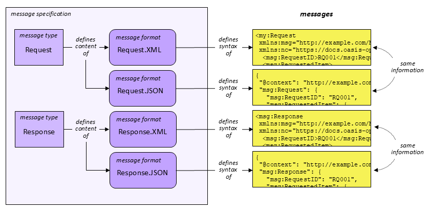
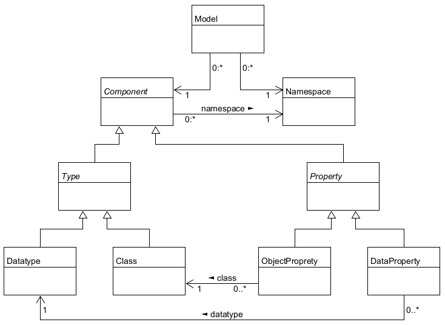
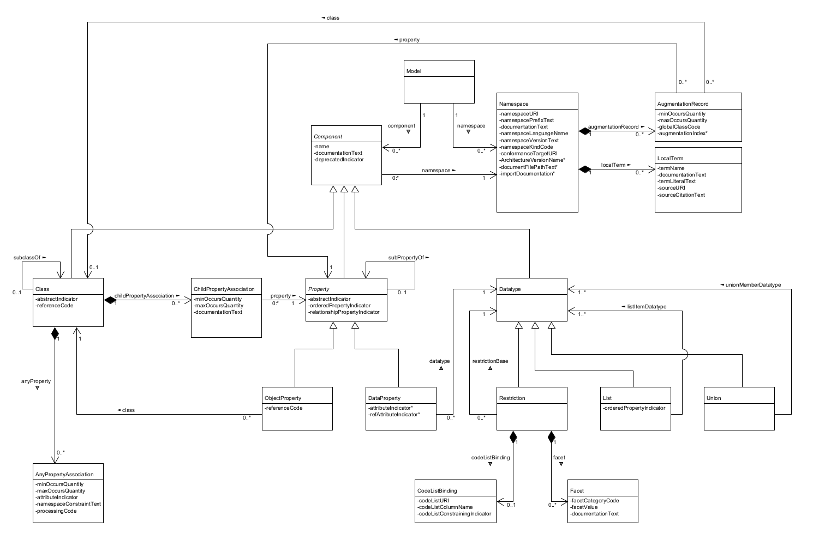

<link rel="stylesheet" href="https://docs.oasis-open.org/templates/css/markdown-styles-v1.7.3a.css" />

<div class="row">
  <div class="column">
    
  </div>
  <div class="column">
    
  </div>
</div>

-------

# NIEM Naming and Design Rules (NDR) Version 6.0

## Project Specification Draft 01

## 24 July 2024

&nbsp;

#### This stage:
https://docs.oasis-open.org/niemopen/ndr/v6.0/psd01/ndr-v6.0-psd01.md (Authoritative) \
https://docs.oasis-open.org/niemopen/ndr/v6.0/psd01/ndr-v6.0-psd01.html \
https://docs.oasis-open.org/niemopen/ndr/v6.0/psd01/ndr-v6.0-psd01.pdf

#### Previous stage:
N/A

#### Latest stage:
https://docs.oasis-open.org/niemopen/ndr/v6.0/ndr-v6.0.md (Authoritative) \
https://docs.oasis-open.org/niemopen/ndr/v6.0/ndr-v6.0.html \
https://docs.oasis-open.org/niemopen/ndr/v6.0/ndr-v6.0.pdf

#### Open Project:
[OASIS NIEMOpen OP](http://www.niemopen.org/)

#### Project Chair:
Katherine Escobar (katherine.b.escobar.civ@mail.mil), [Joint Staff J6](https://www.jcs.mil/Directorates/J6-C4-Cyber/)

#### NTAC Technical Steering Committee Chairs:
James Cabral (jim@cabral.org), Individual \
Scott Renner (sar@mitre.org), [MITRE](https://mitre.org/)

#### Editors:
James Cabral (jim@cabral.org), Individual \
Scott Renner (sar@mitre.org), [MITRE](https://mitre.org/) \
Tom Carlson (Thomas.Carlson@gtri.gatech.edu), [Georgia Tech Research Institute](https://gtri.gatech.edu/)

#### Additional artifacts:
This prose specification is one component of a Work Product that also includes:
* Other parts (list titles and/or file names)
* `(Note: Any normative computer language definitions that are part of the Work Product, such as XML instances, schemas and Java(TM) code, including fragments of such, must be (a) well formed and valid, (b) provided in separate plain text files, (c) referenced from the Work Product; and (d) where any definition in these separate files disagrees with the definition found in the specification, the definition in the separate file prevails. Remove this note before submitting for publication.)`

#### Related work:
This specification replaces or supersedes:
* _National Information Exchange Model Naming and Design Rules_. Version 5.0 December 18, 2020. NIEM Technical Architecture Committee (NTAC). https://reference.niem.gov/niem/specification/naming-and-design-rules/5.0/niem-ndr-5.0.html.

This specification is related to:
* _NIEM Model Version 6.0_. Edited by Christina Medlin. Latest stage: https://docs.oasis-open.org/niemopen/niem-model/v6.0/niem-model-v6.0.html.
* Related specifications (include hyperlink, preferably to HTML format)

#### Abstract:
This Naming and Design Rules (NDR) document specifies XML Schema documents for use with the National Information Exchange Model (NIEM). NIEM is an information sharing framework based on the World Wide Web Consortium (W3C) Extensible Markup Language (XML) Schema standard.

#### Status:
This document was last revised or approved by the Project Governing Board of the OASIS NIEMOpen OP on the above date. The level of approval is also listed above. Check the "Latest stage" location noted above for possible later revisions of this document. Any other numbered Versions and other technical work produced by the Open Project (OP) are listed at http://www.niemopen.org/.

Comments on this work can be provided by opening issues in the project repository or by sending email to the project’s public comment list: niemopen@lists.oasis-open-projects.org. List information is available at https://lists.oasis-open-projects.org/g/niemopen.

Note that any machine-readable content ([Computer Language Definitions](https://www.oasis-open.org/policies-guidelines/tc-process-2017-05-26/#wpComponentsCompLang)) declared Normative for this Work Product is provided in separate plain text files. In the event of a discrepancy between any such plain text file and display content in the Work Product's prose narrative document(s), the content in the separate plain text file prevails.

#### Key words:
The key words "MUST", "MUST NOT", "REQUIRED", "SHALL", "SHALL NOT", "SHOULD", "SHOULD NOT", "RECOMMENDED", "NOT RECOMMENDED", "MAY", and "OPTIONAL" in this document are to be interpreted as described in BCP 14 [[RFC2119](#rfc2119)] and [[RFC8174](#rfc8174)] when, and only when, they appear in all capitals, as shown here.

#### Citation format:
When referencing this specification the following citation format should be used:

**[NIEM-NDR-v6.0]**

_NIEM Naming and Design Rules (NDR) Version 6.0_. Edited by Tom Carlson. 22 February 2024. OASIS Project Specification Draft 01. https://docs.oasis-open.org/niemopen/ndr/v6.0/psd01/ndr-v6.0-psd01.html. Latest stage: https://docs.oasis-open.org/niemopen/ndr/v6.0/ndr-v6.0.html.

-------

## Notices
Copyright &copy; OASIS Open 2024. All Rights Reserved.

Distributed under the terms of the OASIS [IPR Policy](https://www.oasis-open.org/policies-guidelines/ipr/).

For complete copyright information please see the Notices section in the Appendix.

-------

# Table of Contents
[[TOC will be inserted here]]

-------

# 1 Introduction


<!--
Here is a customized command line which will generate HTML from this markdown file (named ndr-v6.0-psd01.md), if needed:

pandoc -f gfm -t html ndr-v6.0-psd01.md -c styles/markdown-styles-v1.7.3a.css --toc --toc-depth=5 -s -o ndr-v6.0-psd01.html --metadata title="NIEM Naming and Design Rules (NDR) Version 6.0"

NOTES:
- The two .css files included in the "styles" directory are also online:
  - https://docs.oasis-open.org/templates/css/markdown-styles-v1.7.3.css
  - https://docs.oasis-open.org/templates/css/markdown-styles-v1.7.3a.css (this one produces HTML that resembles the github display more closely, especially for blocks of code)
  - If you want to use one of the included .css files in pandoc, or develop a different .css file, simply link to it (using -c styles/markdown-styles-v1.7.3a.css) instead of the online files.

OASIS staff are currently using pandoc 3.0 from https://github.com/jgm/pandoc/releases/tag/3.0.

This also requires the presence of a .css file containing the HTML styles (like styles/markdown-styles-v1.7.3.css).

Note this command generates a Table of Contents (TOC) in HTML which is located at the top of the HTML document, and which requires additional editing in order to be published in the expected OASIS style. This editing will be handled by OASIS staff during publication.
A TC may use other ways to generate HTML from markdown, and may generate a TOC in a different way.
-->

NIEM, formerly known as the "National Information Exchange Model,” is a framework for exchanging information among public and private sector organizations. The framework includes a [reference data model](https://docs.oasis-open.org/niemopen/niem-model/v6.0/niem-model-v6.0.html) for objects, properties, and relationships; and a set of technical specifications for using and extending the data model in information exchanges. The NIEM framework supports developer-level specifications of data that form a contract between developers. The data being specified is called a *message* in NIEM. While a message is usually something passed between applications, NIEM works equally well to specify an information resource published on the web, an input or output for a web service or remote procedure, and so forth, basically, any package of data that crosses a system or organization boundary.

NIEM promotes scalability and reusability of messages between information systems, allowing organizations to share data and information more efficiently. It was launched in 2005 in response to the U.S. Homeland Security Presidential Directives to improve information sharing between agencies following 9/11. Until 2023, NIEM was updated and maintained in a collaboration between the U.S. federal government, state and local government agencies, private sector, and non-profit and international organizations, with new versions released around once per year. NIEM defines a set of common objects, the *NIEM Core*, and 17 sets of objects that are specific to certain government or industry verticals, the *NIEM Domains*.

In 2023, NIEM became the NIEMOpen OASIS Open Project. NIEMOpen welcomes participation by anyone irrespective of affiliation with OASIS. Substantive contributions to NIEMOpen and feedback are invited from all parties, following the OASIS rules and the usual conventions for participation in GitHub public repository projects.

NIEMOpen is the term generally used when referring to the organization such as Project Governing Board (PGB), NIEMOpen Technical Architecture Committee (NTAC), NIEMOpen Business Architecture Committee (NBAC), organization activities or processes. NIEM is the term used when directly referring to the model i.e. NIEM Domain, NIEM Model version.

This document specifies principles and enforceable rules for NIEM data components and schemas. Schemas and components that obey the rules set forth here are conformant to specific conformance targets. Conformance targets may include more than the level of conformance defined by this NDR, and may include specific patterns of use, additional quality criteria, and requirements to reuse NIEM release schemas.

## 1.1 Changes from earlier Versions

This optional section provides a description of significant differences from previously published, differently numbered Versions of this specification, if any. (Detailed revision history of this numbered Version should be tracked in an Appendix.)

## 1.2 Glossary

### 1.2.1 Definitions of terms

**document element:** Defined by [ref Infoset]()

| Term | Definition |
| :---- | :--- |
|Abstract class|A class that is a base for extension, and must be specialized to be used directly|
|Adapter class|Contains only properties from a single external namespace|
|Artifact||
|Association class|Represents a specific relationship between objects|
|Atomic class|Contains no object properties, one or more attribute properties, and exactly one data property that is not an attribute property.  Does not have a special name.|
|Attribute||
|Attribute declaration||
|Attribute property|A data property in which `isAttribute` is true|
|Augmentable class|A class that can be augmented with additional properties|
|Augmentation class/type|Oontain the augmenting properties|
|Augmentation element|Element based on an augmentation type that is substitutable for the augmentation point element in the augmented type.|
|Augmentation point element|An abstract element declaration that provides a place for any augmtation properties.|
|Cardinality|How many times a property may/must appear in an object|
|Class|Defines the content of a corresponding object (or resource) in a message.|
|Code datatype|A restriction in which each value that is valid for the datatype corresponds to a code value in a code list.|
|Code list|A list of distinct conceptual entities, each represented by a code value that has a known meaning beyond its text representation.  These codes may be meaningful text or may be a string of alphanumeric identifiers that represent abbreviations for literals.|
|Common Model Format (CMF)|A NIEM representation of the matamodel.|
|Complete model|A model including a definition for every referenced component.|
|Complex content|A object or type with  child elements.|
|Complex type||
|Component||
|Conformance target|A class of artifact, such as an interface, protocol, document, platform, process or service, that is the subject of conformance clauses and normative statements.|
|Constraint||
|Constraint rule|A requirement on an artifact with respect to its conformance to a conformance target.|
|Data definition|A text definition of each component, describing what the component means.|
|Data property|Defines a relationship between an object and a literal value.|
|Datatype|Defines the allowed values of a corresponding atomic literal value in a message|
|Deprecated|A component that is provided, but the use of which is not recommended.|
|Document element||
|Documentation|A human-readable text documentation of a component.|
|Documented component|A CMF object or XSD schema component that has an associated data definition.|
|Element||
|Element declaration||
|Enumeration||
|Extension||
|Extension namespace|Expresses the additional vocabulary required for an information exchange, above and beyond the vocabulary available from the NIEM model|
|Extension schema document||
|External adapter type|A set of data that embodies a single concept from an external standard.|
|External components|A schema component defined by an external schema document.|
|External schema documents|Non-NIEM-conformant schema documents.|
|Facet|A data concept for a facet that restricts an aspect of a data type.|
|Imported namespace||
|Informative|Material that appears as supporting text, description, and rationales for the normative material.|
|Interpretation rule|Defines a methodology, pattern, or procedure for understanding some aspect of an instance of a conformance target.|
|List|An object that defines a datatype as a whitespace-separated list of atomic values.|
|Literal||
|Local term|A word, phrase, acronym, or other string of characters that is used in the name of a namespace component, but that is not defined in OED, or that has a non-OED definition in this nameespace, or has a word sense that is in some way unclear.|
|Local type||
|Message|The data in an information exchange|
|Message designer|A person that creates a message type and format from an information requirement, so that a message at runtime will contain all the facts that need to be conveyed.|
|Message developer|A person that writes software to implement a message specification, producing or processing messages that conform to the message format.|
|Message schema document|A XSD representation of a message namespace|
|Message specification|A collection of related message formats and types|
|Metadata||
|Mixed content|The mixing of data tags with text|
|Model object|Represents a complete or partial NIEM model.|
|Namespace|A collection of uniquely-named components.|
|Namespace author||
|Namespace prefix||
|Namespace URI|A unique URI for a namespace.|
|NIEM|A framework for exchanging information among public and private sector organizations.|
|NIEM Core|A set of common objects.|
|NIEM Domain|A set of objects that are specific to certain government or industry vertical|
|NIEM metamodel|An abstract model for NIEM data models.|
|NIEMOpen Business Architecture Committee (NBAC)||
|NIEMOpen Project Governing Board (PGB)||
|NIEMOpen Technical Architecture Committee (NTAC)||
|Normative|Required for conformance (e.g. rules).|
|Object class|Represents a class of objects defined by a NIEM model|
|Object class term||
|Object property|Defines a subject-predicate-value relationship between an object and another object.|
|Ordered/Ordinality||
|Particle||
|Property term|Describes or represents a characteristic or subpart of an entity or concept.|
|Proxy type|A complex type definition wrapper for a simple type in the XML Schema namespace.|
|Qualifier term|Provide additional context to resolve subtleties between properties of objects.|
|Range|The class or datatype of a property.|
|Reference attribute|A pointer to an element in a message.|
|Reference data model|A model of objects, properties, and relationships|
|Reference namespace|Namespaces that include all components in the NIEM model.|
|Reference property|An attribute property that contains a reference to an object in a message. |
|Reference schema document||
|Representation term|Indicate the style of component, prevents name conflicts or indicates the nature of the value.|
|Restriction object|Defines a datatype as a restriction of a base datatype plus zero or more restricting Facet objects.|
|Simple content|An object or type that has only attributes, not elements.|
|Simple type||
|Subset|A collection of NIEM components required for an information exchange.|
|Subset namespace|A subset of the components in a reference or extension namespace.|
|Subset schema document||
|Target namespace||
|Type definition||
|Union|Defines a datatype as the union of one or more datatypes.|
|XML catalog||
|XML schema document set|Defines an XML Schema that may be used to validate an XML document|

### 1.2.2 Acronyms and abbreviations

### 1.2.3 Document conventions

- Naming conventions
- Font colors and styles
- Typographic conventions

-------

# 2. How To Read This Document

This document provides normative specifications for NIEM-conforming data models. It also describes the goals and principles behind those specifications. It includes examples and explanations to help users of NIEM understand the goals, principles, and specifications. The relevant sections of this document will depend on the role of the user. Figure 2-1 illustrates the relationships between these roles and NIEM.

<center>
  <figure>
    <a name="fig2-1"/></a>
      
    <figcaption><i>Figure 2-1: NIEM-based machine-to-machine data exchange</i>
  </figure>
</center>

Figure 2-1 above emphasizes the design and implementation of NIEM-based data exchange specifications. Figure 2-2 below instead emphasizes the community agreement that forms the NIEM data model.

<center>
  <figure class="image">
    <a name="fig2-2"/></a>
    
    <figcaption><i>Figure 2-2: NIEM communities and data models</i></figcaption>
  </figure>
</center>

The remaining sections of this document most relevant to each of these roles are shown in the following table:

|Section | Manager | Business Analyst | Message Designer | Message Developer |
| :---- | :---: | :----: | :---: | :---: |
| 3. Overview of NIEM technical architecture | x | x | x | x |
| 4. Data models in NIEM | | | x | |
| 5. Modeling rules for NIEM XSD | | | x | |
| 6. Rules for NIEM messages | | x | x | x |

## 2.1 Document references

This document relies on references to many outside documents. Such references are noted by bold, bracketed inline terms. For example, a reference to RFC 3986 is shown as [[RFC 3986]](#appendix-b-references). All reference documents are recorded in [Appendix B, References, below](#appendix-b-references).

## 2.2 Clark notation and qualified names

This document uses both Clark notation and QName notation to represent qualified names.

QName notation is defined by [XML Namespaces] Section 4, Qualified Names. A QName for the XML Schema string datatype is xs:string. Namespace prefixes used within this specification are listed in Section 2.3, Use of namespaces and namespace prefixes, below.

This document sometimes uses Clark notation to represent qualified names in normative text. Clark notation is described by [ClarkNS], and provides the information in a QName without the need to first define a namespace prefix, and then to reference that namespace prefix. A Clark notation representation for the qualified name for the XML Schema string datatype is {http://www.w3.org/2001/XMLSchema}string.

Each Clark notation value usually consists of a namespace URI surrounded by curly braces, concatenated with a local name. The exception to this is when Clark notation is used to represent the qualified name for an attribute with no namespace, which is ambiguous when represented using QName notation. For example, the element targetNamespace, which has no [namespace name] property, is represented in Clark notation as {}targetNamespace.

## 2.3 Use of namespaces and namespace prefixes

The following namespace prefixes are used consistently within this specification. These prefixes are not normative; this document issues no requirement that these prefixes be used in any conformant artifact. Although there is no requirement for a schema or XML document to use a particular namespace prefix, the meaning of the following namespace prefixes have fixed meaning in this document.

* `xs`: The namespace for the XML Schema definition language as defined by [XML Schema Structures] and [XML Schema Datatypes], http://www.w3.org/2001/XMLSchema.
* `xsi`: The XML Schema instance namespace, defined by [XML Schema Structures] Section 2.6, Schema-Related Markup in Documents Being Validated, for use in XML documents, http://www.w3.org/2001/XMLSchema-instance.
* `ct`: The namespace defined by [CTAS] for the conformanceTargets attribute, </br>https://docs.oasis-open.org/niemopen/ns/specification/conformanceTargets/6.0/.
* `appinfo`: The namespace for the appinfo namespace, https://docs.oasis-open.org/niemopen/ns/model/appinfo/6.0/.
* `structures`: The namespace for the structures namespace, </br>https://docs.oasis-open.org/niemopen/ns/model/structures/6.0/.
* `cmf`: The namespace for the CMF model representation, https://docs.oasis-open.org/niemopen/ns/specification/cmf/1.0/.

-------

# 3. Overview of the NIEM Technical Architecture

This overview describes NIEM's design goals and principles. It introduces key features of the architecture that will be defined in more detail later in the document.

## 3.1 Machine-to-machine data specifications

NIEM is a framework for developer-level specifications of data. A NIEM-based data specification – which is built *using* NIEM and in *conformance* to NIEM, but is not itself a *part* of NIEM – describes data to the developers of producing and consuming systems. This data may be shared via:

* a message passed between applications
* an information resource published on the web
* an API for a system or service

NIEM is potentially useful for any mechanism that transfers a package of data across a system or organization boundary. (Within a large system, NIEM may be useful when data passes between components belonging to different developer teams.)

The primary purpose of a NIEM-based data specification is to establish a common understanding among developers, so that they can write software that correctly handles the shared data, hence "machine-to-machine". (The content of a NIEM message may also be directly presented to human consumers, and NIEM can help these consumers understand what they see, but that is not the main purpose of NIEM.)

In NIEM terms, the package of data shared at runtime is a *message*. A *message type* defines the mandatory and optional information content of a class of messages without prescribing a particular syntax. A *message format* defines a syntax for the content of a message type. Both of these definitions are expressed in terms of a machine-readable *data model*, using either of NIEM's two *modeling formats*, the Common Model Format (CMF) or XML Schema (XSD). A collection of related message formats and types is a *message specification.* The usual case is a message specification with one message type and one message format, but a more complex arrangements is possible, illustrated in figure 3-1 below.

<center>
  <figure class="image">
    <a name="fig3-1"/></a>
    
    <figcaption><i>Figure 3-1: Message specification, types, and formats</i></figcaption>
  </figure>
</center>

> A NIEM message was originally known as an *information exchange package (IEP)*, a term that found its way into the U.S. Federal Enterprise Architecture (2005).  A message specification was originally known as an *information exchange package documentation (IEPD).*  These terms are still in widespread use within the NIEM community today, and will not go away soon (if ever). 

A *message designer* creates a message type and format from an information requirement, so that a message at runtime will contain all the facts that need to be conveyed. Then any number of *message developers* write software to implement the specification, producing or processing messages that conform to the message format. Message designers need some understanding of NIEM, but the message developers do not. (Sometimes the message developers do not even know that NIEM exists.) [Figure 2-1](#fig2-1) above illustrates the relationships between message designers, message developers, and message formats.

NIEM supports XML and JSON message formats; support for other formats may be added in the future. One important feature of NIEM is that messages of the same type are convertable across serializations; for example, a NIEM XML message can be converted to NIEM JSON, and vice versa, with no bespoke programming required. 

## 3.2 Reuse of community-agreed data models

NIEM is also a framework for communities to create data models for concepts that are useful in multiple data specifications. These community models are typically not *complete* for any particular specification. Instead, they reflect the community's judgement on which definitions are *worth the trouble of agreement*. The NIEM core model contains definitions found useful by the NIEM community as a whole. NIEM domain models reuse the core, extending it with definitions found useful by the domain community. The core model plus the domain models comprise the "NIEM model". [Figure 2-2]() above illustrates the relationships between domain communities and community models.

Message designers reuse definitions from the NIEM model, selecting a (usually small) subset of definitions that express part of their information requirement. Message designers then create model extensions, adding definitions that they require but have not (so far!) been found worthy of inclusion in the NIEM model. 

Data model reuse is especially useful in a large enterprise. Its value grows with the number of developer teams, and with the degree of commonality in the shared data. NIEM was originally designed for data sharing among federal, state, and local governments – where commonality and number of developer teams is large indeed.

## 3.3 Reuse of open standards

NIEM is built on a foundation of open standards, primarily:

* XML and XSD – message serialization and validation; also a modeling formalism
* JSON and JSON-LD – message serialization and linked data
* RDF, RDFS, and OWL – formal semantics
* ISO 11179 – data element conventions

One of NIEM's principles is to reuse well-known information technology standards when these are supported by free and open-source software. NIEM avoids reuse of standards that effectively depend on proprietary software. When the NIEMOpen project defines a standard of its own, it also provides free and open-source software to support it.

## 3.4 The NIEM metamodel

A data model in NIEM defines the syntax and semantics of a message format, or the information content of a message type, or the agreed definitions of a community. The information required for those purposes can itself be modeled. The model of that information is the *NIEM metamodel* -- an abstract model for NIEM data models. The metamodel is expressed in UML, and is described in detail in [section 4](). At a high level, the major components of the metamodel are classes, datatypes, properties, and namespaces. Figure 3-2 provides an lllustration.

<center>
  <figure class="image">
    <a name="fig3-2"/></a>
    
    <figcaption><i>Figure 3-2: High-level view of the NIEM metamodel</i></figcaption>
  </figure>
</center>

- A *class* defines the content of a corresponding *object* (or *resource*) in a message.
- A *datatype* defines the allowed values of a corresponding atomic *literal value* in a message.
- A class has one or more *properties*. An *object property* defines a subject-predicate-value relationship between an object and another object.  A *data property* defines a relationship between an object and a literal value.
- A *namespace* is a collection of uniquely-named components, described in more detail in section 3.5.

Figure 3-3 below illustrates the relationships among metamodel components, NIEM model components, and the corresponding message objects and values.

<center>
  <figure class="image">
    <a name="fig3-3"/></a>
    
    <figcaption><i>Figure 3-3: Message object and metamodel components</i></figcaption>
  </figure>
</center>

A NIEM message contains objects, properties, and values, which are defined by the Class, Property, and Datatype objects in a NIEM model. In figure 3-3, the name object is defined by the `nc:PersonNameType` Class object; the literal value is defined by the `xs:string` Datatype object, and the property relationship between the two is defined by the `nc:PersonFullName` DataProperty object.

## 3.5 NIEM model representations: XSD and CMF

The abstract metamodel has two concrete representations:  NIEM XSD and NIEM CMF.

XML Schema (XSD) is a NIEM model representation for all versions of NIEM. A NIEM model can be represented as a schema assembled from a collection of schema documents. Every aspect of the metamodel is represented in some way by a schema component. [Section 4](#4-data-models-in-niem) defines the mapping between the metamodel and XSD. [Section 5](#5-modeling-rules-for-niem-xsd) specifies additional rules for the NIEM profile of XSD.

XSD as a model representation supports conformance testing of NIEM XML messages through schema validation. However, JSON developers (and developers working with other formats) cannot use XSD to validate their messages. Nor do they want to read XSD specifications of message content. 

The Common Model Format (CMF) is a second NIEM model representation that supports all developers. CMF is the result of applying the NIEM framework to the information requirements in the metamodel. CMF is a NIEM-based message specification. A CMF model file is a NIEM-based message that represents a NIEM model. [Section 4](#4-data-models-in-niem) defines the mapping between the metamodel and CMF.

Because CMF is a NIEM-based message specification, it can define both an XML format and a JSON format.  CMF examples in this document appear as XML, but can be converted to JSON without loss, and vice versa. 

Because CMF and NIEM XSD are equivalent model representations, NIEM models can be converted from XSD to CMF without loss, and vice versa. 

## 3.6 Namespaces

The components of a NIEM model are partitioned into *namespaces.* This prevents name clashes among communities or domains that have different business perspectives, even when they choose identical data names to represent different data concepts.

Each namespace has an author, a person or organization that is the authoritative source for the namespace definitions. A namespace is the collection of model components for concepts of interest to the namespace author. Namespace cohesion is important; a namespace should be designed so that its components are consistent, may be used together, and may be updated at the same time.

Each namespace must be uniquely identified by a URI. The namespace author should also be the URI's owner, as defined by [ref webarch](). Both URNs and URLs are allowed. It is helpful, but not required, for the namespace URI to be accessible, returning the definition of the namespace content in a supported model format. (See [ref repositories]() for an alternative way to obtain namespace definitions.)

Namespaces are the units of model configuration management. A namespace has one canonical representation in XSD: a [*reference schema document*](#definitions) or [*extension schema document*](#definitions).  A namespace has one canonical representation in CMF: a CMF message, also known as a [*CMF model file*](#definitions). Once published, the components in a namespace may not be removed or redefined. Those changes may only be made in a new namespace with a different URI. As a result, a change by one namespace author does not force a change by any other author – the revisions may be adopted, if desired, whenever convenient; the older namespace continues to be valid regardless.

## 3.7 NIEM messages in XML and JSON

The content of a NIEM message may be formatted as XML or JSON. Any NIEM message may be converted from one supported format to another, without loss of information. Figures 3-4 and 3-5 show the equivalent NIEM XML and JSON serializations of the information depicted in figure 3-3.

<div style="font-size:90%;">

```
<nc:Person
  xmlns:nc="https://docs.oasis-open.org/niemopen/ns/model/niem-core/6.0/">
  <nc:PersonName>
    <nc:PersonFullName>Clark Kent</nc:PersonFullName>
  </nc:PersonName>
</nc:Person>
```

<center><i><a name="fig3-4"></a>Figure 3-4: Sample NIEM XML message</i></center><p/>

```
{ 
  "nc:Person": {
    "nc:PersonName": {
      "nc:PersonFullName": "Clark Kent"
    }
  },
  "@context": { "nc": "https://docs.oasis-open.org/niemopen/ns/model/niem-core/6.0/" }
}
```

</div>
<center><i><a name="fig3-5"></a>Figure 3-5: Sample NIEM JSON message</i></center><p/>

-------

# 4. Data models in NIEM

The NIEM metamodel is an abstract model, defined in the UML diagram below, that specifies the content of a NIEM data model. CMF is a NIEM message type that implements the metamodel. A CMF message is a representation of a NIEM data model. A NIEM data model may also be represented in NIEM XSD. This section specifies:

* the meaning of the classes, attributes, and relationships in the metamodel
* the meaning of the classes, datatypes, and properties in CMF that implement the metamodel
* the XSD constructs that correspond to CMF classes, datatypes, and properties

<center>
  <figure class="image">
    <a name="fig4-1"/></a>
    
    <figcaption><i>Figure 4-1:The NIEM metamodel </i></figcaption>
  </figure>
</center>

The table format used to document classes, attributes, relationships, and properties in the metamodel and in CMF has the following columns:

| Column | Definition |
| ------ | ---------- |
| UML | the name of the UML class, attribute, or relationship |
| CMF | the name of the corresponding CMF class or property |
| Definition | the definition of the object or property |
| Card | the cardinality of the property (how many times it may/must appear in an object) |
| Ord | true when the instance order of a repeatable property in an object is significant |
| Range | the class or datatype of a property |

## 4.1 Model class

A Model object represents a complete or partial NIEM model.  (A complete model has a definition for every referenced component.)

<center>
  <figure class="image">
    <a name="fig4-2"/></a>
    
    <figcaption><i>Figure 4-2: Model class diagram</i></figcaption>
  </figure>
</center>

| UML | CMF | Definition | Card | Ord | Range |
| --- | --- | ---------- | :--: | :-: | ----- |
| Model | ModelType | A data type for a NIEM data model. |
| comp | Component | A data concept for a component of a NIEM data model. | 0..* | - | ComponentType |
| ns | Namespace | A namespace of a data model component | 0..* | - | NamespaceType |

A Model object is represented in CMF as a CMF model file; that is, a CMF message.

A Model object is represented in XSD as a set of XML schema documents. One or more schema documents are provided to begin the set. Other documents are added, according to the @schemaLocation attribute in the import elements in each document encountered. Documents may also be added according to the @namespace attribute, as resolved through XML Catalog files, if provided. There is one namespace object in the model for each namespace defined by the schema documents. The components in each namespace are those specified by the XSD to CMF mappings defined in this section.

## 4.2 Namespace class

A Namespace object represents a namespace in a model. For example, the namespace with the URI `https://docs.oasis-open.org/niemopen/ns/model/niem-core/6.0/` is a namespace in the NIEM 6.0 model.

<center>
  <figure class="image">
    <a name="fig4-3"/></a>
    
    <figcaption><i>Figure 4-3: Namespace class diagram</i></figcaption>
  </figure>
</center>

| UML | CMF | Definition | Card | Ord | Range |
| --- | --- | ---------- | :--: | :-: | ----- |
| Namespace | NamespaceType | A data type for a namespace. ||||
| uri | NamespaceURI | A URI for a namespace. | 1 | - | xs:anyURI |
| prefix | NamespacePrefixText | A namespace prefix name for a namespace. | 1 | - | xs:NCName |
| documentation | DocumentationText | A human-readable text documentation of a namespace. | 1..* | Y | TextType |
| lang | NamespaceLanguageName | A name of a default language of the terms and documentation text in a namespace. | 1 | - | xs:language |
| version | NamespaceVersionText | A version of a namespace; for example, used to distinguish a namespace subset, bug fix, documentation change, etc. | 1 | - | xs:token |
| kind | NamespaceKindCode | A kind of namespace in a NIEM model (external, core, domain, etc.). | 1 | - | NamespaceKindCodeType |
| confTarg | ConformanceTargetURI | A [conformance target identifier](#definitions). | 0..* | - | xs:anyURI |
| niemVersion | NIEMVersionText | A NIEM version number of the builtin schema components used in a namespace; e.g. "5" or "6". | 0..1 | - | xs:token |
| docPath | DocumentFilePathText | A relative file path from the top schema directory to a schema document for this namespace. | 0..1 | - | xs:string |
| importDoc | ImportDocumentationText | Human-readable documentation from the first `xs:import` element importing this namespace. | 0..1 | - | xs:string |
| aug | AugmentationRecord | An augmentation of a class with a property by a namespace. | 0..* | - | AugmentationType|
| term | LocalTerm | A data type for the meaning of a term that may appear within the name of a model component. | 0..* | - | LocalTermType |

> Note: I'm now thinking we don't need `NIEMVersionText`. We can work that out from the conformance target assertions.  And we don't need `NamespaceKindCode`. We can work that out from the namespace URI and conformance target assertions -- or if we can't show it's BUILTIN, CORE, DOMAIN, EXTENSION, OTHERNIEM, XML, or XSD, then in a conforming schema pile it must be EXTERNAL. So I think these properties will go away when I have time to fool with it.

Figure 4-4 shows the representation of a Namespace object in CMF and in the corresponding XSD.

<div style="font-size:90%;">

```
<Namespace>
  <NamespaceURI>https://docs.oasis-open.org/niemopen/ns/model/niem-core/6.0/</NamespaceURI>
  <NamespacePrefixText>nc</NamespacePrefixText>
  <DocumentationText>NIEM Core.</DocumentationText>
  <ConformanceTargetURI>
    https://docs.oasis-open.org/niemopen/ns/specification/XNDR/6.0/#ReferenceSchemaDocument
  </ConformanceTargetURI>
  <NamespaceVersionText>ps02</NamespaceVersionText>
  <NamespaceLanguageName>en-US</NamespaceLanguageName>
</Namespace>
---------------
<xs:schema
  targetNamespace="https://docs.oasis-open.org/niemopen/ns/model/niem-core/6.0/"
  xmlns:ct="https://docs.oasis-open.org/niemopen/ns/specification/conformanceTargets/6.0/"
  xmlns:nc="https://docs.oasis-open.org/niemopen/ns/model/niem-core/6.0/"
  xmlns:xs="http://www.w3.org/2001/XMLSchema"
  ct:conformanceTargets=
    "https://docs.oasis-open.org/niemopen/ns/specification/XNDR/6.0/#ReferenceSchemaDocument"
  version="ps02"
  xml:lang="en-US">
  <xs:annotation>
    <xs:documentation>NIEM Core.</xs:documentation>
  </xs:annotation>    
</xs:schema>
```

</div>
<center><i><a name="fig4-4"></a>Figure 4-4: Namespace object in CMF and XSD</i></center><p/>

The following table shows the mapping between Namespace object representations in CMF and XSD.

| CMF | XSD |
| --- | --- |
| NamespaceURI | `xs:schema/@targetNamespace` |
| NamespacePrefixText | The prefix in the first namespace declaration of the target namespace |
| DocumentationText | `xs:schema/xs:annotation/xs:documentation` |
| ConformanceTargetURI | Each of the URIs in the list attribute `xs:schema/@ct:conformanceTargets` |
| NamespaceVersionText | `xs:schema/@version` |
| NamespaceLanguageName | `xs:schema/@xml:lang` |

## 4.3 Component class (abstract)

A model component in a namespace is either a Class object, a Property object, or a Datatype object in a NIEM model. The abstract component class defines the common properties.

<center>
  <figure class="image">
    <a name="fig4-4"/></a>
    
    <figcaption><i>Figure 4-5: Component class diagram</i></figcaption>
  </figure>
</center>

| UML | CMF | Definition | Card | Ord | Range |
| --- | --- | ---------- | :--: | :-: | ----- |
| Component | ComponentType | A data type for common properties of a data model component in NIEM. |
| name | Name | The name of a data model component. | 1 | - | xs:NCName |
| documentation | DocumentationText | A human-readable text definition of a data model component. | 0..* | Y | TextType |
| isDeprecated | DeprecatedIndicator | True for a deprecated schema component; that is, a component that is provided, but the use of which is not recommended. | 0..1 | - | xs:boolean |
| ns | Namespace | The namespace of a data model component. | 1 | - | NamespaceType |

## 4.4 Class class

A Class object represents a class of objects defined by a NIEM model; that is, an [object class](#defined).  For example, `nc:PersonType` is a Class object in the NIEM Core model.

<center>
  <figure class="image">
    <a name="fig4-6"/></a>
    
    <figcaption><i>Figure 4-6: Class and HasProperty class diagram</i></figcaption>
  </figure>
</center>

| UML | CMF | Definition | Card | Ord | Range |
| --- | --- | ---------- | :--: | :-: | ----- |
| Class | ClassType | A data type for a class. |
| isAbstract | AbstractIndicator | True if a class is a base for extension, and must be specialized to be used directly; false if a class may be used directly. | 0..1 | - | xs:boolean |
| isAugmentable | AugmentableIndicator | True for an [augmentable class](#definitions); that is, if a class can be augmented with additional properties. | 0..1 | - | xs:boolean |
| referenceCode | ReferenceCode | A code describing how a property may be referenced (or must appear inline). | 0..1 | - | ReferenceCodeType |
| subClassOf | ExtensionOfClass | A base class of a subclass. | 0..1 | - | ClassType |  
| hasProp | HasProperty | An occurrence of a property as content of a class. | 0..* | Y | HasPropertyType |

There are three special categories of [object class](#definition):

* An [adapter class](#definitions) contains only properties from a single [external namespace](#definitions).  It acts as a conformance wrapper around data components defined in standards that are not NIEM conforming.  An adapter class has a name ending in "AdapterType".

* An [association class](#definitions) represents a specific relationship between objects.   Associations are used when a simple NIEM property is insufficient to model the relationship clearly, or to model properties of the relationship itself.  An association class has a name ending in "AssociationType".

* An [atomic class](#definition) contains no object properties, one or more [attribute properties](#definitions), and exactly one data property that is not an attribute property.  An atomic class does not have a special name.

Most classes are represented in XSD as a complex type with complex content ("CCC type"); that is, a type with  child elements.  [Figure 4-7](#fig4-7) below shows a Class object represented in CMF, and then in XSD as a complex type with child elements.

<div style="font-size:90%;">

```
<Class structures:id="ex.ExampleType">
  <Name>ExampleType</Name>
  <Namespace structures:ref="ex" xsi:nil="true"/>
  <DocumentationText>
    A data type for a conveyance designed to carry an operator, passengers and/or cargo, over land.
  </DocumentationText>
  <DeprecatedIndicator>true</DeprecatedIndicator>
  <AbstractIndicator>true</AbstractIndicator>
  <ExtensionOfClass structures:ref="ex.ConveyanceType" xsi:nil="true"/>
  <AugmentableIndicator>true</AugmentableIndicator>
  <ReferenceCode>REF</ReferenceCode>
  <HasProperty>
    <DataProperty structures:ref="ex.ExampleDoorQuantity" xsi:nil="true"/>
    <MinOccursQuantity>0</MinOccursQuantity>
    <MaxOccursQuantity>unbounded</MaxOccursQuantity>
  </HasProperty>
  <HasProperty>
    <DataProperty structures:ref="ex.aProperty" xsi:nil="true"/>
    <MinOccursQuantity>1</MinOccursQuantity>
    <MaxOccursQuantity>1</MaxOccursQuantity>
  </HasProperty>
</Class>
---------------
<xs:complexType name="ExampleType" abstract="true" appinfo:deprecated="true" appinfo:referenceCode="REF">
  <xs:annotation> 
    <xs:documentation>
       A data type for a conveyance designed to carry an operator, passengers and/or cargo, over land.
    </xs:documentation>
  </xs:annotation>
  <xs:complexContent>
    <xs:extension base="ex:ConveyanceType">
      <xs:sequence>
        <xs:element ref="ex:ExampleDoorQuantity" minOccurs="0" maxOccurs="unbounded"/>
        <xs:element ref="ex:ExampleAugmentationPoint" minOccurs="0" maxOccurs="unbounded"/>
      </xs:sequence>
      <xs:attribute ref="ex:aProperty" use="required"/>
    </xs:extension>
  </xs:complexContent>
</xs:complexType>

```

</div>
<center><i><a name="fig4-7"></a>Figure 4-7: A Class object in CMF and in XSD (CCC type)</i></center><p/>

The following table shows the mapping between Class object representations in CMF and XSD.

| CMF | XSD |
| --- | --- |
| Namespace | The namespace object for the containing schema document. |
| Name | `xs:complexType/@name` |
| DocumentationText | `xs:complexType/xs:annotation/xs:documentation` |
| DeprecatedIndicator | `xs:complexType/@appinfo:deprecated` |
| AbstractIndicator | `xs:complexType/@abstract` |
| ExtensionOfClass | `xs:complexType/xs:complexContent/xs:extension/@base` |
| AugmentableIndicator | True if the last element in the sequence is an [*augmentation point*](). |
| ReferenceCode | `xs:complexType/@appinfo:referenceCode` |
| HasProperty | `xs:complexType/xs:complexContent/xs:extension/xs:sequence/xs:element` or `xs:complexType/xs:complexContent/xs:extension/xs:attribute` |

An atomic class is represented in XSD as a complex type with simple content ("CSC type") that has attributes.  This is illustrated in [figure 4-8](#fig4-8) below, which shows an atomic class object in CMF, and then in XSD as a complex type with attributes but no child elements.

<div style="font-size:90%;">

```
---------------
<Class structures:id="ex.Example2Type">
  <Name>Example2Type</Name>
  <Namespace structures:ref="ex" xsi:nil="true"/>
  <HasProperty>
    <DataProperty structures:ref="ex.Example2Literal" xsi:nil="true"/>
    <MinOccursQuantity>1</MinOccursQuantity>
    <MaxOccursQuantity>1</MaxOccursQuantity>
  </HasProperty>
  <HasProperty>
    <DataProperty structures:ref="ex.aProperty" xsi:nil="true"/>
    <MinOccursQuantity>0</MinOccursQuantity>
    <MaxOccursQuantity>1</MaxOccursQuantity>
    <DocumentationText>A reason why a data value was not provided.</DocumentationText>
  </HasProperty>
</Class>
---------------
<xs:complexType name="Example2Type">
  <xs:simpleContent>
    <xs:extension base="xs:integer">
      <xs:attribute ref="ex:aProperty"/>
      <xs:attributeGroup ref="structures:SimpleObjectAttributeGroup"/>
    </xs:extension>
  </xs:simpleContent>
</xs:complexType>
```

</div>
<center><i><a name="fig4-8"></a>Figure 4-8: Class object in CMF and XSD (CSC type)</i></center><p/>

An atomic class always has a DataProperty object named after the class, with "Type" replaced by "Literal".  In CMF these appear as two separate objects. In XSD, the representation of an atomic class also represents the DataProperty object. 

## 4.5 HasProperty class

A HasProperty object represents the occurrence of a property in a class. For example, the `nc:PersonType` class object in the NIEM core model has a HasProperty object for the `nc:PersonName` property.

| UML | CMF | Definition | Card | Ord | Range |
| --- | --- | ---------- | :--: | :-: | ----- |
| HasProperty | HasPropertyType | A data type for an occurrence of a property as content of a class. |
| minOccurs | MinOccursQuantity | The minimum number of times a property may occur within an object of a class. | 1 | - | xs:integer |
| maxOccurs | MaxOccursQuantity | The maximum number of times a property may occur within an object of a class. | 1 | - | MaxOccursType |
| documentation | DocumentationText | A human-readable documentation of a property that is content of a class. | 0..* | Y | TextType |
| isOrdered | OrderedPropertyIndicator | True if the order of a repeated property within an object is significant. | 0..1 | - | xs:boolean |
| augNamespace | AugmentingNamespace | A namespace responsible for augmenting a class with a property. | 0..* | - | NamespaceType |
| property | Property | The property that occurs in the class. | 1 | - | PropertyType |

A HasProperty object is represented in XSD as an element or attribute reference within a complex type definition. Figure 4-9 shows two HasProperty objects in CMF and the corresponding XSD.

<div style="font-size:90%;">

```
<HasProperty>
  <DataProperty structures:ref="ex.PersonMiddleName" xsi:nil="true"/>
  <MinOccursQuantity>0</MinOccursQuantity>
  <MaxOccursQuantity>unbounded</MaxOccursQuantity>
  <DocumentationText>
    Documentation here refers to the relationship between the object and this property.
  </DocumentationText>
  <OrderedPropertyIndicator>true</OrderedPropertyIndicator>
</HasProperty>
<HasProperty>
  <DataProperty structures:ref="ex.aProperty" xsi:nil="true"/>
  <MinOccursQuantity>1</MinOccursQuantity>
  <MaxOccursQuantity>1</MaxOccursQuantity>
</HasProperty>
---------------
<xs:sequence>
  <xs:element ref="ex:PersonMiddleName" 
    minOccurs="0" maxOccurs="unbounded" appinfo:orderedPropertyIndicator="true">
    <xs:annotation>
      <xs:documentation>
        Documentation here refers to the relationship between the object and this property.
      </xs:documentation>
    </xs:annotation>
  </xs:element>
</xs:sequence>
<xs:attribute ref="ex:aProperty" use="required"/>
```

</div>
<center><i><a name="fig4-9"></a>Figure 4-9: HasProperty object in CMF and XSD</i></center><p/>

The following table shows the mapping between HasProperty representations in CMF and XSD.

| CMF | XSD |
| --- | --- |
| Property | The property object for `xs:element/@ref`. |
| MinOccursQuantity | `xs:element/@minOccurs` |
| MaxOccursQuantity | `xs:element/@maxOccurs` |
| DocumentationText | `xs:element/xs:annotation/xs:documentation` |
| OrderedPropertyIndicator | `xs:element/@appinfo:orderedPropertyIndicator` |
| AugmentingNamespace | `xs:element/@appinfo:augmentingNamespace` |

## 4.6 Property class (abstract)

A Property object represents a data property or an object property in a NIEM model. 

<center>
  <figure class="image">
    <a name="fig4-10"/></a>
    
    <figcaption><i>Figure 4-10: Property class diagram</i></figcaption>
  </figure>
</center>

| UML | CMF | Definition | Card | Ord | Range |
| --- | --- | ---------- | :--: | :-: | ----- |
| Property | PropertyType | A data type for a property. |
| isAbstract | AbstractIndicator | True if a property must be specialized; false if a property may be used directly. | 0..1 | - | xs:boolean |
| isRelationship | RelationshipPropertyIndicator | True for a property that applies to the relationship between two objects (instead of to a single object). | 0..1 | - | xs:boolean |
| subPropertyOf | SubPropertyOf | A property of which a property is a subproperty. | 0..1 | - | PropertyType |

## 4.7 ObjectProperty class

An ObjectProperty object represents a property with a range that is a class. For example, the `nc:PersonName` object in the NIEM core model is a property with a range of `nc:PersonNameType`.

| UML | CMF | Definition | Card | Ord | Range |
| --- | --- | ---------- | :--: | :-: | ----- |
| ObjectProperty | ObjectPropertyType | A data type for an object property. |
| referenceCode | ReferenceCode | A code describing how a property may be referenced (or must appear inline). | 0..1 | - | ReferenceCodeType |
| class | Class | The class of this object property. | 1 | - | ClassType |

An ObjectProperty object is represented in XSD as an element declaration with a type that is a Class object. Figure 4-11 shows an ObjectProperty object in XSD and the corresponding CMF.

<div style="font-size:90%;">

```
<ObjectProperty structures:id="ex.ExampleProperty">
  <Name>ExampleProperty</Name>
  <Namespace structures:ref="ex" xsi:nil="true"/>
  <DocumentationText>Documentation text for ExampleProperty.</DocumentationText>
  <DeprecatedIndicator>true</DeprecatedIndicator>
  <AbstractIndicator>true</AbstractIndicator>
  <SubPropertyOf structures:ref="ex.PropertyAbstract" xsi:nil="true"/>
  <RelationshipPropertyIndicator>true</RelationshipPropertyIndicator>
  <Class structures:ref="ex.ExType" xsi:nil="true"/>
  <ReferenceCode>ANY</ReferenceCode>
</ObjectProperty>
---------------
<xs:element name="ExampleProperty" type="ex:ExType" abstract="true" substitutionGroup="ex:PropertyAbstract" 
  appinfo:deprecated="true" 
  appinfo:relationshipPropertyIndicator="true"
  appinfo:referenceCode="ANY">
  <xs:annotation>
    <xs:documentation>Documentation text for ExampleProperty.</xs:documentation>
  </xs:annotation>
</xs:element>
```

</div>
<center><i><a name="fig4-11"></a>Figure 4-11: ObjectProperty object in CMF and XSD</i></center><p/>

The following table shows the mapping between ObjectProperty object representations in CMF and XSD.

| CMF | XSD |
| --- | --- |
| Namespace | The namespace object for the containing schema document. |
| Name | `xs:complexType/@name` |
| DocumentationText | `xs:complexType/xs:annotation/xs:documentation` |
| DeprecatedIndicator | `xs:complexType/@appinfo:deprecated` |
| AbstractIndicator | `xs:complexType/@abstract` |
| SubPropertyOf | The property object for `xs:element/@substitutionGroup` |
| RelationshipPropertyIndicator | `xs:element/@appinfo:relationshipPropertyIndicator`
| Class | The class object for `xs:element/@type` |
| ReferenceCode | `xs:complexType/@appinfo:referenceCode` |

## 4.8 DataProperty class

A DataProperty object represents a property with a range that is a datatype. For example, the `nc:PersonFullName` object shown in [figure 3-3](fig3-3) is a property with a range of `xs:string`.

| UML | CMF | Definition | Card | Ord | Range |
| --- | --- | ---------- | :--: | :-: | ----- |
| DataProperty | DataPropertyType | 
| isAttribute* | AttributeIndicator | True for a property that is represented as attributes in XML. | 0..1 | - | xs:boolean |
| isRefAttribute* | RefAttributeIndicator | True for a property that is an [object reference attribute](). | 0..1 | - | xs:boolean |
| datatype | Datatype | The datatype of this data property. | 1 | - | DatatypeType |

An [attribute property](#definitions) is a data property in which `isAttribute` is true.  These are represented in XSD as an attribute declaration.

A [reference property](#definitions) is an attribute property that contains a reference to an object in a message.  (Object references are described in [section ref message rules]().)

DataProperty objects are represented in XSD as an attribute declaration, or as an element declaration with a type that is a Datatype object. Figure 4-12 shows the CMF and XSD representations of two DataProperty objects.

<div style="font-size:90%;">

```
<DataProperty structures:id="ex.ExampleProperty">
  <Name>ExampleProperty</Name>
  <Namespace structures:ref="ex" xsi:nil="true"/>
  <DocumentationText>Documentation text for ExampleProperty.</DocumentationText>
  <DeprecatedIndicator>true</DeprecatedIndicator>
  <AbstractIndicator>true</AbstractIndicator>
  <SubPropertyOf structures:ref="ex.PropertyAbstract" xsi:nil="true"/>
  <Datatype structures:ref="ex.ExType" xsi:nil="true"/>
</DataProperty>
<DataProperty structures:id="ex.AttributeProperty">
  <Name>AttributeProperty</Name>
  <Namespace structures:ref="ex" xsi:nil="true"/>
  <DocumentationText>Documentation text for AttributeProperty.</DocumentationText>
  <DeprecatedIndicator>true</DeprecatedIndicator>
  <Datatype structures:ref="xs.string" xsi:nil="true"/>
  <AttributeIndicator>true</AttributeIndicator>
  <RefAttributeIndicator>true</RefAttributeIndicator>
</DataProperty> 
---------------
<xs:element name="ExampleProperty" type="ex:ExType" abstract="true" substitutionGroup="ex:PropertyAbstract" 
  appinfo:deprecated="true">
  <xs:annotation>
    <xs:documentation>Documentation text for ExampleProperty.</xs:documentation>
  </xs:annotation>
</xs:element>
<xs:attribute name="AttributeProperty" type="xs:string" 
  appinfo:deprecated="true" 
  appinfo:referenceAttributeIndicator="true">
  <xs:annotation>
    <xs:documentation>Documentation text for ExampleProperty.</xs:documentation>
  </xs:annotation>
</xs:attribute> 
```

</div>
<center><i><a name="fig4-12"></a>Figure 4-12: DataProperty object in CMF and XSD</i></center><p/>

The following table shows the mapping between DataProperty representations in CMF and XSD.

| CMF | XSD |
| --- | --- |
| Namespace | The namespace object for the containing schema document. |
| Name | `xs:complexType/@name` |
| DocumentationText | `xs:complexType/xs:annotation/xs:documentation` |
| DeprecatedIndicator | `xs:complexType/@appinfo:deprecated` |
| AbstractIndicator | `xs:complexType/@abstract` |
| SubPropertyOf | The property object for `xs:element/@substitutionGroup` |
| RelationshipPropertyIndicator | `xs:element/@appinfo:relationshipPropertyIndicator`
| Datatype | The datatype object for `xs:element/@type` |
| AttributeIndicator | True for an attribute declaration. |
| RefAttributeIndicator | `xs:attribute/@appinfo:referenceAttributeIndicator` |


## 4.9 Datatype class

<center>
  <figure class="image">
    <a name="fig4-13"/></a>
    
    <figcaption><i>Figure 4-13: Datatype classes</i></figcaption>
  </figure>
</center>

A Datatype object defines the allowed values of a corresponding atomic literal value in a message. Objects for primitive data types, corresponding to the XSD data types, have only the *name*, *namespace*, and *documentation* properties inherited from the Component class. For example, figure 4-14 shows the CMF representation of the `xs:string` primitive data type. All other datatypes are represented by either a Restriction, List, or Union object.

<div style="font-size:90%;">

```
<Datatype>
  <Name>string</Name>
  <Namespace structures:ref="xs" xsi:nil="true"/>
</Datatype>
```

</div>
<center><i><a name="fig4-14"></a>Figure 4-14: Plain CMF datatype object for `xs:string`</i></center><p/>

## 4.10 List class

A List object defines a datatype as a whitespace-separated list of atomic values.

| UML | CMF | Definition | Card | Ord | Range |
| --- | --- | ---------- | :--: | :-: | ----- |
| List | ListDatatype | A data type for a NIEM model datatype that is a whitespace-separated list of atomic values.||||
| isOrdered | OrderedPropertyIndicator | True if the order of a repeated property within an object is significant. | 0..1 | - | xs:boolean |
| listType | ListOf | The datatype of the atomic values in a list. | 1 | - | DatatypeType |

A List object is represented in XSD as a complex type definition that extends a simple type definition with an `xs:list` element.  Figure 4-15 shows the CMF and XSD representation of a List object.

<div style="font-size:90%;">

```
<ListDatatype structures:id="ex.ExListType">
  <Name>ExListType</Name>
  <Namespace structures:ref="ex" xsi:nil="true"/>
  <DocumentationText>A data type for a list ofintegers.</DocumentationText>
  <ListOf structures:ref="xs.integer" xsi:nil="true"/>
  <OrderedPropertyIndicator>true</OrderedPropertyIndicator>
</ListDatatype>
---------------
<xs:simpleType name="ExListSimpleType">
  <xs:list itemType="xs:integer"/>
</xs:simpleType>
<xs:complexType name="ExListType" appinfo:orderedPropertyIndicator="true">
  <xs:annotation>
    <xs:documentation>A data type for a list of integers.</xs:documentation>
  </xs:annotation>
  <xs:simpleContent>
    <xs:extension base="ex:ExListSimpleType">
      <xs:attributeGroup ref="structures:SimpleObjectAttributeGroup"/>
    </xs:extension>
  </xs:simpleContent>
</xs:complexType>
```

</div>
<center><i><a name="fig4-15"></a>Figure 4-15: List object in CMF and XSD</i></center><p/>

The following table shows the mapping between List object representations in CMF and XSD.

| CMF | XSD |
| --- | --- |
| Namespace | The namespace object for the containing schema document. |
| Name | `xs:complexType/@name` |
| DocumentationText | `xs:complexType/xs:annotation/xs:documentation` |
| DeprecatedIndicator | `xs:complexType/@appinfo:deprecated` |
| ListOf | `xs:simpleType/xs:list/@itemType` |
| OrderedPropertyIndicator | `xs:complexType/@appinfo:orderedPropertyIndicator` |

## 4.11 Union class

A Union object defines a datatype as the union of one or more datatypes.

| UML | CMF | Definition | Card | Ord | Range |
| --- | --- | ---------- | :--: | :-: | ----- |
| Union | UnionDatatype | A data type for a NIEM model datatype that is a union of datatypes.
| unionType | UnionOf | A NIEM model datatype that is a member of a union datatype. | 1..* | - | DatatypeType |

A Union object is represented in XSD as a complex type definition that extends a simple type definition with an `xs:union` element. Figure 4-16 shows the XSD and CMF representations of a Union object.

<div style="font-size:90%;">

```
<UnionDatatype structures:id="ex.UnionType">
  <Name>UnionType</Name>
  <Namespace structures:ref="test" xsi:nil="true"/>
  <DocumentationText>A data type for a union of integer and float datatypes.</DocumentationText>
  <UnionOf structures:ref="xs.integer" xsi:nil="true"/>
  <UnionOf structures:ref="xs.float" xsi:nil="true"/>
</UnionDatatype>
---------------
<xs:simpleType name="UnionSimpleType">
  <xs:union memberTypes="xs:integer xs:float"/>
</xs:simpleType>
<xs:complexType name="UnionType">
  <xs:annotation>
    <xs:documentation>A data type for a union of integer and float datatypes.</xs:documentation>
  </xs:annotation>  <xs:simpleContent>
    <xs:extension base="ex:UnionSimpleType">
      <xs:attributeGroup ref="structures:SimpleObjectAttributeGroup"/>
    </xs:extension>
  </xs:simpleContent>
</xs:complexType>
```

</div>
<center><i><a name="fig4-16"></a>Figure 4-16: Union object in CMF and XSD</i></center><p/>

The following table shows the mapping between UnionDatatype object representations in CMF and XSD.

| CMF | XSD |
| --- | --- |
| Namespace | The namespace object for the containing schema document. |
| Name | `xs:complexType/@name` |
| DocumentationText | `xs:complexType/xs:annotation/xs:documentation` |
| DeprecatedIndicator | `xs:complexType/@appinfo:deprecated` |
| UnionOf | `xs:simpleType/xs:union/@memberTypes` |

## 4.12 Restriction class

A Restriction object defines a datatype as a restriction of a base datatype plus zero or more restricting Facet objects.

| UML | CMF | Definition | Card | Ord | Range |
| --- | --- | ---------- | :--: | :-: | ----- |
| Restriction | RestrictionType | A data type for a restriction of a data type. |
| restricts | RestrictionBase | The NIEM model datatype that is restricted by this datatype. | 1 | - | DatatypeType |
| facet | Facet | A data concept for a facet that restricts an aspect of a data type. | 0..* | - | FacetType |
| clb | CodeListBinding | A property for connecting atomic values defined by a data type to a a column of a code list. | 0..1 | - | CodeListBindingType |

A Restriction object is represented in XSD as a complex type with simple content containing an `xs:restriction` element. Figure 4-17 shows the CMF and XSD representations of a Restriction object.

<div style="font-size:90%;">

```
<RestrictionDatatype structures:id="test.RestrictionType">
  <Name>RestrictionType</Name>
  <Namespace structures:ref="test" xsi:nil="true"/>
  <DocumentationText>Exercise code list binding</DocumentationText>
  <RestrictionBase structures:ref="xs.token" xsi:nil="true"/>
  <Enumeration>
    <StringValue>GB</StringValue>
  </Enumeration>
  <Enumeration>
    <StringValue>US</StringValue>
  </Enumeration>
  <CodeListBinding>
    <CodeListURI>http://api.nsgreg.nga.mil/geo-political/GENC/2/3-11</CodeListURI>
    <CodeListColumnName>foo</CodeListColumnName>
    <CodeListConstrainingIndicator>true</CodeListConstrainingIndicator>
  </CodeListBinding>
</RestrictionDatatype>
---------------
<xs:complexType name="RestrictionType">
  <xs:annotation>
    <xs:appinfo>
      <clsa:SimpleCodeListBinding codeListURI="http://api.nsgreg.nga.mil/geo-political/GENC/2/3-11" 
        columnName="foo" constrainingIndicator="true"/>
    </xs:appinfo>
  </xs:annotation>
  <xs:simpleContent>
    <xs:restriction base="niem-xs:token">
      <xs:enumeration value="GB"/>
      <xs:enumeration value="US"/>
    </xs:restriction>
  </xs:simpleContent>
</xs:complexType>
```

</div>
<center><i><a name="fig4-17"></a>Figure 4-17: Restriction object in CMF and XSD</i></center><p/>

The following table shows the mapping between Restriction object representations in CMF and XSD.

| CMF | XSD |
| --- | --- |
| Namespace | The namespace object for the containing schema document. |
| Name | `xs:complexType/@name` |
| DocumentationText | `xs:complexType/xs:annotation/xs:documentation` |
| DeprecatedIndicator | `xs:complexType/@appinfo:deprecated` |
| RestrictionBase | The datatype object for `xs:complexType/xs:simpleContent/xs:restriction/@base` |
| Facet | `xs:complexType/xs:simpleContent/xs:restriction/`*XSD-Facet-element* |
| CodeListBinding | `xs:complexType/xs:annotation/xs:appinfo/clsa:SimpleCodeListBinding` |

A [code list](#defined) is a list of distinct conceptual entities, each represented by a code value that has a known meaning beyond its text representation.  These codes may be meaningful text or may be a string of alphanumeric identifiers that represent abbreviations for literals.

A [code datatype](#defined) is a Restriction in which each value that is valid for the datatype corresponds to a code value in a code list.

Many code datatypes have simple content composed of xs:enumeration values. Code types may also be constructed using the NIEM Code Lists Specification [[Code Lists]](#references), which supports code lists defined using a variety of methods, including CSV spreadsheets; these are represented by a [CodeListBinding](#414-codelistbinding-class) object, described below.

## 4.13 Facet class

There are eleven Facet subclasses in the metamodel, and eleven Facet properties in CMF, each with the same meaning as the corresponding eleven constraining facets in XML Schema. 

A Facet object is represented in XSD as one of the twelve XSD constraining facet elements. Each XSD facet element has a corresponding CMF facet object, as shown in the following table.

| XSD element | CMF Facet object | CMF class |
| --- | ---------- | --------- |
| `xs:enumeration`     | Enumeration    | AnyValueFacetType
| `xs:fractionDigits ` | FractionDigits | NonNegativeValueFacetType
| `xs:length`          | Length         | NonNegativeValueFacetType
| `xs:maxExclusive`    | MaxExclusive   | AnyValueFacetType
| `xs:maxInclusive`    | MaxInclusive   | AnyValueFacetType
| `xs:maxLength`       | MaxLength      | NonNegativeValueFacetType
| `xs:minExclusive`    | MinExclusive   | AnyValueFacetType
| `xs:minInclusive`    | MinInclusive   | AnyValueFacetType
| `xs:minLength`       | MinLength      | NonNegativeValueFacetType
| `xs:pattern`         | Pattern        | PatternFacetType
| `xs:totalDigits`     | TotalDigits    | PositiveValueFacetType
| `xs:whiteSpace`      | WhiteSpace     | WhiteSpaceFacetType

The value property of each CMF facet type is represented in XSD as the `@value` attribute of the XSD element; for example, `xs:length/@value`.

The DocumentationText property of each CMF facet type is represented in XSD as the `xs:enumeration/xs:annotation/xs:documentation`.

## 4.14 CodeListBinding class

A CodeListBinding object establishes a relationship between a Restriction object and a code list specification. The detailed meaning of the object properties is provided in [ref code list specification]().

| UML | CMF | Definition | Card | Ord | Range |
| --- | --- | ---------- | :--: | :-: | ----- |
| CodeListBinding | CodeListBinding |
| uri | CodeListURI | A universal identifier for a code list. |  1 | - | xs:anyURI |
| column | CodeListColumnName | A local name for a code list column within a code list. | 0..1 | - | xs:string |
| isConstraining | CodeListConstrainingIndicator | True when a code list binding constrains the validity of a code list value, false otherwise. | 0..1 | - | xs:boolean |

A CodeListBinding object is represented in XSD as a `clsa:SimpleCodeListBinding` element in an `xs:appinfo` element. Figure 4-15 above shows the XSD and CMF representation of a CodeListBinding object. The following table shows the mapping between CodeListBinding object representations in CMF and XSD.

| CMF | XSD |
| --- | --- |
| CodeListURI | `clsa:SimpleCodeListBinding/@codeListURI` |
| CodeListColumnName | `clsa:SimpleCodeListBinding/@columnName` |
| CodeListConstrainingIndicator | `clsa:SimpleCodeListBinding/@constrainingIndicator` |

## 4.15 Augmentation class

<center>
  <figure class="image">
    <a name="fig4-18"/></a>
    
    <figcaption><i>Figure 4-18: Augmentation class diagram</i></figcaption>
  </figure>
</center>

Developers of domain schemas and other schemas that build on and extend the NIEM release schemas need to be able to define additional characteristics of common types. For example, the *NIEM Justice* domain, which addresses justice and public safety concerns, considers the following elements to be characteristics of a person, as defined by `nc:PersonType`:

* `j:PersonAdultIndicator`
* `j:PersonForeignNationalIndicator`

There are several approaches that could be used by a domain to add elements to a common type. One method is to have each domain create a subclass of nc:PersonType that adds elements and attributes for the needed content. Some of the problems with this approach include:

* It results in numerous, domain-specific specializations of `nc:PersonType`, each with common content and extension-specific content.

* There is no method for a message designer to bring these types back together into a single type that carries the desired properties. XML Schema does not support multiple inheritance, so there would be no way to join together `nc:PersonType, `j:PersonType`, and `im:PersonType`.

* There is no standard or easy way for the developer to express that the various element instances of the various person types represent the same person, or which parts of those instances are required to be populated; does each person restate the name and birth-date, or is that handled by just one instance?

NIEM's alternative to subclassing is *augmentation*. This is the NIEM mechanism allowing the author of one namespace (the *augmenting namespace*) to add a property to a class in another namespace (the *augmented namespace*) -- without making any change to the augmented namespace. For example:

* `https://docs.oasis-open.org/niemopen/ns/model/domains/justice/6.0/` is an augmenting namespace
* `https://docs.oasis-open.org/niemopen/ns/model/niem-core/6.0/` is an augmented namespace
* `j:PersonAdultIndicator` is an *augmentation property*
* `nc:PersonType` is an *augmented class*

The XSD representation of an augmentation is complex, and is explained below. In CMF, an augmentation is represented as an AugmentationRecord object belonging to the augmenting namespace. In this way, each namespace object contains a complete list of all the augmentations it makes.

| UML | CMF | Definition | Card | Ord | Range |
| --- | --- | ---------- | :--: | :-: | ----- |
| Augmentation | AugmentationRecordType | A data type for a class that is augmented with a property by a namespace. |
| minOccurs | MinOccursQuantity | The minimum number of times a property may occur within an object of a class. | 1 | - | xs:integer |
| maxOccurs | MaxOccursQuantity | The maximum number of times a property may occur within an object of a class. | 1 | - | MaxOccursType |
| index | AugmentationIndex | The ordinal position of an augmentation property that is part of an [augmentation type](). | 0..1 | - | xs:integer |
| global | AugmentedGlobalComponentID | The identifer for a NIEM version and kind of component that is the target of this global augmentation. | 0..1 | - | xs:QName |
| class | Class | The augmented class. | 0..1 | - | ClassType |
| property | Property | The augmentation property . | 1 | - | PropertyType |

For example, augmentation of `nc:PersonType` with `j:PersonAdultIndicator` and `j:PersonForeignNationalIndicator` by the justice namespace results in the following CMF:

<div style="font-size:90%;">

```
<Namespace>
  <NamespaceURI>https://docs.oasis-open.org/niemopen/ns/model/domains/justice/6.0/</NamespaceURI>
  <NamespacePrefix>j</NamespacePrefix>
  <AugmentationRecord>
    <Class structures:ref="nc.PersonType" xsi:nil="true"/>
    <Property structures:ref="j.PersonAdultIndicator" xsi:nil="true"/>
    <MinOccursQuantity>0</MinOccursQuantity>
    <MaxOccursQuantity>unbounded</MaxOccursQuantity>
    <AugmentationIndex>0</AugmentationIndex>
  </AugmentationRecord>
  <AugmentationRecord>
    <Class structures:ref="nc.PersonType" xsi:nil="true"/>
    <Property structures:ref="j.PersonForeignNationalIndicator" xsi:nil="true"/>
    <MinOccursQuantity>0</MinOccursQuantity>
    <MaxOccursQuantity>unbounded</MaxOccursQuantity>
    <AugmentationIndex>1</AugmentationIndex>
  </AugmentationRecord>  
</Namespace>
```

</div>
<center><i><a name="fig4-19"></a>Figure 4-19: Augmentation object in CMF</i></center><p/>

In CMF, the augmentation property appears in the augmented Class object -- like any other property, except that the augmenting namespace is recorded. For example, augmentation of `nc:PersonType` with `j:PersonAdultIndicator` and `j:PersonForeignNationalIndicator` by the justice namespace results in the following CMF:

 <div style="font-size:90%;">

```
<Class>
  <Name>PersonType</Name>
  <Namespace structures:ref="nc" xsi:nil="true"/>
  <!-- documentation and other HasProperty objects omitted -->
  <HasProperty>
    <DataProperty structures:ref="j.PersonAdultIndicator" xsi:nil="true"/>
    <MinOccursQuantity>0</MinOccursQuantity>
    <MaxOccursQuantity>unbounded</MaxOccursQuantity>
    <AugmentingNamespace>
      https://docs.oasis-open.org/niemopen/ns/model/domains/justice/6.0/
    </AugmentingNamespace>
  </HasProperty>
  <HasProperty>
    <DataProperty structures:ref="j.PersonForeignNationalIndicator" xsi:nil="true"/>
    <MinOccursQuantity>0</MinOccursQuantity>
    <MaxOccursQuantity>unbounded</MaxOccursQuantity>
    <AugmentingNamespace>
      https://docs.oasis-open.org/niemopen/ns/model/domains/justice/6.0/
    </AugmentingNamespace>
  </HasProperty>  
</Class>
```

</div>
<center><i><a name="fig4-20"></a>Figure 4-20: AugmentingNamespace property in CMF</i></center><p/>

### 4.15.1 Augmentations in NIEM XSD

Augmentations are represented in NIEM XSD in four different ways, depending on the augmenting property and the augmented class:

* The augmenting property may be represented in XSD by an attribute or by an element.

* The augmented class may be represented in XSD by:

  * a type with child elements -- that is, a complex type with complex content (abbreviated "CCC type")
  
  * a type with an atomic value -- that is, a complex type with simple content (abbreviated "CSC type") 

The four combinations iare described in the following sections:

|     | Augmenting</br> Property | Augmenting</br> Property |
| --- | --- | ---------- | 
| **Augmented</br> Class** | *Element* | *Attribute* |
| *Type with child elements</br> (CCC type)* | [Section 4.15.2](#4152-augmenting-a-ccc-type-with-an-element) and</br> [Section 4.15.3](#4153-augmenting-a-ccc-type-with-an-augmentation-element-only) | [Section 4.15.4](#4154-augmenting-a-ccc-type-with-an-attribute) |
| *Type with an atomic value</br> (CSC type)* | [Section 4.15.5](#4155-augmenting-a-csc-type-with-an-attribute) | [Section 4.15.6](#4156-augmenting-simple-content-with-an-element) |

### 4.15.2 Augmenting a CCC type with an augmentation element and type

Every CCC type in a reference or extension schema document contains an [*augmentation point element*](#definitions), which provides a place for any augmentation properties.

 <div style="font-size:90%;">

```
<xs:complexType name="PersonType">
  <xs:annotation>
    <xs:documentation>A data type for a human being.</xs:documentation>
  </xs:annotation>
  <xs:complexContent>
    <xs:extension base="structures:ObjectType">
      <xs:sequence>
        <xs:element ref="nc:PersonBirthDate" minOccurs="0" maxOccurs="unbounded"/>
        <xs:element ref="nc:PersonName" minOccurs="0" maxOccurs="unbounded"/>
        <xs:element ref="nc:PersonAugmentationPoint" minOccurs="0" maxOccurs="unbounded"/>
      </xs:sequence>
    </xs:extension>
  </xs:complexContent>
</xs:complexType>
<xs:element name="PersonAugmentationPoint" abstract="true">
  <xs:annotation>
    <xs:documentation>An augmentation point for PersonType.<</xs:documentation>
  </xs:annotation>
</xs:element>
```

</div>
<center><i><a name="fig4-21"></a>Figure 4-21: An augmentation point element</i></center><p/>

An [augmentation point element](#defined) is an abstract element declaration having the same name as its augmented base type, with the final "Type" replaced with "AugmentationPoint", and in the same namespace.

For example, `nc:PersonAugmentationPoint` is the augmentation point element for the augmentation base type `nc:PersonType`.
 
Because an augmentation point element is abstract, it cannot appear in messages - it is a placeholder for element substitution only.
 
The augmentation point element may be constrained in subset or message schema documents, or omitted if not needed in a particular message specification.

One way to augment a CCC type with an element is to define:

- An [augmentation type](#definitions) to contain the augmenting properties, and
- An [augmentation element](#definitions) having the augmentation type, and substitutable for the augmentation point element in the augmented type.

Figure 4-22 shows the XSD for a namespace augmenting `nc:PersonType` with two properties. (The corresponding CMF is shown in figures 4-19 and 4-20 above.)

 <div style="font-size:90%;">

```
<xs:complexType name="PersonAugmentationType">
  <xs:complexContent>
    <xs:extension base="structures:AugmentationType">
      <xs:sequence>
        <xs:element ref="j:PersonAdultIndicator" minOccurs="0" maxOccurs="unbounded"/>
        <xs:element ref="j:PersonForeignNationalIndicator" minOccurs="0" maxOccurs="unbounded"/>
      </xs:sequence>
    </xs:extension>
  </xs:complexContent>
</xs:complexType>
<xs:element name="PersonAugmentation" type="j:ExampleAugmentationType" substitutionGroup="nc:PersonAugmentationPoint"/>
```

</div>
<center><i><a name="fig4-22"></a>Figure 4-22: Augmenting a CCC type via an augmentation element and type</i></center><p/>

In an XML message, the augmentation element is only a container for the augmenting properties; it has no meaning of its own. Figure 4-23 shows a NIEM XML message with this augmentation.

 <div style="font-size:90%;">

```
<nc:Person>
  <nc:PersonFullName>Tommy Atkins</nc:PersonFullName>
  <j:PersonAugmentation>
    <j:PersonAdultIndicator>true</j:PersonAdultIndicator>
    <j:PersonForeignNationalIndicator>true</j:PersonForeignNationalIndicator>
  </j:PersonAugmentation>
</nc:Person>
```

</div>
<center><i><a name="fig4-23"></a>Figure 4-23: An XML message from a CCC type with an augmentation element</i></center><p/>

There is no need for the augmentation element in a NIEM JSON message. It does not appear in the equivalent JSON message, shown in figure 4-24 below.

 <div style="font-size:90%;">

```
{
  "nc:Person": {
    "nc:PersonFullName": "Tommy Atkins",
    "j:PersonAdultIndicator": true,
    "j:PersonForeignNationalIndicator": true
  }
}
```

</div>
<center><i><a name="fig4-24"></a>Figure 4-24: A JSON message from a CCC type with an augmentation element</i></center><p/>

### 4.15.3 Augmenting a CCC type with an ordinary element

Another way to augment a CCC type with an element is to substitute an ordinary element (that is, one that does not have an augmentation type) for the augmentation point. In this case there is no augmentation element in the XML message. Figure 4-25 shows the XSD from the augmenting namespace (`http://example.com/s4figs/`). It also shows the CMF for this augmentation. Figure 4-26 shows an XML message with this augmentation, and the equivalent JSON message.

<div style="font-size:90%;">

```
<xs:element name="PersonFictionalIndicator" type="niem-xs:boolean"
    substitionGroup="nc:PersonAugmentationPoint">
  <xs:annotation>
    <xs:documentation>True if a person is a character in a work of fiction.</xs:documentation>
  </xs:annotation>
</xs:element>
----------------
<Namespace>
  <NamespaceURI>http://example.com/s4figs/</NamespaceURI>
  <NamespacePrefix>ex</NamespacePrefix>
  <DocumentationText>Example namespace for NDR6</DocumentationText>
  <AugmentationRecord>
    <Class structures:ref="nc.PersonType" xsi:nil="true"/>
    <DataProperty structures:ref="ex.PersonFictionalCharacterIndicator" xsi:nil="true"/>
    <MinOccursQuantity>0</MinOccursQuantity>
    <MaxOccursQuantity>1</MaxOccursQuantity>
  </AugmentationRecord>
</Namespace>
<Class>
  <Name>PersonType</Name>
  <Namespace structures:ref="nc" xsi:nil="true"/>
  <!-- documentation and other HasProperty objects omitted -->
  <HasProperty>
    <DataProperty structures:ref="j.PersonFictionalIndicator" xsi:nil="true"/>
    <MinOccursQuantity>0</MinOccursQuantity>
    <MaxOccursQuantity>unbounded</MaxOccursQuantity>
    <AugmentingNamespace>http://example.com/s4figs/</AugmentingNamespace>
  </HasProperty>
</Class>
<DataProperty>
  <Name>PersonFictionalIndicator</Name>
  <Namespace>ex</Namespace>
  <DocumentationText>True if a person is a character in a work of fiction.</DocumentationText>
  <Datatype structures:ref="xs:boolean" xsi:nil="true"/>
</DataProperty>
```

</div>
<center><i><a name="fig4-25"></a>Figure 4-25: Augmenting a CCC type by substituting an ordinary element</i></center><p/>

<div style="font-size:90%;">

```
<nc:Person>
  <nc:PersonFullName>Peter Wimsey</nc:PersonFullName>
  <ex:PersonFictionalIndicator>true</ex:PersonFictionalIndicator>
</nc:Person>
---------------
{
  "nc:Person": {
    "nc:PersonFullName": "Peter Wimsey",
    "ex:PersonFictionalIndicator": true
  }
}
```

</div>
<center><i><a name="fig4-26"></a>Figure 4-26: Equivalent XML and JSON messages from a CCC type augmented by an ordinary element</i></center></p>

### 4.15.4 Augmenting a CCC type with an attribute

A CCC type is augmented with an attribute property by addding an `xs:attribute` element to the complex type definition. This must be done in a subset schema document for the augmented namespace (and not the reference or extension schema document). The `xs:attribute` element must include *appinfo* to specify the augmenting namespace. Figure 4-27 shows the XSD representation of `nc:PersonType` augmented with the attribute `ex:detectiveIndicator`, and the CMF for this augmentation. Figure 4-28 shows an XML message that includes this augmentation, and the equivalent JSON message.

<div style="font-size:90%;">

```
<xs:complexType name="PersonType">
  <xs:annotation>
    <xs:documentation>A data type for a human being.</xs:documentation>
  </xs:annotation>
  <xs:complexContent>
    <xs:extension base="structures:ObjectType">
      <xs:sequence>
        <xs:element ref="nc:PersonBirthDate" minOccurs="0" maxOccurs="unbounded"/>
        <xs:element ref="nc:PersonName" minOccurs="0" maxOccurs="unbounded"/>
        <xs:element ref="nc:PersonAugmentationPoint" minOccurs="0" maxOccurs="unbounded"/>
      </xs:sequence>
      <xs:attribute ref="ex:detectiveIndicator 
          appinfo:augmentingNamespace="http://example.com/s4figs"/>
    </xs:extension>
  </xs:complexContent>
</xs:complexType>
----------------
<Class>
  <Name>PersonType</Name>
  <Namespace structures:ref="nc" xsi:nil="true"/>
  <!-- documentation and other HasProperty objects omitted -->
  <HasProperty>
    <DataProperty structures:ref="ex:detectiveIndicator" xsi:nil="true"/>
    <MinOccursQuantity>0</MinOccursQuantity>
    <MaxOccursQuantity>unbounded</MaxOccursQuantity>
    <AugmentingNamespace>http://example.com/s4figs/</AugmentingNamespace>
  </HasProperty>
</Class>
```

</div>
<center><i><a name="fig4-27"></a>Figure 4-27: Augmenting a CCC type with an attribute</i></center><p/>

<div style="font-size:90%;">

```
<nc:Person>
  <nc:PersonFullName>Peter Wimsey</nc:PersonFullName>
  <ex:detectiveIndicator>true</ex:detectiveIndicator>
</nc:Person>
---------------
{
  "nc:Person": {
    "nc:PersonFullName": "Peter Wimsey",
    "ex:detectiveIndicator": true
  }
}
```

</div>
<center><i><a name="fig4-28"></a>Figure 4-28: Equivalent XML and JSON messages from a CCC type augmented with an attribute</i></center><p/>

### 4.15.5 Augmenting a CSC type with an attribute

A CSC type is also augmented with an attribute property by addding an `xs:attribute` to the complex type definition. This must be done in a subset schema document for the augmented namespace. The attribute reference must include *appinfo* to specify the augmenting namespace. Figure 4-29 shows the XSD representation of `nc:DirectionCodeType` augmented with the attribute `ex:magneticIndicator`, and the equivalent CMF.  Figure 4-30 shows part of an XML message that includes this augmentation, and the equivalent JSON message.

<div style="font-size:90%;">

```
  <xs:complexType name="DirectionCodeType">
    <xs:annotation>
      <xs:documentation>A data type for compass directions.</xs:documentation>
    </xs:annotation>
    <xs:simpleContent>
      <xs:extension base="nc:DirectionCodeSimpleType">
        <xs:attribute ref="ex:magneticIndicator"
            appinfo:augmentingNamespace="http://example.com/s4figs/">
        <xs:attributeGroup ref="structures:SimpleObjectAttributeGroup"/>
      </xs:extension>
    </xs:simpleContent>
  </xs:complexType>
---------------
<Namespace>
  <NamespaceURI>http://example.com/s4figs/</NamespaceURI>
  <NamespacePrefix>ex</NamespacePrefix>
  <DocumentationText>Example namespace for NDR6</DocumentationText>
  <AugmentationRecord>
    <Class structures:ref="nc.DirectionCodeType" xsi:nil="true"/>
    <DataProperty structures:ref="ex.magneticIndicator" xsi:nil="true"/>
    <MinOccursQuantity>0</MinOccursQuantity>
    <MaxOccursQuantity>1</MaxOccursQuantity>
  </AugmentationRecord>
</Namespace>
<Class>
  <Name>DirectionCodeType</Name>
  <Namespace>nc</Namespace>
  <DocumentationText>A data type for compass directions.</DocumentationText>
  <HasProperty>
    <DataProperty structures:ref="nc:DirectionCodeLiteral" xsi:nil="true"/>
    <MinOccursQuantity>1</MinOccursQuantity>
    <MaxOccursQuantity>1</MaxOccursQuantity>
  </HasProperty>
  <HasProperty>
    <DataProperty structures:ref="ex:magneticIndicator">
    <MinOccursQuantity>0</MinOccursQuantity>
    <MaxOccursQuantity>1</MaxOccursQuantity>
    <AugmentingNamespace>http://example.com/s4figs/</AugmentingNamespace>
  </HasProperty>
</Class>
```

</div>
<center><i><a name="fig4-29"></a>Figure 4-29: Augmenting a CSC type with an attribute</i></center><p/>

<div style="font-size:90%;">

```
<nc:RelativeLocationDirectionCode ex:magneticIndicator="true">E</nc:RelativeLocationDirectionCode>
---------------
{
  "nc:RelativeLocationDirectionCode": {
    "nc:DirectionCodeLiteral": "E",
    "ex:magneticIndicator": true
  }
}
```

</div>
<center><i><a name="fig4-30"></a>Figure 4-30: Equivalent XML and JSON messages from a CSC type augmented with an attribute</i></center><p/>

### 4.15.6 Augmenting a CSC type with an ordinary element

XML simple content cannot contain a child element. A CSC type is augmented with an element property by adding a *reference attribute* to the complex type definition. A reference attribute is a pointer to an element in a message. Figure 4-31 shows the XSD representation of `nc:DirectionCodeType` augmented with the element `nc:Metadata`, and the equivalent CMF.

<div style="font-size:90%;">

```
  <xs:complexType name="DirectionCodeType">
    <xs:annotation>
      <xs:documentation>A data type for compass directions.</xs:documentation>
    </xs:annotation>
    <xs:simpleContent>
      <xs:extension base="nc:DirectionCodeSimpleType">
        <xs:attribute ref="nc:metadataRef"
            appinfo:augmentingNamespace="http://example.com/s4figs/">
        <xs:attributeGroup ref="structures:SimpleObjectAttributeGroup"/>
      </xs:extension>
    </xs:simpleContent>
  </xs:complexType>
  <xs:attribute name="metadataRef" type="xs:IDREFS">
    <xs:annotation>
      <xs:documentation>
        A list of metadata objects that apply to a node or object represented by an XML element.
      </xs:documentation>
    </xs:annotation>
  </xs:attribute>  
---------------
<Namespace>
  <NamespaceURI>http://example.com/s4figs/</NamespaceURI>
  <NamespacePrefix>ex</NamespacePrefix>
  <DocumentationText>Example namespace for NDR6</DocumentationText>
  <AugmentationRecord>
    <Class structures:ref="nc.DirectionCodeType" xsi:nil="true"/>
    <DataProperty structures:ref="nc:metadataRef" xsi:nil="true"/>
    <MinOccursQuantity>0</MinOccursQuantity>
    <MaxOccursQuantity>1</MaxOccursQuantity>
  </AugmentationRecord>
</Namespace>
<Class>
  <Name>DirectionCodeType</Name>
  <Namespace>nc</Namespace>
  <DocumentationText>A data type for compass directions.</DocumentationText>
  <HasProperty>
    <DataProperty structures:ref="nc:DirectionCodeLiteral" xsi:nil="true"/>
    <MinOccursQuantity>1</MinOccursQuantity>
    <MaxOccursQuantity>1</MaxOccursQuantity>
  </HasProperty>
  <HasProperty>
    <DataProperty structures:ref="nc:metadataRef">
    <MinOccursQuantity>0</MinOccursQuantity>
    <MaxOccursQuantity>1</MaxOccursQuantity>
    <AugmentingNamespace>http://example.com/s4figs/</AugmentingNamespace>
  </HasProperty>
</Class>
<DataProperty structures:id="nc.metadataRef">
  <Name>privacyAssertionRef</Name>
  <Namespace structures:ref="nc" xsi:nil="true"/>
  <DocumentationText>
    A list of metadata objects that apply to a node or object represented by an XML element.
  </DocumentationText>
  <Datatype structures:ref="xs.IDREFS" xsi:nil="true"/>
  <AttributeIndicator>true</AttributeIndicator>
</DataProperty>
```

</div>
<center><i><a name="fig4-31"></a>Figure 4-31: Augmenting a CSC type with an element</i></center><p/>

A property with a name ending in "Ref" is a reference attribute. It refers to an element in the same namespace with the same name, first letter in uppercase, and "Ref" deleted; for example, "nc:metadataRef" points to an "nc:Metadata" element. Figure 4-32 shows part of an XML message that includes the above augmentation, and the equivalent JSON message.

<div style="font-size:90%;">

```
<nc:RelativeLocationDirectionCode nc:metadataRef="#MD01">E</nc:RelativeLocationDirectionCode>
<nc:Metadata structures:id="#MD01">
  <nc:Comment>Our best guess</nc:Comment>
</nc:Metadata>
---------------
{
  "nc:RelativeLocationDirectionCode": {
    "nc:DirectionCodeLiteral": "E",
    "nc:metadataRef": { "@id": "#MD01" }
  },
  "nc:Metadata": {
    "nc:Comment": "Our best guess"
  }
}
```

</div>
<center><i><a name="fig4-32"></a>Figure 4-32: Equivalent XML and JSON messages from a CSC type augmented with an attribute</i></center><p/>

### 4.15.7 Global element augmentations

### 4.15.8 Global attribute augmentations

## 4.16 LocalTerm class

A [*local term*](#definitions) is a word, phrase, acronym, or other string of characters that is used in the name of a namespace component, but that is not defined in [OED](), or that has a non-OED definition in this nameespace, or has a word sense that is in some way unclear. A LocalTerm object captures the namespace author's definition of such a local term. For example, the Justice domain namespace in the NIEM model has a LocalTerm object defining the name "CLP" with documentation "Commercial Learners Permit".

| UML | CMF | Definition | Card | Ord | Range |
| --- | --- | ---------- | :--: | :-: | ----- |
| LocalTerm | LocalTermType | A data type for the meaning of a term that may appear within the name of a model component. |
| name | TermName | The name of the local term. | 1 | - | xs:token |
| documentation | DocumentationText | A human-readable text definition of a data model component or term, or the documentation of a namespace. | 0..1 | - | TextType |
| literal | TermLiteralText | A meaning of a local term provided as a full, plain-text form. | 0..1 | - | xs:string |
| sourceURI | SourceURI | A URI that is an identifier or locator for an originating or authoritative document defining a local term. | 0..* | - | xs:anyURI |
| citation | SourceCitationText | A plain text citation of, reference to, or bibliographic entry for an originating or authoritative document defining a local term. | 0..* | - | xs:string |


A LocalTerm object is represented in XSD by a `appinfo:LocalTerm` element within `xs:appinfo` element in the `xs:schema` element. Figure 4-33 shows a LocalTerm object in XSD and the corresponding CMF.

<div style="font-size:90%;">

```
<LocalTerm>
  <TermName>2D</TermName>
  <TermLiteralText>Two-dimensional</TermLiteralText>
</LocalTerm>
<LocalTerm>
  <TermName>3D</TermName>
  <DocumentationText>Three-dimensional</DocumentationText>
</LocalTerm>
<LocalTerm>
  <TermName>Test</TermName>
  <DocumentationText>only for test purposes</DocumentationText>
  <SourceURI>http://example.com/1 http://example.com/2</SourceURI>
  <SourceCitationText>citation #1</SourceCitationText>
  <SourceCitationText>citation #2</SourceCitationText>
</LocalTerm>
---------------
<xs:appinfo>
  <appinfo:LocalTerm term="2D" literal="Two-dimensional"/>
  <appinfo:LocalTerm term="3D" definition="Three-dimensional"/>
  <appinfo:LocalTerm term="Test" definition="only for test purposes" sourceURIs="http://example.com/1 http://example.com/2">
    <appinfo:SourceText>citation #1</appinfo:SourceText>
    <appinfo:SourceText>citation #2</appinfo:SourceText>
  </appinfo:LocalTerm>
</xs:appinfo>
```

</div>
<center><i><a name="fig4-33"></a>Figure 4-33: Example LocalTerm objects in CMF and XSD</i></center><p/>

The following table shows the mapping between LocalTerm object representations in CMF and XSD.

| CMF | XSD |
| --- | --- |
| TermName | `appinfo:LocalTerm/@term` |
| DocumentationText | `appinfo:LocalTerm/@definition` |
| TermLiteralText | `appinfo:LocalTerm/@literal` |
| SourceURI | Each URI in the `appinfo:LocalTerm/@sourceURIs` list |
| SourceCitationText | `appinfo:LocalTerm/appinfo:SourceText` |

## 4.17 TextType class

A TextType object combines a string property with a language property.

| UML | CMF | Definition | Card | Ord | Range |
| --- | --- | ---------- | :--: | :-: | ----- |
| TextType | TextType | A data type for a character string with a language code.||||
| literal | TextLiteral | A literal value of a character string. | 1 | - | xs:string |
| lang | lang | A name of the language of a character string. | 0..1 | - | xs:language |

-------

# 5. Data modeling patters

> NOTE: I think the sections on container objects and representation terms belong here, along with any other modeling patterns we want to describe.  NDR 5 buries these things in section 10, "Rules for NIEM modeling", but I don't think that makes sense in the NDR 6 organization.

-------

# 6. Conformance

NIEM defines *conformance* with the rules in this document. NIEM does not define *compliance*. Compliance is assessed by an authority who can compel change or withhold approval. That sort of authoritative assessment is out of scope for NIEMOpen.

This document defines conformance for namespaces, models, and messages. It does not define conformance for applications, systems, databases, or tools. It is therefore impossible for any of these to properly claim "NIEM conformance".  However, they *may* properly claim to generate conforming messages or to employ conforming models.

The rules in this document are designed to be used with or without the definitions in the NIEM model.  They define conformance to the *NIEM architecture*.  Conformance to the *NIEM model* is a separate thing, a matter of reusing components from that model, instead of needlessly duplicating the components therein.  (NIEM model conformance is further described in [[some document]](#references).)

## 6.1 Rules

Some content of this document is [normative](#definitions), while other content is [informative](#definitions). In general, the informative material appears as supporting text, description, and rationales for the normative material.

Rules are normative. In this document, rules appear as follows:
> <b>Rule</b> <i>section <b>-</b> number</i> <b>(</b><i>applicability</i><b>) (</b><i>classification</i><b>)</b>

* *section* and *number*: For example, the first rule in section 6 is numbered 6-1.

* *classification*: The kind of rule; one of:

  * **Constraint**: A [constraint rule](#definitions) is a requirement on an artifact with respect to its conformance to a conformance target.

  * **Interpretation**: An [interpretation rule](#definitions) defines a methodology, pattern, or procedure for understanding some aspect of an instance of a conformance target.
  
* *applicability*: Identifies the conformance targets to which the rule applies. These are defined in [section 5.2](#52) below.

For example, **Rule 8-1 (XSD)(Constraint):** The document MUST be an XML Schema document.

Most of the rules in this document apply only to XML Schema documents. These rules amplify and constrain the use of XML Schema, for three reasons:

1. For reuse: To permit XML schema documents created by independent communities to be composed into a single data exchange specification, and to forbid schema constructs that needlessly limit such reuse.

2. For semantics: To impose meaning on the definitions and declarations in a NIEM XML schema document, and on the elements and attributes in a NIEM XML message; and also to forbid those XSD constructs which do not have a useful NIEM interpretation.

3. For developer convenience: To forbid, where consistent with #1 and #2, constructs in XSD that cause difficulties with COTS XML tooling.

There is no comparable need for rules applying to CMF model files.  Rules applicable to CMF are therefore fewer in number.

## 6.2 Conformance targets

The rules in this document are organized into several [*conformance targets*](#definitions). That term is defined by [[CTAS]](#references), as follows:

> A conformance target is a class of artifact, such as an interface, protocol, document, platform, process or service, that is the subject of conformance clauses and normative statements. There may be several conformance targets defined within a specification, and these targets may be diverse so as to reflect different aspects of a specification. For example, a protocol message and a protocol engine may be different conformance targets.

A NIEM namespace, model, or message conforms to the NIEM architecture when it follows all of the rules in the applicable conformance target.

* Targets for *namespaces* apply to each namespace object in a CMF model file, or to a single XSD document
* Targets for *models* apply to an entire CMF model file, or to a set of XSD documents
* Targets for *messages* apply to a NIEM message

The conformance targets in this document are defined in the sections below.  Each conformance target has a three-letter code and a URI, as follows:

* `REF  -- https://docs.oasis-open.org/niemopen/ns/specification/XNDR/6.0/#ReferenceSchemaDocument`
* `EXT  -- https://docs.oasis-open.org/niemopen/ns/specification/XNDR/6.0/#ExtensionSchemaDocument`
* `SUB  -- https://docs.oasis-open.org/niemopen/ns/specification/XNDR/6.0/#SubsetSchemaDocument`
* `MSG  -- https://docs.oasis-open.org/niemopen/ns/specification/XNDR/6.0/#MessageSchemaDocument`
* `SET  -- https://docs.oasis-open.org/niemopen/ns/specification/XNDR/6.0/#Schema`
* `CMF  -- https://docs.oasis-open.org/niemopen/ns/specification/XNDR/6.0/#Model`
* `XML  -- https://docs.oasis-open.org/niemopen/ns/specification/XNDR/6.0/#XMLMessage`
* `JSON -- https://docs.oasis-open.org/niemopen/ns/specification/XNDR/6.0/#JSONMessage`

For historical reasons, the URIs for the namespace conformance targets end in "SchemaDocument" instead of "Namespace".

### 6.2.1 Reference namespace conformance target (REF)

All of the components in the NIEM model are defined according to the rules in this conformance target; that is, within reference namespaces. 

The components in a reference namespace are intended for the widest possible reuse. They provide names and definitions for concepts, and relations among them. These namespaces are characterized by "optionality and over-inclusiveness". That is, they define more concepts than needed for any particular data exchange specification, without cardinality constraints, so it is easy to select the concepts that are needed and omit the rest. They also omit unnecessary range or length constraints on property datatypes. A reference namespace is intended to capture the meaning of its components. It is not intended for a complete definition of any particular message type or format.

The representation of a reference namespace is authoritative for its components. Once published, those components may not be removed or modified. Therefore there can be only one XSD and one CMF representation of a reference namespace. 

AA data modeler defining an extension to the NIEM model (or an alternative to the NIEM model) may also choose to follow these rules, in order to maximize reusability.

### 6.2.2 Extension namespace conformance target (EXT)

The components in an extension namespace are intended for reuse within a more narrow scope than those defined in a reference namespace. An extension namespace expresses the additional vocabulary required for an information exchange, above and beyond the vocabulary available from the NIEM model. Often the intended scope is a particular message specification.

The representation of an externsion namespace is authoritative for its components. Once published, those components may not be removed or modified. Therefore there can be only one XSD and one CMF representation of an extension namespace. 

### 6.2.3 Subset namespace conformance target (SUB)

A "subset namespace" is a subset of the components in a reference or extension namespace.  Subset namespaces enable message designers and developers to:

* Omit the components in a reference or extension namespace that they do not need

* Provide the cardinality and datatype constraints that precisely define the content of one or more message types. (Those constraints are omitted from reference and extension namespaces to provide more opportunity for reuse.) 

* [Augment](#4154) a reference or extension namespace with [attribute properties](#definitions).

All message content that is valid for a subset namespace must also be valid for the reference or extension namespace with the same URI.  Widening the range of a component is not allowed.  With the exception of attribute augmentations, adding components is not allowed.

There may be any number of XSD or CMF representations of a subset namespace.

### 6.2.4 Message namespace conformance target (MSG)

A message namespace is a representation of a subset namespace intended for validating the content of an XML message format, and/or for use with schema binding tools (for example, [[JAXB]](#references)).

The XSD representation of a message namespace is a [message schema document](#definitions).  It may omit certain schema constructs (e.g. subsitution groups) that are not needed by message developers.  

The equivalent of a message namespace for a JSON message format is a JSON Schema document.  Unlike the XSD for validaing XML message formats, the JSON Schema is not divided into a separate document for each namespace. 

NIEMOpen provides free and open-source software to generate XSD and JSON Schema from the CMF or XSD representation of a subset namespace.  

### 6.2.5 Schema document conformance target (XSD)

The rules in this conformance target apply to the XSD representation of a reference, extension, subset, or message namespace. Effectively it is a shorthand for (REF,EXT,SUB,MSG).

### 6.2.6 Schema document set conformance target (SET)

The documents in a schema document set are capable of validating an XML document; that is, they can be assembled into a schema according to the rules of [[XML Schema]](#references). The rules in this conformance target are tests for conditions that cannot be evaluated on the basis of a single schema document, but instead apply to the document set as a whole.

### 6.2.7 CMF model file conformance target (CMF)

### 6.2.8 XML message conformance target (XML)

### 6.2.9 JSON message conformance target (JSON)

## 6.3 Conformance target assertions

It is often helpful for an artifact to contain an assertion of the kind of thing it is supposed to be.  These assertions can inform both people and tools.  Every NIEM namespace representation contains an assertion of the conformance targets it (allegedly) satisfies.  CMF representations assert conformance through the `ConformanceTargetURI` property in each namespace object.  XSD representations assert conformance through the `ct:conformanceTargets` attribute, as defined in [[CTAS]] (#references).  Figure 5-1 shows the CMF and XSD representations of a namespace asserting conformance with the reference namespace conformance target (REF).

<div style="font-size:90%;">

```
<Namespace structures:id="nc">
  <NamespaceURI>https://docs.oasis-open.org/niemopen/ns/model/niem-core/6.0/</NamespaceURI>
  <NamespacePrefixText>nc</NamespacePrefixText>
  <DocumentationText>NIEM Core.</DocumentationText>
  <ConformanceTargetURI>
    https://docs.oasis-open.org/niemopen/ns/specification/XNDR/6.0/#ReferenceNamespace</ConformanceTargetURI>
  <NIEMVersionText>6</NIEMVersionText>
  <NamespaceVersionText>1</NamespaceVersionText>
  <NamespaceLanguageName>en-US</NamespaceLanguageName>
</Namespace>
---------------
<xs:schema
  targetNamespace="https://docs.oasis-open.org/niemopen/ns/model/niem-core/6.0/"
  xmlns:ct="https://docs.oasis-open.org/niemopen/ns/specification/conformanceTargets/6.0/"
  xmlns:nc="https://docs.oasis-open.org/niemopen/ns/model/niem-core/6.0/"
  ct:conformanceTargets="https://docs.oasis-open.org/niemopen/ns/specification/XNDR/6.0/#SubsetSchemaDocument"
  version="1"
  xml:lang="en-US">
```

</div>
<center><i><a name="fig5-1"></a>Figure 5-1: Conformance target assertions in CMF and XSD</i></center><p/>

A [conforming namespace](#defined) is a namespace that satisfies all of the rules for all of the conformance targets it asserts.

## 6.4 Testing conformance

Namespaces, models, and messages may be tested for conformance by applying the rules in this document.  Messages may also be tested for conformance to their message format in the following ways:

1. *XML message, XSD model:* Perform XML Schema validation.
2. *XML message, CMF model:* Generate XSD from CMF, perform XML Schema validation.
3. *JSON message, CMF model:* Generate JSON Schema from CMF, perform JSON Schema validation
4. *JSON message, XSD model:* Convert the XSD model to CMF, generate JSON Schema from CMF, perform JSON Schema validation

NIEMOpen provides free and open-source tools to support #2, #3, and #4. These can be found at [ref tools]().

-------

# 7. Rules for names of components

These rules apply to all namespaces.  In a CMF representation, they apply to the Name property of a Component object.  In an XSD representation, they apply to the `{}name` attribute of a complex type definition, element declaration, and attribute declaration.

## 7.1 Rules based on kind of component

**Rule 7-1 (CMF,XSD)(Constraint):** The name of a model component MUST end in "Type" if and only if it is a Class object or Datatype object in CMF. (N5R 11-1,11-2)

**Rule 7-2 (CMF,XSD)(Constraint):** The name of a Class object MUST end in "AdapterType" if and only if it is an [adapter class](#definitions). (NEW)

**Rule 7-3 (CMF,XSD)(Constraint):** The name of a Class object MUST end in "AssociationType" if and only if it is an [association class](#definitions). (N5R 10-21)

**Rule 7-4 (CMF,XSD)(Constraint):** The name of a Property object MUST end in "Association" if and only if its class is an association class. (N5R 10-22)

**Rule 7-5 (CMF,XSD)(Constraint):** The name of a Class object MUST end in "CodeType" if and only if it is an atomic class with a literal property that has a [code datatype](#definitions). (N5R 10-17,10-18)

**Rule 7-6 (CMF,XSD)(Constraint):** The name of a Datatype object that ends in "CodeType" MUST be a [code datatype](#defined). (N5R 10-17,10-18)

**Rule 7-7 (CMF,XSD)(Constraint):** The name of a Datatype object that ends in "CodeSimpleType" MUST be a [code datatype](#defined). (N5R 11-8,11-9)

The component representing a [code list](#definitions) is usually a Datatype.  However, when the XSD represenation of a code list includes attributes, it is a Class.

**Rule 7-8 (CMF,XSD)(Constraint):** The name of a Property object must end in "Code" if and only if it has a Class or Datatype that represents a [code list](#definitions). (N5R 10-19,11-10)

**Rule 7-9 (CMF)(Constraint):** The name of a Property object MUST end in "Literal" if and only if it is the non-attribute property of an [atomic class](#definitions). (NEW)

**Rule 7-10 (CMF,XSD)(Constraint):** A Property object with a name that ends in "Abstract" MUST have an `isAbstract` property with the value `true`. (N5R 11-14)

**Rule 7-11 (CMF,XSD)(Constraint):** A Property object with a name that ends in "Representation" MUST have an `isAbstract` property with the value `true`. (N5R 10-42)

**Rule 7-12 (CMF,XSD)(Constraint):** The name of a Property object MUST end in "Ref" if and only if it is a [reference attribute](#definitions) property. (NEW)

**Rule 7-13 (XSD)(Constraint):** The name of an element declaration MUST end in "AugmentationPoint" if and only if it is an [augmentation point element](#definitions). (NEW)

**Rule 7-14 (XSD)(Constraint):** The name of a type definition MUST end in "AugmentationType" if and only if it is an [augmentation type](#definitions). (N5R 10-33,10-34)

**Rule 7-15 (XSD)(Constraint):** The name of an element declaration MUST end in "Augmentation" if and only if it is an [augmentation element](#definitions). (N5R 10-36)

**Rule 7-16 (XSD)(Constraint):** The name of an element declaration or attribute declaration MUST NOT end in "Literal". (NEW)

Literal properties only appear in CMF.

**Rule 7-17 (XSD)(Constraint):** A schema component that does not define a [*proxy type*](#definitions) MUST have a name ending in "Type" if and only if it is a type definition. (N5R 11-2)

Use of the representation term Type immediately identifies XML types in a NIEM-conformant schema and prevents naming collisions with corresponding XML elements and attributes. The exception for proxy types ensures that simple NIEM-compatible uses of base XML Schema types are familiar to people with XML Schema experience.

**Rule 7-18 (XSD)(Constraint):** A schema component MUST have a name ending in "SimpleType" if and only if it is a simple type definition. (N5R 11-4)

Specific uses of type definitions have similar syntax but very different effects on data definitions. Schemas that clearly identify complex and simple type definitions are easier to understand without tool support. This rule ensures that names of simple types end in SimpleType.

## 7.2 Rules for component names

**Rule 7-19 (REF)(Constraint):** Except as otherwise provided in this document, the name of a model component MUST be composed of words from the English language, using the prevalent U.S. spelling, as provided by the Oxford English Dictionary [[OED]](#references). (N5R 10-44)

**Rule 7-20 (CMF,XSD)(Constraint):** The name of a model component MUST be entirely composed of the following characters: (N5R 10-46)

* Upper-case letters (A–Z)
* Lower-case letters (a–z)
* Digits (0–9)
* Underscore (_)
* Hyphen (-)
* Period (.)

**Rule 7-21 (CMF,XSD)(Constraint):** The name of a model component that is not an attribute property MUST begin with an uppercase character. (N5R 10-50)

**Rule 7-22 (CMF,XSD)Constraint):** The name of an attribute property MUST begin with a lowercase character. (N5R 10-49)

**Rule 7-23 (CMF,XSD)(Constraint):** The name of a model component MUST use the camel case formatting convention. (N5R 10-48)

Camel case is the convention of writing compound words or phrases with no spaces and an initial lowercase or uppercase letter, with each remaining word element beginning with an uppercase letter. UpperCamelCase is written with an initial uppercase letter, and lowerCamelCase is written with an initial lowercase letter.

**Rule 7-24 (CMF,XSD)(Constraint):** The characters hyphen (-), underscore (_) MUST NOT appear in a component name unless used as a separator between parts of a word, phrase, or value, which would otherwise be incomprehensible without the use of a separator. (N5R 10-47)

**Rule 7-25 (CMF,XSD)(Constraint):** The character period (.) MUST NOT appear in a component name unless as a decimal within a numeric value, or unless used as a separator between parts of a word, phrase, or value, which would otherwise be incomprehensible without the use of a separator. (N5R 10-47)

## 7.3 General rules from ISO 11179-5

Names are a simple but incomplete means of providing semantics to data components. Data definitions, structure, and context help to fill the gap left by the limitations of naming. The goals for data component names should be syntactic consistency, semantic precision, and simplicity. In many cases, these goals conflict and it is sometimes necessary to compromise or to allow exceptions to ensure clarity and understanding. To the extent possible, NIEM applies [[ISO 11179-5]](#references) to construct NIEM data component names.

**Rule 7-26 (CMF,XSD)(Constraint):** A noun used as a term in the name of an XML Schema component MUST be in singular form unless the concept itself is plural. (N5R 10-54)

**Rule 7-27 (CMF,XSD)(Constraint):** A verb used as a term in the name of an XML Schema component MUST be used in the present tense unless the concept itself is past tense. (N5R 10-55)

**Rule 7-28 (CMF,XSD)(Constraint):** Articles, conjunctions, and prepositions MUST NOT be used in NIEM component names except where they are required for clarity or by standard convention. (N5R 10-56)

Articles (e.g., a, an, the), conjunctions (e.g., and, or, but), and prepositions (e.g., at, by, for, from, in, of, to) are all disallowed in NIEM component names, unless they are required. For example, PowerOfAttorneyCode requires the preposition. These rules constrain slight variations in word forms and types to improve consistency and reduce potentially ambiguous or confusing component names.

## 7.4 Property name rules from ISO 11179-5

The set of NIEM data components is a collection of data representations for real-world objects and concepts, along with their associated properties and relationships. Thus, names for these components would consist of the terms (words) for object classes or that describe object classes, their characteristic properties, subparts, and relationships.

**Rule 7-29 (CMF,XSD)(Constraint):** Except as specified elsewhere in this document, the name of a property object MUST be formed by the composition of object class qualifier terms, object class term, proprety qualifier terms, property term, representation qualifier terms, and representation term, as detailed in Annex A of [[ISO 11179-5]](#references). (N5R 7-5,10-57)

For example, the NIEM component name `AircraftFuselageColorCode` is composed of the following:

* Object class term = Aircraft
* Qualifier term = Fuselage
* Property term = Color
* Representation term = Code

### 7.4.1 Object-class term

**Rule 7-30 (CMF,XSD)(Constraint):** The object-class term of a NIEM component MUST consist of a term identifying a category of concepts or entities. (N5R 10-58)

NIEM adopts an object-oriented approach to representation of data. Object classes represent what [ISO 11179-5] refers to as things of interest in a universe of discourse that may be found in a model of that universe. An object class or object term is a word that represents a class of real-world entities or concepts. An object-class term describes the applicable context for a NIEM component.

The object-class term indicates the object category that this data component describes or represents. This term provides valuable context and narrows the scope of the component to an actual class of things or concepts.  An example of a conept term is Activity.  An example of an entity term is Vehicle.

### 7.4.2 Property term

**Rule 7-31 (CMF,XSD)(Constraint):** A property term MUST describe or represent a characteristic or subpart of an entity or concept. (N5R 10-59)

Objects or concepts are usually described in terms of their characteristic properties, data attributes, or constituent subparts. Most objects can be described by several characteristics. Therefore, a property term in the name of a data component represents a characteristic or subpart of an object class and generally describes the essence of that data component.  It describes the central meaning of the component.

### 7.4.3 Qualifer terms

**Rule 7-32 (CMF,XSD)(Constraint):** Multiple qualifier terms MAY be used within a component name as necessary to ensure clarity and uniqueness within its namespace and usage context. (N5R 10-60)

**Rule 7-33 (CMF,XSD)(Constraint):** The number of qualifier terms SHOULD be limited to the absolute minimum required to make the component name unique and understandable. (N5R 10-61)

**Rule 7-34 (CMF,XSD)(Constraint):** The order of qualifiers MUST NOT be used to differentiate components. (N5R 10-62)

Very large vocabularies may have many similar and closely related properties and concepts. The use of object, property, and representation terms alone is often not sufficient to construct meaningful names that can uniquely distinguish such components. Qualifier terms provide additional context to resolve these subtleties. However, swapping the order of qualifiers rarely (if ever) changes meaning; qualifier ordering is no substitute for meaningful terms.

### 7.4.4 Representation term

The representation terms for a property name serve several purposes in NIEM:

1. It can indicate the style of component. For example, types are clearly labeled with the representation term Type.

2. It helps prevent name conflicts and confusion. For example, elements and types may not be given the same name.
 
3. It indicates the nature of the value carried by element. Labeling elements and attributes with a notional indicator of the content eases discovery and comprehension.

The valid value set of a data element or value domain is described by the representation term. NIEM uses a standard set of representation terms in the representation portion of a NIEM-conformant component name. Table 6-1, Property representation terms, below, lists the primary representation terms and a definition for the concept associated with the use of that term. The table also lists secondary representation terms that may represent more specific uses of the concept associated with the primary representation term.

| Primary</br>Representation</br>Term |Secondary</br>Representation</br>Term | Definition | 
| --- | --- | ---------- |
| Amount | - | A number of monetary units specified in a currency where the unit of currency is explicit or implied. |
| BinaryObject | -| A set of finite-length sequences of binary octets. |
| | Graphic	| A diagram, graph, mathematical curves, or similar representation |
| | Picture	| A visual representation of a person, object, or scene | 
| | Sound	| A representation for audio |
| | Video	| A motion picture representation; may include audio encoded within |
|Code	| | 	A character string (i.e., letters, figures, and symbols) that for brevity, language independence, or precision represents a definitive value of an attribute. |
| DateTime | |	A particular point in the progression of time together with relevant supplementary information. |
| | Date	| A continuous or recurring period of time, of a duration greater than or equal to a day. |
| | Time	| A particular point in the progression of time within an unspecified 24-hour day.| 
| | Duration	| An amount of time; the length of a time span. |
| ID	| |	A character string to identify and distinguish uniquely one instance of an object in an identification scheme from all other objects in the same scheme together with relevant supplementary information. |
| | URI	| A string of characters used to identify (or name) a resource. The main purpose of this identifier is to enable interaction with representations of the resource over a network, typically the World Wide Web, using specific protocols. A URI is either a Uniform Resource Locator (URL) or a Uniform Resource Name (URN). The specific syntax for each is defined by [[RFC 3986]](#references). |
| Indicator | | A list of two mutually exclusive Boolean values that express the only possible states of a property. |
| Measure	| | 	A numeric value determined by measuring an object along with the specified unit of measure. |
| Numeric	| | 	Numeric information that is assigned or is determined by calculation, counting, or sequencing. It does not require a unit of quantity or unit of measure. |
| | Value	| A result of a calculation. |
| | Rate	| A relative speed of change or progress. |
| | Percent	| A representation of a unitless ratio, expressed as parts of a hundred, with 100 percent representing a ratio of 1 to 1. |
| Quantity	| | 	A counted number of non-monetary units possibly including fractions. |
| Text | -	| A character string (i.e., a finite sequence of characters) generally in the form of words of a language. |
| | Name	| A word or phrase that constitutes the distinctive designation of a person, place, thing, or concept. |
| List | | 		A sequence of values. This representation term is used in tandem with another of the listed representation terms.| 
| Abstract	| | 	An element that may represent a concept, rather than a concrete property. This representation term may be used in tandem with another of the listed representation terms. |
| Representation	| | 	An element that acts as a placeholder for alternative representations of the value of a type (see Section 10.7, The Representation pattern, above). |

<center><i><a name="tab6-1"></a>Table 6-1: Property representation terms</i></center><p/>

**Rule 7-35 (CMF,XSD)(Constraint):** If any word in the representation term is redundant with any word in the property term, one occurrence SHOULD be deleted. (N5R 10-63)

This rule, carried over from 11179, is designed to prevent repeating terms unnecessarily within component names. For example, this rule allows designers to avoid naming an element PersonFirstNameName.

**Rule 7-36 (CMF,XSD)(Constraint):** The name of a data property SHOULD use an appropriate representation term as found in table 6-1, Property representation terms.

**Rule 7-37 (CMF,XSD)(Constraint):** The name of an object property that corresponds to a concept listed in table 6-1, Property representation terms, SHOULD use a representation term from that table. (N5R 10-65)

**Rule 7-38 (CMF,XSD)(Constraint):** The name of an object property that does not correspond to a concept listed in table 6-1, Property representation terms SHOULD NOT use a representation term. (N5R 10-66)

## 7.5 Acronyms, abbreviations, and jargon

**Rule 7-39 (CMF,XSD)(Constraint):** A component name SHOULD use the abbreviations shown in the table below. (N5R 10-51)

| Abbreviation | Full Meaning |
| --- | --- |
| ID | Identifier |
| URI | Uniform Resource Identifier |

A [LocalTerm object](#416-localterm-class) introduces an acronym, abbreviation, or jargon term into the namespace to which it belongs. These terms may be used within the name of a model component (in addition to terms defined withn [[OED]](#references)).

**Rule 7-40 (CMF,XSD)(Constraint):** In CMF, a LocalTerm object MUST have a DocumentationText property, or a TermLiteralText property, or both. In XSD, a LocalTerm element MUST have a `@definition` attribute, or a `@literal` attribute, or both. (N5R 10-77)

**Rule 7-41 (XSD)(Constraint):** The element `appinfo:LocalTerm` MUST be application information on an element xs:schema. (N5R 10-76)

**Rule 7-42 (CMF,XSD)(Interpretation):** A local term object establishes the meaning of a local term only within the namespace to which it belongs. There MUST NOT be any transitive inheritance of local terminology within schema documents that import the containing schema document. (N5R 10-52)

-------

# 8. Rules for documentation

NIEM models are composed of data components for the purpose of information exchange. A major part of defining data models is the proper definition of the contents of the model. What does a component mean, and what might it contain? How should it be used?

Reference and extension namespaces provide the authoritative definition of the components they contain.  These definitions include:

1. The structural definition of each component, expressed in CMF objects or XSD schema components.  Where possible, meaning is expressed in this way.

2. A text definition of each component, describing what the component means.  The term used in this specification for such a text definition is *data definition*.

A [data definition](#defined) is the DocumentText property of a CMF object, or the content of the first occurrence of the element xs:documentation that is an immediate child of an occurrence of an element xs:annotation that is an immediate child of an XSD schema component.

A [documented component](#defined) is a CMF object or XSD schema component that has an associated data definition.

## 8.1 Rules for documented components

**Rule 8-1 (REF,EXT,SUB)(Constraint):** In CMF, a Namespace object MUST be a documented component. In XSD, the `xs:schema` element in a reference, extension, or subset namespace MUST be a documented component. (N5R 9-82)

**Rule 8-2 (REF,EXT,SUB)(Constraint):** In CMF, a Component object MUST be a documented component.  In XSD, a type definition, element declaration, and attribute declaration MUST be a documented component (N5R 9-12,9-26,9-37,9-49)

**Rule 8-3 (REF,EXT,SUB)(Constraint):** In CMF, a `Facet` object MUST be a documented component. In XSD, an enumeration facet MUST be a documented component. (N5R 9-14)

**Rule 8-4 (SUB,MSG)(Constraint):** The data definition of a component, if it exists, MUST NOT be different than the data definition of the component in its reference or extension namespace. (NEW)

A subset namespace must not change the text definition of the components it selects from its reference or extension namespace.  A message schema document is not required to contain data definitions, but if it does, these also must be unchanged from the reference or extension namespace.

**Rule 8-5 (CMF,XSD)(Constraint):** The language name for the first instance of the *documentation* property in any Namespace or Component object MUST be `en-US`.

## 8.2 Rules for data definitions

**Rule 8-6 (REF,EXT)(Constraint):** Words or synonyms for the words within a data definition MUST NOT be reused as terms in the corresponding component name if those words dilute the semantics and understanding of, or impart ambiguity to, the entity or concept that the component represents. (N5R 11-24)

**Rule 8-7 (REF,EXT)(Constraint):** An object class MUST have one and only one associated semantic meaning (i.e., a single word sense) as described in the definition of the component that represents that object class. (N5R 11-25)

**Rule 8-8 (REF,EXT)(Constraint):** An object class MUST NOT be redefined within the definitions of the components that represent properties or subparts of that entity or class. (N5R 11-26)

Data definitions should be concise, precise, and unambiguous without embedding additional definitions of data elements that have already been defined once elsewhere (such as object classes). [ISO 11179-4] says that definitions should not be nested inside other definitions. Furthermore, a data dictionary is not a language dictionary. It is acceptable to reuse terms (object class, property term, and qualifier terms) from a component name within its corresponding definition to enhance clarity, as long as the requirements and recommendations of [ISO 11179-4] are not violated. This further enhances brevity and precision.

**Rule 8-9 (REF,EXT)(Constraint):** A data definition SHOULD NOT contain explicit representational or data typing information such as number of characters, classes of characters, range of mathematical values, etc., unless the very nature of the component can be described only by such information. (N5R 11-27)

A component definition is intended to describe semantic meaning only, not representation or structure. How a component with simple content is represented is indicated through the representation term, but the primary source of representational information should come from the XML Schema definition of the types themselves. A developer should try to keep a component’s data definition decoupled from its representation.

## 8.3 Rules from ISO 11179-4

These rules are adopted from [[ISO 11179-4]](#references), *Information technology — Metadata
registries: Formulation of data definitions*

**Rule 8-10 (REF,EXT)(Constraint):** Each data definition MUST conform to the requirements for data definitions provided by [ISO 11179-4] Section 5.2, *Requirements*; namely, a data definition MUST: (N5R 11-28)

* be stated in the singular
* state what the concept is, not only what it is not
* be stated as a descriptive phrase or sentence(s)
* contain only commonly understood abbreviations
* be expressed without embedding definitions of other data or underlying concepts

**Rule 8-11 (REF,EXT)(Constraint):** Each data definition SHOULD conform to the recommendations for data definitions provided by [ISO 11179-4] Section 5.2, *Recommendations*; namely, a data definition SHOULD: (N5R 11-29)

* state the essential meaning of the concept
* be precise and unambiguous
* be concise
* be able to stand alone
* be expressed without embedding rationale, functional usage, or procedural information
* avoid circular reasoning
* use the same terminology and consistent logical structure for related definitions
* be appropriate for the type of metadata item being defined

## 8.4 Data definition opening phrases

In order to provide a more consistent voice across NIEM, a model built from requirements from many different sources, component data definitions should begin with a standard opening phrase, as defined below.

### 8.4.1 Opening phrases for properties

These rules apply to Property objects in CMF, and to element and attribute declarations in XSD.

**Rule 8-12 (REF,EXT)(Constraint):** The data definition for an abstract property SHOULD begin with the standard opening phrase "A data concept...". (N5R 11-35)

**Rule 8-13 (REF,EXT)(Constraint):** The data definition for a property that has an association type and is not abstract SHOULD begin with the standard opening phrase "An (optional adjectives) (relationship|association)...". (N5R 11-34)

**Rule 8-14 (REF,EXT)(Constraint):** The data definition for a property with a date representation term SHOULD begin with the standard opening phrase "(A|An) (optional adjectives) (date|month|year)...". (N5R 11-36)

**Rule 8-15 (REF,EXT)(Constraint):** The data definition for a property with a quantity representation term SHOULD begin with the standard opening phrase "An (optional adjectives) (count|number)...". (N5R 11-37)

**Rule 8-16 (REF,EXT)(Constraint):** The data definition for a property with a picture representation term SHOULD begin with the standard opening phrase "An (optional adjectives) (image|picture|photograph)". (N5R 11-38)

**Rule 8-17 (REF,EXT)(Constraint):** The data definition for a property with an indicator representation term SHOULD begin with the standard opening phrase "True if ...; false (otherwise|if)...". (N5R 11-39)

**Rule 8-18 (REF,EXT)(Constraint):** The data definition for a property with an identification representation term SHOULD begin with the standard opening phrase "(A|An) (optional adjectives) identification...". (N5R 11-40)

**Rule 8-19 (REF,EXT)(Constraint):** The data definition for a property with a name representation term SHOULD begin with the standard opening phrase "(A|An) (optional adjectives) name...". (N5R 11-41)

**Rule 8-20 (REF,EXT)(Constraint):** The data definition for a property SHOULD begin with the standard opening phrase "(A|An)". (N5R 11-42)

### 8.4.2 Opening phrases for classes

These rules apply to Class objects in CMF, and to complex type definitions in XSD.

**Rule 8-21 (REF,EXT)(Constraint):** The data definition for an association class SHOULD begin with the standard opening phrase "A data type for (a relationship|an association)...". (N5R 11-43)

**Rule 8-22 (REF,EXT)(Constraint):** The data definition for a class SHOULD begin with the standard opening phrase "A data type..." (N5R 11-44)

### 8.4.3 Opening phrases for XSD definitions and declarations

**Rule 8-23 (XSD)(Constraint):** The data definition for an augmentation point element SHOULD begin with standard opening phrase "An augmentation point...". (N5R 11-31)

**Rule 8-24 (XSD)(Constraint):** The data definition for an augmentation element SHOULD begin with the standard opening phrase "Supplements..." or "Additional information about...". (N5R 11-32)

**Rule 8-25 (XSD)(Constraint):** The data definition for an augmentation type SHOULD begin with the standard opening phrase "A data type (that supplements|for additional information about)...". (N5R 11-44) 

-------

# 9. Rules for the NIEM profile of XSD

XSD representations of namespaces use a profile of XML Schema. The W3C XML Schema Language provides many features that allow a developer to represent a data model many different ways. A number of XML Schema constructs are not used within NIEM-conformant schemas. Many of these constructs provide capability that is not currently needed within NIEM. Some of these constructs create problems for interoperability, with tool support, or with clarity or precision of data model definition.

This section establishes a profile of XML Schema for NIEM-conformant schemas. Because the XML Schema specifications are flexible, comprehensive rules are needed to achieve a balance between establishing uniform schema design and providing developers flexibility to solve novel data modeling problems.

Note that external schema documents (i.e., non-NIEM-conformant schema documents) do not need to obey the rules set forth in this section. So long as schema components from external schema documents are adapted for use with NIEM according to the modeling rules in Section 10.2.3, External adapter types and external components, below, they may be used as they appear in the external standard, even if the schema components themselves violate the rules for NIEM-conformant schemas.

**Rule 9-1 (XSD)(Constraint):** The XSD representation of a namespace must be a [schema document](#definitions), as defined in [[XML Schema Structures]](). (N5R 7-1,7-2,7-3)

**Rule 9-2 (XSD)(Constraint):** The [document element](#definitions) of the XSD representation of a namespace must be `xs:schema`. (N5R 7-4)

> NOTE: Do we still need this rule?  Isn't it part of 9-1?

**Rule 9-3 (XSD)(Constraint):** Prohibited base types: A schema component MUST NOT have any of the following base types:  (N5R 9-1,9-2,9-3,9-4,9-5,9-6,9-7,9-8,9-9)
- `xs:ID`
- 'xs:IDREF`
- `xs:IDREFS`
- `xs:anyType`
- `xs:anySimpleType`
- `xs:NOTATION`
- `xs:ENTITY`
- `xs:ENTITES`
- any type in the XML namespace `http://www.w3.org/XML/1998/namespace`

**Rule 9-4 (XSD)(Constraint):** Prohibited list item types: A schema component MUST NOT have an attribute `{}itemType` with any of the following values: (N5R 9-15,9-16,9-17,9-18)

* `xs:ID`
* `xs:IDREF`
* `xs:anySimpleType`
* `xs:ENTITY`

**Rule 9-5 (XSD)(Constraint):** Prohibited union item types: A schema component MUST NOT have an attribute `{}memberTypes` with any of the following values: (N5R 9-19,9-20,9-21,9-22,9-23,9-24)

* `xs:ID`
* `xs:IDREF`
* `xs:IDREFS`
* `xs:anySimpleType`
* `xs:ENTITY`
* `xs:ENTITIES`

**Rule 9-6 (XSD)(Constraint):** No mixed content on complex type or complex content. (N5R 9-27,9-28)

Mixed content allows the mixing of data tags with text. Languages such as XHTML use this syntax for markup of text. NIEM-conformant schemas define XML that is for data exchange, not text markup. Mixed content creates complexity in processing, defining, and constraining content. Well-defined markup languages exist outside NIEM and may be used with NIEM data, and so [*external schema documents*](#definitions) may include mixed content and may be used with NIEM. 

**Rule 9-7 (XSD)(Constraint):** A complex type definition MUST have a `xs:complexContent` or a `xs:simpleContent` child element (N5R 9-29)

XML Schema provides shorthand to defining complex content of a complex type, which is to define the complex type with immediate children that specify elements, or other groups, and attributes. In the desire to normalize schema representation of types and to be explicit, NIEM forbids the use of that shorthand.

**Rule 9-8 (SET)(Constraint):** The base type of a complex type with complex content MUST have complex content. (N5R 9-31,9-32)

This rule addresses a peculiarity of the XML Schema definition language, which allows a complex type to be constructed using xs:complexContent, and yet is derived from a complex type that uses xs:simpleContent. These rules ensure that each type has the content style indicated by the schema.

**Rule 9-9 (XSD)(Constraint):** An untyped elememt or an element of type `xs:anySimpleType` MUST be abstract. (N5R 9-38,9-39)

Untyped element declarations act as wildcards that may carry arbitrary data. By declaring such types abstract, NIEM allows the creation of type independent semantics without allowing arbitrary content to appear in XML instances.

**Rule 9-10 (XSD)(Constraint):** An element type MUST NOT be in the XML Schema namespace or the XML namespace. (N5R 9-40,9-41)

**Rule 9-11 (REF,EXT,SUB)(Constraint):** An element type that is not `xs:anySimpleType` MUST NOT be a simple type. (NSR 9-42)

**Rule 9-12 (XSD)(Constraint):** An attribute declaration MUST have a type. (N5R 9-50)

**Rule 9-13 (XSD)(Constrant):** Prohibited attribute types: A schema component MUST NOT have an attribute `{}type` with any of the following types: (N5R 9-51,9-52,9-53,9-54,9-55,9-56)

* `xs:ID`
* `xs:IDREF`
* `xs:IDREFS`
* `xs:ENTITY`
* `xs:ENTITIES`
* `xs:anySimpleType`

**Rule 9-14 (XSD)(Constraint):** Prohibited schema components: A schema document MUST NOT contain any of the following elements:(N5R 9-59,9-61,9-72,9-73,9-74,9-75,9-76,9-88,9-89)

* `xs:notation`
* `xs:all`
* `xs:unique`
* `xs:key`
* `xs:keyref`
* `xs:group`
* `xs:attributeGroup`
* `xs:redefine`
* `xs:include`

**Rule 9-15 (XSD)(Constraint):** An element declaration MUST NOT have an attribute {}default or {}fixed. (N5R 9-45,9-46,9-57,9-58)

**Rule 9-16 (EXT,SUB)(Constraint):** An element `xs:sequence` MUST be a child of `xs:extension` or `xs:restriction`. (N5R 9-63)

**Rule 9-17 (XSD)(Constraint):** An element `xs:sequence` MUST have a `minOccurs` and `maxOccurs` of 1. (N5R 9-66,9-67)

**Rule 9-18 (XSD)(Constraint):** An element `xs:choice` MUST be a child of `xs:sequence`. (N5R 9-65)

**Rule 9-19 (XSD)(Constraint):** An element `xs:choice` MUST have a `minOccurs` and `maxOccurs` of 1. (N5R 9-68,9-69)

**Rule 9-20 (XSD)(Constraint):** An XML comment SHOULD NOT appear in the schema. (N5R 9-77)

Since XML comments are not associated with any specific XML Schema construct, there is no standard way to interpret comments. XML Schema annotations should be preferred for meaningful information about components. NIEM specifically defines how information should be encapsulated in NIEM-conformant schemas via xs:annotation elements. Comments do not correspond to any metamodel object.

**Rule 9-21 (XSD)(Constraint):** A child of element `xs:documentation` MUST be text or an XML comment. (N5R 9-78)

**Rule 9-22 (XSD)(Constraint):** A child of element `xs:appinfo` MUST be an element, a comment, or whitespace text. (N5R 9-79)

> NOTE: These 3 rules could move to an appinfo section?

**Rule 9-23 (XSD)(Constraint):** An element that is a child of `xs:appinfo` MUST have a namespace name. (N5R 9-80)

**Rule 9-24 (XSD)(Constraint):** An element that is a descendent of `xs:appinfo` MUST NOT have the XML Schema namespace. (N5R 9-81)

-------

# 10. Rules for extension namespaces

An extension namespace is the kind most commonly created by a NIEM message designer. This specification therefore begins with those rules.  The following section then adds rules for other namespaces, and  takes away rules not applicable to message schema documents.

## 10.1 Rules for the namespace as a whole

**Rule 10-1 (CMF,XSD)(Constraint):** A namespace MUST assert conformance with the `EXT` conformance target if and only if it is an extension namespace. (N5R 4-2,4-6)

**Rule 10-2 (XSD)(Constraint):** A schema document MUST be a conformant document as defined by the NIEM Conformance Targets Attribute Specification [[CTAS]](#references). (N5R 4-3)

**Rule 10-3 (XSD)(Constraint):** The [document element] of the XML document, and only the [document element], MUST own an attribute `{https://docs.oasis-open.org/niemopen/ns/specification/conformanceTargets/6.0/}conformanceTargets` (N5R 4-4)

**Rule 10-4 (CMF,XSD)(Constraint):** The value of the NamespaceURI property in a Namespace object, and the value of the attribute `{}targetNamespace` in an XSD document, MUST match the production <*absolute-URI*> as defined by [[RFC 3986]](#references). (N5R 9-84)

**Rule 10-5 (XSD)(Constraint):** A schema document MUST declare a target namespace. (N5R 9-83)

**Rule 10-6 (XSD)(Constraint):** A schema document MUST declare a prefix for the target namespace URI. (NEW)

**Rule 10-7 (CMF,XSD)(Constraint):** The value of the NamespaceVersionText property in a Namespace object MUST NOT be empty.  An `xs:schema` element MUST have an attribute `{}version`, which MUST NOT be empty. (N5R 9-85)

**Rule 10-8 (XSD)(Constraint):** An `xs:schema` element MUST have an attribute `{xml}lang`. (N5R 10-45,11-30) 

## 10.2 Rules for type definitions

**Rule 10-9 (REF,EXT,SUB)(Constraint):** A type definition MUST be top-level. (N5R 9-10,9-25)

All XML Schema top-level types (children of the document element) are required by XML Schema to be named. By requiring these components to be top level, they are forced to be named and are globally reusable.  This rule does not apply to message schema documents, which are not intended for reuse.

**Rule 10-10 (XSD)(Constraint):** A complex type definition must be an object type, an association type, an adapter type, or an augmentation type. (N5R 10-1)

The rules in this document use the name of a type as the key indicator of the type’s category. This makes the rules much simpler than doing a deep examination of each type (and its base types) to identify its category. For complex types, the names follow a pattern:

* Name ends with AdapterType → type represents an [adapter class](#definitions). ([Rule 6-2]())
* Name ends with AssociationType → type represents an [association class](#definitions). ([Rule 6-3]())
* Name ends with AugmentationType → type is an [augmentation type](#definitions). ([Rule 6-9]())
* Otherwise → type is the XSD representation of an [object class](#definitions). ([Rule 6-1]())

**Rule 10-11 (REF,EXT,SUB)(Constraint):** A type with complex content that is not an [adapter type](#definitions), an [augmentation type](#definitions), or the XSD representation of an [association class](#definitions)  MUST be derived from structures:ObjectType or from another object type. (N5R 10-2)

**Rule 10-12 (REF,EXT,SUB)(Constraint):** A type definition MUST be derived from `structures:AdapterType` if and only if it represents an [adapter class](#definitions). (NEW)

**Rule 10-13 (REF,EXT,SUB)(Constraint):** A type definition MUST be derinved from `structures:AssociationType` if and only if it represents an [association class](#definitions). (N5R 10-21)

**Rule 10-14 (REF,EXT,SUB)(Constraint):** A type definition MUST be derived from `structures:AugmentationType` if and only if it is an [augmentation type](#definitions) (N5R 10-35)

**Rule 10-15 (XSD)(Constraint):** A complex type definition with simple content MUST include `structures:SimpleObjectAttributeGroup`. (N5R 11-11)

**Rule 10-16 (XSD)(Constraint):** The base type definition of a type definition MUST have the target namespace or the XML Schema namespace or a conforming namespace that is imported. (N5R 11-3)

**Rule 10-17 (XSD)(Constraint):** An element reference MUST be to a component that has a namespace that is either the target namespace of the schema document in which it appears, or which is imported as conformant by that schema document. (N5R 11-21)

**Rule 10-18 (XSD)(Constraint):** A Property MUST NOT be introduced more than once into a 
Class definition. (N5R 11-20)

**Rule 10-19 (XSD)(Constraint):** An attribute or element reference MUST have the target namespace or a namespace that is imported as conformant. (N5R 11-21,11-22)

**Rule 10-20 (XSD)(Constraint):** An attribute group reference MUST be `structures:SimpleObjectAttributeGroup`. (N5R 11-23)

**Rule 10-21 (XSD)(Constraint):** A complex type definition MUST NOT have an element use of an augmentation element declaration, or an element declaration that is in the substitition group of an augmentation point element declaration. (N5R 10-37)

Augmentation elements do not correspond to a model component, and must not be used as a property in any class.

## 10.3 Rules for simple type definitions

**Rule 10-22 (XSD)(Constraint):** The item type of a list simple type definition MUST have a target namespace equal to the target namespace of the XML Schema document within which it is defined, or a namespace that is imported as conformant by the schema document within which it is defined. (N5R 11-6)

**Rule 10-23 (XSD)(Constraint):** Every member type of a union simple type definition MUST have a target namespace that is equal to either the target namespace of the XML Schema document within which it is defined or a namespace that is imported as conformant by the schema document within which it is defined. (N5R 11-7)

## 10.4 Rules for attribute and element declarations

**Rule 10-24 (REF,EXT,SUB)(Constraint):** An attribute declaration or element declaration MUST be top-level. (N5R 9-36,9-48)

**Rule 10-25 (REF,EXT,SUB)(Constraint):** An element declaration MUST NOT have a simple type. (N5R 9-42,11-12)

**Rule 10-26 (XSD)(Constraint):** The name of an attribute or element declaration MUST have a representation term. (N5R 11-15,11-16,11-19)

**Rule 10-27 (XSD)(Constraint):** The type definition of an attribute or element declaration MUST have a target namespace that is the target namespace, or a conforming namespace that is importedt. (N5R 11-13,11-18)

**Rule 10-28 (XSD)(Constraint):** An element substitution group MUST have either the target namespace or a namespace that is imported as conformant. (N5R 11-17)

**Rule 10-29 (REF,EXT)(Constraint):** In CMF, an ObjectProperty object MUST NOT have a ReferenceCode property of `ID`, `URI`, or `NONE`.  In XSD, an element declaration MUST NOT have an `@appinfo:referenceCode` property of `ID`, `URI`, or `NONE`. (NEW)

**Rule 10-30 (REF,EXT)(Constraint):** An element declaration MUST have the `{nillable}` property with a value of true. (N5R 9-47)

Properties in a reference or extension namespace. are always referencable, in order to maximize reuse.  Message designers may make some properties un-referencable in a subset or message model.

## 10.5 Rules for adapters and external components

**Rule 10-31 (XSD)(Constraint):** An `xs:import` element importing an external schema document MUST own the attribute `appinfo:externalImportIndicator` with a value of `true`. (NEW)

An [external schema document](#definitions) is any schema document that is not 

* a reference schema document,
* an extension schema document, 
* a subset schema document,
* a message schema document, or
* a schema document that has the structures namespace as its target namespace.

There are a variety of commonly used standards that are represented in XML Schema. Such schemas are generally not NIEM-conformant. NIEM-conformant schemas may reference components defined by these external schema documents.

A schema component defined by an external schema document may be called an external component. A NIEM-conformant type may use external components in its definition. There are two ways to integrate external components into a NIEM-conformant schema:

* An [external adapter](#definitions) type may be constructed from externally-defined elements and attributes. A goal of this method is to represent, as a single unit, a set of data that embodies a single concept from an external standard.

* A type that is not an external adapter type, and which is defined by an extension, subset, or message schema document, may incorporate externally-defined attribute

**Rule 10-32 (REF,EXT)(Constraint):** An `xs:import` element importing an external schema document MUST be a documented component. (N5R 10-7)

A NIEM-conformant schema has well-known documentation points. Therefore, a schema that imports a NIEM-conformant namespace need not provide additional documentation for the imported namespace. However, when an external schema document is imported, appropriate documentation must be provided on the xs:import element. This ensures that documentation for all external schema documents will be both available and accessible in a consistent manner.

**Rule 10-33 (XSD)(Constraint):** A type definition MUST have a name ending in "AdapterType" if and only if it is an adapter type. (N5R 10-8)

An external adapter type is a NIEM-conformant type that adapts external components for use within NIEM. An external adapter type creates a new class of object that embodies a single concept composed of external components. A NIEM-conformant schema defines an external adapter type.

An external adapter type should contain the information from an external standard to express a complete concept. This expression should be composed of content entirely from an external schema document. Most likely, the external schema document will be based on an external standard with its own legacy support.

In the case of an external expression that is in the form of model groups, attribute groups, or types, additional elements and type components may be created in an external schema document, and the external adapter type may use those components.

In normal (conformant) type definition, a reference to an attribute or element is a reference to a documented component. Within an external adapter type, the references to the attributes and elements being adapted are references to undocumented components. These components must be documented to provide comprehensibility and interoperability. Since documentation made available by nonconformant schemas is undefined and variable, documentation of these components is required at their point of use, within the conformant schema.

**Rule 10-34 (XSD)(Constraint):** An external adapter type definition MUST be a complex type definition with complex content that extends structures:ObjectType, and that uses xs:sequence as its top-level compositor. (N5R 10-9)

**Rule 10-35 (XSD)(Constraint):** An element reference that appears within an external adapter type MUST have a target namespace that is imported as external. (N5R 10-10)

**Rule 10-36 (XSD)(Constraint):** An external adapter type definition MUST NOT be a base type definition. (N5R 10-11, 10-12)

**Rule 10-37 (REF,EXT)(Constraint):** An external attribute use MUST be a documented component with a non-empty data definition. (N5R 10-14)

**Rule 10-38 (XSD)(Constraint):** An attribute use schema component MUST NOT have an {attribute declaration} with an ID type. (N5R 10-15)

NIEM schemas use structures:id to enable references between components. Each NIEM-defined complex type in a reference or extension schema document must incorporate a definition for structures:id. [XML] Section 3.3.1, Attribute Types entails that a complex type may have no more than one ID attribute. This means that an external attribute use must not be an ID attribute.

The term "attribute use schema component" is defined by [[XML Schema Structures]](#references) Section 3.5.1, The Attribute Use Schema Component. Attribute type ID is defined by[[XML]](#references) Section 3.3.1, Attribute Types.

**Rule 10-39 (REF,EXT)(Constraint):** An external attribute use MUST be a documented component with a non-empty data definition. (N5R 10-16)

## 10.6 Rules for proxy types

**Rule 10-40 (XSD)(Constraint):** A proxy type MUST have the designated structure. It MUST use xs:extension. It MUST NOT use xs:attribute. It MUST include exactly one xs:attributeGroup reference, which must be to structures:SimpleObjectAttributeGroup. (N5R 10-20)

A [proxy type](#definitions) is not a model component. It is a convenience complex type definition wrapper for a simple type in the XML Schema namespace; for example, `niem-xs:token` is a proxy type for `xs:token`.  Unlike other complex type definitions, proxy types have the same local name as the builtin simple type. This is done to make conformant schemas more understandable to people that are familiar with the names of the XML Schema namespace simple types.

## 10.7 Rules for augmentations

**Rule 10-41 (XSD)(Constraint):** The type definition for an [augmentable class](#definitions) MUST contain exactly one element use of its corresponding augmentation point element. (N5R 10-23,10-24)

The augmentation point element for an augmentable type has the name created by replacing the final "Type" in the augmentable type name with "AugmentationPoint". For example, the augmentation point element for `nc:PersonType` is `nc:PersonAugmentationPoint`.

**Rule 10-42 (XSD)(Constraint):** A schema document containing an element declaration for an [augmentation point element](#definitions) MUST also contain a type definition for its augmented base type. (N5R 10-25)

For example, a schema document with an element declaration for `FooAugmentationPoint` must also contain a type definition for `FooType`.

**Rule 10-43 (XSD)(Constraint):** An augmentation point element MUST have no type. (N5R 10-26)

**Rule 10-44 (XSD)(Constraint):** An augmentation point element MUST have no substitution group. (N5R 10-27)

**Rule 10-45 (XSD)(Constraint):** An augmentation point element MUST only be referenced by its base type. (N5R 10-28)

For example, the `FooAugmentationPoint` element must not be included in any type other than `FooType`.

**Rule 10-46 (XSD)(Constraint):** An augmentation point element particle MUST have attribute minOccurs equal to 0 and attribute maxOccurs set to unbounded. (N5R 10-29,10-30)

**Rule 10-47 (XSD)(Constraint):** An augmentation point element particle MUST be the last element occurrence in the content model of its augmentable type. (N5R 10-31)

-------

# 11. Rules for other namespaces

## 11.1 Additional rules for reference namespaces

A reference namespace must satisfy all the rules for an extension namespace, plus the following rules:

**Rule 11-1 (REF)(Constraint):** A namespace MUST assert conformance with the `REF` conformance target if and only if it is an extension namespace. (N5R 4-1,4-5)

**Rule 11-2 (REF)(Constraint):** An element `xs:simpleType` MUST NOT have an attribute {}final. (N5R 9-11)

**Rule 11-3 (REF)(Constraint):** A simple type constraining facet MUST NOT have an attribute {}fixed. (N5R 9-13)

**Rule 11-4 (REF)(Constraint):** An element `xs:complexContent` MUST have a child `xs:extension`. (N5R 9-30)

NIEM does not support the use of complex type restriction in reference schemas. The use of restriction in a reference schema would reduce the ability for that schema to be reused. Restriction may be used in extension schemas.

**Rule 11-5 (REF)(Constraint):** A complex type definition MUST have a derivation method of extension. (N5R 9-33,9-62)

This rule ensures that the definition of a complex type with simple content will use XML Schema extension. Under this rule, the structure of these types will be more uniform, as alternate formats are prohibited. The  use of xs:restriction is allowed in extension schemas.

**Rule 11-6 (REF)(Constraint):** A schema component MUST NOT have an attribute `{}block`, `{}blockDefault`, `{}final`, or `{}finalDefault`. (N5R 9-34,9-35,9-43,9-44,9-86,9-87)

**Rule 11-7 (REF)(Constraint):** The schema MUST NOT contain the element `xs:choice`. (N5R 9-64)

**Rule 11-8 (REF)(Constraint):** The schema MUST NOT contain the element `xs:any`. (N5R 9-70)

**Rule 11-9 (REF)(Constraint):** The schema MUST NOT contain the element `xs:anyAttribute`. (N5R 9-71)

**Rule 11-10 (REF)(Constraint):** An external attribute use MUST be in an external adapter type. (N5R 10-13)

A complex type that is defined by a reference schema document is permitted to contain an attribute use schema component only if it is an external adapter type. This does not apply to a complex type defined by an extension schema document, which is permitted to use external attributes, as long as each attribute use is a documented component.

## 11.2 Additional rules for subset and message namespaces

**Rule 11-11 (SUB)(Constraint):** A namespace MUST assert conformance with the `SUB` conformance target if and only if it is a subset namespace. (NEW)

**Rule 11-12 (SUB)(Constraint):** A namespace MUST assert conformance with the `MSG` conformance target if and only if it is a message namespace. (NEW)

**Rule 11-13 (SUB,MSG)(Constraint):** A subset namespace or a message namespace MUST have a corresponding reference or extension namespace. (NEW)

**Rule 11-14 (SUB,MSG)(Constraint):** A subset namespace or a message namespace MUST NOT extend the valid range of a component in the corresponding reference or extension namespace. (NEW)

**Rule 11-15 (SUB,MSG)(Constraint):** With the exception of an augmentation property, a subset namespace or a message namespace MUST NOT contain a component not found in the corresponding reference or extension namespace. (NEW)

**Rule 11-16 (SUB)(Constraint):** In the CMF representation of a subset schema, a HasProperty object for an attribute augmentation MUST have an AugmentingNamespace property containing the URI of the augmenting namespace. (NEW)

**Rule 11-17 (SUB)(Constraint):** In the XSD representation of a subset schema, the element reference for an attribute augmentation must have the attribute `appinfo:augmentingNamespace` containing the URI of the augmenting namespace. (NEW)

## 11.3 Rules not applicable to message namespaces

* Can have local types (no rule 9-10 and 9-25)
* Can have elements with simple type (no Rule 9-42)
* Object types need not be derived from `structures:ObjectType` (no rule 10-2)
* Do not have proxy types (no rule 10-20)
* Association types need not be derived from `structures:AssociationType` (no rule 10-21)
* Elements ending in "Association" need not be an association type (no rule 10-22)

-------

# 12. Rules for models

**Rule 12-1 (SET)(Constraint):** There MUST be a one-to-one match between namespace prefix and namespace URI among all schema documents in the set. (NEW)

XML Schema permits a schema document set to contain

* schema document A containing `xmlns:foo="http://example.com/MyFoo/"`
* schema document B containing `xmlns:bar="http://example.com/MyFoo/"`
* schema document C containing `xmlns:foo="http://example.com/MyBar/"`

However, these conflicting namespace bindings are not allowed in CMF, and are therefore forbidden in NIEM XSD.

**Rule 12-2 (XSD)(Constraint):** An element `xs:import` MUST have an attribute `{}namespace`. (N5R 9-90)

**Rule 12-3 (XSD)(Constraint):** An `xs:import` element MUST must specify a schema document which MUST be a local resource. (NEW)

The schema document may be specified by a `{}schemaLocation` attribute in the `xs:import` element, or by XML Catalog resolution of the `{}namespace` attribute, or both. Requiring a local resource ensures that the component definitions are known and fixed.

**Rule 12-4 (SET)(Constraint):** The schema document set MUST NOT contain two `xs:import` elements with the same `{}namespace` attribute that specify different schema documents. (NEW)

XML Schema permits conflicting imports, but the result is underspecified, and often causes errors that are very hard to detect and diagnose.

**Rule 12-5 (SET)(Constraint):** A schema document set must be complete. (N5R 9-91)

An XML Schema document set defines an XML Schema that may be used to validate an XML document. This rule ensures that a schema document set under consideration contains definitions for everything that it references; it has everything necessary to do a complete validation of XML documents, without any unresolved references. Note that some tools may allow validation of documents using partial schemas, when components that are not present are not exercised by the XML document under validation. Such a schema does not meet qualify as a conformant schema document set.

**Rule 12-6 (XSD)(Constraint):** The namespace of a type referenced by any of the following schema attributes MUST be the target namespace, the XML Schma namespace, or imported: (N5R 9-92,9-93,9-94,9-95,9-96,9-97)

* `type`
* `base`
* `itemType`
* `memberTypes`
* `ref`
* `substitutionGroup`

The XML Schema definition language requires that, when a schema document references a component in some other namespace, it must use `xs:import` to import the namespace of the referenced component. The use of `xs:import` is described by [[XML Schema Structures]](#references) Section 4.2.3, References to schema components across namespaces.

Some tools do not enforce this constraint; one such tool carries imports from a schema document into schema documents that it imports. This has the potential to introduce incompatibility into schema documents and schema document sets that exercise this bug. To maintain compatibility across tool sets, this requirement is an explicit rule for NIEM-conformant schemas.

# 13. Rules for NIEM messages

## 13.1 NIEM XML

## 13.2 NIEM JSON

-------

# 14 Conformance
(Note: The [OASIS TC Process](https://www.oasis-open.org/policies-guidelines/tc-process-2017-05-26/#wpComponentsConfClause) requires that a specification approved by the OP for public review, or for publication at the Project Specification or OASIS Standard level must include a separate section, listing a set of numbered conformance clauses, to which any implementation of the specification must adhere in order to claim conformance to the specification (or any optional portion thereof). This is done by listing the conformance clauses here.

For the definition of "conformance clause," see [OASIS Defined Terms](https://www.oasis-open.org/policies-guidelines/oasis-defined-terms-2018-05-22/#dConformanceClause).

See "Guidelines to Writing Conformance Clauses":  
http://docs.oasis-open.org/templates/TCHandbook/ConformanceGuidelines.html.

Remove this note before submitting for publication.)

-------
# Appendix A.  Mapping NIEM 5 rules to NIEM 6

| NIEM 6 Rules | NIEM 5 Rule |
| ------------ | ----------- |
| 11-1         |  4-01 Schema marked as reference schema document must conform  |
| 10-1         |  4-02 Schema marked as extension schema document must conform  |
| 10-2         |  4-03 Schema is CTAS-conformant                |
| 10-3         |  4-04 Document element has attribute ct:conformanceTargets  |
| 11-1         |  4-05 Schema claims reference schema conformance target  |
| 10-1         |  4-06 Schema claims extension conformance target  |
| 9-1          |  7-01 Document is an XML document              |
| 9-1          |  7-02 Document uses XML namespaces properly    |
| 9-1          |  7-03 Document is a schema document            |
| 9-2          |  7-04 Document element is xs:schema            |
| 7-29         |  7-05 Component name follows ISO 11179 Part 5 Annex A  |
| 9-3          |  9-01 No base type in the XML namespace        |
| 9-3          |  9-02 No base type of xs:ID                    |
| 9-3          |  9-03 No base type of xs:IDREF                 |
| 9-3          |  9-04 No base type of xs:IDREFS                |
| 9-3          |  9-05 No base type of xs:anyType               |
| 9-3          |  9-06 No base type of xs:anySimpleType         |
| 9-3          |  9-07 No base type of xs:NOTATION              |
| 9-3          |  9-08 No base type of xs:ENTITY                |
| 9-3          |  9-09 No base type of xs:ENTITIES              |
| 10-9         |  9-10 Simple type definition is top-level      |
| 11-2         |  9-11 No simple type disallowed derivation     |
| 8-2          |  9-12 Simple type has data definition          |
| 11-3         |  9-13 No use of fixed on simple type facets    |
| 8-3          |  9-14 Enumeration has data definition          |
| 9-4          |  9-15 No list item type of xs:ID               |
| 9-4          |  9-16 No list item type of xs:IDREF            |
| 9-4          |  9-17 No list item type of xs:anySimpleType    |
| 9-4          |  9-18 No list item type of xs:ENTITY           |
| 9-5          |  9-19 No union member types of xs:ID           |
| 9-5          |  9-20 No union member types of xs:IDREF        |
| 9-5          |  9-21 No union member types of xs:IDREFS       |
| 9-5          |  9-22 No union member types of xs:anySimpleType  |
| 9-5          |  9-23 No union member types of xs:ENTITY       |
| 9-5          |  9-24 No union member types of xs:ENTITIES     |
| 10-9         |  9-25 Complex type definition is top-level     |
| 8-2          |  9-26 Complex type has data definition         |
| 9-6          |  9-27 No mixed content on complex type         |
| 9-6          |  9-28 No mixed content on complex content      |
| 9-7          |  9-29 Complex type content is explicitly simple or complex  |
| 11-4         |  9-30 Complex content uses extension           |
| 9-8          |  9-31 Base type of complex type with complex content must have complex content  |
| 9-8          |  9-32 Base type of complex type with complex content must have complex content  |
| 11-5         |  9-33 Simple content uses extension            |
| 11-6         |  9-34 No complex type disallowed substitutions  |
| 11-6         |  9-35 No complex type disallowed derivation    |
| 10-24        |  9-36 Element declaration is top-level         |
| 8-2          |  9-37 Element declaration has data definition  |
| 9-9          |  9-38 Untyped element is abstract              |
| 9-9          |  9-39 Element of type xs:anySimpleType is abstract  |
| 9-10         |  9-40 Element type not in the XML Schema namespace  |
| 9-10         |  9-41 Element type not in the XML namespace    |
| 10-25        |  9-42 Element type is not simple type          |
| 11-6         |  9-43 No element disallowed substitutions      |
| 11-6         |  9-44 No element disallowed derivation         |
| 9-15         |  9-45 No element default value                 |
| 9-15         |  9-46 No element fixed value                   |
| 10-30        |  9-47 Element declaration is nillable          |
| 10-24        |  9-48 Attribute declaration is top-level       |
| 8-2          |  9-49 Attribute declaration has data definition  |
| 9-12         |  9-50 Attribute declaration has type           |
| 9-13         |  9-51 No attribute type of xs:ID               |
| 9-13         |  9-52 No attribute type of xs:IDREF            |
| 9-13         |  9-53 No attribute type of xs:IDREFS           |
| 9-13         |  9-54 No attribute type of xs:ENTITY           |
| 9-13         |  9-55 No attribute type of xs:ENTITIES         |
| 9-13         |  9-56 No attribute type of xs:anySimpleType    |
| 9-15         |  9-57 No attribute default values              |
| 9-15         |  9-58 No fixed values for optional attributes  |
| 9-14         |  9-59 No use of element xs:notation            |
| 9-14         |  9-61 No xs:all                                |
| 11-5         |  9-62 xs:sequence must be child of xs:extension  |
| 9-16         |  9-63 xs:sequence must be child of xs:extension or xs:restriction  |
| 11-7         |  9-64 No xs:choice                             |
| 9-18         |  9-65 xs:choice must be child of xs:sequence   |
| 9-17         |  9-66 Sequence has minimum cardinality 1       |
| 9-17         |  9-67 Sequence has maximum cardinality 1       |
| 9-19         |  9-68 Choice has minimum cardinality 1         |
| 9-19         |  9-69 Choice has maximum cardinality 1         |
| 11-8         |  9-70 No use of xs:any                         |
| 11-9         |  9-71 No use of xs:anyAttribute                |
| 9-14         |  9-72 No use of xs:unique                      |
| 9-14         |  9-73 No use of xs:key                         |
| 9-14         |  9-74 No use of xs:keyref                      |
| 9-14         |  9-75 No use of xs:group                       |
| 9-14         |  9-76 No definition of attribute groups        |
| 9-20         |  9-77 Comment is not recommended               |
| 9-21         |  9-78 Documentation element has no element children  |
| 9-22         |  9-79 xs:appinfo children are comments         |
| 9-23         |  9-80 Appinfo child elements have namespaces   |
| 9-24         |  9-81 Appinfo descendants are not XML Schema elements  |
| 8-1          |  9-82 Schema has data definition               |
| 10-5         |  9-83 Schema document defines target namespace  |
| 10-4         |  9-84 Target namespace is absolute URI         |
| 10-7         |  9-85 Schema has version                       |
| 11-6         |  9-86 No disallowed substitutions              |
| 11-6         |  9-87 No disallowed derivations                |
| 9-14         |  9-88 No use of xs:redefine                    |
| 9-14         |  9-89 No use of xs:include                     |
| 12-2         |  9-90 xs:import must have namespace            |
| 12-5         |  9-91 XML Schema document set must be complete  |
| 12-6         |  9-92 Namespace referenced by attribute type is imported  |
| 12-6         |  9-93 Namespace referenced by attribute base is imported  |
| 12-6         |  9-94 Namespace referenced by attribute itemType is imported  |
| 12-6         |  9-95 Namespaces referenced by attribute memberTypes is imported  |
| 12-6         |  9-96 Namespace referenced by attribute ref is imported  |
| 12-6         |  9-97 Namespace referenced by attribute substitutionGroup is imported  |
| 10-10        | 10-01 Complex type has a category              |
| 10-11        | 10-02 Object type with complex content is derived from structures:ObjectType  |
| 10-32        | 10-07 Import of external namespace has data definition  |
| 10-33        | 10-08 External adapter type has indicator      |
| 10-34        | 10-09 Structure of external adapter type definition follows pattern  |
| 10-35        | 10-10 Element use from external adapter type defined by external schema documents  |
| 10-36        | 10-11 External adapter type not a base type    |
| 10-36        | 10-12 External adapter type not a base type    |
| 11-10        | 10-13 External attribute use only in external adapter type  |
| 10-37        | 10-14 External attribute use has data definition  |
| 10-38        | 10-15 External attribute use not an ID         |
| 10-39        | 10-16 External element use has data definition  |
| 7-5,7-6      | 10-17 Name of code type ends in CodeType       |
| 7-5,7-6      | 10-18 Code type corresponds to a code list     |
| 7-8          | 10-19 Element of code type has code representation term  |
| 10-40        | 10-20 Proxy type has designated structure      |
| 7-3,10-13    | 10-21 Association type derived from structures:AssociationType  |
| 7-4          | 10-22 Association element type is an association type  |
| 10-41        | 10-23 Augmentable type has augmentation point element  |
| 10-41        | 10-24 Augmentable type has at most one augmentation point element  |
| 10-42        | 10-25 Augmentation point element corresponds to its base type  |
| 10-43        | 10-26 An augmentation point element has no type  |
| 10-44        | 10-27 An augmentation point element has no substitution group  |
| 10-45        | 10-28 Augmentation point element is only referenced by its base type  |
| 10-46        | 10-29 Augmentation point element use is optional  |
| 10-46        | 10-30 Augmentation point element use is unbounded  |
| 10-47        | 10-31 Augmentation point element use must be last element in its base type  |
| 7-14         | 10-33 Only an augmentation type name ends in AugmentationType  |
| 7-14         | 10-34 Schema component with name ending in AugmentationType is an augmentation type  |
| 10-14        | 10-35 Type derived from structures:AugmentationType is an augmentation type  |
| 7-15         | 10-36 Augmentation element type is an augmentation type  |
| 10-21        | 10-37 Augmentation elements are not used directly  |
| 7-11         | 10-42 Name of element that ends in Representation is abstract  |
| 7-19         | 10-44 Schema component name composed of English words  |
| 10-8         | 10-45 Schema component name has xml:lang       |
| 7-20         | 10-46 Schema component names have only specific characters  |
| 7-24,7-25    | 10-47 Punctuation in component name is a separator  |
| 7-23         | 10-48 Names use camel case                     |
| 7-22         | 10-49 Attribute name begins with lower case letter  |
| 7-21         | 10-50 Name of schema component other than attribute and proxy type begins with upper case letter  |
| 7-39         | 10-51 Names use common abbreviations           |
| 7-42         | 10-52 Local term declaration is local to its schema document  |
| 7-26         | 10-54 Singular form is preferred in name       |
| 7-27         | 10-55 Present tense is preferred in name       |
| 7-28         | 10-56 Name does not have nonessential words    |
| 7-29         | 10-57 Element or attribute name follows pattern  |
| 7-30         | 10-58 Object-class term identifies concrete category  |
| 7-31         | 10-59 Property term describes characteristic or subpart  |
| 7-32         | 10-60 Name may have multiple qualifier terms   |
| 7-33         | 10-61 Name has minimum necessary number of qualifier terms  |
| 7-34         | 10-62 Order of qualifiers is not significant   |
| 7-35         | 10-63 Redundant term in name is omitted        |
| 7-37         | 10-65 Element with complex content has representation term when appropriate  |
| 7-38         | 10-66 Element with complex content has representation term only when appropriate  |
| 7-41         | 10-76 appinfo:LocalTerm annotates schema       |
| 7-40         | 10-77 appinfo:LocalTerm has literal or definition  |
| 7-1          | 11-01 Name of type ends in Type                |
| 7-1,7-17     | 11-02 Only types have name ending in Type or SimpleType  |
| 10-16        | 11-03 Base type definition defined by conformant schema  |
| 7-18         | 11-04 Name of simple type ends in SimpleType   |
| 10-22        | 11-06 List item type defined by conformant schemas  |
| 10-23        | 11-07 Union member types defined by conformant schemas  |
| 7-7          | 11-08 Name of a code simple type ends in CodeSimpleType  |
| 7-7          | 11-09 Code simple type corresponds to a code list  |
| 7-8          | 11-10 Attribute of code simple type has code representation term  |
| 10-15        | 11-11 Complex type with simple content has structures:SimpleObjectAttributeGroup  |
| 10-25        | 11-12 Element type does not have a simple type name  |
| 10-27        | 11-13 Element type is from conformant namespace  |
| 7-10         | 11-14 Name of element that ends in Abstract is abstract  |
| 10-26        | 11-15 Name of element declaration with simple content has representation term  |
| 10-26        | 11-16 Name of element declaration with simple content has representation term  |
| 10-28        | 11-17 Element substitution group defined by conformant schema  |
| 10-27        | 11-18 Attribute type defined by conformant schema  |
| 10-26        | 11-19 Attribute name uses representation term  |
| 10-17,10-19  | 11-21 Element reference defined by conformant schema  |
| 10-19        | 11-22 Referenced attribute defined by conformant schemas  |
| 10-20        | 11-23 Schema uses only known attribute groups  |
| 8-6          | 11-24 Data definition does not introduce ambiguity  |
| 8-7          | 11-25 Object class has only one meaning        |
| 8-8          | 11-26 Data definition of a part does not redefine the whole  |
| 8-9          | 11-27 Do not leak representation into data definition  |
| 8-10         | 11-28 Data definition follows 11179-4 requirements  |
| 8-11         | 11-29 Data definition follows 11179-4 recommendations  |
| 10-8         | 11-30 xs:documentation has xml:lang            |
| 8-23         | 11-31 Standard opening phrase for augmentation point element data definition  |
| 8-24         | 11-32 Standard opening phrase for augmentation element data definition  |
| 8-13         | 11-34 Standard opening phrase for association element data definition  |
| 8-12         | 11-35 Standard opening phrase for abstract element data definition  |
| 8-14         | 11-36 Standard opening phrase for date element or attribute data definition  |
| 8-15         | 11-37 Standard opening phrase for quantity element or attribute data definition  |
| 8-16         | 11-38 Standard opening phrase for picture element or attribute data definition  |
| 8-17         | 11-39 Standard opening phrase for indicator element or attribute data definition  |
| 8-18         | 11-40 Standard opening phrase for identification element or attribute data definition  |
| 8-19         | 11-41 Standard opening phrase for name element or attribute data definition  |
| 8-20         | 11-42 Standard opening phrase for element or attribute data definition  |
| 8-21         | 11-43 Standard opening phrase for association type data definition  |
| 8-22,8-25    | 11-44 Standard opening phrase for augmentation type data definition  |

-------

# Appendix B. References

This appendix contains the normative and informative references that are used in this document. Any normative work cited in the body of the text as needed to implement the work product must be listed in the Normative References section below. Each reference to a separate document or artifact in this work must be listed here and must be identified as either a Normative or an Informative Reference. Normative references are specific (identified by date of publication and/or edition number or version number) and Informative references are either specific or non-specific.

While any hyperlinks included in this appendix were valid at the time of publication, OASIS cannot guarantee their long-term validity.

## B.1 Normative References

The following documents are referenced in such a way that some or all of their content constitutes requirements of this document.

###### [RFC2119]
Bradner, S., "Key words for use in RFCs to Indicate Requirement Levels", BCP 14, RFC 2119, DOI 10.17487/RFC2119, March 1997, http://www.rfc-editor.org/info/rfc2119.
###### [RFC8174]
Leiba, B., "Ambiguity of Uppercase vs Lowercase in RFC 2119 Key Words", BCP 14, RFC 8174, DOI 10.17487/RFC8174, May 2017, http://www.rfc-editor.org/info/rfc8174.

## B.2 Informative References

###### [RFC3552]
Rescorla, E. and B. Korver, "Guidelines for Writing RFC Text on Security Considerations", BCP 72, RFC 3552, DOI 10.17487/RFC3552, July 2003, https://www.rfc-editor.org/info/rfc3552.

-------

# Appendix C. Safety, Security and Privacy Considerations

(Note: OASIS strongly recommends that Open Projects consider issues that might affect safety, security, privacy, and/or data protection in implementations of their specification and document them for implementers and adopters. For some purposes, you may find it required, e.g. if you apply for IANA registration.

While it may not be immediately obvious how your specification might make systems vulnerable to attack, most specifications, because they involve communications between systems, message formats, or system settings, open potential channels for exploit. For example, IETF [[RFC3552](#rfc3552)] lists “eavesdropping, replay, message insertion, deletion, modification, and man-in-the-middle” as well as potential denial of service attacks as threats that must be considered and, if appropriate, addressed in IETF RFCs.

In addition to considering and describing foreseeable risks, this section should include guidance on how implementers and adopters can protect against these risks.

We encourage editors and OP members concerned with this subject to read _Guidelines for Writing RFC Text on Security Considerations_, IETF [[RFC3552](#rfc3552)], for more information.

Remove this note before submitting for publication.)

-------


# Appendix D. Acknowledgments

`(Note: A Work Product approved by the OP should include a list of people who participated in the development of the Work Product. This is generally done by collecting the list of names in this appendix. This list should be initially compiled by the Chair, and any Member of the OP may add or remove their names from the list by request. Remove this note before submitting for publication.)`

## D.1 Special Thanks

(This is an optional subsection to call out contributions from OP members. If a OP wants to thank non-OP members then they should avoid using the term "contribution" and instead thank them for their "expertise" or "assistance".)

Substantial contributions to this document from the following individuals are gratefully acknowledged:

Participant Name, Affiliation or "Individual Member"

## D.2 Participants

(An OP can determine who they list here. It is common practice for OPs to list everyone that was part of the OP during the creation of the document, but this is ultimately an OP decision on who they want to list and not list.)

The following individuals have participated in the creation of this specification and are gratefully acknowledged:

**Project-name OP Members:**

| First Name | Last Name | Company |
| :--- | :--- | :--- |
| Aubrey | Beach | JS J6 |
| Brad | Bollinger | Ernst & Young |
| James | Cabral | Individual |
| Tom | Carlson | GTRI |
| Chuck | Chipman | GTRI |
| Mike | Douklias | JS J6 | 
| Katherine | Escobar | JS J6 |
| Lavdjola | Farrington | JS J6 |
| Dave | Hardy | JS J6 |
| Mike | Hulme | Unisys |
| Eric | Jahn | Alexandria Consulting |
| Dave | Kemp | NSA |
| Vamsi | Kondannagari | Integral Fed | 
| Shunda | Louis | JS J6 |
| Peter | Madruga | GTRI |
| Christina | Medlin | GTRI |
| Joe | Mierwa | Mission Critical Partners |
| April | Mitchell | FBI |
| Carl | Nelson | RISS |
| Scott | Renner | MITRE
| Beth | Smalley | JS J6 |
| Duncan | Sparrell | sFractal |
| Jennifer | Stathakis | NIST |
| Stephen | Sullivan | JS J6 |
| Josh | Wilson | FBI |

-------

# Appendix E. Revision History

Revisions made since the initial stage of this numbered Version of this document may be tracked here.

If revision tracking is handled in another system like github, provide a link to it instead of using this table, if desired.

| Revision | Date | Editor | Changes Made |
| :--- | :--- | :--- | :--- |
| | 2024-02-26 | Scott Renner | Attempts to be a fairly complete outline of NDR6. |
| | 2024-04-10 | Scott Renner | Includes sections 1 and 2.  The plan now is to keep filling out this outline until enough sections are complete. Then we will remove the comment stuff and apply the OASIS template. |
| | 2024-04-15 | Scott Renner | Revised section 3 |
| | 2024-04-24 | Scott Renner | New section 4, Section 3 comments from incorporated.
| | 2024-05-04 | Scott Renner | Section 3: better description of message spec, type, format; new figure 3-3, Section 4: comments, new examples and figures; flattened outline
| | 2024-05-20 | Scott Renner | Nearly complete section 5 -- still need section on augmentations |
| | 2024-06-03 | Scott Renner | Combined section 4 and 5 into new section 4: "Data models in NIEM" -- metamodel, CMF, and XSD, Outlined section 5: "Modeling rules for NIEM XSD", Moved a lot of XSD stuff from section 3 into the new section 5, Comments  incorporated |
| | 2024-06-24 | Scott Renner | Incorporated comments, Augmentation section is complete |
| | 2024-07-01 | Scott Renner | New subsections in section 2, New text in section 3.6 (canonical representation in XSD and CMF), Lots of new stuff in section 5.1 |
| | 2024-07-08 | Scott Renner | Conformance is a major section (new section 5), Conformance targets now apply to namespaces, not schema documents, Section 6 is now "Rules for namespaces and models" |
| | 2024-07-10 | Scott Renner | Naming rules (section 6) complete |
| | 2024-07-15 | Scott Renner | Rules for documentation, extension schemas and models complete, new placeholder section 5 (data modeling patterns) |
| | 2024-07-19 | Scott Renner | All NDR 5 schema rules handled, NDR5 to NDR6 crossref appendix added, comments incorporated|

-------

# Appendix F. Example Appendix with subsections

## F.1 Subsection title

### F.1.1 Sub-subsection

-------

# Appendix G. Notices

(This required section should not be altered, except to modify the license information in the second paragraph if needed.)


Copyright &copy; OASIS Open 2024. All Rights Reserved.

All capitalized terms in the following text have the meanings assigned to them in the OASIS Intellectual Property Rights Policy (the "OASIS IPR Policy"). The full [Policy](https://www.oasis-open.org/policies-guidelines/ipr/) may be found at the OASIS website.

This specification is published under [Attribution 4.0 International (CC BY 4.0)](https://creativecommons.org/licenses/by/4.0/legalcode).
Code associated with this specification is provided under [Apache License 2.0](https://www.apache.org/licenses/LICENSE-2.0).

All contributions made to this project have been made under the [OASIS Contributor License Agreement (CLA)](https://www.oasis-open.org/policies-guidelines/open-projects-process/#individual-cla-exhibit).

For information on whether any patents have been disclosed that may be essential to implementing this specification, and any offers of patent licensing terms, please refer to the [NIEMOpen IPR Statement](https://github.com/niemopen/oasis-open-project/blob/main/IPR-STATEMENT.md) page.

This document and translations of it may be copied and furnished to others, and derivative works that comment on or otherwise explain it or assist in its implementation may be prepared, copied, published, and distributed, in whole or in part, without restriction of any kind, provided that the above copyright notice and this section are included on all such copies and derivative works. However, this document itself may not be modified in any way, including by removing the copyright notice or references to OASIS, except as needed for the purpose of developing any document or deliverable produced by an OASIS Open Project (in which case the rules applicable to copyrights, as set forth in the OASIS IPR Policy, must be followed) or as required to translate it into languages other than English.

The limited permissions granted above are perpetual and will not be revoked by OASIS or its successors or assigns.

This document and the information contained herein is provided on an "AS IS" basis and OASIS DISCLAIMS ALL WARRANTIES, EXPRESS OR IMPLIED, INCLUDING BUT NOT LIMITED TO ANY WARRANTY THAT THE USE OF THE INFORMATION HEREIN WILL NOT INFRINGE ANY OWNERSHIP RIGHTS OR ANY IMPLIED WARRANTIES OF MERCHANTABILITY OR FITNESS FOR A PARTICULAR PURPOSE. OASIS AND ITS MEMBERS WILL NOT BE LIABLE FOR ANY DIRECT, INDIRECT, SPECIAL OR CONSEQUENTIAL DAMAGES ARISING OUT OF ANY USE OF THIS DOCUMENT OR ANY PART THEREOF.

As stated in the OASIS IPR Policy, the following three paragraphs in brackets apply to OASIS Standards Final Deliverable documents (Project Specifications, OASIS Standards, or Approved Errata).

[OASIS requests that any OASIS Party or any other party that believes it has patent claims that would necessarily be infringed by implementations of this OASIS Standards Final Deliverable, to notify OASIS TC Administrator and provide an indication of its willingness to grant patent licenses to such patent claims in a manner consistent with the IPR Mode of the OASIS Open Project that produced this deliverable.]

[OASIS invites any party to contact the OASIS TC Administrator if it is aware of a claim of ownership of any patent claims that would necessarily be infringed by implementations of this OASIS Standards Final Deliverable by a patent holder that is not willing to provide a license to such patent claims in a manner consistent with the IPR Mode of the OASIS Open Project that produced this OASIS Standards Final Deliverable. OASIS may include such claims on its website, but disclaims any obligation to do so.]

[OASIS takes no position regarding the validity or scope of any intellectual property or other rights that might be claimed to pertain to the implementation or use of the technology described in this OASIS Standards Final Deliverable or the extent to which any license under such rights might or might not be available; neither does it represent that it has made any effort to identify any such rights. Information on OASIS' procedures with respect to rights in any document or deliverable produced by an OASIS Open Project can be found on the OASIS website. Copies of claims of rights made available for publication and any assurances of licenses to be made available, or the result of an attempt made to obtain a general license or permission for the use of such proprietary rights by implementers or users of this OASIS Standards Final Deliverable, can be obtained from the OASIS TC Administrator. OASIS makes no representation that any information or list of intellectual property rights will at any time be complete, or that any claims in such list are, in fact, Essential Claims.]

The name "OASIS" is a trademark of [OASIS](https://www.oasis-open.org/), the owner and developer of this specification, and should be used only to refer to the organization and its official outputs. OASIS welcomes reference to, and implementation and use of, specifications, while reserving the right to enforce its marks against misleading uses. Please see https://www.oasis-open.org/policies-guidelines/trademark/ for above guidance.
