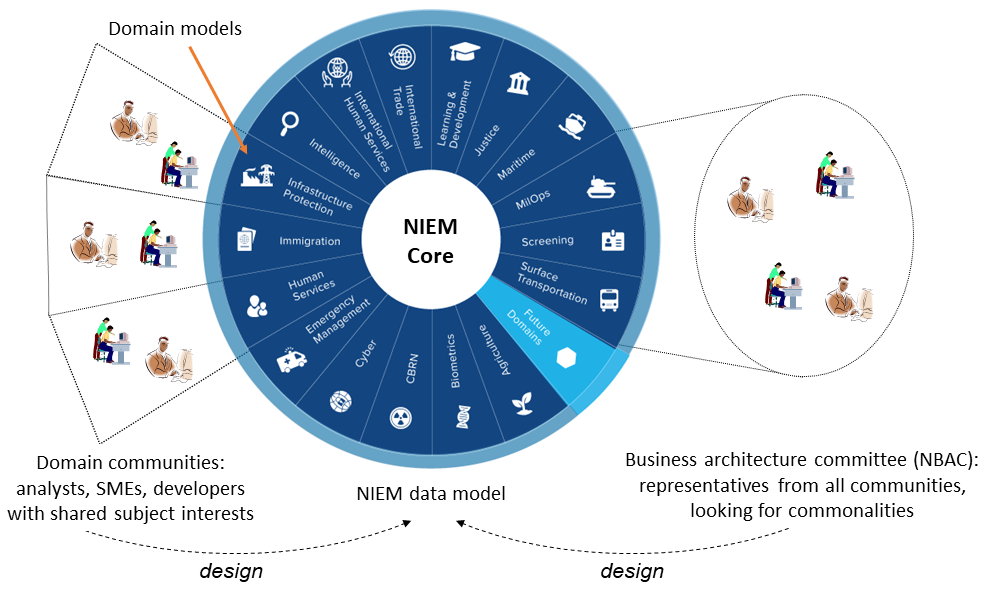
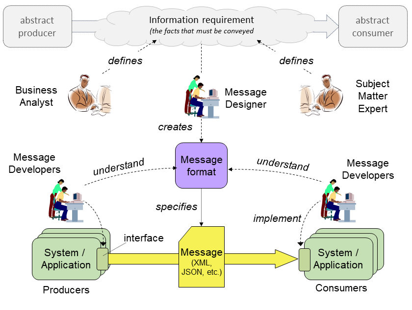
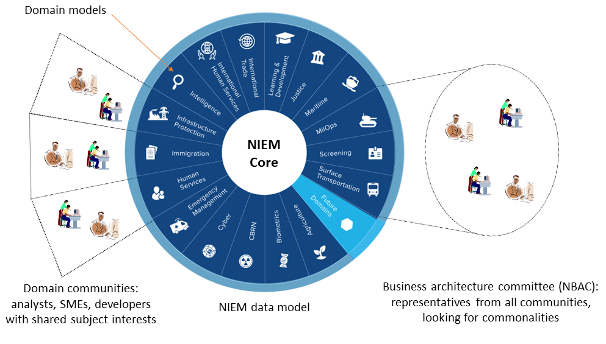

> 2024-04-15 draft
>
> Revised section 3.
>
> 2024-04-10 draft
>
> Includes Vamsi's text for sections 1 and 2.  The plan now is to keep filling out this outline until enough sections are complete. Then we will remove the comment stuff and apply the OASIS template.
>
> 2024-02-26 draft
>
> Attempts to be a fairly complete outline of NDR6. Includes everything I can remember from the 2024-02-22 NDR-outline telcon.  
>
> I tried to include all of the essential goals and principles from NDR 5.  I tried to mash up everything important from the technical architecture PN, the architecture change PN, the data modeling paper, the NTAC discussions, and the NDR discussions and issues.
>
> I did not pay any attention to the OASIS template.  I did not try to fit into the [niem-ndr.md](https://github.com/niemopen/niem-naming-design-rules/blob/dev/niem-ndr.md) document that is posted in the NDR dev branch.

**Outline**

> Last Thursday we figured out:  We aren't going to introduce any new *modeling formalisms*, so we don't need to put CMF and XSD into separate documents.  We aren't going to introduce new *message serializations* soon, so we don't really need to put NIEM XML and NIEM JSON into separate documents, either.  When we support a new serialization, that will go into a separate document (at least until we suck it into NDR 7).

[TOC]

## 1. Introduction

NIEM, formerly known as the "National Information Exchange Model,” is a framework for exchanging information between public and private sector organizations. The framework includes a [reference data model](https://docs.oasis-open.org/niemopen/niem-model/v6.0/niem-model-v6.0.html) for objects, properties, and relationships; and a set of technical specifications for using and extending the data model in information exchanges. The NIEM framework supports developer-level specifications of data that form a contract between developers. The data being specified is called a *message* in NIEM. While a message is usually something passed between applications, NIEM works equally well to specify an information resource published on the web, an input or output for a web service or remote procedure, and so forth, basically, any chunk of data that crosses a system or organization boundary.

NIEM promotes scalability and reusability of messages between information systems, allowing organizations to share data and information more efficiently. It was launched in 2005 in response to the U.S. Homeland Security Presidential Directives to improve information sharing between agencies following 9/11.Until 2023, NIEM was updated and maintained in a collaboration between the U.S. federal government, state and local government agencies, private sector, and non-profit and international organizations, with new versions released around once per year. NIEM defines a set of common objects, the *NIEM Core*, and 17 sets of objects that are specific to certain government or industry verticals, the *NIEM Domains*.

In 2023, NIEM became the NIEMOpen OASIS Open Project. NIEMOpen welcomes participation by anyone irrespective of affiliation with OASIS. Substantive contributions to NIEMOpen and feedback are invited from all parties, following the OASIS rules and the usual conventions for participation in GitHub public repository projects.

NIEMOpen is the term generally used when referring to the organization such as Project Governing Board (PGB), NIEMOpen Technical Architecture Committee(NTAC), NIEMOpen Business Architecture Committee(NBAC), organization activities or processes. NIEM is the term used when directly referring to the model i.e. NIEM Domain Space, NIEM Model version.

This document specifies principles and enforceable rules for NIEM data components and schemas. Schemas and components that obey the rules set forth here are conformant to specific conformance targets. These targets are defined in order that they may be leveraged for comprehensive definitions of NIEM conformance. Such definitions may include more than the level of conformance defined by this NDR, and may include specific patterns of use, additional quality criteria, and requirements to reuse NIEM release schemas.

This document uses formatting and syntactic conventions to clarify meaning and avoid ambiguity. This document relies on references to many outside documents. Such references are noted by bold, bracketed inline terms. For example, a reference to RFC 3986 is shown as [RFC 3986](https://github.com/niemopen/niem-naming-design-rules/blob/dev/niem-ndr.md#Appendix-A-References). All reference documents are recorded in [Appendix A, References, below](https://github.com/niemopen/niem-naming-design-rules/blob/dev/niem-ndr.md#appendix-a-references).


## 2. How To Read This Document

This document provides normative specifications for NIEM data models. It also describes the goals and principles behind those specifications. It includes examples and explanations to help people understand the goals, principles, and specifications. People in different roles will have the greatest interest in different sections. Figure 2-1 illustrates the relationships between these roles and NIEM.

<center>
  <figure>
    <a name="fig2-1"/></a>
      
    <figcaption><i>Figure 2-1: NIEM-based machine-to-machine data exchange</i>
  </figure>
</center>

Figure 2-1 emphasizes the design and implementation of NIEM-based data exchange specifications. Figure 2-2 instead emphasizes the community agreement that forms the NIEM data model.

<center>
  <figure class="image">
    <a name="fig2-2"/></a>
    
    <figcaption><i>Figure 2-2: NIEM communities and data models</i></figcaption>
  </figure>
</center>

>Now list the roles and what sections they should read first:
>
>* Managers and other echelons above reality
>
>* Business analyst and subject matter expert
>
>* Message designer
>
>* Message developer


## 3. Overview of the NIEM Technical Architecture

This overview describes NIEM's design goals and principles. It introduces key features of the architecture that will be defined in more detail later in the document.

### 3.1 Machine-to-machine data specifications

NIEM is a framework for developer-level specifications of data. A NIEM-based data specification – which is built *using* NIEM and in *conformance* to NIEM, but is not itself a *part* of NIEM – describes data to the developers of producing and consuming systems. This data may be shared via:

* a message passed between applications
* an information resource published on the web
* an API for a system or service

NIEM is potentially useful for any mechanism that transfers a package of data across a system or organization boundary. (Within a large system, NIEM may be useful when data passes from one developer team to another.)

The primary purpose of a NIEM-based data specification is to establish a common understanding among developers, so that they can write software that correctly handles the shared data, hence "machine-to-machine". (The content of a NIEM message may also be directly presented to human consumers, and NIEM can help these consumers understand what they see, but that is not the main purpose of NIEM.)

In NIEM terms, the package of data shared at runtime is a *message*. A *message format* specifies the syntax and semantics of a class of messages; it defines the mandatory and optional content of messages conforming to the format and the meaning of that content. A *message type* specifies the information content of a class of messages without prescribing a serialization. Both of these specifications are expressed in terms of a machine-readable *data model*, using either of NIEM's two *modeling formats.* A collection of related message formats and types is a *message specification.*

> A NIEM message was originally known as an *information exchange package (IEP)*, a term that found its way into the U.S. Federal Enterprise Architecture (2005).  A message specification was originally known as an *information exchange package documentation (IEPD).*  These terms are still in widespread use within the NIEM community today, and will not go away soon (if ever). 

A *message designer* creates a message format from an information requirement, so that a message at runtime will contain all the facts that need to be conveyed. Then any number of *message developers* write software to implement the specification, producing or processing messages that conform to the message format. Message designers need some understanding of NIEM, but the message developers do not. (Sometimes the message developers do not even know that NIEM exists.) [Figure 2-1](#fig2-1) illustrates the relationships between message designers, message developers, and message formats.

NIEM supports serialization in XML and JSON-LD; support for others (YAML, Protobuf, etc.) may be added in the future. One important feature of NIEM is that messages of the same type are convertable across serializations; for example, a NIEM XML message can be converted to NIEM JSON, and vice versa, with no bespoke programming required. 

### 3.2 Reuse of community-agreed data models

NIEM is also a framework for communities to create data models for concepts that are useful in many data specifications. These community models are typically not *complete* for any particular specification. Instead, they reflect the community's judgement on which defintions are *worth the trouble of agreement*. The NIEM core model contains definitions found useful by the NIEM community as a whole. NIEM domain models reuse the core, extending it with defintions found useful by the domain community. The core model plus the domain models comprise the "NIEM model". Data specification designers reuse definitions from the core and domain models, adding definitions that they require but have not (so far!) been found worthy of inclusion in the NIEM model. [Figure 2-2]() illustrates the relationships between domain communities and community models.

This reuse is especially useful in a large enterprise. Its value grows with the number of developer teams, and with the degree of commonality in the shared data. NIEM was originally designed for data sharing among federal, state, and local governments – where commonality and number of developer teams is large indeed.

### 3.3 Reuse of open standards

NIEM is built on a foundation of open standards, primarily:

* XML and XSD – message serialization and validation; also a modeling formalism
* JSON and JSON-LD – message serialization and linked data
* RDF, RDFS, and OWL – formal semantics
* ISO 11179 – data element naming conventions

One of NIEM's principles is to reuse well-known information technology standards when these are supported by free and open-source software. NIEM avoids reuse of standards that effectively depend on expensive COTS development or runtime software. When the NIEMOpen project defines a standard of its own, it also provides free and open-source software to support it.

### 3.4 The NIEM metamodel

A data model in NIEM defines the syntax and semantics of a message format, or the information content of a message type, or the agreed definitions of a community. The information required for those purposes can itself be modeled. That model is the *NIEM metamodel* -- an abstract model for NIEM data models. The metamodel is expressed in UML, and is described in detail in [section 4](). At a high level, the major components of the metamodel are classes, datatypes, properties, and namespaces.
<center>
  <figure class="image">
    <a name="fig3-1"/></a>
    
    <figcaption><i>Figure 3-1: High-level view of the NIEM metamodel</i></figcaption>
  </figure>
</center>
- A *class* defines the content of a corresponding *object* (or *resource*) in a message.
- A *datatype* defines the allowed values of a corresponding atomic *literal value* in a message.
- A class has one or more *properties*. An *object property*, defines a subject-predicate-value relationship between an object and another object.  A *data property* defines a relationship between an object and a literal value.
- A *namespace* is a collection of uniquely-named components; described in more detail in section 3.4.

Figure 3-2 below illustrates the relationships among metamodel components and the corresponding message objects and values.

<center>
  <figure class="image">
    <a name="fig3-1"/></a>
    
    <figcaption><i>Figure 3-2: Message object and metamodel components</i></figcaption>
  </figure>
</center>
This abstract metamodel is instantiated by two concrete model formats: NIEM XSD and NIEM CMF. These are described in sections XX and XX.

### 3.5 Namespaces

The components of a NIEM model are partitioned into *namespaces.* This prevents name clashes among communities or domains that have different business perspectives, even when they choose identical data names to represent different data concepts.

Each namespace has an author: a person or organization that is the authoritative source for the namespace definitions. A namespace is the collection of model components for concepts of interest to the namespace author. Namespace cohesion is important; a namespace should be designed so that its components are consistent, may be used together, and may be updated at the same time.

Each namespace has a URI. The namespace author should also be the URI's owner, as defined by [ref webarch](). Both URNs and URLs are allowed. It is helpful, but not required, for the namespace URI to be accessible, returning the definition of the namespace content in a supported model format. (See [future ref repositories]() for an alternate way to obtain namespace definitions.)

Namespaces are the units of model configuration management. Once published, the components in a namespace do not change. An incompatible change to the contents means a new namespace, with a different URI. As a result, a change by one namespace author does not force a change by any other author – the new version may be adopted, if desired, whenever convenient; the old version continues to work forever.

### 3.6 NIEM models in XSD

XSD is a modeling format for all existing versions of NIEM.  The components of a model namespace are defined by a single NIEM XSD schema document. These schema documents are categorized according to the conformance rules they satisfy:

* A *reference schema document* provides definitions that are intended for the widest possible reuse. The rules for a reference schema document (in [section XX]()) forbid schema constructs that limit reuse, and include all of the schema constructs that capture the meaning of the schema components. Every namespace in the NIEM model is authoritatively defined by a reference schema document; that is, there is only one reference schema document for a namespace.
* An *extension schema document* provides authoritative definitions that are intended for reuse within a more narrow scope than those defined by a reference schema document. Often the intended scope is a particular message specification. An extension schema document expresses the additional vocabulary required for information exchange, above and beyond the vocabulary available from the NIEM model. The rules for an extension schema document (in [section XX]()) permit some constructs that limit reuse, but include all constructs related to semantics. There is only one extension schema document for a namespace.
* A *subset schema document* provides a selection of components defined in a reference or extension schema document. Everything valid against the subset schema document must also be valid against the reference or extension schema for that namespace. The rules for a subset schema document (in [section XX]()) slightly relax the documentation requirements in the extension schema document rules. There can be any number of subset schema documents for a namespace.
* A *message schema document* also provides a selection of components from a reference or extension schema document, and everything valid against the subset schema document must also be valid against the reference or extension schema for that namespace. However, a message schema document is not intended for extension or reuse, or to provide semantics (these are provided by the corresponding reference or extension schema). A message schema document instead provides cardinality and datatype constraints intended to precisely define the content of a particular message format. The rules for a message schema document (in [section XX]()) are much smaller and less constraining than those for the other three kinds. There can be any number of message schema documents for a namespace.
* A *constraint schema document* is a schema document that is unrelated to the specification of a message format. There are no rules for a constraint schema document, and there can be any number of constraint schema documents for a namespace.

These conformance rules are defined in section XX. The rules amplify and constrain the use of XML Schema, for three reasons:

  1. For reuse:  To permit XML schema documents created by independent communities to be composed into a single data exchange specification, and to forbid schema constructs that needlessly limit such reuse. 
  2. For semantics:  To impose meaning on the definitions and declarations in a NIEM XML schema document, and on the elements and attributes in a NIEM XML message. 
  3. For developer convenience:  To forbid, where consistent with #1 and #2, constructs in XSD that cause difficulties with COTS XML tooling.

The complex connections between abstract metamodel components and concrete NIEM XSD components is detailed in section XX. Figure 3-3 provides an example of these connections, showing the NIEM XSD instantiation of the abstract model components in figure 3-2. (The complete definition of these components in the actual NIEM model is much larger.)

```
<xs:complexType name="PersonType">
  <xs:complexContent>
    <xs:extension base="structures:ObjectType">
      <xs:sequence>
        <xs:element ref="nc:PersonName"/>
      </xs:sequence>
    </xs:extension>
  </xs:complexContent>
<xs:complexType>
<xs:element name="PersonName" type="nc:PersonNameType"/>
<xs:complexType name="PersonNameType">
  <xs:complexContent>
    <xs:extension base="structures:ObjectType">
      <xs:sequence>
        <xs:element ref="nc:PersonFullName"/>
      </xs:sequence>
    </xs:extension>
  </xs:complexContent>
<xs:complexType>
<xs:element name="PersonFullName" type="xs:string"/>
```
<center><i>Figure 3-3: Sample model in NIEM XSD</I></center>


### 3.7 NIEM models in CMF

XSD as a modeling format supports conformance testing of NIEM XML messages through schema validation. But this is of no use to JSON developers working with JSON messages, who have no interest in reading XSD to understand a NIEM message format. Nor do developers working with any other serialization. In addition, software to read model information from an XML schema document pile is hard to write, which means working with NIEM XSD is a serious obstacle to NIEM tool developers. 

CMF is NIEM's answer to those difficulties – an alternative modeling format to support non-XML message developers and NIEM tool developers. CMF is a NIEM-based data specification like any other. A NIEM data model expressed in CMF is a NIEM message, and like any NIEM message, can be converted between XML, JSON, and any other supported serialization.

The rules for CMF model files are given in [section XX](). They are much less complex than those for XSD. 

The connections between abstract metamodel components and concrete NIEM CMF components is direct; classes and attributes have the same names in the metamodel UML and the CMF model. Figure 3-4 provides an example of these connections, showing the NIEM CMF instantiation of the abstract model components in figure 3-2.

```
<Class structures:id="nc.PersonType">
  <Name>PersonType</Name>
  <Namespace structures:ref="nc" xsi:nil="true"/>
  <HasProperty>
    <ObjectProperty structures:ref="nc.PersonName" xsi:nil="true"/>
    <MinOccursQuantity>1</MinOccursQuantity>
    <MaxOccursQuantity>1</MaxOccursQuantity>
  </HasProperty>
</Class>
<ObjectProperty structures:id="nc.PersonName"/>
  <Name>PersonName</Name>
  <Namespace structures:ref="nc" xsi:nil="true"/>
  <Class structures:ref="nc.PersonNameType" xsi:nil="true"/>
</ObjectProperty>
<Class structures:id="nc.PersonNameType">
  <Name>PersonNameType</Name>
  <Namespace structures:ref="nc" xsi:nil="true"/>
  <HasProperty>
    <DataProperty structures:ref="nc.PersonFullName" xsi:nil="true"/>
    <MinOccursQuantity>1</MinOccursQuantity>
    <MaxOccursQuantity>1</MaxOccursQuantity>
  </HasProperty>
</Class>
<DataProperty structures:id="nc.PersonFullName"/>
  <Name>PersonName</Name>
  <Namespace structures:ref="nc" xsi:nil="true"/>
  <Datatype structures:ref="xs:string" xsi:nil="true"/>
</DataProperty>
<Datatype structures:id="xs.string">
  <Name>string</Name>
  <Namespace structures:ref="xs" xsi:nil="true"/>
</Datatype>
```

<center><i>Figure 3-4: Sample model in NIEM CMF</i></center>

Because CMF is an ordinary NIEM-based message format, the CMF model has both an XSD and a CMF representation. Both of these are provided at [ref CMF specification repo]().

### 3.9 NIEM messages in XML and JSON

The mandatory and optional content of a NIEM message format may be specified in either NIEM XSD or CMF (or both). The information content of a NIEM message may be serialized as XML or JSON-LD. Figures 3-5 and 3-6 show the NIEM XML and SJON serialzations of the information depicted in figure 3-2.

```
<nc:Person
  xmlns:nc="https://docs.oasis-open.org/niemopen/ns/model/niem-core/6.0/">
  <nc:PersonName>
    <nc:PersonFullName>Clark Kent</nc:PersonFullName>
  </nc:PersonName>
</nc:Person>
```

<center><i>Figure 3-5: Sample NIEM XML message</i></center>

```
{ 
  "nc:Person": {
    "nc:PersonName": {
      "nc:PersonFullName": "Clark Kent"
    }
  },
  @context: { "nc": "https://docs.oasis-open.org/niemopen/ns/model/niem-core/6.0/" }
}
```

<center><i>Figure 3-6: Sample NIEM JSON message</i></center>

### 3.10 NIEM Conformance

NIEM defines conformance; it does not define compliance. Anyone may assess conformance, by applying the rules in this document. Compliance is assessed by someone with authority to compel change or withhold approval. That sort of authoritative assessment is out of scope for NIEMOpen.

NIEM defines conformance for models and messages. It does not define conformance for applications, systems, databases, or tools. It is therefore impossible for any of these to properly claim "NIEM conformance".  However, they *may* claim to generate messages or models that conform.

A model conforms to the *NIEM architecture* when it follows the rules in this document.  A model conforms to the *NIEM model* when it reuses components from the NIEM model, instead of needlessly duplicating the components therein.

Messages may be tested for conformance to their message format in the following ways:

1. *XML message, XSD model:* Compose a schema by assembling the schema documents for the namespaces, then perform XML Schema validation.
2. *XML message, CMF model:* Generate message schema documents from CMF, then as above.
3. *JSON message, CMF model:* Generate JSON Schema from CMF, use it to validate the message.
4. *JSON message, XSD model:* Convert the XSD model to CMF, then as above.

NIEMOpen provides free and open-source tools to support #2, #3, and #4. These can be found at [ref tools]().

### 3.11 The NIEM conceptual model

NIEM models in XSD and CMF define the detailed meaning of messages in a particular message format.  But there is another model, the *NIEM conceptual model*, that supplies the meaning of NIEM data *in general*. According to this conceptual model, the data in any NIEM message is a collection of statements about the world; for example, that a person has a name, a residence location, a spouse, etc. The assertion of one set of facts does not necessarily rule out other statements: A person could have multiple names, could have moved, or could be divorced. Each statement is a claim asserted to be true by the author of the message.

This conceptual model is based on a set of W3C Recommendations, the Resource Description Framework (RDF). NIEM models and messages have an equivalent representation in RDF. This provides numerous advantages:

* NIEM’s conceptual model is defined by a recognized standard.
* NIEM’s conceptual model is very well defined.
* NIEM’s use of the RDF model defines what a set of NIEM data means. The RDF specification provides a detailed description of what a statement means. This meaning is leveraged by NIEM.
* NIEM’s use of the RDF model provides a basis for inferring and reasoning about XML data that uses NIEM. That is, using the rules defined for the RDF model, programs can determine implications of relationships between NIEM-defined objects.

NIEM message designers and developers are not required to understand RDF. The concepts in this document are explained in terms of the metamodel, XSD, and CMF. The relationships between NIEM models and messages are confined to [the RDF section].


## 4. Metamodel and metamodel rules

## 5. CMF and CMF rules

## 6. XSD and XSD rules

- Message schemas!
- many many XSD rules – say something about schematron, point to files

## 7. CMF and XSD equivalence

## 8. Messages

### 8.1 NIEM XML

### 8.2 NIEM JSON

## 9. RDF stuff at the end, or elsewhere

*Normative:*

* all covered!

*Non-normative:*

* Appendix: some of the Modeling guidance (from NDR 5 principles)
* Appendix: Terminology (NDR 5 section 3)
* Appendex: References
* Appendex: Index: definitions, rules, general

*What should be separate?*

* schematron rules in separate files!
* new message serializations (protobuf, YAML) go in separate documents, at least until NIEM 8