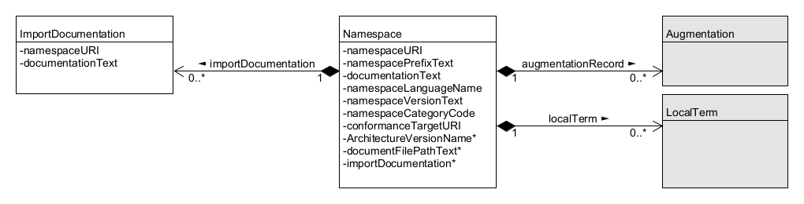

> 2024-04-24 draft
>
> New section 4.
> Comments from Jim and Jennifer incorporated.
>
> 2024-04-15 draft
>
> Revised section 3.
>
> 2024-04-10 draft
>
> Includes Vamsi's text for sections 1 and 2.  The plan now is to keep filling out this outline until enough sections are complete. Then we will remove the comment stuff and apply the OASIS template.
>
> 2024-02-26 draft
>
> Attempts to be a fairly complete outline of NDR6. Includes everything I can remember from the 2024-02-22 NDR-outline telcon.  
>
> I tried to include all of the essential goals and principles from NDR 5.  I tried to mash up everything important from the technical architecture PN, the architecture change PN, the data modeling paper, the NTAC discussions, and the NDR discussions and issues.
>
> I did not pay any attention to the OASIS template.  I did not try to fit into the [niem-ndr.md](https://github.com/niemopen/niem-naming-design-rules/blob/dev/niem-ndr.md) document that is posted in the NDR dev branch.

**Outline**

> Last Thursday we figured out:  We aren't going to introduce any new *modeling formalisms*, so we don't need to put CMF and XSD into separate documents.  We aren't going to introduce new *message serializations* soon, so we don't really need to put NIEM XML and NIEM JSON into separate documents, either.  When we support a new serialization, that will go into a separate document (at least until we suck it into NDR 7).

[TOC]

# 1. Introduction

NIEM, formerly known as the "National Information Exchange Model,” is a framework for exchanging information between public and private sector organizations. The framework includes a [reference data model](https://docs.oasis-open.org/niemopen/niem-model/v6.0/niem-model-v6.0.html) for objects, properties, and relationships; and a set of technical specifications for using and extending the data model in information exchanges. The NIEM framework supports developer-level specifications of data that form a contract between developers. The data being specified is called a *message* in NIEM. While a message is usually something passed between applications, NIEM works equally well to specify an information resource published on the web, an input or output for a web service or remote procedure, and so forth, basically, any package of data that crosses a system or organization boundary.

NIEM promotes scalability and reusability of messages between information systems, allowing organizations to share data and information more efficiently. It was launched in 2005 in response to the U.S. Homeland Security Presidential Directives to improve information sharing between agencies following 9/11. Until 2023, NIEM was updated and maintained in a collaboration between the U.S. federal government, state and local government agencies, private sector, and non-profit and international organizations, with new versions released around once per year. NIEM defines a set of common objects, the *NIEM Core*, and 17 sets of objects that are specific to certain government or industry verticals, the *NIEM Domains*.

In 2023, NIEM became the NIEMOpen OASIS Open Project. NIEMOpen welcomes participation by anyone irrespective of affiliation with OASIS. Substantive contributions to NIEMOpen and feedback are invited from all parties, following the OASIS rules and the usual conventions for participation in GitHub public repository projects.

NIEMOpen is the term generally used when referring to the organization such as Project Governing Board (PGB), NIEMOpen Technical Architecture Committee (NTAC), NIEMOpen Business Architecture Committee (NBAC), organization activities or processes. NIEM is the term used when directly referring to the model i.e. NIEM Domain, NIEM Model version.

This document specifies principles and enforceable rules for NIEM data components and schemas. Schemas and components that obey the rules set forth here are conformant to specific conformance targets. Conformance targets may include more than the level of conformance defined by this NDR, and may include specific patterns of use, additional quality criteria, and requirements to reuse NIEM release schemas.

This document uses formatting and syntactic conventions to clarify meaning and avoid ambiguity. This document relies on references to many outside documents. Such references are noted by bold, bracketed inline terms. For example, a reference to RFC 3986 is shown as [RFC 3986](https://github.com/niemopen/niem-naming-design-rules/blob/dev/niem-ndr.md#Appendix-A-References). All reference documents are recorded in [Appendix A, References, below](https://github.com/niemopen/niem-naming-design-rules/blob/dev/niem-ndr.md#appendix-a-references).


# 2. How To Read This Document

This document provides normative specifications for NIEM data models. It also describes the goals and principles behind those specifications. It includes examples and explanations to help users of NIEM understand the goals, principles, and specifications. The relevant sections of this document will depend on the role of the user. Figure 2-1 illustrates the relationships between these roles and NIEM.

<center>
  <figure>
    <a name="fig2-1"/></a>
      
    <figcaption><i>Figure 2-1: NIEM-based machine-to-machine data exchange</i>
  </figure>
</center>

Figure 2-1 emphasizes the design and implementation of NIEM-based data exchange specifications. Figure 2-2 instead emphasizes the community agreement that forms the NIEM data model.

<center>
  <figure class="image">
    <a name="fig2-2"/></a>
    
    <figcaption><i>Figure 2-2: NIEM communities and data models</i></figcaption>
  </figure>
</center>

>This document is intended for NIEM users in the following roles:
>
>* Manager (or executive)
>* Business analyst (or subject matter expert)
>* Message designer
>* Message developer

The remaining sections of this document most relevant to each of these roles are shown in the following table:

|Section | Manager | Business Analyst | Message Designer | Message Developer |
| :---- | :---: | :----: | :---: | :---: |
| 3. Overview of NIEM technical architecture | x | x | x | x |
| 4. Metamodel | | | x | |
| 5. Common Model Format (CMF) models | | | x | |
| 6. XML Schema Definition (XSD) models | | | x | |
| 7. CMF/XSD model equivalence | | | x | |
| 8. XML/JSON messages | | x | x | x |
| 9. Resource Description Framework (RDF) messages | | | x | |

# 3. Overview of the NIEM Technical Architecture

This overview describes NIEM's design goals and principles. It introduces key features of the architecture that will be defined in more detail later in the document.

## 3.1 Machine-to-machine data specifications

NIEM is a framework for developer-level specifications of data. A NIEM-based data specification – which is built *using* NIEM and in *conformance* to NIEM, but is not itself a *part* of NIEM – describes data to the developers of producing and consuming systems. This data may be shared via:

* a message passed between applications
* an information resource published on the web
* an API for a system or service

NIEM is potentially useful for any mechanism that transfers a package of data across a system or organization boundary. (Within a large system, NIEM may be useful when data passes between components belonging to different developer teams.)

The primary purpose of a NIEM-based data specification is to establish a common understanding among developers, so that they can write software that correctly handles the shared data, hence "machine-to-machine". (The content of a NIEM message may also be directly presented to human consumers, and NIEM can help these consumers understand what they see, but that is not the main purpose of NIEM.)

In NIEM terms, the package of data shared at runtime is a *message*. A *message format* specifies the syntax and semantics of a class of messages; it defines the mandatory and optional content of messages conforming to the format and the meaning of that content. A *message type* specifies the information content of a class of messages without prescribing a serialization. Both of these specifications are expressed in terms of a machine-readable *data model*, using either of NIEM's two *modeling formats*, CMF or XSD. A collection of related message formats and types is a *message specification.*

> A NIEM message was originally known as an *information exchange package (IEP)*, a term that found its way into the U.S. Federal Enterprise Architecture (2005).  A message specification was originally known as an *information exchange package documentation (IEPD).*  These terms are still in widespread use within the NIEM community today, and will not go away soon (if ever). 

A *message designer* creates a message format from an information requirement, so that a message at runtime will contain all the facts that need to be conveyed. Then any number of *message developers* write software to implement the specification, producing or processing messages that conform to the message format. Message designers need some understanding of NIEM, but the message developers do not. (Sometimes the message developers do not even know that NIEM exists.) [Figure 2-1](#fig2-1) above illustrates the relationships between message designers, message developers, and message formats.

NIEM supports XML and JSON message formats; support for others may be added in the future. One important feature of NIEM is that messages of the same type are convertable across serializations; for example, a NIEM XML message can be converted to NIEM JSON, and vice versa, with no bespoke programming required. 

## 3.2 Reuse of community-agreed data models

NIEM is also a framework for communities to create data models for concepts that are useful in multiple data specifications. These community models are typically not *complete* for any particular specification. Instead, they reflect the community's judgement on which defintions are *worth the trouble of agreement*. The NIEM core model contains definitions found useful by the NIEM community as a whole. NIEM domain models reuse the core, extending it with defintions found useful by the domain community. The core model plus the domain models comprise the "NIEM model". [Figure 2-2]() above illustrates the relationships between domain communities and community models.

Message designers reuse definitions from the NIEM model, selecting a (usually small) subset of definitions that express part of their information requirement. Message designers then create model extensions, adding definitions that they require but have not (so far!) been found worthy of inclusion in the NIEM model. 

Data model reuse is especially useful in a large enterprise. Its value grows with the number of developer teams, and with the degree of commonality in the shared data. NIEM was originally designed for data sharing among federal, state, and local governments – where commonality and number of developer teams is large indeed.

### 3.3 Reuse of open standards

NIEM is built on a foundation of open standards, primarily:

* XML and XSD – message serialization and validation; also a modeling formalism
* JSON and JSON-LD – message serialization and linked data
* RDF, RDFS, and OWL – formal semantics
* ISO 11179 – data element naming conventions

One of NIEM's principles is to reuse well-known information technology standards when these are supported by free and open-source software. NIEM avoids reuse of standards that effectively depend on proprietary software. When the NIEMOpen project defines a standard of its own, it also provides free and open-source software to support it.

## 3.4 The NIEM metamodel

A data model in NIEM defines the syntax and semantics of a message format, or the information content of a message type, or the agreed definitions of a community. The information required for those purposes can itself be modeled. That model is the *NIEM metamodel* -- an abstract model for NIEM data models. The metamodel is expressed in UML, and is described in detail in [section 4](). At a high level, the major components of the metamodel are classes, datatypes, properties, and namespaces.

<center>
  <figure class="image">
    <a name="fig3-1"/></a>
    
    <figcaption><i>Figure 3-1: High-level view of the NIEM metamodel</i></figcaption>
  </figure>
</center>

- A *class* defines the content of a corresponding *object* (or *resource*) in a message.
- A *datatype* defines the allowed values of a corresponding atomic *literal value* in a message.
- A class has one or more *properties*. An *object property* defines a subject-predicate-value relationship between an object and another object.  A *data property* defines a relationship between an object and a literal value.
- A *namespace* is a collection of uniquely-named components; described in more detail in section 3.4.

Figure 3-2 below illustrates the relationships among metamodel components and the corresponding message objects and values.

<center>
  <figure class="image">
    <a name="fig3-1"/></a>
    
    <figcaption><i>Figure 3-2: Message object and metamodel components</i></figcaption>
  </figure>
</center>

The NIEM metamodel is implemented in two concrete model formats: NIEM XSD and NIEM CMF. These are described in sections XX and XX.

## 3.5 Namespaces

The components of a NIEM model are partitioned into *namespaces.* This prevents name clashes among communities or domains that have different business perspectives, even when they choose identical data names to represent different data concepts.

Each namespace has an author, a person or organization that is the authoritative source for the namespace definitions. A namespace is the collection of model components for concepts of interest to the namespace author. Namespace cohesion is important; a namespace should be designed so that its components are consistent, may be used together, and may be updated at the same time.

Each namespace must be uniquely identified by a URI. The namespace author should also be the URI's owner, as defined by [ref webarch](). Both URNs and URLs are allowed. It is helpful, but not required, for the namespace URI to be accessible, returning the definition of the namespace content in a supported model format. (See [future ref repositories]() for an alternate way to obtain namespace definitions.)

Namespaces are the units of model configuration management. Once published, the components in a namespace do not change. An incompatible change to the contents requires a new namespace, with a different URI. As a result, a change by one namespace author does not force a change by any other author – the revisions may be adopted, if desired, whenever convenient; the older namespace continues to be valid regardless.

## 3.6 NIEM models in XSD

XSD is a modeling format for all existing versions of NIEM.  The components of a model namespace are defined by a single NIEM XSD schema document. These schema documents are categorized according to the conformance rules they satisfy:

* A *reference schema document* provides definitions that are intended for the widest possible reuse. The rules for a reference schema document (in [section XX]()) are intended to capture the meaning of the schema components while avoiding constructs that limit reuse. Every namespace in the NIEM model is authoritatively defined by a reference schema document; that is, there is only one reference schema document for a namespace.
* An *extension schema document* provides authoritative definitions that are intended for reuse within a more narrow scope than those defined by a reference schema document. Often the intended scope is a particular message specification. An extension schema document expresses the additional vocabulary required for an information exchange, above and beyond the vocabulary available from the NIEM model. The rules for an extension schema document (in [section XX]()) are intended to define the semantics. There is only one extension schema document for a namespace.
* A *subset schema document* provides a selection of components defined in a reference or extension schema document. Everything valid against the subset schema document must also be valid against the reference or extension schema for that namespace. The rules for a subset schema document (in [section XX]()) are smaller and less constraining than those for other schema documents. There can be any number of subset schema documents for a namespace.
* A *message schema document* defines a selection of components from reference and/or extension schema documents. A message schema document provides cardinality and datatype constraints intended to precisely define the content of a particular message format. The rules for a message schema document (in [section XX]()) are much smaller and less constraining than those for the other three kinds. There can be any number of message schema documents for a namespace.
* A *constraint schema document* provides implementation-specific guidance that supplements the rules of a message format. There are no conformance rules for a constraint schema document. There can be any number of constraint schema documents for a namespace.

These conformance rules are defined in section XX. The rules amplify and constrain the use of XML Schema, for three reasons:

  1. For reuse:  To permit XML schema documents created by independent communities to be composed into a single data exchange specification, and to forbid schema constructs that needlessly limit such reuse. 
  2. For semantics:  To impose meaning on the definitions and declarations in a NIEM XML schema document, and on the elements and attributes in a NIEM XML message. 
  3. For developer convenience:  To forbid, where consistent with #1 and #2, constructs in XSD that cause difficulties with COTS XML tooling.

The mapping between metamodel components and NIEM XSD components is detailed in section XX. Figure 3-3 provides an example of these connections, showing the NIEM XSD instantiation of the abstract model components in figure 3-2. (The complete definition of these components in the actual NIEM model is much larger.)

```
<xs:complexType name="PersonType">
  <xs:complexContent>
    <xs:extension base="structures:ObjectType">
      <xs:sequence>
        <xs:element ref="nc:PersonName"/>
      </xs:sequence>
    </xs:extension>
  </xs:complexContent>
<xs:complexType>
<xs:element name="PersonName" type="nc:PersonNameType"/>
<xs:complexType name="PersonNameType">
  <xs:complexContent>
    <xs:extension base="structures:ObjectType">
      <xs:sequence>
        <xs:element ref="nc:PersonFullName"/>
      </xs:sequence>
    </xs:extension>
  </xs:complexContent>
<xs:complexType>
<xs:element name="PersonFullName" type="xs:string"/>
```
<center><i>Figure 3-3: Sample model in NIEM XSD</I></center><p/>

## 3.7 NIEM models in CMF

XSD as a modeling format supports conformance testing of NIEM XML messages through schema validation. But JSON developers (and developers working with other formats) cannot use XSD to validate their messages. Nor do they want to read XSD specifications of message content. CMF is an alternative modeling format supporting these developers.

CMF is a NIEM-based message specification. A NIEM data model expressed in CMF is a NIEM message, and like any NIEM message, can be converted between XML, JSON, and any other supported serialization.

The rules for CMF model files are given in [section XX](). They are much less complex than those for XSD. 

The connections between abstract metamodel components and concrete NIEM CMF components is direct; classes and attributes have the same names in the metamodel UML and the CMF model. Figure 3-4 provides an example of these connections, showing the NIEM CMF instantiation of the abstract model components in figure 3-2.

```
<Class structures:id="nc.PersonType">
  <Name>PersonType</Name>
  <Namespace structures:ref="nc" xsi:nil="true"/>
  <HasProperty>
    <ObjectProperty structures:ref="nc.PersonName" xsi:nil="true"/>
    <MinOccursQuantity>1</MinOccursQuantity>
    <MaxOccursQuantity>1</MaxOccursQuantity>
  </HasProperty>
</Class>
<ObjectProperty structures:id="nc.PersonName"/>
  <Name>PersonName</Name>
  <Namespace structures:ref="nc" xsi:nil="true"/>
  <Class structures:ref="nc.PersonNameType" xsi:nil="true"/>
</ObjectProperty>
<Class structures:id="nc.PersonNameType">
  <Name>PersonNameType</Name>
  <Namespace structures:ref="nc" xsi:nil="true"/>
  <HasProperty>
    <DataProperty structures:ref="nc.PersonFullName" xsi:nil="true"/>
    <MinOccursQuantity>1</MinOccursQuantity>
    <MaxOccursQuantity>1</MaxOccursQuantity>
  </HasProperty>
</Class>
<DataProperty structures:id="nc.PersonFullName"/>
  <Name>PersonName</Name>
  <Namespace structures:ref="nc" xsi:nil="true"/>
  <Datatype structures:ref="xs:string" xsi:nil="true"/>
</DataProperty>
<Datatype structures:id="xs.string">
  <Name>string</Name>
  <Namespace structures:ref="xs" xsi:nil="true"/>
</Datatype>
```

<center><i>Figure 3-4: Sample model in NIEM CMF</i></center><p/>

Because CMF is an ordinary NIEM-based message format, the CMF model has both an XSD and a CMF representation. Both of these are provided at [ref CMF specification repo]().

## 3.8 NIEM messages in XML and JSON

The content of a NIEM message format may be specified in either NIEM XSD or CMF. The content of a NIEM message may be formatted as XML or JSON-LD. Figures 3-5 and 3-6 show the NIEM XML and JSON serialzations of the information depicted in figure 3-2.

```
<nc:Person
  xmlns:nc="https://docs.oasis-open.org/niemopen/ns/model/niem-core/6.0/">
  <nc:PersonName>
    <nc:PersonFullName>Clark Kent</nc:PersonFullName>
  </nc:PersonName>
</nc:Person>
```

<center><i>Figure 3-5: Sample NIEM XML message</i></center><p/>

```
{ 
  "nc:Person": {
    "nc:PersonName": {
      "nc:PersonFullName": "Clark Kent"
    }
  },
  @context: { "nc": "https://docs.oasis-open.org/niemopen/ns/model/niem-core/6.0/" }
}
```

<center><i>Figure 3-6: Sample NIEM JSON message</i></center><p/>

## 3.9 NIEM Conformance

NIEM defines conformance – but not compliance – with the rules in this document. Compliance is assessed by an authority who can compel change or withhold approval. That sort of authoritative assessment is out of scope for NIEMOpen.

NIEM defines conformance for models and messages. It does not define conformance for applications, systems, databases, or tools. It is therefore impossible for any of these to properly claim "NIEM conformance".  However, they *may* claim to generate messages or models that conform.

A model conforms to the *NIEM architecture* when it follows the rules in this document.  A model conforms to the *NIEM model* when it reuses components from the NIEM model, instead of needlessly duplicating the components therein.

Messages may be tested for conformance to their message format in the following ways:

1. *XML message, XSD model:* Perform XML Schema validation.
2. *XML message, CMF model:* Generate XSD from CMF, perform XML Schema validation.
3. *JSON message, CMF model:* Generate JSON Schema from CMF, perform JSON Schema validation
4. *JSON message, XSD model:* Convert the XSD model to CMF, generate JSON Schema from CMF, perform JSON Schema validation

NIEMOpen provides free and open-source tools to support #2, #3, and #4. These can be found at [ref tools]().

</br>

# 4. Metamodel and metamodel rules

The NIEM metamodel is an abstract model that defines the content of a NIEM data model. It is defined by the following UML class diagram and the property tables in this section. The Common Model Format (CMF) is a message format for NIEM data models. The CMF data model is defined by the property tables in this section, which match CMF component names to the classes, attributes, and relationships in the UML class diagram.

<center>
  <figure class="image">
    <a name="fig4-1"/></a>
    
    <figcaption><i>Figure 4-1:The NIEM metamodel </i></figcaption>
  </figure>
</center>

The property table format used to document classes in CMF and in the metamodel has the following columns:

| Column | Definition |
| ------ | ---------- |
| UML | the name of the UML class, attribute, or relationship |
| CMF | the name of the corresponding CMF class, property, or datatype |
| Definition |  |
| Card | property cardinality; how many times it may/must appear in an object |
| Ord | true when the order of a repeatable property in an object is significant |
| Range | the class or datatype of a property |

## 4.1 Model class

A Model object represents a complete or partial NIEM model. In a complete model, there are definitions for all referenced components. A partial model must be made complete, by combining it with other partial models, before it can used to define a message format.

<center>
  <figure class="image">
    <a name="fig4-1"/></a>
    
    <figcaption><i>Figure 4-1: Model class diagram</i></figcaption>
  </figure>
</center>

| UML | CMF | Definition | Card | Ord | Range |
| --- | --- | ---------- | :--: | :-: | ----- |
| Model | ModelType | A data type for a NIEM data model. |
| comp | Component | A data concept for a component of a NIEM data model. | 0..* | - | ComponentType |
| ns | Namespace | A namespace of a data model component | 0..* | - | NamespaceType |

## 4.2 Namespace classes

Objects of these three classes represent the data vocabulary defined by the author of a namespace.

<center>
  <figure class="image">
    <a name="fig4-2"/></a>
    
    <figcaption><i>Figure 4-2: Namespace class diagram</i></figcaption>
  </figure>
</center>

### 4.2.1 Namespace class

A namespace object represents a namespace in a model.  Properties marked with a star pertain only to the XSD representation of a model.

| UML | CMF | Definition | Card | Ord | Range |
| --- | --- | ---------- | :--: | :-: | ----- |
| Namespace | NamespaceType | A data type for a namespace. 
| uri | NamespaceURI | A URI for a namespace. | 1 | - | xs:anyURI |
| prefix | NamespacePrefixText | A namespace prefix name for a namespace. | 1 | - | xs:NCName |
| documentation | DocumentationText | A human-readable text documentation of a namespace. | 1..* | Y | TextType |
| lang | NamespaceLanguageName | A name of a default language of the terms and documentation text in a namespace. | 1 | - | xml:lang |
| version | NamespaceVersionText | A version of a namespace; for example, used to distinguish a namespace subset, bug fix, documentation change, etc. | 1 | - | xs:token |
| kind | NamespaceKindCode | A kind of namespace in a CMF model (external, core, domain, etc.). | 1 | - | NamespaceKindCodeType |
| confTarg | ConformanceTargetURI | A [conformance target identifier](). | 0..* | - | xs:anyURI |
| niemVersion* | NIEMVersionText | A NIEM version number of the builtin schema components used in a namespace; e.g. "5" or "6". | 0..1 | - | xs:token |
| docPath* | DocumentFilePathText | A relative file path from a schema pile root directory to a schema document for this namespace. | 0..1 | - | xs:string |
| importDoc* | ImportDocumentationText | A human-readable documentation text from the first `xs:import` element importing this nameespace in a schema document pile. | 0..1 | - | xs:string |
| aug | AugmentationRecord | An augmentation of a class with a property by a namespace. | 0..* | - | AugmentationType|
| term | LocalTerm | A data type for the meaning of a term that may appear within the name of a model component. | 0..* | - | LocalTermType |

> Note: I'm now thinking we don't need `NIEMVersionText`. We can work that out from the conformance target assertions.  And we don't need `NamespaceKindCode`. We can work that out from the namespace URI and conformance target assertions -- or if we can't show it's BUILTIN, CORE, DOMAIN, EXTENSION, OTHERNIEM, XML, or XSD, then in a conforming schema pile it must be EXTERNAL. So I think these properties will go away when I have time to fool with it.

**Rule 4-1:** The URI for a namespace MUST be an [absolute URI (ref RFC XX)]().

**Rule 4-2:** The prefix for a namespace MUST be unique among all the namespace prefixes in a model.

**Rule 4-3:** The language name for the first instance of the *documentation* attribute in any object MUST be `en-US`. (This rule also applies to Component objects.)

**Rule 4-4:** The *version* attribute for a namespace MUST not be blank.

### 4.2.2 Augmentation class

*Augmentation* is the NIEM mechanism allowing the author of one namespace (the *augmenting namespace*) to add a property to a class in another namespace (the *augmented namespace*). It is an alternative to [subclassing (see section XX)](). Augmentation is used when the new author does not want to create a new kind of thing, but rather wants an additional property of an existing kind of thing -- a property that the original author does not (yet?) bothered to define -- without having to convince the original author to change his namespace and wait for the change.

An augmentation object belongs to the augmenting namespace. It records the augmented class, augmenting property, and the property cardinality. A *global augmentation* does not have an augmented class; it applies to every class in the model.

| UML | CMF | Definition | Card | Ord | Range |
| --- | --- | ---------- | :--: | :-: | ----- |
| Augmentation | AugmentationType | A data type for a class that is augmented with a property by a namespace. |
| index | AugmentationIndex | The ordinal position of an augmentation property that is part of an [augmentation type](). | 1 | - | xs:integer |
| minOccurs | MinOccursQuantity | The minimum number of times a property may occur within an object of a class. | 1 | - | xs:integer |
| maxOccurs | MaxOccursQuantity | The maximum number of times a property may occur within an object of a class. | 1 | - | MaxOccursType |
| global | GlobalAugmented | A kind of component (all associations, all objects, or all atomic values) that is the target of this global augmentation. | 0..1 | - | xs:NCName |
| class | Class | The augmented class. | 0..1 | - | ClassType |
| property | Property | The augmentation property . | 1 | - | PropertyType |

**Rule 4-5:** The *global* attribute and the *class* attribute MUST NOT both appear in an Augmentation object.

### 4.2.3 LocalTerm class

A *local term* is a word, phrase, acronym, or other string of characters that is used in the name of a namespace component, but that is not defined in [OED](), or that has a non-OED definition in this nameespace, or has a word sense that is in some way unclear. A local term object captures the namespace author's definition of such a local term.

| UML | CMF | Definition | Card | Ord | Range |
| --- | --- | ---------- | :--: | :-: | ----- |
| LocalTerm | LocalTermType | A data type for the meaning of a term that may appear within the name of a model component. |
| name | TermName | The name of the local term. | 1 | - | xs:token |
| documentation | DocumentationText | A human-readable text definition of a data model component or term, or the documentation of a namespace. | 0..1 | - | TextType |
| literal | TermLiteralText | A meaning of a local term provided as a full, plain-text form. | 0..1 | - | xs:string |
| sourceURI | SourceURI | A URI that is an identifier or locator for an originating or authoritative document defining a local term. | 0..* | - | xs:anyURI |
| citation | SourceCitationText | A plain text citation of, reference to, or bibliographic entry for an originating or authoritative document defining a local term. | 0..* | - | xs:string |

## 4.3 Components: Class and Property classes

Objects of these classes represent the classes and properties in a NIEM model.

<center>
  <figure class="image">
    <a name="fig4-3"/></a>
    
    <figcaption><i>Figure 4-3: Classes and properties</i></figcaption>
  </figure>
</center>

### 4.3.1 Component class (abstract)

A model component in a namespace is either a class object, a property object, or a datatype object in a NIEM model. The component class defines the common properties.

| UML | CMF | Definition | Card | Ord | Range |
| --- | --- | ---------- | :--: | :-: | ----- |
| Component | ComponentType | A data type for common properties of a data model component in NIEM. |
| name | Name | The name of a data model component. | 1 | - | xs:NCName |
| documentation | DocumentationText | A human-readable text definition of a data model component. | 0..* | Y | TextType |
| isAbstract | AbstractIndicator | True if a component is a base for extension, and must be specialized to be used directly; false if a component may be used directly. | 0..1 | - | xs:boolean |
| isDeprecated | DeprecatedIndicator | True for a deprecated schema component; that is, a component that is provided, but the use of which is not recommended. | 0..1 | - | xs:boolean |
| ns | Namespace | The namespace of a data model component. | 1 | - | NamespaceType |

### 4.3.2 Class class

A Class object represents an object class in a NIEM model.  For example, `nc:PersonType` is a class object in the NIEM Core model.

| UML | CMF | Definition | Card | Ord | Range |
| --- | --- | ---------- | :--: | :-: | ----- |
| Class | ClassType | A data type for a class. |
| isAugmentable | AugmentableIndicator | True if a  class can be augmented with additional properties. | 0..1 | - | xs:boolean |
| referenceCode | ReferenceCode | A code describing how a property may be referenced (or must appear inline). | 0..1 | - | ReferenceCodeType |
| subClassOf | ExtensionOfClass | A base class of a subclass. | 0..1 | - | ClassType |  
| hasProp | HasProperty | An occurrence of a property as content of a class. | 1..* | Y | HasPropertyType |

**Rule 4-5:** The name of a component object MUST end in "Type" if and only if it is a Class object.

### 4.3.3 HasProperty class

A HasProperty object represents the occurrence of a property in a class. 

| UML | CMF | Definition | Card | Ord | Range |
| --- | --- | ---------- | :--: | :-: | ----- |
| HasProperty | HasPropertyType | A data type for an occurrence of a property as content of a class. |
| minOccurs | MinOccursQuantity | The minimum number of times a property may occur within an object of a class. | 1 | - | xs:integer |
| maxOccurs | MaxOccursQuantity | The maximum number of times a property may occur within an object of a class. | 1 | - | MaxOccursType |
| documentation | DocumentationText | A human-readable documentation of a property that is content of a class. | 0..* | Y | TextType |
| isOrdered | OrderedPropertyIndicator | True if the order of a repeated property within an object is significant. | 0..1 | - | xs:boolean |
| augNamespace | AugmentingNamespace | A namespace responsible for augmenting a class with a property. | 0..1 | - | NamespaceType |
| property | Property | The property that occurs in the class. | 1 | - | PropertyType |

### 4.3.4 Property class (abstract)

A Property object represents a data property or an object property in a NIEM model.  For example, `nc:PersonName` is a property of the `nc:PersonType` class object.

| UML | CMF | Definition | Card | Ord | Range |
| --- | --- | ---------- | :--: | :-: | ----- |
| Property | PropertyType | A data type for a property. |
| isRelationship | RelationshipPropertyIndicator | True for a property that applies to the relationship between two objects (instead of to a single object). | 0..1 | - | xs:boolean |

### 4.3.5 ObjectProperty class

| UML | CMF | Definition | Card | Ord | Range |
| --- | --- | ---------- | :--: | :-: | ----- |
| ObjectProperty | ObjectPropertyType | A data type for an object property. |
| referenceCode | ReferenceCode | A code describing how a property may be referenced (or must appear inline). | 0..1 | - | ReferenceCodeType |
| class | Class | A class. | 1 | - | ClassType |

### 4.3.6 DataProperty class

| UML | CMF | Definition | Card | Ord | Range |
| --- | --- | ---------- | :--: | :-: | ----- |
| DataProperty | DataPropertyType | 
| isAttribute* | AttributeIndicator | True for a property that is represented as attributes in XML. | 0..1 | - | xs:boolean |
| isRefAttribute* | RefAttributeIndicator | True for a property that is an [object reference attribute](). | 0..1 | - | xs:boolean |
| datatype | Datatype | A data type. | 1 | - | DatatypeType |

## 4.4 Components: Datatype classes

<center>
  <figure class="image">
    <a name="fig4-4"/></a>
    
    <figcaption><i>Figure 4-3: Datatype classes</i></figcaption>
  </figure>
</center>

### 4.4.1 Datatype class

A datatype object defines the allowed values of a corresponding atomic literal value in a message. Objects for primitive data types, corresponding to the XSD data types, have only the *name*, *namespace*, and *documentation* properties inherited from the Component class. All other data types are represented by either a Restriction, List, or Union object.

### 4.4.2 List class

A list object defines a datatype as a whitespace-separated list of atomic values.

| UML | CMF | Definition | Card | Ord | Range |
| --- | --- | ---------- | :--: | :-: | ----- |
| List | ListType | A data type for a NIEM model datatype that is a whitespace-separated list of atomic values.
| isOrdered | OrderedPropertyIndicator | True if the order of a repeated property within an object is significant. | 0..1 | - | xs:boolean |
| listType | ListOf | The NIEM model datatype of the atomic values in a list. | 1 | - | DatatypeType |

### 4.4.3 Union class

A union object defines a datatype as the union of one or more datatypes.

| UML | CMF | Definition | Card | Ord | Range |
| --- | --- | ---------- | :--: | :-: | ----- |
| Union | UnionType | A data type for a NIEM model datatype that is a union of datatypes.
| unionType | UnionOf | A NIEM model datatype that is a member of a union datatype. | 1..* | - | DatatypeType |

### 4.4.4 Restriction class

A Restriction object defines a datatype as a restriction of a base datatype plus zero or more restricting Facet objects.

| UML | CMF | Definition | Card | Ord | Range |
| --- | --- | ---------- | :--: | :-: | ----- |
| RestrictionOf | RestrictionOfType | A data type for a restriction of a data type. |
| restricts | RestrictionOf | The NIEM model datatype that is restricted by this datatype. | 1 | - | DatatypeType |
| facet | Facet | A data concept for a facet that restricts an aspect of a data type. | 0..* | - | FacetType |
| clb | CodeListBinding | A property for connecting atomic values defined by a data type to a a column of a code list. | 0..1 | - | CodeListBindingType |

### 4.4.5 Facet class

There are eleven Facet subclasses in the metamodel, corresponding to the eleven constraining facets in XML Schema. In CMF there are eleven facet properties and four facet types.
| UML and CMF    | CMF type |
| -------------- | --------- |
| Enumeration    | AnyValueFacetType
| FractionDigits | NonNegativeValueFacetType
| Length         | NonNegativeValueFacetType
| MaxExclusive   | AnyValueFacetType
| MaxInclusive   | AnyValueFacetType
| MinExclusive   | AnyValueFacetType
| MinInclusive   | AnyValueFacetType
| MinLength      | NonNegativeValueFacetType
| Pattern        | PatternFacetType
| TotalDigits    | PositiveValueFacetType
| WhiteSpace     | WhiteSpaceFacetType

## 4.5 Other classes and datatypes


</br>

# 5. CMF and CMF rules

# 6. XSD and XSD rules

- Message schemas!
- many many XSD rules – say something about schematron, point to files

# 7. CMF and XSD equivalence

# 8. Messages

## 8.1 NIEM XML

## 8.2 NIEM JSON

# 9. RDF stuff at the end, or elsewhere

## The NIEM conceptual model

NIEM models in XSD and CMF define the detailed meaning of messages in a particular message format.  But there is another model, the *NIEM conceptual model*, that supplies the meaning of NIEM data *in general*. According to this conceptual model, the data in any NIEM message is a collection of statements about the world; for example, that a person has a name, a residence location, a spouse, etc. The assertion of one set of facts does not necessarily rule out other statements: A person could have multiple names, could have moved, or could be divorced. Each statement is a claim asserted to be true by the author of the message.

This conceptual model is based on a set of W3C Recommendations, the Resource Description Framework (RDF). NIEM models and messages have an equivalent representation in RDF. This provides numerous advantages:

* NIEM’s conceptual model is defined by a recognized standard.
* NIEM’s conceptual model is very well defined.
* NIEM’s use of the RDF model defines what a set of NIEM data means. The RDF specification provides a detailed description of what a statement means. This meaning is leveraged by NIEM.
* NIEM’s use of the RDF model provides a basis for inferring and reasoning about XML data that uses NIEM. That is, using the rules defined for the RDF model, programs can determine implications of relationships between NIEM-defined objects.

NIEM message designers and developers are not required to understand RDF. The concepts in this document are explained in terms of the metamodel, XSD, and CMF. The relationships between NIEM models and messages are confined to [the RDF section].

*Normative:*

* all covered!

*Non-normative:*

* Appendix: some of the Modeling guidance (from NDR 5 principles)
* Appendix: Terminology (NDR 5 section 3)
* Appendex: References
* Appendex: Index: definitions, rules, general

*What should be separate?*

* schematron rules in separate files!
* new message serializations (protobuf, YAML) go in separate documents, at least until NIEM 8