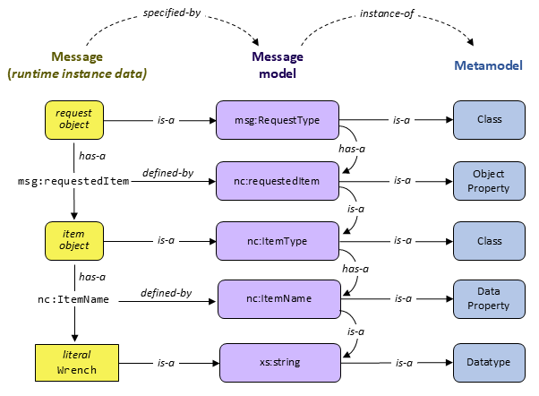

<div style="font-size:90%;">

```
Pagewidth:
...................................................................................font size:100% V...... 90% V
```

</div>

> 2024-06-24 draft
> Incorporated Jim's comments on augmentation section
>
> 2024-06-10 draft
>
> Augmentation section is complete
> June 4 NTAC suggestions incorporated
> Chuck Chipman comments incorporated
>
> 2024-06-03 draft
>
> Combined section 4 and 5 into new section 4: "Data models in NIEM" -- metamodel, CMF, and XSD
> Outlined section 5: "Modeling rules for NIEM XSD"
> Moved a lot of XSD stuff from section 3 into the new section 5
> Most of Jim's comments are incorporated
>
> 2024-05-20 draft
>
> Nearly complete section 5 -- still need section on augmentations.
>
> 2024-05-04 draft
>
> Section 3: better description of message spec, type, format; new figure 3-3
> Section 4: comments from Jim, new examples and figures; flattened outline
>
> 2024-04-24 draft
>
> New section 4.
> Section 3 comments from Jim and Jennifer incorporated.
>
> 2024-04-15 draft
>
> Revised section 3.
>
> 2024-04-10 draft
>
> Includes Vamsi's text for sections 1 and 2.  The plan now is to keep filling out this outline until enough sections are complete. Then we will remove the comment stuff and apply the OASIS template.
>
> 2024-02-26 draft
>
> Attempts to be a fairly complete outline of NDR6. Includes everything I can remember from the 2024-02-22 NDR-outline telcon.  
>
> I tried to include all of the essential goals and principles from NDR 5.  I tried to mash up everything important from the technical architecture PN, the architecture change PN, the data modeling paper, the NTAC discussions, and the NDR discussions and issues.
>
> I did not pay any attention to the OASIS template.  I did not try to fit into the [niem-ndr.md](https://github.com/niemopen/niem-naming-design-rules/blob/dev/niem-ndr.md) document that is posted in the NDR dev branch.

**Outline**

> Last Thursday we figured out:  We aren't going to introduce any new *modeling formalisms*, so we don't need to put CMF and XSD into separate documents.  We aren't going to introduce new *message serializations* soon, so we don't really need to put NIEM XML and NIEM JSON into separate documents, either.  When we support a new serialization, that will go into a separate document (at least until we suck it into NDR 7).

[TOC]

# 1. Introduction

NIEM, formerly known as the "National Information Exchange Model,” is a framework for exchanging information among public and private sector organizations. The framework includes a [reference data model](https://docs.oasis-open.org/niemopen/niem-model/v6.0/niem-model-v6.0.html) for objects, properties, and relationships; and a set of technical specifications for using and extending the data model in information exchanges. The NIEM framework supports developer-level specifications of data that form a contract between developers. The data being specified is called a *message* in NIEM. While a message is usually something passed between applications, NIEM works equally well to specify an information resource published on the web, an input or output for a web service or remote procedure, and so forth, basically, any package of data that crosses a system or organization boundary.

NIEM promotes scalability and reusability of messages between information systems, allowing organizations to share data and information more efficiently. It was launched in 2005 in response to the U.S. Homeland Security Presidential Directives to improve information sharing between agencies following 9/11. Until 2023, NIEM was updated and maintained in a collaboration between the U.S. federal government, state and local government agencies, private sector, and non-profit and international organizations, with new versions released around once per year. NIEM defines a set of common objects, the *NIEM Core*, and 17 sets of objects that are specific to certain government or industry verticals, the *NIEM Domains*.

In 2023, NIEM became the NIEMOpen OASIS Open Project. NIEMOpen welcomes participation by anyone irrespective of affiliation with OASIS. Substantive contributions to NIEMOpen and feedback are invited from all parties, following the OASIS rules and the usual conventions for participation in GitHub public repository projects.

NIEMOpen is the term generally used when referring to the organization such as Project Governing Board (PGB), NIEMOpen Technical Architecture Committee (NTAC), NIEMOpen Business Architecture Committee (NBAC), organization activities or processes. NIEM is the term used when directly referring to the model i.e. NIEM Domain, NIEM Model version.

This document specifies principles and enforceable rules for NIEM data components and schemas. Schemas and components that obey the rules set forth here are conformant to specific conformance targets. Conformance targets may include more than the level of conformance defined by this NDR, and may include specific patterns of use, additional quality criteria, and requirements to reuse NIEM release schemas.

<br/>

# 2. How To Read This Document

This document provides normative specifications for NIEM-conforming data models. It also describes the goals and principles behind those specifications. It includes examples and explanations to help users of NIEM understand the goals, principles, and specifications. The relevant sections of this document will depend on the role of the user. Figure 2-1 illustrates the relationships between these roles and NIEM.

<center>
  <figure>
    <a name="fig2-1"/></a>
      
    <figcaption><i>Figure 2-1: NIEM-based machine-to-machine data exchange</i>
  </figure>
</center>

Figure 2-1 above emphasizes the design and implementation of NIEM-based data exchange specifications. Figure 2-2 below instead emphasizes the community agreement that forms the NIEM data model.

<center>
  <figure class="image">
    <a name="fig2-2"/></a>
    
    <figcaption><i>Figure 2-2: NIEM communities and data models</i></figcaption>
  </figure>
</center>

The remaining sections of this document most relevant to each of these roles are shown in the following table:

|Section | Manager | Business Analyst | Message Designer | Message Developer |
| :---- | :---: | :----: | :---: | :---: |
| 3. Overview of NIEM technical architecture | x | x | x | x |
| 4. Data models in NIEM | | | x | |
| 5. Modeling rules for NIEM XSD | | | x | |
| 6. Rules for NIEM messages | | x | x | x |

This document uses formatting and syntactic conventions to clarify meaning and avoid ambiguity. This document relies on references to many outside documents. Such references are noted by bold, bracketed inline terms. For example, a reference to RFC 3986 is shown as [[RFC 3986]](https://github.com/niemopen/niem-naming-design-rules/blob/dev/niem-ndr.md#Appendix-A-References). All reference documents are recorded in [Appendix A, References, below](https://github.com/niemopen/niem-naming-design-rules/blob/dev/niem-ndr.md#appendix-a-references).

<br/>

# 3. Overview of the NIEM Technical Architecture

This overview describes NIEM's design goals and principles. It introduces key features of the architecture that will be defined in more detail later in the document.

## 3.1 Machine-to-machine data specifications

NIEM is a framework for developer-level specifications of data. A NIEM-based data specification – which is built *using* NIEM and in *conformance* to NIEM, but is not itself a *part* of NIEM – describes data to the developers of producing and consuming systems. This data may be shared via:

* a message passed between applications
* an information resource published on the web
* an API for a system or service

NIEM is potentially useful for any mechanism that transfers a package of data across a system or organization boundary. (Within a large system, NIEM may be useful when data passes between components belonging to different developer teams.)

The primary purpose of a NIEM-based data specification is to establish a common understanding among developers, so that they can write software that correctly handles the shared data, hence "machine-to-machine". (The content of a NIEM message may also be directly presented to human consumers, and NIEM can help these consumers understand what they see, but that is not the main purpose of NIEM.)

In NIEM terms, the package of data shared at runtime is a *message*. A *message type* defines the mandatory and optional information content of a class of messages without prescribing a particular syntax. A *message format* defines a syntax for the content of a message type. Both of these definitions are expressed in terms of a machine-readable *data model*, using either of NIEM's two *modeling formats*, the Common Model Format (CMF) or XML Schema (XSD). A collection of related message formats and types is a *message specification.* The usual case is a message specification with one message type and one message format, but a more complex arrangements is possible, illustrated in figure 3-1 below.

<center>
  <figure class="image">
    <a name="fig3-1"/></a>
    
    <figcaption><i>Figure 3-1: Message specification, types, and formats</i></figcaption>
  </figure>
</center>

> A NIEM message was originally known as an *information exchange package (IEP)*, a term that found its way into the U.S. Federal Enterprise Architecture (2005).  A message specification was originally known as an *information exchange package documentation (IEPD).*  These terms are still in widespread use within the NIEM community today, and will not go away soon (if ever). 

A *message designer* creates a message type and format from an information requirement, so that a message at runtime will contain all the facts that need to be conveyed. Then any number of *message developers* write software to implement the specification, producing or processing messages that conform to the message format. Message designers need some understanding of NIEM, but the message developers do not. (Sometimes the message developers do not even know that NIEM exists.) [Figure 2-1](#fig2-1) above illustrates the relationships between message designers, message developers, and message formats.

NIEM supports XML and JSON message formats; support for other formats may be added in the future. One important feature of NIEM is that messages of the same type are convertable across serializations; for example, a NIEM XML message can be converted to NIEM JSON, and vice versa, with no bespoke programming required. 

## 3.2 Reuse of community-agreed data models

NIEM is also a framework for communities to create data models for concepts that are useful in multiple data specifications. These community models are typically not *complete* for any particular specification. Instead, they reflect the community's judgement on which definitions are *worth the trouble of agreement*. The NIEM core model contains definitions found useful by the NIEM community as a whole. NIEM domain models reuse the core, extending it with definitions found useful by the domain community. The core model plus the domain models comprise the "NIEM model". [Figure 2-2]() above illustrates the relationships between domain communities and community models.

Message designers reuse definitions from the NIEM model, selecting a (usually small) subset of definitions that express part of their information requirement. Message designers then create model extensions, adding definitions that they require but have not (so far!) been found worthy of inclusion in the NIEM model. 

Data model reuse is especially useful in a large enterprise. Its value grows with the number of developer teams, and with the degree of commonality in the shared data. NIEM was originally designed for data sharing among federal, state, and local governments – where commonality and number of developer teams is large indeed.

## 3.3 Reuse of open standards

NIEM is built on a foundation of open standards, primarily:

* XML and XSD – message serialization and validation; also a modeling formalism
* JSON and JSON-LD – message serialization and linked data
* RDF, RDFS, and OWL – formal semantics
* ISO 11179 – data element conventions

One of NIEM's principles is to reuse well-known information technology standards when these are supported by free and open-source software. NIEM avoids reuse of standards that effectively depend on proprietary software. When the NIEMOpen project defines a standard of its own, it also provides free and open-source software to support it.

## 3.4 The NIEM metamodel

A data model in NIEM defines the syntax and semantics of a message format, or the information content of a message type, or the agreed definitions of a community. The information required for those purposes can itself be modeled. The model of that information is the *NIEM metamodel* -- an abstract model for NIEM data models. The metamodel is expressed in UML, and is described in detail in [section 4](). At a high level, the major components of the metamodel are classes, datatypes, properties, and namespaces. Figure 3-2 provides an lllustration.

<center>
  <figure class="image">
    <a name="fig3-2"/></a>
    
    <figcaption><i>Figure 3-2: High-level view of the NIEM metamodel</i></figcaption>
  </figure>
</center>

- A *class* defines the content of a corresponding *object* (or *resource*) in a message.
- A *datatype* defines the allowed values of a corresponding atomic *literal value* in a message.
- A class has one or more *properties*. An *object property* defines a subject-predicate-value relationship between an object and another object.  A *data property* defines a relationship between an object and a literal value.
- A *namespace* is a collection of uniquely-named components, described in more detail in section 3.5.

Figure 3-3 below illustrates the relationships among metamodel components, NIEM model components, and the corresponding message objects and values.

<center>
  <figure class="image">
    <a name="fig3-3"/></a>
    
    <figcaption><i>Figure 3-3: Message object and metamodel components</i></figcaption>
  </figure>
</center>

A NIEM message contains objects, properties, and values, which are defined by the Class, Property, and Datatype objects in a NIEM model. In figure 3-3, the name object is defined by the `nc:PersonNameType` Class object; the literal value is defined by the `xs:string` Datatype object, and the property relationship between the two is defined by the `nc:PersonFullName` DataProperty object.

## 3.5 NIEM model representations: XSD and CMF

The abstract metamodel has two concrete representations:  NIEM XSD and NIEM CMF.

XML Schema (XSD) is a NIEM model representation for all versions of NIEM. A NIEM model can be represented as a schema assembled from a collection of schema documents. Every aspect of the metamodel is represented in some way by a schema component. [Section 4](#4-data-models-in-niem) defines the mapping between the metamodel and XSD. [Section 5](#5-modeling-rules-for-niem-xsd) specifies additional rules for the NIEM profile of XSD.

XSD as a model representation supports conformance testing of NIEM XML messages through schema validation. However, JSON developers (and developers working with other formats) cannot use XSD to validate their messages. Nor do they want to read XSD specifications of message content. 

The Common Model Format (CMF) is a second NIEM model representation that supports all developers. CMF is the result of applying the NIEM framework to the information requirements in the metamodel. CMF is a NIEM-based message specification. A CMF message is a representation of a NIEM model. [Section 4](#4-data-models-in-niem) defines the mapping between the metamodel and CMF.

Because CMF is a NIEM-based message specification, it can define both an XML format and a JSON format.  CMF examples in this document appear as XML, but can be converted to JSON without loss, and vice versa. 

Because CMF and NIEM XSD are equivalent model representations, NIEM models can be converted from XSD to CMF without loss, and vice versa. 

## 3.6 Namespaces

The components of a NIEM model are partitioned into *namespaces.* This prevents name clashes among communities or domains that have different business perspectives, even when they choose identical data names to represent different data concepts.

Each namespace has an author, a person or organization that is the authoritative source for the namespace definitions. A namespace is the collection of model components for concepts of interest to the namespace author. Namespace cohesion is important; a namespace should be designed so that its components are consistent, may be used together, and may be updated at the same time.

Each namespace must be uniquely identified by a URI. The namespace author should also be the URI's owner, as defined by [ref webarch](). Both URNs and URLs are allowed. It is helpful, but not required, for the namespace URI to be accessible, returning the definition of the namespace content in a supported model format. (See [ref repositories]() for an alternative way to obtain namespace definitions.)

Namespaces are the units of model configuration management. Once published, the components in a namespace may not be removed or redefined. Those changes may only be made in a new namespace with a different URI. As a result, a change by one namespace author does not force a change by any other author – the revisions may be adopted, if desired, whenever convenient; the older namespace continues to be valid regardless.

## 3.7 NIEM messages in XML and JSON

The content of a NIEM message may be formatted as XML or JSON. Any NIEM message may be converted from one supported format to another, without loss of information. Figures 3-4 and 3-5 show the equivalent NIEM XML and JSON serializations of the information depicted in figure 3-3.

<div style="font-size:90%;">

```
<nc:Person
  xmlns:nc="https://docs.oasis-open.org/niemopen/ns/model/niem-core/6.0/">
  <nc:PersonName>
    <nc:PersonFullName>Clark Kent</nc:PersonFullName>
  </nc:PersonName>
</nc:Person>
```

<center><i><a name="fig3-4"></a>Figure 3-4: Sample NIEM XML message</i></center><p/>

```
{ 
  "nc:Person": {
    "nc:PersonName": {
      "nc:PersonFullName": "Clark Kent"
    }
  },
  @context: { "nc": "https://docs.oasis-open.org/niemopen/ns/model/niem-core/6.0/" }
}
```

</div>
<center><i><a name="fig3-5"></a>Figure 3-5: Sample NIEM JSON message</i></center><p/>

## 3.8 NIEM Conformance

NIEM defines *conformance* with the rules in this document. NIEM does not define *compliance*. Compliance is assessed by an authority who can compel change or withhold approval. That sort of authoritative assessment is out of scope for NIEMOpen.

NIEM defines conformance for models and messages. It does not define conformance for applications, systems, databases, or tools. It is therefore impossible for any of these to properly claim "NIEM conformance".  However, they *may* claim to generate conforming messages or to employ conforming models.

A model conforms to the *NIEM architecture* when it follows the rules in this document.  A model conforms to the *NIEM model* when it reuses components from the NIEM model, instead of needlessly duplicating the components therein.

Messages may be tested for conformance to their message format in the following ways:

1. *XML message, XSD model:* Perform XML Schema validation.
2. *XML message, CMF model:* Generate XSD from CMF, perform XML Schema validation.
3. *JSON message, CMF model:* Generate JSON Schema from CMF, perform JSON Schema validation
4. *JSON message, XSD model:* Convert the XSD model to CMF, generate JSON Schema from CMF, perform JSON Schema validation

NIEMOpen provides free and open-source tools to support #2, #3, and #4. These can be found at [ref tools]().

<br/>

# 4. Data models in NIEM

The NIEM metamodel is an abstract model, defined in the UML diagram below, that specifies the content of a NIEM data model. CMF is a NIEM message type that implements the metamodel. A CMF message is a representation of a NIEM data model. A NIEM data model may also be represented in NIEM XSD. This section specifies:

* the meaning of the classes, attributes, and relationships in the metamodel
* the meaning of the classes, datatypes, and properties in CMF that implement the metamodel
* the XSD constructs that correspond to CMF classes, datatypes, and properties

<center>
  <figure class="image">
    <a name="fig4-1"/></a>
    
    <figcaption><i>Figure 4-1:The NIEM metamodel </i></figcaption>
  </figure>
</center>

The table format used to document classes, attributes, relationships, and properties in the metamodel and in CMF has the following columns:

| Column | Definition |
| ------ | ---------- |
| UML | the name of the UML class, attribute, or relationship |
| CMF | the name of the corresponding CMF class or property |
| Definition | the definition of the object or property |
| Card | the cardinality of the property (how many times it may/must appear in an object) |
| Ord | true when the instance order of a repeatable property in an object is significant |
| Range | the class or datatype of a property |

## 4.1 Model class

A Model object represents a complete or partial NIEM model.  (A complete model has a definition for every referenced component.)

<center>
  <figure class="image">
    <a name="fig4-2"/></a>
    
    <figcaption><i>Figure 4-2: Model class diagram</i></figcaption>
  </figure>
</center>

| UML | CMF | Definition | Card | Ord | Range |
| --- | --- | ---------- | :--: | :-: | ----- |
| Model | ModelType | A data type for a NIEM data model. |
| comp | Component | A data concept for a component of a NIEM data model. | 0..* | - | ComponentType |
| ns | Namespace | A namespace of a data model component | 0..* | - | NamespaceType |

A Model object is represented in CMF as a CMF message.

A Model object is represented in XSD as a set of XML schema documents. One or more schema documents are provided to begin the set. Other documents are added, according to the @schemaLocation attribute in the import elements in each document encountered. Documents may also be added according to the @namespace attribute, as resolved through XML Catalog files, if provided. There will be one namespace object in the model for each namespace defined in the schema documents. The components in each namespace will be those specified by the XSD to CMF mappings defined in this section.

**Rule 4-1**: A schema document representing a Model object MUST be a local resource. Retrieval of a remote resource during schema assembly is not allowed.

## 4.2 Namespace class

A Namespace object represents a namespace in a model. For example, the namespace with the URI `https://docs.oasis-open.org/niemopen/ns/model/niem-core/6.0/` is a namespace in the NIEM 6.0 model.

<center>
  <figure class="image">
    <a name="fig4-3"/></a>
    
    <figcaption><i>Figure 4-3: Namespace class diagram</i></figcaption>
  </figure>
</center>

| UML | CMF | Definition | Card | Ord | Range |
| --- | --- | ---------- | :--: | :-: | ----- |
| Namespace | NamespaceType | A data type for a namespace. ||||
| uri | NamespaceURI | A URI for a namespace. | 1 | - | xs:anyURI |
| prefix | NamespacePrefixText | A namespace prefix name for a namespace. | 1 | - | xs:NCName |
| documentation | DocumentationText | A human-readable text documentation of a namespace. | 1..* | Y | TextType |
| lang | NamespaceLanguageName | A name of a default language of the terms and documentation text in a namespace. | 1 | - | xs:language |
| version | NamespaceVersionText | A version of a namespace; for example, used to distinguish a namespace subset, bug fix, documentation change, etc. | 1 | - | xs:token |
| kind | NamespaceKindCode | A kind of namespace in a NIEM model (external, core, domain, etc.). | 1 | - | NamespaceKindCodeType |
| confTarg | ConformanceTargetURI | A [conformance target identifier](). | 0..* | - | xs:anyURI |
| niemVersion | NIEMVersionText | A NIEM version number of the builtin schema components used in a namespace; e.g. "5" or "6". | 0..1 | - | xs:token |
| docPath | DocumentFilePathText | A relative file path from the top schema directory to a schema document for this namespace. | 0..1 | - | xs:string |
| importDoc | ImportDocumentationText | Human-readable documentation from the first `xs:import` element importing this namespace. | 0..1 | - | xs:string |
| aug | AugmentationRecord | An augmentation of a class with a property by a namespace. | 0..* | - | AugmentationType|
| term | LocalTerm | A data type for the meaning of a term that may appear within the name of a model component. | 0..* | - | LocalTermType |

> Note: I'm now thinking we don't need `NIEMVersionText`. We can work that out from the conformance target assertions.  And we don't need `NamespaceKindCode`. We can work that out from the namespace URI and conformance target assertions -- or if we can't show it's BUILTIN, CORE, DOMAIN, EXTENSION, OTHERNIEM, XML, or XSD, then in a conforming schema pile it must be EXTERNAL. So I think these properties will go away when I have time to fool with it.

Figure 4-4 shows the representation of a Namespace object in CMF and in the corresponding XSD.

<div style="font-size:90%;">

```
<Namespace>
  <NamespaceURI>https://docs.oasis-open.org/niemopen/ns/model/niem-core/6.0/</NamespaceURI>
  <NamespacePrefixText>nc</NamespacePrefixText>
  <DocumentationText>NIEM Core.</DocumentationText>
  <ConformanceTargetURI>
    https://docs.oasis-open.org/niemopen/ns/specification/XNDR/6.0/#ReferenceSchemaDocument
  </ConformanceTargetURI>
  <NamespaceVersionText>ps02</NamespaceVersionText>
  <NamespaceLanguageName>en-US</NamespaceLanguageName>
</Namespace>
---------------
<xs:schema
  targetNamespace="https://docs.oasis-open.org/niemopen/ns/model/niem-core/6.0/"
  xmlns:ct="https://docs.oasis-open.org/niemopen/ns/specification/conformanceTargets/6.0/"
  xmlns:nc="https://docs.oasis-open.org/niemopen/ns/model/niem-core/6.0/"
  xmlns:xs="http://www.w3.org/2001/XMLSchema"
  ct:conformanceTargets=
    "https://docs.oasis-open.org/niemopen/ns/specification/XNDR/6.0/#ReferenceSchemaDocument"
  version="ps02"
  xml:lang="en-US">
  <xs:annotation>
    <xs:documentation>NIEM Core.</xs:documentation>
  </xs:annotation>    
</xs:schema>
```

</div>
<center><i><a name="fig4-4"></a>Figure 4-4: Namespace object in CMF and XSD</i></center><p/>

The following table shows the mapping between Namespace object representations in CMF and XSD.

| CMF | XSD |
| --- | --- |
| NamespaceURI | `xs:schema/@targetNamespace` |
| NamespacePrefixText | The prefix in the first namespace declaration of the target namespace |
| DocumentationText | `xs:schema/xs:annotation/xs:documentation` |
| ConformanceTargetURI | Each of the URIs in the list attribute `xs:schema/@ct:conformanceTargets` |
| NamespaceVersionText | `xs:schema/@version` |
| NamespaceLanguageName | `xs:schema/@xml:lang` |


**Rule 4-2:** The URI for a namespace MUST be an [absolute URI (ref RFC XX)]().

**Rule 4-3:** The prefix for a namespace MUST be unique among all the namespace prefixes in a model.

**Rule 4-4:** The language name for the first instance of the *documentation* property in any object MUST be `en-US`. (This rule also applies to Component objects.)

**Rule 4-5:** The *version* attribute for a namespace MUST not be blank.

## 4.3 Component class (abstract)

A model component in a namespace is either a Class object, a Property object, or a Datatype object in a NIEM model. The abstract component class defines the common properties.

<center>
  <figure class="image">
    <a name="fig4-4"/></a>
    
    <figcaption><i>Figure 4-5: Component class diagram</i></figcaption>
  </figure>
</center>

| UML | CMF | Definition | Card | Ord | Range |
| --- | --- | ---------- | :--: | :-: | ----- |
| Component | ComponentType | A data type for common properties of a data model component in NIEM. |
| name | Name | The name of a data model component. | 1 | - | xs:NCName |
| documentation | DocumentationText | A human-readable text definition of a data model component. | 0..* | Y | TextType |
| isDeprecated | DeprecatedIndicator | True for a deprecated schema component; that is, a component that is provided, but the use of which is not recommended. | 0..1 | - | xs:boolean |
| ns | Namespace | The namespace of a data model component. | 1 | - | NamespaceType |

**Rule 4-6:** The name of a component object MUST end in "Type" if and only if it is a Class object.

## 4.4 Class class

A Class object represents an object class in a NIEM model.  For example, `nc:PersonType` is a Class object in the NIEM Core model.

<center>
  <figure class="image">
    <a name="fig4-6"/></a>
    
    <figcaption><i>Figure 4-6: Class and HasProperty class diagram</i></figcaption>
  </figure>
</center>

| UML | CMF | Definition | Card | Ord | Range |
| --- | --- | ---------- | :--: | :-: | ----- |
| Class | ClassType | A data type for a class. |
| isAbstract | AbstractIndicator | True if a class is a base for extension, and must be specialized to be used directly; false if a class may be used directly. | 0..1 | - | xs:boolean |
| isAugmentable | AugmentableIndicator | True if a  class can be augmented with additional properties. | 0..1 | - | xs:boolean |
| referenceCode | ReferenceCode | A code describing how a property may be referenced (or must appear inline). | 0..1 | - | ReferenceCodeType |
| subClassOf | ExtensionOfClass | A base class of a subclass. | 0..1 | - | ClassType |  
| hasProp | HasProperty | An occurrence of a property as content of a class. | 0..* | Y | HasPropertyType |

A Class object is represented in XSD in two ways: 

* as a complex type with complex content ("CCC type"), if there are child elements
* as a complex type with simple content ("CSC type"), if there are attributes but no children

Figure 4-7 shows a Class object represented in CMF, and then in XSD as a complex type with child elements.

<div style="font-size:90%;">

```
<Class structures:id="ex.ExampleType">
  <Name>ExampleType</Name>
  <Namespace structures:ref="ex" xsi:nil="true"/>
  <DocumentationText>
    A data type for a conveyance designed to carry an operator, passengers and/or cargo, over land.
  </DocumentationText>
  <DeprecatedIndicator>true</DeprecatedIndicator>
  <AbstractIndicator>true</AbstractIndicator>
  <ExtensionOfClass structures:ref="ex.ConveyanceType" xsi:nil="true"/>
  <AugmentableIndicator>true</AugmentableIndicator>
  <ReferenceCode>REF</ReferenceCode>
  <HasProperty>
    <DataProperty structures:ref="ex.ExampleDoorQuantity" xsi:nil="true"/>
    <MinOccursQuantity>0</MinOccursQuantity>
    <MaxOccursQuantity>unbounded</MaxOccursQuantity>
  </HasProperty>
  <HasProperty>
    <DataProperty structures:ref="ex.aProperty" xsi:nil="true"/>
    <MinOccursQuantity>1</MinOccursQuantity>
    <MaxOccursQuantity>1</MaxOccursQuantity>
  </HasProperty>
</Class>
---------------
<xs:complexType name="ExampleType" abstract="true" appinfo:deprecated="true" appinfo:referenceCode="REF">
  <xs:annotation> 
    <xs:documentation>
       A data type for a conveyance designed to carry an operator, passengers and/or cargo, over land.
    </xs:documentation>
  </xs:annotation>
  <xs:complexContent>
    <xs:extension base="ex:ConveyanceType">
      <xs:sequence>
        <xs:element ref="ex:ExampleDoorQuantity" minOccurs="0" maxOccurs="unbounded"/>
        <xs:element ref="ex:ExampleAugmentationPoint" minOccurs="0" maxOccurs="unbounded"/>
      </xs:sequence>
      <xs:attribute ref="ex:aProperty" use="required"/>
    </xs:extension>
  </xs:complexContent>
</xs:complexType>

```

</div>
<center><i><a name="fig4-7"></a>Figure 4-7: A Class object in CMF and in XSD (CCC type)</i></center><p/>

The following table shows the mapping between Class object representations in CMF and XSD.

| CMF | XSD |
| --- | --- |
| Namespace | The namespace object for the containing schema document. |
| Name | `xs:complexType/@name` |
| DocumentationText | `xs:complexType/xs:annotation/xs:documentation` |
| DeprecatedIndicator | `xs:complexType/@appinfo:deprecated` |
| AbstractIndicator | `xs:complexType/@abstract` |
| ExtensionOfClass | `xs:complexType/xs:complexContent/xs:extension/@base` |
| AugmentableIndicator | True if the last element in the sequence is an [*augmentation point*](). |
| ReferenceCode | `xs:complexType/@appinfo:referenceCode` |
| HasProperty | `xs:complexType/xs:complexContent/xs:extension/xs:sequence/xs:element` or `xs:complexType/xs:complexContent/xs:extension/xs:attribute` |

Figure 4-8 shows a Class object in CMF, and then in XSD as a complex type with attributes but no child elements.

<div style="font-size:90%;">

```
---------------
<Class structures:id="ex.Example2Type">
  <Name>Example2Type</Name>
  <Namespace structures:ref="ex" xsi:nil="true"/>
  <HasProperty>
    <DataProperty structures:ref="ex.Example2Literal" xsi:nil="true"/>
    <MinOccursQuantity>1</MinOccursQuantity>
    <MaxOccursQuantity>1</MaxOccursQuantity>
  </HasProperty>
  <HasProperty>
    <DataProperty structures:ref="ex.aProperty" xsi:nil="true"/>
    <MinOccursQuantity>0</MinOccursQuantity>
    <MaxOccursQuantity>1</MaxOccursQuantity>
    <DocumentationText>A reason why a data value was not provided.</DocumentationText>
  </HasProperty>
</Class>
---------------
<xs:complexType name="Example2Type">
  <xs:simpleContent>
    <xs:extension base="xs:integer">
      <xs:attribute ref="ex:aProperty"/>
      <xs:attributeGroup ref="structures:SimpleObjectAttributeGroup"/>
    </xs:extension>
  </xs:simpleContent>
</xs:complexType>
```

</div>
<center><i><a name="fig4-8"></a>Figure 4-8: Class object in CMF and XSD (CSC type)</i></center><p/>

A complex type with simple content and model attributes also represents a DataProperty object. In the above example, the complex type `Example2Type` represents the DataProperty object `Example2Literal`, in addition to the Class object. (See [section XX]().)

## 4.5 HasProperty class

A HasProperty object represents the occurrence of a property in a class. For example, the `nc:PersonType` class object in the NIEM core model has a HasProperty object for the `nc:PersonName` property.

| UML | CMF | Definition | Card | Ord | Range |
| --- | --- | ---------- | :--: | :-: | ----- |
| HasProperty | HasPropertyType | A data type for an occurrence of a property as content of a class. |
| minOccurs | MinOccursQuantity | The minimum number of times a property may occur within an object of a class. | 1 | - | xs:integer |
| maxOccurs | MaxOccursQuantity | The maximum number of times a property may occur within an object of a class. | 1 | - | MaxOccursType |
| documentation | DocumentationText | A human-readable documentation of a property that is content of a class. | 0..* | Y | TextType |
| isOrdered | OrderedPropertyIndicator | True if the order of a repeated property within an object is significant. | 0..1 | - | xs:boolean |
| augNamespace | AugmentingNamespace | A namespace responsible for augmenting a class with a property. | 0..* | - | NamespaceType |
| property | Property | The property that occurs in the class. | 1 | - | PropertyType |

A HasProperty object is represented in XSD as an element or attribute reference within a complex type definition. Figure 4-9 shows two HasProperty objects in CMF and the corresponding XSD.

<div style="font-size:90%;">

```
<HasProperty>
  <DataProperty structures:ref="ex.PersonMiddleName" xsi:nil="true"/>
  <MinOccursQuantity>0</MinOccursQuantity>
  <MaxOccursQuantity>unbounded</MaxOccursQuantity>
  <DocumentationText>
    Documentation here refers to the relationship between the object and this property.
  </DocumentationText>
  <OrderedPropertyIndicator>true</OrderedPropertyIndicator>
</HasProperty>
<HasProperty>
  <DataProperty structures:ref="ex.aProperty" xsi:nil="true"/>
  <MinOccursQuantity>1</MinOccursQuantity>
  <MaxOccursQuantity>1</MaxOccursQuantity>
</HasProperty>
---------------
<xs:sequence>
  <xs:element ref="ex:PersonMiddleName" 
    minOccurs="0" maxOccurs="unbounded" appinfo:orderedPropertyIndicator="true">
    <xs:annotation>
      <xs:documentation>
        Documentation here refers to the relationship between the object and this property.
      </xs:documentation>
    </xs:annotation>
  </xs:element>
</xs:sequence>
<xs:attribute ref="ex:aProperty" use="required"/>
```

</div>
<center><i><a name="fig4-9"></a>Figure 4-9: HasProperty object in CMF and XSD</i></center><p/>

The following table shows the mapping between HasProperty representations in CMF and XSD.

| CMF | XSD |
| --- | --- |
| Property | The property object for `xs:element/@ref`. |
| MinOccursQuantity | `xs:element/@minOccurs` |
| MaxOccursQuantity | `xs:element/@maxOccurs` |
| DocumentationText | `xs:element/xs:annotation/xs:documentation` |
| OrderedPropertyIndicator | `xs:element/@appinfo:orderedPropertyIndicator` |

## 4.6 Property class (abstract)

A Property object represents a data property or an object property in a NIEM model. 

<center>
  <figure class="image">
    <a name="fig4-10"/></a>
    
    <figcaption><i>Figure 4-10: Property class diagram</i></figcaption>
  </figure>
</center>

| UML | CMF | Definition | Card | Ord | Range |
| --- | --- | ---------- | :--: | :-: | ----- |
| Property | PropertyType | A data type for a property. |
| isAbstract | AbstractIndicator | True if a property must be specialized; false if a property may be used directly. | 0..1 | - | xs:boolean |
| isRelationship | RelationshipPropertyIndicator | True for a property that applies to the relationship between two objects (instead of to a single object). | 0..1 | - | xs:boolean |
| subPropertyOf | SubPropertyOf | A property of which a property is a subproperty. | 0..1 | - | PropertyType |

## 4.7 ObjectProperty class

An ObjectProperty object represents a property with a range that is a class. For example, the `nc:PersonName` object in the NIEM core model is a property with a range of `nc:PersonNameType`.

| UML | CMF | Definition | Card | Ord | Range |
| --- | --- | ---------- | :--: | :-: | ----- |
| ObjectProperty | ObjectPropertyType | A data type for an object property. |
| referenceCode | ReferenceCode | A code describing how a property may be referenced (or must appear inline). | 0..1 | - | ReferenceCodeType |
| class | Class | The class of this object property. | 1 | - | ClassType |

An ObjectProperty object is represented in XSD as an element declaration with a type that is a Class object. Figure 4-11 shows an ObjectProperty object in XSD and the corresponding CMF.

<div style="font-size:90%;">

```
<ObjectProperty structures:id="ex.ExampleProperty">
  <Name>ExampleProperty</Name>
  <Namespace structures:ref="ex" xsi:nil="true"/>
  <DocumentationText>Documentation text for ExampleProperty.</DocumentationText>
  <DeprecatedIndicator>true</DeprecatedIndicator>
  <AbstractIndicator>true</AbstractIndicator>
  <SubPropertyOf structures:ref="ex.PropertyAbstract" xsi:nil="true"/>
  <RelationshipPropertyIndicator>true</RelationshipPropertyIndicator>
  <Class structures:ref="ex.ExType" xsi:nil="true"/>
  <ReferenceCode>ANY</ReferenceCode>
</ObjectProperty>
---------------
<xs:element name="ExampleProperty" type="ex:ExType" abstract="true" substitutionGroup="ex:PropertyAbstract" 
  appinfo:deprecated="true" 
  appinfo:relationshipPropertyIndicator="true"
  appinfo:referenceCode="ANY">
  <xs:annotation>
    <xs:documentation>Documentation text for ExampleProperty.</xs:documentation>
  </xs:annotation>
</xs:element>
```

</div>
<center><i><a name="fig4-11"></a>Figure 4-11: ObjectProperty object in CMF and XSD</i></center><p/>

The following table shows the mapping between ObjectProperty object representations in CMF and XSD.

| CMF | XSD |
| --- | --- |
| Namespace | The namespace object for the containing schema document. |
| Name | `xs:complexType/@name` |
| DocumentationText | `xs:complexType/xs:annotation/xs:documentation` |
| DeprecatedIndicator | `xs:complexType/@appinfo:deprecated` |
| AbstractIndicator | `xs:complexType/@abstract` |
| SubPropertyOf | The property object for `xs:element/@substitutionGroup` |
| RelationshipPropertyIndicator | `xs:element/@appinfo:relationshipPropertyIndicator`
| Class | The class object for `xs:element/@type` |
| ReferenceCode | `xs:complexType/@appinfo:referenceCode` |

## 4.8 DataProperty class

A DataProperty object represents a property with a range that is a datatype. For example, the `nc:PersonFullName` object shown in [figure 3-3](fig3-3) is a property with a range of `xs:string`.

| UML | CMF | Definition | Card | Ord | Range |
| --- | --- | ---------- | :--: | :-: | ----- |
| DataProperty | DataPropertyType | 
| isAttribute* | AttributeIndicator | True for a property that is represented as attributes in XML. | 0..1 | - | xs:boolean |
| isRefAttribute* | RefAttributeIndicator | True for a property that is an [object reference attribute](). | 0..1 | - | xs:boolean |
| datatype | Datatype | The datatype of this data property. | 1 | - | DatatypeType |

A DataProperty object is represented in XSD as an attribute declaration, or as an element declaration with a type that is a Datatype object. Figure 4-12 shows the CMF and XSD representations of two DataProperty objects.

<div style="font-size:90%;">

```
<DataProperty structures:id="ex.ExampleProperty">
  <Name>ExampleProperty</Name>
  <Namespace structures:ref="ex" xsi:nil="true"/>
  <DocumentationText>Documentation text for ExampleProperty.</DocumentationText>
  <DeprecatedIndicator>true</DeprecatedIndicator>
  <AbstractIndicator>true</AbstractIndicator>
  <SubPropertyOf structures:ref="ex.PropertyAbstract" xsi:nil="true"/>
  <Datatype structures:ref="ex.ExType" xsi:nil="true"/>
</DataProperty>
<DataProperty structures:id="ex.AttributeProperty">
  <Name>AttributeProperty</Name>
  <Namespace structures:ref="ex" xsi:nil="true"/>
  <DocumentationText>Documentation text for AttributeProperty.</DocumentationText>
  <DeprecatedIndicator>true</DeprecatedIndicator>
  <Datatype structures:ref="xs.string" xsi:nil="true"/>
  <AttributeIndicator>true</AttributeIndicator>
  <RefAttributeIndicator>true</RefAttributeIndicator>
</DataProperty> 
---------------
<xs:element name="ExampleProperty" type="ex:ExType" abstract="true" substitutionGroup="ex:PropertyAbstract" 
  appinfo:deprecated="true">
  <xs:annotation>
    <xs:documentation>Documentation text for ExampleProperty.</xs:documentation>
  </xs:annotation>
</xs:element>
<xs:attribute name="AttributeProperty" type="xs:string" 
  appinfo:deprecated="true" 
  appinfo:referenceAttributeIndicator="true">
  <xs:annotation>
    <xs:documentation>Documentation text for ExampleProperty.</xs:documentation>
  </xs:annotation>
</xs:attribute> 
```

</div>
<center><i><a name="fig4-12"></a>Figure 4-12: DataProperty object in CMF and XSD</i></center><p/>

The following table shows the mapping between DataProperty representations in CMF and XSD.

| CMF | XSD |
| --- | --- |
| Namespace | The namespace object for the containing schema document. |
| Name | `xs:complexType/@name` |
| DocumentationText | `xs:complexType/xs:annotation/xs:documentation` |
| DeprecatedIndicator | `xs:complexType/@appinfo:deprecated` |
| AbstractIndicator | `xs:complexType/@abstract` |
| SubPropertyOf | The property object for `xs:element/@substitutionGroup` |
| RelationshipPropertyIndicator | `xs:element/@appinfo:relationshipPropertyIndicator`
| Datatype | The datatype object for `xs:element/@type` |
| AttributeIndicator | True for an attribute declaration. |
| RefAttributeIndicator | `xs:attribute/@appinfo:referenceAttributeIndicator` |

> [This paragraph moved here from Class section. Needs work.]
> A complex type with simple content and model attributes also represents a DataProperty object. In the above example, the complex type `Example2Type` represents the DataProperty object `Example2Literal`, in addition to the Class object. (See [section XX]().)

## 4.9 Datatype class

<center>
  <figure class="image">
    <a name="fig4-13"/></a>
    
    <figcaption><i>Figure 4-13: Datatype classes</i></figcaption>
  </figure>
</center>

A Datatype object defines the allowed values of a corresponding atomic literal value in a message. Objects for primitive data types, corresponding to the XSD data types, have only the *name*, *namespace*, and *documentation* properties inherited from the Component class. For example, figure 4-14 shows the CMF representation of the `xs:string` primitive data type. All other datatypes are represented by either a Restriction, List, or Union object.

<div style="font-size:90%;">

```
<Datatype>
  <Name>string</Name>
  <Namespace structures:ref="xs" xsi:nil="true"/>
</Datatype>
```

</div>
<center><i><a name="fig4-14"></a>Figure 4-14: Plain CMF datatype object for `xs:string`</i></center><p/>

## 4.10 List class

A List object defines a datatype as a whitespace-separated list of atomic values.

| UML | CMF | Definition | Card | Ord | Range |
| --- | --- | ---------- | :--: | :-: | ----- |
| List | ListDatatype | A data type for a NIEM model datatype that is a whitespace-separated list of atomic values.||||
| isOrdered | OrderedPropertyIndicator | True if the order of a repeated property within an object is significant. | 0..1 | - | xs:boolean |
| listType | ListOf | The datatype of the atomic values in a list. | 1 | - | DatatypeType |

A List object is represented in XSD as a complex type definition that extends a simple type definition with an `xs:list` element.  Figure 4-15 shows the CMF and XSD representation of a List object.

<div style="font-size:90%;">

```
<ListDatatype structures:id="ex.ExListType">
  <Name>ExListType</Name>
  <Namespace structures:ref="ex" xsi:nil="true"/>
  <DocumentationText>A data type for a list ofintegers.</DocumentationText>
  <ListOf structures:ref="xs.integer" xsi:nil="true"/>
  <OrderedPropertyIndicator>true</OrderedPropertyIndicator>
</ListDatatype>
---------------
<xs:simpleType name="ExListSimpleType">
  <xs:list itemType="xs:integer"/>
</xs:simpleType>
<xs:complexType name="ExListType" appinfo:orderedPropertyIndicator="true">
  <xs:annotation>
    <xs:documentation>A data type for a list of integers.</xs:documentation>
  </xs:annotation>
  <xs:simpleContent>
    <xs:extension base="ex:ExListSimpleType">
      <xs:attributeGroup ref="structures:SimpleObjectAttributeGroup"/>
    </xs:extension>
  </xs:simpleContent>
</xs:complexType>
```

</div>
<center><i><a name="fig4-15"></a>Figure 4-15: List object in CMF and XSD</i></center><p/>

The following table shows the mapping between List object representations in CMF and XSD.

| CMF | XSD |
| --- | --- |
| Namespace | The namespace object for the containing schema document. |
| Name | `xs:complexType/@name` |
| DocumentationText | `xs:complexType/xs:annotation/xs:documentation` |
| DeprecatedIndicator | `xs:complexType/@appinfo:deprecated` |
| ListOf | `xs:simpleType/xs:list/@itemType` |
| OrderedPropertyIndicator | `xs:complexType/@appinfo:orderedPropertyIndicator` |

## 4.11 Union class

A Union object defines a datatype as the union of one or more datatypes.

| UML | CMF | Definition | Card | Ord | Range |
| --- | --- | ---------- | :--: | :-: | ----- |
| Union | UnionDatatype | A data type for a NIEM model datatype that is a union of datatypes.
| unionType | UnionOf | A NIEM model datatype that is a member of a union datatype. | 1..* | - | DatatypeType |

A Union object is represented in XSD as a complex type definition that extends a simple type definition with an `xs:union` element. Figure 4-16 shows the XSD and CMF representations of a Union object.

<div style="font-size:90%;">

```
<UnionDatatype structures:id="ex.UnionType">
  <Name>UnionType</Name>
  <Namespace structures:ref="test" xsi:nil="true"/>
  <DocumentationText>A data type for a union of integer and float datatypes.</DocumentationText>
  <UnionOf structures:ref="xs.integer" xsi:nil="true"/>
  <UnionOf structures:ref="xs.float" xsi:nil="true"/>
</UnionDatatype>
---------------
<xs:simpleType name="UnionSimpleType">
  <xs:union memberTypes="xs:integer xs:float"/>
</xs:simpleType>
<xs:complexType name="UnionType">
  <xs:annotation>
    <xs:documentation>A data type for a union of integer and float datatypes.</xs:documentation>
  </xs:annotation>  <xs:simpleContent>
    <xs:extension base="ex:UnionSimpleType">
      <xs:attributeGroup ref="structures:SimpleObjectAttributeGroup"/>
    </xs:extension>
  </xs:simpleContent>
</xs:complexType>
```

</div>
<center><i><a name="fig4-16"></a>Figure 4-16: Union object in CMF and XSD</i></center><p/>

The following table shows the mapping between UnionDatatype object representations in CMF and XSD.

| CMF | XSD |
| --- | --- |
| Namespace | The namespace object for the containing schema document. |
| Name | `xs:complexType/@name` |
| DocumentationText | `xs:complexType/xs:annotation/xs:documentation` |
| DeprecatedIndicator | `xs:complexType/@appinfo:deprecated` |
| UnionOf | `xs:simpleType/xs:union/@memberTypes` |

## 4.12 Restriction class

A Restriction object defines a datatype as a restriction of a base datatype plus zero or more restricting Facet objects.

| UML | CMF | Definition | Card | Ord | Range |
| --- | --- | ---------- | :--: | :-: | ----- |
| Restriction | RestrictionType | A data type for a restriction of a data type. |
| restricts | RestrictionBase | The NIEM model datatype that is restricted by this datatype. | 1 | - | DatatypeType |
| facet | Facet | A data concept for a facet that restricts an aspect of a data type. | 0..* | - | FacetType |
| clb | CodeListBinding | A property for connecting atomic values defined by a data type to a a column of a code list. | 0..1 | - | CodeListBindingType |

A Restriction object is represented in XSD as a complex type with simple content containing an `xs:restriction` element. Figure 4-17 shows the CMF and XSD representations of a Restriction object.

<div style="font-size:90%;">

```
<RestrictionDatatype structures:id="test.RestrictionType">
  <Name>RestrictionType</Name>
  <Namespace structures:ref="test" xsi:nil="true"/>
  <DocumentationText>Exercise code list binding</DocumentationText>
  <RestrictionBase structures:ref="xs.token" xsi:nil="true"/>
  <Enumeration>
    <StringValue>GB</StringValue>
  </Enumeration>
  <Enumeration>
    <StringValue>US</StringValue>
  </Enumeration>
  <CodeListBinding>
    <CodeListURI>http://api.nsgreg.nga.mil/geo-political/GENC/2/3-11</CodeListURI>
    <CodeListColumnName>foo</CodeListColumnName>
    <CodeListConstrainingIndicator>true</CodeListConstrainingIndicator>
  </CodeListBinding>
</RestrictionDatatype>
---------------
<xs:complexType name="RestrictionType">
  <xs:annotation>
    <xs:appinfo>
      <clsa:SimpleCodeListBinding codeListURI="http://api.nsgreg.nga.mil/geo-political/GENC/2/3-11" 
        columnName="foo" constrainingIndicator="true"/>
    </xs:appinfo>
  </xs:annotation>
  <xs:simpleContent>
    <xs:restriction base="niem-xs:token">
      <xs:enumeration value="GB"/>
      <xs:enumeration value="US"/>
    </xs:restriction>
  </xs:simpleContent>
</xs:complexType>
```

</div>
<center><i><a name="fig4-17"></a>Figure 4-17: Restriction object in CMF and XSD</i></center><p/>

The following table shows the mapping between Restriction object representations in CMF and XSD.

| CMF | XSD |
| --- | --- |
| Namespace | The namespace object for the containing schema document. |
| Name | `xs:complexType/@name` |
| DocumentationText | `xs:complexType/xs:annotation/xs:documentation` |
| DeprecatedIndicator | `xs:complexType/@appinfo:deprecated` |
| RestrictionBase | The datatype object for `xs:complexType/xs:simpleContent/xs:restriction/@base` |
| Facet | `xs:complexType/xs:simpleContent/xs:restriction/`*XSD-Facet-element* |
| CodeListBinding | `xs:complexType/xs:annotation/xs:appinfo/clsa:SimpleCodeListBinding` |

## 4.13 Facet class

There are eleven Facet subclasses in the metamodel, and eleven Facet properties in CMF, each with the same meaning as the corresponding eleven constraining facets in XML Schema. 

A Facet object is represented in XSD as one of the twelve XSD constraining facet elements. Each XSD facet element has a corresponding CMF facet object, as shown in the following table.

| XSD element | CMF Facet object | CMF class |
| --- | ---------- | --------- |
| `xs:enumeration`     | Enumeration    | AnyValueFacetType
| `xs:fractionDigits ` | FractionDigits | NonNegativeValueFacetType
| `xs:length`          | Length         | NonNegativeValueFacetType
| `xs:maxExclusive`    | MaxExclusive   | AnyValueFacetType
| `xs:maxInclusive`    | MaxInclusive   | AnyValueFacetType
| `xs:maxLength`       | MaxLength      | NonNegativeValueFacetType
| `xs:minExclusive`    | MinExclusive   | AnyValueFacetType
| `xs:minInclusive`    | MinInclusive   | AnyValueFacetType
| `xs:minLength`       | MinLength      | NonNegativeValueFacetType
| `xs:pattern`         | Pattern        | PatternFacetType
| `xs:totalDigits`     | TotalDigits    | PositiveValueFacetType
| `xs:whiteSpace`      | WhiteSpace     | WhiteSpaceFacetType

The value property of each CMF facet type is represented in XSD as the `@value` attribute of the XSD element; for example, `xs:length/@value`.

The DocumentationText property of each CMF facet type is represented in XSD as the `xs:enumeration/xs:annotation/xs:documentation`.

## 4.14 CodeListBinding class

A CodeListBinding object establishes a relationship between a Restriction object and a code list specification. The detailed meaning of the object properties is provided in [ref code list specification]().

| UML | CMF | Definition | Card | Ord | Range |
| --- | --- | ---------- | :--: | :-: | ----- |
| CodeListBinding | CodeListBinding |
| uri | CodeListURI | A universal identifier for a code list. |  1 | - | xs:anyURI |
| column | CodeListColumnName | A local name for a code list column within a code list. | 0..1 | - | xs:string |
| isConstraining | CodeListConstrainingIndicator | True when a code list binding constrains the validity of a code list value, false otherwise. | 0..1 | - | xs:boolean |

A CodeListBinding object is represented in XSD as a `clsa:SimpleCodeListBinding` element in an `xs:appinfo` element. Figure 4-15 above shows the XSD and CMF representation of a CodeListBinding object. The following table shows the mapping between CodeListBinding object representations in CMF and XSD.

| CMF | XSD |
| --- | --- |
| CodeListURI | `clsa:SimpleCodeListBinding/@codeListURI` |
| CodeListColumnName | `clsa:SimpleCodeListBinding/@columnName` |
| CodeListConstrainingIndicator | `clsa:SimpleCodeListBinding/@constrainingIndicator` |

## 4.15 Augmentation class

<center>
  <figure class="image">
    <a name="fig4-18"/></a>
    
    <figcaption><i>Figure 4-18: Augmentation class diagram</i></figcaption>
  </figure>
</center>

Developers of domain schemas and other schemas that build on and extend the NIEM release schemas need to be able to define additional characteristics of common types. For example, the *NIEM Justice* domain, which addresses justice and public safety concerns, considers the following elements to be characteristics of a person, as defined by `nc:PersonType`:

* `j:PersonAdultIndicator`
* `j:PersonForeignNationalIndicator`

There are several approaches that could be used by a domain to add elements to a common type. One method is to have each domain create a subclass of nc:PersonType that adds elements and attributes for the needed content. Some of the problems with this approach include:

* It results in numerous, domain-specific specializations of `nc:PersonType`, each with common content and extension-specific content.

* There is no method for a message designer to bring these types back together into a single type that carries the desired properties. XML Schema does not support multiple inheritance, so there would be no way to join together `nc:PersonType, `j:PersonType`, and `im:PersonType`.

* There is no standard or easy way for the developer to express that the various element instances of the various person types represent the same person, or which parts of those instances are required to be populated; does each person restate the name and birth-date, or is that handled by just one instance?

NIEM's alternative to subclassing is *augmentation*. This is the NIEM mechanism allowing the author of one namespace (the *augmenting namespace*) to add a property to a class in another namespace (the *augmented namespace*) -- without making any change to the augmented namespace. For example:

* `https://docs.oasis-open.org/niemopen/ns/model/domains/justice/6.0/` is an augmenting namespace
* `https://docs.oasis-open.org/niemopen/ns/model/niem-core/6.0/` is an augmented namespace
* `j:PersonAdultIndicator` is an *augmentation property*
* `nc:PersonType` is an *augmented class*

The XSD representation of an augmentation is complex, and is explained below. In CMF, an augmentation is represented as an AugmentationRecord object belonging to the augmenting namespace. In this way, each namespace object contains a complete list of all the augmentations it makes.

| UML | CMF | Definition | Card | Ord | Range |
| --- | --- | ---------- | :--: | :-: | ----- |
| Augmentation | AugmentationRecordType | A data type for a class that is augmented with a property by a namespace. |
| minOccurs | MinOccursQuantity | The minimum number of times a property may occur within an object of a class. | 1 | - | xs:integer |
| maxOccurs | MaxOccursQuantity | The maximum number of times a property may occur within an object of a class. | 1 | - | MaxOccursType |
| index | AugmentationIndex | The ordinal position of an augmentation property that is part of an [augmentation type](). | 0..1 | - | xs:integer |
| global | AugmentedGlobalComponentID | The identifer for a NIEM version and kind of component that is the target of this global augmentation. | 0..1 | - | xs:QName |
| class | Class | The augmented class. | 0..1 | - | ClassType |
| property | Property | The augmentation property . | 1 | - | PropertyType |

For example, augmentation of `nc:PersonType` with `j:PersonAdultIndicator` and `j:PersonForeignNationalIndicator` by the justice namespace results in the following CMF:

<div style="font-size:90%;">

```
<Namespace>
  <NamespaceURI>https://docs.oasis-open.org/niemopen/ns/model/domains/justice/6.0/</NamespaceURI>
  <NamespacePrefix>j</NamespacePrefix>
  <AugmentationRecord>
    <Class structures:ref="nc.PersonType" xsi:nil="true"/>
    <Property structures:ref="j.PersonAdultIndicator" xsi:nil="true"/>
    <MinOccursQuantity>0</MinOccursQuantity>
    <MaxOccursQuantity>unbounded</MaxOccursQuantity>
    <AugmentationIndex>0</AugmentationIndex>
  </AugmentationRecord>
  <AugmentationRecord>
    <Class structures:ref="nc.PersonType" xsi:nil="true"/>
    <Property structures:ref="j.PersonForeignNationalIndicator" xsi:nil="true"/>
    <MinOccursQuantity>0</MinOccursQuantity>
    <MaxOccursQuantity>unbounded</MaxOccursQuantity>
    <AugmentationIndex>1</AugmentationIndex>
  </AugmentationRecord>  
</Namespace>
```

</div>
<center><i><a name="fig4-19"></a>Figure 4-19: Augmentation object in CMF</i></center><p/>

In CMF, the augmentation property appears in the augmented Class object -- like any other property, except that the augmenting namespace is recorded. For example, augmentation of `nc:PersonType` with `j:PersonAdultIndicator` and `j:PersonForeignNationalIndicator` by the justice namespace results in the following CMF:

 <div style="font-size:90%;">

```
<Class>
  <Name>PersonType</Name>
  <Namespace structures:ref="nc" xsi:nil="true"/>
  <!-- documentation and other HasProperty objects omitted -->
  <HasProperty>
    <DataProperty structures:ref="j.PersonAdultIndicator" xsi:nil="true"/>
    <MinOccursQuantity>0</MinOccursQuantity>
    <MaxOccursQuantity>unbounded</MaxOccursQuantity>
    <AugmentingNamespace>
      https://docs.oasis-open.org/niemopen/ns/model/domains/justice/6.0/
    </AugmentingNamespace>
  </HasProperty>
  <HasProperty>
    <DataProperty structures:ref="j.PersonForeignNationalIndicator" xsi:nil="true"/>
    <MinOccursQuantity>0</MinOccursQuantity>
    <MaxOccursQuantity>unbounded</MaxOccursQuantity>
    <AugmentingNamespace>
      https://docs.oasis-open.org/niemopen/ns/model/domains/justice/6.0/
    </AugmentingNamespace>
  </HasProperty>  
</Class>
```

</div>
<center><i><a name="fig4-20"></a>Figure 4-20: AugmentingNamespace property in CMF</i></center><p/>

### 4.15.1 Augmentations in NIEM XSD

Augmentations are represented in NIEM XSD in four different ways, depending on the augmenting property and the augmented class:

* The augmenting property may be represented in XSD by an attribute or by an element.

* The augmented class may be represented in XSD by:

  * a type with child elements -- that is, a complex type with complex content (abbreviated "CCC type")
  
  * a type with an atomic value -- that is, a complex type with simple content (abbreviated "CSC type") 

The four combinations iare described in the following sections:

|     | Augmenting</br> Property | Augmenting</br> Property |
| --- | --- | ---------- | 
| **Augmented</br> Class** | *Element* | *Attribute* |
| *Type with child elements</br> (CCC type)* | [Section 4.15.2](#4152-augmenting-a-ccc-type-with-an-element) and</br> [Section 4.15.3](#4153-augmenting-a-ccc-type-with-an-augmentation-element-only) | [Section 4.15.4](#4154-augmenting-a-ccc-type-with-an-attribute) |
| *Type with an atomic value</br> (CSC type)* | [Section 4.15.5](#4155-augmenting-a-csc-type-with-an-attribute) | [Section 4.15.6](#4156-augmenting-simple-content-with-an-element) |

### 4.15.2 Augmenting a CCC type with an augmentation element and type

Every CCC type in a reference or extension schema document contains an *augmentation point element*, which provides a place for any augmentation properties.

 <div style="font-size:90%;">

```
<xs:complexType name="PersonType">
  <xs:annotation>
    <xs:documentation>A data type for a human being.</xs:documentation>
  </xs:annotation>
  <xs:complexContent>
    <xs:extension base="structures:ObjectType">
      <xs:sequence>
        <xs:element ref="nc:PersonBirthDate" minOccurs="0" maxOccurs="unbounded"/>
        <xs:element ref="nc:PersonName" minOccurs="0" maxOccurs="unbounded"/>
        <xs:element ref="nc:PersonAugmentationPoint" minOccurs="0" maxOccurs="unbounded"/>
      </xs:sequence>
    </xs:extension>
  </xs:complexContent>
</xs:complexType>
<xs:element name="PersonAugmentationPoint" abstract="true">
  <xs:annotation>
    <xs:documentation>An augmentation point for PersonType.<</xs:documentation>
  </xs:annotation>
</xs:element>
```

</div>
<center><i><a name="fig4-21"></a>Figure 4-21: An augmentation point</i></center><p/>

An augmentation point defined in a reference or extension schema must:
 
- Be in the same namespace as the type
- Have the same name as the type with "Type" replaced by "AugmentationPoint"
- Have unlimited cardinality (minOccurs, maxOccurs unbounded) to support an arbitrary number of augmentations
- Be the last element in the type schema
 
Because an augmentation point is abstract, it cannot appear in messages - it is a placeholder for element substitution only.
 
The augmentation point element may be constrained in subset or message schema documents, or omitted if not needed in a particular message specification.

One way to augment a CCC type with an element is to define:

- An augmentation type to contain the augmenting properties, and
- An augmentation element based on the augmentation type that is substitutable for the augmentation point.

Figure 4-22 shows the XSD for a namespace augmenting `nc:PersonType` with two properties. (The corresponding CMF is shown in figures 4-19 and 4-20 above.)

 <div style="font-size:90%;">

```
<xs:complexType name="PersonAugmentationType">
  <xs:complexContent>
    <xs:extension base="structures:AugmentationType">
      <xs:sequence>
        <xs:element ref="j:PersonAdultIndicator" minOccurs="0" maxOccurs="unbounded"/>
        <xs:element ref="j:PersonForeignNationalIndicator" minOccurs="0" maxOccurs="unbounded"/>
      </xs:sequence>
    </xs:extension>
  </xs:complexContent>
</xs:complexType>
<xs:element name="PersonAugmentation" type="j:ExampleAugmentationType" substitutionGroup="nc:PersonAugmentationPoint"/>
```

</div>
<center><i><a name="fig4-22"></a>Figure 4-22: Augmenting a CCC type via an augmentation element and type</i></center><p/>

In an XML message, the augmentation element is only a container for the augmenting properties; it has no meaning of its own. Figure 4-23 shows a NIEM XML message with this augmentation.

 <div style="font-size:90%;">

```
<nc:Person>
  <nc:PersonFullName>Tommy Atkins</nc:PersonFullName>
  <j:PersonAugmentation>
    <j:PersonAdultIndicator>true</j:PersonAdultIndicator>
    <j:PersonForeignNationalIndicator>true</j:PersonForeignNationalIndicator>
  </j:PersonAugmentation>
</nc:Person>
```

</div>
<center><i><a name="fig4-23"></a>Figure 4-23: An XML message from a CCC type with an augmentation element</i></center><p/>

There is no need for the augmentation element in a NIEM JSON message. It does not appear in the equivalent JSON message, shown in figure 4-24 below.

 <div style="font-size:90%;">

```
{
  "nc:Person": {
    "nc:PersonFullName": "Tommy Atkins",
    "j:PersonAdultIndicator": true,
    "j:PersonForeignNationalIndicator": true
  }
}
```

</div>
<center><i><a name="fig4-24"></a>Figure 4-24: A JSON message from a CCC type with an augmentation element</i></center><p/>

### 4.15.3 Augmenting a CCC type with an augmentation element only

Another way to augment a CCC type with an element is to substitute an ordinary element (that is, one that does not have an augmentation type) for the augmentation point. In this case there is no augmentation element in the XML message. Figure 4-25 shows the XSD from the augmenting namespace (`http://example.com/s4figs/`). It also shows the CMF for this augmentation. Figure 4-26 shows an XML message with this augmentation, and the equivalent JSON message.

<div style="font-size:90%;">

```
<xs:element name="PersonFictionalIndicator" type="niem-xs:boolean"
    substitionGroup="nc:PersonAugmentationPoint">
  <xs:annotation>
    <xs:documentation>True if a person is a character in a work of fiction.</xs:documentation>
  </xs:annotation>
</xs:element>
----------------
<Namespace>
  <NamespaceURI>http://example.com/s4figs/</NamespaceURI>
  <NamespacePrefix>ex</NamespacePrefix>
  <DocumentationText>Example namespace for NDR6</DocumentationText>
  <AugmentationRecord>
    <Class structures:ref="nc.PersonType" xsi:nil="true"/>
    <DataProperty structures:ref="ex.PersonFictionalCharacterIndicator" xsi:nil="true"/>
    <MinOccursQuantity>0</MinOccursQuantity>
    <MaxOccursQuantity>1</MaxOccursQuantity>
  </AugmentationRecord>
</Namespace>
<Class>
  <Name>PersonType</Name>
  <Namespace structures:ref="nc" xsi:nil="true"/>
  <!-- documentation and other HasProperty objects omitted -->
  <HasProperty>
    <DataProperty structures:ref="j.PersonFictionalIndicator" xsi:nil="true"/>
    <MinOccursQuantity>0</MinOccursQuantity>
    <MaxOccursQuantity>unbounded</MaxOccursQuantity>
    <AugmentingNamespace>http://example.com/s4figs/</AugmentingNamespace>
  </HasProperty>
</Class>
<DataProperty>
  <Name>PersonFictionalIndicator</Name>
  <Namespace>ex</Namespace>
  <DocumentationText>True if a person is a character in a work of fiction.</DocumentationText>
  <Datatype structures:ref="xs:boolean" xsi:nil="true"/>
</DataProperty>
```

</div>
<center><i><a name="fig4-25"></a>Figure 4-25: Augmenting a CCC type by substituting an ordinary element</i></center><p/>

<div style="font-size:90%;">

```
<nc:Person>
  <nc:PersonFullName>Peter Wimsey</nc:PersonFullName>
  <ex:PersonFictionalIndicator>true</ex:PersonFictionalIndicator>
</nc:Person>
---------------
{
  "nc:Person": {
    "nc:PersonFullName": "Peter Wimsey",
    "ex:PersonFictionalIndicator": true
  }
}
```

</div>
<center><i><a name="fig4-26"></a>Figure 4-26: Equivalent XML and JSON messages from a CCC type augmented by an ordinary element</i></center></p>

### 4.15.4 Augmenting a CCC type with an attribute

A CCC type is augmented with an attribute property by addding an `xs:attribute` element to the complex type definition. This must be done in a subset schema document for the augmented namespace (and not the reference or extension schema document). The `xs:attribute` element must include *appinfo* to specify the augmenting namespace. Figure 4-27 shows the XSD representation of `nc:PersonType` augmented with the attribute `ex:detectiveIndicator`, and the CMF for this augmentation. Figure 4-28 shows an XML message that includes this augmentation, and the equivalent JSON message.

<div style="font-size:90%;">

```
<xs:complexType name="PersonType">
  <xs:annotation>
    <xs:documentation>A data type for a human being.</xs:documentation>
  </xs:annotation>
  <xs:complexContent>
    <xs:extension base="structures:ObjectType">
      <xs:sequence>
        <xs:element ref="nc:PersonBirthDate" minOccurs="0" maxOccurs="unbounded"/>
        <xs:element ref="nc:PersonName" minOccurs="0" maxOccurs="unbounded"/>
        <xs:element ref="nc:PersonAugmentationPoint" minOccurs="0" maxOccurs="unbounded"/>
      </xs:sequence>
      <xs:attribute ref="ex:detectiveIndicator 
          appinfo:augmentingNamespace="http://example.com/s4figs"/>
    </xs:extension>
  </xs:complexContent>
</xs:complexType>
----------------
<Class>
  <Name>PersonType</Name>
  <Namespace structures:ref="nc" xsi:nil="true"/>
  <!-- documentation and other HasProperty objects omitted -->
  <HasProperty>
    <DataProperty structures:ref="ex:detectiveIndicator" xsi:nil="true"/>
    <MinOccursQuantity>0</MinOccursQuantity>
    <MaxOccursQuantity>unbounded</MaxOccursQuantity>
    <AugmentingNamespace>http://example.com/s4figs/</AugmentingNamespace>
  </HasProperty>
</Class>
```

</div>
<center><i><a name="fig4-27"></a>Figure 4-27: Augmenting a CCC type with an attribute</i></center><p/>

<div style="font-size:90%;">

```
<nc:Person>
  <nc:PersonFullName>Peter Wimsey</nc:PersonFullName>
  <ex:detectiveIndicator>true</ex:detectiveIndicator>
</nc:Person>
---------------
{
  "nc:Person": {
    "nc:PersonFullName": "Peter Wimsey",
    "ex:detectiveIndicator": true
  }
}
```

</div>
<center><i><a name="fig4-28"></a>Figure 4-28: Equivalent XML and JSON messages from a CCC type augmented with an attribute</i></center><p/>

### 4.15.5 Augmenting a CSC type with an attribute

A CSC type is also augmented with an attribute property by addding an `xs:attribute` to the complex type definition. This must be done in a subset schema document for the augmented namespace. The attribute reference must include *appinfo* to specify the augmenting namespace. Figure 4-29 shows the XSD representation of `nc:DirectionCodeType` augmented with the attribute `ex:magneticIndicator`, and the equivalent CMF.  Figure 4-30 shows part of an XML message that includes this augmentation, and the equivalent JSON message.

<div style="font-size:90%;">

```
  <xs:complexType name="DirectionCodeType">
    <xs:annotation>
      <xs:documentation>A data type for compass directions.</xs:documentation>
    </xs:annotation>
    <xs:simpleContent>
      <xs:extension base="nc:DirectionCodeSimpleType">
        <xs:attribute ref="ex:magneticIndicator"
            appinfo:augmentingNamespace="http://example.com/s4figs/">
        <xs:attributeGroup ref="structures:SimpleObjectAttributeGroup"/>
      </xs:extension>
    </xs:simpleContent>
  </xs:complexType>
---------------
<Namespace>
  <NamespaceURI>http://example.com/s4figs/</NamespaceURI>
  <NamespacePrefix>ex</NamespacePrefix>
  <DocumentationText>Example namespace for NDR6</DocumentationText>
  <AugmentationRecord>
    <Class structures:ref="nc.DirectionCodeType" xsi:nil="true"/>
    <DataProperty structures:ref="ex.magneticIndicator" xsi:nil="true"/>
    <MinOccursQuantity>0</MinOccursQuantity>
    <MaxOccursQuantity>1</MaxOccursQuantity>
  </AugmentationRecord>
</Namespace>
<Class>
  <Name>DirectionCodeType</Name>
  <Namespace>nc</Namespace>
  <DocumentationText>A data type for compass directions.</DocumentationText>
  <HasProperty>
    <DataProperty structures:ref="nc:DirectionCodeLiteral" xsi:nil="true"/>
    <MinOccursQuantity>1</MinOccursQuantity>
    <MaxOccursQuantity>1</MaxOccursQuantity>
  </HasProperty>
  <HasProperty>
    <DataProperty structures:ref="ex:magneticIndicator">
    <MinOccursQuantity>0</MinOccursQuantity>
    <MaxOccursQuantity>1</MaxOccursQuantity>
    <AugmentingNamespace>http://example.com/s4figs/</AugmentingNamespace>
  </HasProperty>
</Class>
```

</div>
<center><i><a name="fig4-29"></a>Figure 4-29: Augmenting a CSC type with an attribute</i></center><p/>

<div style="font-size:90%;">

```
<nc:RelativeLocationDirectionCode ex:magneticIndicator="true">E</nc:RelativeLocationDirectionCode>
---------------
{
  "nc:RelativeLocationDirectionCode": {
    "nc:DirectionCodeLiteral": "E",
    "ex:magneticIndicator": true
  }
}
```

</div>
<center><i><a name="fig4-30"></a>Figure 4-30: Equivalent XML and JSON messages from a CSC type augmented with an attribute</i></center><p/>

### 4.15.6 Augmenting a CSC type with an ordinary element

XML simple content cannot contain a child element. A CSC type is augmented with an element property by adding a *reference attribute* to the complex type definition. A reference attribute is a pointer to an element in a message. Figure 4-31 shows the XSD representation of `nc:DirectionCodeType` augmented with the element `nc:Metadata`, and the equivalent CMF.

<div style="font-size:90%;">

```
  <xs:complexType name="DirectionCodeType">
    <xs:annotation>
      <xs:documentation>A data type for compass directions.</xs:documentation>
    </xs:annotation>
    <xs:simpleContent>
      <xs:extension base="nc:DirectionCodeSimpleType">
        <xs:attribute ref="nc:metadataRef"
            appinfo:augmentingNamespace="http://example.com/s4figs/">
        <xs:attributeGroup ref="structures:SimpleObjectAttributeGroup"/>
      </xs:extension>
    </xs:simpleContent>
  </xs:complexType>
  <xs:attribute name="metadataRef" type="xs:IDREFS">
    <xs:annotation>
      <xs:documentation>
        A list of metadata objects that apply to a node or object represented by an XML element.
      </xs:documentation>
    </xs:annotation>
  </xs:attribute>  
---------------
<Namespace>
  <NamespaceURI>http://example.com/s4figs/</NamespaceURI>
  <NamespacePrefix>ex</NamespacePrefix>
  <DocumentationText>Example namespace for NDR6</DocumentationText>
  <AugmentationRecord>
    <Class structures:ref="nc.DirectionCodeType" xsi:nil="true"/>
    <DataProperty structures:ref="nc:metadataRef" xsi:nil="true"/>
    <MinOccursQuantity>0</MinOccursQuantity>
    <MaxOccursQuantity>1</MaxOccursQuantity>
  </AugmentationRecord>
</Namespace>
<Class>
  <Name>DirectionCodeType</Name>
  <Namespace>nc</Namespace>
  <DocumentationText>A data type for compass directions.</DocumentationText>
  <HasProperty>
    <DataProperty structures:ref="nc:DirectionCodeLiteral" xsi:nil="true"/>
    <MinOccursQuantity>1</MinOccursQuantity>
    <MaxOccursQuantity>1</MaxOccursQuantity>
  </HasProperty>
  <HasProperty>
    <DataProperty structures:ref="nc:metadataRef">
    <MinOccursQuantity>0</MinOccursQuantity>
    <MaxOccursQuantity>1</MaxOccursQuantity>
    <AugmentingNamespace>http://example.com/s4figs/</AugmentingNamespace>
  </HasProperty>
</Class>
<DataProperty structures:id="nc.metadataRef">
  <Name>privacyAssertionRef</Name>
  <Namespace structures:ref="nc" xsi:nil="true"/>
  <DocumentationText>
    A list of metadata objects that apply to a node or object represented by an XML element.
  </DocumentationText>
  <Datatype structures:ref="xs.IDREFS" xsi:nil="true"/>
  <AttributeIndicator>true</AttributeIndicator>
</DataProperty>
```

</div>
<center><i><a name="fig4-31"></a>Figure 4-31: Augmenting a CSC type with an element</i></center><p/>

A property with a name ending in "Ref" is a reference attribute. It refers to an element in the same namespace with the same name, first letter in uppercase, and "Ref" deleted; for example, "nc:metadataRef" points to an "nc:Metadata" element. Figure 4-32 shows part of an XML message that includes the above augmentation, and the equivalent JSON message.

<div style="font-size:90%;">

```
<nc:RelativeLocationDirectionCode nc:metadataRef="#MD01">E</nc:RelativeLocationDirectionCode>
<nc:Metadata structures:id="#MD01">
  <nc:Comment>Our best guess</nc:Comment>
</nc:Metadata>
---------------
{
  "nc:RelativeLocationDirectionCode": {
    "nc:DirectionCodeLiteral": "E",
    "nc:metadataRef": { "@id": "#MD01" }
  },
  "nc:Metadata": {
    "nc:Comment": "Our best guess"
  }
}
```

</div>
<center><i><a name="fig4-32"></a>Figure 4-32: Equivalent XML and JSON messages from a CSC type augmented with an attribute</i></center><p/>

### 4.15.7 Global element augmentations

### 4.15.8 Global attribute augmentations

## 4.16 LocalTerm class

A *local term* is a word, phrase, acronym, or other string of characters that is used in the name of a namespace component, but that is not defined in [OED](), or that has a non-OED definition in this nameespace, or has a word sense that is in some way unclear. A LocalTerm object captures the namespace author's definition of such a local term. For example, the Justice domain namespace in the NIEM model has a LocalTerm object defining the name "CLP" with documentation "Commercial Learners Permit". (See [section XX]() for the CMF and XSD representation of this object.)

| UML | CMF | Definition | Card | Ord | Range |
| --- | --- | ---------- | :--: | :-: | ----- |
| LocalTerm | LocalTermType | A data type for the meaning of a term that may appear within the name of a model component. |
| name | TermName | The name of the local term. | 1 | - | xs:token |
| documentation | DocumentationText | A human-readable text definition of a data model component or term, or the documentation of a namespace. | 0..1 | - | TextType |
| literal | TermLiteralText | A meaning of a local term provided as a full, plain-text form. | 0..1 | - | xs:string |
| sourceURI | SourceURI | A URI that is an identifier or locator for an originating or authoritative document defining a local term. | 0..* | - | xs:anyURI |
| citation | SourceCitationText | A plain text citation of, reference to, or bibliographic entry for an originating or authoritative document defining a local term. | 0..* | - | xs:string |

**Rule 4-8:** A LocalTerm object MUST have a *documentation* property, or a *literal* property, or both.

A LocalTerm object is represented in XSD by a `appinfo:LocalTerm` element within `xs:appinfo` element in the `xs:schema` element. Figure 4-33 shows a LocalTerm object in XSD and the corresponding CMF.

<div style="font-size:90%;">

```
<LocalTerm>
  <TermName>2D</TermName>
  <TermLiteralText>Two-dimensional</TermLiteralText>
</LocalTerm>
<LocalTerm>
  <TermName>3D</TermName>
  <DocumentationText>Three-dimensional</DocumentationText>
</LocalTerm>
<LocalTerm>
  <TermName>Test</TermName>
  <DocumentationText>only for test purposes</DocumentationText>
  <SourceURI>http://example.com/1 http://example.com/2</SourceURI>
  <SourceCitationText>citation #1</SourceCitationText>
  <SourceCitationText>citation #2</SourceCitationText>
</LocalTerm>
---------------
<xs:appinfo>
  <appinfo:LocalTerm term="2D" literal="Two-dimensional"/>
  <appinfo:LocalTerm term="3D" definition="Three-dimensional"/>
  <appinfo:LocalTerm term="Test" definition="only for test purposes" sourceURIs="http://example.com/1 http://example.com/2">
    <appinfo:SourceText>citation #1</appinfo:SourceText>
    <appinfo:SourceText>citation #2</appinfo:SourceText>
  </appinfo:LocalTerm>
</xs:appinfo>
```

</div>
<center><i><a name="fig4-33"></a>Figure 4-33: Example LocalTerm objects in CMF and XSD</i></center><p/>

The following table shows the mapping between LocalTerm object representations in CMF and XSD.

| CMF | XSD |
| --- | --- |
| name | TermName | `appinfo:LocalTerm/@term` |
| documentation | DocumentationText | `appinfo:LocalTerm/@definition` |
| literal | TermLiteralText | `appinfo:LocalTerm/@literal` |
| sourceURI | SourceURI | Each URI in the `appinfo:LocalTerm/@sourceURIs` list |
| citation | SourceCitationText | `appinfo:LocalTerm/appinfo:SourceText` |

## 4.17 TextType class

A TextType object combines a string property with a language property.

| UML | CMF | Definition | Card | Ord | Range |
| --- | --- | ---------- | :--: | :-: | ----- |
| TextType | TextType | A data type for a character string with a language code.||||
| literal | TextLiteral | A literal value of a character string. | 1 | - | xs:string |
| lang | lang | A name of the language of a character string. | 0..1 | - | xs:language |

<br/>

# 5. Modeling rules for NIEM XSD

This section specifies the rules for a NIEM data model in XSD. These rules amplify and constrain the use of XML Schema, for three reasons:

1. For reuse: To permit XML schema documents created by independent communities to be composed into a single
data exchange specification, and to forbid schema constructs that needlessly limit such reuse.
2. For semantics: To impose meaning on the definitions and declarations in a NIEM XML schema document, and on
the elements and attributes in a NIEM XML message. Also to forbid those XSD constructs which do not have a useful NIEM interpretation.
3. For developer convenience: To forbid, where consistent with #1 and #2, constructs in XSD that cause difficulties
with COTS XML tooling.

Each namespace in a NIEM XSD model is defined by exactly one XML schema document. These schema documents are categorized according to the conformance target they satisfy:

* A *reference schema document* provides definitions that are intended for the widest possible reuse. They provide names and definitions for concepts, and relations among them.  They are characterized by "optionality and over-inclusiveness".  That is, they define more concepts than needed for any particular data exchange specification, without cardinalty constraints, so it is easy to select the concepts that are needed and omit the rest. They also omit unnecessary range or length constraints on property datatypes. For example, longitude in degrees is restricted to the range (-180,180], but many other properties are unconstrained decimals, strings, etc. 

A reference schema document is intended to capture the meaning of the schema components. The rules for a reference schema document enforce the relations between XSD and the metamodel, while avoiding constructs that limit reuse. Every namespace in the NIEM model is authoritatively defined by a reference schema document; that is, there is only one reference schema document for a namespace.

* An *extension schema document* provides authoritative definitions that are intended for reuse within a more narrow scope than those defined by a reference schema document. It expresses the additional vocabulary required for an information exchange, above and beyond the vocabulary available from the NIEM model. Often the intended scope is a particular message specification. An extension schema document is intended to capture the meaning of the schema components. There is only one extension schema document for a namespace.

* A *subset schema document* provides a selection of components defined in a reference or extension schema document, for the convenience of message designers and developers. Everything that is valid against the subset schema document must also be valid against the reference or extension schema for that namespace. A subset schema document is intended to capture the meaning of the schema components, while also providing the cardinality and datatype constraints that precisely define the content of a message type. There can be any number of subset schema documents for a namespace.

* A *message schema document* is intended to *validate* the content of an XML message format through cardinality and datatype constraints. Like a subset schema document, it provides a selection of components from its namespace, and like a subset schema document, everything valid against the message schema document must also be valid against the reference or extension schema document for its namespace. However, it is not intended to capture the meaning of the schema components; that meaning is found in the reference, extension, or subset schema document for the namespace.

* An *external schema document* provides definitions for a standard that is not NIEM-based or NIEM-conforming. Attributes defined in an external schema document may be directly reused in a NIEM model. Other *external components* can be reused in a NIEM model when composed into an *adapter type*. (See [adapter reference]().)

* A *constraint schema document* provides implementation-specific guidance that supplements the rules of a message format. It is not part of a NIEM model. There are no conformance rules for a constraint schema document. There can be any number of constraint schema documents for a namespace.

An extension schema document is the kind most commonly created by a NIEM message designer. This section therefore begins with those rules, then adds rules for reference schema documents, and then takes away rules not applicable to subset and message schema documents, as follows:

* 5.1 Rules for extension schema documents
* 5.2 Additional rules for reference schema documents
* 5.3 Rules not applicable to subset schema documents
* 5.4 Rules not applicable to message schema documents
* 5.5 Summary of differences between XSD conformance targets

## 5.1 Rules for extension schema documents

**Rule 5.1:** The document must be a [schema document](#definitions), as defined in [[XML Schema Structures]]().

**Rule 5.2:** The [document element](#definitions) must be `xs:schema`. 

## 5.2 Additional rules for reference schema documents

## 5.3 Rules not applicable to subset schema documents

## 5.4 Rules not applicable to message schema documents

## 5.5 Summary of differences between XSD conformance targets

A message schema document is like a subset schema document, except:

* Can have local types (no rule 9-10 and 9-25)
* Can have elements with simple type (no Rule 9-42)
* Object types need not be derived from `structures:ObjectType` (no rule 10-2)
* Do not have proxy types (no rule 10-20)
* Association types need not be derived from `structures:AssociationType` (no rule 10-21)
* Elements ending in "Association" need not be an association type (no rule 10-22)

A subset schema document is like an extension schema document, except:

* Can have default element value (no rule 9-45)
* Can have fixed element value (no rule 9-46)
* Can have attribute default valus (no rule 9-57)
* Can have fixed values for optional attributes (no rule 9-58)

An extension schema document is like a reference schema document, except:

* Can have @final (no rule 9-11, 9-35, 9-44)
* Can have @fixed (no rule 9-13)
* Can use xs:restriction (no rule 9-30, 9-33, 9-62)
* Can have @block (no rule 9-34, 9-43)
* Elements need not be nillable (no rule 9-47)
* Can have xs:choice (no rule 9-64)
* Can have xs:any (no rule 9-70)
* Can have xs:anyAttribute (no rule 9-71)
* Can have @blockDefault (no rule 9-86)
* Can have @finalDefault (no rule 9-87)
* Can use external attribute without adapter (no rule 10-13)
* Augmentable types need not have augmentation points (no rule 10-23, 10-29, 10-30, 10-37)

<br/>

# 6. Rules for NIEM messages

## 6.1 NIEM XML

## 6.2 NIEM JSON

# Definitions

**document element:** Defined by [ref XML Infoset]()

<br>

# References
