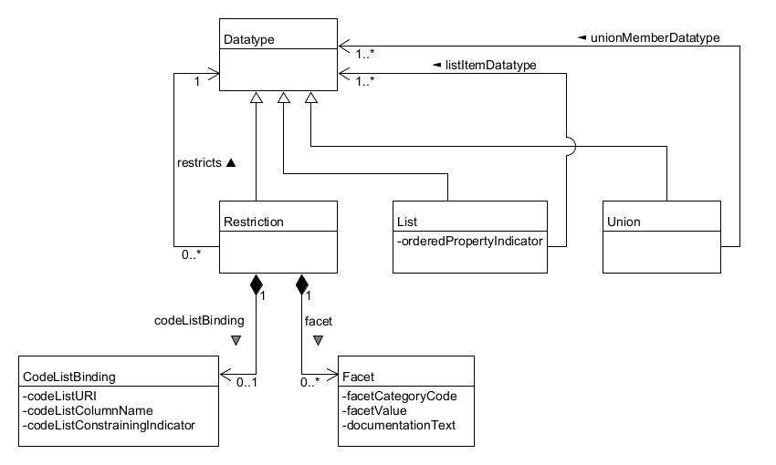

<h2 id="niem-logo">

<!--
If you want to check the line length in code blocks, uncomment this code block,
set the width of your markdown preview window so that the following line does not wrap,
and the final "X" is visible without the horizontal scrollbar:

```
.........1.........2.........3.........4.........5.........6.........7.........8.........9.........0.........1.........2.........3......X
This is the width of a code block in the PDF version
```
-->

# NIEM Naming and Design Rules (NDR) Version 6.0
## Project Specification 01
## 15 July 2025 draft

&nbsp;

#### This stage:
https://docs.oasis-open.org/niemopen/ndr/v6.0/ps01/ndr-v6.0-ps01.html \
https://docs.oasis-open.org/niemopen/ndr/v6.0/ps01/ndr-v6.0-ps01.pdf (Authoritative)

#### Previous stage:
https://docs.oasis-open.org/niemopen/ndr/v6.0/psd01/ndr-v6.0-psd01.html \
https://docs.oasis-open.org/niemopen/ndr/v6.0/psd01/ndr-v6.0-psd01.pdf (Authoritative)

#### Latest stage:

https://docs.oasis-open.org/niemopen/ndr/v6.0/ndr-v6.0.html \
https://docs.oasis-open.org/niemopen/ndr/v6.0/ndr-v6.0.pdf (Authoritative)

#### Open Project:
[OASIS NIEMOpen OP](http://www.niemopen.org/)

#### Project Chair:
Katherine Escobar (katherine.b.escobar.civ@mail.mil), [Joint Staff J6](https://www.jcs.mil/Directorates/J6-C4-Cyber/)

#### NTAC Technical Steering Committee Chairs:
Brad Bolliger (brad.bolliger@ey.com), [EY](ey.com) \
James Cabral (jim@cabral.org), Individual \
Scott Renner (sar@mitre.org), [MITRE](https://mitre.org/)

#### Editors:
James Cabral (jim@cabral.org), Individual \
Tom Carlson (Thomas.Carlson@gtri.gatech.edu), [Georgia Tech Research Institute](https://gtri.gatech.edu/) \
Scott Renner (sar@mitre.org), [MITRE](https://mitre.org/)

#### Related work:
This specification replaces or supersedes:
* _National Information Exchange Model Naming and Design Rules_. Version 5.0 December 18, 2020. NIEM Technical Architecture Committee (NTAC). https://reference.niem.gov/niem/specification/naming-and-design-rules/5.0/niem-ndr-5.0.html.

This specification is related to:
* _NIEM Model Version 6.0_. Edited by Christina Medlin. Latest stage: https://docs.oasis-open.org/niemopen/niem-model/v6.0/niem-model-v6.0.html.
* Conformance Targets Attribute Specification (CTAS) Version 3.0. Edited by Tom Carlson. 22 February 2023. OASIS Project Specification 01. https://docs.oasis-open.org/niemopen/ctas/v3.0/ps01/ctas-v3.0-ps01.html. Latest stage: https://docs.oasis-open.org/niemopen/ctas/v3.0/ctas-v3.0.html.

#### Abstract:
NIEM is a framework for scalable and reusable data exchange across public and private sectors. It provides the tools and standards necessary for organizations to define structured data contracts, enabling machine-to-machine communication across diverse use cases like web services and APIs. 

This document provides the normative specifications for creating data models, namespaces, schemas, and messages that conform to the NIEM framework. It defines enforceable rules for naming conventions, documentation, structural integrity, and conformance targets. The document outlines how developers can use NIEM to define structured data contracts, specifying syntax, semantics, and relationships for machine-to-machine communication.

#### Status:
This document was last revised or approved by the Project Governing Board of the OASIS NIEMOpen OP on the above date. The level of approval is also listed above. Check the "Latest stage" location noted above for possible later revisions of this document. Any other numbered Versions and other technical work produced by the Open Project (OP) are listed at http://www.niemopen.org/.

Comments on this work can be provided by opening issues in the project repository or by sending email to the project’s public comment list: niemopen@lists.oasis-open-projects.org. List information is available at https://lists.oasis-open-projects.org/g/niemopen.

Note that any machine-readable content ([Computer Language Definitions](https://www.oasis-open.org/policies-guidelines/tc-process-2017-05-26/#wpComponentsCompLang)) declared Normative for this Work Product is provided in separate plain text files. In the event of a discrepancy between any such plain text file and display content in the Work Product's prose narrative document(s), the content in the separate plain text file prevails.

#### Key words:
The key words "MUST", "MUST NOT", "REQUIRED", "SHALL", "SHALL NOT", "SHOULD", "SHOULD NOT", "RECOMMENDED", "NOT RECOMMENDED", "MAY", and "OPTIONAL" in this document are to be interpreted as described in BCP 14 [[RFC 2119](#rfc2119)] and [[RFC 8174](#rfc8174)] when, and only when, they appear in all capitals, as shown here.

#### Citation format:
When referencing this specification the following citation format should be used:

**[NIEM-NDR-v6.0]**

_NIEM Naming and Design Rules (NDR) Version 6.0_. Edited by Scott Renner. 11 July 2025.  OASIS Project Specification 01. https://docs.oasis-open.org/niemopen/ndr/v6.0/psd01/ndr-v6.0-ps01.html. Latest stage: https://docs.oasis-open.org/niemopen/ndr/v6.0/ndr-v6.0.html.

-------

## Notices
Copyright &copy; OASIS Open 2025. All Rights Reserved.

Distributed under the terms of the OASIS [IPR Policy](https://www.oasis-open.org/policies-guidelines/ipr/).

For complete copyright information please see the Notices section in the Appendix.

-------

# Table of Contents
<tocHere/>

-------

# 1. Introduction

NIEM, formerly known as the "National Information Exchange Model," is a framework for exchanging information among public and private sector organizations. The framework includes a [reference data model](https://docs.oasis-open.org/niemopen/niem-model/v6.0/niem-model-v6.0.html) for objects, properties, and relationships; and a set of technical specifications for using and extending the data model in information exchanges. The NIEM framework supports developer-level specifications of data that form a contract between developers. The data being specified is called a *message* in NIEM. While a message is usually something passed between applications, NIEM works equally well to specify an information resource published on the web, or an input or output for a web service or remote procedure -- basically, any package of data that crosses a system or organization boundary.

NIEM promotes scalability and reusability of messages between information systems, allowing organizations to share data and information more efficiently. It was launched in 2005 in response to the U.S. Homeland Security Presidential Directives to improve information sharing between agencies following 9/11. Until 2023, NIEM was updated and maintained in a collaboration between the U.S. federal government, state and local government agencies, private sector, and non-profit and international organizations, with new versions released around once per year. NIEM defines a set of technical specifications, plus a set of common objects -- the *NIEM Core*, and 17 sets of objects that are specific to certain government or industry verticals, the *NIEM Domains*.

In 2023, NIEM became the NIEMOpen OASIS Open Project. NIEMOpen welcomes participation by anyone irrespective of affiliation with OASIS. Substantive contributions to NIEMOpen and feedback are invited from all parties, following the OASIS rules and the usual conventions for participation in GitHub public repository projects.

NIEMOpen is the term generally used when referring to the organization such as Project Governing Board (PGB), NIEMOpen Technical Architecture Committee (NTAC), NIEMOpen Business Architecture Committee (NBAC), organization activities or processes. NIEM is the term used when directly referring to the model i.e. NIEM Domain, NIEM Model version.

This document specifies principles and enforceable rules for NIEM data components and schemas. Schemas and components that obey the rules set forth here are conformant to specific conformance targets. Conformance targets may include more than the level of conformance defined by this NDR, and may include specific patterns of use, additional quality criteria, and requirements to reuse NIEM release schemas.

## 1.1 Glossary

### 1.1.1 Definitions of terms

| Term                 |  Definition  |
| :----                |  :---  |
| Absolute URI         | A Uniform Resource Identifier (URI) with scheme, hierarchical part, and optional query, but without a fragment; a URI matching the grammar syntax `<absoluteURI>` as defined by [[RFC 3986]](#ref). |
| Adapter class        | A class that contains only properties from a single [external namespace](#def). *(see [§4.4](#44-class))*  |
| Adapter type         | An XSD type definition that encapsulates [external components](#def) for use within NIEM. *(see [§9.4](#94-rules-for-adapters-and-external-components))* |
| Appinfo namespace    | A namespace defined by a schema document that provides additional semantics for components in the XSD representation of a model. *(see [§9.7](#97-rules-for-machine-readable-annotations))* |
| Association class    | A class that represents a specific relationship between objects. *(see [§4.4](#44-class))* |
| Attribute property   | A data property represented in XSD as an attribute declaration. *(see [§4.9](#49-dataproperty))* |
| Augmentation         | The means by which a designer of one namespace adds properties to a class defined in a different namespace. *(see [§3.7](#37-model-extensions), [§4.16](#416-augmentation-class)*) |
| Augmentation element | An element in an XML message that is a container for one or more [augmentation properties](#def). *(see [§4.16.2.2](#41622-augmenting-one-object-class-or-association-class-with-an-element-property))* |
| Augmentation point element | An abstract element declaration that provides a place for [augmentation properties](#def) within the XSD representation of an augmented class. *(see [§4.16.2.2](#41622-augmenting-one-object-class-or-association-class-with-an-element-property))* |
| Augmentation property | A property added by one namespace to an augmented class in another namespace. *(see [§4.16.2.2](#41622-augmenting-one-object-class-or-association-class-with-an-element-property))* |
| Augmentation type    | An XSD type definition for an [augmentation element](#def). *(see [§4.16.2.2](#41622-augmenting-one-object-class-or-association-class-with-an-element-property))* |
| Augmented class      | A class to which a property is added through augmentation. *(see [§4.16.2.2](#41622-augmenting-one-object-class-or-association-class-with-an-element-property))*|
| Cardinality          | The number of times a property may/must appear in an object. |
| Class                | A definition of an entity in a model; that is, a real-world object, concept, or thing. *(see [§3.4](#34-the-niem-metamodel), [§4.4](#44-class))* |
| Code list datatype   | A datatype in which each valid value is also a string in a [code list](#def). *(see [§4.13](#413-restriction))* |
| Code list            | A set of string values, each having a known meaning beyond its value, each representing a distinct conceptual entity. *(see [§4.13](#413-restriction))* |
| Conforming namespace | A namespace that satisfies all of the applicable rules in this document; a [reference namespace](#def), [extension namespace](#def), or [subset namespace](#def). *(see [§6.1](#61-conformance-targets))* |
| Conforming schema document | A [schema document](#def) that satisfies all of the applicable rules in this document. *(see [§6.1](#61-conformance-targets))* |
| Conforming schema document set | A [schema document set](#def) that satisfies all of the applicable rules in this document. *(see [§6.1](#61-conformance-targets))* |
| Data definition      | A text definition of a component, describing what the component means. |
| Data property        | Defines a relationship between an object and a literal value. |
| Datatype             | Defines the allowed values of a corresponding literal value in a message. |
| Documented component | A CMF object or XSD schema component that has an associated data definition. |
| Element property     | An object property, or a data property that is not an [attribute property](#def); represented in XSD by an element declaration. *(see [§4.9](#49-dataproperty))* |
| Extension namespace  | A [namespace](#def) defining components that are intended for reuse, but within a more narrow scope than those defined in a [reference namespace](#def). *(see [§3.6](#36-namespaces))* |
| Extension schema document | A [schema document](#def) that is the XSD representation of an [extension namespace](#def). |
| External attribute   | An attribute declaration in [external schema document](#def). |
| External component   | A component defined by an [external schema document](#def). *(see [§9.4](#94-rules-for-adapters-and-external-components))* |
| External namespace   | Any namespace defined by a [schema document](#def) that is not a [conforming namespace](#def), the [structures namespace](#def), or the XML namespace `http://www.w3.org/XML/1998/namespace`. *(see [§3.6](#36-namespaces))* |
| External schema document | A schema document that defines an [external namespace](#def). *(see [§3.6](#36-namespaces))* |
| Literal class        | A class that contains no object properties, one or more [attribute properties](#def), and exactly one [element property](#def). *(see [§4.4](#44-class))* |
| Literal property     | The [element property](#def) in a [literal class](#def). |
| Local term           | A word, phrase, acronym, or other string of characters that is used in the name of a namespace component, but that is not defined in OED, or that has a non-OED definition in this namespace, or has a word sense that is in some way unclear. *(see [§4.17](#417-localterm))* |
| Message              | A package of data shared at runtime; a sequence of bits that convey information to be exchanged or shared; an instance of a [message type](#def). *(see [§3.1.1](#311-messages))* |
| Message designer     | A person who creates a [message type](#def) and [message format](#def) from an information requirement, so that an instance [message](#def) at runtime will contain all the facts that need to be conveyed. |
| Message developer    | A person who writes software to implement a [message specification](#def), producing or processing [messages](#def) that conform to the message format. |
| Message format       | A specification of the valid syntax of [messages](#def) that conform to a [message type](#def). *(see [§3.1.2](#312-message-format))* |
| Message model        | A data model intended to precisely define the mandatory and optional content of [messages](#def) and the meaning of that content. *(see [§3.1.3](#313-message-type))* |
| Message object       | The initial object in a message. |
| Message property     | The initial property of a message type. *(See [§3.1.3](#313-message-type)) |
| Message specification | A collection of related [message formats](#def) and [message types](#def). *(see [§3.1.4](#314-message-specification))* |
| Message type         | A specification of the information content of [messages](#def). *(see [§3.1.3](#313-message-type))* |
| Model file           | The CMF representation of a NIEM model; a [message](#def) that conforms to the CMF [message type](#def). *(see [§3.5](#35-niem-model-representations-xsd-and-cmf), [§6.1](#61-conformance-targets))* |
| Namespace            | A collection of uniquely-named components, managed by an authoritative source. *(see [§3.6](#36-namespaces))* |
| NCName               | A non-colonized name, matching the grammar syntax `<NCName>` as defined by [[XML Namespaces]](#ref). |
| Object class         | Represents a class of objects defined by a NIEM model. *(see [§4.4](#44-class))* |
| Object property      | Defines a relationship between a parent object and a child object. |
| Proxy type           | An XSD complex type definition with simple content that extends one of the simple types in the XML Schema namespace with `structures:SimpleObjectAttributeGroup`. *(see [§9.5](#95-rules-for-proxy-types))* |
| Relationship property | A property that provides information about the relationship between its parent and grandparent objects. *(see [§4.6](#46-property), [§5.5](#55-relationship-properties))* |
| Reference attribute property  | An [attribute property](#def) that contains a reference to an object in a message. *(see [§4.9](#49-dataproperty))* |
| Reference namespace  | A namespace containing components that are intended for the widest possible reuse. *(see [§3.6](#36-namespaces))* |
| Reference schema document | The XSD representation of a [reference namespace](#def). *(see [§9.8](#98-rules-for-reference-schema-documents))* |
| Reuse model | A data model entirely comprised of [reference namespaces](#def) and [extension namespaces](#def); a model intended to make the agreed definitions of a community available for reuse. |
| Schema               | An artifact that can be used to assess the validity of a message; in XML Schema for XML messages, JSON Schema for JSON messages. *(see [§3.1.2](#312-message-format))* |
| Schema document set  | A collection of [schema documents](#def) that together are capable of validating an XML document. *(see [§10.2](#102-rules-for-schema-document-sets))* |
| Serialization        | *(Verb)* A process of converting a data structure into a sequence of bits that can be stored or transferred.<br>*(Noun)* A standard for the output of serialization; for example, XML and JSON. |
| Structures namespace | A namespace that provides base types and attributes for the XSD representation of NIEM models. *(see [§3.6](#36-namespaces))* |
| Subset namespace     | A subset of the components in a reference or extension namespace. *(see [§3.6](#36-namespaces))* |
| Subset rule          | Any data that is valid for a [subset namespace](#def) must also be valid for its [reference namespace](#def) or [extension namespace](#def), and must have the same meaning. *(see [§8.4](#84-rules-for-subset-namespaces))* |
| Subset schema document | A [schema document](#def) for a [subset namespace](#def). *(see [§9.10](#910-rules-for-subset-schema-documents))* |

**Terms imported from *Extensible Markup Language (XML) 1.0 (Fourth Edition)* [[XML]](#ref):**

| Term                 |  Definition  |
| :----                |  :---        |
| Document element     | An element, no part of which appears in the content of another element; preferred synonym for *root element*. |
| XML document         | A data object is an XML document if it is well-formed, as defined in this specification. ([Section 2, Documents](https://www.w3.org/TR/2008/REC-xml-20081126/#dt-xml-doc))* |

**Terms imported from *XML Information Set (Second Edition)* [[XML Infoset]](#ref):**

| Term                 |  Definition  |
| :----                |  :---        |
| Attribute            | An *attribute information item*, as defined by [Section 2.3: *Attribute Information Items*](http://www.w3.org/TR/2004/REC-xml-infoset-20040204/#infoitem.element). |
| Element              | An *element information item*, as defined by [Section 2.2, *Element Information Items*](http://www.w3.org/TR/2004/REC-xml-infoset-20040204/#infoitem.element). |

**Terms imported from [[XML Schema Structures]](#ref):**

| Term                 |  Definition  |
| :----                |  :---        |
| Attribute declaration  | As defined by [*Section 2.2.2.3, Attribute Declaration*](http://www.w3.org/TR/2004/REC-xmlschema-1-20041028/#Attribute_Declaration). |
| Base type definition | A type definition used as the basis for an extension or restriction. *(see [Section 2.2.1.1, Type Definition Hierarchy](http://www.w3.org/TR/2004/REC-xmlschema-1-20041028/#key-baseTypeDefinition)*) |
| Complex type definition | As defined by [*Section 2.2.1.3, Complex Type Definition*](http://www.w3.org/TR/2004/REC-xmlschema-1-20041028/#Complex_Type_Definition)*. |
| Element declaration  | As defined by [*Section 2.2.2.1, Element Declaration*](http://www.w3.org/TR/2004/REC-xmlschema-1-20041028/#Element_Declaration). |
| Schema component     | The generic term for the building blocks that comprise the abstract data model of the schema. *(see [Section 2.2, XML Schema Abstract Data Model](http://www.w3.org/TR/2004/REC-xmlschema-1-20041028/#key-component))* |
| Schema document      | As defined by [*Section 3.1.2, XML Representations of Components*](http://www.w3.org/TR/2004/REC-xmlschema-1-20041028/#key-schemaDoc), which states, "A document in this form (i.e. a <schema> element information item) is a schema document." |
| Simple type definition | As defined by [*Section 2.2.1.2, Simple Type Definition*](http://www.w3.org/TR/2004/REC-xmlschema-1-20041028/#Simple_Type_Definition). |
| Valid                | As defined by [*Section 2.1, Overview of XML Schema*](http://www.w3.org/TR/2004/REC-xmlschema-1-20041028/#key-vn), which states, "The word valid and its derivatives are used to refer to clause 1 above, the determination of local schema-validity." |
| XML Schema           | A set of schema components. *(see [Section 2.2, XML Schema Abstract Data Model](http://www.w3.org/TR/2004/REC-xmlschema-1-20041028/#key-component))* |
| XML Schema definition language (XSD) | As defined by [*Abstract*](http://www.w3.org/TR/2004/REC-xmlschema-1-20041028/#abstract), which states, "XML Schema: Structures specifies the XML Schema definition language, which offers facilities for describing the structure and constraining the contents of XML 1.0 documents, including those which exploit the XML Namespace facility." |

**Terms imported from NIEM Conformance Targets Attribute Specification [[CTAS-v3.0]](#ref):**

| Term                 |  Definition  |
| :----                |  :---        |
| Conformance target   | A class of artifact, such as an interface, protocol, document, platform, process or service, that is the subject of conformance clauses and normative statements. *(see [§6.1](#61-conformance-targets))* |
| Conformance target identifier | An internationalized resource identifier (IRI) that uniquely identifies a [conformance target](#def). |
| Effective conformance targets attribute | The first occurrence of the attribute `{https://docs.oasis-open.org/niemopen/ns/specification/conformanceTargets/6.0/}conformanceTargets`, in document order. |
| Effective conformance target identifier | An internationalized resource identifier reference that occurs in the document's [effective conformance targets attribute](#def). |

### 1.1.2 Acronyms and abbreviations

| Term | Literal |
| :---- | :--- |
|APPINFO|Application Information|
|CCC|Complex type with Complex Content|
|CMF|Common Model Format|
|CSC|Complex type with Simple Content|
|CSV|Comma Separated Values|
|CTAS|Conformance Targets Attribute Specification|
|ID|Identifier|
|IEP|Information Exchange Package|
|IEPD|Information Exchange Package Documentation|
|ISO|International Organization for Standardization|
|JSON|JavaScript Object Notation|
|JSON-LD|JavaScript Object Notation Linked Data|
|NBAC|NIEMOpen Business Architecture Committee|
|NS|Namespace|
|NTAC|NIEMOpen Technical Architecture Committee|
|OED|Oxford English Dictionary|
|OP|Open Project|
|OWL|Web Ontology Language|
|PGB|Project Governing Board|
|QName|Qualified Name|
|RDF|Resource Description Framework|
|RDFS|Resource Description Framework Schema|
|RFC|Request For Comments|
|UML|Unified Modeling Language|
|URI|Uniform Resource Identifier|
|URL|Uniform Resource Locator|
|URN|Uniform Resource Name|
|XML|Extensible Markup Language|
|XSD|XML Schema Definition|

-------

# 2. How To Read This Document

This document provides normative specifications for NIEM-conforming data models. It also describes the goals and principles behind those specifications. It includes examples and explanations to help users of NIEM understand the goals, principles, and specifications. 

This document is not intended as a user guide. Training materials for message designers and developers will be available at www.niemopen.org.

The relevant sections of this document will depend on the role of the user. [Figure 2-1](#fig2-1) illustrates the relationships between these roles and NIEM activities.

<figure>
  
  <figcaption><a name="fig2-1">Figure 2-1: User roles and activities</a></figcaption>
</figure>

The user roles in the above figure are:

* *Business analysts* and *subject matter experts*, who provide the requirements for information transfer. These requirements might describe an information resource available to all comers. They could describe an information exchange as part of a business process. They need not be tied to known producers and consumers.

* *Message designers*, who express those requirements as a [message type](#def), which specifies the syntax and semantics of the data that will convey the required information at runtime.

* *Message developers*, who write software to construct messages that contain the required information and follows the defined syntax, and who write software to parse and process such messages.

The remaining sections of this document most relevant to each of these roles are shown in the following table:

|Section | Manager | Business Analyst | Message Designer | Message Developer |
| :---- | :---: | :----: | :---: | :---: |
| 3. Overview of NIEM technical architecture | x | x | x | x |
| 4. Data models in NIEM | | | x | |
| 5. Data modeling patterns | | | x | |
| 6. Conformance | | x | x | x |
| 7. Rules for model components | | x | x | |
| 8. Rules for namespaces | | x | x |  |
| 9. Rules for schema documents | | | x | |
| 10. Rules for models | |  | x |  |
| 11. Rules for message types and message formats | |  | x | x |
| 12. Rules for XML messages | | | x | x |
| 13. Rules for JSON messages | |  | x | x |
| 14. RDF interpretation of NIEM models and messages | | | x |
<figcaption><a name="tab2-2">Table 2-2: Relevant document sections by user role</a></figcaption>

## 2.1 Document references

This document relies on references to many outside documents. Such references are noted by bold, bracketed inline terms. For example, a reference to RFC 3986 is shown as [RFC 3986](#ref). All reference documents are recorded in [Appendix A, References, below](#appendix-a-references).

## 2.2 Clark notation and qualified names

This document uses both Clark notation and QName notation to represent qualified names.

QName notation is defined by [XML Namespaces](#ref) Section 4, Qualified Names. A QName for the XML Schema string datatype is xs:string. Namespace prefixes used within this specification are listed in Section 2.3, Use of namespaces and namespace prefixes, below.

This document sometimes uses Clark notation to represent qualified names in normative text. Clark notation is described by [ClarkNS](#ref), and provides the information in a QName without the need to first define a namespace prefix, and then to reference that namespace prefix. A Clark notation representation for the qualified name for the XML Schema string datatype is `{http://www.w3.org/2001/XMLSchema}string`.

Each Clark notation value usually consists of a namespace URI surrounded by curly braces, concatenated with a local name. The exception to this is when Clark notation is used to represent the qualified name for an attribute with no namespace, which is ambiguous when represented using QName notation. For example, the element targetNamespace, which has no [namespace name] property, is represented in Clark notation as `{}targetNamespace`.

## 2.3 Use of namespaces and namespace prefixes

The following namespace prefixes are used consistently within this specification. These prefixes are not normative; this document issues no requirement that these prefixes be used in any conformant artifact. Although there is no requirement for a schema or XML document to use a particular namespace prefix, the meaning of the following namespace prefixes have fixed meaning in this document.

* `xs` and `xsd`: The namespace for the XML Schema definition language as defined by XML Schema Structures and XML Schema Datatypes, <uri>http://www.w3.org/2001/XMLSchema</uri>.
* `xsi`: The XML Schema instance namespace, defined by XML Schema Structures, Section 2.6, Schema-Related Markup in Documents Being Validated, for use in XML documents, <uri>http://www.w3.org/2001/XMLSchema-instance</uri>.
* `ct`: The namespace defined by Conformance Targets Attribute Specification, <uri>https://docs.oasis-open.org/niemopen/ns/specification/conformanceTargets/6.0/</uri>.
* `appinfo`: The appinfo namespace, <uri>https://docs.oasis-open.org/niemopen/ns/model/appinfo/6.0/</uri>.
* `structures`: The structures namespace, <uri>https://docs.oasis-open.org/niemopen/ns/model/structures/6.0/</uri>.
* `cmf`: The namespace for the CMF model representation, <uri>https://docs.oasis-open.org/niemopen/ns/specification/cmf/1.0/</uri>.
* `nc`: The namespace of the NIEM Core model, <uri>https://docs.oasis-open.org/niemopen/ns/model/niem-core/6.0/</uri>.
* `rdf`: The namespace for the Resource Description Framework, <uri>http://www.w3.org/1999/02/22-rdf-syntax-ns#</uri>.
* `rdfs`: The namespace for RDF Schema, <uri>http://www.w3.org/2000/01/rdf-schema#</uri>.
* `owl`: The namespace for OWL 2 Web Ontology Language, <uri>http://www.w3.org/2002/07/owl#</uri>.

XML Schema examples in this document presume namespace declarations for all of the above; for example, `xmlns:xs="http://www.w3.org/2001/XMLSchema"`.

RDF examples in Turtle syntax presume prefix declarations for the above; for example, `@prefix xs: <http://www.w3.org/2001/XMLSchema> .`

JSON-LD examples presume `@context` entries; for example, `"@context": { "xs":, "http://www.w3.org/2001/XMLSchema" }`

-------

# 3. Overview of the NIEM Technical Architecture

This overview describes NIEM's design goals and principles, and introduces key features of the architecture. The major design goals are:

* *Shared understanding of data.* NIEM helps developers working on different systems to understand the data their systems share with each other.  NIEM also helps data analysts understand and integrate data from multiple sources.

* *Reuse of community-agreed data definitions.* NIEM reduces the cost of data interoperability by promoting shared data definitions — without requiring a single data model of everything for everyone.

* *Open standards with free-and-open-source developer tools.* NIEM does not depend on proprietary standards or the use of expensive developer tools.

The key architecture features mentioned in this section:

* *The NIEM metamodel* — an abstract, technology-neutral data model for NIEM data models

* *Two equivalent model representations* — One is a profile of XML Schema (XSD) that has been used in every version of NIEM. The other is itself a NIEM-based data specification, suitable for XML and many other data technologies.

* *Model namespaces* — for model configuration management by multiple authors working independently.

## 3.1 Machine-to-machine data specifications

NIEM is a framework for developer-level specifications of data. A NIEM-based data specification — which is built *using* NIEM and in *conformance* to NIEM, but is not itself a *part* of NIEM — describes data in detail sufficient to the developers of producing and consuming systems. This data may be shared via:

* a message passed between applications
* an information resource published on the web
* an API for a system or service

NIEM is potentially useful for any data sharing mechanism that transfers data across a system or organization boundary. (Within a system, NIEM may also be useful when data passes between system components belonging to different developer teams.)

The primary purpose of a NIEM-based data specification is to establish a common understanding among developers, so that they can write software that correctly handles the shared data, hence "machine-to-machine". (NIEM-conforming data may also be directly presented to human consumers, and NIEM can help these consumers understand what they see.)

Data sharing in NIEM is implemented in terms of messages, message formats, and message types. These are illustrated in [figure 3-1](#fig3-1).

* [message](#def) — a package of data shared at runtime; an instance of a [message format](#def) and of a [message type](#def)
* [message format](#def) — a definition of a syntax for the messages of a [message type](#def)
* [message type](#def) — a definition of the information content in equivalent [message formats](#def)

<figure>
  
  <figcaption><a name="fig3-1">Figure 3-1: Message types, message formats, and messages</a></figcaption>
</figure>

A message designer turns information requirements into a [message type](#def), then turns a [message type](#def) into one or more [message formats](#def). Message developers then use the [message type](#def) and [message format](#def) to understand how to implement software that produces or consumes conforming messages.

### 3.1.1 Messages

In NIEM terms, the package of data shared at runtime is a [message](#def). This data is arranged according to a supported serialization; for example, XML or JSON. The result is a sequence of bits that represents the information content of the message. [Example 3-2](#ex3-2) shows two messages representing the same information, one serialized in XML, the other in JSON. Each message in this example is a request for a quantity of some item. (In all examples, closing tags and brackets may be omitted, long lines may be truncated, and some portions omitted and/or replaced with ellipses (...).)

```
<msg:Request                                                  | {
 xmlns:nc="https://docs.oasis-open.org/niemopen/ns/model/niem |   "@context": {
 xmlns:msg="http://example.com/ReqRes/1.0/">                  |     "nc": "https://docs.oasis-open.org/niemopen/ns/model/niem-
  <msg:RequestID>RQ001</msg:RequestID>                        |     "msg": "http://example.com/ReqRes/1.0/"
  <msg:RequestedItem>                                         |   },
    <nc:ItemName>Wrench</nc:ItemName>                         |   "msg:Request": {
    <nc:ItemQuantity>10</nc:ItemQuantity>                     |     "msg:RequestID" : "RQ001",
  </msg:RequestedItem>                                        |     "msg:RequestedItem": {
</msg:Request>                                                |       "nc:ItemName": "Wrench",
                                                              |       "nc:ItemQuantity": 10
                                                              |      }
                                                              |   }
                                                              | }
```
<figcaption><a name="ex3-2">Example 3-2: Messages in XML and JSON syntax</a></figcaption>

The data structure of a NIEM message appears to be a tree with a root node. It is actually a directed graph with an initial node called the [message object](#def).  For example, the [message object](#def) in [example 3-2](#ex3-2) is the `msg:Request` element in the XML message. In the JSON message it is the value for the `msg:Request` key.

Every NIEM serialization has a mechanism for references; that is, a way for one object in the serialized graph to point to an object elsewhere in the graph. This mechanism supports cycles and avoids duplication in the graph data structure. *(See [§14.2.3](#1423-objects-and-object-identifiers))* 

Every [message](#def) is an instance of a [message format](#def). A conforming message must satisfy the rules in [section 12](#12-rules-for-xml-messages) and [section 13](#13-rules-for-json-messages).  In particular, it must be valid according to the [schema](#def) of its [message format](#def).

> A NIEM message was originally known as an *information exchange package (IEP)*, a term that found its way into the U.S. Federal Enterprise Architecture (2005).  A message specification was originally known as an *information exchange package documentation (IEPD).*  These terms are in widespread use within the NIEM community today, and will not go away soon (if ever).

### 3.1.2 Message format

A [message format](#def) specifies the syntax of valid messages. This provides message developers with an exact description of the messages to be generated or processed by their software.

A [message format](#def) includes a [schema](#def) that can be used to assess the validity of a [message](#def). This [schema](#def) is expressed in XML Schema (XSD) for XML message formats, and JSON Schema for JSON message formats. [Example 3-3](#ex3-3) shows a portion of the schemas for the two example messages in [example 3-2](#ex3-2).

```
<xs:complexType name="RequestType">                    | {
  <xs:sequence>                                        |   "msg:RequestType": {
    <xs:element ref="msg:RequestID"/>                  |     "type": "object",
    <xs:element ref="msg:RequestedItem"/>              |     "properties": {
  </xs:sequence>                                       |       "msg:RequestID": {"$ref": "#/properties/msg:RequestID"},
</xs:complexType>                                      |       "msg:RequestedItem": {"$ref": "#/properties/msg:RequestedItem"}
<xs:element name="Request" type="msg:RequestType"/>    |     },
                                                       |     "required": [
                                                       |       "msg:RequestID",
                                                       |       "msg:RequestedItem"
                                                       |     ]
                                                       |   },
                                                       |   "msg:Request": {
                                                       |     "$ref": "#/definitions/msg:RequestType"
                                                       |   }
                                                       | }
```
<figcaption><a name="ex3-3">Example 3-3: Example message format schemas</a></figcaption>

Producing and consuming systems may use the message format schema to validate the syntax of messages at runtime, but are not obligated to do so. Message developers may use the schema during development for software testing. The schemas may also be used by developers for data binding; for example, Java Architecture for XML Binding (JAXB).

A [message format](#def) belongs to exactly one [message type](#def). A conforming [message format](#def) must satisfy the rules in [section 11](#11-rules-for-message-types-and-message-formats); in particular, it must be constructed so that every [message](#def) that is valid according to the format also satisfies the information content constraints of its [message type](#def).

### 3.1.3 Message type

One important feature of NIEM is that every [message](#def) has an equivalent [message](#def) in every other supported serialization. These equivalent messages have a different [message format](#def), but have the same [message type](#def). For example, the XML message and the JSON message in [example 3-2](#ex3-2) above are equivalent. They represent the same information content, and can be converted one to the other without loss of information.

A [message type](#def) specifies the information content of its messages without prescribing their syntax. A [message type](#def) includes a [message model](#def), which is the means through which the message designer precisely defines the mandatory and optional content of conforming messages and the meaning of that content. This model is expressed in either of NIEM's two model representations, which are described in [section 3.4](#34-the-niem-metamodel) and [section 3.5](#35-niem-model-representations-xsd-and-cmf), and fully defined in [section 4](#4-data-models-in-niem). [Example 3-4](#ex3-4) shows a portion of the message model for the two message formats in [example 3-3](#ex3-3).

```
<xs:complexType name="ItemType" appinfo:referenceCode="NONE"> | <Class structures:id="nc.ItemType">
  <xs:annotation>                                             |   <Name>ItemType</Name>
    <xs:documentation>A data type for an article or thing.    |   <Namespace structures:ref="nc" xsi:nil="true"/>
  </xs:annotation>                                            |   <DocumentationText>A data type for an article or th
  <xs:complexContent>                                         |   <ReferenceCode>NONE</ReferenceCode>
    <xs:extension base="structures:ObjectType">               |   <ChildPropertyAssociation>
      <xs:sequence>                                           |     <DataProperty structures:ref="nc.ItemName" xsi:nil="true"/>
        <xs:element ref="nc:ItemName"/>                       |     <MinOccursQuantity>1</MinOccursQuantity>
        <xs:element ref="nc:ItemQuantity"/>                   |     <MaxOccursQuantity>1</MaxOccursQuantity>
      </xs:sequence>                                          |   </ChildPropertyAssociation>
    </xs:extension>                                           |   <ChildPropertyAssociation>
  </xs:complexContent>                                        |     <DataProperty structures:ref="nc.ItemQuantity"
</xs:complexType>                                             |     <MinOccursQuantity>1</MinOccursQuantity>
<xs:element name="ItemName" type="nc:TextType">               |     <MaxOccursQuantity>1</MaxOccursQuantity>
  <xs:annotation>                                             |   </ChildPropertyAssociation>
    <xs:documentation>A name of an item.</xs:documentation>   | </Class>
  </xs:annotation>                                            | <DataProperty structures:id="nc.ItemName">
</xs:element>                                                 |   <Name>ItemName</Name>
<xs:element name="RequestedItem" type="nc:ItemType">          |   <Namespace structures:ref="nc" xsi:nil="true"/>
  <xs:annotation>                                             |   <DocumentationText>A name of an item.
    <xs:documentation>A specification of an item request.</xs |   <Datatype structures:ref="nc.TextType" xsi:nil="true"/>
  </xs:annotation>                                            | </DataProperty>
</xs:element>                                                 | <ObjectProperty structures:id="msg.RequestedItem">
                                                              |   <Name>RequestedItem</Name>
                                                              |   <Namespace structures:ref="msg" xsi:nil="true"/>
                                                              |   <DocumentationText>A specification of an item
                                                              |   <Class structures:ref="nc.ItemType" xsi:nil="true"/>
                                                              |   <ReferenceCode>NONE</ReferenceCode>
                                                              | </ObjectProperty>
```
<figcaption><a name="ex3-4">Example 3-4: Example message model in XSD and CMF</a></figcaption>

In addition to the [message model](#def), a [message type](#def) also declares the initial property of conforming messages. In a conforming message, the [message object](#def) is always the value of the initial property; this is the [message property](#def).  For example, the [message type](#def) for the [message](#def) in [example 3-2](#ex3-2) declares that the initial property is `msg:Request`.

A [message type](#def) provides all of the information needed to generate the schema for each [message format](#def) it specifies. NIEMOpen provides free and open-source software tools to generate these schemas from the message model; see <uri>https://github.com/niemopen/ntac-admin/tree/main/tools</uri>. (Message designers may also compose these schemas by hand, if desired.)

A conforming [message type](#def) must satisfy all of the rules in [section 11](#11-rules-for-message-types-and-message-formats).

### 3.1.4 Message specification

A [message specification](#def) is a collection of related [message types](#def). For instance, a Request message type might be paired with a Response message type as part of a request/response protocol. Those two message types could be collected into a [message specification](#def) for the protocol, as illustrated below in [example 3-5](#ex3-5).

<figure>
  
  <figcaption><a name="ex3-5">Example 3-5: Message specifications, types, and formats</a></figcaption>
</figure>

**Summary:**

* A [message specification](#def) defines one or more [message types](#def); a [message type](#def) belongs to one [message specification](#def)
* A [message type](#def) defines one or more [message formats](#def); a [message format](#def) belongs to one [message type](#def)
* A [message format](#def) defines the syntax of valid [messages](#def)
* A [message type](#def) defines the semantics of valid messages, plus their mandatory and optional content
* A [message](#def) is an instance of a [message format](#def) and of that format's [message type](#def)

## 3.2 Reuse of community-agreed data models

NIEM is also a framework allowing communities to create [reuse models](#def) for concepts that are useful in multiple data specifications. These community models are typically not *complete* for any particular specification. Instead, they reflect the community's judgement on which definitions are *worth the trouble of agreement*. The NIEM core model contains definitions found useful by the NIEM community as a whole. NIEM domain models reuse the core, extending it with definitions found useful by the domain community. The core model plus the domain models comprise the "NIEM model". [Figure 3-6](#fig3-6) below illustrates the relationships between domain communities and community models.

<figure>
  
  <figcaption><a name="fig3-6">Figure 3-6: NIEM communities and data models</a></figcaption>
</figure>

Message designers reuse definitions from the NIEM model, selecting a (usually small) subset of definitions that express a part of their information requirement. Message designers then create model extensions, adding components that do not yet exist in the NIEM model. These local extensions could be useful to others in the community beyond the scope of the original message, and may be submitted for potential adoption into the NIEM model (see <uri>https://github.com/niemopen/niem-model/issues</uri>).

NIEM's policy of easy model extension supports easy reuse of community data models. Because a community model does not need to be complete for the union of all needs, each community may focus its effort on its common needs, where the effort of agreement has the highest value. Data definitions that are not common, that are needed only for a particular message appear only as extensions in that message type, and need be learned only by the message developers who implement it. Model extensions are further described in [section 3.7](#37-model-extensions).

Data model reuse is especially useful in a large enterprise. Its value grows with the number of developer teams, and with the degree of commonality in the shared data. NIEM was originally designed for data sharing among federal, state, and local governments — where commonality and number of developer teams is large indeed.

## 3.3 Reuse of open standards

NIEM is built on a foundation of open standards, primarily:

* XML and XSD — message serialization and validation; also a modeling formalism
* JSON and JSON-LD — message serialization and linked data
* JSON Schema — message validation
* RDF, RDFS, and OWL — formal semantics
* ISO 11179 — conventions for data element names and documentation

One of NIEM's principles is to reuse well-known information technology standards when these are supported by free and open-source software. NIEM avoids reuse of standards that effectively depend on proprietary software. When the NIEMOpen project defines a standard of its own, it also provides free and open-source software to support it.

## 3.4 The NIEM metamodel

A data model in NIEM is either a [message model](#def), defining the information content of a [message type](#def), or a [reuse model](#def), making the agreed definitions of a community available for reuse. The information required for those purposes can itself be modeled. The model of that information is the *NIEM metamodel* -- an abstract model for NIEM data models. The metamodel is expressed in UML, and is described in detail in [section 4](#4-data-models-in-niem). At a high level, the major components of the metamodel are properties, classes, datatypes, namespaces, and models. [Figure 3-7](#fig3-7) provides an illustration.

<figure>
  <a name="fig3-2"/></a>
  
  <figcaption><a name="fig3-7">Figure 3-7: High-level view of the NIEM metamodel</a></figcaption>
</figure>

- A *property* is a concept, idea, or thing.  It defines a field that may appear in a [message](#def) and can contain subfields (for objects / object properties) or a value (for literals / data properties). For example, in [example 3-4](#ex3-4), `req:RequestedItem` and `nc:ItemName` are names of properties. `req:RequestedItem` is an object property for the requested item; `nc:ItemName` is a data property for the name of the item. The meaning of these properties is captured in the documentation text.

- A *class* defines the properties that may appear in the content of a corresponding *object* in a [message](#def). A class has one or more *properties*. An *object property* in a class defines a subject-property-value relationship between two objects.  A *data property* defines a relationship between an object and a literal value. In [example 3-4](#ex3-4), `nc:ItemType` is the name of a class.

- A *datatype* defines the allowed values of a corresponding *literal value* in a [message](#def). In [example 3-4](#ex3-4), `nc:TextType` is the name of a datatype.

- Classes and datatypes are the two kinds of *type* in the metamodel. For historical reasons, the name of every class and datatype in the NIEM model ends in "Type". That is why this high-level view of the metamodel includes the abstract Type UML class.

- Classes, datatypes, and properties are the three kinds of metamodel *component*. (All of the common properties of classes and datatypes are defined in the Component class, which is why the abstract Type class is not needed in the detailed metamodel diagram in [section 4](#4-data-models-in-niem).)

- A *namespace* is a collection of uniquely-named components defined by an authority. (See [section 3.6](#36-namespaces))

- A *model* is a collection of components (organized into namespaces) and their relationships.

[Figure 3-8](#fig3-8) below illustrates the relationships among metamodel components, NIEM model components, and the corresponding [message](#def) objects and values.

<figure class="image">
  <a name="fig3-3"/></a>
  
  <figcaption><a name="fig3-8">Figure 3-8: Message, message model, and metamodel relationships</a></figcaption>
</figure>

A NIEM [message](#def) contains properties which are based on objects or literal values. These are specified by the class, property, and datatype objects in a NIEM [message model](#def), which defines the content of a conforming [message](#def) and also defines the meaning of that content. For example, in [figure 3-8](#fig3-8), the *item object* is defined by the `nc:ItemType` Class object; the *literal value* (`Wrench`) is defined by the `xs:string` Datatype object, and the property relationship between the two is defined by the `nc:ItemName` DataProperty object.

Note that the term *object* is used in the context of messages and models.  Within a NIEM [message](#def), an object is the value of a property, representing facts at runtime.  A message object has a class.  In [example 3-2](#ex3-2), the `msg:RequestedItem` XML element is an object, as is the value of the JSON key with the same name.  These objects are instances of the `nc:ItemType` class.

Within a NIEM model, an object is an instance of a metamodel Class, Datatype, or Property.  In [example 3-3](#ex3-3), `nc:ItemType` is a Class object represented by the complex type definition in XSD, or by the Class element in CMF.


## 3.5 NIEM model representations: XSD and CMF

The abstract metamodel has two concrete representations:  NIEM XSD and NIEM CMF. These are equivalent representations and may be converted from one to the other without loss. (NIEMOpen provides free and open-source software tools that perform the conversion; see <uri>https://github.com/niemopen/ntac-admin/tree/main/tools</uri>.)

Every version of NIEM has used a profile of XML Schema (XSD) as a NIEM model representation. In XSD, a NIEM model is represented as a schema assembled from a collection of schema documents. Every aspect of the metamodel is represented in some way by a schema component.

XSD as a model representation directly supports conformance testing of NIEM XML messages through schema validation. However, JSON developers (and developers working with other formats) cannot use XSD to validate their messages. Nor do they want to read XSD specifications of message content. For this reason, NIEM 6 introduces the Common Model Format (CMF), which is a NIEM model representation intended to support all developers.

CMF is the result of applying the NIEM framework to the information requirements in the metamodel. That result is a NIEM-based [message type](#def), which is part of a [message specification](#def), which is published in [CMF](#ref). In CMF, a model is represented as an instance of that [message type](#def); that is, a CMF [message](#def), also known as a [model file](#def).

CMF is a technology-neutral model representation, because:

* A CMF model can be transformed into XSD for validation of XML messages, and into JSON Schema for validation of JSON messages.

* A CMF model can itself be represented in XML or JSON, according to developer preference. That is, like any other NIEM message, the CMF representation of a model can be serialized in either XML or JSON. For example, [example 3-9](#ex3-9) shows a portion of the message model from [example 3-4](#ex3-4) in both XML and JSON syntax.

```
<Class structures:id="nc.ItemType">                              | {
  <Name>ItemType</Name>                                          |   "cmf:Class": {
  <Namespace structures:ref="nc" xsi:nil="true"/>                |     "cmf:Name": "ItemType",
  <DocumentationText>A data type for an article or thing.</Docum |     "cmf:Namespace": { "@id": "#nc" },
  <ReferenceCode>NONE</ReferenceCode>                            |     "cmf:DocumentationText": "A data type for an article
  <ChildPropertyAssociation>                                     |     "cmf:ReferenceCode": "NONE",
    <DataProperty structures:ref="nc.ItemName" xsi:nil="true"/>  |     "cmf:PropertyAssociation": {
    <MinOccursQuantity>1</MinOccursQuantity>                     |       "cmf:DataProperty": { "@id": "#nc.ItemName" },
    <MaxOccursQuantity>1</MaxOccursQuantity>                     |       "cmf:MinOccursQuantity": 1,
  </ChildPropertyAssociation>                                    |       "cmf:MaxOccursQuantity": 1
  <ChildPropertyAssociation>                                     |     },
    <DataProperty structures:ref="nc.ItemQuantity" xsi:nil="true |     "cmf:PropertyAssociation": {
    <MinOccursQuantity>1</MinOccursQuantity>                     |       "cmf:DataProperty": { "@id": "#nc.ItemQuantity" },
    <MaxOccursQuantity>1</MaxOccursQuantity>                     |       "cmf:MinOccursQuantity": 1,
  </ChildPropertyAssociation>                                    |       "cmf:MaxOccursQuantity": 1
</Class>                                                         |     }
                                                                 |   }
                                                                 | }
```
<figcaption><a name="ex3-9">Example 3-9: CMF model in XML and JSON syntax</a></figcaption>

[Section 4](#4-data-models-in-niem) defines the mappings between the metamodel, NIEM XSD, and CMF.

> While NIEM uses JSON Schema to validate JSON messages, there is no JSON Schema representation of the metamodel, because JSON Schema does not have all of the necessary features to represent NIEM models.

## 3.6 Namespaces

The components of a NIEM model are partitioned into *namespaces.* This prevents name clashes among communities or domains that have different business perspectives, even when they choose identical data names to represent different data concepts.

Each namespace has an author, a person or organization that is the authoritative source for the namespace definitions. A namespace is the collection of model components for concepts of interest to the namespace author. Namespace cohesion is important: a namespace should be designed so that its components are consistent, may be used together, and may be updated at the same time.

Each namespace must be uniquely identified by a URI. The namespace author must also be the URI's owner, as defined by [[webarch]](#ref). Both URNs and URLs are allowed. It is helpful, but not required, for the namespace URI to be accessible, returning the definition of the namespace content in a supported model format.

NIEM defines two categories of authoritative namespace: [reference namespace](#def) and [extension namespace](#def).

* *Reference namespace:* The NIEM model is a [reuse model](#def) comprised entirely of [reference namespaces](#def). The components in these namespaces are intended for the widest possible reuse. They provide names and definitions for concepts, and relations among them. These namespaces are characterized by "optionality and over-inclusiveness". That is, they define more concepts than needed for any particular data exchange specification, without cardinality constraints, so it is easy to select the concepts that are needed and omit the rest. They also omit unnecessary range or length constraints on property datatypes.

  A [reference namespace](#def) is intended to capture the meaning of its components. It is not intended for a complete definition of any particular [message type](#def). Message designers are expected to subset, profile, and extend the components in [reference namespaces](#def) as needed to match their information exchange requirements.

* *Extension namespace:* The components in an [extension namespace](#def) are intended for reuse within a more narrow scope than those defined in a [reference namespace](#def). These components express the additional vocabulary required for an information exchange, above and beyond the vocabulary available from the NIEM model.  The intended scope is often a particular [message specification](#def). Sometimes a community or organization will define an [extension namespace](#def) for components to be reused in several related message specifications. In this case, the namespace components may also omit cardinality and datatype constraints, and may be incomplete for any particular [message type](#def).

  Message designers are encouraged to subset, profile, and extend the components in [extension namespaces](#def) created by another author when these satisfy their modeling needs, rather than create new components.

Namespaces are the units of model configuration management. Once published, the components in a [reference namespace](#def) or [extension namespace](#def) may not be removed or changed in meaning. A change of that nature may only be made in a new namespace with a different URI.

As a result of this rule, once a specific version of a namespace is published, it can no longer be modified.  Updates must go into a new version of the namespace.  All published versions of a namespace continue to be valid in support of older exchanges.

In addition, note that a message specification contains its own copy of the schemas that they depend upon.  Therefore new versions of a model or a namespace do not affect existing exchanges.  Exchange partners may decide to upgrade to a new version of NIEM if they decide it suits their needs, but only if they choose to do so, and only on their own timeline.  The NIEM release schedule does not force adopters to keep in sync.

Message designers almost never require *all* the components in the NIEM model, and so NIEM defines a third namespace category:

* *Subset namespace:* Technically, this is a "namespace subset", which contains only some of the components of a [reference namespace](#def) or [extension namespace](#def). It provides components for reuse, while enabling message designers and developers to:

  * Omit optional components in a [reference namespace](#def) or [extension namespace](#def) that they do not need.

  * Provide cardinality and datatype constraints that precisely define the content of one or more message types.

  All message content that is valid for a subset namespace must also be valid for the [reference namespace](#def) or [extension namespace](#def) with the same URI.  Widening the value space of a component is not allowed. Adding components is not allowed. Changing the documentation of a component is not allowed.

NIEM has a fourth namespace category, for namespaces containing components from standards or specifications that are based on XML but not based on NIEM.

* *External namespace:* Any namespace defined by a [schema document](#def) that is not:

  * a [reference namespace](#def)
  * an [extension namespace](#def)
  * a [subset namespace](#def)
  * the [structures namespace](#def), `https://docs.oasis-open.org/niemopen/ns/model/structures/6.0/`
  * the XML namespace, `http://www.w3.org/XML/1998/namespace`.

  XML attributes defined in an external namespace may be part of a NIEM model. XML elements defined in an external namespace are not part of a NIEM model, but may be used as properties of an [adapter type](#def) *(see [§9.4](#94-rules-for-adapters-and-external-components)*).

Three special namespaces do not fit into any of the four categories:

* The [structures namespace](#def) is not part of any NIEM model. It provides base types and attributes that are used in the XSD representation of NIEM models.

* The XML namespace is not considered to be an external namespace. It defines the `xml:lang` attribute, which may be a component in a NIEM model.

* The XSD namespace (`http://www.w3.org/2001/XMLSchema`) defines the primitive datatypes (`xs:string`, etc.) This namespace appears explicitly in CMF model representations, and is implicitly part of every XSD representation.

## 3.7 Model extensions

Reuse of a community data model typically supplies some but not all of the necessary data definitions. Model extension allows a model designer to supply the missing definitions. NIEM has two forms of model extension: subclassing and augmentation.

In a *subclass*, a namespace designer creates a new class in his own namespace to represent a special kind of thing. The new class shares all of the properties of its parent class, and adds properties belonging only to the new class. For example, in the NIEM model, `nc:Vehicle` is a subclass of `nc:Conveyance`. Like any Conveyance, a Vehicle may have the `nc:ConveyanceEngineQuantity` property, but only Vehicles have the `nc:VehicleSeatingQuantity` property; other Conveyances do not.

In an *augmentation*, a namespace designer creates additional properties for a class that is defined in a different namespace. Here the designer is not creating a new class for a new kind of thing. Instead, he is providing properties which could have been defined by the original class designer, but in fact were not. For example, the designers of the NIEM Justice domain have augmented `nc:PersonType` with the `j:PersonSightedIndicator` property, because for the members of the Justice domain it is useful to record whether a person is able to see, even though to the NIEM community as a whole, adding this property to NIEM Core has not been worth the trouble.

In general, augmentations are preferred over subclassing. At present the NIEM metamodel does not support multiple inheritance. If several domains were to create a subclass of `nc:PersonType`, there would be no way for a message designer to combine in his message model the properties of a person from NIEM Justice, NIEM Immigration, etc. Such a combination is easily done with augmentations.

## 3.8 Model and message semantics

The RDF Core Working Group of the World Wide Web consortium has developed a simple, consistent conceptual model, the RDF model. The RDF model is described and specified through a set of W3C Recommendations, the Resource Description Framework (RDF) specifications, making it a very well defined standard. The interpretations of NIEM models and messages are based on the RDF model. This provides numerous advantages:

* NIEM’s conceptual model is defined by a recognized standard.
* NIEM’s conceptual model is very well defined.
* NIEM’s conceptual model provides a consistent basis for relating attributes, elements, types, and other XML Schema components.
* NIEM’s use of the RDF model defines what a set of NIEM data means. The RDF specification provides a detailed description of what a statement means. This meaning is leveraged by NIEM.
* NIEM’s use of the RDF model provides a basis for inferring and reasoning about XML data that uses NIEM. That is, using the rules defined for the RDF model, programs can determine implications of relationships between NIEM-defined objects.    

Each construct in a NIEM model or message entails a number of RDF triples.  NIEMOpen provides free and open-source software to generate those triples.  The identifiers in these triples connect the message data to the model in a way that forms a *knowledge graph*.  [Example 3-10](#ex3-10) shows some of the triples entailed by the model in [example 3-4](#ex3-4) and the message in [example 3-2](#ex3-2); [figure 3-11](#fig3-11) shows a knowledge graph illustration of those triples.

```
nc:ItemType
  rdf:type owl:Class ;
  skos:definition "A data type for an article or thing" .

nc:ItemName
  rdf:type owl:DataProperty ;
  rdfs:range nc:TextType ;
  skos:definition "A name of an item." .

msg:RequestedItem
  rdf:type owl:ObjectProperty ;
  rdfs:range nc:ItemType ;
  skos:definition "A specification of an item request." .

_:b0 rdf:Type msg:RequestType .
_:b0 msg:RequestID "RQ001" .
_:b0 msg:RequestedItem _:b1 .
_:b1 rdf:type nc:ItemType .
_:b1 nc:ItemName "Wrench" .
_:b1 nc:ItemQuantity "10"^^xsd:decimal .
```
<figcaption><a name="ex3-10">Example 3-10: RDF triples from a NIEM model and message</a></figcaption>

<figure>
  <a name="fig3-11"/></a>
  
  <figcaption><a name="fig3-11">Figure 3-11: Knowledge graph portrayal of a NIEM model and message</a></figcaption>
</figure>


With the exception of [*section 14: Interpretation of NIEM data*](#14-interpretation-of-niem-data),  NIEM rules are explained in this document without reference to RDF or RDF concepts. Understanding RDF is not required to understand NIEM-conformant schemas or data based on NIEM.  The knowledge graph representation of NIEM data is available to the message designers and developers who want it, without burdening those who do not.  

-------

# 4. Data models in NIEM

The NIEM metamodel is an abstract model that specifies the content of a NIEM data model. It is described by the UML diagram in [figure 4-1](#fig4-1) below.

<figure>
  <a name="fig4-1"/></a>
  
  <figcaption><a name="fig4-1">Figure 4-1:The NIEM metamodel</a></figcaption>
</figure>

This section specifies:

* the meaning of the classes, attributes, and relationships in the metamodel
* the meaning of the classes, datatypes, and properties in CMF, which implements the metamodel
* the XSD constructs that correspond to CMF classes, datatypes, and properties, and which also implement the metamodel

In addition to the UML diagram, this section contains several tables that document the classes, attributes, and relationships in the metamodel. These tables have the following columns:

| Column     | Definition |
| ---------- | ---------- |
| Name       | the name of the class, attribute, or relationship |
| Definition | the definition of the object or property |
| Card       | the number of times this property may/must appear in an object |
| Ord        | true when the order of the instances of a repeatable property in an object is significant |
| Range      | the class or datatype of a property |
<figcaption><a name="tab4-2">Table 4-2: Definition of columns in metamodel property tables</a></figcaption>

Classes, attributes, and relationships have the same names in the metamodel and in CMF. (Attributes and relationship names have lower camel case in the diagram and tables, following the UML convention. The tables and the CMF specification use the same names in upper camel case, following the NIEM convention.)

The definitions in these tables follow NIEM rules for documentation (which are described in [section 7.2](#72-rules-for-component-documentation)). As a result, the definition of each metamodel class begins with "A data type for..." instead of "A class for...".  (For historical reasons, the name of every class and datatype in the NIEM model ends in "Type", and this is reflected in the conventions for documentation; see [section 3.4](#34-the-niem-metamodel).)

Names from CMF and the metamodel do not appear in the XSD representation of a model. Instead, NIEM defines special  interpretations of XML Schema components, making the elements and attributes in an XSD [schema document](#def) equivalent to CMF model components. The mapping between CMF components and XSD schema components is provided by a table in each section below, with these columns:

| Column     | Definition |
| ---------- | ---------- |
| CMF        | CMF component name |
| XSD        | XSD equivalent |
<figcaption><a name="tab4-3">Table 4-3: Definition of columns in CMF-XSD mapping tables</a></figcaption>

## 4.1 Model

A Model object represents a NIEM model.

<figure>
  <a name="fig4-2"/></a>
  
  <figcaption><a name="fig4-4">Figure 4-4: Model class diagram</a></figcaption>
</figure>

| Name                  | Definition | Card | Ord | Range |
| --------------------- | ---------- | :--: | :-: | ----- |
| Model                 | A data type for a NIEM data model. |
| Component             | A data concept for a component of a NIEM data model. | 0..* | - | ComponentType |
| Namespace             | A namespace of a data model component | 0..* | - | NamespaceType |
<figcaption><a name="tab4-5">Table 4-5: Properties of the Model object class</a></figcaption>

In XSD, an instance of the Model class is represented by a [schema document set](#def).

## 4.2 Namespace

A Namespace object represents a namespace in a model. For example, the namespace with the URI `https://docs.oasis-open.org/niemopen/ns/model/niem-core/6.0/` is a namespace in the NIEM 6.0 model.

<figure class="image">
  <a name="fig4-3"/></a>
  
  <figcaption><a name="fig4-6">Figure 4-6: Namespace class diagram</a></figcaption>
</figure>

| Name                  | Definition | Card | Ord | Range |
| --------------------- | ---------- | :--: | :-: | ----- |
| Namespace             | A data type for a namespace. ||||
| NamespaceURI          | A URI for a namespace. | 1 | - | xs:anyURI |
| NamespacePrefixText   | A namespace prefix name for a namespace. | 1 | - | xs:NCName |
| DocumentationText     | A human-readable text documentation of a namespace. | 1..* | Y | TextType |
| NamespaceLanguageName | A name of a default language of the terms and documentation text in a namespace. | 1 | - | xs:language |
| NamespaceVersionText  | A version of a namespace; for example, used to distinguish a namespace subset, bug fix, documentation change, etc. | 1 | - | xs:token |
| NamespaceCategoryCode | A kind of namespace in a NIEM model (external, core, domain, etc.). | 1 | - | NamespaceCategoryCodeType |
| ConformanceTargetURI  | A [conformance target identifier](#def). | 0..* | - | xs:anyURI |
| ArchitectureVersionName | A name of a version for the utility schema components used in an XSD representation of a namespace; e.g. "NIEM5.0" or "NIEM6.0". | 0..1 | - | xs:token |
| DocumentFilePathText  | A relative file path from the top schema directory to a schema document for this namespace. | 0..1 | - | xs:string |
| ImportDocumentation   | A documentation of an xs:import element in a schema document. | 0..* | - | TextType |
| AugmentationRecord    | An augmentation of a class with a property by a namespace. | 0..* | - | AugmentationType|
| LocalTerm             | A data type for the meaning of a term that may appear within the name of a model component. | 0..* | - | LocalTermType |
<figcaption><a name="tab4-7">Table 4-7: Properties of the Namespace object class</a></figcaption>

In XSD, an instance of the Namespace class is represented by the `<xs:schema>` element in a schema document. [Example 4-8](#ex4-8) shows the representation of a Namespace object in CMF and in the corresponding XSD.

```
<Namespace>
  <NamespaceURI>https://docs.oasis-open.org/niemopen/ns/model/niem-core/6.0/</NamespaceURI>
  <NamespacePrefixText>nc</NamespacePrefixText>
  <DocumentationText>NIEM Core.</DocumentationText>
  <ConformanceTargetURI>
    https://docs.oasis-open.org/niemopen/ns/specification/NDR/6.0/#ReferenceSchemaDocument
  </ConformanceTargetURI>
  <NamespaceVersionText>ps02</NamespaceVersionText>
  <NamespaceLanguageName>en-US</NamespaceLanguageName>
</Namespace>
---------------
<xs:schema
  targetNamespace="https://docs.oasis-open.org/niemopen/ns/model/niem-core/6.0/"
  xmlns:ct="https://docs.oasis-open.org/niemopen/ns/specification/conformanceTargets/6.0/"
  xmlns:nc="https://docs.oasis-open.org/niemopen/ns/model/niem-core/6.0/"
  xmlns:xs="http://www.w3.org/2001/XMLSchema"
  ct:conformanceTargets="https://docs.oasis-open.org/niemopen/ns/specification/NDR/6.0/#ReferenceSchemaDocument"
  version="ps02"
  xml:lang="en-US">
  <xs:annotation>
    <xs:documentation>NIEM Core.</xs:documentation>
  </xs:annotation>
</xs:schema>
```
<figcaption><a name="ex4-8">Example 4-8: Namespace object in CMF and XSD</a></figcaption>

The following table shows the mapping between Namespace object representations in CMF and XSD.

| CMF                 | XSD |
| ------------------- | --- |
| NamespaceURI        | `xs:schema/@targetNamespace` |
| NamespacePrefixText | The prefix in the first namespace declaration of the target namespace |
| DocumentationText   | `xs:schema/xs:annotation/xs:documentation` |
| ConformanceTargetURI | Each of the URIs in the list attribute `xs:schema/@ct:conformanceTargets` |
| NamespaceVersionText | `xs:schema/@version` |
| NamespaceLanguageName | `xs:schema/@xml:lang` |
<figcaption><a name="tab4-9">Table 4-9: Namespace object properties in CMF and XSD</a></figcaption>

## 4.3 Component

A Component is either a Class object, a Property object, or a Datatype object in a NIEM model. This abstract class defines the common properties of those three concrete subclasses.

<figure class="image">
  <a name="fig4-4"/></a>
  
  <figcaption><a name="fig4-10">Figure 4-10: Component class diagram</a></figcaption>
</figure>

| Name                  | Definition | Card | Ord | Range |
| --------------------- | ---------- | :--: | :-: | ----- |
| Component             | A data type for common properties of a data model component in NIEM. |
| Name                  | The name of a data model component. | 1 | - | xs:NCName |
| DocumentationText     | A human-readable text definition of a data model component. | 0..* | Y | TextType |
| DeprecatedIndicator   | True for a deprecated schema component; that is, a component that is provided, but the use of which is not recommended. | 0..1 | - | xs:boolean |
| Namespace             | The namespace of a data model component. | 1 | - | NamespaceType |
<figcaption><a name="tab4-11">Table 4-11: Properties of the Component abstract class</a></figcaption>

In XSD, the common properties of a Component object are represented by a complex type definition or an element or attribute declaration. [Example 4-12](#ex4-12) shows the representation of those common properties in CMF and XSD.

```
<DataProperty>
  <Name>ActivityCompletedIndicator</Name>
  <Namespace structures:ref="nc"/>
  <DocumentationText>True if an activity has ended; false otherwise.</DocumentationText>
  <DeprecatedIndicator>false</DeprecatedIndicator>
---------------
<xs:element name="ActivityCompletedIndicator" type="niem-xs:boolean" appinfo:deprecated="false">
  <xs:annotation>
    <xs:documentation>True if an activity has ended; false otherwise.</xs:documentation>
  </xs:annotation>
</xs:element>
```
<figcaption><a name="ex4-12">Example 4-12: Component object (abstract) in CMF and XSD</a></figcaption>

The following table shows the mapping between Component object properties in CMF and XSD.

| CMF                 | XSD |
| ------------------- | --- |
| Name                | `@name` of an element or attribute declaration |
| NamespaceURI        | `@targetNamespace` of a schema document |
| DocumentationText   | `xs:annotation/xs:documentation` of an element or attribute declaration |
| DeprecatedIndicator | `@appinfo:deprecated` of an element or attribute declaration |
<figcaption><a name="tab4-13">Table 4-13: Component object properties in CMF and XSD</a></figcaption>

## 4.4 Class

A Class object represents a class of message objects defined by a NIEM model.  For example, `nc:ItemType` is a Class object in the NIEM Core model.

<figure class="image">
  <a name="fig4-6"/></a>
  
  <figcaption><a name="fig4-14">Figure 4-14: Class, AnyPropertyAssociation, and ChildPropertyAssociation class diagram</a></figcaption>
</figure>

| Name                  | Definition | Card | Ord | Range |
| --------------------- | ---------- | :--: | :-: | ----- |
| Class                 | A data type for a class. |
| AbstractIndicator     | True if a class is a base for extension, and must be specialized to be used directly; false if a class may be used directly. | 0..1 | - | xs:boolean |
| ReferenceCode         | A code describing how a property may be referenced (or must appear inline). | 0..1 | - | ReferenceCodeType |
| AnyPropertyAssociation           | An association between a class and a set of properties not fully specified by the model. | 0..* | - | AnyPropertyAssociationType |
| SubClassOf            | A base class of a subclass. | 0..1 | - | ClassType |
| ChildPropertyAssociation   | An association between a class and a child property of that class. | 0..* | Y | ChildPropertyAssociationType |
<figcaption><a name="tab4-15">Table 4-15: Properties of the Class object class</a></figcaption>

The range of the `ReferenceCode` property is a [code list](#def) with the following codes and meanings:

| Code | Definition |
| ---- | ---------- |
| ANY | A code for a reference that may be any IDREF or URI. |
| ANYURI | A code for a reference that may be any URI. |
| INTERNAL | A code for a reference to an object in the same message; an IDREF, or a relative URI. |
| RELURI | A code for a reference that is a relative URI. |
| IDREF |  A code for a reference that is an IDREF in XML, or a relative URI in an otherwise-empty JSON object; an object pointer. |
| NONE | A code for a property that may not be referenced and must appear inline. |

<figcaption><a name="tab4-16">Table 4-16: ReferenceCode code list</a></figcaption>

Class objects may be categorized into four groups, as follows:

* An [object class](#def) contains one or more properties from a [conforming namespace](#def). An [object class](#def) has a name ending in "Type". Most class objects fall into this category.

* An [adapter class](#def) contains only properties from a single [external namespace](#def).  It acts as a conformance wrapper around data components defined in standards that are not NIEM conforming.  An [adapter class](#def) has a name ending in "AdapterType". (See [section 9.4](#94-rules-for-adapters-and-external-components).)

* An [association class](#def) represents a specific relationship between objects.   Associations are used when a simple NIEM property is insufficient to model the relationship clearly, or to model properties of the relationship itself.  An [association class](#def) has a name ending in "AssociationType".

* A [literal class](#def) contains no object properties, at least one [attribute property](#def), and exactly one [element property](#def).  A [literal class](#def) has a name ending in "Type".

The instances of most classes (including adapter and association classes) are represented in XML as an element with complex content; that is, with child elements and sometimes attributes. For example, [example 4-17](#ex4-17) shows an XML element with complex content, and also the equivalent in a JSON message.

```
<ex:ItemWeightMeasure>                                                       | "ex:ItemWeightMeasure": {
  <ex:MassUnitCode>KGM</unece:MassUnitCode>                                  |   "ex:MassUnitCode": "KGM",
  <ex:MeasureDecimalValue>22.5</ex:MeasureDecimalValue>                      |   "ex:MeasureDecimalValue": 22.5
</ex:ItemWeightMeasure>                                                      | }
```
<figcaption><a name="ex4-17">Example 4-17: Instance of a class in XML and JSON</a></figcaption>

These classes are represented in XSD as a complex type with complex content ("CCC type"); that is, a type with child elements.  [Example 4-18](#ex4-18) below shows a ordinary Class object defining the class of the `ItemWeightMeasure` property in the example above, represented first in CMF, and then in XSD as a complex type with child elements.

```
<Class structures:id="ex.WeightMeasureType">
  <Name>WeightMeasureType</Name>
  <Namespace structures:ref="ex" xsi:nil="true"/>
  <ChildPropertyAssociation>
    <DataProperty structures:ref="ex.MassUnitCode" xsi:nil="true"/>
    <MinOccursQuantity>1</MinOccursQuantity>
    <MaxOccursQuantity>1</MaxOccursQuantity>
  </PropertyAssociation}>
  <ChildPropertyAssociation>
    <DataProperty structures:ref="ex.MeasureDecimalValue" xsi:nil="true"/>
    <MinOccursQuantity>1</MinOccursQuantity>
    <MaxOccursQuantity>1</MaxOccursQuantity>
  </PropertyAssociation>
</Class>
---------------
<xs:complexType name="WeightMeasureType">
  <xs:complexContent>
    <xs:extension base="structures:ObjectType">
      <xs:sequence>
        <xs:element ref="ex:MassUnitCode"/>
        <xs:element ref="ex:MeasureDecimalValue"/>
      </xs:sequence>
    </xs:extension>
  </xs:complexContent>
</xs:complexType>
```
<figcaption><a name="ex4-18">Example 4-18: A Class object in CMF and XSD (CCC type)</a></figcaption>

The following table shows the mapping between Class object representations in CMF and XSD.

| CMF                 | XSD |
| ------------------- | --- |
| AbstractIndicator   | `xs:complexType/@abstract` |
| ReferenceCode       | `xs:complexType/@appinfo:referenceCode` |
| SubClassOf          | `xs:complexType/xs:complexContent/xs:extension/@base` |
| ChildPropertyAssociation | `xs:complexType/xs:complexContent/xs:extension/xs:sequence/xs:element` or `xs:complexType/xs:complexContent/xs:extension/xs:attribute` |
<figcaption><a name="tab4-19">Table 4-19: Class object object properties in CMF and XSD</a></figcaption>

Instances of a [literal class](#def) are represented as an element with simple content and attributes in XML. [Example 4-20](#ex4-20) below shows an XML and JSON instance of a literal class.

```
<ex:ItemWeightMeasure ex:massUnitCode="KGM">                           | "ex:ItemWeightMeasure": {
  22.5                                                                 |   "ex:massUnitCode": "KGM",
</ex:ItemWeightMeasure>                                                |   "ex:WeightMeasureLiteral": 22.5
                                                                       | }
```
<figcaption><a name="ex4-20">Example 4-20: Instance of a literal class in XML and JSON</a></figcaption>

A literal class is represented in XSD as a complex type with simple content ("CSC type") and attributes.  This is illustrated in [example 4-21](#ex4-21) below, which shows a [literal class](#def) defining the class of the `ItemWeightMeasure` property in [example 4-20](#ex4-20) above.

```
  <Class structures:id="ex.WeightMeasureType">
    <Name>WeightMeasureType</Name>
    <Namespace structures:ref="ex" xsi:nil="true"/>
    <ChildPropertyAssociation>
      <DataProperty structures:ref="ex.massUnitCode" xsi:nil="true"/>
      <MinOccursQuantity>1</MinOccursQuantity>
      <MaxOccursQuantity>1</MaxOccursQuantity>
    </ChildPropertyAssociation>
    <ChildPropertyAssociation>
      <DataProperty structures:ref="ex.WeightMeasureLiteral" xsi:nil="true"/>
      <MinOccursQuantity>1</MinOccursQuantity>
      <MaxOccursQuantity>1</MaxOccursQuantity>
    </ChildPropertyAssociation>
  </Class>
---------------
<xs:complexType name="WeightMeasureType">
  <xs:simpleContent>
    <xs:extension base="xs:decimal">
      <xs:attribute ref="ex:massUnitCode" use="required"/>
      <xs:attributeGroup ref="structures:SimpleObjectAttributeGroup"/>
    </xs:extension>
  </xs:simpleContent>
</xs:complexType>
```
<figcaption><a name="ex4-21">Example 4-21: A literal class object in CMF and XSD (CSC type)</a></figcaption>

A [literal class](#def) always has one DataProperty that is not an [attribute property](#def). This property is named after the class, with "Type" replaced by "Literal"  The property does not appear in the XSD representation of the literal class, or as a separate element in the XML message.

A [literal class](#def) always has at least one [attribute property](#def).  In XSD, a complex type with simple content and no attributes represents a [Datatype](#49-datatype), not a Class.

## 4.5 ChildPropertyAssociation

An instance of the ChildPropertyAssociation class represents an association between a class and a child property of that class. For example, `nc:PersonMiddleName` property and `nc:personNameCommentText` are two child properties of the `nc:PersonType` class.

| Name                  | Definition | Card | Ord | Range |
| --------------------- | ---------- | :--: | :-: | ----- |
| ChildPropertyAssociation | A data type for an occurrence of a property as content of a class. |
| MinOccursQuantity     | The minimum number of times a property may occur within an object of a class. | 1 | - | xs:integer |
| MaxOccursQuantity     | The maximum number of times a property may occur within an object of a class. | 1 | - | MaxOccursType |
| DocumentationText     | A human-readable documentation of the association between a class and a child property content of that class. | 0..* | Y | TextType |
| Property              | The property that occurs in the class. | 1 | - | PropertyType |
<figcaption><a name="tab4-22">Table 4-22: Properties of the ChildPropertyAssociation object class</a></figcaption>

A ChildPropertyAssociation object is represented in XSD as an element or attribute reference within a complex type definition. [Example 4-23](#ex4-23) shows the representation of two PropertyAssociation objects, first in CMF, and then in XSD.

```
<ChildPropertyAssociation>
  <ObjectProperty structures:ref="nc.PersonMiddleName" xsi:nil="true"/>
  <MinOccursQuantity>0</MinOccursQuantity>
  <MaxOccursQuantity>unbounded</MaxOccursQuantity>
  <DocumentationText>
    Documentation here is unusual; it refers to the association between the object and this property.
  </DocumentationText>
</ChildPropertyAssociation>
<ChildPropertyAssociation>
  <DataProperty structures:ref="nc:personNameCommentText" xsi:nil="true"/>
  <MinOccursQuantity>0</MinOccursQuantity>
  <MaxOccursQuantity>1</MaxOccursQuantity>
</ChildPropertyAssociation>
---------------
<xs:sequence>
  <xs:element ref="nc:PersonMiddleName" minOccurs="0" maxOccurs="unbounded">
    <xs:annotation>
      <xs:documentation>
        Documentation here is unusual; it refers to the relationship between the object and this property.
      </xs:documentation>
    </xs:annotation>
  </xs:element>
</xs:sequence>
<xs:attribute ref="nc:personNameCommentText" use="optional"/>
```
<figcaption><a name="ex4-23">Example 4-23: ChildPropertyAssociation object in CMF and XSD</a></figcaption>

The following table shows the mapping between ChildPropertyAssociation representations in CMF and XSD.

| CMF | XSD |
| --- | --- |
| Property | The property object for `xs:element/@ref` or `xs:attribute/@ref`. |
| MinOccursQuantity | `xs:element/@minOccurs` or `xs:attribute/@use` |
| MaxOccursQuantity | `xs:element/@maxOccurs` |
| DocumentationText | `xs:element/xs:annotation/xs:documentation` or `xs:attribute/xs:annotation/xs:documentation`|
| OrderedPropertyIndicator | `xs:element/@appinfo:orderedPropertyIndicator` |
<figcaption><a name="tab4-24">Table 4-24: ChildPropertyAssociation object properties in CMF and XSD</a></figcaption>

## 4.6 AnyPropertyAssociation

An instance of the AnyPropertyAssociation class represents an association between a class and a "wildcard" set of possible properties that are not fully specified by the model.  It is an exact analogue of the `xs:any` and `xs:anyAttribute` constructs in XSD.

| Name                  | Definition | Card | Ord | Range |
| --------------------- | ---------- | :--: | :-: | ----- |
| AnyPropertyAssociation | A data type for a set of partially specified properties of a class. |
| MinOccursQuantity     | The minimum number of times the properties from the set may occur within an object of a class. | 1 | - | xs:integer |
| MaxOccursQuantity     | The maximum number of times the properties from the set may occur within an object of a class. | 1 | - | MaxOccursType |
| DocumentationText     | A human-readable documentation of the association between a class and the set of unspecified properties. | 0..* | Y | TextType |
| AttributeIndicator | True for a set of partially specified properties represented as attributes in XML. | 0..1 | - | xs:boolean |
| NamespaceConstraintText | A description of the namespace constraints on a partially specified property of a class. | 0..1 | - | xs:string |
| ProcessingCode | A code describing the validation required for each partially specified property in the set. | 0..1 | - | ProcessingCodeType |

An AnyPropertyAssociation object is represented in XSD as a schema wildcard.  [Example 4-25](#ex4-25) shows the representation of two AnyPropertyAssociation objects, first in CMF and then in XSD.

```
<Class>
  <Name>RequestType</Name>
  <Namespace structures.ref="msg"/>
  <ChildPropertyAssociation>
    <Property structures:ref="msg.RequestID/>
    <MinOccursQuantity>1</MinOccursQuantity>
    <MaxOccursQuantity>1</MaxOccursQuantity>
  </ChildPropertyAssociation>
  <ChildPropertyAssociation>
    <Property structures:ref="msg.RequestedItem/>
    <MinOccursQuantity>1</MinOccursQuantity>
    <MaxOccursQuantity>1</MaxOccursQuantity>
  </ChildPropertyAssociation>
  <AnyPropertyAssociation>
    <MinOccursQuantity>1</MinOccursQuantity>
    <MaxOccursQuantity>1</MaxOccursQuantity>
    <NamespaceConstraintText>https://docs.oasis-open.org/niemopen/ns/model/niem-core/6.0/</NamespaceConstraintText>
    <ProcessingCode>strict</ProcessingCode>
  </AnyPropertyAssociation>
  <AnyPropertyAssociation>
    <AttributeIndicator>true</AttributeIndicator>
    <NamespaceConstraintText>##targetNamespace</NamespaceConstraintText>
    <ProcessingCode>lax</ProcessingCode>
  </AnyPropertyAssociation>
</Class>
----------
<xs:schema
  targetNamespace="http://example.com/ReqRes/1.0/"
  xmlns:msg="ttp://example.com/ReqRes/1.0/"
  xmlns:nc="https://docs.oasis-open.org/niemopen/ns/model/niem-core/6.0/" ... >
  <xs:complexType name="RequestType">
    <xs:complexContent>
      <xs:extension base="structures:ObjectType">
        <xs:sequence>
          <xs:element ref="msg:RequestID"/>
          <xs:element ref="msg:RequestedItem"/>
          <xs:any namespace="https://docs.oasis-open.org/niemopen/ns/model/niem-core/6.0/" processContents="strict"/>
        </xs:sequence>
        <xs:anyAttribute namespace="##targetNamespace" processContents="lax"/>
      </xs:extension>
    </xs:complexContent>
  </xs:complexType>
```
<figcaption><a name="ex4-25">Example 4-25:  AnyPropertyAssociation objects in CMF and XSD</a></figcaption>

The meaning and valid values of NamespaceConstraintText and ProcessingCode are copied from [XML Schema](#ref).
The following table shows the mapping between AnyPropertyAssociation representations in CMF and XSD.

| CMF | XSD |
| --- | --- |
| Property | The property object for `xs:element/@ref` or `xs:attribute/@ref`. |
| MinOccursQuantity | `xs:element/@minOccurs` or `xs:attribute/@use` |
| MaxOccursQuantity | `xs:element/@maxOccurs` |
| DocumentationText | `xs:element/xs:annotation/xs:documentation` or `xs:attribute/xs:annotation/xs:documentation`|
| AttributeIndicator | `xs:any` or `xs:anyAttribute` |
| NamespaceConstraintText | `@namespace` |
| ProcessingCode | `@processContents` |
<figcaption><a name="tab4-26">Table 4-26: ChildPropertyAssociation object properties in CMF and XSD</a></figcaption>

## 4.7 Property

A Property object in a NIEM model is either an ObjectProperty or a DataProperty. This abstract class defines the common properties of those two concrete subclasses.

<figure class="image">
  
  <figcaption><a name="fig4-27">Figure 4-27: Property class diagram</a></figcaption>
</figure>

| Name                  | Definition | Card | Ord | Range |
| --------------------- | ---------- | :--: | :-: | ----- |
| Property              | A data type for a property. |
| AbstractIndicator     | True if a property must be specialized; false if a property may be used directly. | 0..1 | - | xs:boolean |
| OrderedPropertyIndicator | True if the order of a repeated property within an object is significant. | 0..1 | - | xs:boolean |
| RelationshipIndicator | True for a [relationship property](#def), a property that applies to the relationship between its parent and grandparent objects. | 0..1 | - | xs:boolean |
| SubPropertyOf         | A property of which a property is a subproperty. | 0..1 | - | PropertyType |
<figcaption><a name="tab4-28">Table 4-28: Properties of the Property abstract class</a></figcaption>

Apart from the [message object](#def), every object in a message is a child property of another object, and typically provides information about that object. A [relationship property](#def) instead provides information about the relationship between its parent and grandparent objects. [Section 5.3](#53-relationship-properties) provides an example.

The examples of a Property object in CMF and XSD, and the table showing the mapping between the CMF and XSD representations, are shown below in the definitions of the concrete subclasses, [ObjectProperty](#48-objectproperty) and [DataProperty](#49-dataproperty).

## 4.8 ObjectProperty

An instance of the ObjectProperty class represents a property in a NIEM model with a range that is a class. For example, the `nc:PersonMiddleName` object in the NIEM core model is an object property with a range of the `nc:PersonNameTextType` class.

| Name                  | Definition | Card | Ord | Range |
| --------------------- | ---------- | :--: | :-: | ----- |
| ObjectProperty        | A data type for an object property. |
| ReferenceCode         | A  code describing how a property may be referenced (or must appear inline). | 0..1 | - | ReferenceCodeType |
| Class                 | The class of this object property. | 0..1 | - | ClassType |
<figcaption><a name="tab4-29">Table 4-29: Properties of the ObjectProperty object class</a></figcaption>

An ObjectProperty object is represented in XSD as an element declaration with a type that is a Class object. [Example 4-30](#ex4-30) shows an ObjectProperty object, represented first in CMF, and then in XSD.

```
<ObjectProperty structures:id="ex.ExampleObjectProperty">
  <Name>ExampleObjectProperty</Name>
  <Namespace structures:ref="ex" xsi:nil="true"/>
  <DocumentationText>Documentation text for ExampleObjectProperty.</DocumentationText>
  <DeprecatedIndicator>false</DeprecatedIndicator>
  <AbstractIndicator>true</AbstractIndicator>
  <ReferenceCode>URI</ReferenceCode>
  <Class structures:ref="ex.ExType" xsi:nil="true"/>
</ObjectProperty>
---------------
<xs:element name="ExampleObjectProperty" type="ex:ExType" abstract="true" appinfo:referenceCode="URI">
  <xs:annotation>
    <xs:documentation>Documentation text for ExampleObjectProperty.</xs:documentation>
  </xs:annotation>
</xs:element>
```
<figcaption><a name="ex4-30">Example 4-30: ObjectProperty object in CMF and XSD</a></figcaption>

The following table shows the mapping between ObjectProperty object representations in CMF and XSD.

| CMF | XSD |
| --- | --- |
| Namespace | The namespace object for the containing schema document. |
| Name | `xs:complexType/@name` |
| DocumentationText | `xs:complexType/xs:annotation/xs:documentation` |
| DeprecatedIndicator | `xs:complexType/@appinfo:deprecated` |
| AbstractIndicator | `xs:complexType/@abstract` |
| SubPropertyOf | The property object for `xs:element/@substitutionGroup` |
| RelationshipPropertyIndicator | `xs:element/@appinfo:relationshipPropertyIndicator`
| Class | The class object for `xs:element/@type` |
| ReferenceCode | `xs:complexType/@appinfo:referenceCode` |
<figcaption><a name="tab4-31">Table 4-31: ObjectProperty object properties in CMF and XSD</a></figcaption>

## 4.9 DataProperty

An instance of the DataProperty class represents a property in a NIEM model with a range that is a datatype. For example, the `nc:personNameCommentText` property in the NIEM core model is a data property with a range of the `xs:string` datatype.


| Name                  | Definition | Card | Ord | Range |
| --------------------- | ---------- | :--: | :-: | ----- |
| DataProperty          | A data type for a data property. |
| AttributeIndicator    | True for a property that is represented as attributes in XML. | 0..1 | - | xs:boolean |
| RefAttributeIndicator | True for a property that is an [reference attribute property](#def). | 0..1 | - | xs:boolean |
|  Datatype             | The datatype of this data property. | 1 | - | DatatypeType |
<figcaption><a name="tab4-32">Table 4-32: Properties of the DataProperty object class</a></figcaption>

An [attribute property](#def) is a data property in which `AttributeIndicator` is true.  These are represented in XSD as an attribute declaration.

A DataProperty object is represented in XSD as an attribute declaration, or as an element declaration with a type that is a Datatype object. [Example 4-33](#ex4-33) shows the representations of two DataProperty objects, first in CMF, and then in the corresponding XSD.

```
<DataProperty structures:id="ex.ExampleDataProperty">
  <Name>ExampleDataProperty</Name>
  <Namespace structures:ref="ex" xsi:nil="true"/>
  <DocumentationText>Documentation text for ExampleDataProperty.</DocumentationText>
  <DeprecatedIndicator>true</DeprecatedIndicator>
  <AbstractIndicator>true</AbstractIndicator>
  <SubPropertyOf structures:ref="ex.PropertyAbstract" xsi:nil="true"/>
  <Datatype structures:ref="ex.ExType" xsi:nil="true"/>
</DataProperty>
<DataProperty structures:id="ex.exampleAttributeProperty">
  <Name>exampleAttributeProperty</Name>
  <Namespace structures:ref="ex" xsi:nil="true"/>
  <DocumentationText>Documentation text for AttributeProperty.</DocumentationText>
  <DeprecatedIndicator>true</DeprecatedIndicator>
  <Datatype structures:ref="xs.string" xsi:nil="true"/>
  <AttributeIndicator>true</AttributeIndicator>
  <RefAttributeIndicator>true</RefAttributeIndicator>
</DataProperty>
---------------
<xs:element name="ExampleDataProperty" type="ex:ExType" substitutionGroup="ex:PropertyAbstract" appinfo:deprecated="true">
  <xs:annotation>
    <xs:documentation>Documentation text for ExampleDataProperty.</xs:documentation>
  </xs:annotation>
</xs:element>
<xs:attribute name="exampleAttributeProperty" type="xs:string" appinfo:referenceAttributeIndicator="true">
  <xs:annotation>
    <xs:documentation>Documentation text for ExampleDataProperty.</xs:documentation>
  </xs:annotation>
</xs:attribute>
```
<figcaption><a name="ex4-33">Example 4-33: DataProperty object in CMF and XSD</a></figcaption>

The following table shows the mapping between DataProperty representations in CMF and XSD.

| CMF | XSD |
| --- | --- |
| Namespace | The namespace object for the containing schema document. |
| Name | `xs:complexType/@name` |
| DocumentationText | `xs:complexType/xs:annotation/xs:documentation` |
| DeprecatedIndicator | `xs:complexType/@appinfo:deprecated` |
| AbstractIndicator | `xs:complexType/@abstract` |
| SubPropertyOf | The property object for `xs:element/@substitutionGroup` |
| RelationshipPropertyIndicator | `xs:element/@appinfo:relationshipPropertyIndicator`
| Datatype | The datatype object for `xs:element/@type` |
| AttributeIndicator | True for an attribute declaration. |
| RefAttributeIndicator | `xs:attribute/@appinfo:referenceAttributeIndicator` |
<figcaption><a name="tab4-34">Table 4-34: DataProperty object properties in CMF and XSD</a></figcaption>

## 4.10 Datatype

<figure class="image">
  <a name="fig4-13"/></a>
  
  <figcaption><a name="fig4-35">Figure 4-35: Datatype classes</a></figcaption>
</figure>

An instance of the Datatype class defines the allowed values of a data property in a [message](#def). Objects for primitive data types, corresponding to the XSD data types, have only the *name*, *namespace*, and *documentation* properties inherited from the Component class. For example, [example 4-38](#ex4-38) shows the CMF representation of the `xs:string` primitive data type. Datatypes that are not built into XSD are represented by either a Restriction, List, or Union object.

```
<Datatype>
  <Name>string</Name>
  <Namespace structures:ref="xs" xsi:nil="true"/>
</Datatype>
```
<figcaption><a name="ex4-36">Example 4-36: Plain CMF datatype object for `xs:string`</a></figcaption>

## 4.11 List

An instance of the List class represents a NIEM model datatype with values that are a whitespace-separated list of literal values.

| Name                  | Definition | Card | Ord | Range |
| --------------------- | ---------- | :--: | :-: | ----- |
| List                  | A data type for a NIEM model datatype that is a whitespace-separated list of literal values.||||
| ListItemDatatype      | The datatype of the literal values in a list. | 1 | - | DatatypeType |
<figcaption><a name="tab4-37">Table 4-37: Properties of the List object class </a></figcaption>

A List object is represented in XSD as a complex type definition that extends a simple type definition that has an `xs:list` element.  [Example 4-38](#ex4-38) shows the CMF and XSD representation of a List object.

```
<List structures:id="ex.ExListType">
  <Name>ExListType</Name>
  <Namespace structures:ref="ex" xsi:nil="true"/>
  <DocumentationText>A data type for a list of integers.</DocumentationText>
  <ListItemDatatype structures:ref="xs.integer" xsi:nil="true"/>
</List>
---------------
<xs:simpleType name="ExListSimpleType">
  <xs:list itemType="xs:integer"/>
</xs:simpleType>
<xs:complexType name="ExListType">
  <xs:annotation>
    <xs:documentation>A data type for a list of integers.</xs:documentation>
  </xs:annotation>
  <xs:simpleContent>
    <xs:extension base="ex:ExListSimpleType">
      <xs:attributeGroup ref="structures:SimpleObjectAttributeGroup"/>
    </xs:extension>
  </xs:simpleContent>
</xs:complexType>
```
<figcaption><a name="ex4-38">Example 4-38: List object in CMF and XSD</a></figcaption>

The following table shows the mapping between List object representations in CMF and XSD.

| CMF | XSD |
| --- | --- |
| Namespace | The namespace object for the containing schema document. |
| Name | `xs:complexType/@name` |
| DocumentationText | `xs:complexType/xs:annotation/xs:documentation` |
| DeprecatedIndicator | `xs:complexType/@appinfo:deprecated` |
| ListItemDatatype | `xs:simpleType/xs:list/@itemType` |
<figcaption><a name="tab4-39">Table 4-39: List object properties in CMF and XSD</a></figcaption>


## 4.12 Union

An instance of the Union class represents a NIEM model datatype that is the union of one or more datatypes.

| Name                  | Definition | Card | Ord | Range |
| --------------------- | ---------- | :--: | :-: | ----- |
| Union                 | A data type for a NIEM model datatype that is a union of datatypes.
| UnionMemberDatatype   | A NIEM model datatype that is a member of a union datatype. | 1..* | - | DatatypeType |
<figcaption><a name="tab4-40">Table 4-40: Properties of the Union object class</a></figcaption>

A Union object is represented in XSD as a complex type definition that extends a simple type definition that has an `xs:union` element. [Example 4-41](#ex4-41) shows the XSD and CMF representations of a Union object.

```
<Union structures:id="ex.UnionType">
  <Name>UnionType</Name>
  <Namespace structures:ref="test" xsi:nil="true"/>
  <DocumentationText>A data type for a union of integer and float datatypes.</DocumentationText>
  <UnionMemberDatatype structures:ref="xs.integer" xsi:nil="true"/>
  <UnionMemberDatatype structures:ref="xs.float" xsi:nil="true"/>
</Union>
---------------
<xs:simpleType name="UnionSimpleType">
  <xs:union memberTypes="xs:integer xs:float"/>
</xs:simpleType>
<xs:complexType name="UnionType">
  <xs:annotation>
    <xs:documentation>A data type for a union of integer and float datatypes.</xs:documentation>
  </xs:annotation>  <xs:simpleContent>
    <xs:extension base="ex:UnionSimpleType">
      <xs:attributeGroup ref="structures:SimpleObjectAttributeGroup"/>
    </xs:extension>
  </xs:simpleContent>
</xs:complexType>
```
<figcaption><a name="ex4-41">Example 4-41: Union object in CMF and XSD</a></figcaption>

The following table shows the mapping between UnionDatatype object representations in CMF and XSD.

| CMF | XSD |
| --- | --- |
| Namespace | The namespace object for the containing schema document. |
| Name | `xs:complexType/@name` |
| DocumentationText | `xs:complexType/xs:annotation/xs:documentation` |
| DeprecatedIndicator | `xs:complexType/@appinfo:deprecated` |
| UnionMemberDatatype | `xs:simpleType/xs:union/@memberTypes` |
<figcaption><a name="tab4-42">Table 4-42: Union object properties in CMF and XSD</a></figcaption>


## 4.13 Restriction

An instance of the Restriction class represents a NIEM model datatype as a base datatype plus zero or more constraining facets.

| Name                  | Definition | Card | Ord | Range |
| --------------------- | ---------- | :--: | :-: | ----- |
| Restriction           | A data type for a restriction of a data type. |
| RestrictionBase       | The NIEM model datatype that is restricted by this datatype. | 1 | - | DatatypeType |
| Facet                 | A constraint on an aspect of a data type. | 0..* | - | FacetType |
| CodeListBinding       | A property for connecting literal values defined by a data type to a a column of a [code list](#def). | 0..1 | - | CodeListBindingType |
<figcaption><a name="tab4-43">Table 4-43: Properties of the Restriction object class</a></figcaption>

A Restriction object is represented in XSD as a complex type with simple content that contains an `xs:restriction` element. [Example 4-44](#ex4-44) shows the CMF and XSD representations of a Restriction object.

```
<Restriction structures:id="test.RestrictionType">
  <Name>RestrictionType</Name>
  <Namespace structures:ref="test" xsi:nil="true"/>
  <DocumentationText>Exercise code list binding</DocumentationText>
  <RestrictionBase structures:ref="xs.token" xsi:nil="true"/>
  <Facet>
    <FacetCategoryCode>enumeration</FacetCategoryCode>
    <FacetValue>GB</StringValue>
  </Facet>
  <Facet>
    <FacetCategoryCode>enumeration</FacetCategoryCode>
    <FacetValue>US</StringValue>
  </Facet>
  <CodeListBinding>
    <CodeListURI>http://api.nsgreg.nga.mil/geo-political/GENC/2/3-11</CodeListURI>
    <CodeListColumnName>foo</CodeListColumnName>
    <CodeListConstrainingIndicator>true</CodeListConstrainingIndicator>
  </CodeListBinding>
</Restriction>
---------------
<xs:complexType name="RestrictionType">
  <xs:annotation>
    <xs:appinfo>
      <clsa:SimpleCodeListBinding codeListURI="http://api.nsgreg.nga.mil/geo-political/GENC/2/3-11"
        columnName="foo" constrainingIndicator="true"/>
    </xs:appinfo>
  </xs:annotation>
  <xs:simpleContent>
    <xs:restriction base="niem-xs:token">
      <xs:enumeration value="GB"/>
      <xs:enumeration value="US"/>
    </xs:restriction>
  </xs:simpleContent>
</xs:complexType>
```
<figcaption><a name="ex4-44">Example 4-44: Restriction object in CMF and XSD</a></figcaption>

The following table shows the mapping between Restriction object representations in CMF and XSD.

| CMF | XSD |
| --- | --- |
| Namespace | The namespace object for the containing schema document. |
| Name | `xs:complexType/@name` |
| DocumentationText | `xs:complexType/xs:annotation/xs:documentation` |
| DeprecatedIndicator | `xs:complexType/@appinfo:deprecated` |
| RestrictionBase | The datatype object for `xs:complexType/xs:simpleContent/xs:restriction/@base` |
| Facet | `xs:complexType/xs:simpleContent/xs:restriction/`*facet-element* |
| CodeListBinding | `xs:complexType/xs:annotation/xs:appinfo/clsa:SimpleCodeListBinding` |
<figcaption><a name="tab4-45">Table 4-45: Restriction object properties in CMF and XSD</a></figcaption>

A [code list](#def) is a set of string values, each having a known meaning beyond its value, each representing a distinct conceptual entity.  These code values may be meaningful text or may be a string of alphanumeric identifiers that represent abbreviations for literals.

A [code list datatype](#def) is a Restriction in which each value that is valid for the datatype corresponds to a code value in a [code list](#def).

Many [code list datatypes](#def) have an XSD representation composed of `xs:enumeration` values. Code list datatypes may also be constructed using the *NIEM Code Lists Specification* [[Code Lists]](#ref), which supports [code lists](#def) defined using a variety of methods, including CSV spreadsheets; these are represented by a [CodeListBinding](#415-codelistbinding) object, described in [section 4.15](#415-codelistbinding) below.

## 4.14 Facet

An instance of the Facet class specifies a constraint on the base datatype of a Restriction object.

| Name                  | Definition | Card | Ord | Range |
| --------------------- | ---------- | :--: | :-: | ----- |
| Facet                 | A data type for a constraint on an aspect of a data type. |
| FacetCategoryCode     | A kind of constraint on a restriction datatype. | 1 | - | FacetCategoryCodeType |
| FacetValue            | A value of a constraint on a restriction datatype. | 1 | - | xs:string |
| DocumentationText     | A human-readable documentation of a constraint on a restriction datatype. | 0..* | Y | TextType |
<figcaption><a name="tab4-46">Table 4-46: Properties of the Facet object class</a></figcaption>

The range of the `FacetCategoryCode` property is a [code list](#def). The twelve codes correspond to the twelve constraining facets in [XML Schema Structures](#ref); that is, the code `length` corresponds to the `xs:length` constraining facet in XSD, and constrains the valid values of the base datatype in the same way as the XSD facet.

A Facet object is represented in XSD as a constraining facet on a simple type. [Example 4-47](#ex4-47) shows the representation of two Facet objects, first in CMF, then in XSD:

```
<Facet>
  <FacetCategoryCode>minInclusive</FacetCategoryCode>
  <FacetValue>0</FacetValue>
</Facet>
<Facet>
  <FacetCategoryCode>maxExclusive</FacetCategoryCode>
  <FacetValue>360</FacetValue>
</Facet>
---------------
<xs:restriction base="niem-xs:decimal">
  <xs:minInclusive value="0"/>
  <xs:maxExclusive value="360"/>
</xs:restriction>
```
<figcaption><a name="ex4-47">Example 4-47: Facet object in CMF and XSD</a></figcaption>

The following table shows the mapping between Facet representations in CMF and XSD:

| CMF | XSD |
| --- | --- |
| FacetCategoryCode | *the local name of the facet element; e.g.*`minInclusive` |
| FacetValue | `@value` |
| DocumentationText | `xs:annotation/xs:documentation` |
<figcaption><a name="tab4-48">Table 4-48: Facet object properties in CMF and XSD</a></figcaption>

## 4.15 CodeListBinding

An instance of the CodeListBinding class establishes a relationship between a Restriction object and a [code list](#def) specification. The detailed meaning of the object properties is provided in [[Code Lists]](#ref).

| Name                  | Definition | Card | Ord | Range |
| --------------------- | ---------- | :--: | :-: | ----- |
| CodeListBinding | A data type for connecting simple content defined by an XML Schema component to a a column of a code list. |
| CodeListURI | A universal identifier for a code list. |  1 | - | xs:anyURI |
| CodeListColumnName | A local name for a code list column within a code list. | 0..1 | - | xs:string |
| CodeListConstrainingIndicator | True when a code list binding constrains the validity of a code list value, false otherwise. | 0..1 | - | xs:boolean |
<figcaption><a name="tab4-49">Table 4-49: Properties of the CodeListBinding object class</a></figcaption>

A CodeListBinding object is represented in XSD as a `clsa:SimpleCodeListBinding` element in an `xs:appinfo` element. [Example 4-50](#ex4-50) shows the representation of a CodeListBinding object, first in CMF, then in XSD.

```
<CodeListBinding>
  <CodeListURI>http://api.nsgreg.nga.mil/geo-political/GENC/2/3-11</CodeListURI>
  <CodeListConstrainingIndicator>false</CodeListConstrainingIndicator>
</CodeListBinding>
---------------
<xs:simpleType name="CountryAlpha2CodeSimpleType">
  <xs:annotation>
    <xs:documentation>A data type for country codes.</xs:documentation>
    <xs:appinfo>
      <clsa:SimpleCodeListBinding codeListURI="http://api.nsgreg.nga.mil/geo-political/GENC/2/3-11"constrainingIndicator="false"/>
    </xs:appinfo>
```
<figcaption><a name="ex4-50">Example 4-50: CodeListBinding object in CMF and XSD</a></figcaption>

The following table shows the mapping between CodeListBinding representations in CMF and XSD.

| CMF | XSD |
| --- | --- |
| CodeListURI | `clsa:SimpleCodeListBinding/@codeListURI` |
| CodeListColumnName | `clsa:SimpleCodeListBinding/@columnName` |
| CodeListConstrainingIndicator | `clsa:SimpleCodeListBinding/@constrainingIndicator` |
<figcaption><a name="tab4-51">Table 4-51: CodeListBinding object properties in CMF and XSD</a></figcaption>

## 4.16 Augmentation class

<figure class="image">
  <a name="fig4-18"/></a>
  
  <figcaption><a name="fig4-52">Figure 4-52: Augmentation class diagram</a></figcaption>
</figure>

Augmentation is the NIEM mechanism allowing the author of one namespace (the *augmenting namespace*) to add a property to a class in another namespace (the *augmented namespace*) — without requiring any change to the augmented namespace. For example, the model designers for the NIEM Justice domain augmented the `nc:PersonType` class with the `j:PersonSightedIndicator` property. Then:

* `https://docs.oasis-open.org/niemopen/ns/model/domains/justice/6.0/` is the augmenting namespace
* `https://docs.oasis-open.org/niemopen/ns/model/niem-core/6.0/` is the augmented namespace
* `j:PersonSightedIndicator` is an *[augmentation property](#def)*
* `nc:PersonType` is the *augmented class*

If a message model includes this augmentation, then a conforming message may contain instances of the `nc:PersonType` class that have the `j:PersonSightedProperty` property.  Without an augmentation, `j:PersonSightedProperty` may not appear in `nc:PersonType` message objects.

### 4.16.1 Augmentations in CMF

In CMF, an augmentation is represented as an AugmentationRecord object belonging to the augmenting namespace. In this way, each namespace contains a complete list of all the augmentations it makes.

| Name                  | Definition | Card | Ord | Range |
| --------------------- | ---------- | :--: | :-: | ----- |
| AugmentationRecord | A data type for a class that is augmented with a property by a namespace. |
| MinOccursQuantity | The minimum number of times a property may occur within a message object of this class. | 1 | - | xs:integer |
| MaxOccursQuantity | The maximum number of times a property may occur within a message object of this class. | 1 | - | MaxOccursType |
| AugmentationIndex | The ordinal position of this [augmentation property](#def) within an [augmentation type](#def). | 0..1 | - | xs:integer |
| GlobalClassCode | A code for a kind of class (object class, association class, or literal class), such that every class of that kind in a model is augmented with the augmentation property | 0..* | - | GlobalClassCodeType |
| Class | The augmented class. | 0..1 | - | ClassType |
| Property | The augmentation property . | 1 | - | PropertyType |
<figcaption><a name="tab4-53">Table 4-53: Properties of the Augmentation object class</a></figcaption>

For example, augmentation of `nc:PersonType` with `j:PersonAdultIndicator` and `j:PersonSightedIndicator` by the NIEM Justice namespace is done with the following CMF:

```
<Namespace>
  <NamespaceURI>https://docs.oasis-open.org/niemopen/ns/model/domains/justice/6.0/</NamespaceURI>
  <NamespacePrefix>j</NamespacePrefix>
  <AugmentationRecord>
    <Class structures:ref="nc.PersonType" xsi:nil="true"/>
    <Property structures:ref="j.PersonAdultIndicator" xsi:nil="true"/>
    <MinOccursQuantity>0</MinOccursQuantity>
    <MaxOccursQuantity>unbounded</MaxOccursQuantity>
    <AugmentationIndex>0</AugmentationIndex>
  </AugmentationRecord>
  <AugmentationRecord>
    <Class structures:ref="nc.PersonType" xsi:nil="true"/>
    <Property structures:ref="j.PersonSightedIndicator" xsi:nil="true"/>
    <MinOccursQuantity>0</MinOccursQuantity>
    <MaxOccursQuantity>unbounded</MaxOccursQuantity>
    <AugmentationIndex>1</AugmentationIndex>
  </AugmentationRecord>
</Namespace>
```
<figcaption><a name="ex4-54">Example 4-54: Augmenting a single class in CMF</a></figcaption>

A *global augmentation* adds a property to every class of a specified kind in the model. In CMF, a global augmentation is represented by an AugmentationRecord object with a GlobalClassCode property and no Class property. For example, a global augmentation adding `my:PrivacyAssertion` to every every [object class](#def) and [association class](#def) is done with the following CMF:

```
<Namespace>
  <NamespaceURI>http://example.com/MyNamespace/</NamespaceURI>
  <NamespacePrefix>my</NamespacePrefix>
  <AugmentationRecord>
    <Property structures:ref="my.PrivacyAssertion"/>
    <MinOccursQuantity>1</MinOccursQuantity>
    <MaxOccursQuantity>1</MaxOccursQuantity>
    <AugmentationIndex>0</AugmentationIndex>
    <GlobalClassCode>OBJECT</GlobalClassCode>
    <GlobalClassCode>ASSOCIATION</GlobalClassCode>
  </AugmentationRecord>
</Namespace>
```
<figcaption><a name="ex4-55">Example 4-55: Global augmentation in CMF</a></figcaption>

The range of the `GlobalClassCode` property is a code list with the following codes and meanings:

| Code         | Definition |
| ------------ | ---------- |
| OBJECT       | A code for an [augmentation property](#def) that applies to all [object classes](#def) in the model. |
| ASSOCIATION  | A code for an [augmentation property](#def) that applies to all [association classes](#def) in the model. |
| LITERAL      | A code for an [augmentation property](#def) that applies to all [datatypes](#def) and [literal classes](#def) in the model. *(see [§4.16.2.4](#41624-augmenting-a-literal-class-with-an-element-property-in-xsd))* |
<figcaption><a name="tab4-56">Table 4-56: GlobalClassCode code list</a></figcaption>

### 4.16.2 Augmentations in XSD

The XSD representation of an augmentation is complex, and varies based on three factors:

1. Whether the [augmentation property](#def) is an [attribute property](#def) or an [element property](#def)
2. Whether the [augmented class](#def) is an [object class](#def), [association class](#def), or [literal class](#def).
3. Whether the augmentation is a global augmentation, or applies to a single [augmented class](#def).

#### 4.16.2.1 Attribute augmentations in XSD

Augmenting any class with an attribute property in XSD is done through `appinfo:Augmentation` elements in the schema document for the augmenting namespace.  These elements appear as children of `xs:schema/xs:annotation/xs:appinfo`. The following table shows the mapping between Augmentation object representations in CMF and XSD.

| CMF | XSD | Mapping |
| --- | --- | --- |
| Class | `appinfo:Augmentation/@class` | | 
| Property | `appinfo:Augmentation/@property` | |
| MinOccursQuantity | `appinfo:Augmentation/@required` | *1 if true, otherwise 0* |
| MaxOccursQuantity | -  | *always 1* |
| AugmentationIndex | -  | *not applicable* |
| GlobalClassCode | `appinfo:Augmentation/@globalClassCode` | *list of code values* |
<figcaption><a name="tab4-57">Table 4-57: Augmentation object properties in CMF and XSD</a></figcaption>

[Example 4-70](#ex4-70) shows XSD and corresponding CMF for a namespace augmenting `nc:PersonType` with an optional `my:privacyCode` attribute property.  [Example 4-71](#ex4-71) shows XML and JSON message objects containing that augmentation property.

```
<xs:schema 
  targetNamespace="http://example.com/MyNS/"
  xmlns:my="http://example.com/MyNS/" ... >
  <xs:annotation>
    <xs:appinfo>
      <appinfo:Augmentation class="nc:PersonType" property="my:privacyCode">
    </xs:appinfo>
  </xs:annotation>
----------
<AugmentationRecord>
  <Class structures:ref="nc.PersonType"/>
  <Property structures:ref="my:privacyCode"/>
  <MinOccursQuantity>1</MinOccursQuantity>
  <MaxOccursQuantity>1</MaxOccursQuantity>
</AugmentationRecord>
```
<figcaption><a name="ex4-58">Example 4-58: Attribute augmentation in XSD and CMF model representations</a></figcaption>

```
<nc:Person>                                                              | "nc:Person": {
  <nc:PersonBirthDate my:privacyCode="SECRET">                           |   "nc:PersonBirthDate": {
    <nc:Date>2021-09-11</nc:Date>                                        |     "nc:Date": "2021-09-11",
  </nc:PersonBirthDate>                                                  |     "my:privacyCode": "SECRET"
  <nc:PersonName>                                                        |   },
    <nc:PersonFullName>John Doe</nc:PersonFullName>                      |   "nc:PersonName": {
  </nc:PersonName>                                                       |     "nc:PersonFullName": "John Doe"
</nc:Person>                                                             |   }
                                                                         | }
```
<figcaption><a name="ex4-59">Example 4-59: Attribute augmentations in XML and JSON messages</a></figcaption>

Mandatory attribute augmentations in XSD include `use="required"` in the Appinfo element.  Global attribute augmentations in XSD include the `globalClassCode` attribute containing the appropriate codes.  In [Example 4-73](#ex4-73), all classes are augmented with the mandatory attribute `my:privacyCode`.

```
<xs:schema 
  targetNamespace="http://example.com/MyNS/"
  xmlns:my="http://example.com/MyNS/" ... >
  <xs:annotation>
    <xs:appinfo>
      <appinfo:Augmentation property="my:privacyCode" use="required" globalClassCode="ASSOCIATION OBJECT LITERAL"/>
    </xs:appinfo>
  </xs:annotation>
```
<figcaption><a name="ex4-60">Example 4-60: Mandatory global attribute augmentation in XSD model representation</a></figcaption>

#### 4.16.2.2 Augmenting one object class or association class with an element property

In XSD, an [object class](#def) or an [association class](#def) is represented by a complex type definition with complex content (a "CCC type").  For example, `nc:PersonType` is represented as the following CCC type definition (some properties are omitted for simplicity):

```
<xs:complexType name="PersonType">
  <xs:annotation>
    <xs:documentation>A data type for a human being.</xs:documentation>
  </xs:annotation>
  <xs:complexContent>
    <xs:extension base="structures:ObjectType">
      <xs:sequence>
        <xs:element ref="nc:PersonBirthDate" minOccurs="0" maxOccurs="unbounded"/>
        <xs:element ref="nc:PersonName" minOccurs="0" maxOccurs="unbounded"/>
        <xs:element ref="nc:PersonAugmentationPoint" minOccurs="0" maxOccurs="unbounded"/>
      </xs:sequence>
    </xs:extension>
  </xs:complexContent>
</xs:complexType>
```
<figcaption><a name="ex4-61">Example 4-61: Complex type with complex content (CCC type) defining an object class in an XSD model representation</a></figcaption>

Every object and assocation class in NIEM XSD contains an [augmentation point element](#def). This is an abstract element declaration in the same namespace, having the same name as the type which contains it, with the final "Type" replaced with "AugmentationPoint" *(see [rule 9-64](#rule9-64))*.  In [example 4-71](#ex4-71), `nc:PersonAugmentationPoint` is the [augmentation point element](#def) for `nc:PersonType`.  Because it is abstract, an [augmentation point element](#def) cannot appear in a message.  Instead, it is a placeholder for element substitution. 

```
<xs:element name="PersonAugmentationPoint" abstract="true">
  <xs:annotation>
    <xs:documentation>An augmentation point for PersonType</xs:documentation>
  </xs:annotation>
</xs:element>
```
<figcaption><a name="ex4-62">Example 4-62: An augmentation point element declaration</a></figcaption>

A namespace augments an object or augmentation class with an [element property](#def) in XSD by defining an [augmentation type](#def) and an [augmentation element](#def). Together these define a container element for the desired [augmentation properties](#def), a container that substitutes for the [augmentation point element](#def). For example, [example 4-73](#ex4-73) shows the XSD for the NIEM Justice namespace augmenting `nc:PersonType` with two properties. (The corresponding CMF was shown in [example 4-54](#ex4-54).)

```
<xs:complexType name="PersonAugmentationType">
  <xs:complexContent>
    <xs:extension base="structures:AugmentationType">
      <xs:sequence>
        <xs:element ref="j:PersonAdultIndicator" minOccurs="0"/>
        <xs:element ref="j:PersonSightedIndicator" minOccurs="0"/>
      </xs:sequence>
    </xs:extension>
  </xs:complexContent>
</xs:complexType>
<xs:element name="PersonAugmentation" type="j:ExampleAugmentationType" substitutionGroup="nc:PersonAugmentationPoint"/>
```
<figcaption><a name="ex4-63">Example 4-63: Augmenting a class with an augmentation type and element in XSD</a></figcaption>

Example messages containing the NIEM Justice element augmentations are shown in [example 4-64](#ex4-64).   Note that the `PersonAugmentation` container element does not appear in the JSON message.

```
<nc:Person>                                                                   | "nc:Person": {
  <nc:PersonBirthDate>                                                        |   "nc:PersonBirthDate": {
    <nc:Date>2021-09-11</nc:Date>                                             |     "nc:Date": "2021-09-11",
  </nc:PersonBirthDate>                                                       |   },
  <nc:PersonName>                                                             |   "nc:PersonName": {
    <nc:PersonFullName>John Doe</nc:PersonFullName>                           |     "nc:PersonFullName": "John Doe"
  </nc:PersonName>                                                            |   },
  <j:PersonAugmentation>                                                      |   "j:PersonAdultIndicator": true,
    <j:PersonAdultIndicator>true</j:PersonAdultIndicator>                     |   "j:PersonSightedIndicator": true
    <j:PersonSightedIndicator>true</j:PersonSightedIndicator>                 | }
  </j:PersonAugmentation>                                                     | 
</nc:Person>                                                                  | 
```
<figcaption><a name="ex4-64">Example 4-64: Element augmentation in XML and JSON messages</a></figcaption>

There is another way to augment an object or augmentation class with an [element property](#def) in XSD, one that does not involve creating an augmentation type or element.  This is done by making an ordinary [element property](#def) substitutable for the [augmentation point element](#def). For example, the namespace `http://example.com/Characters` could augment `nc:PersonType` with a `PersonFictionalCharacterIndicator` property via the XSD in [example 4-65](#ex4-65).  The equivalent augmentation in CMF is also shown.  (There is no `AugmentationIndex` property in this CMF augmentation, because the augmentation property is not part of an augmentation type.)

```
<xs:element name="PersonFictionalCharacterIndicator"         | <AugmentationRecord>
    type="niem-xs:boolean"                                   |   <Property structures:ref="my:PersonFictionalCharacterIndicator"/>
    substitutionGroup="nc:PersonAugmentationPoint">          |   <Class structures:ref="nc:PersonType"/>
  <xs:annotation>                                            |   <MinOccursQuantity>0</MinOccursQuantity>
    <xs:documentation>                                       |   <MaxOccursQuantity>unbounded</MaxOccursQuantity>
      True if a person is a character in a work of fiction.  | </AugmentationRecord>
    </xs:documentation>                                      | 
  </xs:annotation>                                           | 
</xs:element>                                                | 

```
<figcaption><a name="ex4-65">Example 4-65: Augmenting a class with an element property in XSD</a></figcaption>

[Example 4-66](#ex4-66) shows an `nc:PersonType` object that is augmented with an element property.

```
<nc:Person>
  <nc:PersonBirthDate>
    <nc:Date>2021-09-11</nc:Date>
  </nc:PersonBirthDate>
  <nc:PersonName>
    <nc:PersonFullName>John Doe</nc:PersonFullName>
  </nc:PersonName>
  <my:PersonFictionalCharacterIndicator>true</nc:PersonFictionalCharacterIndicator>
</nc:Person>
```
<figcaption><a name="ex4-66">Example 4-66: Augmentation with an element property in XML</a></figcaption>

#### 4.16.2.3 Augmenting every object class or association class with an element property

NIEM has two special augmentation points for global augmentations: `structures:ObjectAugmentationPoint` and `structures:AssociationAugmentationPoint`.  In order to augment every object or association class with an element property, a namespace defines an augmentation type and element substitutable for one of those special augmentation points.  For example, [example 4-67](#ex4-67) shows the XSD to augment every object class with the property `my:PrivacyAssertion`.  (Replace "Object" with "Association" to instead augment every association class.)

```
<xs:complexType name="ObjectAugmentationType">
  <xs:complexContent>
    <xs:extension base="structures:AugmentationType">
      <xs:sequence>
        <xs:element ref="my:PrivacyAssertion"/>
      </xs:sequence>
    </xs:extension>
  </xs:complexContent>
</xs:complexType>
<xs:element name="ObjectAugmentation" type="my:ObjectAugmentationType" substitutionGroup="structures:ObjectAugmentationPoint"/>
```
<figcaption><a name="ex4-67">Example 4-67: Augmenting every object class with an element property in XSD</a></figcaption>

Global augmentation properties appear first in an XSD message.  [Example 4-68](#ex4-68) shows an XML message with a message object containing a global augmentation property.

```
<nc:Person>
  <my:ObjectAugmentation>
    <my:PrivacyAssertion>
      <nc:Date>2023-08-05</nc:Date>
      <my:PrivacyText>PUBLIC</my:PrivacyText>
    </my:PrivacyAssertion>
  </my:ObjectAugmentation>
  <nc:PersonBirthDate>
    <nc:Date>2021-09-11</nc:Date>
  </nc:PersonBirthDate>
  <nc:PersonName>
    <nc:PersonFullName>John Doe</nc:PersonFullName>
  </nc:PersonName>
</nc:Person>  
```
<figcaption><a name="ex4-68">Example 4-68: Global augmentation with an element property in XML</a></figcaption>

#### 4.16.2.4 Augmenting a literal class with an element property in XSD

Datatypes and literal classes are represented as elements with simple content in XML messages.  These elements may have attributes, but may not have child elements.  Therefore they cannot be augmented through substitution for an augmentation point.  They are instead augmented in CMF through AugmentationRecord objects, and in XSD through `appinfo:Augmentation` elements. 

> Question: *How many element property augmentations can you add to a datatype?*\
> Answer:  *Only one.  After that, it is a literal class, not a datatype. (See [§5.1](#51-datatypes-and-literal-classes))*

[Example 4-69](#ex4-69) shows how `ndex:PersonSexualOrientationCodeType` may be augmented with the element property `my:PrivacyAssertion`.

```
<AugmentRecord>                                                           | <appinfo:Augmentation
  <Class structures:ref="ndex.PersonSexualOrientationCodeType"/>          |   class="ndex:PersonSexualOrientationCodeType"
  <Property structures:ref="my.PrivacyAssertion"/>                        |   property="my:PrivacyAssertion"/>
  <MinOccursQuantity>0</MinOccursQuantity>                                | 
  <MaxOccursQuantity>1</MaxOccursQuantity>                                | 
</AugmentRecord>                                                          | 
```
<figcaption><a name="ex4-69">Example 4-69: Augmenting a literal class with an element property</a></figcaption>

These augmentations appear in XML messages as *reference attributes*.  A reference attribute has the same name as the corresponding augmentation property, lower-cased, with a "Ref" suffix.  For example, the reference attribute for `my:PrivacyAssertion` is `my:privacyAssertionRef`.

A reference attribute contains a list of object references.  Each referenced object is a value of the augmentation property.  [Example 4-70](#ex4-70) shows XML and JSON messages containing a literal class augmented with an element property.

```
<nc:Person>
  <nc:PersonBirthDate>
    <nc:Date>2021-09-11</nc:Date>
  </nc:PersonBirthDate>
  <nc:PersonName>
    <nc:PersonFullName>John Doe</nc:PersonFullName>
  </nc:PersonName>
  <j:PersonSexualOrientationCode my:privacyAssertionRef="PRIV01">UNKNOWN</j:PersonSexualOrientationCode>
</nc:Person>
<my:PrivacyAssertion structures:id="PRIV01">
  <nc:Date>2023-08-05</nc:Date>
  <my:PrivacyText>RESTRICTED</my:PrivacyText>
</my:PrivacyAssertion>  
----------
"nc:Person": {
  "nc:PersonBirthDate": {
    "nc:Date": "2021-09-11",
  },
  "nc:PersonName": {
    "nc:PersonFullName": "John Doe"
  },
  "j:PersonSexualOrientationCode": {
    "ndex:PersonSexualOrientationCodeLiteral": "UNKNOWN",
    "my:PrivacyAssertion": { "@id": "#PRIV01" }
},
"my:PrivacyAssertion": {
  "@id": "#PRIV01",
  "nc:Date": "2023-08-05",
  "my:PrivacyText": "RESTRICTED"
}
```
<figcaption><a name="ex4-70">Example 4-70: Reference attribute augmentation in XML and JSON</a></figcaption>

Augmenting every literal class with an element property is done by omitting the class and adding a global class code.  [Example 4-71](#ex4-71) shows the CMF and XSD to augment every literal class with `my:PrivacyAssertion`.

```
<AugmentRecord>                                                           | <appinfo:Augmentation
  <Property structures:ref="my.PrivacyAssertion"/>                        |   property="my:PrivacyAssertion"
  <MinOccursQuantity>0</MinOccursQuantity>                                |   globalClassCode="LITERAL"/>
  <MaxOccursQuantity>1</MaxOccursQuantity>                                | 
  <GlobalClassCode>LITERAL</GlobalClassCode>                              |
</AugmentRecord>                                                          | 
```
<figcaption><a name="ex4-71">Example 4-71: Augmenting every literal class with an element property</a></figcaption>

## 4.17 LocalTerm

A [local term](#def) is a word, phrase, acronym, or other string of characters that is used in the name of a namespace component, but that is not defined in [OED](#ref), or that has a non-OED definition in this namespace, or has a word sense that is in some way unclear. An instance of the LocalTerm class captures the namespace author's definition of such a local term. For example, the Justice domain namespace in the NIEM model has a LocalTerm object defining the name "CLP" with documentation "Commercial Learners Permit".

| Name                  | Definition | Card | Ord | Range |
| --------------------- | ---------- | :--: | :-: | ----- |
| LocalTerm             | A data type for the meaning of a term that may appear within the name of a model component. |
| TermName              | The name of the local term. | 1 | - | xs:token |
| DocumentationText     | A human-readable text definition of a data model component or term, or the documentation of a namespace. | 0..1 | - | TextType |
| TermLiteralText       | A meaning of a local term provided as a full, plain-text form. | 0..1 | - | xs:string |
| SourceURI             | A URI that is an identifier or locator for an originating or authoritative document defining a local term. | 0..* | - | xs:anyURI |
| SourceCitationText    | A plain text citation of, reference to, or bibliographic entry for an originating or authoritative document defining a local term. | 0..* | - | xs:string |
<figcaption><a name="tab4-72">Table 4-72: Properties of the LocalTerm object class</a></figcaption>

A LocalTerm object is represented in XSD by a `appinfo:LocalTerm` element within `xs:appinfo` element in the `xs:schema` element. [Example 4-73](#ex4-73) shows the representation of a LocalTerm object in CMF and XSD.

```
<LocalTerm>
  <TermName>2D</TermName>
  <TermLiteralText>Two-dimensional</TermLiteralText>
</LocalTerm>
<LocalTerm>
  <TermName>3D</TermName>
  <DocumentationText>Three-dimensional</DocumentationText>
</LocalTerm>
<LocalTerm>
  <TermName>Test</TermName>
  <DocumentationText>only for test purposes</DocumentationText>
  <SourceURI>http://example.com/1 http://example.com/2</SourceURI>
  <SourceCitationText>citation #1</SourceCitationText>
  <SourceCitationText>citation #2</SourceCitationText>
</LocalTerm>
---------------
<xs:appinfo>
  <appinfo:LocalTerm term="2D" literal="Two-dimensional"/>
  <appinfo:LocalTerm term="3D" definition="Three-dimensional"/>
  <appinfo:LocalTerm term="Test" definition="only for test purposes" sourceURIs="http://example.com/1 http://example.com/2">
    <appinfo:SourceText>citation #1</appinfo:SourceText>
    <appinfo:SourceText>citation #2</appinfo:SourceText>
  </appinfo:LocalTerm>
</xs:appinfo>
```
<figcaption><a name="ex4-73">Example 4-73: Example LocalTerm objects in CMF and XSD</a></figcaption>

The following table shows the mapping between LocalTerm object representations in CMF and XSD.

| CMF | XSD |
| --- | --- |
| TermName | `appinfo:LocalTerm/@term` |
| DocumentationText | `appinfo:LocalTerm/@definition` |
| TermLiteralText | `appinfo:LocalTerm/@literal` |
| SourceURI | Each URI in the `appinfo:LocalTerm/@sourceURIs` list |
| SourceCitationText | `appinfo:LocalTerm/appinfo:SourceText` |
<figcaption><a name="tab4-74">Table 4-74: LocalTerm object properties in CMF and XSD</a></figcaption>

## 4.18 TextType

An instance of the TextType class combines a string property with a language property.

| Name                  | Definition | Card | Ord | Range |
| --------------------- | ---------- | :--: | :-: | ----- |
| TextType              | A data type for a character string with a language code.||||
| TextLiteral           | A literal value that is a character string. | 1 | - | xs:string |
| lang                  | A name of the language of a character string. | 0..1 | - | xs:language |
<figcaption><a name="tab4-75">Table 4-75: Properties of the TextType object class</a></figcaption>


-------

# 5. Data modeling patterns

This section is informative.  It explains common patterns in NIEM models and messages.

## 5.1 Datatypes and literal classes

A model component can be a datatype in one message model and a class in another. This occurs when a message designer creates a subset of a reused literal class, or augments a reused datatype.

Removing attribute properties from a reused literal class can turn it into a datatype. For example, `nc:NumericType` is a literal class in the NIEM Core reference namespace, but in a subset can become a datatype in a message model.  In the NIEM model, `nc:NumericType` has one [element property](#def) and one [attribute property](#def). [Example 5-1](#ex5-1) shows the class representation in CMF and XSD; [example 5-2](#ex5-2) shows an object of the class in an XML and JSON message.

```
<Class structures:id="nc.NumericType">                       | <xs:complexType name="NumericType">
  <Name>NumericType</Name>                                   |   <xs:simpleContent>
  <Namespace structures:ref="nc"                             |     <xs:extension base="niem-xs:decimal">
  <ChildPropertyAssociation>                                 |       <xs:attribute ref="nc:toleranceNumeric" use="optional"/>
    <DataProperty structures:ref="nc.NumericLiteral"/>       |     </xs:extension>
    <MinOccursQuantity>1</MinOccursQuantity>                 |   </xs:simpleContent>
    <MaxOccursQuantity>1</MaxOccursQuantity>                 | </xs:complexType>
  </ChildPropertyAssociation>                                |
  <ChildPropertyAssociation>                                 |
    <DataProperty structures:ref="nc.toleranceNumeric"/>     |
    <MinOccursQuantity>0</MinOccursQuantity>                 |
    <MaxOccursQuantity>1</MaxOccursQuantity>                 |
  </ChildPropertyAssociation>                                |
</Class>                                                     |
```
<figcaption><a name="ex5-1">Example 5-1: A literal class in CMF and XSD</a></figcaption>

```
<my:Message>                                                        | "my:Message": {
  <my:MaximumNumber nc:toleranceNumeric="2">7<my:MaximumNumber>     |   "my:MaximumNumber": {
</my:Message>                                                       |     "nc:NumericLiteral": "7",
                                                                    |     "nc:toleranceNumeric": "2"
                                                                    |   }
                                                                    | }
```
<figcaption><a name="ex5-2">Example 5-2: Objects of a literal class in an XML and JSON message</a></figcaption>

If a message designer decides to reuse `nc:NumericType`, and to remove `nc:toleranceNumeric` from the class in his model subset, then `nc:NumericType` becomes a datatype in the subset.  [Example 5-3](#ex5-3) shows the CMF and XSD representations of that subset; [example 5-4](#ex5-4) shows the resulting data property in an XML and JSON message.

```
<Restriction structures:id="nc.NumericType">         | <xs:complexType name="NumericType">
  <Name>NumericType</Name>                           |   <xs:simpleContent>
  <Namespace structures:ref="nc"                     |     <xs:extension base="niem-xs:decimal"/>
  <RestrictionBase structures:ref="xs:decimal"/>     |   </xs:simpleContent>
</Restriction>                                       | </xs:complexType>
```
<figcaption><a name="ex5-3">Example 5-3: A restriction datatype in a CMF and XSD model subset</a></figcaption>

```
<my:Message>                                         | "my:Message": {
  <my:MaximumNumber>7<my:MaximumNumber>              |   "my:MaximumNumber": "7"
</my:Message>                                        | }
```
<figcaption><a name="ex5-4">Example 5-4: A data property in an XML and JSON message</a></figcaption>

Going the other way, augmenting a reused datatype with an attribute property turns it into a literal class. For example, `nc:PersonUnionCategoryCodeType` is a datatype in the NIEM model, and `nc:PersonUnionCategoryCode` is a data property with that datatype. [Example 5-5](#ex5-5) shows the datatype representation in CMF and XSD; [example 5-6](#ex5-6) shows the data property in an XML and JSON message.

```
<Restriction structures:id="nc.PersonUnionCategoryCodeType">      | <xs:complexType name="PersonUnionCategoryCodeType">
  <Name>PersonUnionCategoryCodeType</Name>                        |   <xs:simpleContent>
  <Namespace structures:ref="nc" xsi:nil="true"/>                 |     <xs:restriction base="niem-xs:token">
  <RestrictionBase structures:ref="xs.token" xsi:nil="true"/>     |       <xs:enumeration value="civil union"/>
  <Enumeration>                                                   |       <xs:enumeration value="common law"/>
    <StringValue>civil union</StringValue>                        |       <xs:enumeration value="domestic partnership"/>
  </Enumeration>                                                  |       <xs:enumeration value="married"/>
  <Enumeration>                                                   |       <xs:enumeration value="unknown"/>
    <StringValue>common law</StringValue>                         |     </xs:restriction>
  </Enumeration>                                                  |   </xs:simpleContent>
  <Enumeration>                                                   | </xs:complexType>
    <StringValue>domestic partnership</StringValue>               | 
  </Enumeration>                                                  | 
  <Enumeration>                                                   | 
    <StringValue>married</StringValue>                            | 
  </Enumeration>                                                  | 
  <Enumeration>                                                   | 
    <StringValue>unknown</StringValue>                            | 
  </Enumeration>                                                  | 
</Restriction>                                                    | 
```
<figcaption><a name="ex5-5">Example 5-5: A datatype in CMF and XSD</a></figcaption>

```
<nc:Person>                                                            | "nc:Person": {
  <nc:PersonUnionCategoryCode>married</nc:PersonUnionCategoryCode>     |   "nc:PersonUnionCategoryCode": "married"
</nc:Person>                                                           | }
```
<figcaption><a name="ex5-6">Example 5-6: A data property in an XML and JSON message</a></figcaption>

A message designer might decide to augment `nc:PersonUnionCategoryCodeType` with metadata to indicate this information is sometimes privileged. Doing so turns it into a literal class in his model subset. [Example 5-7](#ex5-7) shows the CMF and XSD representations of that subset; [example 5-8](#ex5-8) shows the resulting object in an XML and JSON message.

```
<Restriction structures:id="nc.PersonUnionCategoryCodeSimpleType">
  <Name>PersonUnionCategoryCodeSimpleType</Name>
  <Namespace structures:ref="nc"/>
  <RestrictionBase structures:ref="xs.token" xsi:nil="true"/
  <Enumeration>
    <StringValue>civil union</StringValue>
  </Enumeration>
  <Enumeration>
    <StringValue>common law</StringValue>
  </Enumeration>
  <Enumeration>
    <StringValue>domestic partnership</StringValue>
  </Enumeration>
  <Enumeration>
    <StringValue>married</StringValue>
  </Enumeration>
  <Enumeration>
    <StringValue>unknown</StringValue>
  </Enumeration>
</Restriction>
<DataProperty structures:id="nc.PersonCategoryCodeLiteral">
  <Name>PersonUnionCategoryCodeLiteral</Name>
  <Namespace structures:ref="nc"/>
  <Datatype structures:ref="nc.PersonUnionCategoryCodeSimpleType/>
</DataProperty>
<Class>
  <Name>PersonUnionCategoryCodeType</Name>
  <Namespace structures:ref="nc"/>
  <ChildPropertyAssociation>
    <DataProperty structures:ref="nc.PersonCategoryCodeLiteral"/>
    <MinOccursQuantity>1</MinOccursQuantity>
    <MaxOccursQuantity>1</MaxOccursQuantity>
  </ChildPropertyAssociation>
  <ChildPropertyAssociation>
    <DataProperty structures:ref="my.privileged"/>
    <MinOccursQuantity>0</MinOccursQuantity>
    <MaxOccursQuantity>1</MaxOccursQuantity>
    <AugmentingNamespace>my</AugmentingNamespace>
  </ChildPropertyAssociation>
</Class>
----------
<xs:simpleType name="PersonUnionCategoryCodeSimpleType">
  <xs:restriction base="xs:token">
    <xs:enumeration value="civil union"/>
    <xs:enumeration value="common law"/>
    <xs:enumeration value="domestic partnership"/>
    <xs:enumeration value="married"/>
    <xs:enumeration value="unknown"/>
  </xs:restriction>
</xs:simpleType>
<xs:complexType name="PersonUnionCategoryCodeType">
  <xs:simpleContent>
    <xs:extension base="nc:PersonUnionCategoryCodeSimpleType">
      <xs:attribute ref="my:privileged"/>
      <xs:attributeGroup ref="structures:SimpleObjectAttributeGroup"/>
    </xs:extension>
  </xs:simpleContent>
</xs:complexType>
```
<figcaption><a name="ex5-7">Example 5-7: A literal class in a CMF and XSD model subset</a></figcaption>

```
<nc:Person>                                                      | "nc:Person": {
  <nc:PersonUnionCategoryCode my:privileged="true">              |   "nc:PersonUnionCategoryCode": {
    married                                                      |     "nc:PersonUnionCategoryCodeLiteral": "married",
  </nc:PersonUnionCategoryCode>                                  |     "my:privileged": "true"
</nc:Person>                                                     |   }
                                                                 | }
```
<figcaption><a name="ex5-8">Example 5-8: An object property with a code list class in an XML and JSON message</a></figcaption>

The representation of a literal class is complex when compared to the datatype. The JSON message is likewise complicated. Best practice is therefore to avoid augmenting a datatype whenever possible.

## 5.2 Metadata and augmentation

Metadata is data about data.  The distinction is created by intended use.  To the person editing an image, the creation timestamp is metadata, something he does not need.  To the person writing software to sort photos into creation order, the timestamp is the data for his code.  One man's metadata is another man's data.

The NIEM model contains a number of classes and properties that are suitable for metadata representations, and any model designer is free to invent new components for this purpose, as needed.  A message designer may use these components in his message model, in the same way as any other component.  For example, a message designer might, within the components he creates, use `nc:Metadata` to represent a source of information and the level of confidence in that information. [Example 5-9](fig5-9) shows an example of a message in which the designer chose to use `nc:Metadata` as a property within his own `my:ThingType` class.

```
<my:Thing>
  <my:ThingName>The Snark</my:ThingName>
  <my:ThingLocation>Dismal Valley</my:ThingLocation>
  <nc:Metadata>
    <nc:ConfidencePercent>75</nc:ConfidencePercent>
    <nc:SourceIDText>Bingo-7</nc:SourceIDText>
```
<figcaption><a name="ex5-9">Example 5-9: Metadata properties used in a designer's own class</a></figcaption>

A message designer might also want to record source and confidence in a class reused from another namespace.  This is done through augmentation.  [Example 5-10](#ex5-10) shows a message example in which `nc:PersonType` is augmented with `nc:Metadata`.

```
<nc:Person>                                             | "nc:Person": {
  <nc:PersonBirthDate>                                  |   "nc:PersonBirthDate": {
    <nc:Date>2021-09-11</nc:Date>                       |     "nc:Date": "2021-09-11"
  </nc:PersonBirthDate>                                 |   },
  <nc:PersonName>                                       |   "nc:PersonName": {
    <nc:PersonFullName>John Doe</nc:PersonFullName>     |     "nc:PersonFullName": "John Doe"
  </nc:PersonName>                                      |   },
  <my:PersonAugmentation>                               |   "nc:Metadata": {
    <nc:Metadata">                                      |     "nc:SourceIDText": "Tango-7"
      <nc:SourceIDText>Tango-7</nc:SourceIDText>        |   }
    </nc:Metadata>                                      | }
  </my:PersonAugmentation>                              | 
</nc:Person>                                            | 
```
<figcaption><a name="ex5-10">Example 5-10: Metadata object property augmenting a reused class</a></figcaption>

## 5.3 Relationship properties

The value of a property usually provides information about its parent object. For example, the value of `nc:personNameCommentText` in [example 5-11](#ex5-11) tells us something about the parent object; namely, that this name is a silly name.

```
<nc:Person>                                                          | "nc:Person": {
  <nc:PersonName nc:personNameCommentText="This is a silly name">    |   "nc:PersonName": {
    <nc:PersonFullName>Bozo the Clown</nc:PersonFullName>            |     "nc:personNameCommentText": "This is a silly name",
  </nc:PersonName>                                                   |     "nc:PersonFullName": "Bozo the Clown"
</nc:Person>                                                         |   }
                                                                     | }
```
<figcaption><a name="ex5-11">Example 5-11: Example of an ordinary property</a></figcaption>

Sometimes information about the parent object is not what is needed. For example, in [example 5-12](#ex5-12), the [relationship property](#def) `my:isSecret` is not telling us the name "Superman" is a secret. Everybody knows that name!  Instead, `my:isSecret` is telling us something about the *relationship* between the name "Superman" and the person object that also has the name "Clark Kent".  That relationship is the thing to be kept secret.

```
<nc:Person>                                                             | "nc:Person": {
  <nc:PersonName my:isSecret="true">                                    |   "nc:PersonName": [
    <nc:PersonFullName>Superman</nc:PersonFullName>                     |     {
  </nc:PersonName>                                                      |       "nc:PersonFullName": "Superman",
  <nc:PersonName>                                                       |       "@annotation": {
    <nc:PersonFullName>Clark Kent</nc:PersonFullName>                   |         "my:isSecret": "true"
  </nc:PersonName>                                                      |       }
</nc:Person>                                                            |     },
                                                                        |     {
                                                                        |       "nc:PersonFullName": "Clark Kent"
                                                                        |     }
                                                                        |   }
                                                                        | }
```
<figcaption><a name="ex5-12">Example 5-12: Example of a relationship property</a></figcaption>

A relationship property is represented in CMF by a Property object with RelationshipIndicator equal to true; in XSD, by an attribute or element declaration with `appinfo:relationshipIndicator="true"`.  [Example 5-13](#ex5-13) shows the model representation of the relationship property 'my:isSecret` in CMF and XSD.  *(See also [§14.2.9](#1429-relationship-properties))*

```
<DataProperty>
  <Name>isSecret</Name>
  <Namespace structures:ref="my"/>
  <DocumentationText>True if the relationship with this property is a secret.</DocumentationText>
  <RelationshipIndicator>true</RelationshipIndicator>
  <AttributeIndicator>true</AttributeIndicator>
  <Datatype structures:ref="xs:boolean"/>
</DataProperty>
----------
<xs:attribute name="isSecret" appinfo:relationshipPropertyIndicator="true">
  <xs:annotation>
    <xs:documentation>True if the relationship with this property is a secret.</xs:documentation>
  </xs:annotation>
</xs:attribute>
```
<figcaption><a name="ex5-13">Example 5-13: Relationship property in CMF and XSD</a></figcaption>

## 5.4 Roles

An object may have more than one role or function within a message.  For example, the object for a person may at different points in a message represent the driver of a vehicle and a victim of a crash.  The message data at each such point contributes different facts about the same object.  For example, facts about a driver might include his driver's license, while facts about a victim might include details of his injuries.  NIEM 6 uses object identifiers *(see [§14.2.3](#1423))* so that different parts of a message can contribute facts to a single message object.  [Example 5-14](#ex5-14) below shows the XML and JSON representations of a message in which the values of three object properties ()`nc:Person`, `j:CrashDriver`, and `j:CrashPerson`) all contribute facts about a single person.

```
<nc:Person structures:uri="#P01">                                           | "nc:Person": {
  <nc:PersonName>                                                           |   "@id": "#P01",
    <nc:PersonFullName>Peter Wimsey</nc:PersonFullName>                     |   "nc:PersonName": {
  </nc:PersonName>                                                          |     "nc:PersonFullName": "Peter Wimsey"
</nc:Person>                                                                |   }
<j:CrashVehicle>                                                            | },
  <j:CrashDriver structures:uri="#P01">                                     | "j:CrashVehicle": {
    <j:DriverLicense>                                                       |   "j:CrashDriver": {
      <j:DriverLicenseCardIdentification>                                   |     "@id": "#P01",
        <nc:IdentificationID>A1234567</nc:IdentificationID>                 |     "j:DriverLicense": {
      </j:DriverLicenseCardIdentification>                                  |       "j:DriverLicenseCardIdentification": {
    </j:DriverLicense>                                                      |         "nc:IdentificationID": "A1234567"
  </j:CrashDriver>                                                          |       }
</j:CrashVehicle>                                                           |     }
<j:CrashPerson structures:uri="#P01">                                       |   }
  <j:CrashPersonInjury>                                                     | },
    <nc:InjuryDescriptionText>Broken Arm</nc:InjuryDescriptionText>         | "j:CrashPerson": {
    <j:InjurySeverityCode>3</j:InjurySeverityCode>                          |   "@id": "#P01",
  </j:CrashPersonInjury>                                                    |   "j:CrashPersonInjury": {
</j:CrashPerson>                                                            |     "nc:InjuryDescriptionText": "Broken Arm",
                                                                            |     "j:InjurySeverityCode": "3"
                                                                            |   }
                                                                            | }
```
<figcaption><a name="ex5-14">Example 5-14: Roles and object identifiers</a></figcaption>

Earlier versions of NIEM used special *role types* (such as `nc:RoleOfPersonType`) for this purpose; see [NDR5](#ref), section 10.2.2.

## 5.5 Representation pattern

Model designers often need to have multiple representations for a single concept. For example, for a general concept of a point in time, there are numerous base representations, and innumerable ways to combine them.  Modelers need both a representation of the general concept *a point in time*, plus a variety of concrete representations of that concept.

NIEM has the *representation pattern* to satisfy this need.  An abstract property represents the concept, and a number of concrete subproperties represent the various representations of that concept.  For example, the NIEM model has the abstract property `nc:DateRepresentation` for the concept of a date in time.  That representation property has several subproperties, each defining a particular concrete representation of a date.  [Example 5-15](#ex5-15) shows some of those properties in CMF and XSD.

```
<DataProperty structures:id="nc.DateRepresentation">                      | <xs:element name="DateRepresentation" abstract="true">
  <Name>DateRepresentation</Name>                                         |   <xs:annotation>
  <Namespace structures:ref="nc" xsi:nil="true"/>                         |     <xs:documentation>
  <DocumentationText>                                                     |       A data concept for a representation of a date.
    A data concept for a representation of a date.                        |     </xs:documentation>
  </DocumentationText>                                                    |   </xs:annotation>
  <AbstractIndicator>true</AbstractIndicator>                             | </xs:element>
</ObjectProperty>                                                         | 
                                                                          | <xs:element name="Date" type="niem-xs:date"
<DataProperty structures:id="nc.Date">                                    |     substitutionGroup="nc:DateRepresentation">
  <Name>Date</Name>                                                       |   <xs:annotation>
  <Namespace structures:ref="nc" xsi:nil="true"/>                         |     <xs:documentation>A full date.</xs:documentation>
  <DocumentationText>A full date.</DocumentationText>                     |   </xs:annotation>
  <SubPropertyOf structures:ref="nc.DateRepresentation" xsi:nil="true"/>  | </xs:element>
  <Datatype structures:ref="xs.date" xsi:nil="true"/>                     | 
</DataProperty>                                                           | <xs:element name="DateTime" type="niem-xs:dateTime"
                                                                          |     substitutionGroup="nc:DateRepresentation">
<DataProperty structures:id="nc.DateTime">                                |   <xs:annotation>
  <Name>DateTime</Name>                                                   |     <xs:documentation>
  <Namespace structures:ref="nc" xsi:nil="true"/>                         |       A full date and time.
  <DocumentationText>                                                     |     </xs:documentation>
    A full date and time.                                                 |   </xs:annotation>
  </DocumentationText>                                                    | </xs:element>
  <SubPropertyOf structures:ref="nc.DateRepresentation" xsi:nil="true"/>  | 
  <Datatype structures:ref="xs.dateTime" xsi:nil="true"/>                 | 
</DataProperty>                                                           | 
```
<figcaption><a name="ex5-15">Example 5-15: The DateRepresentation pattern in CMF and XSD</a></figcaption>

Many classes in the NIEM model use `nc:DateRepresentation` for the concept of a point in time.  For example, `nc:PersonBirthDate` has the class `nc:DateType`, which uses `nc:DateRepresentation`.  A message designer selects one or more concrete representations by choosing subproperties for his NIEM model subset.  For example, the model subset might contain only the subproperty `nc:Date`, in which case `nc:PersonBirthDate` would be expressed only in terms of `nc:Date`.  (See [example 5-11](#ex5-11).)

## 5.6 Container objects

All NIEM properties establish a relationship between the object holding the property and the value of the property. For example, an activity object of type `nc:ActivityType` may have an property `nc:ActivityDescriptionText`. This property will be of the class `nc:TextType` and represents a NIEM property owned by that activity object. An occurrence of this property within an activity object establishes a relationship between the activity object and the text: the text is the description of the activity.

In a NIEM-conformant message, a property establishes a relationship between the object that contains it and the property's value. This relationship between the object and the property may be semantically strong, such as the text description of an activity in the previous example, or it may be semantically weak, with its exact meaning left unstated. In NIEM, the contained property involved in a weakly defined semantic relationship is commonly referred to as a container property.

A container property establishes a weakly defined relationship with its parent object. For example, an object of type `nc:ItemDispositionType` may have a container object `nc:Item` of the class `nc:ItemType`. The container object `nc:Item` does not establish what relationship exists between the object of `nc:ItemDispositionType` and itself. There could be any of a number of possible semantics between an object and the value of a container property. It could be a contained object, a subpart, a characteristic, or some other relationship. The appearance of this container property inside the `nc:ItemDispositionType` object merely establishes that the disposition has an item.

The name of the container property is usually based on the NIEM class that defines it: `nc:PersonType` uses a container property `nc:Person`, while `nc:ActivityType` uses a container property `nc:Activity`. The concept of an property as a container property is a notional one.

There are no formalized rules addressing what makes up a container property. A container property is vaguely defined and carries very little semantics about its context and its contents. Accordingly, there is no formal definition of container properties in NIEM; the metamodel has no special properties to represent a container.

The appearance of a container property within a NIEM class carries no additional semantics about the relationship between the property and the parent class. The use of container properties indicates only that there is a relationship; it does not provide any semantics for interpreting that relationship.

For example, the NIEM container property `nc:Person` has the NIEM class `nc:PersonType`. The use of the NIEM container property `nc:Person` in a containing NIEM class indicates that a person has some association with the instances of the containing NIEM class. But because the `nc:Person` container property is used, there is no additional meaning about the association of the person and the instance containing it. While there is a person associated with the instance, nothing is known about the relationship except its existence.

The use of the Person container property is in contrast to a NIEM property named `nc:AssessmentPerson`, also of the NIEM class `nc:PersonType`. When the NIEM property `nc:AssessmentPerson` is contained within an instance of a NIEM class, it is clear that the person referenced by this property was responsible for an assessment of some kind, relevant to the exchange being modeled. The more descriptive name, `nc:AssessmentPerson`, gives more information about the relationship of the person with the containing instance, as compared with the semantic-free implications associated with the use of the nc:Person container property.

When a NIEM model requires a new container property, it may define a new property with a concrete class and a general name, with general semantics. Any model may define a container property when it requires one.

-------

# 6. Conformance

This document defines conformance for namespaces, schema documents, models, and messages. These are the conformance targets for NIEM; that is, these are the kinds of artifact for which conformance may be asserted. For each conformance target, this document specifies a set of conformance claims, called rules, which must be fulfilled by a conforming artifact. Rules are normative, and are written with the capitalized [RFC 2119](#ref) keywords MUST, MUST NOT, etc.

NIEM does not define conformance for applications, systems, databases, or tools. It is therefore impossible for any of these to properly claim "NIEM conformance".  However, they *may* properly claim to generate conforming messages or to employ conforming models.

NIEM defines *conformance* with the rules in this document, but it does not define *compliance*. The distinction is based on assessment authority: Anyone may assess conformance with rules. Compliance is assessed by an authority who can compel change or withhold approval. The authoritative assessment in a compliance evaluation is out of scope for NIEMOpen.

The rules in this document are designed to be used with or without the component definitions in the NIEM model.  These rules define conformance to the *NIEM architecture*.  Conformance to the *NIEM model* is a separate thing, and is not specified by this document.

## 6.1 Conformance targets

The conformance targets specified in this document are listed below. The rules for each conformance target appear in the given sections.

### 6.1.1 Namespace conformance target

A [conforming namespace](#def) is a namespace that satisfies all of the applicable rules in this document. The rules for this conformance target apply to both the CMF and XSD representations of a namespace. (In CMF, this is a Namespace object in a [model file](#def). In XSD, this is a [schema document](#def).) The rules for all conforming namespaces are in:

  * [*Section 7: Rules for model components*](#7)
  * [*Section 8: Rules for namespaces*](#8)

### 6.1.2 Schema document conformance target

A [conforming schema document](#def) is a [schema document](#def) that satisfies all of the applicable rules in this document. The rules for this conformance target apply only to the XSD representation of a namespace. The rules for conforming schema documents are found in:

  * [*Section 9.1: Rules for the NIEM profile of XSD*](#91-rules-for-the-niem-profile-of-xsd)
  * [*Section 9.2: Rules for type definitions*](#92-rules-for-type-definitions)
  * [*Section 9.3: Rules for attribute and element declarations*](#93-rules-for-attribute-and-element-declarations)
  * [*Section 9.4: Rules for adapters and external components*](#94-rules-for-adapters-and-external-components)
  * [*Section 9.5: Rules for proxy types*](#95-rules-for-proxy-types)
  * [*Section 9.6: Rules for augmentations*](#96-rules-for-augmentations)
  * [*Section 9.7: Rules for machine-readable annotations*](#97-rules-for-machine-readable-annotations)
  * [*Section 9.8: Rules for reference schema documents*](#98-rules-for-reference-schema-documents)
  * [*Section 9.9: Rules for extension schema documents*](#99-rules-for-extension-schema-documents)

### 6.1.3 Model conformance target

A conforming model fulfils all of the rules in [section 10](#10-rules-for-models). There are two representations for NIEM models, CMF and XSD.

  * *Model file:* A [model file](#def) is a [message](#def) that conforms to the CMF [message type](#def). Additional rules for this conformance target are in [section 10.1](#101-rules-for-model-files).

  * *Schema document set*: A [conforming schema document set](#def) is a [schema document set](#def) that fulfils all applicable rules in [section 10](#10-rules-for-models). Additional rules for this conformance target are in [section 10.2](#102-rules-for-schema-document-sets).

### 6.1.4 Message conformance target

* *Message type and message format*: Rules for these conformance targets are in [section 11](#11-rules-for-message-types-and-message-formats)

* *XML message*: Rules applying to a message in XML format are in [section 12](#12-rules-for-xml-messages)

* *JSON message:* Rules applying to a message in JSON format are in [section 13](#13-rules-for-json-messages)

## 6.2 Conformance target assertions

It is often helpful for an artifact to contain an assertion of the kind of thing it is supposed to be. These assertions can inform both people and tools. The *Conformance Targets Attribute Specification* [[CTAS-v3.0]](#ref) defines an attribute that, when it appears in an XML document, asserts the document conforms to one or more conformance targets. Specifically, this is the [effective conformance targets attribute](#def), which is the first occurrence (in document order) of the attribute `{https://docs.oasis-open.org/niemopen/ns/specification/conformanceTargets/6.0/}conformanceTargets`.

For XSD, NIEMOpen makes use of [[CTAS-v3.0]](#ref) to indicate whether a [schema document](#def) is intended to represent a reference, extension, or subset namespace. For example, a [reference schema document](#def) contains the conformance target assertion shown in [example 6-1](#ex6-1) below:

```
<xs:schema
  targetNamespace="https://docs.oasis-open.org/niemopen/ns/model/niem-core/6.0/"
  xmlns:ct="https://docs.oasis-open.org/niemopen/ns/specification/conformanceTargets/6.0/"
  xmlns:nc="https://docs.oasis-open.org/niemopen/ns/model/niem-core/6.0/"
  ct:conformanceTargets="https://docs.oasis-open.org/niemopen/ns/specification/NDR/6.0/#ReferenceSchemaDocument"
  version="1"
  xml:lang="en-US">
```
<figcaption><a name="ex6-1">Example 6-1: Conformance target assertion in XSD</a></figcaption>

In CMF, the `ConformanceTargetURI` property indicates whether a Namespace object represents a reference, extension, or subset namespace. For example, the Namespace object equivalent to the namespace in [example 6-1](#ex6-1) is shown below:

```
<Namespace structures:id="nc">
  <NamespaceURI>https://docs.oasis-open.org/niemopen/ns/model/niem-core/6.0/</NamespaceURI>
  <NamespacePrefixText>nc</NamespacePrefixText>
  <DocumentationText>NIEM Core.</DocumentationText>
  <ConformanceTargetURI>
    https://docs.oasis-open.org/niemopen/ns/specification/NDR/6.0/#ReferenceSchemaDocument
  </ConformanceTargetURI>
  <ArchitectureVersionName>6</ArchitectureVersionName>
  <NamespaceVersionText>1</NamespaceVersionText>
  <NamespaceLanguageName>en-US</NamespaceLanguageName>
</Namespace>
```
<figcaption><a name="ex6-2">Example 6-2: Conformance target assertion in CMF</a></figcaption>

## 6.3 Conformance testing

Automated testing of most rules is possible. Some rules require human evaluation.

* Many rules for schema documents may be tested by the Schematron rules provided in TODO.

* Messages must be valid when assessed against the schema of their [message format](#def) *(see [§3.1.2](#312))*. Many of the rules applicable to all messages are encoded into these schemas when the schemas are generated from the [message type](#def) by NIEMOpen developer tools; see <uri>https://github.com/niemopen/ntac-admin/tree/main/tools</uri>.

* Rules in this document without automated testing are marked with *[Manual]*; for example:

  <p><strong>Rule 7-42:</strong> Words or
  synonyms for the words within a data definition MUST NOT be reused as
  terms in the corresponding component name if those words dilute the
  semantics and understanding of, or impart ambiguity to, the entity or
  concept that the component represents. <em>[Manual]</em></p>

<!-- 
  Manual rules are marked with an "M" following the colon; for example:
  **Rule 7-42:M** 
-->

-------

# 7. Rules for model components

These rules apply to model components in both the CMF and XSD representations of [conforming namespaces](#def). In CMF, the representation is a Namespace object in a CMF model file. In XSD, it is a schema document.

* Rules for names of components appear in [section 7.1](#71-rules-for-component-names)
* Rules for documentation of components appear in [section 7.2](#72-rules-for-component-documentation)
* Rules for namespaces appear in [section 8](#8-rules-for-namespaces)

## 7.1 Rules for component names

Data component names must be understood easily both by humans and by machine processes. These rules improve name consistency by restricting characters, terms, and syntax that could otherwise allow too much variety and potential ambiguity. These rules also improve readability of names for humans, facilitate parsing of individual terms that compose names, and support various automated tasks associated with dictionary and controlled vocabulary maintenance.

These rules apply to all namespaces. In a CMF representation, they apply to the Name property of a Component object. In an XSD representation, they apply to the `{}name` attribute of a complex type definition, element declaration, or attribute declaration.

**Rule 7-1:** Attribute and element do not have same uncased name || A namespace MUST NOT include two components with the same uncased name. (NEW)

For example, a namespace may not include both the attribute `commentText` and the element `CommentText`. This would cause problems in case-insensitive environments.

### 7.1.1 Rules based on kind of component

**Rule 7-2:** Name of Class, Datatype, and Property components || Class and Datatype components MUST have a name ending in "Type"; Property components MUST NOT. (N5R 11-1,11-2)

This rule immediately distinguishes Property components from Class and Datatype components. In an XSD representation, it also avoids naming collisions between type definitions and element/attribute declarations.

**Rule 7-3:** Augmentation names are reserved || A component MUST NOT have a name ending in "Augmentation", "AugmentationPoint", or "AugmentationType". (NEW)

XSD components with these names appear only in the XSD representation of a model. These XSD components are not themselves model components.

#### 7.1.1.1 Rules for names of Class components

**Rule 7-4:** Name of adapter classes || An [adapter class](#def) MUST have a name ending in "AdapterType"; all other components MUST NOT. (NEW)

**Rule 7-5:** Name of association classes || An [association class](#def) MUST have a name ending in "AssociationType"; all other components MUST NOT. (N5R 10-21)

**Rule 7-6:** Name of code list literal classes || A [literal class](#def) with a [literal property](#def) that has a [code list datatype](#def) MUST have a name ending in "CodeType"; all other literal classes MUST NOT. (N5R 10-17,10-18)

These rules immediately distinguish special Class components from ordinary. [Rule 7-5](#rule7-5) handles an unusual case in XSD. A code list in XSD is represented as a complex type with simple content. This usually corresponds to a Datatype component; however, when that complex type definition includes attribute properties, then it corresponds to a Class component.

#### 7.1.1.2 Rules for names of Datatype components

**Rule 7-7:** Names ending in "SimpleType" || A component with a name ending in "SimpleType" MUST be a Datatype. (NEW)

A Datatype with a name ending in "SimpleType" is sometimes needed for a [literal property](#def), or for a member type in a List or Union component.

**Rule 7-8:** Names ending in "CodeSimpleType" || A Datatype object with a name that ends in "CodeSimpleType" MUST be a [code list datatype](#def). (N5R 11-8,11-9)

**Rule 7-9:** Name of code list datatypes || A [code list datatype](#def) MUST have a name ending in "CodeType" or "CodeSimpleType"; all other Datatype components MUST NOT. (N5R 10-17,10-18)

The component representing a [code list](#def) is usually a Datatype object.  However, when the XSD representation of a code list includes attributes, it is a Class object.

#### 7.1.1.3 Rules for names of Property components

**Rule 7-10:** Name of abstract properties || A Property object having an AbstractIndicator property with the value `true` SHOULD have a name ending in "Abstract" or "Representation"; all other components SHOULD NOT. (N5R 10-42,11-14)

 A property name ending in "Abstract" reminds message designers that it cannot be used directly but must be specialized. A property name ending in "Representation" is an instance of the representation pattern described in [section 5.5](#55-representation-pattern).

**Rule 7-11:** Name of association properties || A Property with an [association class](#def) MUST have a name ending in "Association"; all other components MUST NOT. (N5R 10-22)

**Rule 7-12:** Name of code properties || A Property with a Class or Datatype that represents a [code list](#def) MUST have a name ending in "Code"; all other components MUST NOT. (N5R 10-19,11-10)

**Rule 7-13:** Name of literal properties in CMF || The [literal property](#def) of a [literal class](#def) MUST have a name ending in "Literal"; all other components MUST NOT. (NEW)

Component names ending in "Literal" only occur in the CMF representation of a [literal class](#def).

**Rule 7-14:** Name of representation attributes || A Property that is a [reference attribute property](#def) property MUST have a name ending in "Ref"; all other components MUST NOT. (NEW)

### 7.1.2 Rules for composition of component names

**Rule 7-15:M** Component name composed of English words || Except as otherwise provided in this document, the name of a model component MUST be composed of words from the English language, using the prevalent U.S. spelling, as provided by the Oxford English Dictionary [[OED]](#ref). (N5R 10-44)

The English language has many spelling variations for the same word. For example, American English program has a corresponding British spelling programme. This variation has the potential to cause interoperability problems when XML components are exchanged because of the different names used by the same elements. Providing users with a dictionary standard for spelling will mitigate this potential interoperability issue.

NIEM supports internationalization in several ways. NIEM allows (but does not encourage) component names that are not from the English language in [extension schema documents](#def).

**Rule 7-16:** Component names have only specific characters || The name of a model component MUST be entirely composed of specified  characters. (N5R 10-46)

* Upper-case letters (A-Z)
* Lower-case letters (a-z)
* Digits (0-9)
* Underscore (_)
* Hyphen (-)
* Period (.)

Other characters, such as unicode characters outside the ASCII character set, are explicitly prohibited from the name of an XML Schema component defined by the schema.

**Rule 7-17:** Component names use camel case || The name of a model component MUST use the camel case formatting convention. (N5R 10-48)

Camel case is the convention of writing compound words or phrases with no spaces and an initial lowercase or uppercase letter, with each remaining word element beginning with an uppercase letter. *UpperCamelCase* is written with an initial uppercase letter, and *lowerCamelCase* is written with an initial lowercase letter.

**Rule 7-18:** Name of attribute properties begin with lower case letter || The name of an [attribute property](#def) MUST begin with a lowercase character. (N5R 10-49)

**Rule 7-19:** Name of components other than attribute properties begin with upper case letter || The name of a model component that is not an [attribute property](#def) MUST begin with an uppercase character. (N5R 10-50)

**Rule 7-20:M** Punctuation in component name is a separator || The characters hyphen (-), underscore (_) MUST NOT appear in a component name unless used as a separator between parts of a word, phrase, or value, which would otherwise be incomprehensible without the use of a separator. The character period (.) MUST NOT appear in a component name unless as a decimal within a numeric value, or unless used as a separator between parts of a word, phrase, or value, which would otherwise be incomprehensible without the use of a separator. (N5R 10-47)

Names of standards and specifications, in particular, tend to consist of series of discrete numbers. Such names require some explicit separator to keep the values from running together.

### 7.1.3 General component naming rules from ISO 11179-5

Names are a simple but incomplete means of providing semantics to data components. Data definitions, structure, and context help to fill the gap left by the limitations of naming. The goals for data component names should be syntactic consistency, semantic precision, and simplicity. In many cases, these goals conflict and it is sometimes necessary to compromise or to allow exceptions to ensure clarity and understanding. To the extent possible, NIEM applies [[ISO 11179-5]](#ref) to construct NIEM data component names.

**Rule 7-21:M** Singular form is preferred in name || A noun used as a term in the name of an XML Schema component MUST be in singular form unless the concept itself is plural. (N5R 10-54)

**Rule 7-22:M** Present tense is preferred in name || A verb used as a term in the name of an XML Schema component MUST be used in the present tense unless the concept itself is past tense. (N5R 10-55)

**Rule 7-23:M** Name does not have nonessential words || Articles, conjunctions, and prepositions MUST NOT be used in NIEM component names except where they are required for clarity or by standard convention. (N5R 10-56)

Articles (e.g., a, an, the), conjunctions (e.g., and, or, but), and prepositions (e.g., at, by, for, from, in, of, to) are all disallowed in NIEM component names, unless they are required. For example, PowerOfAttorneyCode requires the preposition. These rules constrain slight variations in word forms and types to improve consistency and reduce potentially ambiguous or confusing component names.

### 7.1.4 Property naming rules from ISO 11179-5

The set of NIEM data components is a collection of data representations for real-world objects and concepts, along with their associated properties and relationships. Thus, names for these components would consist of the terms (words) for object classes or that describe object classes, their characteristic properties, subparts, and relationships.

**Rule 7-24:M** Property name follows ISO 11179-5 pattern || Except as specified elsewhere in this document, the name of a property object MUST be formed by the composition of object class qualifier terms, object class term, property qualifier terms, property term, representation qualifier terms, and representation term, as detailed in Annex A of [[ISO 11179-5]](#ref). (N5R 7-5,10-57)

For example, the NIEM component name `AircraftFuselageColorCode` is composed of the following:

* Object class term = Aircraft
* Qualifier term = Fuselage
* Property term = Color
* Representation term = Code

#### 7.1.4.1 Object-class term

**Rule 7-25:M** Object-class term identifies concrete category || The object-class term of a NIEM component MUST consist of a term identifying a category of concepts or entities. (N5R 10-58)

NIEM adopts an object-oriented approach to representation of data. Object classes represent what [ISO 11179-5](#ref) refers to as things of interest in a universe of discourse that may be found in a model of that universe. An object class or object term is a word that represents a class of real-world entities or concepts. An object-class term describes the applicable context for a NIEM component.

The object-class term indicates the object category that this data component describes or represents. This term provides valuable context and narrows the scope of the component to an actual class of things or concepts.  An example of a concept term is Activity.  An example of an entity term is Vehicle.

#### 7.1.4.2 Property term

**Rule 7-26:M** Property term describes characteristic or subpart || A property term MUST describe or represent a characteristic or subpart of an entity or concept. (N5R 10-59)

Objects or concepts are usually described in terms of their characteristic properties, data attributes, or constituent subparts. Most objects can be described by several characteristics. Therefore, a property term in the name of a data component represents a characteristic or subpart of an object class and generally describes the essence of that data component.  It describes the central meaning of the component.

#### 7.1.4.3 Qualifier terms

**Rule 7-27:M** Name may have multiple qualifier terms || Multiple qualifier terms MAY be used within a component name as necessary to ensure clarity and uniqueness within its namespace and usage context. (N5R 10-60)

**Rule 7-28:M** Name avoids unnecessary qualifier terms || The number of qualifier terms SHOULD be limited to the absolute minimum required to make the component name unique and understandable. (N5R 10-61)

**Rule 7-29:M** Order of qualifiers is not significant || The order of qualifiers MUST NOT be used to differentiate components. (N5R 10-62)

Very large vocabularies may have many similar and closely related properties and concepts. The use of object, property, and representation terms alone is often not sufficient to construct meaningful names that can uniquely distinguish such components. Qualifier terms provide additional context to resolve these subtleties. However, swapping the order of qualifiers rarely (if ever) changes meaning; qualifier ordering is no substitute for meaningful terms.

#### 7.1.4.4 Representation term

The representation terms for a property name serve several purposes in NIEM:

1. It can indicate the style of component. For example, types are clearly labeled with the representation term Type.

2. It helps prevent name conflicts and confusion. For example, elements and types may not be given the same name.

3. It indicates the nature of the value carried by element. Labeling elements and attributes with a notional indicator of the content eases discovery and comprehension.

The valid value set of a data element or value domain is described by the representation term. NIEM uses a standard set of representation terms in the representation portion of a NIEM-conformant component name. Table 6-1, Property representation terms, below, lists the primary representation terms and a definition for the concept associated with the use of that term. The table also lists secondary representation terms that may represent more specific uses of the concept associated with the primary representation term.

| Primary</br>Representation</br>Term |Secondary</br>Representation</br>Term | Definition |
| --- | --- | ---------- |
| Amount | - | A number of monetary units specified in a currency where the unit of currency is explicit or implied. |
| BinaryObject | -| A set of finite-length sequences of binary octets. |
| | Graphic	| A diagram, graph, mathematical curves, or similar representation |
| | Picture	| A visual representation of a person, object, or scene |
| | Sound	| A representation for audio |
| | Video	| A motion picture representation; may include audio encoded within |
|Code	| | 	A character string (i.e., letters, figures, and symbols) that for brevity, language independence, or precision represents a definitive value of an attribute. |
| DateTime | |	A particular point in the progression of time together with relevant supplementary information. |
| | Date	| A continuous or recurring period of time, of a duration greater than or equal to a day. |
| | Time	| A particular point in the progression of time within an unspecified 24-hour day.|
| | Duration	| An amount of time; the length of a time span. |
| ID | |	A character string to identify and distinguish uniquely one instance of an object in an identification scheme from all other objects in the same scheme together with relevant supplementary information. |
| | URI	| A string of characters used to identify (or name) a resource. The main purpose of this identifier is to enable interaction with representations of the resource over a network, typically the World Wide Web, using specific protocols. A URI is either a Uniform Resource Locator (URL) or a Uniform Resource Name (URN). The specific syntax for each is defined by [[RFC 3986]](#ref). |
| Indicator | | A list of two mutually exclusive Boolean values that express the only possible states of a property. |
| Measure	| | 	A numeric value determined by measuring an object along with the specified unit of measure. |
| Numeric	| | 	Numeric information that is assigned or is determined by calculation, counting, or sequencing. It does not require a unit of quantity or unit of measure. |
| | Value	| A result of a calculation. |
| | Rate	| A relative speed of change or progress. |
| | Percent	| A representation of a unitless ratio, expressed as parts of a hundred, with 100 percent representing a ratio of 1 to 1. |
| Quantity	| | 	A counted number of non-monetary units possibly including fractions. |
| Text | -	| A character string (i.e., a finite sequence of characters) generally in the form of words of a language. |
| | Name	| A word or phrase that constitutes the distinctive designation of a person, place, thing, or concept. |
| List | | 		A sequence of values. This representation term is used in tandem with another of the listed representation terms.|
| Abstract	| | 	An element that may represent a concept, rather than a concrete property. This representation term may be used in tandem with another of the listed representation terms. |
| Representation	| | 	An element that acts as a placeholder for alternative representations of the value of a type |
<figcaption><a name="tab7-1">Table 7-1: Property representation terms</a></figcaption>

**Rule 7-30:M** Redundant term in name is omitted || If any word in the representation term is redundant with any word in the property term, one occurrence SHOULD be deleted. (N5R 10-63)

This rule, carried over from 11179, is designed to prevent repeating terms unnecessarily within component names. For example, this rule allows designers to avoid naming an element PersonFirstNameName.

**Rule 7-31:M** Data property uses representation term || The name of a data property SHOULD use an appropriate representation term as found in table 6-1, Property representation terms. (N5R 10-64, 11-15, 11-16, 11-19)

**Rule 7-32:M** Object property uses representation term when appropriate || The name of an object property that corresponds to a concept listed in table 6-1, Property representation terms, SHOULD use a representation term from that table. (N5R 10-65)

**Rule 7-33:M** Object property uses representation term only when appropriate || The name of an object property that does not correspond to a concept listed in table 6-1, Property representation terms SHOULD NOT use a representation term. (N5R 10-66)

### 7.1.5 Acronyms, abbreviations, and jargon

**Rule 7-34:M** Names use common abbreviations || A component name SHOULD use the abbreviations shown in the table below. (N5R 10-51)

| Abbreviation | Full Meaning |
| --- | --- |
| ID | Identifier |
| URI | Uniform Resource Identifier |

**Rule 7-35:M** Local terms usable within their namespace || A [local term](#def) MAY be used in the name of a component within its namespace. (N5R 10-52)

A [local term](#def) is a word, phrase, acronym, or other string of characters that is defined within a namespace by a [LocalTerm object](#417-localterm).

**Rule 7-36:** Local term has literal or definition || In CMF, a LocalTerm object MUST have a DocumentationText property, or a TermLiteralText property, or both. In XSD, a `LocalTerm` element MUST have a `@definition` attribute, or a `@literal` attribute, or both. (N5R 10-77)

## 7.2 Rules for component documentation

NIEM models are composed of data components for the purpose of information exchange. A major part of defining data models is the proper definition of the contents of the model. What does a component mean, and what might it contain? How should it be used?

[Reference namespaces](#def) and [extension namespaces](#def) provide the authoritative definition of the components they contain.  These definitions include:

1. The structural definition of each component, expressed as CMF objects or XSD schema components.  Where possible, meaning is expressed in this way.

2. A text definition of each component, describing what the component means.  The term used in this specification for such a text definition is *data definition*.

A [data definition](#def) is the DocumentText property of a CMF object, or the content of the first occurrence of the element `xs:documentation` that is an immediate child of an occurrence of an element `xs:annotation` that is an immediate child of an XSD schema component.

A [documented component](#def) is a CMF object or XSD schema component that has an associated data definition.

### 7.2.1 Rules for documented components

**Rule 7-37:** Namespace has data definition || In CMF, a Namespace object MUST be a documented component. In XSD, the `xs:schema` element MUST be a documented component. (N5R 9-82)

**Rule 7-38:** Model component has data definition || In CMF, a Component object MUST be a documented component.  In XSD, a type definition, element declaration, or attribute declaration MUST be a documented component (N5R 9-12,9-26,9-37,9-49)

**Rule 7-39:** Enumeration facet has data definition || In CMF, a Facet object with a FacetCategoryCode of `enumeration` MUST be a documented component. In XSD, an `xs:enumeration` facet MUST be a documented component. (N5R 9-14)

**Rule 7-40:** Pattern facet has data definition || In CMF, a Facet object with a FacetCategoryCode of `pattern` MUST be a documented component. In XSD, an `xs:pattern` facet MUST be a documented component. (NEW)

**Rule 7-41:** Documentation is provided in US English || In CMF, the language name for the first instance of the DocumentationText property in any Namespace or Component object MUST be `en-US`. In XSD, the first occurrence of `xs:documentation` within `xs:annotation` MUST be within the scope of an occurrence of `xml:lang` with a value of `en-US`. (NEW)

A model file or schema document always contains data definitions in US English. It may contain equivalent data definitions in other languages.

### 7.2.2 Rules for data definitions

**Rule 7-42:M**  Data definition does not introduce ambiguity || Words or synonyms for the words within a data definition MUST NOT be reused as terms in the corresponding component name if those words dilute the semantics and understanding of, or impart ambiguity to, the entity or concept that the component represents. (N5R 11-24)

**Rule 7-43:M** Object class has only one meaning || An object class MUST have one and only one associated semantic meaning (i.e., a single word sense) as described in the definition of the component that represents that object class. (N5R 11-25)

**Rule 7-44:M** Data definition of a part does not redefine the whole || An object class MUST NOT be redefined within the definitions of the components that represent properties or subparts of that entity or class. (N5R 11-26)

Data definitions should be concise, precise, and unambiguous without embedding additional definitions of data elements that have already been defined once elsewhere (such as object classes). [[ISO 11179-4]](#ref) says that definitions should not be nested inside other definitions. Furthermore, a data dictionary is not a language dictionary. It is acceptable to reuse terms (object class, property term, and qualifier terms) from a component name within its corresponding definition to enhance clarity, as long as the requirements and recommendations of [[ISO 11179-4]](#ref) are not violated. This further enhances brevity and precision.

**Rule 7-45:M** Do not leak representation into data definition || A data definition SHOULD NOT contain explicit representational or data typing information such as number of characters, classes of characters, range of mathematical values, etc., unless the very nature of the component can be described only by such information. (N5R 11-27)

A component definition is intended to describe semantic meaning only, not representation or structure. How a component with simple content is represented is indicated through the representation term, but the primary source of representational information should come from the XML Schema definition of the types themselves. A developer should try to keep a component's data definition decoupled from its representation.

### 7.2.3 Data definition rules from ISO 11179-4

These rules are adopted from [[ISO 11179-4]](#ref), *Information technology — Metadata
registries: Formulation of data definitions*

**Rule 7-46:M** Data definition follows 11179-4 requirements || Each data definition MUST conform to the requirements for data definitions provided by [[ISO 11179-4]](#ref) Section 5.2, *Requirements*; namely, a data definition MUST: (N5R 11-28)

* be stated in the singular
* state what the concept is, not only what it is not
* be stated as a descriptive phrase or sentence(s)
* contain only commonly understood abbreviations
* be expressed without embedding definitions of other data or underlying concepts

**Rule 7-47:M** Data definition follows 11179-4 recommendations || Each data definition SHOULD conform to the recommendations for data definitions provided by [[ISO 11179-4]](#ref) Section 5.2, *Recommendations*; namely, a data definition SHOULD: (N5R 11-29)

* state the essential meaning of the concept
* be precise and unambiguous
* be concise
* be able to stand alone
* be expressed without embedding rationale, functional usage, or procedural information
* avoid circular reasoning
* use the same terminology and consistent logical structure for related definitions
* be appropriate for the type of metadata item being defined

### 7.2.4 Data definition opening phrases

In order to provide a more consistent voice across NIEM, a model built from requirements from many different sources, component data definitions should begin with a standard opening phrase, as defined below.

#### 7.2.4.1 Opening phrases for properties

These rules apply to Property objects in CMF, and to element and attribute declarations in XSD.

**Rule 7-48:** Standard opening phrase for abstract property data definition || The data definition for an abstract property SHOULD begin with the standard opening phrase "A data concept...". (N5R 11-35)

**Rule 7-49:** Standard opening phrase for association property data definition || The data definition for a property that has an association type and is not abstract SHOULD begin with the standard opening phrase "An (optional adjectives) (relationship|association)...". (N5R 11-34)

**Rule 7-50:** Standard opening phrase for date property data definition || The data definition for a property with a date representation term SHOULD begin with the standard opening phrase "(A|An) (optional adjectives) (date|month|year)...". (N5R 11-36)

**Rule 7-51:** Standard opening phrase for quantity property data definition || The data definition for a property with a quantity representation term SHOULD begin with the standard opening phrase "An (optional adjectives) (count|number)...". (N5R 11-37)

**Rule 7-52:** Standard opening phrase for picture property data definition || The data definition for a property with a picture representation term SHOULD begin with the standard opening phrase "An (optional adjectives) (image|picture|photograph)". (N5R 11-38)

**Rule 7-53:** Standard opening phrase for indicator property data definition || The data definition for a property with an indicator representation term SHOULD begin with the standard opening phrase "True if ...; false (otherwise|if)...". (N5R 11-39)

**Rule 7-54:** Standard opening phrase for identification property data definition || The data definition for a property with an identification representation term SHOULD begin with the standard opening phrase "(A|An) (optional adjectives) identification...". (N5R 11-40)

**Rule 7-55:** Standard opening phrase for name property data definition || The data definition for a property with a name representation term SHOULD begin with the standard opening phrase "(A|An) (optional adjectives) name...". (N5R 11-41)

**Rule 7-56:** Standard opening phrase for property data definition || The data definition for a property SHOULD begin with the standard opening phrase "(A|An)". (N5R 11-42)

#### 7.2.4.2 Opening phrases for classes

These rules apply to Class objects in CMF, and to complex type definitions in XSD.

**Rule 7-57:** Standard opening phrase for association class data definition || The data definition for an [association class](#def) SHOULD begin with the standard opening phrase "A data type for (a relationship|an association)...". (N5R 11-43)

**Rule 7-58:** Standard opening phrase for class data definition || The data definition for a class SHOULD begin with the standard opening phrase "A data type..." (N5R 11-46, 11-47)

## 7.3 Rules for specifications of components

**Rule 7-59:** Enumerations are unique || A Restriction object MUST NOT contain two Facet objects with a FacetCategoryCode of `enumeration` and the same FacetValue. (NEW)

-------

# 8. Rules for namespaces

## 8.1 Rules for properties of namespaces

**Rule 8-1:** Namespace identifier is absolute URI || The namespace MUST have an identifier, which MUST match the grammar syntax `<absolute-URI>` as defined by [[RFC 3986]](#ref). In CMF, the namespace identifier is the value of the NamespaceURI property in a Namespace object. In XSD, the namespace identifier is the value of `@targetNamespace` in the `<xs:schema>` element. (N5R 9-83, 9-84)

**Rule 8-2:M** Namespace URI is owned by namespace authority || The namespace identifier MUST be a URI that is owned by the namespace author, as defined in [[webarch]](#ref) [*§2.2.2.1 URI ownership*](https://www.w3.org/TR/webarch/#uri-ownership). (NEW)

For example, namespace authors must not choose a namespace URI beginning with `https://docs.oasis-open.org/niemopen/ns/model/`, because ownership of that URI has been delegated to the authors of the NIEM model.

**Rule 8-3:** Namespaces use slash URIs || The namespace SHOULD have an identifier ending in the slash ('/') character. (NEW)

**Rule 8-4:** Namespace URI includes version || The namespace SHOULD have an identifier ending in the pattern <code>/<span class="normal"><i>version</i></span>/</code>, where *version* is a version identifier. (NEW)

Examples:

```
https://docs.oasis-open.org/niemopen/ns/model/niem-core/6.0/
http://example.com/myNS/1.0.1/
http://example.com/yourNS/1.1.1-alpha.7/
```

**Rule 8-5:M** Namespace URI uses semantic versioning || The version identifier in a namespace identifier SHOULD conform to the [[SemVer]](#ref) specification. (NEW)

In semantic versioning, version numbers and the way they change convey meaning about the underlying code and what has been modified from one version to the next.

**Rule 8-6:** Namespace has a prefix || The namespace MUST have a defined prefix, which MUST match the grammar syntax `<NCName>` as defined by [[XML Namespaces]](#ref). (NEW)

In CMF, the prefix is the value of the NamespacePrefix property in a Namespace object. In XSD, the prefix is defined by a namespace binding for the target namespace URI.

**Rule 8-7:** Namespace has version || The namespace MUST have a version, which MUST NOT be empty. In CMF, the version is the value of the NamespaceVersionText property in a Namespace object. In XSD, the version is the value of `@version` in the `<xs:schema>` element. (N5R 9-85)

**Rule 8-8:** Namespace has language || The namespace MUST have a default language, which MUST be a well-formed language tag as defined by [[RFC 4646]](#ref). In CMF, the default language is the value of the NamespaceLanguageName property in a Namespace object. In XSD, the default language is the value of `@xml:lang` in the `<xs:schema>` element. (N5R 10-45, 11-30)

## 8.2 Rules for reference namespaces

**Rule 8-9:** Reference namespace asserts conformance || A [reference namespace](#def) MUST assert the conformance target identifier `https://docs.oasis-open.org/niemopen/ns/specification/NDR/6.0/#ReferenceSchemaDocument`; all other namespaces MUST NOT. In CMF, this is a value of the ConformanceTargetURI property in the Namespace object. In XSD, this is an [effective conformance target identifier](#def) of the schema document *(see [§6.2](#62-conformance-target-assertions))*. (N5R 4-1,4-5)

The conformance target identifier ends in "ReferenceSchemaDocument" instead of "ReferenceNamespace" for historical reasons.

**Rule 8-10:** Reference namespace does not have wildcard || In CMF, a Class object with a Namespace that is a [reference namespace](#def) MUST NOT contain an AnyPropertyAssociation property. In XSD, the [schema document](#def) for the [reference namespace](#def) MUST NOT contain the element `xs:any` or `xs:anyAttribute`. (N5R 9-70, 9-71)

Wildcards are permitted in [extension namespaces](#def), but not in [reference namespaces](#def) or in subsets of [reference namespaces](#def).

**Rule 8-11:** Object properties in reference namespace are referenceable || In CMF, if a Class object or an ObjectProperty object in a [reference namespace](#def) contains a ReferenceCode property, then that property MUST have a value of `ANY`. In XSD, if a type definition or an element declaration in a [reference namespace](#def) has the attribute `@appinfo:referenceCode`, then that attribute MUST have a value of `ANY`. (NEW)

To promote reuse, object properties defined in [reference namespaces](#def) and [extension namespaces](#def) are always referenceable. In a subset of these namespaces, message designers may specify that some properties must be referenced via IDREF, or by URI, or must appear inline.

**Rule 8-12:** Reference namespace uses reference namespace components || A component that is used in a [reference namespace](#def) MUST be defined in a [reference namespace](#def). (N5R 11-50)

## 8.3 Rules for extension namespaces

**Rule 8-13:** Extension namespace asserts conformance || An [extension namespace](#def) MUST assert the conformance target identifier `https://docs.oasis-open.org/niemopen/ns/specification/NDR/6.0/#ExtensionSchemaDocument`; all other namespaces MUST NOT. In CMF, this is a value of the ConformanceTargetURI property in the Namespace object. In XSD, this is an [effective conformance target identifier](#def) of the schema document (see [§6.2](#62-conformance-target-assertions)). (N5R 4-2,4-6)

**Rule 8-14:** Object properties in extension namespace are referenceable || In CMF, if a Class object or an ObjectProperty object in an [extension namespace](#def) contains a ReferenceCode property, then that property MUST have a value of `ANY`. In XSD, if a type definition or an element declaration in an [extension namespace](#def) has the attribute `@appinfo:referenceCode`, then that attribute MUST have a value of `ANY`.  (NEW)

## 8.4 Rules for subset namespaces

**Rule 8-15:** Subset namespace asserts conformance || A [subset namespace](#def) must assert the conformance target identifier `https://docs.oasis-open.org/niemopen/ns/specification/NDR/6.0/#SubsetSchemaDocument`. In CMF, this is a value of the ConformanceTargetURI property in the Namespace object. In XSD, this is an [effective conformance target identifier](#def) of the schema document (see [§6.2](#62-conformance-target-assertions)). (N5R 4-5)

**Rule 8-16:M** Subset has corresponding reference or extension namespace || A  representation of a [reference namespace](#def) or [extension namespace](#def) with the same namespace identifier as the [subset namespace](#def) MUST exist. (NEW)

It is helpful when a [message specification](#def) includes the representation of the [reference namespace](#def) or [extension namespace](#def), as this facilitates automated validation of certain rules; however, this is not required, so long as the canonical representation exists somewhere.

**Rule 8-17:M** Subset does not extend component range || A subset namespace MUST NOT extend the valid range of a component in the corresponding [reference namespace](#def) or [extension namespace](#def). (NEW)

**Rule 8-18:M** Subset does not add components || With the exception of an [augmentation property](#def), a [subset namespace](#def) MUST NOT contain a component not found in the corresponding [reference namespace](#def) or [extension namespace](#def). (NEW)

**Rule 8-19:M** Subset does not alter data definition || The data definition of a component in a [subset namespace](#def) MUST NOT be different than the data definition of the component in its [reference namespace](#def) or [extension namespace](#def). (NEW)

The previous three rules together make up the [subset rule](#def): Any data that is valid for a [subset namespace](#def) must also be valid for its [reference namespace](#def) or [extension namespace](#def), and must have the same meaning.

-------

# 9. Rules for schema documents

This section contains rules that apply only to the XSD representation of NIEM models; that is, to [reference schema documents](#def), [extension schema documents](#def), and [subset schema documents](#def).

**Rule 9-1:** Schema is CTAS-conformant || The schema document MUST be a conformant document as defined by [[CTAS-v3.0]](#ref). (N5R 4-3)

**Rule 9-2:** Document element has attribute `ct:conformanceTargets` || The [document element](#def) of the XML document, and only the [document element](#def), MUST own an attribute `{https://docs.oasis-open.org/niemopen/ns/specification/conformanceTargets/6.0/}conformanceTargets`. (N5R 4-4)

## 9.1 Rules for the NIEM profile of XSD

The W3C XML Schema Language provides many constructs that allow a developer to represent a data model in many different ways. However, a number of these constructs are not permitted within NIEM-conformant schemas. Many of these constructs provide capability that is not currently needed within NIEM. Some of these constructs create problems for interoperability, with tool support, or with clarity or precision of data model definition. The rules in this section establish a profile of XML Schema for NIEM-conformant schemas by forbidding use of the problematic constructs.

Note that [external schema documents](#def) do not need to obey the rules set forth in this section. So long as schema components from external schema documents are adapted for use with NIEM according to the modeling rules in [*section 9.4: Rules for adapters and external components*](#94-rules-for-adapters-and-external-components), they may be used as they appear in the external standard, even if the schema components themselves violate the rules for NIEM-conformant schemas.

**Rule 9-3:** Document is a valid schema document || The XSD representation of a namespace MUST be a [schema document](#def), as defined by [[XML Schema Structures]](#ref). (N5R 7-1,7-2,7-3)

**Rule 9-4:** Document element is `xs:schema` || The [document element](#def) of the XSD representation of a namespace MUST be `xs:schema`. (N5R 7-4)

**Rule 9-5:** Prohibited schema components || A schema document MUST NOT contain any of the following elements: (N5R 9-59,9-61,9-72,9-73,9-74,9-75,9-76,9-88,9-89)

* `xs:notation`
* `xs:all`
* `xs:unique`
* `xs:key`
* `xs:keyref`
* `xs:group`
* `xs:attributeGroup`
* `xs:redefine`
* `xs:include`

**Rule 9-6:** Prohibited base types || A schema component MUST NOT have an attribute `{}base` with a value of any of these types:  (N5R 9-1,9-2,9-3,9-4,9-5,9-6,9-7,9-8,9-9)
- `xs:ID`
- `xs:IDREF`
- `xs:IDREFS`
- `xs:anyType`
- `xs:anySimpleType`
- `xs:NOTATION`
- `xs:ENTITY`
- `xs:ENTITIES`
- any type in the XML namespace `http://www.w3.org/XML/1998/namespace`

**Rule 9-7:** Prohibited list item types || A schema component MUST NOT have an attribute `{}itemType` with any of the following values: (N5R 9-15,9-16,9-17,9-18)

* `xs:ID`
* `xs:IDREF`
* `xs:anySimpleType`
* `xs:ENTITY`

**Rule 9-8:** Prohibited union item types || A schema component MUST NOT have an attribute `{}memberTypes` with any of the following values: (N5R 9-19,9-20,9-21,9-22,9-23,9-24)

* `xs:ID`
* `xs:IDREF`
* `xs:IDREFS`
* `xs:anySimpleType`
* `xs:ENTITY`
* `xs:ENTITIES`

**Rule 9-9:** Prohibited attribute and element types || A schema component MUST NOT have an attribute `{}type` with any of the following types: (N5R 9-51,9-52,9-53,9-54,9-55,9-56)

* `xs:ID`
* `xs:IDREF`
* `xs:anySimpleType`
* `xs:ENTITY`
* `xs:ENTITIES`

[Rule 9-88](#rule9-88) also forbids the type `xs:IDREFS` for all schema components other than [reference attribute properties](#def).

**Rule 9-10:** No mixed content on complex type or complex content || A complex type definition MUST NOT have mixed content. (N5R 9-27,9-28)

Mixed content allows the mixing of data tags with text. Languages such as XHTML use this syntax for markup of text. NIEM-conformant schemas define XML that is for data exchange, not text markup. Mixed content creates complexity in processing, defining, and constraining content. Well-defined markup languages exist outside NIEM and may be used with NIEM data, and so [*external schema documents*](#def) may include mixed content and may be used with NIEM.

**Rule 9-11:** Complex type content is explicitly simple or complex || A complex type definition MUST have a `xs:complexContent` or a `xs:simpleContent` child element (N5R 9-29)

XML Schema provides shorthand to defining complex content of a complex type, which is to define the complex type with immediate children that specify elements, or other groups, and attributes. In the desire to normalize schema representation of types and to be explicit, NIEM forbids the use of that shorthand.

**Rule 9-12:** Base type of complex type with complex content must have complex content || The base type of a complex type with complex content MUST have complex content. (N5R 9-31,9-32)

This rule addresses a peculiarity of the XML Schema definition language, which allows a complex type to be constructed using xs:complexContent, and yet is derived from a complex type that uses xs:simpleContent. These rules ensure that each type has the content style indicated by the schema.

**Rule 9-13:** Untyped element is abstract || An untyped element or an element of type `xs:anySimpleType` MUST be abstract. (N5R 9-38,9-39)

Untyped element declarations act as wildcards that may carry arbitrary data. By declaring such types abstract, NIEM allows the creation of type independent semantics without allowing arbitrary content to appear in XML instances.

**Rule 9-14:** Element type not in the XML or XML Schema namespace || An element type MUST NOT be in the XML Schema namespace or the XML namespace. (N5R 9-40,9-41)

**Rule 9-15:** Element type is not simple type ||  An element type that is not `xs:anySimpleType` MUST NOT be a simple type. (N5R 9-42)

**Rule 9-16:** Attribute declaration has type || An attribute declaration MUST have a type. (N5R 9-50)

**Rule 9-17:** No default or fixed value || An element declaration MUST NOT have an attribute `{}default` or `{}fixed`. (N5R 9-45,9-46,9-57,9-58)

**Rule 9-18:** Sequence has minimum and maximum cardinality 1 || An element `xs:sequence` MUST have a `minOccurs` and `maxOccurs` of 1. (N5R 9-66,9-67)

**Rule 9-19:** `xs:choice` must be child of `xs:sequence` || An element `xs:choice` MUST be a child of `xs:sequence`. (N5R 9-65)

**Rule 9-20:** Choice has minimum and maximum cardinality 1 || An element `xs:choice` MUST have a `minOccurs` and `maxOccurs` of 1. (N5R 9-68,9-69)

**Rule 9-21:** Comment is not recommended || An XML comment SHOULD NOT appear in the schema. (N5R 9-77)

Since XML comments are not associated with any specific XML Schema construct, there is no standard way to interpret comments. XML Schema annotations should be preferred for meaningful information about components. NIEM specifically defines how information should be encapsulated in NIEM-conformant schemas via xs:annotation elements. Comments do not correspond to any metamodel object.

**Rule 9-22:** Documentation element has no element children || A child of element `xs:documentation` MUST be text or an XML comment. (N5R 9-78)

**Rule 9-23:** Import has namespace || An element `xs:import` MUST have an attribute `{}namespace`. (N5R 9-90)

An import that does not specify a namespace is enabling references to components without namespaces. NIEM requires that all components have a defined namespace. It is important that the namespace declared by a schema be universally defined and unambiguous.

**Rule 9-24:** Import specifies local resource || An element `xs:import` MUST specify a schema document, which MUST be a local resource. (NEW)

The schema document may be specified by a `{}schemaLocation` attribute in the `xs:import` element, or by XML Catalog resolution of the `{}namespace` attribute, or both. Requiring a local resource ensures that the component definitions are known and fixed.

## 9.2 Rules for XSD types

This section provides rules for *type definitions* in the XSD representation of a model. A type definition in XML Schema can create a complex data type - a type for elements with child elements - with `xs:complexType`). It can also create a simple data type, a type for elements with a literal value, with `xs:simpleType`.

**Rule 9-25:** Name of type definitions || A type definition that does not define a [*proxy type*](#def) MUST have a name ending in "Type"; all other XSD components MUST NOT. (N5R 11-2)

Use of the representation term Type immediately identifies XML types in a NIEM-conformant schema and prevents naming collisions with corresponding XML elements and attributes. The exception for proxy types ensures that simple NIEM-compatible uses of base XML Schema types are familiar to people with XML Schema experience (*cf*[§9.5](#95-rules-for-proxy-types)).

**Rule 9-26:** Name of simple type definitions || A simple type definition MUST have a name ending in "SimpleType"; all other XSD components MUST NOT. (N5R 11-4)

Specific uses of type definitions have similar syntax but very different effects on data definitions. Schemas that clearly identify complex and simple type definitions are easier to understand without tool support. This rule ensures that names of simple types end in "SimpleType".

**Rule 9-27:** Name of complex type definition || A complex type definition MUST be a Class component, a Datatype component, or a [proxy type](#def). (NEW)

**Rule 9-28:** `xs:sequence` must be child of `xs:extension` || An element `xs:sequence` MUST be a child of `xs:extension`. (N5R 9-62)

**Rule 9-29:** `xs:sequence` must be child of `xs:extension` or `xs:restriction` || An element `xs:sequence` MUST be a child of `xs:extension` or `xs:restriction`. (N5R 9-63)

Restriction is allowed in an extension schema document, but not in reference schema document.

**Rule 9-30:** Type definition is top-level || A type definition MUST be top-level. (N5R 9-10,9-25)

All XML Schema top-level types (children of the document element) are required by XML Schema to be named. By requiring these components to be top level, they are forced to be named and are globally reusable.

**Rule 9-31:** Complex type with complex content has a category || A complex type definition with complex content MUST be an object type, an association type, an [adapter type](#def), or an [augmentation type](#def). (N5R 10-1)

The rules in this document use the name of a type as the key indicator of the type's category. This makes the rules much simpler than doing a deep examination of each type (and its base types) to identify its category. For complex types, the names follow a pattern:

* Name ends with AdapterType → type represents an [adapter class](#def). (see [Rule 7-3](#rule7-3))
* Name ends with AssociationType → type represents an [association class](#def). (see [Rule 7-4](#rule7-4))
* Name ends with AugmentationType → type is an [augmentation type](#def).
* Otherwise → type is the XSD representation of an [object class](#def).

**Rule 9-32:** Object type with complex content is derived from `structures:ObjectType` || A type with complex content that does not represent an [adapter class](#def), an [association class](#def), or an [augmentation type](#def) MUST be derived from structures:ObjectType or from another object type. (N5R 10-2)

**Rule 9-33:** Adapter type derived from `structures:AdapterType` || A type definition that represents an [adapter class](#def) MUST be derived from `structures:AdapterType`. (NEW)

**Rule 9-34:** Association type derived from `structures:AssociationType` || A type definition that represents an [association class](#def) MUST be derived from `structures:AssociationType` or from another [association class](#def). (N5R 10-21)

**Rule 9-35:** Augmentation type derived from `structures:AugmentationType` || A type definition that is an [augmentation type](#def) MUST be derived from `structures:AugmentationType`. (N5R 10-35)

**Rule 9-36:** Complex type with simple content has `structures:SimpleObjectAttributeGroup` || A complex type definition with simple content MUST include `structures:SimpleObjectAttributeGroup`. (N5R 11-11)

**Rule 9-37:** Base type definition defined by conformant schema || The base type definition of a type definition MUST have the target namespace or the XML Schema namespace or a namespace that is imported as conformant. (N5R 11-3)

**Rule 9-38:** Component reference defined by conformant schema || An attribute or element reference MUST have the target namespace or a namespace that is imported as conformant. (N5R 11-21,11-22)

**Rule 9-39:** Schema uses only known attribute groups || An attribute group reference MUST be `structures:SimpleObjectAttributeGroup`. (N5R 11-23)

The use of attribute groups is restricted in a [conforming schema document](#def). The only attribute group defined by NIEM for use in conformant schemas is `structures:SimpleObjectAttributeGroup`. This attribute group provides the attributes necessary for identifiers and references.

**Rule 9-40:** Augmentation elements are not used directly || A complex type definition MUST NOT have an element use of an [augmentation element](#def) declaration, or an element declaration that is in the substitution group of an augmentation point element declaration. (N5R 10-37)

[Augmentation elements](#def) do not correspond to a model component, and must not be used as a property in any class.

**Rule 9-41:** List item type defined by conformant schemas || The item type of a list simple type definition MUST have a target namespace equal to the target namespace of the XML Schema document within which it is defined, or a namespace that is imported as conformant by the [schema document](#def) within which it is defined. (N5R 11-6)

**Rule 9-42:** Union member types defined by conformant schemas || Every member type of a union simple type definition MUST have a target namespace that is equal to either the target namespace of the XML Schema document within which it is defined or a namespace that is imported as conformant by the [schema document](#def) within which it is defined. (N5R 11-7)

**Rule 9-43:** No complex wildcards || A complex type definition MUST not contain the element `xs:any` or `xs:anyAttribute` that has a `namespace` or `processContents` attribute. (NEW)

Restrictions on attribute and element wildcards, if desired, must be enforced through some mechanism other than XML Schema validation.

## 9.3 Rules for attribute and element declarations

**Rule 9-44:** No literal properties in XSD || The name of an element declaration or attribute declaration MUST NOT end in "Literal". (NEW)

Literal properties appear only in the CMF representation of a [literal class](#def).

**Rule 9-45:** Declarations are top-level || An attribute declaration or element declaration MUST be top-level. (N5R 9-36,9-48)

**Rule 9-46:** Element type is not simple type || An element declaration MUST NOT have a simple type. (N5R 9-42,11-12)

**Rule 9-47:** Attribute and element type is from conformant namespace || The type definition of an attribute or element declaration MUST have a target namespace that is the target namespace, or a namespace that is imported as conformant. (N5R 11-13,11-18)

**Rule 9-48:** Element substitution group defined by conformant schema || An element substitution group MUST have either the target namespace or a namespace that is imported as conformant. (N5R 11-17)

**Rule 9-49:** Attribute and element type not from structures namespace || An attribute declaration or element declaration MUST NOT have a type from the [structures namespace](#def). (NEW)

**Rule 9-50:** Only reference attributes have type `xs:IDREFS` || The attribute declaration of a [reference attribute property](#def) MUST have type `xs:IDREFS`; all other attribute and element declarations MUST NOT. (NEW)

[Reference attribute properties](#def) are a special form of object reference; see [§5.3.6](#536-reference-attribute-properties).

## 9.4 Rules for adapters and external components

**Rule 9-51:** Import of external schema document is labeled || An `xs:import` element importing an [external schema document](#def) MUST own the attribute `appinfo:externalImportIndicator` with a value of `true`. (NEW)

An [external schema document](#def) is any schema document that is not

* a [reference schema document](#def), or
* an [extension schema document](#def), or
* a [subset schema document](#def), or
* a schema document that has the [structures namespace](#def) as its target namespace, or
* a schema document that has the XML namespace as its target namespace.

There are a variety of commonly used standards that are represented in XML Schema. Such schemas are generally not NIEM-conformant. NIEM-conformant schemas may reference components defined by these external schema documents.

A schema component defined by an external schema document may be called an external component. A NIEM-conformant type may use external components in its definition. There are two ways to integrate [external components](#def) into a NIEM-conformant schema:

* An [adapter class](#def) may be constructed from externally-defined elements and attributes. A goal of this method is to represent, as a single unit, a set of data that embodies a single concept from an external standard.

* A type that is not an [adapter type](#def), and which is defined by an [extension schema document](#def) or [subset schema document](#def), may incorporate an externally-defined attribute.

**Rule 9-52:** Import of external namespace has data definition || An `xs:import` element importing an [external schema document](#def) MUST be a [documented component](#def). (N5R 10-7)

A NIEM-conformant schema has well-known documentation points. Therefore, a schema that imports a NIEM-conformant namespace need not provide additional documentation for the imported namespace. However, when an external schema document is imported, appropriate documentation must be provided on the xs:import element. This ensures that documentation for all external schema documents will be both available and accessible in a consistent manner.

**Rule 9-53:** Name of adapter type || An [adapter type](#def) MUST have a name ending in "AdapterType"; all other type definitions MUST NOT. (N5R 10-8)

An [adapter type](#def) is a NIEM-conformant type that adapts [external components](#def) for use within NIEM. An [adapter type](#def) creates a new class of object that embodies a single concept composed of [external components](#def). A NIEM-conformant schema defines an [adapter type](#def).

An [adapter type](#def) should contain the information from an external standard to express a complete concept. This expression should be composed of content entirely from an external schema document. Most likely, the [external schema document](#def) will be based on an external standard with its own legacy support.

In the case of an external expression that is in the form of model groups, attribute groups, or types, additional elements and type components may be created in an external schema document, and the [adapter type](#def) may use those components.

In normal (conformant) type definitions, a reference to an attribute or element is a reference to a documented component. Within an [adapter type](#def), the references to the attributes and elements being adapted are references to undocumented components. These components must be documented to provide comprehensibility and interoperability. Since documentation made available by nonconformant schemas is undefined and variable, documentation of these components is required at their point of use, within the conformant schema.

**Rule 9-54:** Structure of external adapter type definition follows pattern || An [adapter type](#def) definition MUST be a complex type definition with complex content that extends structures:ObjectType, and that uses xs:sequence as its top-level compositor. (N5R 10-9)

**Rule 9-55:** Element use from external adapter type defined by external schema documents || An element reference that appears within an [adapter type](#def) MUST have a target namespace that is imported as external. (N5R 10-10)

**Rule 9-56:** External adapter type not a base type || An [adapter type](#def) definition MUST NOT be a base type definition. (N5R 10-11, 10-12)

**Rule 9-57:** External attribute use has data definition || An external attribute use MUST be a documented component with a non-empty data definition. (N5R 10-14)

**Rule 9-58:** External attribute use not an ID || An attribute use schema component MUST NOT have an attribute declaration with an ID type. (N5R 10-15)

NIEM schemas use `structures:id` to enable references between components. Each NIEM-defined complex type in a reference or extension schema document must incorporate a definition for `structures:id`. [XML](#ref) Section 3.3.1, Attribute Types entails that a complex type may have no more than one ID attribute. This means that an external attribute use must not be an ID attribute.

The term "attribute use schema component" is defined by [[XML Schema Structures]](#ref) Section 3.5.1, The Attribute Use Schema Component. Attribute type ID is defined by [[XML]](#ref) Section 3.3.1, Attribute Types.

**Rule 9-59:** External element use has data definition || An external attribute use MUST be a documented component with a non-empty data definition. (N5R 10-16)

## 9.5 Rules for proxy types

**Rule 9-60:** Proxy types || The XSD declaration of a [proxy type](#def) MUST have the same name as the simple type it extends. (N5R 10-20)

A [proxy type](#def) is an XSD complex type definition with simple content that extends one of the simple types in the XML Schema namespace with `structures:SimpleObjectAttributeGroup`; for example:

```
<xs:complexType name="string">
  <xs:simpleContent>
    <xs:extension base="xs:string">
      <xs:attributeGroup ref="structures:SimpleObjectAttributeGroup"/>
    </xs:extension>
  </xs:simpleContent>
</xs:complexType>
```

A [proxy type](#def) is not a model component. It is a convenience complex type definition wrapper for a simple type in the XML Schema namespace; for example, `niem-xs:token` is a proxy type wrapper for `xs:token`.  Unlike other complex type definitions, proxy types have the same local name as the builtin simple type. This is done to make conformant schemas more understandable to people that are familiar with the names of the XML Schema namespace simple types.

**Rule 9-61:** Proxy type has designated structure || A proxy type MUST have the designated structure. It MUST use `xs:extension`. It MUST NOT use `xs:attribute`. It MUST include exactly one `xs:attributeGroup` reference, which must be to `structures:SimpleObjectAttributeGroup`. (N5R 10-20)

## 9.6 Rules for augmentations

**Rule 9-62:** Name of augmentation types || The XSD definition of an [augmentation type](#def) MUST have a name ending in "AugmentationType"; all other XSD components MUST NOT. (N5R 10-33,10-34)

**Rule 9-63:** Name of augmentation elements || The XSD declaration of an [augmentation element](#def) MUST have a name ending in "Augmentation"; all other XSD components MUST NOT. (N5R 10-36)

**Rule 9-64:** Name of augmentation point elements || The XSD declaration of an [augmentation point element](#def) MUST have a name ending in "AugmentationPoint"; all other XSD components MUST NOT. (NEW)

**Rule 9-65:** Standard opening phrase for augmentation point element data definition || The data definition for an [augmentation point element](#def) SHOULD begin with standard opening phrase "An augmentation point...". (N5R 11-31)

**Rule 9-66:** Standard opening phrase for augmentation element data definition || The data definition for an [augmentation element](#def) SHOULD begin with the standard opening phrase "Supplements..." or "Additional information about...". (N5R 11-32)

**Rule 9-67:** Standard opening phrase for augmentation type data definition || The data definition for an [augmentation type](#def) SHOULD begin with the standard opening phrase "A data type (that supplements|for additional information about)...". (N5R 11-44)

**Rule 9-68:** Augmentation point element corresponds to its base type || A schema document containing an element declaration for an [augmentation point element](#def) MUST also contain a type definition for its augmented base type. (N5R 10-25)

For example, a schema document with an element declaration for `FooAugmentationPoint` must also contain a type definition for `FooType`.

**Rule 9-69:** An augmentation point element has no type || An [augmentation point element](#def) MUST have no type. (N5R 10-26)

**Rule 9-70:** An augmentation point element has no substitution group || An [augmentation point element](#def) MUST have no substitution group. (N5R 10-27)

**Rule 9-71:** Augmentation point element is only referenced by its base type || An [augmentation point element](#def) MUST only be referenced by its base type. (N5R 10-28)

For example, the `FooAugmentationPoint` element must not be included in any type other than `FooType`.

**Rule 9-72:** Augmentation point element use is optional and unbounded || An [augmentation point element](#def) particle MUST have attribute `minOccurs` equal to 0 and attribute `maxOccurs` set to unbounded. (N5R 10-29,10-30)

**Rule 9-73:** Augmentation point element use must be last element in its base type || An [augmentation point element](#def) particle MUST be the last element occurrence in the content model of its augmentable type. (N5R 10-31)

## 9.7 Rules for machine-readable annotations

NIEM defines a single namespace that holds components for use in NIEM-conformant schema application information, represented by the URI `https://docs.oasis-open.org/niemopen/ns/model/appinfo/6.0/`. This namespace is referred to as the [appinfo namespace](#def).

**Rule 9-74:** Appinfo attribute annotates schema component || An attribute in the [appinfo namespace](#def) MUST be owned by an element with a namespace name `http://www.w3.org/2001/XMLSchema` . (N5R 10-69)

**Rule 9-75:** `xs:appinfo` children are comments, elements, or whitespace || A child of element `xs:appinfo` MUST be an element, a comment, or whitespace text. (N5R 9-79)

**Rule 9-76:** Appinfo child elements have namespaces || An element that is a child of `xs:appinfo` MUST have a namespace name. (N5R 9-80)

**Rule 9-77:** Appinfo descendants are not XML Schema elements || An element that is a descendent of `xs:appinfo` MUST NOT have the XML Schema namespace. (N5R 9-81)

**Rule 9-78:** Component marked as deprecated is deprecated component || A schema component that has an attribute `appinfo:deprecated` with a value of true MUST be a deprecated component. (N5R 10-68)

**Rule 9-79:** LocalTerm appinfo applies to schema || When the element `appinfo:LocalTerm` appears in a schema document, it MUST be application information on an element `xs:schema`. (N5R 10-76)

## 9.8 Rules for reference schema documents

**Rule 9-80:** No simple type disallowed derivation || A [reference schema document](#def) MUST NOT have an attribute `{}final`. (N5R 9-11)

**Rule 9-81:** No use of "fixed" on simple type facets || A simple type constraining facet in a [reference schema document](#def) MUST NOT have an attribute `{}fixed`. (N5R 9-13)

**Rule 9-82:** No disallowed substitutions || A [reference schema document](#def) MUST NOT contain the attribute `{}block` or `{}blockDefault`. (N5R 9-34,9-43,9-86)

**Rule 9-83:** No disallowed derivation || A [reference schema document](#def) MUST NOT contain the attribute `{}final` or `{}finalDefault`. (N5R 9-35,9-44,9-87)

**Rule 9-84:** Element declaration is nillable || An element declaration in a [reference schema document](#def) MUST have the `{nillable}` property with a value of true. (N5R 9-47)

Properties in a reference or extension namespace are always referenceable, in order to maximize reuse.  Message designers may make some properties un-referenceable in a namespace subset.

**Rule 9-85:** No `xs:choice` || A [reference schema document](#def) MUST NOT contain the element `xs:choice`. (N5R 9-64)

**Rule 9-86:** External attribute use only in adapter type || An [external attribute](#def) use within a [reference schema document](#def) MUST be in an [adapter type](#def). (N5R 10-13)

## 9.9 Rules for extension schema documents

**Rule 9-87:** Element declaration is nillable || An element declaration in an [extension schema document](#def) MUST have the `{nillable}` property with a value of true. (N5R 9-47)

-------

# 10. Rules for models

These rules apply to both the CMF and XSD representations of a model.

**Rule 10-1:** Namespaces are conforming or external || Every namespace in a model MUST be one of the following: (NEW)

* a [conforming namespace](#def); that is, a [reference namespace](#def), [extension namespace](#def), or [subset namespace](#def)
* an [external namespace](#def)
* the [structures namespace](#def)
* the XML namespace, `http://www.w3.org/XML/1998/namespace`
* the XSD namespace, `http://www.w3.org/2001/XMLSchema`.

The [appinfo namespace](#def) is not part of a NIEM model. It provides schema components for use in the XSD representation of a NIEM model.

**Rule 10-2:** Unique namespace prefixes || A model MUST NOT contain two namespaces with the same prefix. (NEW)

In a NIEM model there is always a one-to-one match between namespace prefix and namespace URI.

## 10.1 Rules for model files

**Rule 10-3:** Unique namespace identifiers || A model MUST NOT contain two namespaces with the same identifier. (NEW)

This is impossible in an XSD representation of a model.

## 10.2 Rules for schema document sets

A [schema document set](#def) is a collection of [schema documents](#def) that together are capable of validating an XML document.

**Rule 10-4:** Composition of schema document set || The [schema documents](#def) in a [schema document set](#def) MUST be exactly those determined by the following procedure: (NEW)

* Beginning with the empty set
* Add one or more specified initial [schema documents](#def)
* As each [schema document](#def) is added, find each `<xs:import>` element contained therein, and add the [schema document](#def) specified by that element to the set.

Schema assembly is underspecified in [XML Schema](#ref). But a specification that defines message conformance in terms of schema validation must have some way to establish the schema used to assess validity. Otherwise no one can be certain what conforms. This rule establishes the needed certainty.

Most schema document sets are established by a single extension schema document, with all other needed schema documents brought in by `xs:import` elements. But it is also allowable to list every document as an initial schema document. Or to have a single initial document with no namespace, containing nothing but `xs:import` elements for each document in the set.

**Rule 10-5:** Consistent import schema document || The members of a [schema document set](#def) MUST NOT contain two `xs:import` elements that have the same `{}namespace` attribute but specify different schema documents. (N5R 11-54)

XML Schema permits conflicting imports, but the result is underspecified, and can cause errors that are very hard to detect and diagnose.

**Rule 10-6:** Consistent import labels || The members of a [schema document set](#def) MUST NOT contain two `xs:import` elements with the same namespace but different values for `appinfo:externalImportIndicator`. (N5R 11-55)

**Rule 10-7:** Consistent import documentation || The members of a [schema document set](#def) MUST NOT contain two `xs:import` elements with non-empty [data definitions](#def) that are different. (NEW)

An [external schema document](#def) is usually imported once in a [schema document set](#def), and imports of other [schema documents](#def) are usually not documented, so this rule is rarely applicable.

**Rule 10-8:** Namespace prefix is unique || There MUST be a one-to-one match between namespace prefix and namespace URI among all the members of a [schema document set](#def). (NEW)

XML Schema permits a schema document set to contain

* schema document A containing `xmlns:foo="http://example.com/MyFoo/"`
* schema document B containing `xmlns:bar="http://example.com/MyFoo/"`
* schema document C containing `xmlns:foo="http://example.com/MyBar/"`

This is not allowed in NIEM XSD. There is always a one-to-one match between namespace prefix and URI in CMF.

**Rule 10-9:** Schema document set must be complete || A [schema document set](#def) MUST be complete; that is, it MUST contain the definition of every schema component referenced by any component defined by the schema set. (N5R 9-91)

A [schema document set](#def) defines an XML Schema that may be used to validate an XML document. This rule ensures that a schema document set under consideration contains definitions for everything that it references; it has everything necessary to do a complete validation of XML documents, without any unresolved references. Note that some tools may allow validation of documents using partial schemas, when components that are not present are not exercised by the XML document under validation. Such a schema does not satisfy this rule.

**Rule 10-10:** Use structures namespace consistent with specification || A [schema document set](#def) MUST include the [structures namespace](#def) as it is defined in [Appendix B](#appendix-b--structures-namespace) of this document. (N5R 10-78)

This rule further enforces uniform and consistent use of the NIEM structures namespace, without addition. Users are not allowed to insert types, attributes, etc. that are not specified by this document.

-------

# 11. Rules for message types and message formats

**Rule 11-1:** Message type declares initial property || A [message type](#def) MUST declare the initial property of conforming [messages](#def). (NEW)

This document does not specify any particular syntax for the declaration.

**Rule 11-2:M** Message format schema matches message type || The [schema](#def) for a [message format](#def) MUST validate exactly those [messages](#def) that conform to the format's [message type](#def). (NEW)

This is the only conformance rule for the XML Schema in an XML message format, or the JSON Schema in a JSON message format. NIEMOpen provides free and open-source software to generate conforming schemas from the message type. Developers are also free to construct those schemas by hand.

-------

# 12. Rules for XML messages

**Rule 12-1:** Message begins with initial property || An XML [message](#def) MUST be an XML document that contains one instance of the element for the initial property specified by its [message type](#def), and all of the message content MUST be a descendent of that element. (NEW)

The element for the initial property is often the document element, but this is not necessarily so. An XML message may be embedded within an XML document; for example, as a payload within a SOAP response.

**Rule 12-2:** Message is schema-valid || An XML [message](#def) MUST be schema-valid as assessed against the [schema document set](#def) that represents the [message model](#def) of a [message type](#def). (N5R 12-1)

This rule should not be construed to mean that XML validation must be performed on all XML instances as they are served or consumed; only that the XML instances validate if XML validation is performed. The XML Schema component definitions specify XML documents and element information items, and the instances should follow the rules given by the schemas, even when validation is not performed.

**Rule 12-3:** No attributes from wildcards in structures || An XML [message](#def) MUST NOT contain an attribute that is schema-valid only by virtue of an `xs:anyAttribute` element in the [structures namespace](#def). (NEW)

The [schema document](#def) for the [structures namespace](#def) contains `xs:anyAttribute` elements for the purpose of attribute augmentation. This permits a message designer to augment his subset of a [reference schema document](#def) or [extension schema document](#def) with one or more [attribute properties](#def), while still following the [subset rule](#def). This does *not* permit any element in a conforming message to contain any attribute defined in the *message model*.

**Rule 12-4:** No forbidden references || An element in an XML message MUST NOT have the attribute `structures:id` if it represents a property with an effective reference code of `NONE`. (NEW)

The reference code of a property or class is the value of the ReferenceCode property in CMF, or the `appinfo:referenceCode` attribute in XSD.  The effective reference code of a property is that reference code if specified; otherwise the effective reference code of the property's class.  The effective reference code of a class is its reference code if specified; otherwise the effective reference code of its parent class if one exists; otherwise `NONE`.

By default, all message objects appear inline.  Model designers must specify the object properties and classes that they want to also appear through an object reference.  *(See [§14.2.3](#1423-objects-and-object-identifiers))*

**Rule 12-5:** No forbidden references || An element in an XML message MUST NOT have the attribute `structures:ref` if it represents a property with an effective reference code of `ANYURI`, `RELURI`, or `NONE` . (NEW)

**Rule 12-6:** No forbidden references || An element in an XML message MUST NOT have the attribute `structures:uri` if it represents a property with an effective reference code of `IDREF` or `NONE`. (NEW)

**Rule 12-7:** Element has only one resource identifying attribute || An element in an XML message MUST NOT have more than one attribute that is `structures:id`, `structures:ref`, or `structures:uri`. (N5R 12-3)

**Rule 12-8:** Attribute `structures:ref` must reference `structures:id` || The value of an attribute `structures:ref` in an element representing a model property MUST match the value of an attribute `structures:id` of some element in the XML message. (N5R 12-4)

Although many attributes with ID and IDREF semantics are defined by many vocabularies, for consistency, within a NIEM XML document any attribute `structures:ref` must refer to an attribute `structures:id`, and not any other attribute.

**Rule 12-9:** Linked elements have same validation root || Every element that has an attribute `structures:ref` MUST have a referencing element validation root that is equal to the referenced element validation root. (N5R 12-5)

The term "validation root" is defined by [[XML Schema Structures]](#ref) *Section 5.2, Assessing Schema-Validity*. It is established as a part of validity assessment of an XML document.

NIEM supports type-safe references; that is, references using `structures:ref` and `structures:id` must preserve the type constraints that would apply if nested elements were used instead of a reference. For example, an element of type `nc:PersonType` must always refer to another element of type `nc:PersonType`, or a type derived from `nc:PersonType`, when using `structures:ref` to establish the relationship.

**Rule 12-10:** Attribute `structures:ref` references element of correct type || An element that is the target of a `structures:ref` object reference MUST have a type that is validly derived from the type of the referencing element. (N5R 12-6)

The term *validly derived* is as established by [[XML Schema Structures]](#ref), subsection *Schema Component Constraint: Type Derivation OK (Complex)* within Section 3.4.6, *Constraints on Complex Type Definition Schema Components*.

This rule requires that the type of the element pointed to by a structures:ref attribute must be of (or derived from) the type of the reference element.

**Rule 12-11:** Reference attribute property refers to correct class || An element that is the target of a [reference attribute property](#def) MUST have a type with a name that is the QName of the property, with the local part capitalized, and the trailing "Ref" replaced with "Type", or a derived type. (NEW)

For example, an element that is the target of `nc:metadataRef` must have the type `nc:MetadataType`, or a derived type.

**Rule 12-12:** `xs:anyURI` value must be valid URI || The value of an attribute with or derived from `xs:anyURI` MUST satisfy the grammar syntax `<URI-reference>` as defined by [[RFC 3986]](#ref). (NEW)

XML Schema validation does not always check the validity of URI values.  Examples of valid and invalid URI attributes:

<pre><code>structures:uri="http://example.com/Person/223/" <span class="codeComment"><-- valid</span>
structures:uri="#boogala"                       <span class="codeComment"><-- valid</span>
structures:uri="boogala"                        <span class="codeComment"><-- invalid</span>
</code></pre>

**Rule 12-13:** No duplicate augmentation elements || An element MUST NOT contain two instances of the same [augmentation element](#def). (NEW)

For example, a message must not contain

```
<nc:Person>
  <j:PersonAugmentation>...
  <j:PersonAugmentation>...
</nc:Person>
```

even though this is schema-valid. Instead, those augmentation properties must be consolidated into a single `j:PersonAugmentation` element.

**Rule 12-14:** Nilled element must be an object reference || An element with `xsi:nil="true"` MUST have the attribute `structures:ref` or `structures:uri`. (NEW)

The attribute `xsi:nil` can only be used to create an object reference. It cannot be used to omit mandatory content.

-------

# 13. Rules for JSON messages

**Rule 13-1:** Message is a JSON object || A JSON message MUST be valid according to the grammar syntax `<object>` as defined by [[RFC 8259]](#ref). (NEW)

According to the JSON specification, a valid JSON text can be an object, array, number, string, or literal name. Only the first of these is allowed as a NIEM JSON message.

**Rule 13-2:** Message is a JSON-LD document || A JSON message MUST conform to the JSON-LD specification in [[JSON-LD]](#ref). (NEW)

**Rule 13-3:** Message conforms to message format || A JSON message MUST be valid when assessed against the schema of its [message format](#def). (NEW)

The schema for a JSON [message format](#def) is expressed in JSON Schema, and validates exactly those messages that conform to the [message type](#def). *(see [rule 11-2](#rule11-2).)*

**Rule 13-4:** Message has context map for model namespaces || A JSON message MUST have an embedded context, remote context, or context via HTTP header. The context MUST map each namespace prefix in the [message model](#def) to its corresponding namespace URI. The URL for a remote context MUST be an [absolute URI](#def). (NEW)

Embedded context, remote context, and context via HTTP header are defined in [[JSON-LD]](#ref) [§3.1: The Context](https://www.w3.org/TR/json-ld11/#the-context).

For example, the JSON message in [example 3-2](#ex3-2) has a context that maps the prefixes `nc` and `msg` to their corresponding URIs.

**Rule 13-5:** Object keys are defined || The name in a name-value mapping within a JSON object MUST be a JSON-LD keyword, or a term that expands to the URI of a property in the [message model](#def). (NEW)

For example:

<pre><code>&quot;@context&quot;: {
  &quot;nc&quot;: &quot;https://docs.oasis-open.org/niemopen/ns/model/niem-core/6.0/&quot;,
  &quot;pname&quot;: &quot;nc:PersonName&quot;},
&quot;nc:Person&quot;: {   <span class="codeComment"><i>valid, expands to https://docs.oasis-open.org/niemopen/ns/model/niem-core/6.0/Person</i></span>
  &quot;@id&quot;: &quot;#JD&quot;,  <span class="codeComment"><i>valid, JSON-LD keyword</i></span>
  &quot;pname&quot;: {     <span class="codeComment"><i>valid, expands to https://docs.oasis-open.org/niemopen/ns/model/niem-core/6.0/PersonName</i></span>
    &quot;foo:FullName&quot;: &quot;John Doe&quot;    <span class="codeComment"><i>invalid, no mapping for "foo" prefix</i></span>
  }
}
</code></pre>

**Rule 13-6:** @id keyword is object reference || Two JSON objects with the same value for the `@id` key MUST represent the value of the same message object. (NEW)

**Rule 13-7:** No forbidden references || A JSON object representing the value of a model Property object with an effective reference code of `NONE` MUST NOT contain the `@id` key. (NEW)

**Rule 13-8:** Linked objects have compatible class || Two JSON objects with the same value for the `@id` key MUST represent message objects having the same class or common class ancestor. (NEW)

For example, the following NIEM JSON is valid, because `nc:Item` and `nc:Equipment` have the same class `nc:ItemType`.

```
"nc:Item": {
  "@id": "#ITEM7",
  "nc:ItemQuantity": 7
},
"nc:Equipment": {
  "@id": "#ITEM7",
  "nc:EquipmentName": "Pump"
}
```

-------

# 14. Interpretation of NIEM data

NIEM is a framework for developer-level specifications of data.  The primary purpose of a NIEM-based data specification is to establish a common understanding among developers, so that they can write software that correctly handles the shared data.  Much of that common understanding comes from the natural language documentation in a NIEM model.  For example, consider the documentation of the `nc:PersonName` object property shown below:

```
<ObjectProperty structures:id="nc.PersonName">               | <xs:element name="PersonName" type="nc:PersonNameType">
  <Name>PersonName</Name>                                    |   <xs:annotation>
  <Namespace structures:ref="nc"/>                           |     <xs:documentation>
  <DocumentationText>                                        |       A combination of names and/or titles
    A combination of names and/or titles                     |       by which a person is known.
    by which a person is known.                              |     </xs:documentation>
  </DocumentationText>                                       |   </xs:annotation>
  <Class structures:ref="nc.PersonNameType"/>                | </xs:element>
</ObjectProperty>                                            | 
```
<figcaption><a name="ex14-1">Example 14-1:  Natural language documentation in CMF and XSD</a></figcaption>

In addition to the definition of individual model components, the meaning of NIEM data is also expressed through the arrangement of nested objects in a message, which expresses a relationship between the parent and child.  For example, the meaning of the two equivalent messages in [example 3-2](#ex3-2) (reproduced below) is described in [table 14-2](#tab14-2).

```
<msg:Request                                                  | {
 xmlns:nc="https://docs.oasis-open.org/niemopen/ns/model/niem |   "@context": {
 xmlns:msg="http://example.com/ReqRes/1.0/">                  |     "nc": "https://docs.oasis-open.org/niemopen/ns/model/niem-
  <msg:RequestID>RQ001</msg:RequestID>                        |     "msg": "http://example.com/ReqRes/1.0/"
  <msg:RequestedItem>                                         |   },
    <nc:ItemName>Wrench</nc:ItemName>                         |   "msg:Request": {
    <nc:ItemQuantity>10</nc:ItemQuantity>                     |     "msg:RequestID" : "RQ001",
  </msg:RequestedItem>                                        |     "msg:RequestedItem": {
</msg:Request>                                                |       "nc:ItemName": Wrench",
                                                              |       "nc:ItemQuantity": 10
                                                              |      }
                                                              |   }
                                                              | }
```
<caption>Example 3-2: Messages in XML and JSON syntax<caption>  <!-- no link or index -->

| Message data | Description | Meaning |
| ------------ | ----------- | ------- |
| `<msg:Request>` *or*</br>`"msg:Request":{...}` |The initial property is `msg:Request`. The message model defines the range of this property as the `msg:RequestType` class. | There is an object that is a request for a specified quantity of a named item. |
| `<msg:RequestID>` *or</br>`"msg:RequestID":...` | The next property is `msg:RequestID`. The message model defines the range of this data property as the `xs:token` datatype. | There is a RequestID relationship between the object of `msg:RequestType` and the literal value `RQ001`. |
| `<msg:RequestedItem>` *or*</br>`"msg:RequestedItem":{...}` | The next property is `msg:RequestedItem`. The message model defines the range of this object property as the `nc:ItemType` class. | There is a RequestedItem relationship between the object of `msg:RequestType` and the object of `nc:ItemType`. |
| `<nc:ItemName>` *or*</br>`"nc:ItemName":...` | The next property is `nc:ItemName`. The message model defines the range of this data property as the `nc:TextType` datatype. | There is an ItemName relationship between the object of `nc:ItemType` and the literal value `Wrench`. |
| `<nc:ItemQuantity>` *or*</br>`nc:ItemQuantity":...` | The next property is `nc:ItemQuantity`. The message model defines the range of this data property as the `nc:QuantityType` datatype. | There is an ItemQuantity relationship between the object of `nc:ItemType` and the literal value `10`. |
<figcaption><a name="tab14-2">Table 14-2: Meaning of NIEM data</a></figcaption>

NIEM also provides an interpretive framework for model and message semantics that is grounded in the Resource Description Framework (RDF).   Every component in a NIEM model and every object in a NIEM message corresponds to a set of RDF triples, using terms from RDFS and OWL.  The semantics of NIEM models and messages are defined by the meaning of those RDF triples, offering several benefits:

* Cross-format equivalence: NIEM RDF defines equivalence among messages of different message formats.  An XML message and a JSON message that correspond to the same RDF triples are semantically equivalent and can be translated between formats with no loss of information.

* Open-world semantics and explicit assertions:  RDF operates under the open-world assumption, meaning that the absence of information does not imply its negation.  It avoids inferring implicit relationships unless explicitly stated.  These principles also apply to NIEM data.

* Knowledge graph representation: The RDF entailed by a NIEM message and its model is a knowledge graph.  This representation allows NIEM data to be used in semantic web applications, linked data ecosystems, and AI-driven systems.

Message designers and developers are not required to understand or work directly with RDF.  NIEM models, messages, and conformance rules are explained without reference to RDF or RDF concepts.  NIEM messages can always be processed as ordinary XML or JSON data.  However, with no additional effort, NIEM messages and models are also available as RDF as well, for the benefit of those who use semantic technologies.

## 14.1 RDF interpretation of NIEM models

This subsection defines the RDF triples that are entailed by the components of a NIEM model.  At present, these RDF triples express only semantics; they do not express cardinality or datatype constraints.  A later version of this document may add RDF entailments for those constraints, at which point RDF may be said to be a third representation for NIEM models. 

### 14.1.1 Model terminology in CMF, XSD, and RDF

CMF, XSD, and RDF use different terms for the same kind of model components.  The correspondence among these terms is given in [table 14-3](#tab14-3) below.

| CMF          | XSD         | RDF     |
| ------------ | ----------- | ------- |
| Class    | Type definition<br> (with complex content and/or attributes) | rdfs:Class |
| Datatype | Type definition<br> (with simple content and no attributes)  | rdfs:Datatype |
| Property | Element or attribute declaration | rdfs:Property |
| ObjectProperty | Element declaration | owl:ObjectProperty |
| DataProperty | Element or attribute declaration | owl:DataProperty (or DatatypeProperty) |

<figcaption><a name="tab14-3">Table 14-3: Correspondence of model terminology in CMF, XSD, and RDF</a></figcaption>

### 14.1.2 Identifiers for model components

Every component in a NIEM model has exactly one Uniform Resource Identifier (URI). It is formed from the component name and the URI for the component's namespace, according to the following algorithm:

* If the namespace URI ends in `/` or in `#`, then the component URI is formed by concatenating the namespace URI and the component name; for example:

  * Namespace URI: `https://docs.oasis-open.org/niemopen/ns/model/niem-core/6.0/`
  * Component name: `PersonType`
  * Component URI: `https://docs.oasis-open.org/niemopen/ns/model/niem-core/6.0/PersonType`

* Otherwise, the component URI is formed by concatenating the namespace URI, the character `/`, and the component name; for example:

  * Namespace URI: `http://example.com/SomeNamespace`
  * Component name: `FooType`
  * Component URI: `http://example.com/SomeNamespace/FooType`

* When the namespace URI is a URN, the component URI is formed by concatenating the namespace URI, the character `:`, and the component name; for example:

  * Namespace URI: `urn:us:gov:some:thing`
  * Component name: `BarType`
  * Component URI: `urn:us:gov:some:thing:BarType`

### 14.1.3 RDF interpretation of Class objects

A Class object 

* with the URI `$id` entails the following RDF: `$id rdf:type owl:Class .`
* with a non-empty DocumentationText property `$doc` entails: `$id skos:definition $doc .`
* with a non-empty SubClassOf property `$sub` entails:  `$id owl:subClassOf $sub .`

[Example 14-4](#ex14-4) below shows the CMF and XSD representation of a Class object, plus the RDF entailed by that object.

```
<Class structures:id="nc.WeightMeasureType">
  <Name>WeightMeasureType</Name>
  <Namespace structures:ref="nc" xsi:nil="true"/>
  <DocumentationText>A data type for a measure of a weight.</DocumentationText>
  <SubClassOf structures:ref="nc.MeasureType" xsi:nil="true"/>
  <ChildPropertyAssociation>
    <ObjectProperty structures:ref="nc.WeightUnitAbstract" xsi:nil="true"/>
    <MinOccursQuantity>0</MinOccursQuantity>
    <MaxOccursQuantity>unbounded</MaxOccursQuantity>
  </ChildPropertyAssociation>
</Class>
---------------
 <xs:complexType name="WeightMeasureType">
  <xs:annotation>
    <xs:documentation>A data type for a measure of a weight.</xs:documentation>
  </xs:annotation>
  <xs:complexContent>
    <xs:extension base="nc:MeasureType">
      <xs:sequence>
        <xs:element ref="nc:WeightUnitAbstract" minOccurs="0" maxOccurs="unbounded"/>
        <xs:element ref="nc:WeightMeasureAugmentationPoint" minOccurs="0" maxOccurs="unbounded"/>
      </xs:sequence>
    </xs:extension>
  </xs:complexContent>
</xs:complexType>
---------------
nc:WeightMeasureType 
  rdf:type owl:Class ;
  skos:definition "A data type for a measure of a weight." ;
  owl:subClassOf nc:MeasureType .
```
<figcaption><a name="ex14-4">Example 14-4: RDF entailed by a Class object</a></figcaption>

### 14.1.4 RDF interpretation of DataProperty objects

A DataProperty object

* with the URI `$id` entails the following RDF: `$id rdf:type owl:DataProperty .`
* with a non-empty DocumentationText property `$doc` entails: `$id skos:definition $doc .`
* with a non-empty Datatype property `$type` entails: `$id rdfs:range $type .`
* with a non-empty SubPropertyOf property `$sub` entails: `$id rdfs:subPropertyOf $sub .`

[Example 14-5](#ex14-5) below shows the CMF and XSD representation of an DataProperty object, plus the RDF entailed by that object.

```
<DataProperty structures:id="unece.MassUnitCode">
  <Name>MassUnitCode</Name>
  <Namespace structures:ref="unece" xsi:nil="true"/>
  <DocumentationText>A unit of measure of the weight value.</DocumentationText>
  <SubPropertyOf structures:ref="nc.WeightUnitAbstract" xsi:nil="true"/>
  <Datatype structures:ref="unece.MassCodeType" xsi:nil="true"/>
</DataProperty>
---------------
<xs:element name="MassUnitCode" type="unece:MassCodeType" substitutionGroup="nc:WeightUnitAbstract" nillable="true">
  <xs:annotation>
    <xs:documentation>A unit of measure of the weight value.</xs:documentation>
  </xs:annotation>
</xs:element>
---------------
unece:MassUnitCode
  rdf:type owl:DatatypeProperty ;
  skos:definition "A unit of measure of the weight value." ;
  rdfs:range unece:MassCodeType ;
  rdfs:subPropertyOf nc:WeightUnitAbstract .
```
<figcaption><a name="ex14-5">Example 14-5: RDF entailed by a DataProperty object</a></figcaption>

### 14.1.5 RDF interpretation of ObjectProperty objects

An ObjectProperty object

* with the URI `$id` entails the following RDF: `$id rdf:type owl:ObjectProperty .`
* with a non-empty DocumentationText property `$doc` entails: `$id skos:definition $doc .`
* with a non-empty Class property `$class` entails: `$id rdfs:range $class .`
* with a non-empty SubClassOf property `$sub` entails: `$id rdfs:subClassOf $sub .`

[Example 14-6](#ex14-6) below shows the CMF and XSD representation of an ObjectProperty object, plus the RDF entailed by that object.

```
<ObjectProperty structures:id="nc.Location2DGeospatialCoordinate">
  <Name>Location2DGeospatialCoordinate</Name>
  <Namespace structures:ref="nc" xsi:nil="true"/>
  <DocumentationText>A location identified by a latitude and longitude.</DocumentationText>
  <SubPropertyOf structures:ref="nc.LocationGeospatialCoordinateAbstract" xsi:nil="true"/>
  <Class structures:ref="nc.Location2DGeospatialCoordinateType" xsi:nil="true"/>
</ObjectProperty>
---------------
<xs:element name="Location2DGeospatialCoordinate" type="nc:Location2DGeospatialCoordinateType"
    substitutionGroup="nc:LocationGeospatialCoordinateAbstract" nillable="true">
  <xs:annotation>
    <xs:documentation>A location identified by a latitude and longitude.</xs:documentation>
  </xs:annotation>
</xs:element>
---------------
nc:Location2DGeospatialCoordinate
  rdf:type owl:ObjectProperty ;
  skos:definition "A location identified by a latitude and longitude." ;
  rdfs:range nc:Location2DGeospatialCoordinateType ;
  rdfs:subPropertyOf nc:LocationGeospatialCoordinateAbstract .
```
<figcaption><a name="ex14-6">Example 14-6: RDF entailed by an ObjectProperty object</a></figcaption>

## 14.2 RDF interpretation of NIEM messages

This subsection defines the RDF triples that are entailed by the constructs in a NIEM message.  The examples show portions of equivalent XML and JSON messages, and of the RDF those portions entail.

### 14.2.1 Objects, properties, and values

The information in a NIEM message is expressed as values of properties of objects.

* An object in NIEM XML is an element that has attributes, or complex content, or both.  An object in NIEM JSON is a JSON object that is the value of a key/value pair.

* A property in NIEM XML is an attribute name or an element tag.  The QName of the attribute or the element tag identifies a Property object in the message model; [section 14.1.2](#1412-identifiers-for-model-components) specifies how to convert that QName to the property's URI.  A property in NIEM JSON is the key in a key/value pair.  The key is a compact IRI that expands to the property's URI.

* A value in NIEM XML can be a literal, the value of an attribute or the simple content of an element.  A value in NIEM XML can also be an object, a child element with attributes and/or complex content.  A value in NIEM JSON can be an object, or a literal; that is, a string, number, or boolean.  (A value in NIEM JSON can also be an array of values for a repeatable property; see [section 14.2.7](#1427-repeatable-properties).)

In the XML shown in [example 14-7](#ex14-7) below, the `nc:PersonName` element is an object; `nc:PersonGivenName` is a property of that object; `Tom` is a literal value of that property.  In the JSON, the value of the `nc:PersonName` key is an object; `nc:PersonGivenName` is a property of that object; `Tom` is a literal value of that property.

```
<nc:PersonName>                                           | "nc:PersonName": {    
  <nc:PersonGivenName>Tom</nc:PersonGivenName>            |   "nc:PersonGivenName": "Tom"
</nc:PersonName>                                          | }   
```
<figcaption><a name="ex14-7">Example 14-7:  NIEM objects, properties, and values</a></figcaption>

### 14.2.2 Messages and message objects

A [message type](#def) declares the [message property](#def) for the messages of that type (*see [§3.1.3](#313)*).  The value of the message property is known as the [message object](#def).  The data structure of a NIEM message is a directed graph in which all nodes are reachable from the message object.

A NIEM XML message is an XML document.  The message object is the element with the message property tag; this is usually the document object.

A NIEM JSON message is a JSON object with at least one `@context` key, plus one key that is the message property.  The message object is the value of that key.

For example, the message object in the XML message below is the element with the `msg:Request` tag.  The message object in the JSON message is the value of the `msg:Request` key.

```
<msg:Request                                                  | {
 xmlns:nc="https://docs.oasis-open.org/niemopen/ns/model/niem |   "@context": {
 xmlns:msg="http://example.com/ReqRes/1.0/">                  |     "nc": "https://docs.oasis-open.org/niemopen/ns/model/niem-
  <msg:RequestID>RQ001</msg:RequestID>                        |     "msg": "http://example.com/ReqRes/1.0/"
  <msg:RequestedItem>                                         |   },
    <nc:ItemName>Wrench</nc:ItemName>                         |   "msg:Request": {
    <nc:ItemQuantity>10</nc:ItemQuantity>                     |     "msg:RequestID" : "RQ001",
  </msg:RequestedItem>                                        |     "msg:RequestedItem": {
</msg:Request>                                                |       "nc:ItemName": "Wrench",
                                                              |       "nc:ItemQuantity": 10
                                                              |      }
                                                              |   }
                                                              | }
```
<figcaption><a name="ex14-8">Example 14-8: Message objects in NIEM XML and NIEM JSON</a></figcaption>

### 14.2.3 Objects and object identifiers

A hierarchy of nested objects (for example, those described in [table 14-2](#tab14-2) above) is sufficient to represent simple data that takes the form of a tree. However, this simple representation has limitations, and is not capable of expressing all relationships among objects. Situations that cause problems include:

* Cycles: some object has a relationship that, when followed, eventually circles back to itself. For example, suppose that Bob has a sister relationship to Sue, who has a brother relationship back to Bob. These relationships do not form a tree; they require a data structure that is a graph, rather than a simple hierarchy of objects.

* Reuse: multiple objects have a relationship to a common object. For example, suppose Bob and Sue both have a mother relationship to Sally. Expressed as a tree of nested objects, this would result in a duplicate representation of Sally.

NIEM solves these problems through message object identifiers. The data that represents an object may include an object identifier. Data with the same identifier represents the same object, and is interpreted as if the the object in its entirety appeared at that point in the message. The resulting data structure is a graph, not a tree.

This subsection describes how those identifiers become the subject IRIs or blank node identifiers in the RDF triples entailed by a message object.

Most objects in a NIEM message have no identifier.  These objects entail RDF triples with a subject that is a blank node.  [Example 14-9](#ex14-9) shows XML and JSON objects with no identifier, and the triples these objects entail.

```
<nc:PersonName>                                      | "nc:PersonName": {                  | _:b0 rdf:type nc:PersonNameType .
  <nc:PersonGivenName>Tom</nc:PersonGivenName>       |   "nc:PersonGivenName": "Tom"       | _:b0 nc:PersonName _:b1 .
</nc:PersonName>                                     | }                                   | 
```
<figcaption><a name="ex14-9">Example 14-9:  NIEM objects without identifiers</a></figcaption>

Some objects are identified by a *fragment identifier*.  In the common case, where the message does not have a base URI, these objects also entail RDF triples with a blank node subject.  In an XML message, `structures:id` always supplies a fragment identifier, as does `structures:uri` when the leading character is `#`.  In a JSON message, a value of the `@id` key beginning with `#` also supplies a fragment identifier.  By convention, the fragment identifier is used as the blank node identifier.  [Example 14-10](#ex14-10) shows XML and JSON objects with fragment identifiers, and the blank node RDF triples these objects entail.

```
<nc:PersonName structures:id="N01">                 | "nc:PersonName": [                   | _:N01 rdf:type nc:PersonNameType .
  <nc:PersonGivenName>Tom</nc:PersonGivenName>      |   { "@id": "#N01",                   | _:N01 nc:PersonName _:b1 .
</nc:PersonName>                                    |     "nc:PersonGivenName": "Tom"      | _:N02 rdf:type nc:PersonNameType .
<nc:PersonName structures:uri="#N02">               |   },                                 | _:N02 nc:PersonName _:b2 .
  <nc:PersonGivenName>Dick</nc:PersonGivenName>     |   { "@id": "#N02",                   | 
</nc:PersonName>                                    |     "nc:PersonGivenName": "Dick"     | 
                                                    |   }                                  | 
                                                    | ]                                    |
```
<figcaption><a name="ex14-10">Example 14-10:  NIEM objects with fragment identifiers</a></figcaption>

Some objects are identified by an *absolute URI*.  These entail RDF triples with a resource subject.  In XML, these identifiers are supplied by `structures:uri`; in JSON, by `@id`.   [Example 14-11](#ex14-11) shows XML and JSON objects identified by absolute URI, and the RDF triples these objects entail.

```
<nc:PersonName structures:uri="http://example.com/Name7">
  <nc:PersonGivenName>Harry</nc:PersonGivenName>
</nc:PersonName>
----------
"nc:PersonName": {
  "@id": "http://example.com/Name7",
  "nc:PersonGivenName": "Harry"
}
----------
<http://example.com/Name7> rdf:type nc:PersonNameType .
<http://example.com/Name7> nc:PersonName _:b1 .
```
<figcaption><a name="ex14-11">Example 14-11:  NIEM objects identified by absolute URI</a></figcaption>

NIEM messages are often without expectation of permanence, existing only to exchange data from producer to consumers.  There is typically no identifier for such a message as a whole.  However, some messages do have identifiers; these are encoded in an XML message by `xml:base`, and in JSON by a `@base` key in the message context.  

When a NIEM message has an identifier, objects with a fragment identifier entail RDF triples with a resource subject instead of a blank node identifier.  The URI for the resource is then formed from the fragment identifier and the message URI according to the process in section 5 of [RFC 3986](#ref), treating the message URI as the base URI.  [Example 14-12](#ex14-12) shows an XML and JSON message with an identifer, and the RDF triples entailed by the objects therein.

```
<my:Message
  xmlns:my="http://example.com/My/Namespace/"
  xmlns:nc="https://docs.oasis-open.org/niemopen/ns/model/niem-core/6.0/"
  xml:base="http://example.com/MSG/22">
  <nc:PersonName structures:id="N01">
    <nc:PersonGivenName>Tom</nc:PersonGivenName>
  </nc:PersonName>
  <nc:PersonName structures:uri="#N02">
    <nc:PersonGivenName>Dick</nc:PersonGivenName>
  </nc:PersonName>
</my:Message>
----------
{ 
  "@context": {
    "my": "http://example.com/My/Namespace/",
    "nc": "https://docs.oasis-open.org/niemopen/ns/model/niem-core/6.0/",
    "@base": "http://example.com/MSG/22"
  },
  "nc:PersonName": [
    { "@id": "#N01",
      "nc:PersonGivenName": "Tom"
    },
    { "@id": "#N02",
      "nc:PersonGivenName": "Dick"
    }
  ]
}
--------
<http://example.com/MSG/22#N01> nc:PersonGivenName "Tom" .
<http://example.com/MSG/22#N02> nc:PersonGivenName "Dick" .
```
<figcaption><a name="ex14-12">Example 14-12: Objects with fragment identifiers and message base URI</a></figcaption>

### 14.2.4 Object properties and object class

Every object in a NIEM message is an instance of a Class in the message model; specifically, the class of the [object property](#def) *(see [§4.8](#48-objectproperty))*.  Every object entails a RDF triple specifying its class via `rdf:type`.  For example, the objects below are values of the `nc:PersonName` object property, and are instances of the `nc:PersonNameType` class, and entail the RDF triple shown.

```
<nc:PersonName>                                      | "nc:PersonName": {                    | _:b0 rdf:type nc:PersonNameType .
  <nc:PersonGivenName>Tom</nc:PersonGivenName>       |   "nc:PersonGivenName": "Tom"         | 
</nc:PersonName>                                     | }                                     |                                  

<nc:PersonName structures:id="N01">                  | "nc:PersonName": {                    | _:N01 rdf:type nc:PersonNameType
  <nc:PersonGivenName>Dick</nc:PersonGivenName>      |   "@id": "#N01",                      |
</nc:PersonName>                                     |   "nc:PersonGivenName": "Dick"        |

<nc:PersonName                                       | "nc:PersonName": {                    | <http://example.com/Name7>
  structures:uri="http://example.com/Name7">         |   "@id": "http://example.com/Name7",  |     rdf:type nc:PersonNameType .
  <nc:PersonGivenName>Harry</nc:PersonGivenName>     |   nc:PersonGivenName": "Harry"        |
</nc:PersonName>                                     | }                                     |
```
<figcaption><a name="ex14-13">Example 14-13:  Object property and class</a></figcaption>

### 14.2.5 Data properties and literal values

When the Property in the model is a DataProperty, the property value in the message is a literal.  In [example 14-13](#ex14-13) above, `nc:PersonGivenName` is a data property; it has the Datatype `nc:PersonNameType`; its values are  the literal strings "Tom", "Dick", and "Harry".  

Literal values have a type definition that is a Datatype object in the message model; specifically, the datatype of the [data property](#def) *(see [§4.9](#49-dataproperty))*.  If the datatype is not derived from `xs:string`, then the value in the RDF triple includes a specification of the XSD base type, in the form `"$value"^^$baseType`, where *$value* is the literal and *$baseType* is the QName of the XSD type.  For example, in [example 14-14](#ex14-14) below, the datatype of `nc:ItemQuantity` is derived from `xsd:decimal`; the RDF triple entailed by that property is as shown.

```
<msg:RequestedItem>                           | {                                  | _:b0 rdf:type msg:RequestedItemType .
  <nc:ItemName>Wrench</nc:ItemName>           |   "msg:RequestedItem": {           | _:b0 nc:ItemName "Wrench" .
  <nc:ItemQuantity>10</nc:ItemQuantity>       |     "nc:ItemName": "Wrench",       | _:b0 nc:ItemQuantity "10"^^xsd:decimal .
</msg:RequestedItem>                          |     "nc:ItemQuantity": 10          | 
                                              |    }                               | 
                                              | }                                  | 
```
<figcaption><a name="ex14-14">Example 14-14: Data property and datatype in RDF</a></figcaption>

Language-tagged strings are represented in NIEM as an [object property](#def) with a [literal class](#def), and not as a data property, as shown in the next section.

### 14.2.6 Literal class and language tags

A literal that has a language specification is represented as an instance of a literal class in NIEM XML and NIEM JSON.  The language tag is specified by `xml:lang` in an XML message, and is specified by `@language` in a JSON message, and entails a language-tagged string in RDF.  For example, the class of the object property `nc:CommentText` is `nc:TextType`, which is defined as follows in CMF and XSD:

```
<Class structures:id="nc.TextType">
  <Name>TextType</Name>
  <Namespace structures:ref="nc" xsi:nil="true"/>
  <DocumentationText>A data type for a character string.</DocumentationText>
  <ChildPropertyAssociation>
    <DataProperty structures:ref="nc.TextLiteral" xsi:nil="true"/>
    <MinOccursQuantity>1</MinOccursQuantity>
    <MaxOccursQuantity>1</MaxOccursQuantity>
  </ChildPropertyAssociation>
  <ChildPropertyAssociation>
    <DataProperty structures:ref="xml.lang" xsi:nil="true"/>
    <MinOccursQuantity>0</MinOccursQuantity>
    <MaxOccursQuantity>1</MaxOccursQuantity>
  </ChildPropertyAssociation>
</Class>
----------
  <xs:complexType name="TextType">
    <xs:annotation>
      <xs:documentation>A data type for a character string.</xs:documentation>
    </xs:annotation>
    <xs:simpleContent>
      <xs:extension base="niem-xs:string">
        <xs:attribute ref="xml:lang" use="optional"/>
      </xs:extension>
    </xs:simpleContent>
  </xs:complexType>
```
<figcaption><a name="ex14-15">Example 14-15: Literal class definition of a language-tagged string</a></figcaption>

[Example 14-16](#ex14-16) shows a language-tagged instance of `nc:CommentText` in XML and JSON, and shows the RDF triples entailed by this object.

```
<nc:CommentText xml:lang="fr">            | "nc:CommentText": {                  | _:b0 rdf:type nc:TextType .
  Très bien!                              |   "@value": "Très bien!",            | _:b0 nc:CommentText "Très bien!"@fr .
</nc:CommentText>                         |   "@language": "fr"                  | 
                                          | }                                    | 
```
<figcaption><a name="ex14-16">Example 14-16: Language-tagged string in XML, JSON, and RDF</a></figcaption>

[Section 5.1, *Datatypes and literal classes*](#51-datatypes-and-literal-classes) contains more examples of literal class values in XML and JSON.

### 14.2.7 Repeatable properties

Class objects in the model specify the allowable cardinalities of their properties via a ChildPropertyAssociation object.

A ChildPropertyAssociation object in the message model represents an association between a class and a child property of that class (*see [§4.5](#45-childpropertyassociation))*.  When that model object has a MaxOccursQuantity greater than one, the property is repeatable.  The values of a repeatable property are represented as an array in JSON (even if the property occurs only once).  Each value entails a separate RDF triple.  [Example 14-17](#ex14-17) shows the values of the repeatable property `foo` in XML and JSON, and the RDF triples entailed by those values.

```
<msg:Inventory>                               | {                                    | _:b0 rdf:type msg:InventoryType .
  <nc:Item>                                   |   "msg:Inventory": {                 | _:b0 nc:Item :_b1 .
    <nc:ItemName>Wrench</nc:ItemName>         |     "nc:Item": [                     | _:b0 nc:Item :_b2 .
    <nc:ItemQuantity>10</nc:ItemQuantity>     |       {                              | _:b1 rdf:type nc:ItemType .
  </nc:Item>                                  |         "nc:ItemName": "Wrench",     | _:b1 nc:ItemName "Wrench" .
  <nc:Item>                                   |         "nc:ItemQuantity": 10        | _:b1 nc:ItemQuantity "10"^^xsd:decimal .
    <nc:ItemName>Hammer</nc:ItemName>         |       },                             | _:b2 rdf:type nc:ItemType .
    <nc:ItemQuantity>2</nc:ItemQuantity>      |       {                              | _:b2 nc:ItemName "Hammer" .
  </nc:Item>                                  |         "nc:ItemName": "Hammer",     | _:b2 nc:ItemQuantity "2"^^xsd:decimal .
</msg:Inventory>                              |         "nc:ItemQuantity": 2         | 
                                              |       }                              | 
                                              |     ]                                | 
                                              |   }                                  | 
                                              | }                                    | 
```
<figcaption><a name="ex14-17">Example 14-17: Repeatable object property</a></figcaption>

Data properties that have a List datatype are also repeatable properties.  For example, `nc:MeasureTextList` is a data property with a datatype that is a list of `xs:string` values.  [Example 14-18](#ex14-18) shows an instance of that property in XML and JSON, and shows the RDF triples entailed by that property.

```
<cbrn:TotalEfficiencyCalculation>
  <cbrn:EnergyValueList>15.0 32.2</cbrn:EnergyValueList>
</cbrn:TotalEfficiencyCalculation>
----------
{
  "cbrn:TotalEfficiencyCalculation": {
    "cbrn:EnergyValueList": [ 15.0, 32.2 ]
  }
}
----------
_:b0 rdf:type cbrn:EfficiencyCalibrationType .
_:b0 cbrn:EnergyValueList 15.0^^xsd:double .
_:b0 cbrn:EnergyValueList 32.2^^xsd:double .
```
<figcaption><a name="ex14-18">Example 14-18: Repeatable data property with a List datatype</a></figcaption>

### 14.2.8 Ordered properties

By default, the order of a repeated property in an object is not significant.  For example, there is no meaning to the fact that "Wrench" appears before "Hammer" in [example 14-17](#ex14-17), or that "15.0" comes before "32.2" in [example 14-18](#ex14-18).

An ordered property is a repeatable property in which order is signficant.  For example, the order of a repeated `nc:PersonMiddleName` property is usually significant; "Peter Death Bredon Wimsey" is not the same name as "Peter Bredon Death Wimsey".  An ordered property is indicated in the model by a Property object in which OrderedPropertyIndicator is true.  For example, [example 4-23](#ex4-23) shows the CMF and XSD definition of a ChildPropertyAssociation object belonging to `nc:PersonNameType`, in which `nc:PersonMiddleName` is an ordered property.

An ordered property is represented in JSON as a JSON object with the `@list` key and an array of the ordered values.  In RDF, it is a list.  [Example 14-19](#ex14-19) below shows the values of an ordered property in XML and JSON, and the RDF triples entailed by those values.

```
<nc:PersonName>
  <nc:PersonGivenName>Peter</nc:PersonGivenName>
  <nc:PersonMiddleName>Death</nc:PersonMiddleName>
  <nc:PersonMiddleName>Bredon</nc:PersonMiddleName>
  <nc:PersonSurName>Wimsey</nc:PersonSurName>
</nc:PersonName>
----------
{
  "nc:PersonName": {
    "nc:PersonGivenName": "Peter",
    "nc:PersonMiddleName": {
      "@list": [ "Death", "Bredon" ]
    },
    "nc:PersonSurName": "Wimsey"
  }
}
----------
_:b0 rdf:type nc:PersonNameType .
_:b0 nc:PersonGivenName "Peter" .
_:b0 nc:PersonMiddleName ( "Death", "Bredon" ) .
_:b0 nc:PersonSurName "Wimsey" .
```
<figcaption><a name="ex14-19">Example 14-19: Ordered property values</a></figcaption>

### 14.2.9 Relationship properties

NIEM uses embedded triples from [RDF 1.2](#ref) to represent relationship properties. [Example 14-20](#ex14-20) shows the RDF entailed by the XML and JSON message from [example 5-11](#ex5-11), which records the secret relationship between a person object and the name "Superman". [Figure 14-21](#fig14-21) depicts that RDF graph.

```
<nc:Person>                              | "nc:Person": {                              | _:b1 nc:PersonName _:b2 .
  <nc:PersonName my:isSecret="true">     |   "nc:PersonName": [                        | _:b1 nc:PersonName _:b2
    <nc:PersonFullName>                  |     {                                       |        {| "my:isSecret": "true" |} .
      Superman                           |       "nc:PersonFullName": "Superman",      | _:b2 nc:PersonFullName "Superman" .
    </nc:PersonFullName>                 |       "@annotation": {                      | _:b3 nc:PersonFullName "Clark Kent" .
  </nc:PersonName>                       |         "my:isSecret": "true"               | 
  <nc:PersonName>                        |       }                                     | 
    <nc:PersonFullName>                  |     },                                      | 
      Clark Kent                         |     {                                       | 
    </nc:PersonFullName>                 |       "nc:PersonFullName": "Clark Kent"     | 
  </nc:PersonName>                       |     }                                       | 
</nc:Person>                             |   ]                                         | 
                                         | }                                           | 
```
<figcaption><a name="ex14-20">Example 14-20: RDF1.2 equivalent for a relationship property</a></figcaption>

<figure>
  
<figcaption><a name="fig14-21">Figure 14-21: RDF graph for a relationship property</a></figcaption>
</figure>
```

### 14.2.10 Reference attributes

Reference attributes are a means for of augmentation in XML messages, used to augment a datatype or literal class with an object property.  *(See [§4.16.2.4](#41624-augmenting-a-literal-class-with-an-element-property-in-xsd))*  A reference attribute contains a list of object references. Each referenced object is a value of the augmentation property.  [Example 14-22](#ex14-22) shows an XML message with a reference attribute, plus the corresponding RDF.

```
<nc:Person>
  <nc:PersonName>
    <nc:PersonFullName>John Doe</nc:PersonFullName>
  </nc:PersonName>
  <j:PersonSexualOrientationCode my:privacyAssertionRef="PRIV01">UNKNOWN</j:PersonSexualOrientationCode>
</nc:Person>
<my:PrivacyAssertion structures:id="PRIV01">
  <nc:Date>2023-08-05</nc:Date>
  <my:PrivacyText>RESTRICTED</my:PrivacyText>
</my:PrivacyAssertion>  
----------
_:b0 rdf:type nc:PersonType .
_:b0 nc:PersonName _:b1 .
_:b0 j:PersonSexualOrientationCode _:b2 .
_:b1 rdf:type nc:PersonNameType .
_:b1 nc:PersonFullName "John Doe" .
_:b2 rdf:type j:PersonSexualOrientationCodeType .
_:b2 ndex:PersonSexualOrientationCodeLiteral "UNKNOWN" .
_:b2 my:PrivacyAssertion _:PRIV01 .
_:PRIV01 rdf:type my:PrivacyAssertionType .
_:PRIV01 nc:Date "2023-08-05" .
_:PRIV01 my:PrivacyText "RESTRICTED" .
```
<figcaption><a name="ex14-22">Example 14-22: Reference attribute and RDF</a></figcaption>

### 14.2.11 Augmentation elements

Augmentation elements are a means for augmentation in XML messages, used to augment an ordinary class with an object property.  *(See [§4.16.2.2](#41622-augmenting-one-object-class-or-association-class-with-an-element-property))*  An augmentation element is a container for property values belonging to its parent.  For example, the augmentation element `j:PersonAugmentation` in [example 14-23](#ex14-23) below contains two values belonging to the `nc:Person` element.  Augmentation elements have no meaning of their own, and do not appear in JSON or RDF messages.  [Example 14-23](#ex14-23) shows an XML message with an augmentation element, plus the corresponding JSON message and the RDF entailed.

```
<nc:Person>
  <nc:PersonBirthDate>
    <nc:Date>2021-09-11</nc:Date>
  </nc:PersonBirthDate>
  <nc:PersonName>
    <nc:PersonFullName>John Doe</nc:PersonFullName>
  </nc:PersonName>
  <j:PersonAugmentation>
    <j:PersonAdultIndicator>true</j:PersonAdultIndicator>
    <j:PersonSightedIndicator>true</j:PersonSightedIndicator>
  </j:PersonAugmentation>
</nc:Person>
----------
"nc:Person": {
  "nc:PersonBirthDate": {
    "nc:Date": "2021-09-11"
  },
  "nc:PersonName": {
    "nc:PersonFullName": "John Doe"
  },
  "j:PersonAdultIndicator": true,
  "j:PersonSightedIndicator": true
}
----------
_:b0 rdf:type nc:PersonType .
_:b0 nc:PersonBirthDate _:b1 .
_:b0 nc:PersonName _:b2 .
_:b0 j:PersonAdultIndicator "true"^^xsd:boolean .
_:b0 j:PersonSightedIndicator "true"^^xsd:boolean .
_:b1 rdf:type nc:DateType .
_:b1 nc:Date "2021-09-11" .
_:b2 rdf:type nc:PersonNameType .
_:b2 nc:PersonFullName "John Doe" .
```
<figcaption><a name="ex14-23">Example 14-23: Augmentation element and RDF</a></figcaption>

----------

# Appendix A. References

This appendix contains the normative and informative references that are used in this document. Any normative work cited in the body of the text as needed to implement the work product must be listed in the Normative References section below. Each reference to a separate document or artifact in this work must be listed here and must be identified as either a Normative or an Informative Reference. Normative references are specific (identified by date of publication and/or edition number or version number) and Informative references are either specific or non-specific.

While any hyperlinks included in this appendix were valid at the time of publication, OASIS cannot guarantee their long-term validity.

## A.1 Normative References

The following documents are referenced in such a way that some or all of their content constitutes requirements of this document.

###### [ClarkNS]
Clark, J. "XML Namespaces", 4 February 1999. <url>http://www.jclark.com/xml/xmlns.htm</url>.

###### [CMF]
Common Model Format Specification, NIEM Technical Architecture Committee. <url>https://github.com/niemopen/common-model-format</url>.

###### [Code Lists]
Roberts, W. "NIEM Code Lists Specification". NIEM Technical Architecture Committee (NTAC), November 7, 2017. <url>https://reference.niem.gov/niem/specification/code-lists/4.0/niem-code-lists-4.0.html</url>.

###### [CTAS-v3.0]
Conformance Targets Attribute Specification (CTAS) Version 3.0. Edited by Tom Carlson. 22 February 2023. OASIS Project Specification 01. <url>https://docs.oasis-open.org/niemopen/ctas/v3.0/ctas-v3.0.html</url>.

###### [ISO 11179-4]
"ISO/IEC 11179-4 Information Technology — Metadata Registries (MDR) — Part 4: Formulation of Data Definitions Second Edition", 15 July 2004.

###### [ISO 11179-5]
"ISO/IEC 11179-5:2005, Information technology — Metadata registries (MDR) — Part 5: Naming and identification principles".

###### [JSON-LD]
Sporny, M., et al. "JSON-LD 1.1: A JSON-based Serialization for Linked Data". W3C Recommendation, 16 July 2020. <url>https://www.w3.org/TR/json-ld11/</url>.

###### [OED]
Oxford English Dictionary, Third Edition, Oxford University Press, November 2010. 
<url>http://dictionary.oed.com/</url>.

###### [RDF 1.2]
RDF 1.2 Concepts and Abstract Syntax, W3C Working Draft, 04 July 2025.  
<url>https://www.w3.org/TR/rdf12-concepts/</url>.

###### [RFC 2119]
Bradner, S., "Key words for use in RFCs to Indicate Requirement Levels", BCP 14, RFC 2119, DOI 10.17487/RFC2119, March 1997.
<url>http://www.rfc-editor.org/info/rfc2119</url>.

###### [RFC 3986]
Berners-Lee, T., et al., "Uniform Resource Identifier (URI): Generic Syntax", Request for Comments 3986, January 2005. <url>http://tools.ietf.org/html/rfc3986</url>.

###### [RFC 8174]
Leiba, B., "Ambiguity of Uppercase vs Lowercase in RFC 2119 Key Words", BCP 14, RFC 8174, DOI 10.17487/RFC8174, May 2017, <url>http://www.rfc-editor.org/info/rfc8174</url>.

###### [RFC 8259]
Bray, T. "The JavaScript Object Notation (JSON) Data Interchange Format", Request for Comments 8259, December 2017. <url>https://www.rfc-editor.org/rfc/rfc8259</url>.

###### [SemVer]
"Semantic Versioning 2.0.0". <url>https://semver.org/</url>.

###### [XML]
"Extensible Markup Language (XML) 1.0 (Fourth Edition)", W3C Recommendation, 16 August 2006. <url>http://www.w3.org/TR/2008/REC-xml-20081126/</url>.

###### [XML Infoset]
Cowan, John, and Richard Tobin. "XML Information Set (Second Edition)", 4 February 2004. 
<url>http://www.w3.org/TR/2004/REC-xml-infoset-20040204/</url>.

###### [XML Namespaces]
"Namespaces in XML 1.0 (Third Edition)", W3C Recommendation, 8 December 2009. 
<url>http://www.w3.org/TR/2009/REC-xml-names-20091208/</url>

###### [XML Schema Structures]
"XML Schema Part 1: Structures Second Edition", W3C Recommendation, 28 October 2004. 
<url>http://www.w3.org/TR/2004/REC-xmlschema-1-20041028/</url>.

## A.2 Informative References

###### [webarch]
Jacobs, I. "Architecture of the World Wide Web, Volume One". W3C Recommendation 15 December 2004. 
<url>https://www.w3.org/TR/webarch/</url>.

-------

# Appendix B.  Structures namespace

```
<?xml version="1.0" encoding="UTF-8"?>
<xs:schema
  targetNamespace="https://docs.oasis-open.org/niemopen/ns/model/structures/6.0/"
  xmlns:structures="https://docs.oasis-open.org/niemopen/ns/model/structures/6.0/"
  xmlns:xs="http://www.w3.org/2001/XMLSchema"
  version="ps02"
  xml:lang="en-US">
  <xs:annotation>
    <xs:documentation>The structures namespace provides base types and other components for definition of NIEM-conformant XML schemas.</xs:documentation>
  </xs:annotation>
  <xs:attributeGroup name="SimpleObjectAttributeGroup">
    <xs:attribute ref="structures:id"/>
    <xs:attribute ref="structures:ref"/>
    <xs:attribute ref="structures:uri"/>
    <xs:anyAttribute processContents="strict" namespace="##other"/>
  </xs:attributeGroup>
  <xs:complexType name="AdapterType" abstract="true">
    <xs:annotation>
      <xs:documentation>A data type for a type that contains a single non-conformant property from an external standard for use in NIEM.</xs:documentation>
    </xs:annotation>
    <xs:sequence>
      <xs:element ref="structures:ObjectAugmentationPoint" minOccurs="0" maxOccurs="unbounded"/>
    </xs:sequence>
    <xs:attribute ref="structures:appliesToParent"/>
    <xs:attribute ref="structures:id"/>
    <xs:attribute ref="structures:ref"/>
    <xs:attribute ref="structures:uri"/>
    <xs:anyAttribute processContents="strict" namespace="##other"/>
  </xs:complexType>
  <xs:complexType name="AssociationType" abstract="true">
    <xs:annotation>
      <xs:documentation>A data type for a relationship between two or more objects, including any properties of that relationship.</xs:documentation>
    </xs:annotation>
    <xs:sequence>
      <xs:element ref="structures:AssociationAugmentationPoint" minOccurs="0" maxOccurs="unbounded"/>
    </xs:sequence>
    <xs:attribute ref="structures:appliesToParent"/>
    <xs:attribute ref="structures:id"/>
    <xs:attribute ref="structures:ref"/>
    <xs:attribute ref="structures:uri"/>
    <xs:anyAttribute processContents="strict" namespace="##other"/>
  </xs:complexType>
  <xs:complexType name="AugmentationType" abstract="true">
    <xs:annotation>
      <xs:documentation>A data type for a set of properties to be applied to a base type.</xs:documentation>
    </xs:annotation>
  </xs:complexType>
  <xs:complexType name="ObjectType" abstract="true">
    <xs:annotation>
      <xs:documentation>A data type for a thing with its own lifespan that has some existence.</xs:documentation>
    </xs:annotation>
    <xs:sequence>
      <xs:element ref="structures:ObjectAugmentationPoint" minOccurs="0" maxOccurs="unbounded"/>
    </xs:sequence>
    <xs:attribute ref="structures:appliesToParent"/>
    <xs:attribute ref="structures:id"/>
    <xs:attribute ref="structures:ref"/>
    <xs:attribute ref="structures:uri"/>
    <xs:anyAttribute processContents="strict" namespace="##other"/>
  </xs:complexType>
  <xs:element name="AssociationAugmentationPoint" abstract="true">
    <xs:annotation>
      <xs:documentation>An augmentation point for type structures:AssociationType.</xs:documentation>
    </xs:annotation>
  </xs:element>
  <xs:element name="ObjectAugmentationPoint" abstract="true">
    <xs:annotation>
      <xs:documentation>An augmentation point for type structures:ObjectType.</xs:documentation>
    </xs:annotation>
  </xs:element>
  <xs:attribute name="appliesToParent" type="xs:boolean" default="true">
    <xs:annotation>
      <xs:documentation>True if this element is a property of its parent; false if it appears only to support referencing.</xs:documentation>
    </xs:annotation>
  </xs:attribute>
  <xs:attribute name="id" type="xs:ID">
    <xs:annotation>
      <xs:documentation>A document-relative identifier for an XML element.</xs:documentation>
    </xs:annotation>
  </xs:attribute>
  <xs:attribute name="ref" type="xs:IDREF">
    <xs:annotation>
      <xs:documentation>A document-relative reference to an XML element.</xs:documentation>
    </xs:annotation>
  </xs:attribute>
  <xs:attribute name="uri" type="xs:anyURI">
    <xs:annotation>
      <xs:documentation>An internationalized resource identifier or uniform resource identifier for a node or object.</xs:documentation>
    </xs:annotation>
  </xs:attribute>
</xs:schema>
```

-------

# Appendix C. Index of rules

* [Rule 7-1: Attribute and element do not have same uncased name](#rule7-1).
* [Rule 7-2: Name of Class, Datatype, and Property components](#rule7-2).
* [Rule 7-3: Augmentation names are reserved](#rule7-3).
* [Rule 7-4: Name of adapter classes](#rule7-4).
* [Rule 7-5: Name of association classes](#rule7-5).
* [Rule 7-6: Name of code list literal classes](#rule7-6).
* [Rule 7-7: Names ending in "SimpleType"](#rule7-7).
* [Rule 7-8: Names ending in "CodeSimpleType"](#rule7-8).
* [Rule 7-9: Name of code list datatypes](#rule7-9).
* [Rule 7-10: Name of abstract properties](#rule7-10).
* [Rule 7-11: Name of association properties](#rule7-11).
* [Rule 7-12: Name of code properties](#rule7-12).
* [Rule 7-13: Name of literal properties in CMF](#rule7-13).
* [Rule 7-14: Name of representation attributes](#rule7-14).
* [Rule 7-15: Component name composed of English words](#rule7-15). *[Manual]*
* [Rule 7-16: Component names have only specific characters](#rule7-16).
* [Rule 7-17: Component names use camel case](#rule7-17).
* [Rule 7-18: Name of attribute properties begin with lower case letter](#rule7-18).
* [Rule 7-19: Name of components other than attribute properties begin with upper case letter](#rule7-19).
* [Rule 7-20: Punctuation in component name is a separator](#rule7-20). *[Manual]*
* [Rule 7-21: Singular form is preferred in name](#rule7-21). *[Manual]*
* [Rule 7-22: Present tense is preferred in name](#rule7-22). *[Manual]*
* [Rule 7-23: Name does not have nonessential words](#rule7-23). *[Manual]*
* [Rule 7-24: Property name follows ISO 11179-5 pattern](#rule7-24). *[Manual]*
* [Rule 7-25: Object-class term identifies concrete category](#rule7-25). *[Manual]*
* [Rule 7-26: Property term describes characteristic or subpart](#rule7-26). *[Manual]*
* [Rule 7-27: Name may have multiple qualifier terms](#rule7-27). *[Manual]*
* [Rule 7-28: Name avoids unnecessary qualifier terms](#rule7-28). *[Manual]*
* [Rule 7-29: Order of qualifiers is not significant](#rule7-29). *[Manual]*
* [Rule 7-30: Redundant term in name is omitted](#rule7-30). *[Manual]*
* [Rule 7-31: Data property uses representation term](#rule7-31). *[Manual]*
* [Rule 7-32: Object property uses representation term when appropriate](#rule7-32). *[Manual]*
* [Rule 7-33: Object property uses representation term only when appropriate](#rule7-33). *[Manual]*
* [Rule 7-34: Names use common abbreviations](#rule7-34). *[Manual]*
* [Rule 7-35: Local terms usable within their namespace](#rule7-35). *[Manual]*
* [Rule 7-36: Local term has literal or definition](#rule7-36).
* [Rule 7-37: Namespace has data definition](#rule7-37).
* [Rule 7-38: Model component has data definition](#rule7-38).
* [Rule 7-39: Enumeration facet has data definition](#rule7-39).
* [Rule 7-40: Pattern facet has data definition](#rule7-40).
* [Rule 7-41: Documentation is provided in US English](#rule7-41).
* [Rule 7-42: Data definition does not introduce ambiguity](#rule7-42). *[Manual]*
* [Rule 7-43: Object class has only one meaning](#rule7-43). *[Manual]*
* [Rule 7-44: Data definition of a part does not redefine the whole](#rule7-44). *[Manual]*
* [Rule 7-45: Do not leak representation into data definition](#rule7-45). *[Manual]*
* [Rule 7-46: Data definition follows 11179-4 requirements](#rule7-46). *[Manual]*
* [Rule 7-47: Data definition follows 11179-4 recommendations](#rule7-47). *[Manual]*
* [Rule 7-48: Standard opening phrase for abstract property data definition](#rule7-48).
* [Rule 7-49: Standard opening phrase for association property data definition](#rule7-49).
* [Rule 7-50: Standard opening phrase for date property data definition](#rule7-50).
* [Rule 7-51: Standard opening phrase for quantity property data definition](#rule7-51).
* [Rule 7-52: Standard opening phrase for picture property data definition](#rule7-52).
* [Rule 7-53: Standard opening phrase for indicator property data definition](#rule7-53).
* [Rule 7-54: Standard opening phrase for identification property data definition](#rule7-54).
* [Rule 7-55: Standard opening phrase for name property data definition](#rule7-55).
* [Rule 7-56: Standard opening phrase for property data definition](#rule7-56).
* [Rule 7-57: Standard opening phrase for association class data definition](#rule7-57).
* [Rule 7-58: Standard opening phrase for class data definition](#rule7-58).
* [Rule 7-59: Enumerations are unique](#rule7-59).
* [Rule 8-1: Namespace identifier is absolute URI](#rule8-1).
* [Rule 8-2: Namespace URI is owned by namespace authority](#rule8-2). *[Manual]*
* [Rule 8-3: Namespaces use slash URIs](#rule8-3).
* [Rule 8-4: Namespace URI includes version](#rule8-4).
* [Rule 8-5: Namespace URI uses semantic versioning](#rule8-5). *[Manual]*
* [Rule 8-6: Namespace has a prefix](#rule8-6).
* [Rule 8-7: Namespace has version](#rule8-7).
* [Rule 8-8: Namespace has language](#rule8-8).
* [Rule 8-9: Reference namespace asserts conformance](#rule8-9).
* [Rule 8-10: Reference namespace does not have wildcard](#rule8-10).
* [Rule 8-11: Object properties in reference namespace are referenceable](#rule8-11).
* [Rule 8-12: Reference namespace uses reference namespace components](#rule8-12).
* [Rule 8-13: Extension namespace asserts conformance](#rule8-13).
* [Rule 8-14: Object properties in extension namespace are referenceable](#rule8-14).
* [Rule 8-15: Subset namespace asserts conformance](#rule8-15).
* [Rule 8-16: Subset has corresponding reference or extension namespace](#rule8-16). *[Manual]*
* [Rule 8-17: Subset does not extend component range](#rule8-17). *[Manual]*
* [Rule 8-18: Subset does not add components](#rule8-18). *[Manual]*
* [Rule 8-19: Subset does not alter data definition](#rule8-19). *[Manual]*
* [Rule 9-1: Schema is CTAS-conformant](#rule9-1).
* [Rule 9-2: Document element has attribute `ct:conformanceTargets`](#rule9-2).
* [Rule 9-3: Document is a valid schema document](#rule9-3).
* [Rule 9-4: Document element is `xs:schema`](#rule9-4).
* [Rule 9-5: Prohibited schema components](#rule9-5).
* [Rule 9-6: Prohibited base types](#rule9-6).
* [Rule 9-7: Prohibited list item types](#rule9-7).
* [Rule 9-8: Prohibited union item types](#rule9-8).
* [Rule 9-9: Prohibited attribute and element types](#rule9-9).
* [Rule 9-10: No mixed content on complex type or complex content](#rule9-10).
* [Rule 9-11: Complex type content is explicitly simple or complex](#rule9-11).
* [Rule 9-12: Base type of complex type with complex content must have complex content](#rule9-12).
* [Rule 9-13: Untyped element is abstract](#rule9-13).
* [Rule 9-14: Element type not in the XML or XML Schema namespace](#rule9-14).
* [Rule 9-15: Element type is not simple type](#rule9-15).
* [Rule 9-16: Attribute declaration has type](#rule9-16).
* [Rule 9-17: No default or fixed value](#rule9-17).
* [Rule 9-18: Sequence has minimum and maximum cardinality 1](#rule9-18).
* [Rule 9-19: `xs:choice` must be child of `xs:sequence`](#rule9-19).
* [Rule 9-20: Choice has minimum and maximum cardinality 1](#rule9-20).
* [Rule 9-21: Comment is not recommended](#rule9-21).
* [Rule 9-22: Documentation element has no element children](#rule9-22).
* [Rule 9-23: Import has namespace](#rule9-23).
* [Rule 9-24: Import specifies local resource](#rule9-24).
* [Rule 9-25: Name of type definitions](#rule9-25).
* [Rule 9-26: Name of simple type definitions](#rule9-26).
* [Rule 9-27: Name of complex type definition](#rule9-27).
* [Rule 9-28: `xs:sequence` must be child of `xs:extension`](#rule9-28).
* [Rule 9-29: `xs:sequence` must be child of `xs:extension` or `xs:restriction`](#rule9-29).
* [Rule 9-30: Type definition is top-level](#rule9-30).
* [Rule 9-31: Complex type with complex content has a category](#rule9-31).
* [Rule 9-32: Object type with complex content is derived from `structures:ObjectType`](#rule9-32).
* [Rule 9-33: Adapter type derived from `structures:AdapterType`](#rule9-33).
* [Rule 9-34: Association type derived from `structures:AssociationType`](#rule9-34).
* [Rule 9-35: Augmentation type derived from `structures:AugmentationType`](#rule9-35).
* [Rule 9-36: Complex type with simple content has `structures:SimpleObjectAttributeGroup`](#rule9-36).
* [Rule 9-37: Base type definition defined by conformant schema](#rule9-37).
* [Rule 9-38: Component reference defined by conformant schema](#rule9-38).
* [Rule 9-39: Schema uses only known attribute groups](#rule9-39).
* [Rule 9-40: Augmentation elements are not used directly](#rule9-40).
* [Rule 9-41: List item type defined by conformant schemas](#rule9-41).
* [Rule 9-42: Union member types defined by conformant schemas](#rule9-42).
* [Rule 9-43: No complex wildcards](#rule9-43).
* [Rule 9-44: No literal properties in XSD](#rule9-44).
* [Rule 9-45: Declarations are top-level](#rule9-45).
* [Rule 9-46: Element type is not simple type](#rule9-46).
* [Rule 9-47: Attribute and element type is from conformant namespace](#rule9-47).
* [Rule 9-48: Element substitution group defined by conformant schema](#rule9-48).
* [Rule 9-49: Attribute and element type not from structures namespace](#rule9-49).
* [Rule 9-50: Only reference attributes have type `xs:IDREFS`](#rule9-50).
* [Rule 9-51: Import of external schema document is labeled](#rule9-51).
* [Rule 9-52: Import of external namespace has data definition](#rule9-52).
* [Rule 9-53: Name of adapter type](#rule9-53).
* [Rule 9-54: Structure of external adapter type definition follows pattern](#rule9-54).
* [Rule 9-55: Element use from external adapter type defined by external schema documents](#rule9-55).
* [Rule 9-56: External adapter type not a base type](#rule9-56).
* [Rule 9-57: External attribute use has data definition](#rule9-57).
* [Rule 9-58: External attribute use not an ID](#rule9-58).
* [Rule 9-59: External element use has data definition](#rule9-59).
* [Rule 9-60: Proxy types](#rule9-60).
* [Rule 9-61: Proxy type has designated structure](#rule9-61).
* [Rule 9-62: Name of augmentation types](#rule9-62).
* [Rule 9-63: Name of augmentation elements](#rule9-63).
* [Rule 9-64: Name of augmentation point elements](#rule9-64).
* [Rule 9-65: Standard opening phrase for augmentation point element data definition](#rule9-65).
* [Rule 9-66: Standard opening phrase for augmentation element data definition](#rule9-66).
* [Rule 9-67: Standard opening phrase for augmentation type data definition](#rule9-67).
* [Rule 9-68: Augmentation point element corresponds to its base type](#rule9-68).
* [Rule 9-69: An augmentation point element has no type](#rule9-69).
* [Rule 9-70: An augmentation point element has no substitution group](#rule9-70).
* [Rule 9-71: Augmentation point element is only referenced by its base type](#rule9-71).
* [Rule 9-72: Augmentation point element use is optional and unbounded](#rule9-72).
* [Rule 9-73: Augmentation point element use must be last element in its base type](#rule9-73).
* [Rule 9-74: Appinfo attribute annotates schema component](#rule9-74).
* [Rule 9-75: `xs:appinfo` children are comments, elements, or whitespace](#rule9-75).
* [Rule 9-76: Appinfo child elements have namespaces](#rule9-76).
* [Rule 9-77: Appinfo descendants are not XML Schema elements](#rule9-77).
* [Rule 9-78: Component marked as deprecated is deprecated component](#rule9-78).
* [Rule 9-79: LocalTerm appinfo applies to schema](#rule9-79).
* [Rule 9-80: No simple type disallowed derivation](#rule9-80).
* [Rule 9-81: No use of "fixed" on simple type facets](#rule9-81).
* [Rule 9-82: No disallowed substitutions](#rule9-82).
* [Rule 9-83: No disallowed derivation](#rule9-83).
* [Rule 9-84: Element declaration is nillable](#rule9-84).
* [Rule 9-85: No `xs:choice`](#rule9-85).
* [Rule 9-86: External attribute use only in adapter type](#rule9-86).
* [Rule 9-87: Element declaration is nillable](#rule9-87).
* [Rule 10-1: Namespaces are conforming or external](#rule10-1).
* [Rule 10-2: Unique namespace prefixes](#rule10-2).
* [Rule 10-3: Unique namespace identifiers](#rule10-3).
* [Rule 10-4: Composition of schema document set](#rule10-4).
* [Rule 10-5: Consistent import schema document](#rule10-5).
* [Rule 10-6: Consistent import labels](#rule10-6).
* [Rule 10-7: Consistent import documentation](#rule10-7).
* [Rule 10-8: Namespace prefix is unique](#rule10-8).
* [Rule 10-9: Schema document set must be complete](#rule10-9).
* [Rule 10-10: Use structures namespace consistent with specification](#rule10-10).
* [Rule 11-1: Message type declares initial property](#rule11-1).
* [Rule 11-2: Message format schema matches message type](#rule11-2). *[Manual]*
* [Rule 12-1: Message begins with initial property](#rule12-1).
* [Rule 12-2: Message is schema-valid](#rule12-2).
* [Rule 12-3: No attributes from wildcards in structures](#rule12-3).
* [Rule 12-4: No forbidden references](#rule12-4).
* [Rule 12-5: No forbidden references](#rule12-5).
* [Rule 12-6: No forbidden references](#rule12-6).
* [Rule 12-7: Element has only one resource identifying attribute](#rule12-7).
* [Rule 12-8: Attribute `structures:ref` must reference `structures:id`](#rule12-8).
* [Rule 12-9: Linked elements have same validation root](#rule12-9).
* [Rule 12-10: Attribute `structures:ref` references element of correct type](#rule12-10).
* [Rule 12-11: Reference attribute property refers to correct class](#rule12-11).
* [Rule 12-12: `xs:anyURI` value must be valid URI](#rule12-12).
* [Rule 12-13: No duplicate augmentation elements](#rule12-13).
* [Rule 12-14: Nilled element must be an object reference](#rule12-14).
* [Rule 13-1: Message is a JSON object](#rule13-1).
* [Rule 13-2: Message is a JSON-LD document](#rule13-2).
* [Rule 13-3: Message conforms to message format](#rule13-3).
* [Rule 13-4: Message has context map for model namespaces](#rule13-4).
* [Rule 13-5: Object keys are defined](#rule13-5).
* [Rule 13-6: @id keyword is object reference](#rule13-6).
* [Rule 13-7: No forbidden references](#rule13-7).
* [Rule 13-8: Linked objects have compatible class](#rule13-8).

-------

# Appendix D.  Mapping NIEM 5 rules to NIEM 6

| NIEM 5 Rule | NIEM 6 Rules |
| :--- | :--- |
| [Rule 4-1, Schema marked as reference schema document must conform](https://reference.niem.gov/niem/specification/naming-and-design-rules/5.0/niem-ndr-5.0.html#rule_4-1) | [rule8-9](#rule8-9) |
| [Rule 4-2, Schema marked as extension schema document must conform](https://reference.niem.gov/niem/specification/naming-and-design-rules/5.0/niem-ndr-5.0.html#rule_4-2) | [rule8-13](#rule8-13) |
| [Rule 4-3, Schema is CTAS-conformant](https://reference.niem.gov/niem/specification/naming-and-design-rules/5.0/niem-ndr-5.0.html#rule_4-3) | [rule9-1](#rule9-1) |
| [Rule 4-4, Document element has attribute ct:conformanceTargets](https://reference.niem.gov/niem/specification/naming-and-design-rules/5.0/niem-ndr-5.0.html#rule_4-4) | [rule9-2](#rule9-2) |
| [Rule 4-5, Schema claims reference schema conformance target](https://reference.niem.gov/niem/specification/naming-and-design-rules/5.0/niem-ndr-5.0.html#rule_4-5) | [rule8-9](#rule8-9), [rule8-15](#rule8-15) |
| [Rule 4-6, Schema claims extension conformance target](https://reference.niem.gov/niem/specification/naming-and-design-rules/5.0/niem-ndr-5.0.html#rule_4-6) | [rule8-13](#rule8-13) |
| [Rule 5-1, structures:uri denotes resource identifier](https://reference.niem.gov/niem/specification/naming-and-design-rules/5.0/niem-ndr-5.0.html#rule_5-1) | *no matching NIEM6 rule* |
| [Rule 7-1, Document is an XML document](https://reference.niem.gov/niem/specification/naming-and-design-rules/5.0/niem-ndr-5.0.html#rule_7-1) | [rule9-3](#rule9-3) |
| [Rule 7-2, Document uses XML namespaces properly](https://reference.niem.gov/niem/specification/naming-and-design-rules/5.0/niem-ndr-5.0.html#rule_7-2) | [rule9-3](#rule9-3) |
| [Rule 7-3, Document is a schema document](https://reference.niem.gov/niem/specification/naming-and-design-rules/5.0/niem-ndr-5.0.html#rule_7-3) | [rule9-3](#rule9-3) |
| [Rule 7-4, Document element is xs:schema](https://reference.niem.gov/niem/specification/naming-and-design-rules/5.0/niem-ndr-5.0.html#rule_7-4) | [rule9-4](#rule9-4) |
| [Rule 7-5, Component name follows ISO 11179 Part 5 Annex A](https://reference.niem.gov/niem/specification/naming-and-design-rules/5.0/niem-ndr-5.0.html#rule_7-5) | [rule7-24](#rule7-24) |
| [Rule 9-1, No base type in the XML namespace](https://reference.niem.gov/niem/specification/naming-and-design-rules/5.0/niem-ndr-5.0.html#rule_9-1) | [rule9-6](#rule9-6) |
| [Rule 9-2, No base type of xs:ID](https://reference.niem.gov/niem/specification/naming-and-design-rules/5.0/niem-ndr-5.0.html#rule_9-2) | [rule9-6](#rule9-6) |
| [Rule 9-3, No base type of xs:IDREF](https://reference.niem.gov/niem/specification/naming-and-design-rules/5.0/niem-ndr-5.0.html#rule_9-3) | [rule9-6](#rule9-6) |
| [Rule 9-4, No base type of xs:IDREFS](https://reference.niem.gov/niem/specification/naming-and-design-rules/5.0/niem-ndr-5.0.html#rule_9-4) | [rule9-6](#rule9-6) |
| [Rule 9-5, No base type of xs:anyType](https://reference.niem.gov/niem/specification/naming-and-design-rules/5.0/niem-ndr-5.0.html#rule_9-5) | [rule9-6](#rule9-6) |
| [Rule 9-6, No base type of xs:anySimpleType](https://reference.niem.gov/niem/specification/naming-and-design-rules/5.0/niem-ndr-5.0.html#rule_9-6) | [rule9-6](#rule9-6) |
| [Rule 9-7, No base type of xs:NOTATION](https://reference.niem.gov/niem/specification/naming-and-design-rules/5.0/niem-ndr-5.0.html#rule_9-7) | [rule9-6](#rule9-6) |
| [Rule 9-8, No base type of xs:ENTITY](https://reference.niem.gov/niem/specification/naming-and-design-rules/5.0/niem-ndr-5.0.html#rule_9-8) | [rule9-6](#rule9-6) |
| [Rule 9-9, No base type of xs:ENTITIES](https://reference.niem.gov/niem/specification/naming-and-design-rules/5.0/niem-ndr-5.0.html#rule_9-9) | [rule9-6](#rule9-6) |
| [Rule 9-10, Simple type definition is top-level](https://reference.niem.gov/niem/specification/naming-and-design-rules/5.0/niem-ndr-5.0.html#rule_9-10) | [rule9-30](#rule9-30) |
| [Rule 9-11, No simple type disallowed derivation](https://reference.niem.gov/niem/specification/naming-and-design-rules/5.0/niem-ndr-5.0.html#rule_9-11) | [rule9-80](#rule9-80) |
| [Rule 9-12, Simple type has data definition](https://reference.niem.gov/niem/specification/naming-and-design-rules/5.0/niem-ndr-5.0.html#rule_9-12) | [rule7-38](#rule7-38) |
| [Rule 9-13, No use of fixed on simple type facets](https://reference.niem.gov/niem/specification/naming-and-design-rules/5.0/niem-ndr-5.0.html#rule_9-13) | [rule9-81](#rule9-81) |
| [Rule 9-14, Enumeration has data definition](https://reference.niem.gov/niem/specification/naming-and-design-rules/5.0/niem-ndr-5.0.html#rule_9-14) | [rule7-39](#rule7-39) |
| [Rule 9-15, No list item type of xs:ID](https://reference.niem.gov/niem/specification/naming-and-design-rules/5.0/niem-ndr-5.0.html#rule_9-15) | [rule9-7](#rule9-7) |
| [Rule 9-16, No list item type of xs:IDREF](https://reference.niem.gov/niem/specification/naming-and-design-rules/5.0/niem-ndr-5.0.html#rule_9-16) | [rule9-7](#rule9-7) |
| [Rule 9-17, No list item type of xs:anySimpleType](https://reference.niem.gov/niem/specification/naming-and-design-rules/5.0/niem-ndr-5.0.html#rule_9-17) | [rule9-7](#rule9-7) |
| [Rule 9-18, No list item type of xs:ENTITY](https://reference.niem.gov/niem/specification/naming-and-design-rules/5.0/niem-ndr-5.0.html#rule_9-18) | [rule9-7](#rule9-7) |
| [Rule 9-19, No union member types of xs:ID](https://reference.niem.gov/niem/specification/naming-and-design-rules/5.0/niem-ndr-5.0.html#rule_9-19) | [rule9-8](#rule9-8) |
| [Rule 9-20, No union member types of xs:IDREF](https://reference.niem.gov/niem/specification/naming-and-design-rules/5.0/niem-ndr-5.0.html#rule_9-20) | [rule9-8](#rule9-8) |
| [Rule 9-21, No union member types of xs:IDREFS](https://reference.niem.gov/niem/specification/naming-and-design-rules/5.0/niem-ndr-5.0.html#rule_9-21) | [rule9-8](#rule9-8) |
| [Rule 9-22, No union member types of xs:anySimpleType](https://reference.niem.gov/niem/specification/naming-and-design-rules/5.0/niem-ndr-5.0.html#rule_9-22) | [rule9-8](#rule9-8) |
| [Rule 9-23, No union member types of xs:ENTITY](https://reference.niem.gov/niem/specification/naming-and-design-rules/5.0/niem-ndr-5.0.html#rule_9-23) | [rule9-8](#rule9-8) |
| [Rule 9-24, No union member types of xs:ENTITIES](https://reference.niem.gov/niem/specification/naming-and-design-rules/5.0/niem-ndr-5.0.html#rule_9-24) | [rule9-8](#rule9-8) |
| [Rule 9-25, Complex type definition is top-level](https://reference.niem.gov/niem/specification/naming-and-design-rules/5.0/niem-ndr-5.0.html#rule_9-25) | [rule9-30](#rule9-30) |
| [Rule 9-26, Complex type has data definition](https://reference.niem.gov/niem/specification/naming-and-design-rules/5.0/niem-ndr-5.0.html#rule_9-26) | [rule7-38](#rule7-38) |
| [Rule 9-27, No mixed content on complex type](https://reference.niem.gov/niem/specification/naming-and-design-rules/5.0/niem-ndr-5.0.html#rule_9-27) | [rule9-10](#rule9-10) |
| [Rule 9-28, No mixed content on complex content](https://reference.niem.gov/niem/specification/naming-and-design-rules/5.0/niem-ndr-5.0.html#rule_9-28) | [rule9-10](#rule9-10) |
| [Rule 9-29, Complex type content is explicitly simple or complex](https://reference.niem.gov/niem/specification/naming-and-design-rules/5.0/niem-ndr-5.0.html#rule_9-29) | [rule9-11](#rule9-11) |
| [Rule 9-30, Complex content uses extension](https://reference.niem.gov/niem/specification/naming-and-design-rules/5.0/niem-ndr-5.0.html#rule_9-30) | *no matching NIEM6 rule* |
| [Rule 9-31, Base type of complex type with complex content must have complex content](https://reference.niem.gov/niem/specification/naming-and-design-rules/5.0/niem-ndr-5.0.html#rule_9-31) | [rule9-12](#rule9-12) |
| [Rule 9-32, Base type of complex type with complex content must have complex content](https://reference.niem.gov/niem/specification/naming-and-design-rules/5.0/niem-ndr-5.0.html#rule_9-32) | [rule9-12](#rule9-12) |
| [Rule 9-33, Simple content uses extension](https://reference.niem.gov/niem/specification/naming-and-design-rules/5.0/niem-ndr-5.0.html#rule_9-33) | *no matching NIEM6 rule* |
| [Rule 9-34, No complex type disallowed substitutions](https://reference.niem.gov/niem/specification/naming-and-design-rules/5.0/niem-ndr-5.0.html#rule_9-34) | [rule9-82](#rule9-82) |
| [Rule 9-35, No complex type disallowed derivation](https://reference.niem.gov/niem/specification/naming-and-design-rules/5.0/niem-ndr-5.0.html#rule_9-35) | [rule9-83](#rule9-83) |
| [Rule 9-36, Element declaration is top-level](https://reference.niem.gov/niem/specification/naming-and-design-rules/5.0/niem-ndr-5.0.html#rule_9-36) | [rule9-45](#rule9-45) |
| [Rule 9-37, Element declaration has data definition](https://reference.niem.gov/niem/specification/naming-and-design-rules/5.0/niem-ndr-5.0.html#rule_9-37) | [rule7-38](#rule7-38) |
| [Rule 9-38, Untyped element is abstract](https://reference.niem.gov/niem/specification/naming-and-design-rules/5.0/niem-ndr-5.0.html#rule_9-38) | [rule9-13](#rule9-13) |
| [Rule 9-39, Element of type xs:anySimpleType is abstract](https://reference.niem.gov/niem/specification/naming-and-design-rules/5.0/niem-ndr-5.0.html#rule_9-39) | [rule9-13](#rule9-13) |
| [Rule 9-40, Element type not in the XML Schema namespace](https://reference.niem.gov/niem/specification/naming-and-design-rules/5.0/niem-ndr-5.0.html#rule_9-40) | [rule9-14](#rule9-14) |
| [Rule 9-41, Element type not in the XML namespace](https://reference.niem.gov/niem/specification/naming-and-design-rules/5.0/niem-ndr-5.0.html#rule_9-41) | [rule9-14](#rule9-14) |
| [Rule 9-42, Element type is not simple type](https://reference.niem.gov/niem/specification/naming-and-design-rules/5.0/niem-ndr-5.0.html#rule_9-42) | [rule9-15](#rule9-15), [rule9-46](#rule9-46) |
| [Rule 9-43, No element disallowed substitutions](https://reference.niem.gov/niem/specification/naming-and-design-rules/5.0/niem-ndr-5.0.html#rule_9-43) | [rule9-82](#rule9-82) |
| [Rule 9-44, No element disallowed derivation](https://reference.niem.gov/niem/specification/naming-and-design-rules/5.0/niem-ndr-5.0.html#rule_9-44) | [rule9-83](#rule9-83) |
| [Rule 9-45, No element default value](https://reference.niem.gov/niem/specification/naming-and-design-rules/5.0/niem-ndr-5.0.html#rule_9-45) | [rule9-17](#rule9-17) |
| [Rule 9-46, No element fixed value](https://reference.niem.gov/niem/specification/naming-and-design-rules/5.0/niem-ndr-5.0.html#rule_9-46) | [rule9-17](#rule9-17) |
| [Rule 9-47, Element declaration is nillable](https://reference.niem.gov/niem/specification/naming-and-design-rules/5.0/niem-ndr-5.0.html#rule_9-47) | [rule9-84](#rule9-84), [rule9-87](#rule9-87) |
| [Rule 9-48, Attribute declaration is top-level](https://reference.niem.gov/niem/specification/naming-and-design-rules/5.0/niem-ndr-5.0.html#rule_9-48) | [rule9-45](#rule9-45) |
| [Rule 9-49, Attribute declaration has data definition](https://reference.niem.gov/niem/specification/naming-and-design-rules/5.0/niem-ndr-5.0.html#rule_9-49) | [rule7-38](#rule7-38) |
| [Rule 9-50, Attribute declaration has type](https://reference.niem.gov/niem/specification/naming-and-design-rules/5.0/niem-ndr-5.0.html#rule_9-50) | [rule9-16](#rule9-16) |
| [Rule 9-51, No attribute type of xs:ID](https://reference.niem.gov/niem/specification/naming-and-design-rules/5.0/niem-ndr-5.0.html#rule_9-51) | [rule9-9](#rule9-9) |
| [Rule 9-52, No attribute type of xs:IDREF](https://reference.niem.gov/niem/specification/naming-and-design-rules/5.0/niem-ndr-5.0.html#rule_9-52) | [rule9-9](#rule9-9) |
| [Rule 9-53, No attribute type of xs:IDREFS](https://reference.niem.gov/niem/specification/naming-and-design-rules/5.0/niem-ndr-5.0.html#rule_9-53) | [rule9-9](#rule9-9) |
| [Rule 9-54, No attribute type of xs:ENTITY](https://reference.niem.gov/niem/specification/naming-and-design-rules/5.0/niem-ndr-5.0.html#rule_9-54) | [rule9-9](#rule9-9) |
| [Rule 9-55, No attribute type of xs:ENTITIES](https://reference.niem.gov/niem/specification/naming-and-design-rules/5.0/niem-ndr-5.0.html#rule_9-55) | [rule9-9](#rule9-9) |
| [Rule 9-56, No attribute type of xs:anySimpleType](https://reference.niem.gov/niem/specification/naming-and-design-rules/5.0/niem-ndr-5.0.html#rule_9-56) | [rule9-9](#rule9-9) |
| [Rule 9-57, No attribute default values](https://reference.niem.gov/niem/specification/naming-and-design-rules/5.0/niem-ndr-5.0.html#rule_9-57) | [rule9-17](#rule9-17) |
| [Rule 9-58, No fixed values for optional attributes](https://reference.niem.gov/niem/specification/naming-and-design-rules/5.0/niem-ndr-5.0.html#rule_9-58) | [rule9-17](#rule9-17) |
| [Rule 9-59, No use of element xs:notation](https://reference.niem.gov/niem/specification/naming-and-design-rules/5.0/niem-ndr-5.0.html#rule_9-59) | [rule9-5](#rule9-5) |
| [Rule 9-60, Model group does not affect meaning](https://reference.niem.gov/niem/specification/naming-and-design-rules/5.0/niem-ndr-5.0.html#rule_9-60) | *no matching NIEM6 rule* |
| [Rule 9-61, No xs:all](https://reference.niem.gov/niem/specification/naming-and-design-rules/5.0/niem-ndr-5.0.html#rule_9-61) | [rule9-5](#rule9-5) |
| [Rule 9-62, xs:sequence must be child of xs:extension](https://reference.niem.gov/niem/specification/naming-and-design-rules/5.0/niem-ndr-5.0.html#rule_9-62) | [rule9-28](#rule9-28) |
| [Rule 9-63, xs:sequence must be child of xs:extension or xs:restriction](https://reference.niem.gov/niem/specification/naming-and-design-rules/5.0/niem-ndr-5.0.html#rule_9-63) | [rule9-29](#rule9-29) |
| [Rule 9-64, No xs:choice](https://reference.niem.gov/niem/specification/naming-and-design-rules/5.0/niem-ndr-5.0.html#rule_9-64) | [rule9-85](#rule9-85) |
| [Rule 9-65, xs:choice must be child of xs:sequence](https://reference.niem.gov/niem/specification/naming-and-design-rules/5.0/niem-ndr-5.0.html#rule_9-65) | [rule9-19](#rule9-19) |
| [Rule 9-66, Sequence has minimum cardinality 1](https://reference.niem.gov/niem/specification/naming-and-design-rules/5.0/niem-ndr-5.0.html#rule_9-66) | [rule9-18](#rule9-18) |
| [Rule 9-67, Sequence has maximum cardinality 1](https://reference.niem.gov/niem/specification/naming-and-design-rules/5.0/niem-ndr-5.0.html#rule_9-67) | [rule9-18](#rule9-18) |
| [Rule 9-68, Choice has minimum cardinality 1](https://reference.niem.gov/niem/specification/naming-and-design-rules/5.0/niem-ndr-5.0.html#rule_9-68) | [rule9-20](#rule9-20) |
| [Rule 9-69, Choice has maximum cardinality 1](https://reference.niem.gov/niem/specification/naming-and-design-rules/5.0/niem-ndr-5.0.html#rule_9-69) | [rule9-20](#rule9-20) |
| [Rule 9-70, No use of xs:any](https://reference.niem.gov/niem/specification/naming-and-design-rules/5.0/niem-ndr-5.0.html#rule_9-70) | [rule8-10](#rule8-10) |
| [Rule 9-71, No use of xs:anyAttribute](https://reference.niem.gov/niem/specification/naming-and-design-rules/5.0/niem-ndr-5.0.html#rule_9-71) | [rule8-10](#rule8-10) |
| [Rule 9-72, No use of xs:unique](https://reference.niem.gov/niem/specification/naming-and-design-rules/5.0/niem-ndr-5.0.html#rule_9-72) | [rule9-5](#rule9-5) |
| [Rule 9-73, No use of xs:key](https://reference.niem.gov/niem/specification/naming-and-design-rules/5.0/niem-ndr-5.0.html#rule_9-73) | [rule9-5](#rule9-5) |
| [Rule 9-74, No use of xs:keyref](https://reference.niem.gov/niem/specification/naming-and-design-rules/5.0/niem-ndr-5.0.html#rule_9-74) | [rule9-5](#rule9-5) |
| [Rule 9-75, No use of xs:group](https://reference.niem.gov/niem/specification/naming-and-design-rules/5.0/niem-ndr-5.0.html#rule_9-75) | [rule9-5](#rule9-5) |
| [Rule 9-76, No definition of attribute groups](https://reference.niem.gov/niem/specification/naming-and-design-rules/5.0/niem-ndr-5.0.html#rule_9-76) | [rule9-5](#rule9-5) |
| [Rule 9-77, Comment is not recommended](https://reference.niem.gov/niem/specification/naming-and-design-rules/5.0/niem-ndr-5.0.html#rule_9-77) | [rule9-21](#rule9-21) |
| [Rule 9-78, Documentation element has no element children](https://reference.niem.gov/niem/specification/naming-and-design-rules/5.0/niem-ndr-5.0.html#rule_9-78) | [rule9-22](#rule9-22) |
| [Rule 9-79, xs:appinfo children are comments, elements, or whitespace](https://reference.niem.gov/niem/specification/naming-and-design-rules/5.0/niem-ndr-5.0.html#rule_9-79) | [rule9-75](#rule9-75) |
| [Rule 9-80, Appinfo child elements have namespaces](https://reference.niem.gov/niem/specification/naming-and-design-rules/5.0/niem-ndr-5.0.html#rule_9-80) | [rule9-76](#rule9-76) |
| [Rule 9-81, Appinfo descendants are not XML Schema elements](https://reference.niem.gov/niem/specification/naming-and-design-rules/5.0/niem-ndr-5.0.html#rule_9-81) | [rule9-77](#rule9-77) |
| [Rule 9-82, Schema has data definition](https://reference.niem.gov/niem/specification/naming-and-design-rules/5.0/niem-ndr-5.0.html#rule_9-82) | [rule7-37](#rule7-37) |
| [Rule 9-83, Schema document defines target namespace](https://reference.niem.gov/niem/specification/naming-and-design-rules/5.0/niem-ndr-5.0.html#rule_9-83) | [rule8-1](#rule8-1) |
| [Rule 9-84, Target namespace is absolute URI](https://reference.niem.gov/niem/specification/naming-and-design-rules/5.0/niem-ndr-5.0.html#rule_9-84) | [rule8-1](#rule8-1) |
| [Rule 9-85, Schema has version](https://reference.niem.gov/niem/specification/naming-and-design-rules/5.0/niem-ndr-5.0.html#rule_9-85) | [rule8-7](#rule8-7) |
| [Rule 9-86, No disallowed substitutions](https://reference.niem.gov/niem/specification/naming-and-design-rules/5.0/niem-ndr-5.0.html#rule_9-86) | [rule9-82](#rule9-82) |
| [Rule 9-87, No disallowed derivations](https://reference.niem.gov/niem/specification/naming-and-design-rules/5.0/niem-ndr-5.0.html#rule_9-87) | [rule9-83](#rule9-83) |
| [Rule 9-88, No use of xs:redefine](https://reference.niem.gov/niem/specification/naming-and-design-rules/5.0/niem-ndr-5.0.html#rule_9-88) | [rule9-5](#rule9-5) |
| [Rule 9-89, No use of xs:include](https://reference.niem.gov/niem/specification/naming-and-design-rules/5.0/niem-ndr-5.0.html#rule_9-89) | [rule9-5](#rule9-5) |
| [Rule 9-90, xs:import must have namespace](https://reference.niem.gov/niem/specification/naming-and-design-rules/5.0/niem-ndr-5.0.html#rule_9-90) | [rule9-23](#rule9-23) |
| [Rule 9-91, XML Schema document set must be complete](https://reference.niem.gov/niem/specification/naming-and-design-rules/5.0/niem-ndr-5.0.html#rule_9-91) | [rule10-9](#rule10-9) |
| [Rule 9-92, Namespace referenced by attribute type is imported](https://reference.niem.gov/niem/specification/naming-and-design-rules/5.0/niem-ndr-5.0.html#rule_9-92) | *no matching NIEM6 rule* |
| [Rule 9-93, Namespace referenced by attribute base is imported](https://reference.niem.gov/niem/specification/naming-and-design-rules/5.0/niem-ndr-5.0.html#rule_9-93) | *no matching NIEM6 rule* |
| [Rule 9-94, Namespace referenced by attribute itemType is imported](https://reference.niem.gov/niem/specification/naming-and-design-rules/5.0/niem-ndr-5.0.html#rule_9-94) | *no matching NIEM6 rule* |
| [Rule 9-95, Namespaces referenced by attribute memberTypes is imported](https://reference.niem.gov/niem/specification/naming-and-design-rules/5.0/niem-ndr-5.0.html#rule_9-95) | *no matching NIEM6 rule* |
| [Rule 9-96, Namespace referenced by attribute ref is imported](https://reference.niem.gov/niem/specification/naming-and-design-rules/5.0/niem-ndr-5.0.html#rule_9-96) | *no matching NIEM6 rule* |
| [Rule 9-97, Namespace referenced by attribute substitutionGroup is imported](https://reference.niem.gov/niem/specification/naming-and-design-rules/5.0/niem-ndr-5.0.html#rule_9-97) | *no matching NIEM6 rule* |
| [Rule 10-1, Complex type has a category](https://reference.niem.gov/niem/specification/naming-and-design-rules/5.0/niem-ndr-5.0.html#rule_10-1) | [rule9-31](#rule9-31) |
| [Rule 10-2, Object type with complex content is derived from structures:ObjectType](https://reference.niem.gov/niem/specification/naming-and-design-rules/5.0/niem-ndr-5.0.html#rule_10-2) | [rule9-32](#rule9-32) |
| [Rule 10-3, RoleOf element type is an object type](https://reference.niem.gov/niem/specification/naming-and-design-rules/5.0/niem-ndr-5.0.html#rule_10-3) | *no matching NIEM6 rule* |
| [Rule 10-4, Only object type has RoleOf element](https://reference.niem.gov/niem/specification/naming-and-design-rules/5.0/niem-ndr-5.0.html#rule_10-4) | *no matching NIEM6 rule* |
| [Rule 10-5, RoleOf elements indicate the base types of a role type](https://reference.niem.gov/niem/specification/naming-and-design-rules/5.0/niem-ndr-5.0.html#rule_10-5) | *no matching NIEM6 rule* |
| [Rule 10-6, Instance of RoleOf element indicates a role object](https://reference.niem.gov/niem/specification/naming-and-design-rules/5.0/niem-ndr-5.0.html#rule_10-6) | *no matching NIEM6 rule* |
| [Rule 10-7, Import of external namespace has data definition](https://reference.niem.gov/niem/specification/naming-and-design-rules/5.0/niem-ndr-5.0.html#rule_10-7) | [rule9-52](#rule9-52) |
| [Rule 10-8, External adapter type has indicator](https://reference.niem.gov/niem/specification/naming-and-design-rules/5.0/niem-ndr-5.0.html#rule_10-8) | [rule9-53](#rule9-53) |
| [Rule 10-9, Structure of external adapter type definition follows pattern](https://reference.niem.gov/niem/specification/naming-and-design-rules/5.0/niem-ndr-5.0.html#rule_10-9) | [rule9-54](#rule9-54) |
| [Rule 10-10, Element use from external adapter type defined by external schema documents](https://reference.niem.gov/niem/specification/naming-and-design-rules/5.0/niem-ndr-5.0.html#rule_10-10) | [rule9-55](#rule9-55) |
| [Rule 10-11, External adapter type not a base type](https://reference.niem.gov/niem/specification/naming-and-design-rules/5.0/niem-ndr-5.0.html#rule_10-11) | [rule9-56](#rule9-56) |
| [Rule 10-12, External adapter type not a base type](https://reference.niem.gov/niem/specification/naming-and-design-rules/5.0/niem-ndr-5.0.html#rule_10-12) | [rule9-56](#rule9-56) |
| [Rule 10-13, External attribute use only in external adapter type](https://reference.niem.gov/niem/specification/naming-and-design-rules/5.0/niem-ndr-5.0.html#rule_10-13) | [rule9-86](#rule9-86) |
| [Rule 10-14, External attribute use has data definition](https://reference.niem.gov/niem/specification/naming-and-design-rules/5.0/niem-ndr-5.0.html#rule_10-14) | [rule9-57](#rule9-57) |
| [Rule 10-15, External attribute use not an ID](https://reference.niem.gov/niem/specification/naming-and-design-rules/5.0/niem-ndr-5.0.html#rule_10-15) | [rule9-58](#rule9-58) |
| [Rule 10-16, External element use has data definition](https://reference.niem.gov/niem/specification/naming-and-design-rules/5.0/niem-ndr-5.0.html#rule_10-16) | [rule9-59](#rule9-59) |
| [Rule 10-17, Name of code type ends in CodeType](https://reference.niem.gov/niem/specification/naming-and-design-rules/5.0/niem-ndr-5.0.html#rule_10-17) | [rule7-6](#rule7-6), [rule7-9](#rule7-9) |
| [Rule 10-18, Code type corresponds to a code list](https://reference.niem.gov/niem/specification/naming-and-design-rules/5.0/niem-ndr-5.0.html#rule_10-18) | [rule7-6](#rule7-6), [rule7-9](#rule7-9) |
| [Rule 10-19, Element of code type has code representation term](https://reference.niem.gov/niem/specification/naming-and-design-rules/5.0/niem-ndr-5.0.html#rule_10-19) | [rule7-12](#rule7-12) |
| [Rule 10-20, Proxy type has designated structure](https://reference.niem.gov/niem/specification/naming-and-design-rules/5.0/niem-ndr-5.0.html#rule_10-20) | [rule9-60](#rule9-60), [rule9-61](#rule9-61) |
| [Rule 10-21, Association type derived from structures:AssociationType](https://reference.niem.gov/niem/specification/naming-and-design-rules/5.0/niem-ndr-5.0.html#rule_10-21) | [rule7-5](#rule7-5), [rule9-34](#rule9-34) |
| [Rule 10-22, Association element type is an association type](https://reference.niem.gov/niem/specification/naming-and-design-rules/5.0/niem-ndr-5.0.html#rule_10-22) | [rule7-11](#rule7-11) |
| [Rule 10-23, Augmentable type has augmentation point element](https://reference.niem.gov/niem/specification/naming-and-design-rules/5.0/niem-ndr-5.0.html#rule_10-23) | *no matching NIEM6 rule* |
| [Rule 10-24, Augmentable type has at most one augmentation point element](https://reference.niem.gov/niem/specification/naming-and-design-rules/5.0/niem-ndr-5.0.html#rule_10-24) | *no matching NIEM6 rule* |
| [Rule 10-25, Augmentation point element corresponds to its base type](https://reference.niem.gov/niem/specification/naming-and-design-rules/5.0/niem-ndr-5.0.html#rule_10-25) | [rule9-68](#rule9-68) |
| [Rule 10-26, An augmentation point element has no type](https://reference.niem.gov/niem/specification/naming-and-design-rules/5.0/niem-ndr-5.0.html#rule_10-26) | [rule9-69](#rule9-69) |
| [Rule 10-27, An augmentation point element has no substitution group](https://reference.niem.gov/niem/specification/naming-and-design-rules/5.0/niem-ndr-5.0.html#rule_10-27) | [rule9-70](#rule9-70) |
| [Rule 10-28, Augmentation point element is only referenced by its base type](https://reference.niem.gov/niem/specification/naming-and-design-rules/5.0/niem-ndr-5.0.html#rule_10-28) | [rule9-71](#rule9-71) |
| [Rule 10-29, Augmentation point element use is optional](https://reference.niem.gov/niem/specification/naming-and-design-rules/5.0/niem-ndr-5.0.html#rule_10-29) | [rule9-72](#rule9-72) |
| [Rule 10-30, Augmentation point element use is unbounded](https://reference.niem.gov/niem/specification/naming-and-design-rules/5.0/niem-ndr-5.0.html#rule_10-30) | [rule9-72](#rule9-72) |
| [Rule 10-31, Augmentation point element use must be last element in its base type](https://reference.niem.gov/niem/specification/naming-and-design-rules/5.0/niem-ndr-5.0.html#rule_10-31) | [rule9-73](#rule9-73) |
| [Rule 10-32, Element within instance of augmentation type modifies base](https://reference.niem.gov/niem/specification/naming-and-design-rules/5.0/niem-ndr-5.0.html#rule_10-32) | *no matching NIEM6 rule* |
| [Rule 10-33, Only an augmentation type name ends in AugmentationType](https://reference.niem.gov/niem/specification/naming-and-design-rules/5.0/niem-ndr-5.0.html#rule_10-33) | [rule9-62](#rule9-62) |
| [Rule 10-34, Schema component with name ending in AugmentationType is an augmentation type](https://reference.niem.gov/niem/specification/naming-and-design-rules/5.0/niem-ndr-5.0.html#rule_10-34) | [rule9-62](#rule9-62) |
| [Rule 10-35, Type derived from structures:AugmentationType is an augmentation type](https://reference.niem.gov/niem/specification/naming-and-design-rules/5.0/niem-ndr-5.0.html#rule_10-35) | [rule9-35](#rule9-35) |
| [Rule 10-36, Augmentation element type is an augmentation type](https://reference.niem.gov/niem/specification/naming-and-design-rules/5.0/niem-ndr-5.0.html#rule_10-36) | [rule9-63](#rule9-63) |
| [Rule 10-37, Augmentation elements are not used directly](https://reference.niem.gov/niem/specification/naming-and-design-rules/5.0/niem-ndr-5.0.html#rule_10-37) | [rule9-40](#rule9-40) |
| [Rule 10-38, Metadata type has data about data](https://reference.niem.gov/niem/specification/naming-and-design-rules/5.0/niem-ndr-5.0.html#rule_10-38) | *no matching NIEM6 rule* |
| [Rule 10-39, Metadata types are derived from structures:MetadataType](https://reference.niem.gov/niem/specification/naming-and-design-rules/5.0/niem-ndr-5.0.html#rule_10-39) | *no matching NIEM6 rule* |
| [Rule 10-40, Metadata element declaration type is a metadata type](https://reference.niem.gov/niem/specification/naming-and-design-rules/5.0/niem-ndr-5.0.html#rule_10-40) | *no matching NIEM6 rule* |
| [Rule 10-41, Metadata element has applicable elements](https://reference.niem.gov/niem/specification/naming-and-design-rules/5.0/niem-ndr-5.0.html#rule_10-41) | *no matching NIEM6 rule* |
| [Rule 10-42, Name of element that ends in Representation is abstract](https://reference.niem.gov/niem/specification/naming-and-design-rules/5.0/niem-ndr-5.0.html#rule_10-42) | [rule7-10](#rule7-10) |
| [Rule 10-43, A substitution for a representation element declaration is a value for a type](https://reference.niem.gov/niem/specification/naming-and-design-rules/5.0/niem-ndr-5.0.html#rule_10-43) | *no matching NIEM6 rule* |
| [Rule 10-44, Schema component name composed of English words](https://reference.niem.gov/niem/specification/naming-and-design-rules/5.0/niem-ndr-5.0.html#rule_10-44) | [rule7-15](#rule7-15) |
| [Rule 10-45, Schema component name has xml:lang](https://reference.niem.gov/niem/specification/naming-and-design-rules/5.0/niem-ndr-5.0.html#rule_10-45) | [rule8-8](#rule8-8) |
| [Rule 10-46, Schema component names have only specific characters](https://reference.niem.gov/niem/specification/naming-and-design-rules/5.0/niem-ndr-5.0.html#rule_10-46) | [rule7-16](#rule7-16) |
| [Rule 10-47, Punctuation in component name is a separator](https://reference.niem.gov/niem/specification/naming-and-design-rules/5.0/niem-ndr-5.0.html#rule_10-47) | [rule7-20](#rule7-20) |
| [Rule 10-48, Names use camel case](https://reference.niem.gov/niem/specification/naming-and-design-rules/5.0/niem-ndr-5.0.html#rule_10-48) | [rule7-17](#rule7-17) |
| [Rule 10-49, Attribute name begins with lower case letter](https://reference.niem.gov/niem/specification/naming-and-design-rules/5.0/niem-ndr-5.0.html#rule_10-49) | [rule7-18](#rule7-18) |
| [Rule 10-50, Name of schema component other than attribute and proxy type begins with upper case letter](https://reference.niem.gov/niem/specification/naming-and-design-rules/5.0/niem-ndr-5.0.html#rule_10-50) | [rule7-19](#rule7-19) |
| [Rule 10-51, Names use common abbreviations](https://reference.niem.gov/niem/specification/naming-and-design-rules/5.0/niem-ndr-5.0.html#rule_10-51) | [rule7-34](#rule7-34) |
| [Rule 10-52, Local term declaration is local to its schema document](https://reference.niem.gov/niem/specification/naming-and-design-rules/5.0/niem-ndr-5.0.html#rule_10-52) | [rule7-35](#rule7-35) |
| [Rule 10-53, Local terminology interpretation](https://reference.niem.gov/niem/specification/naming-and-design-rules/5.0/niem-ndr-5.0.html#rule_10-53) | *no matching NIEM6 rule* |
| [Rule 10-54, Singular form is preferred in name](https://reference.niem.gov/niem/specification/naming-and-design-rules/5.0/niem-ndr-5.0.html#rule_10-54) | [rule7-21](#rule7-21) |
| [Rule 10-55, Present tense is preferred in name](https://reference.niem.gov/niem/specification/naming-and-design-rules/5.0/niem-ndr-5.0.html#rule_10-55) | [rule7-22](#rule7-22) |
| [Rule 10-56, Name does not have nonessential words](https://reference.niem.gov/niem/specification/naming-and-design-rules/5.0/niem-ndr-5.0.html#rule_10-56) | [rule7-23](#rule7-23) |
| [Rule 10-57, Element or attribute name follows pattern](https://reference.niem.gov/niem/specification/naming-and-design-rules/5.0/niem-ndr-5.0.html#rule_10-57) | [rule7-24](#rule7-24) |
| [Rule 10-58, Object-class term identifies concrete category](https://reference.niem.gov/niem/specification/naming-and-design-rules/5.0/niem-ndr-5.0.html#rule_10-58) | [rule7-25](#rule7-25) |
| [Rule 10-59, Property term describes characteristic or subpart](https://reference.niem.gov/niem/specification/naming-and-design-rules/5.0/niem-ndr-5.0.html#rule_10-59) | [rule7-26](#rule7-26) |
| [Rule 10-60, Name may have multiple qualifier terms](https://reference.niem.gov/niem/specification/naming-and-design-rules/5.0/niem-ndr-5.0.html#rule_10-60) | [rule7-27](#rule7-27) |
| [Rule 10-61, Name has minimum necessary number of qualifier terms](https://reference.niem.gov/niem/specification/naming-and-design-rules/5.0/niem-ndr-5.0.html#rule_10-61) | [rule7-28](#rule7-28) |
| [Rule 10-62, Order of qualifiers is not significant](https://reference.niem.gov/niem/specification/naming-and-design-rules/5.0/niem-ndr-5.0.html#rule_10-62) | [rule7-29](#rule7-29) |
| [Rule 10-63, Redundant term in name is omitted](https://reference.niem.gov/niem/specification/naming-and-design-rules/5.0/niem-ndr-5.0.html#rule_10-63) | [rule7-30](#rule7-30) |
| [Rule 10-64, Element with simple content has representation term](https://reference.niem.gov/niem/specification/naming-and-design-rules/5.0/niem-ndr-5.0.html#rule_10-64) | [rule7-31](#rule7-31) |
| [Rule 10-65, Element with complex content has representation term when appropriate](https://reference.niem.gov/niem/specification/naming-and-design-rules/5.0/niem-ndr-5.0.html#rule_10-65) | [rule7-32](#rule7-32) |
| [Rule 10-66, Element with complex content has representation term only when appropriate](https://reference.niem.gov/niem/specification/naming-and-design-rules/5.0/niem-ndr-5.0.html#rule_10-66) | [rule7-33](#rule7-33) |
| [Rule 10-67, Machine-readable annotations are valid](https://reference.niem.gov/niem/specification/naming-and-design-rules/5.0/niem-ndr-5.0.html#rule_10-67) | *no matching NIEM6 rule* |
| [Rule 10-68, Component marked as deprecated is deprecated component](https://reference.niem.gov/niem/specification/naming-and-design-rules/5.0/niem-ndr-5.0.html#rule_10-68) | [rule9-78](#rule9-78) |
| [Rule 10-69, Deprecated annotates schema component](https://reference.niem.gov/niem/specification/naming-and-design-rules/5.0/niem-ndr-5.0.html#rule_10-69) | [rule9-74](#rule9-74) |
| [Rule 10-70, External import indicator annotates import](https://reference.niem.gov/niem/specification/naming-and-design-rules/5.0/niem-ndr-5.0.html#rule_10-70) | *no matching NIEM6 rule* |
| [Rule 10-71, External adapter type indicator annotates complex type](https://reference.niem.gov/niem/specification/naming-and-design-rules/5.0/niem-ndr-5.0.html#rule_10-71) | *no matching NIEM6 rule* |
| [Rule 10-72, appinfo:appliesToTypes annotates metadata element](https://reference.niem.gov/niem/specification/naming-and-design-rules/5.0/niem-ndr-5.0.html#rule_10-72) | *no matching NIEM6 rule* |
| [Rule 10-73, appinfo:appliesToTypes references types](https://reference.niem.gov/niem/specification/naming-and-design-rules/5.0/niem-ndr-5.0.html#rule_10-73) | *no matching NIEM6 rule* |
| [Rule 10-74, appinfo:appliesToElements annotates metadata element](https://reference.niem.gov/niem/specification/naming-and-design-rules/5.0/niem-ndr-5.0.html#rule_10-74) | *no matching NIEM6 rule* |
| [Rule 10-75, appinfo:appliesToElements references elements](https://reference.niem.gov/niem/specification/naming-and-design-rules/5.0/niem-ndr-5.0.html#rule_10-75) | *no matching NIEM6 rule* |
| [Rule 10-76, appinfo:LocalTerm annotates schema](https://reference.niem.gov/niem/specification/naming-and-design-rules/5.0/niem-ndr-5.0.html#rule_10-76) | [rule9-79](#rule9-79) |
| [Rule 10-77, appinfo:LocalTerm has literal or definition](https://reference.niem.gov/niem/specification/naming-and-design-rules/5.0/niem-ndr-5.0.html#rule_10-77) | [rule7-36](#rule7-36) |
| [Rule 10-78, Use structures consistent with specification](https://reference.niem.gov/niem/specification/naming-and-design-rules/5.0/niem-ndr-5.0.html#rule_10-78) | [rule10-10](#rule10-10) |
| [Rule 11-1, Name of type ends in Type](https://reference.niem.gov/niem/specification/naming-and-design-rules/5.0/niem-ndr-5.0.html#rule_11-1) | [rule7-2](#rule7-2) |
| [Rule 11-2, Only types have name ending in Type or SimpleType](https://reference.niem.gov/niem/specification/naming-and-design-rules/5.0/niem-ndr-5.0.html#rule_11-2) | [rule7-2](#rule7-2), [rule9-25](#rule9-25) |
| [Rule 11-3, Base type definition defined by conformant schema](https://reference.niem.gov/niem/specification/naming-and-design-rules/5.0/niem-ndr-5.0.html#rule_11-3) | [rule9-37](#rule9-37) |
| [Rule 11-4, Name of simple type ends in SimpleType](https://reference.niem.gov/niem/specification/naming-and-design-rules/5.0/niem-ndr-5.0.html#rule_11-4) | [rule9-26](#rule9-26) |
| [Rule 11-5, Use lists only when data is uniform](https://reference.niem.gov/niem/specification/naming-and-design-rules/5.0/niem-ndr-5.0.html#rule_11-5) | *no matching NIEM6 rule* |
| [Rule 11-6, List item type defined by conformant schemas](https://reference.niem.gov/niem/specification/naming-and-design-rules/5.0/niem-ndr-5.0.html#rule_11-6) | [rule9-41](#rule9-41) |
| [Rule 11-7, Union member types defined by conformant schemas](https://reference.niem.gov/niem/specification/naming-and-design-rules/5.0/niem-ndr-5.0.html#rule_11-7) | [rule9-42](#rule9-42) |
| [Rule 11-8, Name of a code simple type ends in CodeSimpleType](https://reference.niem.gov/niem/specification/naming-and-design-rules/5.0/niem-ndr-5.0.html#rule_11-8) | [rule7-8](#rule7-8) |
| [Rule 11-9, Code simple type corresponds to a code list](https://reference.niem.gov/niem/specification/naming-and-design-rules/5.0/niem-ndr-5.0.html#rule_11-9) | [rule7-8](#rule7-8) |
| [Rule 11-10, Attribute of code simple type has code representation term](https://reference.niem.gov/niem/specification/naming-and-design-rules/5.0/niem-ndr-5.0.html#rule_11-10) | [rule7-12](#rule7-12) |
| [Rule 11-11, Complex type with simple content has structures:SimpleObjectAttributeGroup](https://reference.niem.gov/niem/specification/naming-and-design-rules/5.0/niem-ndr-5.0.html#rule_11-11) | [rule9-36](#rule9-36) |
| [Rule 11-12, Element type does not have a simple type name](https://reference.niem.gov/niem/specification/naming-and-design-rules/5.0/niem-ndr-5.0.html#rule_11-12) | [rule9-46](#rule9-46) |
| [Rule 11-13, Element type is from conformant namespace](https://reference.niem.gov/niem/specification/naming-and-design-rules/5.0/niem-ndr-5.0.html#rule_11-13) | [rule9-47](#rule9-47) |
| [Rule 11-14, Name of element that ends in Abstract is abstract](https://reference.niem.gov/niem/specification/naming-and-design-rules/5.0/niem-ndr-5.0.html#rule_11-14) | [rule7-10](#rule7-10) |
| [Rule 11-15, Name of element declaration with simple content has representation term](https://reference.niem.gov/niem/specification/naming-and-design-rules/5.0/niem-ndr-5.0.html#rule_11-15) | [rule7-31](#rule7-31) |
| [Rule 11-16, Name of element declaration with simple content has representation term](https://reference.niem.gov/niem/specification/naming-and-design-rules/5.0/niem-ndr-5.0.html#rule_11-16) | [rule7-31](#rule7-31) |
| [Rule 11-17, Element substitution group defined by conformant schema](https://reference.niem.gov/niem/specification/naming-and-design-rules/5.0/niem-ndr-5.0.html#rule_11-17) | [rule9-48](#rule9-48) |
| [Rule 11-18, Attribute type defined by conformant schema](https://reference.niem.gov/niem/specification/naming-and-design-rules/5.0/niem-ndr-5.0.html#rule_11-18) | [rule9-47](#rule9-47) |
| [Rule 11-19, Attribute name uses representation term](https://reference.niem.gov/niem/specification/naming-and-design-rules/5.0/niem-ndr-5.0.html#rule_11-19) | [rule7-31](#rule7-31) |
| [Rule 11-20, Element or attribute declaration introduced only once into a type](https://reference.niem.gov/niem/specification/naming-and-design-rules/5.0/niem-ndr-5.0.html#rule_11-20) | *no matching NIEM6 rule* |
| [Rule 11-21, Element reference defined by conformant schema](https://reference.niem.gov/niem/specification/naming-and-design-rules/5.0/niem-ndr-5.0.html#rule_11-21) | [rule9-38](#rule9-38) |
| [Rule 11-22, Referenced attribute defined by conformant schemas](https://reference.niem.gov/niem/specification/naming-and-design-rules/5.0/niem-ndr-5.0.html#rule_11-22) | [rule9-38](#rule9-38) |
| [Rule 11-23, Schema uses only known attribute groups](https://reference.niem.gov/niem/specification/naming-and-design-rules/5.0/niem-ndr-5.0.html#rule_11-23) | [rule9-39](#rule9-39) |
| [Rule 11-24, Data definition does not introduce ambiguity](https://reference.niem.gov/niem/specification/naming-and-design-rules/5.0/niem-ndr-5.0.html#rule_11-24) | [rule7-42](#rule7-42) |
| [Rule 11-25, Object class has only one meaning](https://reference.niem.gov/niem/specification/naming-and-design-rules/5.0/niem-ndr-5.0.html#rule_11-25) | [rule7-43](#rule7-43) |
| [Rule 11-26, Data definition of a part does not redefine the whole](https://reference.niem.gov/niem/specification/naming-and-design-rules/5.0/niem-ndr-5.0.html#rule_11-26) | [rule7-44](#rule7-44) |
| [Rule 11-27, Do not leak representation into data definition](https://reference.niem.gov/niem/specification/naming-and-design-rules/5.0/niem-ndr-5.0.html#rule_11-27) | [rule7-45](#rule7-45) |
| [Rule 11-28, Data definition follows 11179-4 requirements](https://reference.niem.gov/niem/specification/naming-and-design-rules/5.0/niem-ndr-5.0.html#rule_11-28) | [rule7-46](#rule7-46) |
| [Rule 11-29, Data definition follows 11179-4 recommendations](https://reference.niem.gov/niem/specification/naming-and-design-rules/5.0/niem-ndr-5.0.html#rule_11-29) | [rule7-47](#rule7-47) |
| [Rule 11-30, xs:documentation has xml:lang](https://reference.niem.gov/niem/specification/naming-and-design-rules/5.0/niem-ndr-5.0.html#rule_11-30) | [rule8-8](#rule8-8) |
| [Rule 11-31, Standard opening phrase for augmentation point element data definition](https://reference.niem.gov/niem/specification/naming-and-design-rules/5.0/niem-ndr-5.0.html#rule_11-31) | [rule9-65](#rule9-65) |
| [Rule 11-32, Standard opening phrase for augmentation element data definition](https://reference.niem.gov/niem/specification/naming-and-design-rules/5.0/niem-ndr-5.0.html#rule_11-32) | [rule9-66](#rule9-66) |
| [Rule 11-33, Standard opening phrase for metadata element data definition](https://reference.niem.gov/niem/specification/naming-and-design-rules/5.0/niem-ndr-5.0.html#rule_11-33) | *no matching NIEM6 rule* |
| [Rule 11-34, Standard opening phrase for association element data definition](https://reference.niem.gov/niem/specification/naming-and-design-rules/5.0/niem-ndr-5.0.html#rule_11-34) | [rule7-49](#rule7-49) |
| [Rule 11-35, Standard opening phrase for abstract element data definition](https://reference.niem.gov/niem/specification/naming-and-design-rules/5.0/niem-ndr-5.0.html#rule_11-35) | [rule7-48](#rule7-48) |
| [Rule 11-36, Standard opening phrase for date element or attribute data definition](https://reference.niem.gov/niem/specification/naming-and-design-rules/5.0/niem-ndr-5.0.html#rule_11-36) | [rule7-50](#rule7-50) |
| [Rule 11-37, Standard opening phrase for quantity element or attribute data definition](https://reference.niem.gov/niem/specification/naming-and-design-rules/5.0/niem-ndr-5.0.html#rule_11-37) | [rule7-51](#rule7-51) |
| [Rule 11-38, Standard opening phrase for picture element or attribute data definition](https://reference.niem.gov/niem/specification/naming-and-design-rules/5.0/niem-ndr-5.0.html#rule_11-38) | [rule7-52](#rule7-52) |
| [Rule 11-39, Standard opening phrase for indicator element or attribute data definition](https://reference.niem.gov/niem/specification/naming-and-design-rules/5.0/niem-ndr-5.0.html#rule_11-39) | [rule7-53](#rule7-53) |
| [Rule 11-40, Standard opening phrase for identification element or attribute data definition](https://reference.niem.gov/niem/specification/naming-and-design-rules/5.0/niem-ndr-5.0.html#rule_11-40) | [rule7-54](#rule7-54) |
| [Rule 11-41, Standard opening phrase for name element or attribute data definition](https://reference.niem.gov/niem/specification/naming-and-design-rules/5.0/niem-ndr-5.0.html#rule_11-41) | [rule7-55](#rule7-55) |
| [Rule 11-42, Standard opening phrase for element or attribute data definition](https://reference.niem.gov/niem/specification/naming-and-design-rules/5.0/niem-ndr-5.0.html#rule_11-42) | [rule7-56](#rule7-56) |
| [Rule 11-43, Standard opening phrase for association type data definition](https://reference.niem.gov/niem/specification/naming-and-design-rules/5.0/niem-ndr-5.0.html#rule_11-43) | [rule7-57](#rule7-57) |
| [Rule 11-44, Standard opening phrase for augmentation type data definition](https://reference.niem.gov/niem/specification/naming-and-design-rules/5.0/niem-ndr-5.0.html#rule_11-44) | [rule9-67](#rule9-67) |
| [Rule 11-45, Standard opening phrase for metadata type data definition](https://reference.niem.gov/niem/specification/naming-and-design-rules/5.0/niem-ndr-5.0.html#rule_11-45) | *no matching NIEM6 rule* |
| [Rule 11-46, Standard opening phrase for complex type data definition](https://reference.niem.gov/niem/specification/naming-and-design-rules/5.0/niem-ndr-5.0.html#rule_11-46) | [rule7-58](#rule7-58) |
| [Rule 11-47, Standard opening phrase for simple type data definition](https://reference.niem.gov/niem/specification/naming-and-design-rules/5.0/niem-ndr-5.0.html#rule_11-47) | [rule7-58](#rule7-58) |
| [Rule 11-48, Same namespace means same components](https://reference.niem.gov/niem/specification/naming-and-design-rules/5.0/niem-ndr-5.0.html#rule_11-48) | *no matching NIEM6 rule* |
| [Rule 11-49, Different version means different view](https://reference.niem.gov/niem/specification/naming-and-design-rules/5.0/niem-ndr-5.0.html#rule_11-49) | *no matching NIEM6 rule* |
| [Rule 11-50, Reference schema document imports reference schema document](https://reference.niem.gov/niem/specification/naming-and-design-rules/5.0/niem-ndr-5.0.html#rule_11-50) | [rule8-12](#rule8-12) |
| [Rule 11-51, Extension schema document imports reference or extension schema document](https://reference.niem.gov/niem/specification/naming-and-design-rules/5.0/niem-ndr-5.0.html#rule_11-51) | *no matching NIEM6 rule* |
| [Rule 11-52, Structures imported as conformant](https://reference.niem.gov/niem/specification/naming-and-design-rules/5.0/niem-ndr-5.0.html#rule_11-52) | *no matching NIEM6 rule* |
| [Rule 11-53, XML namespace imported as conformant](https://reference.niem.gov/niem/specification/naming-and-design-rules/5.0/niem-ndr-5.0.html#rule_11-53) | *no matching NIEM6 rule* |
| [Rule 11-54, Each namespace may have only a single root schema in a schema set](https://reference.niem.gov/niem/specification/naming-and-design-rules/5.0/niem-ndr-5.0.html#rule_11-54) | [rule10-5](#rule10-5) |
| [Rule 11-55, Consistently marked namespace imports](https://reference.niem.gov/niem/specification/naming-and-design-rules/5.0/niem-ndr-5.0.html#rule_11-55) | [rule10-6](#rule10-6) |
| [Rule 12-1, Instance must be schema-valid](https://reference.niem.gov/niem/specification/naming-and-design-rules/5.0/niem-ndr-5.0.html#rule_12-1) | [rule12-2](#rule12-2) |
| [Rule 12-2, Empty content has no meaning](https://reference.niem.gov/niem/specification/naming-and-design-rules/5.0/niem-ndr-5.0.html#rule_12-2) | *no matching NIEM6 rule* |
| [Rule 12-3, Element has only one resource identifying attribute](https://reference.niem.gov/niem/specification/naming-and-design-rules/5.0/niem-ndr-5.0.html#rule_12-3) | [rule12-7](#rule12-7) |
| [Rule 12-4, Attribute structures:ref must reference structures:id](https://reference.niem.gov/niem/specification/naming-and-design-rules/5.0/niem-ndr-5.0.html#rule_12-4) | [rule12-8](#rule12-8) |
| [Rule 12-5, Linked elements have same validation root](https://reference.niem.gov/niem/specification/naming-and-design-rules/5.0/niem-ndr-5.0.html#rule_12-5) | [rule12-9](#rule12-9) |
| [Rule 12-6, Attribute structures:ref references element of correct type](https://reference.niem.gov/niem/specification/naming-and-design-rules/5.0/niem-ndr-5.0.html#rule_12-6) | [rule12-10](#rule12-10) |
| [Rule 12-7, structures:uri denotes resource identifier](https://reference.niem.gov/niem/specification/naming-and-design-rules/5.0/niem-ndr-5.0.html#rule_12-7) | *no matching NIEM6 rule* |
| [Rule 12-8, structures:id and structures:ref denote resource identifier](https://reference.niem.gov/niem/specification/naming-and-design-rules/5.0/niem-ndr-5.0.html#rule_12-8) | *no matching NIEM6 rule* |
| [Rule 12-9, Nested elements and references have the same meaning.](https://reference.niem.gov/niem/specification/naming-and-design-rules/5.0/niem-ndr-5.0.html#rule_12-9) | *no matching NIEM6 rule* |
| [Rule 12-10, Order of properties is expressed via structures:sequenceID](https://reference.niem.gov/niem/specification/naming-and-design-rules/5.0/niem-ndr-5.0.html#rule_12-10) | *no matching NIEM6 rule* |
| [Rule 12-11, Metadata applies to referring entity](https://reference.niem.gov/niem/specification/naming-and-design-rules/5.0/niem-ndr-5.0.html#rule_12-11) | *no matching NIEM6 rule* |
| [Rule 12-12, Referent of structures:relationshipMetadata annotates relationship](https://reference.niem.gov/niem/specification/naming-and-design-rules/5.0/niem-ndr-5.0.html#rule_12-12) | *no matching NIEM6 rule* |
| [Rule 12-13, Values of structures:metadata refer to values of structures:id](https://reference.niem.gov/niem/specification/naming-and-design-rules/5.0/niem-ndr-5.0.html#rule_12-13) | *no matching NIEM6 rule* |
| [Rule 12-14, Values of structures:relationshipMetadata refer to values of structures:id](https://reference.niem.gov/niem/specification/naming-and-design-rules/5.0/niem-ndr-5.0.html#rule_12-14) | *no matching NIEM6 rule* |
| [Rule 12-15, structures:metadata and structures:relationshipMetadata refer to metadata elements](https://reference.niem.gov/niem/specification/naming-and-design-rules/5.0/niem-ndr-5.0.html#rule_12-15) | *no matching NIEM6 rule* |
| [Rule 12-16, Attribute structures:metadata references metadata element](https://reference.niem.gov/niem/specification/naming-and-design-rules/5.0/niem-ndr-5.0.html#rule_12-16) | *no matching NIEM6 rule* |
| [Rule 12-17, Attribute structures:relationshipMetadata references metadata element](https://reference.niem.gov/niem/specification/naming-and-design-rules/5.0/niem-ndr-5.0.html#rule_12-17) | *no matching NIEM6 rule* |
| [Rule 12-18, Metadata is applicable to element](https://reference.niem.gov/niem/specification/naming-and-design-rules/5.0/niem-ndr-5.0.html#rule_12-18) | *no matching NIEM6 rule* |

-------

# Appendix E. Table of examples

* [Example 3-2: Messages in XML and JSON syntax](#ex3-2)
* [Example 3-3: Example message format schemas](#ex3-3)
* [Example 3-4: Example message model in XSD and CMF](#ex3-4)
* [Example 3-5: Message specifications, types, and formats](#ex3-5)
* [Example 3-9: CMF model in XML and JSON syntax](#ex3-9)
* [Example 3-10: RDF triples from a NIEM model and message](#ex3-10)
* [Example 4-8: Namespace object in CMF and XSD](#ex4-8)
* [Example 4-12: Component object (abstract) in CMF and XSD](#ex4-12)
* [Example 4-17: Instance of a class in XML and JSON](#ex4-17)
* [Example 4-18: A Class object in CMF and XSD (CCC type)](#ex4-18)
* [Example 4-20: Instance of a literal class in XML and JSON](#ex4-20)
* [Example 4-21: A literal class object in CMF and XSD (CSC type)](#ex4-21)
* [Example 4-23: ChildPropertyAssociation object in CMF and XSD](#ex4-23)
* [Example 4-25: AnyPropertyAssociation objects in CMF and XSD](#ex4-25)
* [Example 4-30: ObjectProperty object in CMF and XSD](#ex4-30)
* [Example 4-33: DataProperty object in CMF and XSD](#ex4-33)
* [Example 4-36: Plain CMF datatype object for `xs:string`](#ex4-36)
* [Example 4-38: List object in CMF and XSD](#ex4-38)
* [Example 4-41: Union object in CMF and XSD](#ex4-41)
* [Example 4-44: Restriction object in CMF and XSD](#ex4-44)
* [Example 4-47: Facet object in CMF and XSD](#ex4-47)
* [Example 4-50: CodeListBinding object in CMF and XSD](#ex4-50)
* [Example 4-54: Augmenting a single class in CMF](#ex4-54)
* [Example 4-55: Global augmentation in CMF](#ex4-55)
* [Example 4-58: Attribute augmentation in XSD and CMF model representations](#ex4-58)
* [Example 4-59: Attribute augmentations in XML and JSON messages](#ex4-59)
* [Example 4-60: Mandatory global attribute augmentation in XSD model representation](#ex4-60)
* [Example 4-61: Complex type with complex content (CCC type) defining an object class in an XSD model representation](#ex4-61)
* [Example 4-62: An augmentation point element declaration](#ex4-62)
* [Example 4-63: Augmenting a class with an augmentation type and element in XSD](#ex4-63)
* [Example 4-64: Element augmentation in XML and JSON messages](#ex4-64)
* [Example 4-65: Augmenting a class with an element property in XSD](#ex4-65)
* [Example 4-66: Augmentation with an element property in XML](#ex4-66)
* [Example 4-67: Augmenting every object class with an element property in XSD](#ex4-67)
* [Example 4-68: Global augmentation with an element property in XML](#ex4-68)
* [Example 4-69: Augmenting a literal class with an element property](#ex4-69)
* [Example 4-70: Reference attribute augmentation in XML and JSON](#ex4-70)
* [Example 4-71: Augmenting every literal class with an element property](#ex4-71)
* [Example 4-73: Example LocalTerm objects in CMF and XSD](#ex4-73)
* [Example 5-1: A literal class in CMF and XSD](#ex5-1)
* [Example 5-2: Objects of a literal class in an XML and JSON message](#ex5-2)
* [Example 5-3: A restriction datatype in a CMF and XSD model subset](#ex5-3)
* [Example 5-4: A data property in an XML and JSON message](#ex5-4)
* [Example 5-5: A datatype in CMF and XSD](#ex5-5)
* [Example 5-6: A data property in an XML and JSON message](#ex5-6)
* [Example 5-7: A literal class in a CMF and XSD model subset](#ex5-7)
* [Example 5-8: An object property with a code list class in an XML and JSON message](#ex5-8)
* [Example 5-9: Metadata properties used in a designer's own class](#ex5-9)
* [Example 5-10: Metadata object property augmenting a reused class](#ex5-10)
* [Example 5-11: Example of an ordinary property](#ex5-11)
* [Example 5-12: Example of a relationship property](#ex5-12)
* [Example 5-13: Relationship property in CMF and XSD](#ex5-13)
* [Example 5-14: Roles and object identifiers](#ex5-14)
* [Example 5-15: The DateRepresentation pattern in CMF and XSD](#ex5-15)
* [Example 6-1: Conformance target assertion in XSD](#ex6-1)
* [Example 6-2: Conformance target assertion in CMF](#ex6-2)
* [Example 14-1: Natural language documentation in CMF and XSD](#ex14-1)
* [Example 14-4: RDF entailed by a Class object](#ex14-4)
* [Example 14-5: RDF entailed by a DataProperty object](#ex14-5)
* [Example 14-6: RDF entailed by an ObjectProperty object](#ex14-6)
* [Example 14-7: NIEM objects, properties, and values](#ex14-7)
* [Example 14-8: Message objects in NIEM XML and NIEM JSON](#ex14-8)
* [Example 14-9: NIEM objects without identifiers](#ex14-9)
* [Example 14-10: NIEM objects with fragment identifiers](#ex14-10)
* [Example 14-11: NIEM objects identified by absolute URI](#ex14-11)
* [Example 14-12: Objects with fragment identifiers and message base URI](#ex14-12)
* [Example 14-13: Object property and class](#ex14-13)
* [Example 14-14: Data property and datatype in RDF](#ex14-14)
* [Example 14-15: Literal class definition of a language-tagged string](#ex14-15)
* [Example 14-16: Language-tagged string in XML, JSON, and RDF](#ex14-16)
* [Example 14-17: Repeatable object property](#ex14-17)
* [Example 14-18: Repeatable data property with a List datatype](#ex14-18)
* [Example 14-19: Ordered property values](#ex14-19)
* [Example 14-20: RDF1.2 equivalent for a relationship property](#ex14-20)
* [Example 14-22: Reference attribute and RDF](#ex14-22)
* [Example 14-23: Augmentation element and RDF](#ex14-23)

-------

# Appendix F. Table of figures

* [Figure 2-1: User roles and activities](#fig2-1)
* [Figure 3-1: Message types, message formats, and messages](#fig3-1)
* [Figure 3-6: NIEM communities and data models](#fig3-6)
* [Figure 3-7: High-level view of the NIEM metamodel](#fig3-7)
* [Figure 3-8: Message, message model, and metamodel relationships](#fig3-8)
* [Figure 3-11: Knowledge graph portrayal of a NIEM model and message](#fig3-11)
* [Figure 4-1: The NIEM metamodel](#fig4-1)
* [Figure 4-4: Model class diagram](#fig4-4)
* [Figure 4-6: Namespace class diagram](#fig4-6)
* [Figure 4-10: Component class diagram](#fig4-10)
* [Figure 4-14: Class, AnyPropertyAssociation, and ChildPropertyAssociation class diagram](#fig4-14)
* [Figure 4-27: Property class diagram](#fig4-27)
* [Figure 4-35: Datatype classes](#fig4-35)
* [Figure 4-52: Augmentation class diagram](#fig4-52)
* [Figure 14-21: RDF graph for a relationship property](#fig14-21)

-------

# Appendix G. Table of tables

* [Table 2-2: Relevant document sections by user role](#tab2-2)
* [Table 4-2: Definition of columns in metamodel property tables](#tab4-2)
* [Table 4-3: Definition of columns in CMF-XSD mapping tables](#tab4-3)
* [Table 4-5: Properties of the Model object class](#tab4-5)
* [Table 4-7: Properties of the Namespace object class](#tab4-7)
* [Table 4-9: Namespace object properties in CMF and XSD](#tab4-9)
* [Table 4-11: Properties of the Component abstract class](#tab4-11)
* [Table 4-13: Component object properties in CMF and XSD](#tab4-13)
* [Table 4-15: Properties of the Class object class](#tab4-15)
* [Table 4-16: ReferenceCode code list](#tab4-16)
* [Table 4-19: Class object object properties in CMF and XSD](#tab4-19)
* [Table 4-22: Properties of the ChildPropertyAssociation object class](#tab4-22)
* [Table 4-24: ChildPropertyAssociation object properties in CMF and XSD](#tab4-24)
* [Table 4-26: ChildPropertyAssociation object properties in CMF and XSD](#tab4-26)
* [Table 4-28: Properties of the Property abstract class](#tab4-28)
* [Table 4-29: Properties of the ObjectProperty object class](#tab4-29)
* [Table 4-31: ObjectProperty object properties in CMF and XSD](#tab4-31)
* [Table 4-32: Properties of the DataProperty object class](#tab4-32)
* [Table 4-34: DataProperty object properties in CMF and XSD](#tab4-34)
* [Table 4-37: Properties of the List object class ](#tab4-37)
* [Table 4-39: List object properties in CMF and XSD](#tab4-39)
* [Table 4-40: Properties of the Union object class](#tab4-40)
* [Table 4-42: Union object properties in CMF and XSD](#tab4-42)
* [Table 4-43: Properties of the Restriction object class](#tab4-43)
* [Table 4-45: Restriction object properties in CMF and XSD](#tab4-45)
* [Table 4-46: Properties of the Facet object class](#tab4-46)
* [Table 4-48: Facet object properties in CMF and XSD](#tab4-48)
* [Table 4-49: Properties of the CodeListBinding object class](#tab4-49)
* [Table 4-51: CodeListBinding object properties in CMF and XSD](#tab4-51)
* [Table 4-53: Properties of the Augmentation object class](#tab4-53)
* [Table 4-56: GlobalClassCode code list](#tab4-56)
* [Table 4-57: Augmentation object properties in CMF and XSD](#tab4-57)
* [Table 4-72: Properties of the LocalTerm object class](#tab4-72)
* [Table 4-74: LocalTerm object properties in CMF and XSD](#tab4-74)
* [Table 4-75: Properties of the TextType object class](#tab4-75)
* [Table 7-1: Property representation terms](#tab7-1)
* [Table 14-2: Meaning of NIEM data](#tab14-2)
* [Table 14-3: Correspondence of model terminology in CMF, XSD, and RDF](#tab14-3)

-------

# Appendix H. Acknowledgments

## H.1 Participants

The following individuals have participated in the creation of this specification and are gratefully acknowledged:

**Project-name OP Members:**

| First Name | Last Name | Company |
| :--- | :--- | :--- |
| Aubrey | Beach | JS J6 |
| Brad | Bollinger | Ernst & Young |
| James | Cabral | Individual |
| Tom | Carlson | GTRI |
| Chuck | Chipman | GTRI |
| Mike | Douklias | JS J6 |
| Katherine | Escobar | JS J6 |
| Lavdjola | Farrington | JS J6 |
| Dave | Hardy | JS J6 |
| Mike | Hulme | Unisys |
| Eric | Jahn | Alexandria Consulting |
| Dave | Kemp | NSA |
| Vamsi | Kondannagari | Integral Fed |
| Shunda | Louis | JS J6 |
| Peter | Madruga | GTRI |
| Christina | Medlin | GTRI |
| Joe | Mierwa | Mission Critical Partners |
| April | Mitchell | FBI |
| Carl | Nelson | RISS |
| Scott | Renner | MITRE |
| Beth | Smalley | JS J6 |
| Duncan | Sparrell | sFractal |
| Jennifer | Stathakis | NIST |
| Stephen | Sullivan | JS J6 |
| Josh | Wilson | FBI |

-------

# Appendix I. Notices

(This required section should not be altered, except to modify the license information in the second paragraph if needed.)


Copyright &copy; OASIS Open 2025. All Rights Reserved.

All capitalized terms in the following text have the meanings assigned to them in the OASIS Intellectual Property Rights Policy (the "OASIS IPR Policy"). The full [Policy](https://www.oasis-open.org/policies-guidelines/ipr/) may be found at the OASIS website.

This specification is published under [Attribution 4.0 International (CC BY 4.0)](https://creativecommons.org/licenses/by/4.0/legalcode).
Code associated with this specification is provided under [Apache License 2.0](https://www.apache.org/licenses/LICENSE-2.0).

All contributions made to this project have been made under the [OASIS Contributor License Agreement (CLA)](https://www.oasis-open.org/policies-guidelines/open-projects-process/#individual-cla-exhibit).

For information on whether any patents have been disclosed that may be essential to implementing this specification, and any offers of patent licensing terms, please refer to the [NIEMOpen IPR Statement](https://github.com/niemopen/oasis-open-project/blob/main/IPR-STATEMENT.md) page.

This document and translations of it may be copied and furnished to others, and derivative works that comment on or otherwise explain it or assist in its implementation may be prepared, copied, published, and distributed, in whole or in part, without restriction of any kind, provided that the above copyright notice and this section are included on all such copies and derivative works. However, this document itself may not be modified in any way, including by removing the copyright notice or references to OASIS, except as needed for the purpose of developing any document or deliverable produced by an OASIS Open Project (in which case the rules applicable to copyrights, as set forth in the OASIS IPR Policy, must be followed) or as required to translate it into languages other than English.

The limited permissions granted above are perpetual and will not be revoked by OASIS or its successors or assigns.

This document and the information contained herein is provided on an "AS IS" basis and OASIS DISCLAIMS ALL WARRANTIES, EXPRESS OR IMPLIED, INCLUDING BUT NOT LIMITED TO ANY WARRANTY THAT THE USE OF THE INFORMATION HEREIN WILL NOT INFRINGE ANY OWNERSHIP RIGHTS OR ANY IMPLIED WARRANTIES OF MERCHANTABILITY OR FITNESS FOR A PARTICULAR PURPOSE. OASIS AND ITS MEMBERS WILL NOT BE LIABLE FOR ANY DIRECT, INDIRECT, SPECIAL OR CONSEQUENTIAL DAMAGES ARISING OUT OF ANY USE OF THIS DOCUMENT OR ANY PART THEREOF.

As stated in the OASIS IPR Policy, the following three paragraphs in brackets apply to OASIS Standards Final Deliverable documents (Project Specifications, OASIS Standards, or Approved Errata).

[OASIS requests that any OASIS Party or any other party that believes it has patent claims that would necessarily be infringed by implementations of this OASIS Standards Final Deliverable, to notify OASIS TC Administrator and provide an indication of its willingness to grant patent licenses to such patent claims in a manner consistent with the IPR Mode of the OASIS Open Project that produced this deliverable.]

[OASIS invites any party to contact the OASIS TC Administrator if it is aware of a claim of ownership of any patent claims that would necessarily be infringed by implementations of this OASIS Standards Final Deliverable by a patent holder that is not willing to provide a license to such patent claims in a manner consistent with the IPR Mode of the OASIS Open Project that produced this OASIS Standards Final Deliverable. OASIS may include such claims on its website, but disclaims any obligation to do so.]

[OASIS takes no position regarding the validity or scope of any intellectual property or other rights that might be claimed to pertain to the implementation or use of the technology described in this OASIS Standards Final Deliverable or the extent to which any license under such rights might or might not be available; neither does it represent that it has made any effort to identify any such rights. Information on OASIS' procedures with respect to rights in any document or deliverable produced by an OASIS Open Project can be found on the OASIS website. Copies of claims of rights made available for publication and any assurances of licenses to be made available, or the result of an attempt made to obtain a general license or permission for the use of such proprietary rights by implementers or users of this OASIS Standards Final Deliverable, can be obtained from the OASIS TC Administrator. OASIS makes no representation that any information or list of intellectual property rights will at any time be complete, or that any claims in such list are, in fact, Essential Claims.]

The name "OASIS" is a trademark of [OASIS](https://www.oasis-open.org/), the owner and developer of this specification, and should be used only to refer to the organization and its official outputs. OASIS welcomes reference to, and implementation and use of, specifications, while reserving the right to enforce its marks against misleading uses. Please see https://www.oasis-open.org/policies-guidelines/trademark/ for above guidance.

<!-- OASIS style -->
<style>
body {
  margin-left: 3pc;
  margin-right: 3pc;
  font-family: LiberationSans, Arial, Helvetica, sans-serif;
  font-size:12pt;
  line-height:1.2;
}
html {overflow-x:auto }

h1 { font-size:18pt; }
h2 { font-size:14pt; }
h3 { font-size:13pt; }
h4 { font-size:12pt; }
h5 { font-size:11pt; }
h1,h2,h3,h4,h5 { 
  font-family: LiberationSans, Arial, Helvetica, sans-serif;
  font-weight: bold;
  margin:8pt 0;
  color: #446CAA
}
h6 { 
  font-size:12pt; 
  line-height:1.0; 
  font-family: LiberationSans, Arial, Helvetica, sans-serif;
  font-weight: bold;
  margin:0pt;
}
hr{page-break-before: always;}
table {
  border-collapse:collapse;
  border-spacing:0;
  width:100%;
  display:table;
  font-size:12pt;
  margin-top: 6pt;
}
table, th, td {
  border: 1pt solid black;
  padding:6pt 6pt;
  text-align:left;
  /*vertical-align:top; -- this causes alignment errors in cells with italics */
}
th {
  color:#ffffff;
  background-color: #446CAA;
}
pre {
  background-color:#f0f0f0;
  padding: 6px;
}
code {
  font-family: "Source Code Pro", "Liberation Mono", monospace;
  font-size: 9pt;
  background-color: #eeeeee;
  color: #111;
  padding: 2px 5px;
  white-space: nowrap;
  border: none;
}

/* Block code (unchanged) */
pre {
  font-family: "Source Code Pro", "Liberation Mono", monospace;
  font-size: 8pt;
  line-height: 1.4;
  background-color: #eeeeee;
  color: #111;
  white-space: pre;
  overflow-x: auto;
  box-sizing: border-box;
  padding: 10px;
  margin: 10px 0;
  border: 1px solid #ccc;
  border-radius: 6px;
  width: 100%;
  max-width: 100vw;
}

/* remove ALL layout from nested code */
pre code {
  font-family: inherit;
  font-size: 8pt;
  line-height: inherit;
  background: inherit;
  overflow-x: auto;
  color: inherit;
  white-space: inherit;
  padding: 0;
  margin: 0;
  border: none;
  width: 100%;
  max-width: 100vw;
  display: block;
}
blockquote {
  padding-left: 10px;
  padding-right: 10px;
  border-left: solid lightgray 6px;
}

li { margin: 3px 0; }
</style>

<!-- NDR style customizations -->
<style>
a { font-family: LiberationSans, Arial, Helvetica, sans-serif; text-decoration: none; color: #000; background-color: #FFF; }
a [href^="#ex"] { white-space: nowrap; }
a[href]:hover { color: #000; background-color:rgb(212, 225, 250); }
span.termRef::before { font-weight: bold; content: "·"; }
span.termRef::after { font-weight:bold; content: "·"; }
span.highlight { background-color: #F9FAD4; }
span.codeComment { background-color: #F9FAD4; font-family: LiberationSans, Arial, Helvetica, sans-serif; }
img { display:block; margin-left:auto; margin-right:auto; height:auto; }
figcaption { text-align:center; font-style:italic; margin-top: 10pt; margin-bottom:10pt; }
caption { text-align:center; font-style:italic; margin-top: 10pt; margin-bottom:10pt; }
h1 { border-bottom: none; }
h2,h3,h4 { margin-top:18pt; border: none; }
code { font-size: 11pt; }
pre > code { font-size: 9pt; margin-left:auto; margin-right:auto; }
table { margin-bottom: 12pt; }
uri { font-family: monospace; font-size: 11pt; white-space: nowrap; overflow-wrap: normal; word-wrap: normal; }
#TOC > ul > li { margin-bottom: 1em; }
</style>
